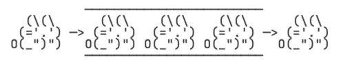
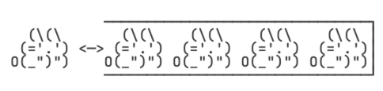
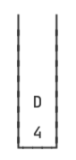
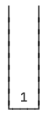
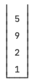
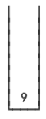

::: details 目录
[[toc]]
:::

栈（Stack）是一种后进先出（LIFO：Last In First Out）的数据结构。

什么是 LIFO 呢？我们先回顾一下 Queue 的特点 FIFO：



所谓 FIFO，是最先进队列的元素一定最早出队列，而 LIFO 是最后进 Stack 的元素一定最早出 Stack。如何做到这一点呢？只需要把队列的一端封死：



因此，Stack 是这样一种数据结构：只能不断地往 Stack 中压入（push）元素，最后进去的必须最早弹出（pop）来：


Stack 只有入栈和出栈的操作：

- 把元素压栈：`push(E)`；
- 把栈顶的元素 “弹出”：`pop()`；
- 取栈顶元素但不弹出：`peek()`。

在 Java 中，我们 _用 Deque 可以实现 Stack_ 的功能：

- 把元素压栈：`push(E)` / `addFirst(E)`；
- 把栈顶的元素 “弹出”：`pop()` / `removeFirst()`；
- 取栈顶元素但不弹出：`peek()` / `peekFirst()`。

> 为什么 Java 的集合类没有单独的 Stack 接口呢？

因为有个遗留类名字就叫 Stack，出于兼容性考虑，所以没办法创建 Stack 接口，只能用 Deque 接口来 “模拟” 一个 Stack 了。

::: warning
当我们把 Deque 作为 Stack 使用时，注意只调用 `push()` / `pop()` / `peek()` 方法，不要调用 `addFirst()` / `removeFirst()` / `peekFirst()` 方法，这样代码更加清晰。

:::

## 🍀 Stack 的作用

Stack 在计算机中使用非常广泛，JVM 在处理 Java 方法调用的时候就会通过栈这种数据结构维护方法调用的层次。例如：

```java
static void main(String[] args) {
    foo(123);
}

static String foo(x) {
    return "F-" + bar(x + 1);
}

static int bar(int x) {
    return x << 2;
}
```

JVM 会创建方法调用栈，每调用一个方法时，先将参数压栈，然后执行对应的方法；当方法返回时，返回值压栈，调用方法通过出栈操作获得方法返回值。

因为方法调用栈有容量限制，嵌套调用过多会造成栈溢出，即引发 StackOverflowError：

```java
// 测试无限递归调用
public class Main {
    public static void main(String[] args) {
        increase(1);
    }

    static int increase(int x) {
        return increase(x) + 1;
    }
}
```

我们再来看一个 Stack 的用途：_对整数进行进制的转换就可以利用栈_。

> 例如，我们要把一个 int 整数 12500 转换为十六进制表示的字符串，如何实现这个功能？

首先我们准备一个空栈：


然后计算 $12500 ÷ 16 = 781 ······ 4$，余数是 4，把余数 4 压栈：


然后计算 $781 ÷ 16 = 48 ······ 13$，余数是 13，13 的十六进制用字母 D 表示，把余数 D 压栈：



然后计算 $48 ÷ 16 = 3 ······ 0$，余数是 0，把余数 0 压栈：


最后计算 $3 ÷ 16 = 0 ······ 3$，余数是 3，把余数 3 压栈：


当商是 0 的时候，计算结束，我们把栈的所有元素依次弹出，组成字符串 $30D4$，这就是十进制整数 12500 的十六进制表示的字符串。

## 🍀 计算中缀表达式

在编写程序的时候，我们使用的带括号的数学表达式实际上是中缀表达式，即运算符在中间，例如： $1 + 2 \times (9 - 5)$ 。

但是计算机执行表达式的时候，它并 **不能** 直接计算中缀表达式，而是通过编译器把中缀表达式转换为 **后缀表达式**，例如： `1 2 9 5 - × +` 。

这个编译过程就会用到栈。我们先跳过编译这一步（涉及运算优先级，代码比较复杂），看看如何通过栈计算后缀表达式。

计算后缀表达式不考虑优先级，直接从左到右依次计算，因此计算起来简单。首先准备一个空的栈：


然后我们依次扫描后缀表达式 `1 2 9 5 - × +`，遇到数字 1，就直接扔到栈里：



紧接着，遇到数字 `2 9 5`，也扔到栈里：



接下来遇到减号时，弹出栈顶的两个元素，并计算 $9 - 5 = 4$，把结果 4 压栈：


接下来遇到 $\times$ 号时，弹出栈顶的两个元素，并计算 $2\times 4=8$，把结果 8 压栈：


接下来遇到 $+$ 号时，弹出栈顶的两个元素，并计算 $1 + 8 = 9$，把结果 9 压栈：



扫描结束后，没有更多的计算了，弹出栈的唯一一个元素，得到计算结果 9。

## 🍀 练习

::: code-tabs

@tab 十六进制转换

```java
// 请利用 Stack 把一个给定的整数转换为十六进制：
import java.util.*;

public class Main {
    public static void main(String[] args) {
        String hex = toHex(12500);
        if (hex.equalsIgnoreCase("30D4")) {
            System.out.println("测试通过");
        } else {
            System.out.println("测试失败");
        }
    }

    static String toHex(int n) {
        // 方法 1
        // Deque<String> deque = new LinkedList<>();
        // String result = "";
        // int hex = 0;
        // while (n > 0){
        //     hex = n % 16;
        //     if (hex >= 10){
        //         switch (hex){
        //             case 10:
        //                 deque.push("A");
        //                 break;
        //             case 11:
        //                 deque.push("B");
        //                 break;
        //             case 12:
        //                 deque.push("C");
        //                 break;
        //             case 13:
        //                 deque.push("D");
        //                 break;
        //             case 14:
        //                 deque.push("E");
        //                 break;
        //             case 15:
        //                 deque.push("F");
        //                 break;
        //         }
        //     }else {
        //         deque.push("" + hex);
        //     }
        //     n = n / 16;
        // }
        // while(!deque.isEmpty()){
        //     result += deque.pop();
        // }
        // return result;

        // 方法 2
        List<String> hexList = Arrays.asList("0", "1", "2", "3", "4", "5", "6", "7", "8", "9", "A", "B", "C", "D", "E", "F");
        Deque<String> stack = new LinkedList<>();
        while (n != 0) {
            stack.push(hexList.get(n % 16));
            n = n / 16;
        }
        StringBuilder sb = new StringBuilder();
        while (stack.peek() != null) {
            sb.append(stack.pop());
        }
        return sb.toString();
    }
}
```

@tab 进阶练习 1

```java
// 请利用 Stack 把字符串中缀表达式编译为后缀表达式，
// 然后再利用栈执行后缀表达式获得计算结果：
// 高难度练习，慎重选择！
import java.util.*;

public class Main {
    public static void main(String[] args) {
        String exp = "1 + 2 * (9 - 5)";
        SuffixExpression se = compile(exp);
        int result = se.execute();
        System.out.println(exp + " = " + result + " " + (result == 1 + 2 * (9 - 5) ? "✓" : "✗"));
    }

    static SuffixExpression compile(String exp) {
        // TODO:
        rDeque<String> stack = new LinkedList<>();
        char[] expCharArr = exp.toCharArray();
        String numStr = "0123456789";
        // 操作符，优先级
        Map<String, Integer> operationMap = new HashMap() {
            {
                put("+", 1);
                put("-", 1);
                put("*", 2);
                put("/", 2);
                put("(", 3);
                put(")", 3);
            }
        };
        StringBuilder sb = new StringBuilder();
        for (char c : expCharArr) {
            if (c == ' ') {
                continue;
            }
            if (numStr.indexOf(c) > 0) {
                // 操作数直接返回
                sb.append(String.valueOf(c));
            } else {
                // 操作符：
                if (stack.peek() == null) {
                    stack.push(String.valueOf(c));
                } else if (")".equals(String.valueOf(c))) {
                    while (stack.peek() != null && !"(".equals(stack.peek())) {
                        sb.append(stack.pop());
                    }
                    if ("(".equals(stack.peek())) {
                        stack.pop();
                    }
                } else if (operationMap.get(String.valueOf(c)) > operationMap.get(stack.peek())) {
                    stack.push(String.valueOf(c));
                } else {
                    while (stack.peek() != null && operationMap.get(String.valueOf(c)) <= operationMap.get(stack.peek())) {
                        if ("(".equals(stack.peek())) {
                            break;
                        } else {
                            sb.append(stack.pop());
                        }
                    }
                    if ("(".equals(stack.peek())) {
                        stack.pop();
                    }
                    stack.push(String.valueOf(c));
                }
            }
        }
        while (stack.peek() != null) {
            sb.append(stack.pop());
        }
        return new SuffixExpression(sb.toString());
    }
}

class SuffixExpression {
    private String executeExpression;

    public SuffixExpression(String executeExpression) {
        this.executeExpression = executeExpression;
    }

    int execute() {
        // TODO:
        Deque<String> stack = new LinkedList<>();
        char[] expCharArr = this.executeExpression.toCharArray();
        String numStr = "0123456789";
        Integer result = 0;
        Integer intA;
        Integer intB;
        for (char c : expCharArr) {
            if (numStr.indexOf(c) > 0) {
                stack.push(String.valueOf(c));
            } else {
                intA = Integer.valueOf(stack.pop());
                intB = Integer.valueOf(stack.pop());
                if ('+' == c) {
                    result = intB + intA;
                } else if ('-' == c) {
                    result = intB - intA;
                } else if ('*' == c) {
                    result = intB * intA;
                } else if ('/' == c) {
                    result = intB / intA;
                }
                stack.push(String.valueOf(result));
            }
        }
        return Integer.valueOf(stack.pop());
    }
}
```

@tab 进阶练习 2

```java
// 请把带变量的中缀表达式编译为后缀表达式，
// 执行后缀表达式时，传入变量的值并获得计算结果：
// 超高难度练习，慎重选择！
import java.util.*;

public class Main {
    public static void main(String[] args) {
        String exp = "x + 2 * (y - 5)";
        SuffixExpression se = compile(exp);
        Map<String, Integer> env = Map.of("x", 1, "y", 9);
        int result = se.execute(env);
        System.out.println(exp + " = " + result + " " + (result == 1 + 2 * (9 - 5) ? "✓" : "✗"));
    }

    public static boolean isOperator(String str){
        if(str!=null && "\\+-*/\\(\\)".indexOf(str)>0){
            return true;
        }else{
            return false;
        }
    }

    static SuffixExpression compile(String exp) {
        // TODO:
        Deque<String> stack = new LinkedList<>();
        char[] expCharArr = exp.toCharArray();
        String numStr = "0123456789";
        Map<String,Integer> operationMap = new HashMap(){
            {
                put("+", 1);
                put("-", 1);
                put("*", 2);
                put("/", 2);
                put("(", 3);
                put(")", 3);
            }
        };
        StringBuilder sb = new StringBuilder();
        for(char c : expCharArr){
            if(c==' '){
                continue;
            }
            if(!isOperator(String.valueOf(c))){
                //操作数直接返回
                sb.append(String.valueOf(c));
            }else{
                //操作符：
                if(stack.peek()==null ){
                    stack.push(String.valueOf(c));
                }else if(")".equals(String.valueOf(c))){
                    while(stack.peek()!=null && !"(".equals(stack.peek())){
                        sb.append(stack.pop());
                    }
                    if("(".equals(stack.peek())){
                        stack.pop();
                    }
                }else if(operationMap.get(String.valueOf(c))>operationMap.get(stack.peek())){
                    stack.push(String.valueOf(c));
                }else{
                    while(stack.peek()!=null && operationMap.get(String.valueOf(c))<=operationMap.get(stack.peek())){
                        if("(".equals(stack.peek())){
                            break;
                        }else{
                            sb.append(stack.pop());
                        }
                    }
                    if("(".equals(stack.peek())){
                        stack.pop();
                    }
                    stack.push(String.valueOf(c));
                }
            }
        }
        while(stack.peek()!=null){
            sb.append(stack.pop());
        }

        return new SuffixExpression(sb.toString());
    }
}

class SuffixExpression {
    private String executeExpression;
    public SuffixExpression(String executeExpression){
        this.executeExpression = executeExpression;
    }
    int execute(Map<String, Integer> env){
        Deque<String> stack = new LinkedList<>();
        char[] expCharArr = this.executeExpression.toCharArray();
        Integer result=0;
        Integer intA;
        Integer intB;
        String A;
        String B;
        for(char c : expCharArr){
            if(!Main.isOperator(String.valueOf(c))){
                stack.push(String.valueOf(c));
            }else{
                A = stack.pop();
                B = stack.pop();
                A = env.get(A)==null? A:env.get(A).toString();
                B = env.get(B)==null? B:env.get(B).toString();
                intA = Integer.valueOf(A);
                intB = Integer.valueOf(B);
                if('+'==c){
                    result = intB + intA;
                }else if('-'==c){
                    result = intB - intA;
                }else if('*'==c){
                    result = intB * intA;
                }else if('/'==c){
                    result = intB / intA;
                }
                stack.push(String.valueOf(result));
            }
        }
        return Integer.valueOf(stack.pop());
    }
}
```

:::

## 🍀 小结

1. 栈（Stack）是一种后进先出（LIFO）的数据结构，操作栈的元素的方法有：

   - 把元素压栈：`push(E)`；
   - 把栈顶的元素 “弹出”：`pop(E)`；
   - 取栈顶元素但不弹出：`peek(E)`。

2. 在 Java 中，我们用 Deque 可以实现 Stack 的功能，注意只调用 `push()` / `pop()` / `peek()` 方法，避免调用 Deque 的其他方法。

3. 最后，**不要** 使用遗留类 Stack。
