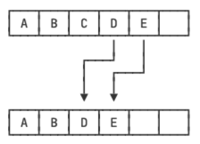
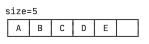
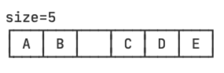
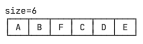
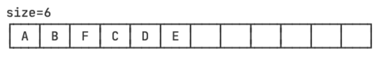
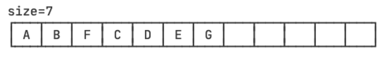

::: details 目录
[[toc]]
:::

在集合类中， `List` 是最基础的一种集合：它是一种 **有序列表**。

`List` 的行为和数组几乎完全相同： `List` 内部按照放入元素的先后顺序存放，每个元素都可以通过索引确定自己的位置， `List` 的索引和数组一样，从 0 开始。

数组和 `List` 类似，也是有序结构，如果我们使用数组，在添加和删除元素的时候，会非常不方便。例如，从一个已有的数组 `{'A', 'B', 'C', 'D', 'E'}` 中删除索引为 `2` 的元素：



这个 “删除” 操作实际上是把 `'C'` 后面的元素依次往前挪一个位置，而 “添加” 操作实际上是把指定位置以后的元素都依次向后挪一个位置，腾出来的位置给新加的元素。这两种操作，用数组实现非常麻烦。

---

因此，在实际应用中，需要增删元素的有序列表，我们使用最多的是 `ArrayList` 。实际上， `ArrayList` 在内部使用了数组来存储所有元素。

例如，一个 `ArrayList` 拥有 5 个元素，实际数组大小为 `6` （即有一个空位）：



当添加一个元素并指定索引到 `ArrayList` 时， `ArrayList` 自动移动需要移动的元素：



然后，往内部指定索引的数组位置添加一个元素，然后把 `size` 加 `1` ：



继续添加元素，但是数组已满，没有空闲位置的时候， `ArrayList` 先创建一个更大的新数组，然后把旧数组的所有元素复制到新数组，紧接着用新数组取代旧数组：



现在，新数组就有了空位，可以继续添加一个元素到数组末尾，同时 `size` 加 `1` ：



可见， `ArrayList` 把添加和删除的操作封装起来，让我们操作 `List` 类似于操作数组，却 _不用关心内部元素如何移动_。

---

我们考察 `List<E>` 接口，可以看到几个主要的接口方法：

- 在末尾添加一个元素： `boolean add(E e)`
- 在指定索引添加一个元素： `boolean add(int index, E e)`
- 删除指定索引的元素： `E remove(int index)`
- 删除某个元素： `boolean remove(Object e)`
- 获取指定索引的元素： `E get(int index)`
- 获取链表大小（包含元素的个数）： `int size()`

但是，实现 `List` 接口并非只能通过数组（即 `ArrayList` 的实现方式）来实现，另一种 `LinkedList` 通过 “链表” 也实现了 `List` 接口。在 `LinkedList` 中，它的内部每个元素都指向下一个元素：


我们来比较一下 `ArrayList` 和 `LinkedList` ：

|                       |  ArrayList   |      LinkedList      |
| --------------------- | :----------: | :------------------: |
| 获取指定元素          |   速度很快   | 需要从头开始查找元素 |
| 添加元素到末尾        |   速度很快   |       速度很快       |
| 在指定位置添加 / 删除 | 需要移动元素 |    不需要移动元素    |
| 内存占用              |      少      |         较大         |

通常情况下，我们总是优先使用 `ArrayList` 。

## 🍀 List 的特点

使用 `List` 时，我们要关注 `List` 接口的规范。 `List` 接口允许我们添加重复的元素，即 `List` 内部的元素可以重复：

```java
import java.util.ArrayList;
import java.util.List;
public class Main {
    public static void main(String[] args) {
        List<String> list = new ArrayList<>();
        list.add("apple"); // size=1
        list.add("pear"); // size=2
        list.add("apple"); // 允许重复添加元素，size=3
        System.out.println(list.size());
    }
}
```

`List` 还允许添加 `null` ：

```java
import java.util.ArrayList;
import java.util.List;
public class Main {
    public static void main(String[] args) {
        List<String> list = new ArrayList<>();
        list.add("apple"); // size=1
        list.add(null); // size=2
        list.add("pear"); // size=3
        String second = list.get(1); // null
        System.out.println(second);
    }
}
```

## 🍀 创建 List

除了使用 `ArrayList` 和 `LinkedList` ，我们还可以通过 `List` 接口提供的 `of()` 方法，根据给定元素快速创建 `List` ：

```java
List<Integer> list = List.of(1, 2, 5);
```

但是 `List.of()` 方法 **不接受 `null` 值**，如果传入 `null` ，会抛出 `NullPointerException` 异常。

## 🍀 遍历 List

和数组类型，我们要遍历一个 `List` ，完全可以用 `for` 循环根据索引配合 `get(int)` 方法遍历：

```java
import java.util.List;
public class Main {
    public static void main(String[] args) {
        List<String> list = List.of("apple", "pear", "banana");
        for (int i = 0; i < list.size(); i++) {
            String s = list.get(i);
            System.out.println(s);
        }
    }
}
```

但这种方式并 **不推荐**，一是代码复杂，二是因为 `get(int)` 方法只有 `ArrayList` 的实现是高效的，换成 `LinkedList` 后，索引越大，访问速度越慢。

---

所以我们要始终坚持使用 **迭代器 `Iterator`** 来访问 `List` 。 `Iterator` 本身也是一个对象，但它是由 `List` 的实例调用 `iterator()` 方法的时候创建的。 `Iterator` 对象知道如何遍历一个 `List` ，并且不同的 `List` 类型，返回的 `Iterator` 对象实现也是不同的，但总是具有最高的访问效率。

`Iterator` 对象有两个方法： `boolean hasNext()` 判断是否有下一个元素， `E next()` 返回下一个元素。因此，使用 `Iterator` 遍历 `List` 代码如下：

```java {6}
import java.util.Iterator;
import java.util.List;
public class Main {
    public static void main(String[] args) {
        List<String> list = List.of("apple", "pear", "banana");
        for (Iterator<String> it = list.iterator(); it.hasNext(); ) {
            String s = it.next();
            System.out.println(s);
        }
    }
}
```

有童鞋可能觉得使用 `Iterator` 访问 `List` 的代码比使用索引更复杂。但是，要记住，_通过 `Iterator` 遍历 `List` 永远是最高效的方式_。

并且，由于 `Iterator` 遍历是如此常用，所以，Java 的 `for each` 循环本身就可以帮我们使用 `Iterator` 遍历。把上面的代码再改写如下：

```java {5}
import java.util.List;
public class Main {
    public static void main(String[] args) {
        List<String> list = List.of("apple", "pear", "banana");
        for (String s : list) {
            System.out.println(s);
        }
    }
}
```

上述代码就是我们编写遍历 `List` 的常见代码。

> 实际上，只要实现了 `Iterable` 接口的集合类都可以直接用 `for each` 循环来遍历，Java 编译器本身并不知道如何遍历集合对象，但它会自动把 `for each` 循环变成 `Iterator` 的调用，原因就在于 `Iterable` 接口定义了一个 `Iterator<E> iterator()` 方法，强迫集合类必须返回一个 `Iterator` 实例。

## 🍀 List 和 Array 转换

把 `List` 变为 `Array` 有三种方法，

1. 第一种是调用 `toArray()` 方法直接返回一个 `Object[]` 数组：

```java
import java.util.List;
public class Main {
    public static void main(String[] args) {
        List<String> list = List.of("apple", "pear", "banana");
        Object[] array = list.toArray();
        for (Object s : array) {
            System.out.println(s);
        }
    }
}
```

这种方法 **会丢失类型信息**，所以实际应用很少。

---

2. 第二种方式是给 `toArray(T[])` 传入一个类型相同的 `Array` ， `List` 内部自动把元素复制到传入的 `Array` 中：

```java {5}
import java.util.List;
public class Main {
    public static void main(String[] args) {
        List<Integer> list = List.of(12, 34, 56);
        Integer[] array = list.toArray(new Integer[3]);
        for (Integer n : array) {
            System.out.println(n);
        }
    }
}
```

注意到这个 `toArray(T[])` 方法的泛型参数 `<T>` 并不是 `List` 接口定义的泛型参数 `<E>` ，所以，我们实际上可以传入其他类型的数组，例如我们传入 `Number` 类型的数组，返回的仍然是 `Number` 类型：

```java {5}
import java.util.List;
public class Main {
    public static void main(String[] args) {
        List<Integer> list = List.of(12, 34, 56);
        Number[] array = list.toArray(new Number[3]);
        for (Number n : array) {
            System.out.println(n);
        }
    }
}
```

但是，如果我们传入类型不匹配的数组，例如， `String[]` 类型的数组，由于 `List` 的元素是 `Integer` ，所以无法放入 `String` 数组，这个方法会抛出 `ArrayStoreException` 。

如果我们传入的数组大小和 `List` 实际的元素个数不一致怎么办？根据 `List` 接口的文档，我们可以知道：

如果传入的数组不够大，那么 `List` 内部会创建一个新的刚好够大的数组，填充后返回；如果传入的数组比 `List` 元素还要多，那么填充完元素后，剩下的数组元素一律填充 `null` 。

实际上，最常用的是传入一个 “恰好” 大小的数组：

```java
Integer[] array = list.toArray(new Integer[list.size()]);
```

3. 最后一种更简洁的写法是通过 `List` 接口定义的 `T[] toArray(IntFunction<T[]> generator)` 方法：

```java
Integer[] array = list.toArray(Integer[]::new);
```

这种函数式写法我们会在后续讲到。

---

反过来，把 `Array` 变为 `List` 就简单多了，通过 `List.of(T...)` 方法最简单：

```java {2}
Integer[] array = { 1, 2, 3 };
List<Integer> list = List.of(array);
```

对于 JDK 11 之前的版本，可以使用 `Arrays.asList(T...)` 方法把数组转换成 `List` 。

要注意的是，返回的 `List` 不一定就是 `ArrayList` 或者 `LinkedList` ，因为 `List` 只是一个接口，如果我们调用 `List.of()` ，它返回的是一个只读 `List` ：

```java
import java.util.List;
public class Main {
    public static void main(String[] args) {
        List<Integer> list = List.of(12, 34, 56);
        list.add(999); // UnsupportedOperationException
    }
}
```

对只读 `List` 调用 `add()`、`remove()` 方法会抛出 `UnsupportedOperationException` 。

## 🍀 练习

给定一组连续的整数，例如：10，11，12，... ，20，但其中缺失一个数字，试找出缺失的数字：

```java {12-14}
import java.util.*;

public class Main {
    public static void main(String[] args) {
        // 构造从 start 到 end 的序列：
        final int start = 10;
        final int end = 20;
        List<Integer> list = new ArrayList<>();
        for (int i = start; i <= end; i++) {
            list.add(i);
        }
        // 增强版：整数不再有序，试找出缺失的数字：
        // 洗牌算法 shuffle 可以随机交换 List 中的元素位置:
        Collections.shuffle(list);
        // 随机删除 List 中的一个元素:
        int removed = list.remove((int) (Math.random() * list.size()));
        int found = findMissingNumber(start, end, list);
        System.out.println(list.toString());
        System.out.println("missing number:" + found);
        System.out.println(removed == found ? "测试成功" : "测试失败");
    }
    static int findMissingNumber(int start, int end, List<Integer> list) {
        return 0;
    }
}
```

> 解法：

```java
    // 找出从 start 到 end 的缺失的数字并返回
    static int findMissingNumber(int start, int end, List<Integer> list) {
        // 方法 1
        for (Integer i = start; i <= end ; i++){
            if (list.contains(i)){
                continue;
            }
            return i;
        }
        return 0;
        // 方法 2
        // // 计算从 start 到 end 所有数字的理论总和
        // int expectedSum = (end - start + 1) * (start + end) / 2;
        // // 计算 list 中所有元素的实际总和
        // int actualSum = 0;
        // for (int num : list) {
        //     actualSum += num;
        // }
        // // 理论总和减去实际总和即为缺失的数字
        // return expectedSum - actualSum;
    }
```

## 🍀 小结

- `List` 是按索引顺序访问的长度可变的有序表，优先使用 `ArrayList` 而不是 `LinkedList` ；
- 可以直接使用 `for each` 遍历 `List` ；
- `List` 可以和 `Array` 相互转换。
