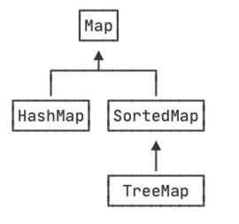

::: details 目录
[[toc]]
:::

我们已经知道，`HashMap` 是一种以空间换时间的映射表，它的实现原理决定了内部的 Key 是无序的，即遍历 `HashMap` 的 Key 时，其顺序是不可预测的（但每个 Key 都会遍历一次且仅遍历一次）。

还有一种 `Map`，它 _在内部会对 Key 进行排序_，这种 `Map` 就是 `SortedMap` 。注意到 `SortedMap` 是接口，它的实现类是 `TreeMap` 。



`SortedMap` 保证遍历时以 Key 的顺序来进行排序。例如，放入的 Key 是 `"apple"`、`"pear"`、`"orange"`，遍历的顺序一定是 `"apple"`、`"orange"`、`"pear"`，因为 `String` 默认按字母排序：

```java
import java.util.*;
public class Main {
    public static void main(String[] args) {
        Map<String, Integer> map = new TreeMap<>();
        map.put("orange", 1);
        map.put("apple", 2);
        map.put("pear", 3);
        for (String key : map.keySet()) {
            System.out.println(key);
        }
        // apple, orange, pear
    }
}
```

使用 `TreeMap` 时，放入的 Key 必须实现 `Comparable` 接口。`String`、`Integer` 这些类已经实现了 `Comparable` 接口，因此可以直接作为 Key 使用。作为 Value 的对象则没有任何要求。

如果作为 Key 的 class 没有实现 `Comparable` 接口，那么，必须在创建 `TreeMap` 时同时指定一个自定义排序算法：

```java {5-9}
import java.util.*;

public class Main {
    public static void main(String[] args) {
        Map<Person, Integer> map = new TreeMap<>(new Comparator<Person>() {
            public int compare(Person p1, Person p2) {
                return p1.name.compareTo(p2.name);
            }
        });
        map.put(new Person("Tom"), 1);
        map.put(new Person("Bob"), 2);
        map.put(new Person("Lily"), 3);
        for (Person key : map.keySet()) {
            System.out.println(key);
        }
        // {Person: Bob}, {Person: Lily}, {Person: Tom}
        System.out.println(map.get(new Person("Bob"))); // 2
    }
}

class Person {
    public String name;
    Person(String name) {
        this.name = name;
    }
    public String toString() {
        return "{Person: " + name + "}";
    }
}
```

注意到 `Comparator` 接口要求实现一个比较方法，它负责比较传入的两个元素 `a` 和 `b`，如果 `a < b`，则返回负数，通常是 `-1`，如果 `a == b`，则返回 `0`，如果 `a > b`，则返回正数，通常是 `1` 。`TreeMap` 内部根据比较结果对 Key 进行排序。

从上述代码执行结果可知，打印的 Key 确实是按照 `Comparator` 定义的顺序排序的。如果要根据 Key 查找 Value，我们可以传入一个 `new Person("Bob")` 作为 Key，它会返回对应的 `Integer` 值 `2` 。

另外，注意到 `Person` 类并未覆写 `equals()` 和 `hashCode()`，因为 _`TreeMap` 不使用 `equals()` 和 `hashCode()`_。

我们来看一个稍微复杂的例子：这次我们定义了 `Student` 类，并用分数 `score` 进行排序，高分在前：

```java {5-9}
import java.util.*;

public class Main {
    public static void main(String[] args) {
        Map<Student, Integer> map = new TreeMap<>(new Comparator<Student>() {
            public int compare(Student p1, Student p2) {
                return p1.score > p2.score ? -1 : 1;
            }
        });
        map.put(new Student("Tom", 77), 1);
        map.put(new Student("Bob", 66), 2);
        map.put(new Student("Lily", 99), 3);
        for (Student key : map.keySet()) {
            System.out.println(key);
        }
        System.out.println(map.get(new Student("Bob", 66))); // null?
    }
}

class Student {
    public String name;
    public int score;
    Student(String name, int score) {
        this.name = name;
        this.score = score;
    }
    public String toString() {
        return String.format("{%s: score=%d}", name, score);
    }
}
```

在 `for` 循环中，我们确实得到了正确的顺序。但是，且慢！根据相同的 Key： `new Student("Bob", 66)` 进行查找时，结果为 `null` ！

这是怎么肥四？难道 `TreeMap` 有问题？遇到 `TreeMap` 工作不正常时，我们首先回顾 Java 编程基本规则：出现问题，不要怀疑 Java 标准库，要从自身代码找原因。

在这个例子中，`TreeMap` 出现问题，原因其实出在这个 `Comparator` 上：

```java
public int compare(Student p1, Student p2) {
    return p1.score > p2.score ? -1 : 1;
}
```

在 `p1.score` 和 `p2.score` 不相等的时候，它的返回值是正确的，但是，在 `p1.score` 和 `p2.score` 相等的时候，它并没有返回 `0` ！这就是为什么 `TreeMap` 工作不正常的原因： `TreeMap` 在比较两个 Key 是否相等时，依赖 Key 的 `compareTo()` 方法或者 `Comparator.compare()` 方法。在两个 Key 相等时，必须返回 `0` 。因此，修改代码如下：

```java
public int compare(Student p1, Student p2) {
    if (p1.score == p2.score) {
        return 0;
    }
    return p1.score > p2.score ? -1 : 1;
}
```

或者直接借助 `Integer.compare(int, int)` 也可以返回正确的比较结果。

## 🍀 小结

- `SortedMap` 在遍历时严格按照 Key 的顺序遍历，最常用的实现类是 `TreeMap` ；

- 作为 `SortedMap` 的 Key 必须实现 `Comparable` 接口，或者传入 `Comparator` ；

- 要严格按照 `compare()` 规范实现比较逻辑，否则，`TreeMap` 将不能正常工作。
