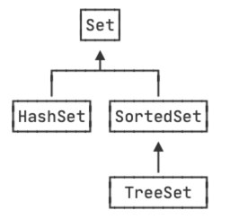

::: details 目录
[[toc]]
:::

我们知道，`Map` 用于存储 key-value 的映射，对于充当 key 的对象，是不能重复的，并且，不但需要正确覆写 `equals()` 方法，还要正确覆写 `hashCode()` 方法。

如果我们只需要存储不重复的 key ，并不需要存储映射的 value，那么就可以使用 `Set` 。

`Set` 用于存储不重复的元素集合，它主要提供以下几个方法：

- 将元素添加进 `Set<E>` ： `boolean add(E e)`
- 将元素从 `Set<E>` 删除： `boolean remove(Object e)`
- 判断是否包含元素： `boolean contains(Object e)`

我们来看几个简单的例子：

```java
import java.util.*;

public class Main {
    public static void main(String[] args) {
        Set<String> set = new HashSet<>();
        System.out.println(set.add("abc")); // true
        System.out.println(set.add("xyz")); // true
        System.out.println(set.add("xyz")); // false，添加失败，因为元素已存在
        System.out.println(set.contains("xyz")); // true，元素存在
        System.out.println(set.contains("XYZ")); // false，元素不存在
        System.out.println(set.remove("hello")); // false，删除失败，因为元素不存在
        System.out.println(set.size()); // 2，一共两个元素
    }
}
```

`Set` 实际上相当于只存储 key 、不存储 value 的 `Map` 。我们经常用 `Set` 用于去除重复元素。

因为放入 `Set` 的元素和 `Map` 的 key 类似，都要正确实现 `equals()` 和 `hashCode()` 方法，否则该元素无法正确地放入 `Set` 。

最常用的 `Set` 实现类是 `HashSet`，实际上，`HashSet` 仅仅是对 `HashMap` 的一个简单封装，它的核心代码如下：

```java
public class HashSet<E> implements Set<E> {
    // 持有一个 HashMap:
    private HashMap<E, Object> map = new HashMap<>();

    // 放入 HashMap 的 value:
    private static final Object PRESENT = new Object();

    public boolean add(E e) {
        return map.put(e, PRESENT) == null;
    }

    public boolean contains(Object o) {
        return map.containsKey(o);
    }

    public boolean remove(Object o) {
        return map.remove(o) == PRESENT;
    }
}
```

`Set` 接口并不保证有序，而 `SortedSet` 接口则保证元素是有序的：

- `HashSet` 是无序的，因为它实现了 `Set` 接口，并没有实现 `SortedSet` 接口；
- `TreeSet` 是有序的，因为它实现了 `SortedSet` 接口。

用一张图表示：



我们来看 `HashSet` 的输出：

```java
import java.util.*;
public class Main {
    public static void main(String[] args) {
        Set<String> set = new HashSet<>();
        set.add("apple");
        set.add("banana");
        set.add("pear");
        set.add("orange");
        for (String s : set) {
            System.out.println(s);
        }
    }
}
```

注意输出的顺序既不是添加的顺序，也不是 `String` 排序的顺序，在不同版本的 JDK 中，这个顺序也可能是不同的。

把 `HashSet` 换成 `TreeSet`，在遍历 `TreeSet` 时，输出就是有序的，这个顺序是元素的排序顺序：

```java
import java.util.*;
public class Main {
    public static void main(String[] args) {
        Set<String> set = new TreeSet<>();
        set.add("apple");
        set.add("banana");
        set.add("pear");
        set.add("orange");
        for (String s : set) {
            System.out.println(s);
        }
    }
}
```

使用 `TreeSet` 和使用 `TreeMap` 的要求一样，添加的元素必须正确实现 `Comparable` 接口，如果没有实现 `Comparable` 接口，那么创建 `TreeSet` 时必须传入一个 `Comparator` 对象。

## 🍀 练习

在聊天软件中，发送方发送消息时，遇到网络超时后就会自动重发，因此，接收方可能会收到重复的消息，在显示给用户看的时候，需要首先去重。请练习使用 `Set` 去除重复的消息：

```java
import java.util.*;

public class Main {
    public static void main(String[] args) {
        List<Message> received = List.of(
            new Message(1, "Hello!"),
            new Message(2, "发工资了吗？"),
            new Message(2, "发工资了吗？"),
            new Message(3, "去哪吃饭？"),
            new Message(3, "去哪吃饭？"),
            new Message(4, "Bye")
        );
        List<Message> displayMessages = process(received);
        for (Message message : displayMessages) {
            System.out.println(message.text);
        }
    }

    static List<Message> process(List<Message> received) {
        // TODO: 按sequence去除重复消息
        return received;
    }
}

class Message {
    public final int sequence;
    public final String text;
    public Message(int sequence, String text) {
        this.sequence = sequence;
        this.text = text;
    }
}
```

## 🍀 小结

1. `Set` 用于存储不重复的元素集合：
   - 放入 `HashSet` 的元素与作为 `HashMap` 的 key 要求相同；
   - 放入 `TreeSet` 的元素与作为 `TreeMap` 的 Key 要求相同；
2. 利用 `Set` 可以去除重复元素；
3. 遍历 `SortedSet` 按照元素的排序顺序遍历，也可以自定义排序算法。
