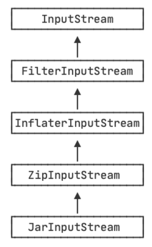

::: details 目录
[[toc]]
:::

ZipInputStream 是一种 FilterInputStream，它可以直接读取 zip 包的内容：



另一个 JarInputStream 是从 ZipInputStream 派生，它增加的主要功能是直接读取 jar 文件里面的 `MANIFEST.MF` 文件。因为本质上 jar 包就是 zip 包，只是额外附加了一些固定的描述文件。

## 🍀 读取 zip 包

我们来看看 ZipInputStream 的基本用法。

我们要创建一个 ZipInputStream，通常是传入一个 FileInputStream 作为数据源，然后，循环调用 `getNextEntry()`，直到返回 `null`，表示 zip 流结束。

一个 ZipEntry 表示一个压缩文件或目录，如果是压缩文件，我们就用 `read()` 方法不断读取，直到返回 `-1`：

```java {3,7}
try (ZipInputStream zip = new ZipInputStream(new FileInputStream(...))) {
    ZipEntry entry = null;
    while ((entry = zip.getNextEntry()) != null) {
        String name = entry.getName();
        if (!entry.isDirectory()) {
            int n;
            while ((n = zip.read()) != -1) {
                ...
            }
        }
    }
}
```

## 🍀 写入 zip 包

ZipOutputStream 是一种 FilterOutputStream，它可以直接写入内容到 zip 包。我们要先创建一个 ZipOutputStream，通常是包装一个 FileOutputStream，然后，每写入一个文件前，先调用 `putNextEntry()`，然后用 `write()` 写入 `byte[]` 数据，写入完毕后调用 `closeEntry()` 结束这个文件的打包。

```java {4-6}
try (ZipOutputStream zip = new ZipOutputStream(new FileOutputStream(...))) {
    File[] files = ...
    for (File file : files) {
        zip.putNextEntry(new ZipEntry(file.getName()));
        zip.write(Files.readAllBytes(file.toPath()));
        zip.closeEntry();
    }
}
```

上面的代码没有考虑文件的目录结构。如果要实现目录层次结构，`new ZipEntry(name)` 传入的 `name` 要用相对路径。

## 🍀 小结

- ZipInputStream 可以读取 zip 格式的流，ZipOutputStream 可以把多份数据写入 zip 包；

- 配合 FileInputStream 和 FileOutputStream 就可以读写 zip 文件。
