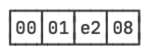
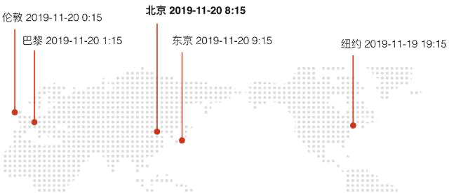

::: details 目录
[[toc]]
:::

在计算机中，应该如何表示日期和时间呢？

我们经常看到的日期和时间表示方式如下：

- `2019-11-20 0:15:00 GMT+00:00`
- `2019 年 11 月 20 日 8:15:00`
- `11/19/2019 19:15:00 America/New_York`

如果直接以字符串的形式存储，那么不同的格式，不同的语言会让表示方式非常繁琐。

在理解日期和时间的表示方式之前，我们先要理解数据的存储和展示。

当我们定义一个整型变量并赋值时：

```java
int n = 123400;
```

编译器会把上述字符串（程序源码就是一个字符串）编译成字节码。在程序的运行期，变量 `n` 指向的内存实际上是一个 `4` 字节区域：



注意到计算机内存除了二进制的 0/1 外没有其他任何格式。上述十六机制是为了简化表示。

当我们用 `System.out.println(n)` 打印这个整数的时候，实际上 `println()` 这个方法在内部把 `int` 类型转换成 `String` 类型，然后打印出字符串 `123400` 。

类似的，我们也可以以十六进制的形式打印这个整数，或者，如果 `n` 表示一个价格，我们就以 `$123,400.00` 的形式来打印它：

```java
import java.text.*;
import java.util.*;

public class Main {
    public static void main(String[] args) {
        int n = 123400;

        System.out.println(n);// 123400

        System.out.println(Integer.toHexString(n));// 1e208

        System.out.println(NumberFormat.getCurrencyInstance(Locale.US).format(n));// $123,400.00
    }
}
```

可见，整数 `123400` 是数据的存储格式，它的存储格式非常简单。而我们打印的各种各样的字符串，则是数据的展示格式。展示格式有多种形式，但本质上它就是一个转换方法：

```java
String toDisplay(int n) { ... }
```

理解了数据的存储和展示，我们回头看看以下几种日期和时间：

- `2019-11-20 0:15:01 GMT+00:00`
- `2019 年 11 月 20 日 8:15:01`
- `11/19/2019 19:15:01 America/New_York`

它们实际上是数据的展示格式，分别按英国时区、中国时区、纽约时区对同一个时刻进行展示。而这个 “同一个时刻” 在计算机中存储的本质上只是一个整数，我们称它为 `Epoch Time` 。

`Epoch Time` 是计算从 1970 年 1 月 1 日零点（格林威治时区／GMT+00:00）到现在所经历的秒数，例如：

`1574208900` 表示从从 1970 年 1 月 1 日零点 GMT 时区到该时刻一共经历了 `1574208900` 秒，换算成伦敦、北京和纽约时间分别是：

```
1574208900 = 北京时间 2019-11-20 8:15:00
           = 伦敦时间 2019-11-20 0:15:00
           = 纽约时间 2019-11-19 19:15:00
```



因此，在计算机中，只需要存储一个整数 `1574208900` 表示某一时刻。当需要显示为某一地区的当地时间时，我们就把它格式化为一个字符串：

```java
String displayDateTime(int n, String timezone) { ... }
```

`Epoch Time` 又称为**时间戳**，在不同的编程语言中，会有几种存储方式：

- 以秒为单位的整数： `1574208900`，缺点是精度只能到秒；
- 以毫秒为单位的整数： `1574208900123`，最后 3 位表示毫秒数；
- 以秒为单位的浮点数： `1574208900.123`，小数点后面表示零点几秒。

它们之间转换非常简单。而在 Java 程序中，时间戳通常是用 long 表示的毫秒数，即：

```java
long t = 1574208900123L;
```

转换成北京时间就是 `2019-11-20T8:15:00.123` 。要获取当前时间戳，可以使用 `System.currentTimeMillis()`，这是 Java 程序获取时间戳最常用的方法。

## 🍀 标准库 API

我们再来看一下 Java 标准库提供的 API 。Java 标准库有两套处理日期和时间的 API ：

- 一套定义在 `java.util` 这个包里面，主要包括 `Date`、`Calendar` 和 `TimeZone` 这几个类；
- 一套新的 API 是在 Java 8 引入的，定义在 `java.time` 这个包里面，主要包括 `LocalDateTime`、`ZonedDateTime`、`ZoneId` 等。

为什么会有新旧两套 API 呢？因为历史遗留原因，旧的 API 存在很多问题，所以引入了新的 API 。

那么我们能不能跳过旧的 API 直接用新的 API 呢？如果涉及到遗留代码就不行，因为很多遗留代码仍然使用旧的 API ，所以目前仍然需要对旧的 API 有一定了解，很多时候还需要在新旧两种对象之间进行转换。

本节我们快速讲解旧 API 的常用类型和方法。

## 🍀 Date

`java.util.Date` 是用于表示一个日期和时间的对象，注意与 `java.sql.Date` 区分，后者用在数据库中。如果观察 Date 的源码，可以发现它实际上存储了一个 `long` 类型的以毫秒表示的时间戳：

```java
public class Date implements Serializable, Cloneable, Comparable<Date> {

    private transient long fastTime;

    ...
}
```

我们来看 Date 的基本用法：

```java
import java.util.*;

public class Main {
    public static void main(String[] args) {
        // 获取当前时间:
        Date date = new Date();
        System.out.println(date.getYear() + 1900); // 必须加上1900
        System.out.println(date.getMonth() + 1); // 0~11，必须加上1
        System.out.println(date.getDate()); // 1~31，不能加1
        // 转换为String:
        System.out.println(date.toString());
        // 转换为GMT时区:
        System.out.println(date.toGMTString());
        // 转换为本地时区:
        System.out.println(date.toLocaleString());
    }
}
```

注意 `getYear()` 返回的年份必须加上 `1900`，`getMonth()` 返回的月份是 `0~11` 分别表示 `1~12` 月，所以要加 `1`，而 `getDate()` 返回的日期范围是 `1~31`，又不能加 `1` 。

打印本地时区表示的日期和时间时，不同的计算机可能会有不同的结果。如果我们想要针对用户的偏好精确地控制日期和时间的格式，就可以使用 `SimpleDateFormat` 对一个 `Date` 进行转换。它用预定义的字符串表示格式化：

- `yyyy` ：年
- `MM` ：月
- `dd` : 日
- `HH` : 小时
- `mm` : 分钟
- `ss` : 秒

我们来看如何以自定义的格式输出：

```java
import java.text.*;
import java.util.*;

public class Main {
    public static void main(String[] args) {
        // 获取当前时间:
        Date date = new Date();
        var sdf = new SimpleDateFormat("yyyy-MM-dd HH:mm:ss");
        System.out.println(sdf.format(date));
    }
}
```

Java 的格式化预定义了许多不同的格式，我们以 MMM 和 E 为例：

```java
import java.text.*;
import java.util.*;

public class Main {
    public static void main(String[] args) {
        // 获取当前时间:
        Date date = new Date();
        var sdf = new SimpleDateFormat("E MMM dd, yyyy");
        System.out.println(sdf.format(date));
    }
}
```

上述代码在不同的语言环境会打印出类似 Sun Sep 15, 2019 这样的日期。可以从 JDK 文档查看详细的格式说明。一般来说，**字母越长，输出越长。** 以 M 为例，假设当前月份是 9 月：

- `M` ：输出 9
- `MM` ：输出 09
- `MMM` ：输出 Sep
- `MMMM` ：输出 September

Date 对象有几个严重的问题： **它不能转换时区** ，除了 `toGMTString()` 可以按 `GMT+0:00` 输出外，`Date` 总是以当前计算机系统的默认时区为基础进行输出。此外，我们也很难对日期和时间进行加减，计算两个日期相差多少天，计算某个月第一个星期一的日期等。

## 🍀 Calendar

Calendar 可以用于获取并设置年、月、日、时、分、秒，它和 Date 比，主要多了一个**可以做简单的日期和时间运算**的功能。

我们来看 Calendar 的基本用法：

```java
import java.util.*;

public class Main {
    public static void main(String[] args) {
        // 获取当前时间:
        Calendar c = Calendar.getInstance();
        int y = c.get(Calendar.YEAR);
        int m = 1 + c.get(Calendar.MONTH);
        int d = c.get(Calendar.DAY_OF_MONTH);
        int w = c.get(Calendar.DAY_OF_WEEK);
        int hh = c.get(Calendar.HOUR_OF_DAY);
        int mm = c.get(Calendar.MINUTE);
        int ss = c.get(Calendar.SECOND);
        int ms = c.get(Calendar.MILLISECOND);
        System.out.println(y + "-" + m + "-" + d + " " + w + " " + hh + ":" + mm + ":" + ss + "." + ms);
    }
}
```

注意到 Calendar 获取年月日这些信息变成了 `get(int field)`，返回的年份不必转换，返回的月份仍然要加 1 ，返回的星期要特别注意，1~7 分别表示周日，周一，……，周六。

Calendar 只有一种方式获取，即 `Calendar.getInstance()`，而且**一获取到就是当前时间**。如果我们想给它设置成特定的一个日期和时间，就必须先清除所有字段：

```java
import java.text.*;
import java.util.*;

public class Main {
    public static void main(String[] args) {
        // 当前时间:
        Calendar c = Calendar.getInstance();
        // 清除所有:
        c.clear();
        // 设置2019年:
        c.set(Calendar.YEAR, 2019);
        // 设置9月:注意8表示9月:
        c.set(Calendar.MONTH, 8);
        // 设置2日:
        c.set(Calendar.DATE, 2);
        // 设置时间:
        c.set(Calendar.HOUR_OF_DAY, 21);
        c.set(Calendar.MINUTE, 22);
        c.set(Calendar.SECOND, 23);
        System.out.println(new SimpleDateFormat("yyyy-MM-dd HH:mm:ss").format(c.getTime()));
        // 2019-09-02 21:22:23
    }
}
```

利用 `Calendar.getTime()` 可以将一个 Calendar 对象转换成 Date 对象，然后就可以用 `SimpleDateFormat` 进行格式化了。

## 🍀 TimeZone

Calendar 和 Date 相比，它提供了**时区转换**的功能。时区用 TimeZone 对象表示：

```java
import java.util.*;

public class Main {
    public static void main(String[] args) {
        TimeZone tzDefault = TimeZone.getDefault(); // 当前时区
        TimeZone tzGMT9 = TimeZone.getTimeZone("GMT+09:00"); // GMT+9:00时区
        TimeZone tzNY = TimeZone.getTimeZone("America/New_York"); // 纽约时区
        System.out.println(tzDefault.getID()); // Asia/Shanghai
        System.out.println(tzGMT9.getID()); // GMT+09:00
        System.out.println(tzNY.getID()); // America/New_York
    }
}
```

时区的唯一标识是以字符串表示的 ID ，我们获取指定 TimeZone 对象也是以这个 ID 为参数获取，GMT+09:00、 Asia/Shanghai 都是有效的时区 ID 。要列出系统支持的所有 ID ，请使用 `TimeZone.getAvailableIDs()` 。

有了时区，我们就可以对指定时间进行转换。例如，下面的例子演示了如何将北京时间 2019-11-20 8:15:00 转换为纽约时间：

```java
import java.text.*;
import java.util.*;

public class Main {
    public static void main(String[] args) {
        // 当前时间:
        Calendar c = Calendar.getInstance();
        // 清除所有:
        c.clear();
        // 设置为北京时区:
        c.setTimeZone(TimeZone.getTimeZone("Asia/Shanghai"));
        // 设置年月日时分秒:
        c.set(2019, 10 /* 11月 */, 20, 8, 15, 0);
        // 显示时间:
        var sdf = new SimpleDateFormat("yyyy-MM-dd HH:mm:ss");
        sdf.setTimeZone(TimeZone.getTimeZone("America/New_York"));
        System.out.println(sdf.format(c.getTime()));
        // 2019-11-19 19:15:00
    }
}
```

可见，利用 Calendar 进行时区转换的步骤是：

1. 清除所有字段；
2. 设定指定时区；
3. 设定日期和时间；
4. 创建 SimpleDateFormat 并设定目标时区；
5. 格式化获取的 Date 对象（注意 Date 对象无时区信息，时区信息存储在 SimpleDateFormat 中）。

因此，本质上时区转换只能通过 `SimpleDateFormat` 在显示的时候完成。

Calendar 也可以对日期和时间进行简单的加减：

```java
import java.text.*;
import java.util.*;

public class Main {
    public static void main(String[] args) {
        // 当前时间:
        Calendar c = Calendar.getInstance();
        // 清除所有:
        c.clear();
        // 设置年月日时分秒:
        c.set(2019, 10 /* 11月 */, 20, 8, 15, 0);
        // 加5天并减去2小时:
        c.add(Calendar.DAY_OF_MONTH, 5);
        c.add(Calendar.HOUR_OF_DAY, -2);
        // 显示时间:
        var sdf = new SimpleDateFormat("yyyy-MM-dd HH:mm:ss");
        Date d = c.getTime();
        System.out.println(sdf.format(d));
        // 2019-11-25 6:15:00
    }
}
```

## 🍀 小结

计算机表示的时间是以整数表示的时间戳存储的，即 Epoch Time ，Java 使用 long 型来表示以毫秒为单位的时间戳，通过 `System.currentTimeMillis()` 获取当前时间戳。

Java 有两套日期和时间的 API：

- 旧的 Date、Calendar 和 TimeZone；
- 新的 LocalDateTime、 ZonedDateTime、 ZoneId 等。

分别位于 `java.util` 和 `java.time` 包中。
