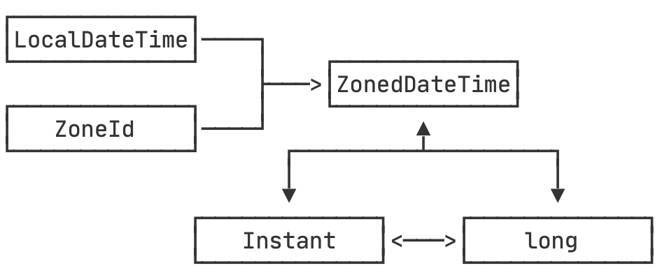

::: details 目录
[[toc]]
:::

我们已经讲过，计算机存储的当前时间，本质上只是一个不断递增的整数。Java 提供的 `System.currentTimeMillis()` 返回的就是以毫秒表示的当前时间戳。

这个当前时间戳在 java.time 中以 `Instant` 类型表示，我们用 `Instant.now()` 获取当前时间戳，效果和 `System.currentTimeMillis()` 类似：

```java
import java.time.*;

public class Main {
    public static void main(String[] args) {
        Instant now = Instant.now();
        System.out.println(now.getEpochSecond()); // 秒
        System.out.println(now.toEpochMilli()); // 毫秒
    }
}
```

打印的结果类似：

```
1568568760
1568568760316
```

实际上，`Instant` 内部只有两个核心字段：

```java
public final class Instant implements ... {
    private final long seconds;
    private final int nanos;
}
```

一个是以秒为单位的时间戳，一个是更精确的纳秒精度。它和 `System.currentTimeMillis()` 返回的 long 相比，只是多了更高精度的纳秒。

既然 `Instant` 就是时间戳，那么，给它附加上一个时区，就可以创建出 `ZonedDateTime` ：

```java
// 以指定时间戳创建 Instant:
Instant ins = Instant.ofEpochSecond(1568568760);
ZonedDateTime zdt = ins.atZone(ZoneId.systemDefault());
System.out.println(zdt); // 2019-09-16T01:32:40+08:00[Asia/Shanghai]
```

可见，对于某一个时间戳，给它关联上指定的 `ZoneId`，就得到了 `ZonedDateTime`，继而可以获得了对应时区的 `LocalDateTime` 。

所以，`LocalDateTime`，`ZoneId`，`Instant`，`ZonedDateTime` 和 `long` 都可以互相转换：



转换的时候，只需要留意 `long` 类型以毫秒还是秒为单位即可。

## 🍀 小结

`Instant` 表示高精度时间戳，它可以和 `ZonedDateTime` 以及 `long` 互相转换。
