::: details 目录
[[toc]]
:::

## 流程

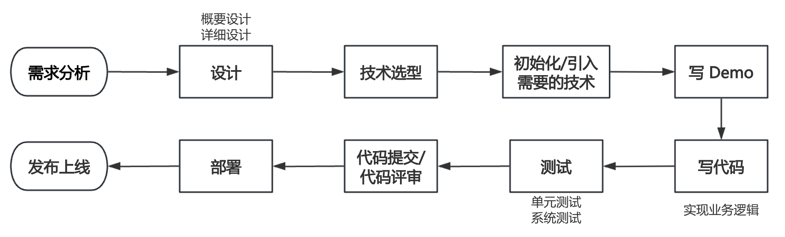

### 1 需求分析

1. 登录 / 注册
2. 用户管理（仅管理员可见）对用户的查询或者修改
3. 用户校验（仅用户可见）

### 2 技术选型

前端：三件套 + React + Ant Design（组件库） + Umi（框架） + Ant Design Pro（现成的管理系统）

后端：

- java
- spring（依赖注入框架，帮助你管理 Java 对象，集成一些其他的内容）
- springmvc（web 框架，提供接口访问、restful 接口等能力）
- mybatis（Java 操作数据库的框架，持久层框架，对 jdbc 的封装）
- mybatis-plus（对 mybatis 的增强，不用写 sql 也能实现增删改查）
- springboot（**快速启动** / 快速集成项目。不用自己管理 spring 配置，不用自己整合各种框架）
- junit 单元测试库
- mysql 数据库

部署：服务器 / 容器（平台）

### 3 初始化 Java 项目的方式

1. GitHub 搜现成的代码
2. SpringBoot 官方的模板生成器（https://start.spring.io/）
3. 直接在 IDEA 开发工具中生成 ✔

如果要引入 java 的包，可以去 maven 中心仓库寻找（http://mvnrepository.com/）

## 开发

### 一、初始化项目

#### 1. 前端初始化

1. [官网](https://nodejs.org/zh-cn) 下载 node.js (16.x 稳定版本)
   > 本次使用的是 v16.20.2

2. [Ant Design Pro](https://pro.ant.design/zh-CN)

3. 新建项目文件夹，终端打开，初始化项目

首先需要安装 yarn ：

```bash
# node.js >=16.10
corepack enable
# Node.js <16.10
npm i -g corepack
# 检验
yarn -v
```

初始化 Ant Design Pro 脚手架 (很多操作需 sudo 授权，部分报错跟未安装 git 有关)，[参考这里](#umi-ui)

```bash
# yarn create umi myapp
# 安装老版本的脚手架
❯ npm i @ant-design/pro-cli@3.1.0 -g
```

```bash
❯ pro -v
3.0.1

❯ pro create frontuc
? 🐂 使用 umi@4 还是 umi@3 ? umi@3
? 🚀 要全量的还是一个简单的脚手架? complete
> 🙈 complete mode can only use the version of antd@4
正克隆到 'frontuc'...
remote: Enumerating objects: 418, done.
remote: Counting objects: 100% (418/418), done.
remote: Compressing objects: 100% (354/354), done.
remote: Total 418 (delta 76), reused 255 (delta 45), pack-reused 0
接收对象中: 100% (418/418), 444.85 KiB | 385.00 KiB/s, 完成.
处理 delta 中: 100% (76/76), 完成.
> 🚚 clone success
> Clean up...

No change to package.json was detected. No package manager install will be executed.
```

1. 开发工具安装
WebStorm（前端），IDEA（后端）

1. 安装依赖
使用开发工具打开项目，打开工具内的终端，输入：

```bash
yarn
```

自动安装依赖

3. 启动项目
找到 package.json 中的 start ，点击左侧的绿色运行按钮

4. 安装 Umi UI（可以自动生成代码的工具）

```bash
yarn add @umijs/preset-ui -D
```

5. 项目瘦身

1. .vscode 可能是配置 vscode 的一些插件
2. config 存储一些配置（本地代理、路由）
- oneapi.json 定义了项目用到的一些接口（删）
3. dist _最终部署项目就已经编译好的项目目录_
4. mock 模拟数据存放的地方（假数据）
5. public 存放一些静态资源（logo、音视频等）
6. src 平时写代码常用目录
7. components 存放组件
8. e2e （集成）测试，可以删除
9. pages 存放页面
10. locales 国际化组件（即翻译，删）
 1. package.json 中提供了移除脚本： i18n-remove ，点击运行即可，然后删除该文件夹
11. services
 - swagger 接口文档工具（删）
12. tests 测试
13. app.tsx 项目的入口，整个前端项目的启动离不开这个文件
14. global.tsx 全局的脚本文件
15. service-worker.js 前端一些界面的缓存
16. typings.d.ts 定义了一些 ts 的类型
17. .editorconfig 编辑器的配置（例如自动格式化）
18. .prettierrc.js 美化代码工具
19. .eslintrc.js 检查 js 语法
20. jest.config.js 测试工具
21. .stylelintrc.js 检验 css 语法
22. playwright.config.ts 自动化测试工具

> 删除文件时，要记得这个文件有没有被其他地方引用

#### 2. 后端初始化

##### 准备环境（ MySQL 之类的）

验证 MySQL 是否安装成功 - 连接一下

Database - ➕ - MySQL

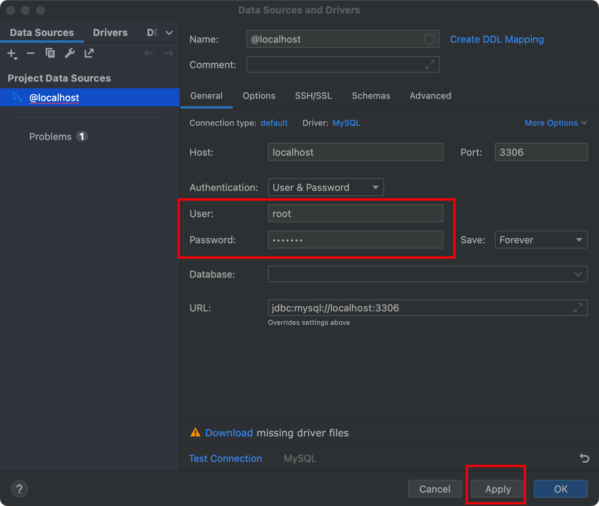

##### 初始化后端项目

1. GitHub 上搜索现成的 [SpringBoot-Templates 模板](https://github.com/search?q=springboot-templates)（不推荐）
2. [SpringBoot 官方的模板生成器](https://start.spring.io)
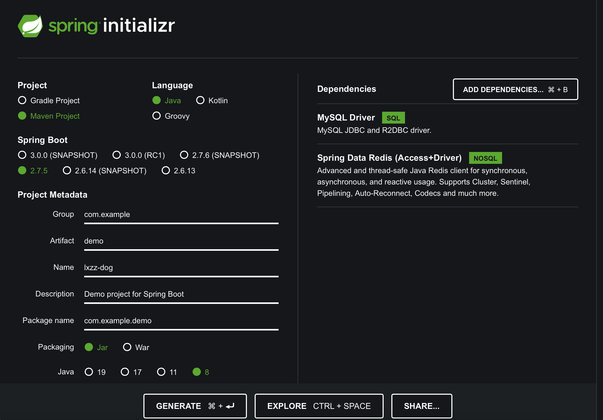
3. 直接在 IDEA 开发工具中生成（最方便）
1. 新建项目（project）
2. 选择 Spring Initializr
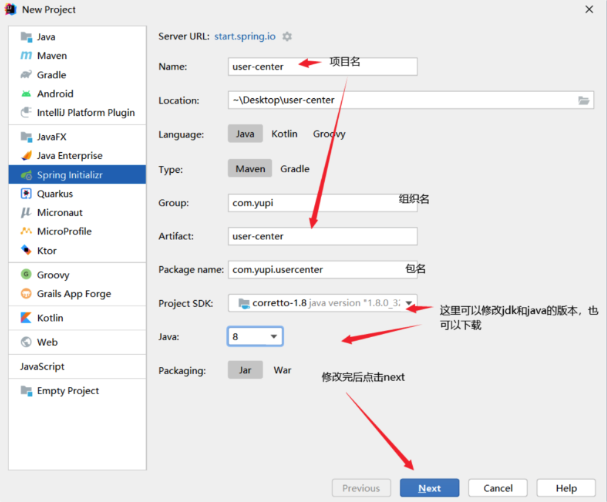
3. 添加依赖
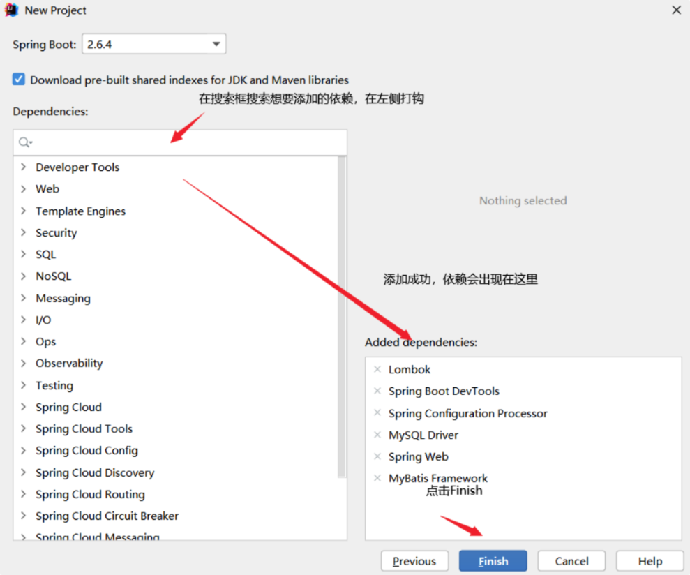
4. 项目生成成功

> [MyBatis-Plus](https://baomidou.com/pages/226c21/#开始使用)

> Junit
> [Maven Repository](https://mvnrepository.com)

### 二、数据库设计

- 什么是数据库？存数据的

- 数据库里有什么？数据表（理解为 excel 表格）

- java 操作数据库？程序代替人工

有哪些表（模型）？表中有哪些字段？字段的类型？数据库字段添加索引？表与表之间的关联

**性别是否需要加索引？**

#### 用户表：

- id（主键） bigint
- username 昵称 varchar
- userAccount 登录帐号 varchar
- avatarUrl 头像 varchar
- gender 性别 tinyint
- userPassword 密码 varchar
- phone 电话 varchar
- email 邮箱 varchar
- userStatus 用户状态（表示用户是否合法，有无被封号等） int 0 - 正常

---

- createTime 创建时间 datetime
- updateTime 更新时间 datetime ~~（/ timestamp）~~
- isDelete 是否删除 0 1（逻辑删除）tinyint
- userRole 用户角色 0 - 普通用户 1 - 管理员

#### 新建表

删除旧的测试表：

```sql
DROP TABLE user;
```

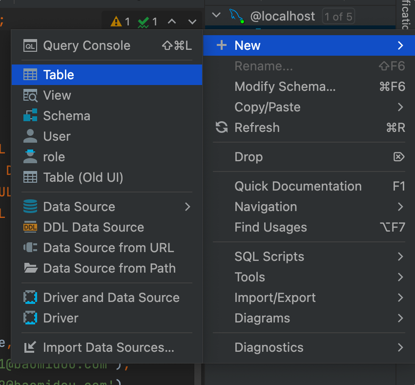

```sql
create table user
(
 id  bigint auto_increment comment 'uid'
  primary key,
 username  varchar(256)  null comment '用户名',
 userAccount  varchar(256)  null comment '账号',
 avatarUrl varchar(1024) null comment '头像',
 gender tinyint null comment '性别',
 userPassword varchar(512)  not null comment '密码',
 phone  varchar(128)  null comment '电话',
 email  varchar(512)  null comment '邮箱',
 userStatusintdefault 0  not null comment '用户状态 0 - 正常',
 createTimedatetime default CURRENT_TIMESTAMP not null comment '创建时间',
 updateTimedatetime default CURRENT_TIMESTAMP not null comment '更新时间',
 userRole  tinyint  default 0  null comment '用户角色 0 - 普通用户 1 - 管理员',
 isDelete  tinyint  default 0  null comment '是否删除'
)
 comment '用户';
```

#### 用到的插件

> [!NOTE]
>
> - `MyBatisX` ：自动根据数据库生成 domain 实体对象、mapper（操作数据库的对象）、mapper.xml（定义了 mapper 对象和数据库的关联，可以在里面自己写 SQL）、service（包含常用的增删改查）、serviceImpl（具体实现 service）
> - `SonarLint` ：检查代码是否规范
> - `GenerateAllSetter` ：一键调用一个对象所有的 set 方法
> - `Apache Commons Lang（MVN Repository）` ：对 java.lang 的扩展，基本上是 commons 中最常用的工具包
> - `Auto filling Java call arguments` ：自动填充 Java 的参数
> - `GenerateSerialVersionUID` ：自动生成 serialVersionUID

### 三、登录 / 注册

#### 接口设计

#### 注册逻辑

1. 用户在前端输入账户和密码、以及校验码（todo）
2. 校验用户的账户、密码、校验密码，是否符合要求
1. 非空
2. 账户长度 ** 不小于 ** 4 位
3. 密码就 ** 不小于 ** 8 位吧
4. 账户不能重复
5. 账户不包含特殊字符
6. 密码和校验密码相同
3. 对密码进行加密（ **_密码千万不要直接以明文存储到数据库中_** ）
4. 向数据库插入用户数据

#### 登录逻辑（单机登录 => 分布式登录 / 第三方登录）

1. 登录接口

- 接受参数：用户账户、密码

- 请求类型：POST

- 请求体：JSON 格式的数据

  > 请求参数很长时不建议用 get

- 返回值：用户信息（ **脱敏** ）

2. 逻辑

1. 校验用户账户和密码是否合法
1. 非空
2. 账户长度 **不小于** 4 位
3. 密码就 **不小于** 8 位吧
4. 账户不包含特殊字符
2. 校验密码是否输入正确，要和数据库中的密文密码去对比
3. 用户信息脱敏，隐藏敏感信息，防止数据库中的字段泄露
4. 我们要记录用户的登录态（session），将其存到服务器上（用后端 SpringBoot 框架封装的服务器 tomcat 去记录）
cookie
5. 返回 **脱敏** 后的用户信息

#### 后端项目目录

- `controller` 请求层 / 控制层。该目录里的所有文件专门用来接收请求，不做任何的业务处理
- `mapper` （/dao） 数据库访问层。专门用于从数据库中增删改查
- `model` 定义了数据库的一些对象或者用到的一些封装类
- `service` 业务层。专门用来编写业务逻辑，例如登录、注册
- `utils` 存放工具，例如加密、格式转换、日期转换等

#### 实现基本的数据库操作（操作 user 表）

- 模型 user 对象 => 和数据库的字段关联，自动生成

#### 实现

控制层 Controller 封装请求

application.yml 指定接口全局路径前缀：

```
servlet:
  context-path: /api
```

控制器注解：

```
@RestController 适用于编写 restful 风格的 api，返回值默认为 json 类型
```

校验写在哪里？

- controller 层倾向于对请求参数本身的校验，不涉及业务逻辑本身（越少越好）
- service 层是对业务逻辑的校验（有可能被 controller 之外的类调用）

##### 如何知道是哪个用户登录了？

（javaweb 这一块）

1. 连接服务器端后，得到一个 session 状态（匿名会话），返回给前端
2. 登录成功后，得到了登录成功的 session，并且给该 session 设置一些值（比如用户信息），返回给前端一个设置 cookie 的 ” 命令 “
- **session => cookie**
3. 前端接收到后端的命令后，设置 cookie，保存到浏览器内
4. 前端再次请求后端的时候（相同的域名），在请求头中带上 cookie 去请求
5. 后端拿到前端传来的 cookie，找到对应的 session
6. 后端从 session 中可以取出基于该 session 存储的变量（用户的登录信息、登录名）

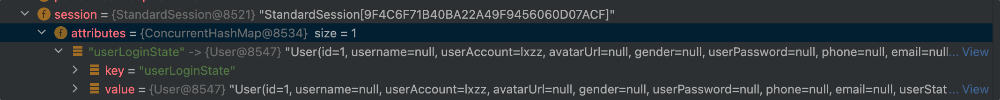

测试工具：

打开方式一：

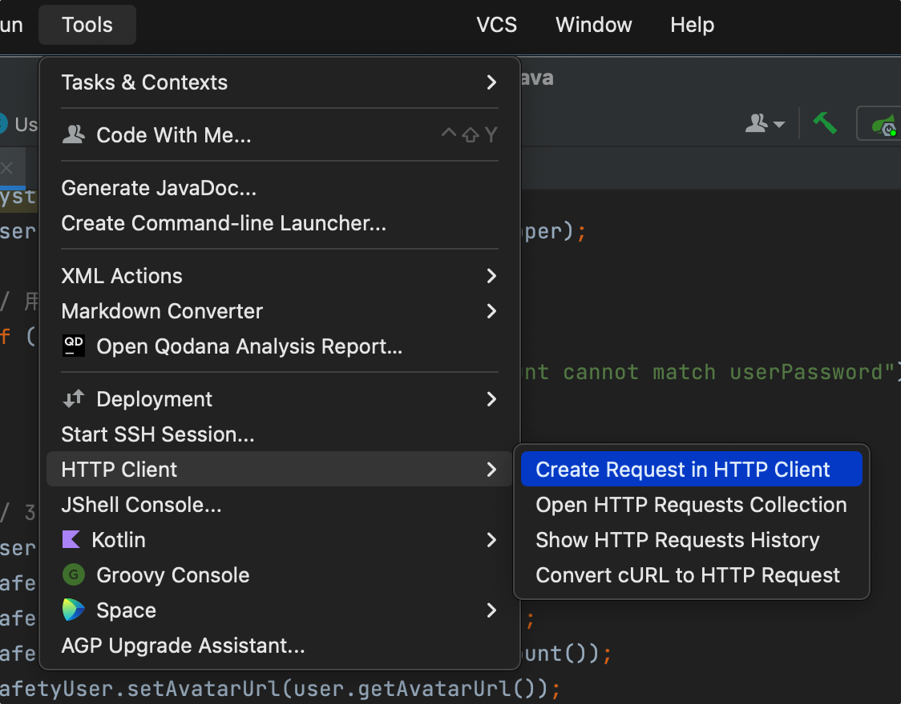

打开方式二：

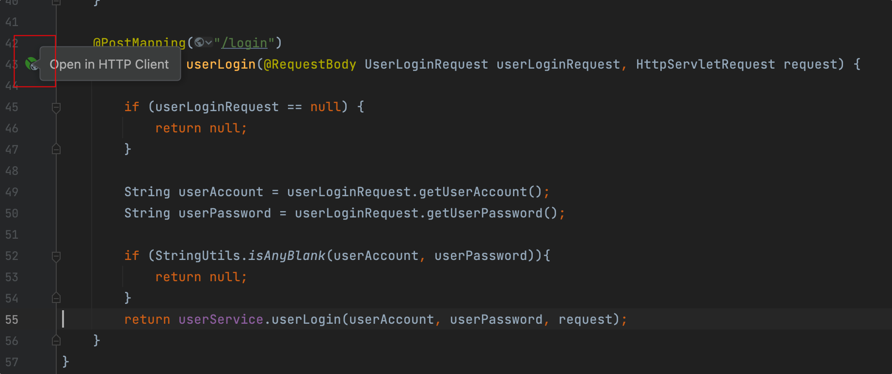

```
POST http://localhost:8080/user/login
Content-Type: application/json

{
"userAccount":"lxzz",
"userPassword":12345678
}
```

> 注意 MyBatis-Plus 的逻辑删除，默认会帮助我们查询出来没有被删除的用户

## 用户管理

接口设计关键：必须鉴权！！！

1. 查询用户（允许根据用户名查询）
2. 删除用户

## 写代码流程

1. 先做设计
2. 代码实现
3. 持续优化！！！（复用代码、提取公共逻辑 / 常量）

## 前后端交互

前端需要向后端发送请求

前端 ajax 来请求后端

### 前端请求库及封装关系

- axios 封装了 ajax
- request 是 ant design 项目又封装了一次
- 追踪 request 源码：用到了 umi 的插件、requestConfig 是一个配置

## 代理

正向代理：替客户端向服务器发送请求，可以解决跨域问题

反向代理：替服务器统一接收请求。

怎么搞代理？

- Nginx 服务器
- Node.js 服务器

### 举例

原本请求：http://localhost:8000/api/user/login

代理到请求：http://localhost:8080/api/user/login


## 前端框架介绍

### Ant Design Pro（Umi 框架）权限管理

- app.tsx：项目全局入口文件，定义了整个项目中使用的公共数据（比如用户信息）
- access.ts 控制用户的访问权限

获取初始状态流程：首次访问页面（刷新页面），进入 app.tsx，执行 getInitialState 方法，该方法的返回值就是全局可用的状态值。

### ProComponents 高级表单

1. 通过 columns 定义表格有哪些列
2. columns 属性
- dataIndex 对应返回数据对象的属性
- title 表格列名
- copyable 是否允许复制
- ellipsis 是否允许缩略
- valueType：用于声明这一列的类型（dateTime、select）

### 框架关系

Ant Design 组件库 => 基于 React 实现

Ant Design Procomponents => 基于 Ant Design 实现

Ant Design Pro 后台管理系统 => 基于 Ant Design + React + Ant Design Procomponents + 其他的库实现

#### 处理 Register\index.tsx

前端代码编写顺序可参考 html -> css(美化) -> js(逻辑)

1. 删除检测登录状态的模块
2. 修改表单项文案
3. 去掉自动登录、忘记密码模块
4. 修改按钮名称：登录 -> 注册
5. 注册提交逻辑， LoginParams -> RegisterParams
6. `type RegisterResult = number;`
7. 重定向 redirect (记录用户未登录前访问页面的 location ，直接进入登录界面的无 redirect)
8. 优化，登录界面注册提示 + 已存在帐号无法注册提示

## 后端优化

1. 开发用户注销前端后端

2. ~~_补充用户注册校验逻辑前端后端（星球编号）_~~

3. 后端代码优化

1. **通用返回对象**

- 目的：给对象补充一些信息，告诉前端这个请求在业务层面上是成功还是失败
- 200\404\500\502\503

```json
{
  "name": "yupi"
}
// 成功
{
  "code": 0 //业务状态码
  "data": {
"name": "yupi"
  }
  "message": "ok"
}
// 错误
{
  "code": 50001 //业务状态码
  "data": null
  "message": "用户操作异常、xxx"
  "description"
}
```

- 自定义错误码
- 返回类支持返回正常和返回错误

2. **封装全局异常处理**

1. 定义业务异常类
1. 相对于 Java 的异常类，支持更多字段
2. 自定义构造函数，更灵活 / 快捷地设置字段
2. 编写全局异常处理器
- 作用
  1. 捕获代码中所有的异常，内部消化，让前端得到更详细的业务报错 / 信息
  2. 同时屏蔽掉项目框架本身的异常（不暴露服务器内部状态）
  3. 集中处理，比如日志
- 实现： 4. Spring AOP ：在调用方法前后进行额外的处理

## 前端代码优化

### 全局响应处理

应用场景：我们需要对接口的 **通用响应** 进行统一处理，比如从 response 中取出 data；或者根据 code 去集中处理错误，比如用户未登录、没权限之类的。

优势：不用在每个接口请求中都去写相同的逻辑

实现：参考你用的请求封装工具的官方文档，比如 umi-request（ https://github.com/umijs/umi-request#interceptor 、 https://blog.csdn.net/huantai3334/article/details/116780020 ）。如果你用 **axios**，参考 axios 的文档。

创建新的文件，在该文件中配置一个全局请求类。在发送请求时，使用我们自己的定义的全局请求类。

## 多环境

参考文章：https://blog.csdn.net/weixin_41701290/article/details/120173283

本地开发：localhost（127.0.0.1）

多环境：指同一套项目代码在不同的阶段需要根据实际情况来调整配置并且部署到不同的机器上。

为什么需要？

1. 每个环境互不影响
2. 区分不同的阶段：开发 / 测试 / 生产
3. 对项目进行优化：
1. 本地日志级别
2. 精简依赖，节省项目体积
3. 项目的环境 / 参数可以调整，比如 JVM 参数

针对不同环境做不同的事情。

多环境分类：

1. 本地环境（自己的电脑）localhost
2. 开发环境（远程开发）大家连同一台机器，为了大家开发方便
3. 测试环境（测试）开发 / 测试 / 产品，单元测试 / 性能测试 / 功能测试 / 系统集成测试，独立的数据库、独立的服务器
4. 预发布环境（体验服）：和正式环境一致，正式数据库，更严谨，查出更多问题
5. 正式环境（线上，公开对外访问的项目）：尽量不要改动，保证上线前的代码是 “完美” 运行
6. 沙箱环境（实验环境）：为了做实验

### 前端多环境实战

- 请求地址

  - 开发环境：localhost:8000

  - 线上环境：user-backend.code-nav.cn

  ```js
  startFront(env) {
if(env === 'prod') {
 // 不输出注释
 // 项目优化
 // 修改请求地址
} else {
 // 保持本地开发逻辑
}
  }
  ```

  用了 umi 框架， `build` 时会自动传入 `NODE_ENV == production` 参数， `start NODE_ENV` 参数为 `development`

- 启动方式

  - 开发环境： `npm run start` （本地启动，监听端口、自动更新）
  - 线上环境： `npm run build` （项目构建打包），可以使用 serve 工具启动（安装： `npm i -g serve` ）

- 项目的配置

  不同的项目（框架）都有不同的配置文件，umi 的配置文件是 config ，可以在配置文件后添加对应的环境名称后缀来区分开发环境和生产环境。参考文档： https://umijs.org/zh-CN/docs/deployment

  - 开发环境： `config.dev.ts`
  - 生产环境： `config.prod.ts`
  - 公共配置： `config.ts` 不带后缀

### 后端多环境实战

SpringBoot 项目，通过 `application.yml` 添加不同的后缀来区分配置文件

可以在启动项目时传入环境变量：

```bash
java -jar .\user-center-backend-0.0.1-SNAPSHOT.jar --spring.profiles.active=prod
```

主要是改：

- 依赖的环境地址

  - 数据库地址

  - 缓存地址

  - 消息队列地址

  - 项目端口号

- 服务器配置

## 项目部署上线

参考文章：https://www.bilibili.com/read/cv16179200

需要 Linux 服务器（建议大家用 CentOS 8+ / 7.6 以上）

### 原始部署

什么都自己装

#### 前端

需要 web 服务器：**nginx** 、apache、tomcat

安装 nginx 服务器：

1. 用系统自带的软件包管理器快速安装，比如 centos 的 yum

2. 自己到官网安装（参考文章）

```bash
curl -o nginx-1.21.6.tar.gz http://nginx.org/download/nginx-1.21.6.tar.gz

tar -zxvf nginx-1.21.6.tar.gz

cd nginx-1.21.6

37  2022-04-17 23:30:09 yum install pcre pcre-devel -y
39  2022-04-17 23:30:59 yum install openssl openssl-devel -y
41  2022-04-17 23:31:57 ./configure --with-http_ssl_module --with-http_v2_module --with-stream
42  2022-04-17 23:32:13 make
43  2022-04-17 23:32:54 make install
48  2022-04-17 23:33:40 ls /usr/local/nginx/sbin/nginx
vim /etc/profile
  在最后一行添加：export PATH=$PATH:/usr/local/nginx/sbin

  nginx

  netstat -ntlp 查看启动情况
```

注意 nginx 权限

#### 后端

java、maven

安装：

```bash
yum install -y java-1.8.0-openjdk*

curl -o apache-maven-3.8.5-bin.tar.gz https://dlcdn.apache.org/maven/maven-3/3.8.5/binaries/apache-maven-3.8.5-bin.tar.gz

git clone xxx 下载代码

打包构建，跳过测试
mvn package -DskipTests

java -jar ./user-center-backend-0.0.1-SNAPSHOT.jar --spring.profiles.active=prod
```

### 宝塔 Linux 部署

Linux 运维面板

官方安装教程：https://www.bt.cn/new/download.html

方便管理服务器、方便安装软件

### 前端托管

前端腾讯云 web 应用托管（比容器化更傻瓜式，不需要自己写构建应用的命令，就能启动前端项目）

> https://console.cloud.tencent.com/webify/new

- 小缺点：需要将代码放到代码托管平台上
- 优势：不用写命令、代码更新时自动构建

### Docker 部署

docker 是容器，可以将项目的环境（比如 java、nginx）和项目的代码一起打包成镜像，所有同学都能下载镜像，更容易分发和移植。

再启动项目时，不需要敲一大堆命令，而是直接下载镜像、启动镜像就可以了。

docker 可以理解为软件安装包。

Docker 安装：https://www.docker.com/get-started/ 或者宝塔安装

Dockerfile 用于指定构建 Docker 镜像的方法

Dockerfile 一般情况下不需要完全从 0 自己写，建议去 github、gitee 等托管平台参考同类项目（比如 springboot）

Dockerfile 编写：

- FROM 依赖的基础镜像
- WORKDIR 工作目录
- COPY 从本机复制文件
- RUN 执行命令
- CMD / ENTRYPOINT（附加额外参数）指定运行容器时默认执行的命令

根据 Dockerfile 构建镜像：

```bash
# 后端
docker build -t user-center-backend:v0.0.1 .

# 前端
docker build -t user-center-front:v0.0.1 .
```

Docker 构建优化：减少尺寸、减少构建时间（比如多阶段构建，可以丢弃之前阶段不需要的内容）

docker run 启动：

```bash
# 前端
docker run -p 80:80 -d user-center-frontend:v0.0.1

# 后端
docker run -p 8080:8080 user-center-backend:v0.0.1
```

虚拟化

1. 端口映射：把本机的资源（实际访问地址）和容器内部的资源（应用启动端口）进行关联
2. 目录映射：把本机的端口和容器应用的端口进行关联

进入容器：

```bash
docker exec -i -t  fee2bbb7c9ee /bin/bash
```

查看进程：

```bash
docker ps
```

查看日志：

```bash
docker logs -f [container-id]
```

杀死容器：

```bash
docker kill
```

强制删除镜像：

```bash
docker rmi -f
```

### Docker 平台部署

1. 云服务商的容器平台（腾讯云、阿里云）
2. 面向某个领域的容器平台（前端 / 后端微信云托管）**要花钱！**

容器平台的好处：

1. 不用输命令来操作，更方便省事
2. 不用在控制台操作，更傻瓜式、更简单
3. 大厂运维，比自己运维更省心
4. 额外的能力，比如监控、告警、其他（存储、负载均衡、自动扩缩容、流水线）

爽就完事了！！！

## 绑定域名

前端项目访问流程：用户输入网址 => 域名解析服务器（把网址解析为 ip 地址 / 交给其他的域名解析服务） => 服务器 =>（防火墙）=> nginx 接收请求，找到对应的文件，返回文件给前端 => 前端加载文件到浏览器中（js、css） => 渲染页面

后端项目访问流程：用户输入网址 => 域名解析服务器 => 服务器 => nginx 接收请求 => 后端项目（比如 8080 端口）

nginx 反向代理的作用：替服务器接收请求，转发请求

## 跨域问题解决

浏览器为了用户的安全，仅允许向 **同域名、同端口** 的服务器发送请求。

如何解决跨域？

最直接的方式：把域名、端口改成相同的

### 添加跨域头

让服务器告诉浏览器：允许跨域（返回 cross-origin-allow 响应头）

#### 1. 网关支持（Nginx）

```nginx
# 跨域配置
location ^~ /api/ {
 proxy_pass http://127.0.0.1:8080/api/;
 add_header 'Access-Control-Allow-Origin' $http_origin;
 add_header 'Access-Control-Allow-Credentials' 'true';
 add_header Access-Control-Allow-Methods 'GET, POST, OPTIONS';
 add_header Access-Control-Allow-Headers '*';
 if ($request_method = 'OPTIONS') {
  add_header 'Access-Control-Allow-Credentials' 'true';
  add_header 'Access-Control-Allow-Origin' $http_origin;
  add_header 'Access-Control-Allow-Methods' 'GET, POST, OPTIONS';
  add_header 'Access-Control-Allow-Headers' 'DNT,User-Agent,X-Requested-With,If-Modified-Since,Cache-Control,Content-Type,Range';
  add_header 'Access-Control-Max-Age' 1728000;
  add_header 'Content-Type' 'text/plain; charset=utf-8';
  add_header 'Content-Length' 0;
  return 204;
 }
}
```

#### 2. 修改后端服务

1. 配置 @CrossOrigin 注解

2. 添加 web 全局请求拦截器

```java
@Configuration
public class WebMvcConfg implements WebMvcConfigurer {

 @Override
 public void addCorsMappings(CorsRegistry registry) {
  //设置允许跨域的路径
  registry.addMapping("/**")
 //设置允许跨域请求的域名
 //当**Credentials为true时，**Origin不能为星号，需为具体的ip地址【如果接口不带cookie,ip无需设成具体ip】
 .allowedOrigins("http://localhost:9527", "http://127.0.0.1:9527", "http://127.0.0.1:8082", "http://127.0.0.1:8083")
 //是否允许证书 不再默认开启
 .allowCredentials(true)
 //设置允许的方法
 .allowedMethods("*")
 //跨域允许时间
 .maxAge(3600);
 }
}
```

3. 定义新的 corsFilter Bean，参考：https://www.jianshu.com/p/b02099a435bd

## 项目优化点

1. 功能扩充
1. 管理员创建用户、修改用户信息、删除用户
2. 上传头像
3. 按照更多的条件去查询用户
4. 更改权限
2. 修改 Bug
3. 项目登录改为分布式 session（单点登录 - redis）
4. 通用性
1. set-cookie domain 域名更通用，比如改为 \*.xxx.com
2. 把用户管理系统 => 用户中心（之后所有的服务都请求这个后端）
5. 后台添加全局请求拦截器（统一去判断用户权限、统一记录请求日志）

## 其他

MFSU ：前端编译优化

Ant Design 组件库 => React

Ant Design Procomponents => Ant Design

Ant Design Pro 后台管理系统 => Ant Design 、 Ant Design Procomponents 、 React 、 其他的库

### Ant Design Pro（Umi 框架）

app.tsx 项目全局入口文件，定义了整个项目中使用的公共数据（比如用户信息）

access.ts 控制用户的访问权限

首次访问页面（刷新页面），进入 app.tsx，执行 getInitialState 方法，该方法的返回值就是全局可用的状态值。

---

# 踩坑

## Start 项目

最开始安装的 node.js 版本是 18.x ，版本过高无法启动项目，卸载后更换为 16.x 版本，可以启动。

## Umi-UI

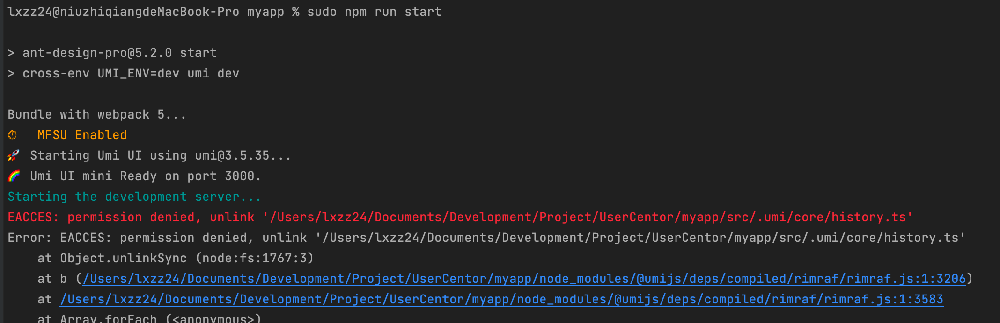

当删除某个文件夹，比如 `/home/jj/test/`，可能提示

````
EACCES: permission denied, unlink ```/home/jj/test/```
````

此时只需要给予 **写入权限** 即可：

```
sudo chown -R jj /home/jj/test/
```

其中 jj 是用户名

### mac 安装 MySQL

官网下载安装包，点击下载安装

1. 在系统偏好设置里找到 mysql，点击并选择启动 mysql；
2. 打开终端面板，输入：`mysql -u root -p`

问题来了，因为之后显示的是：`-bash: mysql: command not found`

解决：

```
# 查看～文件夹
ls -a

# 如果没有 .bash_profile ，创建一下
touch .bash_profile

# 创建好后，打开该文件
open -t .bash_profile

# 编辑文件，加入如下内容，路径获取方式见下图
export PATH=$PATH:/usr/local/{mysql}/bin

# 保存后，键入
source ~/.bash_profile

```

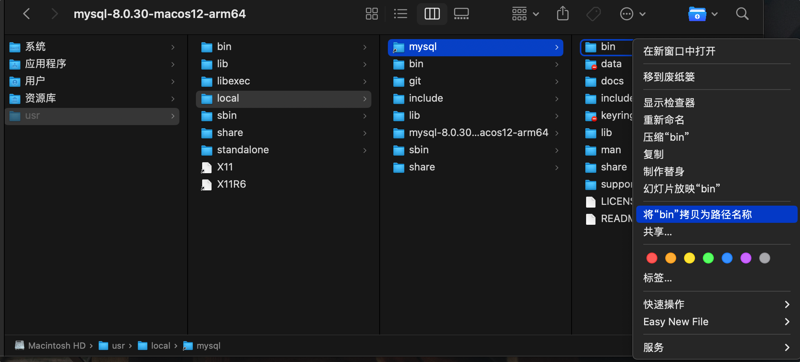

### 关闭 mybatis-plus 自动将下划线转驼峰

在 application.yml 中增加配置：

```yml
mybatis-plus:
  configuration:
 map-underscore-to-camel-case: false
```

### 无法查询用户是否重复

可能是由于数据库表格中 isDelete 未初始化值，重新建表后定义 isDelete 初始值为 0 ，程序 Debug 正常运行，可查询到已存在用户

> User user = userMapper.selectOne(queryWrapper); 执行完后， `user == null`

### 使用 Image 标签时报错，无法加载页面：

删除 `.umi` 文件夹， 终端执行 `npm i` 命令，重新安装 umi

> 出现了新问题： 表格列间距变窄
> 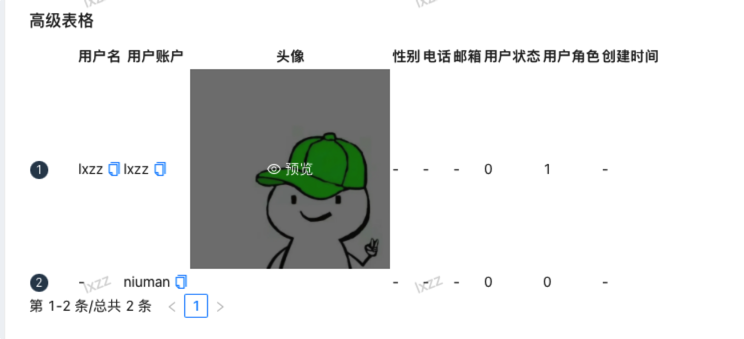

又删除了 `node_modules` 和 `.umi` ，依次执行：

```
rm -rf yarn.lock yarn-error.log node_modules src/.umi package-lock.json

yarn && yarn start
```

重启前端项目，恢复正常：

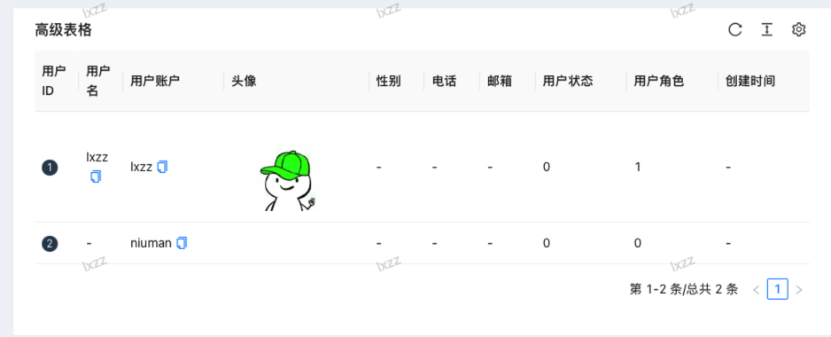
