::: details 目录
[[toc]]
:::

## 1 计算机系统基础知识

$计算机 = 硬件 + 软件$
$硬件 = 运算器 + 控制器 + 存储器 + 输入设备 + 输出设备$

### 1.1 CPU

$CPU（中央处理单元） = 运算器 + 控制器$  

#### 1.1.1 运算器

##### (1) 功能：
- 执行所有的算术运算
- 执行所有的逻辑运算并进行逻辑测试

##### (2) 组成：
- **算术逻辑单元（ALU）**
  - 处理数据，实现对数据的算术运算和逻辑运算
- **累加寄存器（AC）**
  - 当ALU执行算术/逻辑运算时，为ALU提供一个工作区
  - 运算的结果是放在累加器中的
- 数据缓冲寄存器（DR）
  - 作为CPU和内存、外部设备之间数据传送的中转站/操作速度上的缓冲
- 状态条件寄存器（PSW）
  - 状态标志+控制标志

#### 1.1.2 控制器

控制器用于控制整个CPU的工作，它**决定了计算机运行过程的自动化**。

##### (1) 包括:
- 指令控制逻辑：取指令->指令译码->按指令操作码执行->形成下一条指令地址
- 时序控制逻辑
- 总线控制逻辑
- 终端控制逻辑
等几个部分

##### (2) 组成：
  - 指令寄存器（IR）
    - 暂存指令
  - **程序计数器（PC）**
    - PC的内容总是将要执行的下一条指令的地址（第一条指令的地址）
  - 地址寄存器（AR）
    - AR保存当前CPU所访问的内存单元的地址
    - 由于内存和CPU在操作速度上的差异，所以需要AR保持地址信息，直到内存的读/写操作完成
  - 指令译码器（ID）
    - 对指令中的操作码字段进行分析解释，识别该指令规定的操作（$指令 = 操作码 + 地址码$）

#### 1.1.3 寄存器组

- 专用寄存器：运算器和控制器中的寄存器是专用寄存器（其作用是固定的）
- 通用寄存器：可由程序员规定其用途

#### 1.1.4 补充：

**用户可见：**
通用寄存器组、程序状态字寄存器（PSWR)、程序计数器（PC）、累加寄存器（AC）

**用户不可见：**
指令寄存器（IR）、暂存寄存器（DR）、存储器地址寄存器（MAR）、存储器数据寄存器（MDR）

### 1.2 数据表示

$1 字节（byte）= 8 bit$

#### 1.2.1 进制

##### (1) 进制及之间的转换

对于整数，有四种表示方式： 

- 二进制(binary)：0，1，满 2 进 1 。以 0b 或 0B 开头。 
- 十进制(decimal)：0-9，满 10 进 1 。 
- 八进制(octal)：0-7，满 8 进 1 。 以数字0开头表示。 
- 十六进制(hex)：0-9 及 A-F ，满 16 进 1 。以0x或0X开头表示。
  - 此处的 A-F 不区分大小写。如：0x21AF + 1 = 0X21B0

|          |       |       |       |       |       |       |       |       |       |       |       |       |       |       |       |       |       |       |
| :------: | :---: | :---: | :---: | :---: | :---: | :---: | :---: | :---: | :---: | :---: | :---: | :---: | :---: | :---: | :---: | :---: | :---: | :---: |
|  十进制  |   0   |   1   |   2   |   3   |   4   |   5   |   6   |   7   |   8   |   9   |  10   |  11   |  12   |  13   |  14   |  15   |  16   |  17   |
| 十六进制 |   0   |   1   |   2   |   3   |   4   |   5   |   6   |   7   |   8   |   9   |   A   |   B   |   C   |   D   |   E   |   F   |  10   |  11   |
|  八进制  |   0   |   1   |   2   |   3   |   4   |   5   |   6   |   7   |  10   |  11   |  12   |  13   |  14   |  15   |  16   |  17   |  20   |  21   |
|  二进制  |   0   |  01   |  10   |  11   |  100  |  101  |  110  |  111  | 1000  | 1001  | 1010  | 1011  | 1100  | 1101  | 1110  | 1111  | 10000 | 10001 |

> [!TIP]
> 十进制 → 二进制 ： 除二取余的逆  
> 二进制 → 八进制 ： 每 3 个一位  
> 二进制 → 十六进制	： 每 4 个一位  

##### (2) 进制加减法

#### 1.2.2 原码、反码、补码、移码

- **原码**：直接将一个数值换成二进制数。最高位是符号位;
- **负数的反码**：是对原码按位取反，只是最高位（符号位）确定为 1;
- **负数的补码**：其反码加 1。
- **移码**：补码的**符号位**取反（无论正负数）。

$[+0]_补 = [-0]_补 = 0 000 0000$， 

$[ [x]_补 ]_补 = [x]_原$  

> 计算机底层都以补码的方式来存储数据！

| n = 8 时， |             |
| :--------: | :---------: |
|    原码    | [-127,+127] |
|    反码    | [-127,+127] |
|    补码    | [-128,+127] |
|    移码    | [-128,+127] |

> 8 位二进制，使用原码或反码表示的范围为[-127, +127]，而使用补码表示的范围为[-128, 127]。

#### 1.2.3 浮点数

一个二进制数 N 可以表示为更一般的形式 $N=2^E*F$ ，其中 E 称为阶码，F 称为尾数。
用阶码和尾数表示的数称为浮点数。

> 浮点数所能表示的数值**范围**主要由**阶码**决定，所表示数值的**精度**则由**尾数**决定

运算时，小阶向大阶对，浮点数向右移。
> 规格化浮点数，就是将尾数的绝对值限定在区间[0.5, 1]。

**阶码**（包括1位阶符）用 **R** 位的移码表示，**尾数**（包括1位数符）用 **M** 位的补码表示，则浮点数能表示的数值范围如下：

- 最大的正数：$+(1-2^{-M+1})\times2^{2^{R-1}-1}$
- 最小的负数：$-1\times2^{2^{R-1}-1}$

#### 1.2.4 寻址

- **立即寻址①**
  - 操作数就包含在指令中
- **直接寻址**③
  - 操作数存放在内存单元中，指令中直接给出操作数所在存储单元的地址
- **寄存器寻址②**
  - 操作数存放在某一寄存器中，指令中给出存放操作数的寄存器名
- **寄存器间接寻址**④
  - 操作数存放在内存单元中，操作数所在存储单元的地址在某个寄存器中
- **间接寻址⑤**
  - 指令中给出操作数地址的地址
- 相对寻址
  - 指令地址码给出的是一个偏移量（可正可负），操作数地址等于本条指令的地址加上该偏移量
- 变址寻址
  - 操作数地址等于变址寄存器的内容加偏移量

#### 1.2.5 校验码

码距：是指一个编码系统中任意两个合法编码之间至少有多少个二进制位不同。
- 码距 = 2 ，具有检错能力
- **码距 >= 3 ，才可能具有纠错能力**

##### (1) * 奇偶校验码 

- 概念：通过在编码中增加一位校验位来使编码中 1 的个数为奇数（奇校验）/为偶数（偶校验），从而使**码距**变为** 2 **。
- 奇校验可以检测代码中奇数（个）位出错的编码，但不能发现偶数（个）位出错的编码。
  - 即编码中 1 的个数的奇偶性发生了变化
- **只能检错，不能纠错**
- **水平**奇偶校验码**、垂直**奇偶校验码**、水平垂直**校验码

##### (2) 海明码

- 概念：利用奇偶性来检错和纠错。
- **公式**：设数据位是 n 位，校验位是 k 位，则 n 和 k 必须满足：
  - $2^k-1\ge n+k$

##### (3) 循环冗余校验码（CRC）

- 利用生成多项式为 k 个数据位产生 r 个校验位来进行编码，编码长度为 k + r

- 采用模 2 运算
- 码距 = 2 ，可以检错，但不能纠错

## 2 计算机体系结构

### 2.1 指令系统

#### 2.1.1 CISC 和 RISC

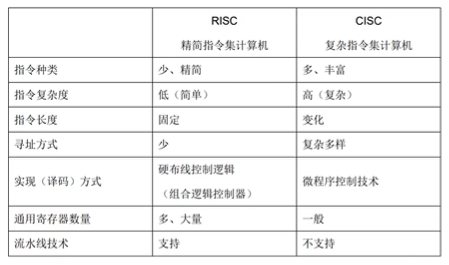

- **CISC**
   - **Complex** Instuction Set Computer，复杂指令集计算机
   - 目前使用的绝大多数计算机都属于 CISC
- **RISC**
   - **Reduced** Instuction Set Computer，精简指令集计算机

#### 2.1.2 流水线

指令流水线：输入 **$I_{0.1s}$** → 计算 **$C_{0.2s}$** → 输出 **$O_{0.3s}$**

|            |           |           |           |           |           |           |               |               |
| :--------: | :-------: | :-------: | :-------: | :-------: | :-------: | :-------: | :-----------: | :-----------: |
|            | **$T_1$** | **$T_2$** | **$T_3$** | **$T_4$** | **$···$** | **$T_n$** | **$T_{n+1}$** | **$T_{n+2}$** |
|  **$I$**   |   $I_1$   |   $I_2$   |   $I_3$   |   $I_4$   |   $···$   |   $I_n$   |               |               |
|  **$C$**   |           |   $C_1$   |   $C_2$   |   $C_3$   |   $···$   | $C_{n-1}$ |     $C_n$     |               |
|  **$O$**   |           |           |   $O_1$   |   $O_2$   |   $···$   | $O_{n-2}$ |   $O_{n-1}$   |     $O_n$     |
|  **效率**  |    1/3    |    2/3    |   100%    |   100%    |   $···$   |   100%    |      2/3      |      1/3      |
| **$Time$** |   0.1s    |   0.2s    |   0.3s    |   0.3s    |   $···$   |   0.3s    |     0.3s      |     0.3s      |

- $T_{总用时} = T_{第一条指令的执行时间}+(n-1)\times T_{最长执行时间}$

- $\frac{不采用流水线}{采用流水线} = 加速比$

- 操作周期：$T_{最长执行时间}$

- **吞吐率**：$\frac{1s}{T_{最长执行时间}}$

- 执行 n 条指令的吞吐率：$\frac{n}{T_{总用时}}$

### 2.2 存储器

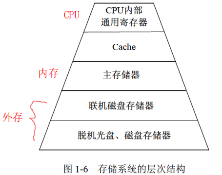

#### 2.2.1 按所处的位置分类：
  - 内存（主存）：DRAM动态随机存储器（相对的：SRAM静态随机存储器）
    - 周期性地刷新
  - 外存（辅存）

> $虚拟存储器 = 主存 + 辅存$

#### 2.2.2 按工作方式分类
- 读 / 写存储器（RAM）
  - 能够读取 / 存入数据
- 只读存储器
  - 固定只读存储器ROM
  - 可编程的只读存储器PROM
  - 可擦除可编程的只读存储器EPROM
  - 电擦除可编程的只读存储器EEPROM
  - 闪速存储器（**闪存**）
    - 以块为单位删除
    - U盘
    - 信息不会丢失
    - 代替ROM
    - 不能代替主存

#### 2.2.3 按访问方式分类
  - 按地址访问的存储器
  - 按**内容访问**的存储器 —— **相联存储器**

#### 2.2.4 按寻址方式分类
  - 随机存储器
  - 顺序存储器
  - 直接存储器

> 空间局部性  
> 时间局部性  

#### 2.2.1 Cache

1. 高速缓存用来**存放当前最活跃的程序和数据**。

特点：

- 位于 CPU 与主存之间
- 容量一般在几千字节到几兆字节之间
- 速度一般比主存快 5~10 倍，由快速半导体存储器构成
- 其内容对程序员来说是透明的

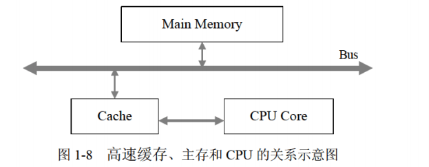

**提高 CPU 访问主存指令的效率**

##### 2.2.1.1 替换算法

- 目标：使 Cache 获得尽可能高的命中率
   - 随机替换算法
   - 先进先出算法
   - 近期最少使用算法
   - 优化替换算法

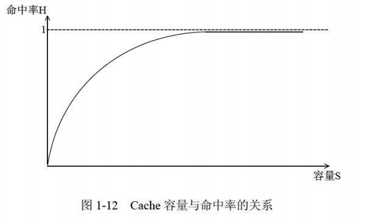

Cache 容量越大，则命中率越高，随着 Cache 容量的增加，其失效率接近 0%

##### 2.2.1.2 地址映像方法
在 CPU 工作时，送出的是主存单元的地址，而应从 Cache 存储器中读 / 写信息。需要将主存地址转换成 Cache 存储器的地址，即地址映像。

###### (1) **直接映像**

主存的块与 Cache 块的对应关系是固定的

- 优点：地址变换很简单
- 缺点：灵活性差
   - 不同区号中块号相同的块无法同时调入 Cache 存储器

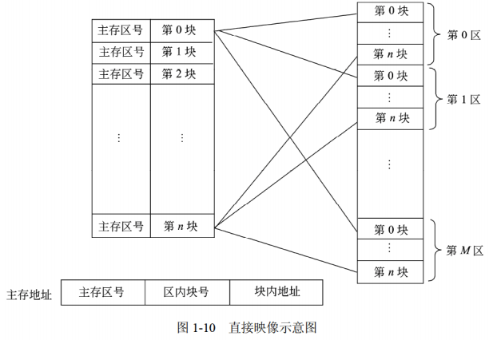

###### (2) **全相联映像**

允许主存的任一块可以调入 Cache 存储器的任何一个块的空间中

- 优点：主存的块调入 Cache 的位置不受限制，十分灵活
- 缺点：无法从主存块号中直接获得 Cache 的块号，变换比较复杂，速度比较慢

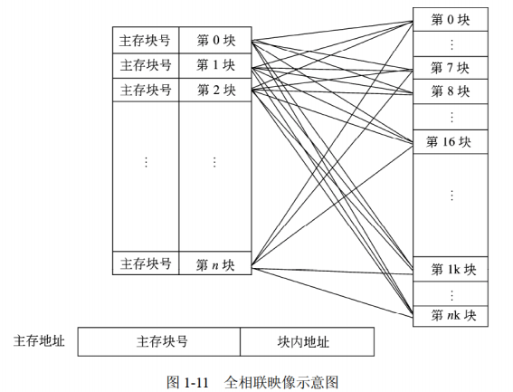

###### (3) **组相联映像**

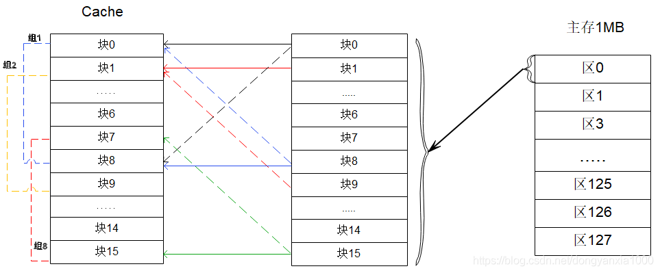

组相联的地址构成为：区号+组号+块号+块内地址。

> Cache 与主存地址的映射是由硬件自动完成的

#### 2.2.2 中断

计算机在执行程序过程中，当遇到急需处理的事件时，暂停当前正在运行的程序，转去执行有关服务程序，处理完后自动返回源程序的过程。

- **中断向量**（断点）：提供中断服务程序的入口地址
   - 为提高响应中断的速度 → 汇集为中断向量表
- **中断响应时间**：发出中断请求 → 进入中断服务程序
- **保存现场**：存档，返回来继续执行源程序

### 2.3 输入输出（I/O）控制方式

#### 2.3.1 程序查询方式（直接程序控制方式）

1. **CPU 和 I/O（外设）只能串行工作**，CPU 需要一直轮询检查，长期处于忙等状态。CPU 利用率低
2. 一次只能读 / 写一个字（byte）
3. 由 CPU 将数放入内存

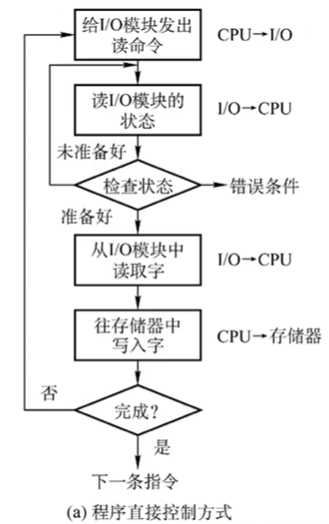

#### 2.3.2 中断（驱动）方式

1. I/O 设备通过中断信号主动向 CPU 报告 I/O 操作已完成
2. **CPU 和 I/O（外设）可并行工作**
3. CPU 利用率得到提升
4. 一次只能读 / 写一个字（byte）
5. 由 CPU 将数放入内存

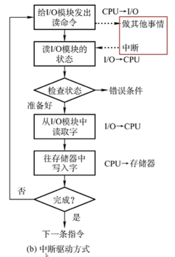

#### 2.3.3 直接存储器（DMA）方式

1. **CPU 和 I/O （外设）可并行工作**
2. **仅在传送数据块的开始和结束时才需要 CPU 的干预**
3. **由外设直接将数据放入内存**
4. 一次读写的单位为“块”而不是字

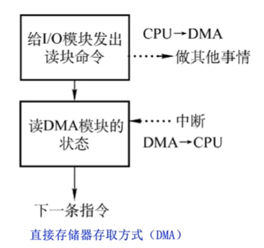

### 2.4 总线

> 只有 1 分，知识点很多很偏

分类：  
  数据总线、地址总线、控制总线

常见：
  1. ISA 总线
  2. EISA 总线
  3. **PCI 总线**
     - **微型机**上广泛采用的**内总线**，采用**并行传输**方式
  4. PCI Express 总线
  5. 前端总线
  6. RS-232C
  7. **SCSI**
     - **并行外总线**
  8. SATA
  9. USB
  10. IEEE-1394
  11. IEEE-488

## 3 安全性、可靠性与系统性

### 加密技术与认证技术

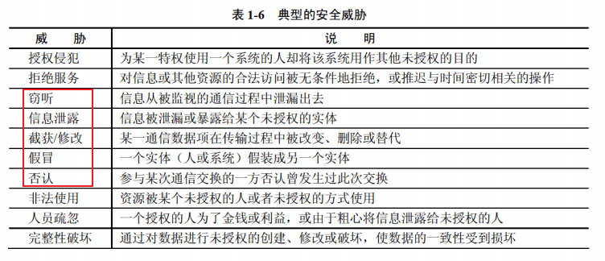

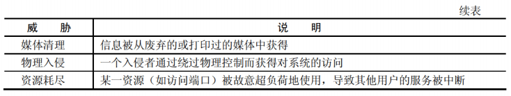

- 窃听 → 加密
- 篡改 → 摘要
- 假冒 / 否认 → 数字签名（甚至数字证书）

#### 1. 加密技术
##### (1) 对称加密（私人密钥加密）

- 只有一把密钥（加密、解密共用）
- 缺点：
   - 密钥分发有缺陷
- 优点：
   - 加密 / 解密速度很快
   - 适合加量大量明文数据

##### (2) 非对称加密（公开密钥加密）

- 加密、解密用的不是同一把密钥，分别是公钥和私钥

    
  
   - 用**公钥**加密只能用**私钥**解密
   - 用**私钥**加密只能用**公钥**解密
   - 不能通过一把推出另一把
   - 用接收方的公钥加密明文可以实现**防止窃听**的效果
- 优点：
   - 密钥分发没有缺陷
- 缺点：
   - 加密 / 解密速度很慢

##### (3) 混合加密
（对称加密的大量明文数据 + 对称密钥） **→** 非对称加密（接收方的公钥加密）
> 已加密的文件仍然可以被篡改

#### 2. 认证技术

##### (1) 摘要

将发送的明文进行 **Hash** 算法后得到摘要，放在密文后一起发送过去，与接收方解密后的明文进行相同的 **Hash** 算法得到的摘要进行对比，如果一致，则没有被**篡改**，否则有篡改。

##### (2) 数字签名

- 发送方用自己的**私钥**对摘要进行签名（加密）得到数字签名放在密文后一起发送过去；
- 接收方用发送方的**公钥**对数字签名进行验证（解密），如果验证成功，则该消息没有被**假冒**且不能**否认**；否则该消息的真实性为假冒发送

##### (3) 数字证书——身份认证

针对公钥会被篡改的情况（仍可以窃听/冒充）

> CA ：权威机构  

用户向 CA 机构申请数字证书，将个人和公钥发给 CA 机构， CA 机构颁给用户数字证书，数字证书用 **CA 的私钥**进行签名（加密），用 **CA 的公钥**验证（解密）数字证书，得到**用户的公钥**

> [!TIP]
> **CA的私钥**只有CA机构拥有

#### 3. 加密算法

1. 对称加密
  - 数据加密标准（**DES**）算法
  - 三重DES（**3DES** / TDEA）
  - **RC-5**
  - 国际数据加密算法（**IDEA**）
  - 高级加密标准（**AES**）算法
  - **RC4**
2. 非对称加密
  - **RSA** 算法
  - **ECC**
  - **DSA**
- Hash 函数  
- MD5 摘要算法  
- SHA-1 安全散列算法  

### 可靠性公式

#### 1. 串联系统

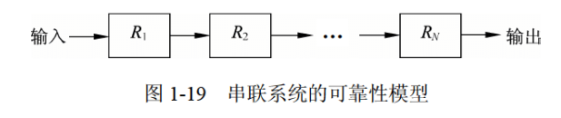

$R=R_1R_2···R_N$

#### 2. 并联系统

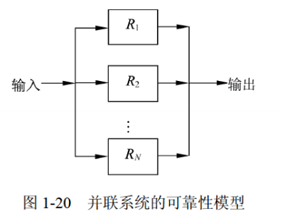

$R=1-(1-R_1)(1-R_2)···(1-R_N)$

#### 3. 题型

串联 + 并联

