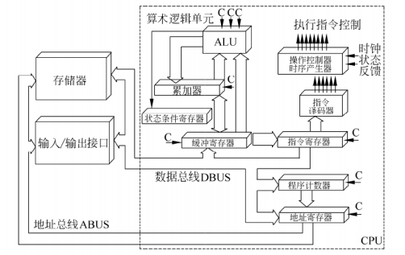
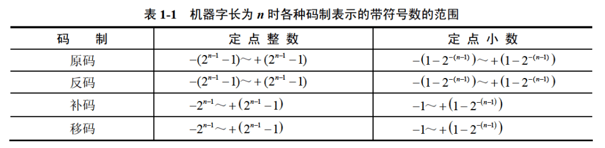
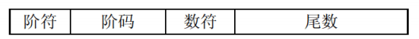
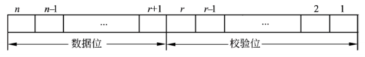
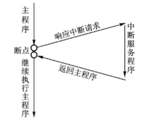
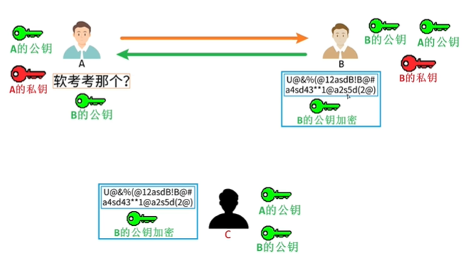

::: details 目录
[[toc]]
:::

::: info 上午题 1 ~ 5 题
:::

# 🌸 计算机系统基础知识

$$计算机 = 硬件 + 软件$$

$$计算机基本硬件系统 = 运算器 + 控制器 + 存储器 + 输入设备 + 输出设备$$

---

## 🍀 中央处理单元（CPU）

中央处理单元（CPU）是计算机系统的核心部件，它负责 _获取程序指令_、_对指令进行译码并加以执行_。

#### 1. CPU 的功能

- 程序控制（控制器）
- 操作控制（控制器）
- 时间控制（控制器）

- 数据处理（运算器）

#### 2. CPU 的组成

CPU 主要由运算器、控制器、寄存器组和内部总线等部件组成。

1. 运算器：运算器只能完成运算（算术运算 + 逻辑运算）

   - **算术逻辑单元（ALU）**：负责处理数据，实现对数据的算术运算和逻辑运算
   - ❗️❗️❗️ **累加寄存器（AC）** ❗️❗️❗️：运算器的算数逻辑单元执行算数或逻辑运算时，<u>为 ALU 提供一个工作区</u>，==运算的结果存储在 AC 中==，运算器中至少有一个 AC。
   - 数据缓冲寄存器（DR）：_作为 CPU 和内存、外部设备之间数据传送的中转站_ / 操作速度上的缓冲
   - 状态条件寄存器（PSW）：保存各种条件码内容。

2. 控制器：控制器用于控制整个 CPU 的工作，它决定了计算机运行过程的自动化。它*不仅要保证程序的正确执行，而且要能够处理异常事件*。
   - **指令寄存器（IR）**：当 CPU 执行指令时，先把它从内存存储器取到缓冲寄存器中，在送入 IR 暂存（_对用户完全透明：不可见_）
   - **程序计数器（PC）**：_跟踪指令的地址_。 PC 在顺序执行的时候加 1，在转移执行的时候加上一个位移量（<u> PC 的内容总是将要执行的下一条指令的地址 </u>（第一条指令的地址））
   - **地址寄存器（AR）**：保存当前 CPU 所访问的内存单元的地址
   - **指令译码器（ID）**：对指令中的操作码进行分析解释

$$指令 = 操作码 + 地址码$$

::: info

- **用户可见**：通用寄存器组、程序状态字寄存器（PSWR）、程序计数器（PC）、累加寄存器（AC）
- **用户不可见**：指令寄存器（IR）、暂存寄存器（DR）、存储器地址寄存器（MAR）、存储器数据寄存器（MDR）
  :::

---

## 🍀 计算机基本单位

$$1 字节（byte）= 8 bit$$

| 位（比特） 最小数据单位 | bit、b  |    8b=1B     |
| :---------------------: | :-----: | :----------: |
|    字节 最小存储单位    | byte、B |   1B = 8b    |
|         千字节          |   KB    | 1KB = 1024B  |
|         兆字节          |   MB    | 1MB = 1024KB |
|         吉字节          |   GB    | 1GB = 1024MB |
|         太字节          |   TB    | 1TB = 1024GB |

---

## 🍀 数据表示

对于整数，有四种表示方式：

- 二进制 (binary)：0，1，满 2 进 1 。以 0b 或 0B 开头。
- 十进制 (decimal)：0-9，满 10 进 1 。
- 八进制 (octal)：0-7，满 8 进 1 。 以数字 0 开头表示。
- 十六进制 (hex)：0-9 及 A-F ，满 16 进 1 。以 0x 或 0X 开头表示。
  - 此处的 A-F 不区分大小写。如：0x21AF + 1 = 0x21B0

|  十进制  |  0  |  1  |  2  |  3  |  4  |  5  |  6  |  7  |  8   |
| :------: | :-: | :-: | :-: | :-: | :-: | :-: | :-: | :-: | :--: |
| 十六进制 |  0  |  1  |  2  |  3  |  4  |  5  |  6  |  7  |  8   |
|  八进制  |  0  |  1  |  2  |  3  |  4  |  5  |  6  |  7  |  10  |
|  二进制  |  0  | 01  | 10  | 11  | 100 | 101 | 110 | 111 | 1000 |

---

|  十进制  |  9   |  10  |  11  |  12  |  13  |  14  |  15  |  16   |  17   |
| :------: | :--: | :--: | :--: | :--: | :--: | :--: | :--: | :---: | :---: |
| 十六进制 |  9   |  A   |  B   |  C   |  D   |  E   |  F   |  10   |  11   |
|  八进制  |  11  |  12  |  13  |  14  |  15  |  16  |  17  |  20   |  21   |
|  二进制  | 1001 | 1010 | 1011 | 1100 | 1101 | 1110 | 1111 | 10000 | 10001 |

#### 进制换算

- **按权展开求和**：n 进制 → 十进制
  - ==每一位八进制数与三位二进制数对应== （eg：二进制 $010 111(B)$ -→ 八进制 $027(O)$）
- **除 n 取余法**：十进制 → n 进制
  - ==每一位十六进制数与四位二进制数对应== （eg：二进制 $0101 1111(B)$ -→ 十六进制 $0x5F(H)$）
- **进制加减法**：
  - 加法：逢 n 进制进 1
  - 减法：借 1 当 n

> [!TIP]
>
> - 十进制 → 二进制 ： 除 2 取余的逆
> - 二进制 → 八进制 ： 每 3 个一位
> - 二进制 → 十六进制 ： 每 4 个一位

#### 原码、反码、补码、移码

- **原码** ：直接将一个数值换成二进制数。最高位是符号位;
- 负数的 **反码** ：是对原码按位取反，只是最高位（符号位）确定为 1;
- 负数的 **补码** ：其反码加 1。
- **移码** ：补码的 符号位 取反（无论正负数）。
- 补充
  - 正数的原码补码和反码都相同
  - 补码再取补码等于原码（$[[x]_补 ]_补 = [x]_原$）
  - $±0$ 的补码、移码相同（$[+0]_补 = [-0]_补 = 0 000 0000$）

> - 计算机底层都以补码的方式来存储数据！
> - 采用补码可以简化计算机运算部件的设计！

---

## 🍀 各种码制带符号数的范围

| n = 8 时 | 各种码制带符号数的范围 |
| :------: | :--------------------: |
|   原码   |      [-127,+127]       |
|   反码   |      [-127,+127]       |
|   补码   |      [-128,+127]       |
|   移码   |      [-128,+127]       |

> 8 位二进制，使用原码或反码表示的范围为 [-127, +127]，而使用补码表示的范围为 [-128, 127]。

---

## 🍀 浮点数\*

一个二进制数 N 可以表示为更一般的形式 $N=2^E*F$ ，其中 E 称为阶码，F 称为尾数。

用阶码和尾数表示的数称为浮点数。

- 阶码为带符号的**纯整数**，尾数为带符号的**纯小数**。
- 一个数的浮点表示不是唯一的。小数点位置改变，阶码也随着相应改变。
- ==浮点数所能表示的数值范围主要由 **阶码** 决定，所表示数值的精度则由 **尾数** 决定==
- 阶数不一样运算时，_小阶向大阶对_，浮点数向*右*移。
- 规格化浮点数，就是将尾数的绝对值限定在区间 [0.5, 1]。
- **阶码** （包括 1 位阶符）用 R 位的移码表示， **尾数** （包括 1 位数符）用 M 位的补码表示，则浮点数能表示的数值范围如下：

$$-1\times2^{2^{R-1}-1} ～ +(1-2^{-M+1})\times2^{2^{R-1}-1}$$

---

## 🍀 寻址

- **立即寻址** ①：操作数就包含在指令中（==最快==）
- **直接寻址** ③：操作数存放在内存单元中，指令中直接给出操作数所在存储单元的地址
- **寄存器寻址** ②：操作数存放在某一寄存器中，指令中给出存放操作数的寄存器名

- **寄存器间接寻址** ④：操作数存放在内存单元中，操作数所在存储单元的地址在某个寄存器中

- **间接寻址** ⑤：指令中给出操作数地址的地址（==最慢==）

- 相对寻址：指令地址码给出的是一个偏移量（可正可负），操作数地址等于本条指令的地址加上该偏移量

- 变址寻址：操作数地址等于变址寄存器的内容加偏移量

::: tip 指令系统中采用不同的寻址方式的目的是：<u>扩大寻址空间并提高编程灵活性</u>
:::

---

## 🍀 校验码\*

::: info
码距：是指一个编码系统中任意两个合法编码之间至少有多少个二进制位不同。

- 码距 = 2 ，具有检错能力
- 码距 >= 3 ，才可能具有纠错能力
  :::

1. 奇偶校验码
   ::: note 概念
   通过在编码中增加一位校验位来使编码中 **1 的个数** 为奇数（奇校验）/ 为偶数（偶校验），从而使 _码距_ 变为 2
   :::

   - 只能检错，不能纠错，码距 = 2
   - <u>只能检测出奇数个数据位出错，不能检测偶数个数据位出错</u>
   - 水平奇偶校验码 、垂直奇偶校验码、水平垂直奇偶校验码

2. 海明码
   ::: note 概念
   利用奇偶性来检错和纠错
   :::

   - 海明码*可以检错也可以纠错*。
   - 码距 = 2 ，检错能力；码距 >= 3，才有可能有纠错能力
   - 设数据位是 n 位，校验位是 k 位，则 n 和 k 必须满足：
     $$2^k-1 \ge n+k$$

3. 循环冗余校验码（CRC）
   - 可以检错，但不能纠错，码距 = 2。
   - <u>k 个数据位后跟 r 个校验位</u>
   - 校验位 r 采用 **模 2 运算**

---

---

# 🌸 计算机体系结构

## 🍀 CISC 和 RISC

> - CISC：==Complex==Instuction Set Computer，复杂指令集计算机，目前使用的绝大多数计算机都属于 CISC
> - RISC：==Reduced==Instuction Set Computer，精简指令集计算机

|                  |       RISC 精简指令集计算机        | CISC 复杂指令集计算机 |
| :--------------: | :--------------------------------: | :-------------------: |
|     指令种类     |              少、精简              |       多、丰富        |
|    指令复杂度    |             低（简单）             |      高（复杂）       |
|     指令长度     |                固定                |         变化          |
|     寻址方式     |                 少                 |       复杂多样        |
| 实现（译码）方式 | 硬布线控制逻辑（_组合逻辑控制器_） |    微程序控制技术     |
|  通用寄存器数量  |            **多、大量**            |         一般          |
|    流水线技术    |                支持                |        不支持         |

---

## 🍀 流水线

指令流水线：输入 $I_{0.1s}$→ 计算 $C_{0.2s}$→ 输出 $O_{0.3s}$

|        | $T_1$ | $T_2$ | $T_3$ | $T_4$ | $···$ |   $T_n$   | $T_{n+1}$ | $T_{n+2}$ |
| :----: | :---: | :---: | :---: | :---: | :---: | :-------: | :-------: | :-------: |
|  $I$   | $I_1$ | $I_2$ | $I_3$ | $I_4$ | $···$ |   $I_n$   |           |           |
|  $C$   |       | $C_1$ | $C_2$ | $C_3$ | $···$ | $C_{n-1}$ |   $C_n$   |           |
|  $O$   |       |       | $O_1$ | $O_2$ | $···$ | $O_{n-2}$ | $O_{n-1}$ |   $O_n$   |
|  效率  |  1/3  |  2/3  | 100%  | 100%  | $···$ |   100%    |    2/3    |    1/3    |
| $Time$ | 0.1s  | 0.2s  | 0.3s  | 0.3s  | $···$ |   0.3s    |   0.3s    |   0.3s    |

$$T_{总用时} = T_{第一条指令的执行时间}+(n-1)\times T_{最长执行时间}$$

$$加速比 = \frac{不采用流水线}{采用流水线}$$

$$操作周期 = T_{最长执行时间}$$

$$吞吐率 = \frac{1s}{T_{最长执行时间}}$$

$$执行 n 条指令的吞吐率 = \frac{n}{T_{总用时}}$$

---

## 🍀 存储系统

1. SRAM（静态随机存储器）：构成 Cache（缓存）
2. **DRAM**（动态随机存储器）：_通常被用作主存储器_，<u>DRAM 需要周期性地刷新保持信息</u>
3. RAM（读/写存储器）
4. ROM（只读存储器）
5. PROM（可编程的只读存储器）

- 按存储器所处位置可分为：
  - 内存（主存）：在主机内或主板上，存放机器当前运行所需的程序和数据，以便向 CPU 提供信息。（相对外存）容量小、速度快。
  - 外存（辅存）：存放当前不参加运行的大量信息，在需要时调入内存。
- 按存储器的构成材料分类：
  - 磁存储器
  - 半导体存储器
  - 光存储器
- 按存储器工作方式：
  - **读/写存储器（RAM）**
  - 只读存储器：ROM、PROM、EPROM、EEPROM 等
    - 固定只读存储器（ROM）：厂家生产时就写好数据在其中。只能读（用户）不能写。一般用于存放 BIOS 和微程序控制。
    - 可编程读只读存储器（PROM）：其内容可以由用户一次性地写入，写入后不能再修改。
    - EPROM、EEPROM 是指带电可擦可编程只读存储器。
- 按访问方式：
  - 按地址访问
  - <u>按内容访问</u>：例如 **相联存储器**
- 按寻址方式：
  - 随机存储器（RAM）
  - 顺序存储器（SAM）
  - 直接存储器（DAM）
- 补充内容
  - ==$虚拟存储器 = 主存 + 辅存$==
  - 闪存（flsah）类似 U 盘，掉电后信息不会丢失。
    - _以块为单位进行删除_
    - 闪存是 EPROM 的一种类型，可以代替 ROM 存储器
    - 闪存不可以代替主存。

> [!tip]
>
> - 空间局部性：访问完成立即 `next→` ；
> - 时间局部性：刚访问的再次访问；

- **高速缓存**（Cache）用来存放当前最活跃的程序和数据，其特点是：
  - 位于 CPU 与主存之间；容量一般在几千字节到几兆字节之间；
  - 速度一般比主存快 5~10 倍，由快速半导体存储器构成；
  - 其内容是主存局部域的副本，_对程序员来说是透明的_（看不见）。

> Cache 存储器部分用来存放 _主存的**部分拷贝**（副本）信息_。  
> 控制部分的功能是 _判断 CPU 要访问的信息是否在 Cache 存储器中_，若在即为命中，若不在则没有命中。
>
> - 命中时直接对 Cache 存储器寻址；
> - 未命中时，要按照替换原则决定主存的一块信息放到 Cache 存储器的哪一块里。

- 高速缓存中的地址映像方法
  - 在 CPU 工作时，送出的是主存单元的地址，而应从 Cache 存储器中读/写信息。这就需要将主存地址转换成 Cache 存储器的地址，这种地址的转换称为地址映像。
  - Cache 的地址映像有如下 3 种方法。 - _直接映像_：直接映像是指主存的块与 Cache 块的对应关系是固定的； - _全相联映像_：主存与 Cache 存储器均分成大小相同的块。允许主存的任一块可以调入 Cache 存储器的任何一个块的空间中； - _组相联映像_：组与组相对应，为直接映像特点，即第 0 组只能映射到第 0 组；但是组里面分很多小块，小块之间可以互相连接，具有全相联映像特点
    ::: note 发生块冲突从多到少的顺序：<u>直接映像 > 组相联映像 > 全相联映像</u>
    :::
- _Cache 与主存地址的映射是由**硬件**自动完成的_

---

## 🍀 中断

计算机在执行程序过程中，当遇到急需处理的事件时，暂停当前正在运行的程序，转去执行有关服务程序，处理完后自动返回源程序，这个过程称为中断。

- **中断向量**（断点）：提供中断服务程序的 _入口地址_
- **中断响应时间**：==发出中断请求 → 进入中断服务程序==
- **保存现场**：存档，返回来继续执行源程序
- 多级中断使用 **堆栈** 来保护现场最有效

---

## 🍀 输入输出（I/O）控制方式

### 1. 程序查询方式（直接程序控制方式）

- CPU 和 I/O（外设）只能 **串行** 工作，CPU 需要一直轮询检查，长期处于忙等状态。==CPU 利用率低==
- 一次只能读 / 写一个字（byte）
- 由 CPU 将数放入内存

### 2. 中断（驱动）方式

- I/O 设备通过中断信号主动向 CPU 报告 I/O 操作已完成
- CPU 和 I/O（外设）可 **并行** 工作
- CPU 利用率得到提升
- 一次只能读 / 写一个字（byte）
- 由 CPU 将数据放入内存

::: tip
1 是老板站背后看你写代码，2 是老板喝茶等你写代码
:::

### 🌸 3. 直接存储器（DMA）方式 ❗️

- CPU 和 I/O （外设）可**并行**工作
- <u>仅在传送数据块的开始和结束时才需要 CPU 的干预</u>
- 由 **外设** 直接将数据放入 **内存**
- 一次读写的单位为 **“块”** 而不是字

::: tip
1 / 2 是老板自己一块一块搬砖，3 是老板请个叉车搬砖
:::

> - CPU 是在 **一个总线周期** 结束时响应 DMA 请求的
> - DMA 获得内存总线的控制权，单纯的是为了做 **内存访问**，所以*每传送一个数据都需要占用一个存储周期*，这是和时钟周期没关系的。

---

## 🍀 总线\*

::: warning 只有 1 分，知识点很多很偏
:::

总线是连接计算机有关部件的一组信号线，是计算机中用来传送信息代码的公共通道。

采用总线结构主要有以下 **优点**：

- 简化系统结构，便于系统设计制造；
- 大大减少了连线数目，便于布线，减小体积，提高系统的可靠性；
- 便于接口设计，所有与总线连接的设备均采用类似的接口；
- 便于系统的扩充、更新与灵活配置，易于实现系统的模块化；
- 便于设备的软件设计；
- 便于故障诊断和维修，同时也降低了成本。

> 在计算机系统中采用总线结构，便于实现系统的积木化构造，同时可以 **减少信息传输线的数量**。

微机中的总线分为：

> <u>数地控</u> 即 **数据总线**、**地址总线** 和 **控制总线**

常见：

- ISA 总线
- EISA 总线
- **PCI 总线**：PCI 总线是目前微型机上广泛采用的 <u>并行内总线</u>
- PCI Express 总线
- 前端总线
- RS-232C
- **SCSI 总线**：小型计算机系统接口（SCSI）是一条 <u>并行外总线</u>
- SATA
- USB
- IEEE-1394
- IEEE-488

::: tabs

@tab 例 1

若内存容量为 4GB，字长为 32，则地址总线的宽度 = <u> ？</u>，数据总线的宽度为 = <u> ? </u>

> - 容量为 4G → 地址空间 $2^{32}$ → 32 位操作系统 → 地址总线宽度为 32
> - 字长为 32 位 → 说明数据总线宽度也为 32 bit

@tab 例 2

总线宽度为 32bit，时钟频率 200MHz，若总线上每 5 个时钟周期传送一个 32bit 的字，则该总线的带宽 <u> ？</u> MB/s。

> $$总线带宽 = 时钟频率 200MHz * \frac{总线宽度 32 bit}{时钟周期 5} / 8$$

:::

---

## 🍀 加密技术与认证技术

- 窃听 → 加密
- 篡改 → 摘要
- 假冒 / 否认 → 数字签名（甚至数字证书）

#### 加密技术

1. _对称加密_（私人密钥加密）

- 加密、解密共用一把密钥
- 缺点：
  - 密钥分发有缺陷
- 优点：
  - 加密/解密速度很快
  - ==适合加密大量明文数据==

2. **非对称加密**（公开密钥加密）

- 加密、解密用的不是同一把密钥，分别是公钥和私钥
  - 用 **公钥** 加密只能用 **私钥** 解密
  - 用 **私钥** 加密只能用 **公钥** 解密
  - 不能通过一把推出另一把
- <u>用接收方的公钥加密明文</u> 可以实现 **防止窃听** 的效果
- 优点：
  - 密钥分发没有缺陷
- 缺点：
  - 加密/解密速度很慢

3. 混合加密：（对称加密的大量明文数据 + 对称密钥） → 非对称加密（接收方的公钥加密）

::: warning 已加密的文件仍然可以被篡改
:::

#### 认证技术

1. 摘要：将发送的明文进行 **Hash 算法** 后得到*摘要*，放在密文后一起发送过去，与接收方解密后的明文进行相同的 Hash 算法得到的摘要进行对比。
   - 使用摘要 <u>确保消息不被篡改</u>
2. 数字签名：发送方用自己的 **私钥** 对摘要进行*签名*（加密）得到数字签名放在密文后一起发送过去；接收方用发送方的 **公钥** 对数字签名进行*验证*（解密），如果验证成功，则该消息没有被 **假冒** 且不能 **否认** ；否则该消息的真实性为假冒发送。

   - 使用数字签名 <u>确保消息不可否认</u>

3. 数字证书——身份认证：用户向 CA 机构申请数字证书，将个人信息和公钥发给 CA 机构，CA 机构颁给用户数字证书，数字证书用 CA 的私钥进行签名（加密），用 CA 的公钥验证（解密）数字证书，得到用户的公钥。
   - 使用数字证书 <u>确保用户身份</u>
   - 用户通过 _CA 的公钥_ **验证** _CA 的签名_，确定网站的真伪

::: important
权威机构 CA 用私钥进行加密， **CA 的私钥只有 CA 机构拥有！** 保证接收方得到的是发送方的公钥，这样就解决第三个人冒充发送发的公钥。
:::

#### 加密算法

1. 对称加密（**私钥**、私有密钥**加密**/共享密钥加密）算法

- 数据加密标准（**DES**）算法
- 三重 DES（3DES/ TDEA）
- RC-5
- 国际数据加密算法（IDEA）
- 高级加密标准（AES）算法 _（分组加密）_
- RC4

2. 非对称加密（**公钥**、公开密钥**加密**）算法

- **RSA** 算法
- ECC
- DSA

3. Hash 函数
4. MD5 摘要算法（对任意长度的输入计算得到的结果长度为 128 位）
5. SHA-1 安全散列算法

> [!NOTE] > <u>认证是处理主动攻击</u>
>
> - 主动攻击是会导致某些数据流的篡改和虚假数据流的产生的网络攻击。这类攻击可分为*篡改*、伪造消息数据和终端（_拒绝_ 服务）。
> - 被动攻击是攻击者不对数据信息做任何修改通常包括 _窃听_、_流量分析_、_破解弱加密的数据流_ 等攻击方式。

---

## 🍀 可靠性公式

### 1. 串联系统：

假设一个系统由 N 个子系统组成，当且仅当所有子系统都能正常工作时系统才能正常工作，这样的系统称为串联系统。

系统可靠性：

$$R=R_1R_2···R_N$$

### 2. 并联系统：

假设一个系统由 N 个子系统组成，只要有一个子系统正常工作，系统就能正常工作，这样的系统称为并联系统。

系统可靠性：

$$R=1-(1-R_1)(1-R_2)···(1-R_N)$$

---

## 🍀 补充例题说明

1. 指令寄存器的位数取决于**指令字长**
2. 逻辑运算：

   1. 逻辑与：<u>同为 1，结果才为 1</u>；其他情形均为 0
   2. 逻辑或： <u>同为 0，结果才为 0</u>；其他情形均为 1
   3. 逻辑异或：_相同为 0_，**不同为 1**
   4. 逻辑同或：**相同为 1**，_不同为 0_

   |  X  |  Y  | 逻辑与 & | 逻辑或 \|\| | 逻辑异或 | 逻辑同或 |
   | :-: | :-: | :------: | :---------: | :------: | :------: |
   |  0  |  0  |    0     |    **0**    |    0     |  **1**   |
   |  0  |  1  |    0     |      1      |  **1**   |    0     |
   |  1  |  0  |    0     |      1      |  **1**   |    0     |
   |  1  |  1  |  **1**   |      1      |    0     |  **1**   |

3. 计算机采用分层存储体系的主要目的是为了解决 **存储容量、成本和速度之间的矛盾**
4. 常见攻击类型
   - _被动攻击_：流量分析、会话拦截。
   - **主动攻击**：重放、IP 地址欺骗、拒绝服务、系统干涉、修改数据命令
5. CPU 依据 _指令周期的不同阶段_ 来区分内存中以二进制编码形式存放的指令和数据
