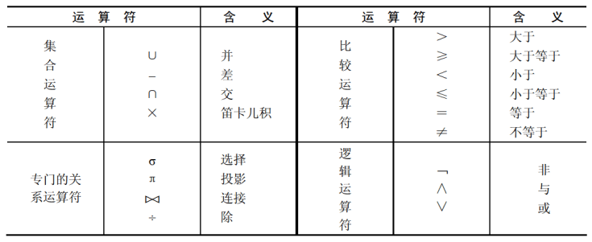
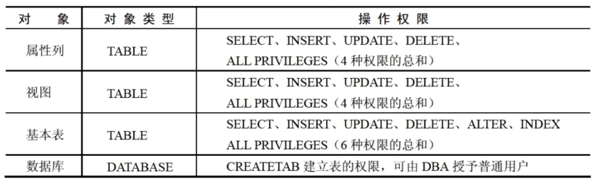
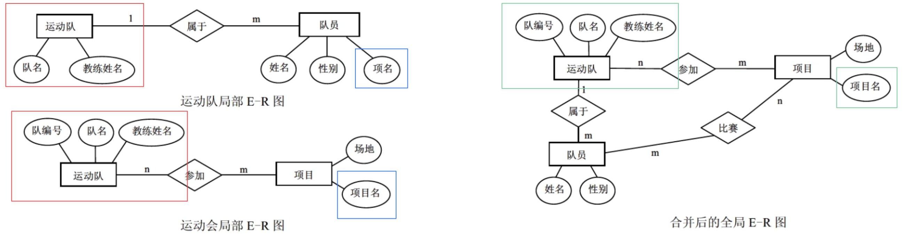

::: details 目录
[[toc]]
:::


## 🍀 概念数据模型（E-R 图）

- <u>实体</u>：*客观存在并且可以相互区别的事物* 称为实体。如一个单位，一个职工
- <u>属性</u>：*描述实体的特征* 称为属性。如学生实体用若干属性（学号、姓名、性别、出生日期、班级号）来描述。
- <u>码</u>：*唯一标识实体的属性* 称为码。如学号是学生实体的码。
- <u>域</u>：*属性的取值范围* 称为该属性的域。如性别域为（男、女）
- <u>联系</u>：*实体之间的对应的关系* 称为联系。
    - 实体内部个属性之间的联系
    - 实体之间的联系
    - 一对一联系（1：1）。如班和班长之间是一对一联系。
    - 一对多联系（1：n）。班和学生之间是一对多联系。
    - 多对多联系（m：n）。课程和学生之间是多对多联系。
- <u>E-R 图</u>：实体——矩形，属性——椭圆，联系——菱形


## 🍀 结构数据模型

主要包括：层次（树结构）、网状（图结构）、**关系**（*二维表格结构*） 和面向对象模型

## 🍀 三级模式结构

> 采用 “三级模式和两级映像”

```
外模式 -> 视图
  ↓
概念模式/模式 —> 基本表
  ↕︎
内模式 -> 存储文件
```


### 两级映像*

数据库系统在三级模式之间提供了两级映像：模式/内模式映像、外模式/模式映像。保证了数据库中的数据具有较高的 *逻辑独立性* 和 *物理独立性*。

1. <u>模式/**内**模式映像</u>：实现了概念模式和内模式之间的相互转换。
   - <u>数据的**物理**独立性</u>：需要修改概念模式和内模式之间的映像。
2. <u>**外**模式/模式映像</u>：实现了外模式和概念模式之间的相互转换。
   - <u>数据的**逻辑**独立性</u>：需要修改外模式和概念模式之间的映像。

## 🍀 关系型模式的基本术语

- <u>关系</u>：一个关系就是一张 *二维表*，每个关系有一个关系名
- <u>元组</u>：*表中的一行* 即为一个元组，对应存储文件中的一个记录值。
- <u>属性</u>：*表中的列* 称为属性，每一列有一个属性名。属性值相当于记录中的数据项或者字段值。
- <u>域</u>：*属性的取值范围*。
- <u>关系模式</u>：*对关系的描述* 称为关系模式，由关系名和其属性集合构成，关系模式的格式为：`关系名（属性名 1，属性名 2，…，属性名 n）`
- <u>候选码</u>（候选键）：属性或 *属性组合* 其值能够 ==唯一地标识一个元组==。
- <u>主码</u>（主键）：在一个关系中可能有多个候选码，从中选择一个作为主码。
- <u>主属性</u>：所有候选键都称为主属性，其他的属性都称为非主属性。
- <u>外码</u>（或外键）：如果一个关系中的属性或属性组并非该关系（二维表）的码，但它们是 *另外一个关系（二维表）的码*，则称其为该关系的外码。

>- <u>全码</u>：关系模式的所有属性组是这个关系模式的候选码，称为全码。
>- <u>超码</u>（超键）：一个包含码的属性集称为超码。例如学号是码，则（学号，姓名）就是一个超码。

::: note
- 关系模型： R(U, D, dom, F)  
  - <u>U：一组属性</u>，D：域，dom：属性到域的映射，<u>F：属性组 U 上的一组数据依赖</u>
  - 通常把关系模式看作是一个三元组：<u>$R(U,F)$</u>
- 常 用的关系操作：选择、投影、连接、除、并、交、差等查询操作和增加、删除操作等
:::

## 🍀 完整性约束

关系模型中的 3 个完整性规则如下：

- <u>实体完整性</u>：关系中 *主码的值* 不能为空或部分为空。即 ==主属性不能为空== 。
- <u>参照完整性</u>：如果关系 R2 的外码 X 与关系 R1 的主码相对应，则 ==外码 X 的每个值必须在关系 R1 中的主码中找到，或者为空值==。
- <u>用户定义完整性*</u>：指用户对某一具体数据指定的 ==约束条件== 进行检验。（如手机号码为 11 位）


> 完整性规则保证用户对数据库做修改时不会破坏数据的一致性。


## 🍀 关系代数运算符



::: tip
笛卡尔积举例：$D_1=\{0, 1\}$，$D_2=\{a, b, c\}$  
则 $D_1 \times D_2 = \{(0,a),(0,b),(0,c),(1,a),(1,b),(1,c)\}$
:::

### 专门的关系运算符


1. <u>**投影**（Projection）</u>：投影运算是从关系的 *垂直方向* 进行运算，在关系 R 中选出 *若干属性列 A* 组成新的关系，记作 $π_A(R)$


2. <u>**选择**（Selection）</u>：选择运算是从关系的 *水平方向* 进行运算，是从关系 R 中选择满足 *给定条件 F* 的元组，记作 $σ_F(R)$


3. <u>**连接**（Join）</u>：连接运算是从两个关系 R 和 S 的 *笛卡儿积中* 选取满足条件的元组。
    1. $θ$ 连接：从 R 与 S 的笛卡儿积中选取属性间满足一定条件的元组。

        

    2. 等值连接：当 $θ$ 为 “=” 时，称之为等值连接。

    3. **自然连接**：自然连接是 ==除去重复属性的等值连接==。例如下图，选出符合 R.A=S.A，R.C=S.C 的行，合并后去除重复属性 S.A、S.C。

        
    > 可以认为笛卡儿积是无条件连接，其他的连接操作认为是有条件连接。

4. <u>外连接</u>：外连接运算是连接运算的扩展，可以处理 *由于连接运算而缺失的信息*。（P17 集）

    - 左外连接（$⟕$）：取出左侧关系中所有与右侧关系中任一元组都不匹配的元组，用空值 null 充填所有来自右侧关系的属性，构成新的元组，将其加入自然连接的结果中。

    - 右外连接（$⟖$）：取出右侧关系中所有与左侧关系中任一元组都不匹配的元组，用空值 null 填充所有来自左侧关系的属性，构成新的元组，将其加入自然连接的结果中。

    - 全外连接（$⟗$）。完成左外连接和右外连接的操作。即填充左侧关系中所有与右侧关系中任一元组都不匹配的元组，并填充右侧关系中所有与左侧关系中任一元组都不匹配的元组，将产生的新元组加入自然连接的结果中。

    

    ::: tip
    左连接就是左边的表格不会丢失信息，右链接就是右边的表格不会丢失信息
    :::

5. ~~除（一般不考）~~：$R \div S$，即把 R 中与 S 重复的属性列去掉，并去除重复的属性行，保留能在 S 中可以找到的行。

    

::: tip
遇到查询效率的题，选择先查询，后笛卡尔积，最后投影的选项，案例：


:::


## 🍀 SQL 语言

- 投影、选择转 SQL 语言  
    $$π_{A,B,C}(σ_{B >= '5'}(R))$$
    ```sql
    SELECT A, B, C FROM R WHERE B >= 5 
    # '' 可以省略
    # 错误案例：
    SELECT 1, 2, 3 FROM R WHERE 2 >= 5
    # SQL 语言不支持查询列的序号
    ```
- 笛卡尔积转 SQL 语言  
    $$π_{R.A,R.B,R.C,S.A,S.B,S.D}(R \times S)$$
    ```sql
    SELECT R.A, R.B, R.C, S.A, S.B, S.D 
    FROM R,S
    ```
- 自然连接转 SQL 语言  
    $$\pi_{R.A,R.B,R.C,S.D}(\sigma_{R.B=S.B \wedge R.C=S.C}(R \times S))$$
    ```sql
    SELECT R.A, R.B, R.C, S.D 
    FROM R, S
    WHERE R.B = S.B AND R.C = S.C
    ```

### SQL 语言的分类

::: tip
`[]` 表示可选择的
:::

- <u>**DDL**（Data Definition Language，数据定义语言）</u>：用来定义数据库对象：数据库，表，列等。例如建立/删除一个数据库对象。

    关键字：`CREATE`、`DROP`、`ALTER` 等。
    ```sql
    # 创建数据库
    CREATE DATABASE DB
    # 创建基本表
    CREATE TABLE <表名>(
        <列名> <数据类型> [列级完整性约束条件]
    )

    # 修改基本表结构
    ## 增加
    ALTER TABLE <表名> ADD <列名> <数据类型>
    ## 修改，MySQL 中使用 MODIFY
    ALTER TABLE <表名> ALTER COLUMN <列名> <新类型>
    ## 删除
    ALTER TABLE <表名> DROP COLUMN <列名>

    # 删除基本表
    DROP TABLE <表名>
    ```
    ::: tip
    **列级完整性约束条件** 有：
    - NOT NULL 不为空
    - UNIQUE 唯一，不能重复
    - NOT NULL UNIQUE
    - DEFAULT 指定默认值
    :::

- <u>**DML**（Data Manipulation Language，数据操作语言）</u>：用来对数据库中表的数据进行 *增删改*。

    关键字：`INSERT`、`DELETE`、`UPDATE` 等。
    ```sql
    # INSERT 插入语句
    ## 直接插入元组值
    INSERT INTO 表名 (列表序列) VALUES (元组值)
    ## 或者
    INSERT INTO 表名 (列表序列) (TABLE (元组值),(元组值),...)
    ## 插入一个查询的结果值（很少使用）
    INSERT INTO 表名 (列表序列) SELECT 查询语句
    
    # DELETE 删除语句
    DELETE FROM 表名 [WHERE 条件表达式]
    
    # UPDATE 修改语句
    UPDATE 表名
    SET 列名 = 值表达式[, 列名 = 值表达式...]
    [WHERE 条件表达式]
    ```
    
- <u>**DQL**（Data Query Language，数据查询语言）</u>：用来 *查询* 数据库中表的记录。

    关键字：`SELECT` 等。
    ```sql
    SELECT 目标表的列名或列表达式序列 
    FROM 关系名表序列 
    [WHERE 行条件表达式]
    [GROUP BY 列名序列
    [HAVING 组条件表达式]]
    [ORDER BY 列名[ASC][DESC]...]
    ```

- <u>**DCL**（Data Control Language，数据控制语言）</u>：用来定义数据库的 *访问权限和安全级别，及创建用户*。

### SQL 查询

#### 投影查询

```sql
SELECT 学号, 姓名, 班级 FROM student

# 去掉重复行
SELECT DISTINCT 系别 FROM teacher

# 改变查询结果中的列名
SELECT 学号 AS 'SNO', 姓名 AS 'SNAME' FROM student
```

#### 选择查询

```sql
# 条件表达式的比较运算
SELECT * FROM score
WHERE 分数 BETWEEN 60 and 80

# 字符串的匹配运算（模糊查询）
[NOT] LIKE '匹配串' [ESCAPE '匹配串']

# 匹配串可以含有通配符 % 和 _，如
SELECT * FROM student
WHERE 姓名 LIKE '王%'

# 集合的比较运算
SELECT * FROM score
WHERE 分数 IN (85,86,88)

# 逻辑组合运算
SELECT 学号,姓名,班号 FROM student
WHERE 班号='09031' OR 性别='女'
```

::: tip
- %（百分号）：代表任意长度（可以为 0）的字符串
- _（下划线）：代表任意单个字符
:::

#### 排序查询

```sql
# 默认 ASC 升序，DESC 降序
SELECT 学号,姓名,班号 FROM student
WHERE 性别='男'
ORDER BY 班号 DESC
```


#### 聚合函数


```sql
# 一般格式
[ALL | DISTINCT] expr

# 例
SELECT COUNT(*) AS '人数' FROM student
WHERE 班号='09031'
```

::: warning
聚合函数作为查询条件时，使用 `HAVING` 而非 `WHERE`
:::

#### 分组查询

```sql
SELECT 学号 FROM score
WHERE 分数 IS NOT NULL
GROUP BY 学号
HAVING MIN(分数)>70 and MAX(分数)<90
```


#### ~~连接查询(了解即可)~~

```sql
SELECT 列名1,列名2,... 
FROM 表1,表2,... 
WHERE 连接条件
```

SQL Server 中，连接分为内连接和外连接:

##### 内连接 INNER JOIN

```sql
# (1) 等值连接
SELECT student.姓名,score.课程号,score.分数 
FROM student,score
WHERE student.学号=score.学号

## 替换为
SELECT student.姓名,score.课程号,score.分数 
FROM student INNER JOIN score
ON student.学号=score.学号

## 可以简化输入，使用表的别名
SELECT y.课程号，AVG(y.分数) AS '平均分' 
FROM student x,score y
WHERE x.学号=y.学号 AND x.班号='09033' AND y.分数 IS NOT NULL
GROUP BY y.课程号

# (2) 非等值连接
SELECT 学号,课程号,等级 
FROM score,grade 
WHERE 分数 BETWEEN low AND upp
ORDER BY 等级

# (3) 自然连接
SELECT x.课程号，x.学号，x.分数 
FROM score x,score y 
WHERE x.课程号='13-105' AND x.分数>y.分数 AND y.学号='109' AND y.课程号='13-105' 
ORDER BY x.分数 DESC
```

##### 外连接 OUTER JOIN

```sql
# 左外连接
SELECT course.课程名,teacher.姓名 
FROM course 
LEFT JOIN teacher ON（course.任课教师编号=teacher.教师编号）

# 右外连接
SELECT course.课程名,teacher.姓名 
FROM course 
RIGHT JOIN teacher ON（course.任课教师编号=teacher.教师编号）

# 全外连接
SELECT course.课程名,teacher.姓名 
FROM course 
FULL JOIN teacher ON（course.任课教师编号=teacher.教师编号）
```

#### 子查询

##### 一般子查询

```sql
# 检索 student 表中与学号为 '105' 的学生同年出生的所有学生的学号、姓名和出生日期列。
SELECT 学号,姓名,YEAR(出生日期) AS '出生年份' 
FROM student
WHERE YEAR(出生日期)=(
    SELECT YEAR(出生日期)
    FROM student WHERE 学号='105')

# 检索考试成绩为最高分的学生姓名
SELECT 姓名 FROM student 
WHERE 学号=(
    SELECT 学号 FROM score 
    WHERE 分数=(
        SELECT MAX(分数) FROM score 
        WHERE 分数 IS NOT NULL))
```

一个子查询的返回值为多行时，需要使用 ANY、ALL、IN 和 NOT IN 等选项：

```sql
# 检索选修学生人数多于 5 人的某课程的任课教师姓名
SELECT 姓名 FROM teacher 
WHERE 教师编号 IN (
    SELECT x,任课教师编号 FROM course x,score Y 
    WHERE x.课程号=y.课程号 
    GROUP BY x.任课教师编号 
    HAVING COUNT(x.任课教师编号)>5)

# 检索选修教师编号为 '3-105' 课程且成绩至少高于选修教师编号为 '3-245' 课程的学生的课程号、学号和分数，并按分数从高到低次序排列。
# ANY 表示至少有一条记录符合
SELECT 课程号,学号,分数 FROM score
WHERE 课程号='3-105' AND 分数 > ANY(
    SELECT 分数 FROM score
    WHERE 课程号='3-245')
ORDER BY 分数 DESC

# ALL 表示全部记录符合条件
```

##### 相关子查询

内层的条件涉及到外层属性的子查询。

> 子查询不止执行一次

```sql
# 检索成绩比该课程平均成绩低的学生成绩表
SELECT 学号,课程号,分数 FROM score a 
WHERE 分数 < (
    SELECT AVG(分数) FROM score b 
    WHERE a.课程号=b.课程号 AND 分数 IS NOT NULL)
```

##### 带 EXISTS 测试的子查询

不反悔任何数据，只返回逻辑真值和逻辑假值。（结果不为空，返回逻辑真值；否则返回逻辑假值）

```sql
# 检索所有未任课教师的姓名和系别
SELECT 姓名,系别 FROM teacher a 
WHERE NOT EXISTS(
    SELECT * FROM course b 
    WHERE a.教师编号=b.任课教师编号)
```

#### 查询结果的并、交、差运算

```sql
# 并 UNION
SELECT 姓名,性别,YEAR(出生日期) AS '出生年份' 
FROM teacher 
UNION
SELECT 姓名,性别,YEAR(出生日期) AS '出生年份' 
FROM student

# 交 INTERSECT
## 取出两个表相同内容的元组

# 差 EXCEPT
## 去除表 1 与表 2 相同内容的元组
```

### SQL 控制语句



#### 授权

```sql
# 格式
GRANT <权限>[,<权限>]... [ON <对象类型> <对象名>]
TO <用户>[,<用户>]...
[WITH FRANT OPTION]
```

::: tip
- `PUBLIC`：可将权限赋给全体用户
- `[WITH FRANT OPTION]`：若指定了此子句，那么获得了权限的用户可以将权限赋给其他用户
:::

例：如果用户要求给数据库 SPJ 中的供应商 S、零件 P、项目 J 表赋予各种权限。


```sql
# 1.将对供应商 S、零件 P、项目 J 的所有操作权限赋给用户 User1 及 User2
GRANT ALL PRIVILEGES ON TABLE S,P.J TO User1,User2;

# 2.将对供应商 S 的插入权限赋给用户 User1，并允许将此权限赋给其他用户
GRANT INSERT ON TABLE S TO User1 WITH GRANT OPTION

# 3.DBA 把数据库 SPJ 中建立表的权限赋给用户 User1 
GRANT CREATETAB ON DATABASE SPJ TO User1
```

#### ~~收回权限~~

```sql
# 格式
REVOKE <权限>[,<权限>]... [ON <对象类型> <对象名>]
FROM <用户>[,<用户>]...
```


例：要求回收用户对数据库 SPJ 中供应商 S、零件 P、项目 J 表的操作权限。 


```sql
# 1.将用户 User1 及 User2 对供应商 S、零件 P、项目 J 的所有操作权限收回。 
REVOKE ALL PRIVILEGES ON TABLE S,P,J FROM User1, User2； 
# 2.将所有用户对供应商 S 的所有查询权限收回。 
REVOKE SELECT ON TABLE S FROM PUBLIC； 
# 3.将 User1 用户对供应商S的供应商编号 Sno 的修改权限收回。
REVOKE UPDATE(Sno) ON TABLE S FROM User1；
```

#### 视图创建与删除

视图是从一个或者多个基本表或视图中导出的表，是一个 *虚拟表*。

```sql
# 创建
CREATE VIEW 视图名(列表名) 
  AS SELECT 查询子句
  [WIIH CHECK OPTION]

# 删除
DROP VIEW 视图名
```

`WITH CHECK OPTION` 表示对 UPDATE、INSERT、DELETE 操作时保证更新、插入 或删除的行满足视图定义中的谓词条件（即*子查询中的条件表达式*）。


#### 索引建立与删除

索引可以理解为书签。-->改变的是内模式（存储文件）

```sql
# 创建
CREATE [UNIQUE] [CLUSTER] INDEX <索引名＞
  ON <表名>(<列名>[<次序>][,<列名>[<次序>]]...)
# 次序：ASC(升序) / DESC(降序)
# UNIQUE：表明此索引的每一个索引值只对应唯一的数据记录。
# CLUSTER：表明要建立的索引是聚簇索引，意为索引项的顺序是与表中记录的物理顺序一致的索引组织。
```


## 🍀 函数依赖

$$X \rightarrow Y$$

X 函数决定 Y 或 Y 函数依赖于 X。

1. $X\rightarrow Y$，$Y\notin X \rightarrow$ 非平凡的函数依赖
2. $X\rightarrow Y$，$Y\in X \rightarrow$ 平凡的函数依赖
3. $X\rightarrow Y$，且对于 X 的任何一个真子集 X‘ 都有 X’ 不能决定 Y，则 Y 对 X **完全函数依赖**，记作 $X \stackrel{f}{\longrightarrow} Y$
   - 例如（*学号，课程号*）→ *成绩*
4. $X\rightarrow Y$，但 Y 不完全依赖于 X，则称 Y 对 X **部分函数依赖**，记作 $X \stackrel{P}{\longrightarrow} Y$
   - 例如（*学号*，课程号）→ *姓名*
5. $X\rightarrow Y$，$Y\notin X$，$Y\rightarrow Z$，则称 Z 对 X 传递依赖。
   - 例如 员工号 → 岗位，岗位 → 工资，则 员工号 → 工资
6. 函数依赖的公理系统。设关系模式 R(U,F)，则：
   - A1 自反律：$Y\in X\in U$，则 $X\rightarrow Y$ 为 F 所蕴涵；
   - A2 增广律：若 $X\rightarrow Y$ 为 F 所蕴涵，且 $Z\in U$，则 $XZ\rightarrow YZ$ 为 F 所蕴涵；
   - <u>A3 传递率</u>：$X\rightarrow Y$，$Y\rightarrow Z$ 为 F 所蕴涵，则 $X\rightarrow Z$ 为 F 所蕴涵；  

   根据上述规则又可推出： 
   - <u>合并规则</u>：$X\rightarrow Y$，$Y\rightarrow Z$，则 $X\rightarrow YZ$ 为 F 所蕴涵；
   - 伪传递律：$X\rightarrow Y$，$WY\rightarrow Z$，则 $XW\rightarrow YZ$ 为 F 所蕴涵；
   - <u>分解规则</u>：$X\rightarrow Y$，$Z\in Y$，则 $X\rightarrow Z$ 为 F 所蕴涵；

### 求关系模式的闭包


- 给定关系 $R(U,F)$, $U=\{A,B,C,D,E,H\}$, $F=\{A→B, B→DH, A→H, C→E\}$

   - $(A)^+ → (ABH)^+ → (ABDH) \neq U$
   - $(AC)^+ → (ABHCE)^+ → (ABDHCE) = U$
   - $AC$

::: tip
去除 U 在 F 中箭头右边出现过的属性，如上题 F 中的 BDHE，U 中仅剩 AC，则候选关键字中肯定含有 A、C。
:::

- 假设关系 $R<U,F>$, $U=\{A, B, C, D\}$, $F=\{A→BC, AC→D, B→D\}$
   - $(A)^+ → (ABC)^+ → (ABCD) = U$

- 假设关系 $R<U,F>$, $U=\{A_1，A_2，A_3\}$, $F=\{A_1A_3 → A_2，A_1A_2 → A_3\}$
   - $(A_1A_3)^+ → (A_1A_3A_2) = U$
   - $(A_1A_2)^+ → (A_1A_2A_3) = U$


## 🍀 关系模式的范式

候选码中包含的属性称为主属性、不包含在候选码中的属性称为非主属性。

若候选码多于一个，可以选定其中的一个为主码。


### 1NF（第一范式）

定义：若关系模式 R 每一个属性 A 的值域只包含原子项，即 *不可再分割的数据项*，则关系模式 R 属于第一范式。

1NF 可能存在的问题：

- <u>数据冗余</u>：数据的冗余度大，R 中可能出现多个元组在多个属性集中值相同
- <u>修改异常</u>：引起修改操作的不一致性，修改一条记录可能需要修改其他多条记录才能保持数据一致性（由数据冗余引起）
- <u>插入异常</u>：主码不能取空值或部分空值，会出现插入异常
- <u>删除异常</u>：本该删除但又客观存在的元组，会出现删除异常。即，删除掉的数据可能包含着其他本不该被删除的属性

原因是 1NF 中 ==可能存在部分函数依赖==。


### 2NF（第二范式）

定义：若关系模式 $R\in 1NF$，且每一个非主属性都完全依赖于候选码，则关系模式 $R\in 2NF$。

当 1NF 消除了非主属性对码的部分函数依赖，则称为 2NF。

可能存在数据冗余和更新异常等问题（可能存在传递函数依赖）。


### 3NF（第三范式）

2NF 消除了非主属性对码的传递函数依赖，则称为 3NF。


属于 3NF 的关系模式 R 可能存在主属性对候选码的部分依赖和传递依赖。


### BC 范式（BCNF）

定义：R 是一个关系模式，F 是它的依赖集，R 属于 BCNF，当且仅当其 F 中的每个依赖的决定因素必定包含 R 的某个候选码。


::: note
一个满足 BCNF 的关系模式有：
- 所有非主属性对每一个码都是完全函数依赖。 
- 所有的主属性对每一个不包含它的码，也是完全函数依赖。 
- 没有任何属性完全函数依赖于非码的任何一组属性。
:::

BC 范式已经 ~~消除了插入和删除异常~~

### 规范化步骤

1NF 到 4NF 之间的转换关系：


### 考题分析

1. 某销售公司数据库的零件关系 $P (零件号, 零件名称, 供应商, 供应商所在地, 库存量)$， 函数依赖集 $F=\{零件号 → 零件名称, (零件号, 供应商) → 库存量, 供应商 → 供应商所在地\}$ 。

2. 设有关系模式 $R(E, N, M, L, Q)$，其函数依赖集为 $F=\{E→N, EM→Q, M→L\}$ 。

3. 设有关系模式 $R(课程, 教师, 学生, 成绩, 时间, 教室)$ ，其中函数依赖集 $F=\{课程 → 教师, (学生, 课程) → 成绩, (时间, 教室) → 课程, (时间, 教师) → 教室, (时间, 学生) → 教室\}$ 

::: tip
1. 先找候选码
2. 然后找是否存在部分函数依赖 → 是，则满足 1NF；
3. 否则找是否存在传递函数依赖 → 是，则满足 2NF；
4. 否则找是否存在主属性对码的部分/传递函数依赖 → 是，则满足 3NF；否则满足 BCNF；
:::

### 补充

无损连接：关系模式分解后应能通过 **自然连接** 运算恢复。

## 🍀 数据库设计

新奥尔良法是目前公认的数据库设计方法，它将数据库设计分为以下几个阶段：

1. 用户需求分析：收集用户需求，确定系统边界
2. 概念结构设计：E—R 图
3. 逻辑结构设计：E—R 图转换成关系模式、规范化
4. 物理结构设计

### 需求分析

- *需求分析是后面几个阶段，逻辑结构设计、物理结构设计以及应用程序设计的依据*。
- 需求分析将收集到的零碎的、局部的数据分析整理后，建立 **需求说明文档** 、**数据字典** 和 **数据流程图**。
- 需求分析阶段的成果是 **系统需求说明书**，包括
  - 数据流图、数据字典、各种说明性表格、统计输出表、系统功能结构图等

### 概念结构设计


> E-R 模型（Entity-Relationship Model），即 实体-联系模型。E-R 图中实体为矩形，联系为菱形。


对需求分析阶段所得到的数据进行分类、聚集和概括，确定实体、属性和联系。

1. 选择局部应用
2. 逐一设计分 E-R 图
3. E-R 图合并

分 E-R 图之间的冲突

1. <u>属性冲突</u>。同一属性可能会存在于不同的分 E-R 图。
2. <u>命名冲突</u>。异名同义、同名异义
3. <u>结构冲突</u>。同一实体在不同的分 E—R 图中有不同的属性，同一对象在某一个 E—R 图中被抽象为实体，而在另一个 E—R 图中被抽象为属性，需要统一。



### 逻辑结构设计

逻辑结构设计阶段的主要工作步骤包括：

- 确定数据模型
- 将 E-R 图转换成为指定的数据模型


- 确定完整性约束和确定用户视图
- 关系规范化


## 🍀 事务管理*

事务是一个操作序列，这些操作 “要么都做，要么都不做”。

事务和程序是两个不同的概念，一般一个程序可包含多个事务。

事务的 ACID 性质：

- <u>原子性（Automicity）</u>：事务是原子的，要么都做，要么都不做。
- <u>一致性（Consistency）</u>：事务执行的结果必须保证数据库从一个一致性状态变到另一个一致性状态。
- <u>隔离性（Isolation）</u>：事务相互隔离。当多个事务并发执行时，任一事务的更新操作直到其成功提交的整个过程，对其他事务都是不可见的。
- <u>持久性（Durability）</u>：一旦事务成功提交，即使数据库崩溃，其对数据库的更新操作也将永久有效。

## 🍀 分布式数据库

- <u>分片</u>透明：指用户或应用程序不需要知道逻辑上访问的表具体是怎么 *分块存储* 的
- <u>复制</u>透明：指采用复制技术的分布方法，用户不需要知道数据是 *复制到哪些节点* ，如何复制的。
- <u>位置</u>透明：指用户无须知道 *数据存放的物理位置*
- <u>逻辑</u>透明：指用户或应用程序无需知道局部场地 *使用的是哪种数据模型*

---

- <u>共享</u>性：指数据存储在不同的结点数据共享
- <u>自治</u>性：指每结点对本地数据都能独立管理
- <u>可用</u>性：指当某一场地故障时，系统可以使用其他场地上的副本而不至于使整个系统瘫痪
- <u>分布</u>性：指数据在不同场地上的存储

