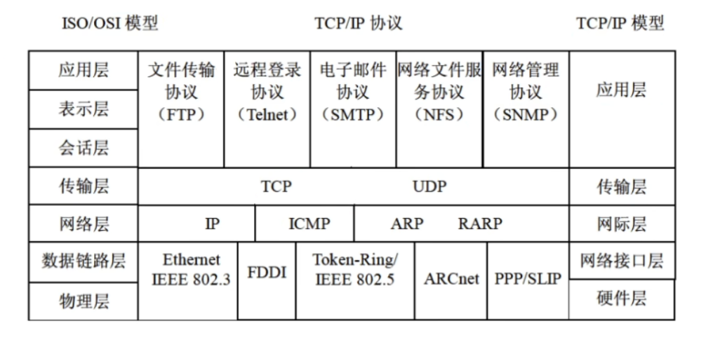
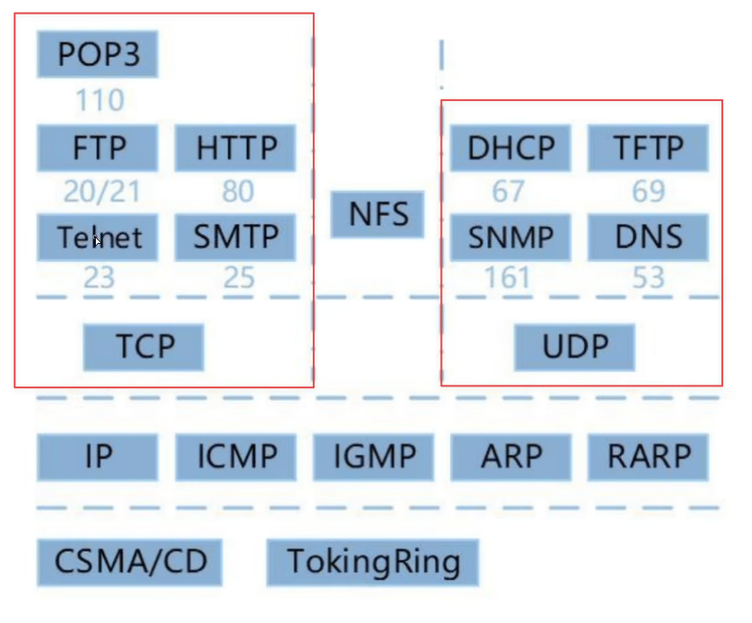
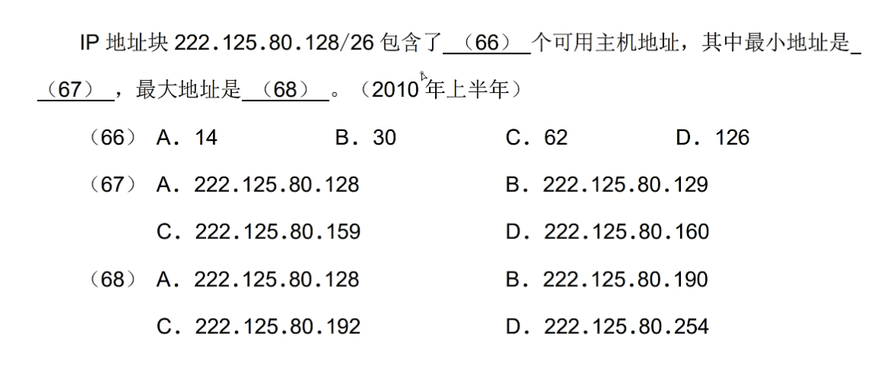

::: details 目录
[[toc]]
:::

## 🍀 网络的设备

- <u>物理层</u>：中继器、集线器（**多路或多端口**的中继器）
- <u>数据链路层</u>：网桥、交换机（**多端口**的网桥）
- <u>网络层</u>：路由器、ICMP（控制报文协议）
- <u>应用层</u>：网关

||广播域 | 冲突域 |
| :-------: | :----: | :----: |
|   物理层（集线器）   |   ×|  ×|
| 数据链路层（交换机） |   ×|  √|
|   网络层（路由器）   |   √|  √|

## 🍀 协议簇

- FTP 的端口号：20（数据端口）、21（控制端口）
- http 的端口号：80
- https 的端口号：443
- DNSD 的端口号：53

## 🍀 TCP 和 UDP

> IP 提供的服务是无连接、不可靠的。

- TCP（传输控制协议）：在 *IP* 提供的不可靠数据服务的基础上为应用程序提供了*可靠的、面向连接的、全双工的*数据传输服务。采用三次握手来确认建立和关闭连接是否成功。TCP 的功能或服务有：
    - 可靠传输
    - 连接管理
    - 差错校验和重传
    - 流量控制：采用可变大小的滑动窗口协议
    - 拥塞控制
    - 端口寻址
> TCP使用的流量控制协议是可变大小的滑动窗口协议

- UDP（用户数据报协议）：是一种*不可靠的、无连接*的协议，可以保证应用程序进程间的通信。UDP 上的应用有 VoIP 等。
    - UDP 的首部 8B，TCP 的首部 20B，UDP 相比 TCP 来说，*开销较小*。
    - TCP 和 UDP 均提供了端口寻址功能。

补充：

1. TCP 和 UDP 都是*基于 IP 协议*，应用于**传输层**的网络协议。
2. TCP 有助于提供可靠性，UDP 有助于提高传输的高速率性。

## 🍀 电子邮件协议 SMTP 和 POP3

- SMTP 和 POP3 都使用 TCP 端口传输和接收邮件。
- <u>SMTP</u>：仅传输 *ASCII 文本*，~~不能传输非文字性附件~~。主要用来**发邮件**，可以使用 MIME（邮件附件 k 扩展协议），添加其他类型的附件。TCP 端口号：**25**。
- <u>POP3</u>：**邮件接收**协议；TCP 端口号：**110**。
  - POP3 基于 C/S 模式（Client/Server 模式，客户端/服务器模式）。
- <u>PEM</u>：私密邮件

## 🍀 ARP 和 RARP

> 是**网络层**的重要协议

- <u>ARP（地址解析协议）</u>：将 **IP 地址** 转换为 **MAC 地址**（物理地址）。

    ::: tip
    IP 到 MAC 地址的转换过程（*当计算机需要与任何其他的计算机进行通信时*）：
    1. 查询 ARP 高速缓存中是否有该 IP 地址
    2. 如果该 IP 地址在 ARP 高速缓存中，便使用与它对应的 MAC 地址，将数据报发送给所需的物理网卡
    3. 如果 ARP 高速缓存中没有该 IP 地址，ARP 便在局域网上以 **广播** 方式发送一个 ARP 请求包
    4. 如果局域网上 IP 地址与某台计算机中的 IP 地址相一致，那么该计算机便生成一个 ARP 应答信息（单播），信息中包含对应的 MAC 地址。（**广播传送请求，单播传送响应**）
    :::

- <u>RARP（反地址解析协议）</u>：将 **MAC 地址** 转换为 **IP 地址**，主要用于无盘工作站。

## 🍀 DHCP（动态主机配置协议）

- DHCP 协议的功能和作用是：
    - 集中的管理、自动分配 IP 地址
    - 使网络环境中的主机**动态地***获得 IP 地址、Gateway 地址、DNS 服务器地址等信息*
    - 提升地址的使用率

- DHCP 客户端可以从 DHCP 服务器获得以下内容：
    - 本机 IP 地址
    - DNS 服务器地址
    - DHCP 服务器地址
    - 默认网关的地址

- 无效地址：
    - Windows 无效地址：169.254.X.X
        > 169.254.X.X 是 Windows 系统在 DHCP 信息租用失败时自动给客户机分配的 IP 地址
    - Linux 无效地址：0.0.0.0

## 🍀 URL

`协议名://主机名.域名.域名后缀.域名分类/目录/网页文件`

| 组织模式 |       含义   |地理模式 |   含义   |
| :------: | :--------------: | :------: | :------: |
|   com|    商业机构 |   cn|  中国   |
|   edu|    教育机构 |   hk|中国香港 |
|   gov|    政府机构 |   mo|中国澳门 |
|   mil|    军事部门 |   tw|中国台湾 |
|   net|主要网络支持中心 |    us|  美国   |
|   org|  上述以外组织   |    uk|  英国   |
|   int|    国际组织 |   jp|  日本   |

**IPv6 128 位地址空间、IPv4 32 位地址空间。**

## 🍀 浏览器

- <u>DNS 域名查询次序</u>是：本地的 hosts 文件 $→$ 本地 DNS 缓存 $→$ 本地 DNS 服务器 $→$ 根域名服务器
- <u>主域名服务器在接受域名请求后查询顺序</u>是：本地缓存 $→$ 本地 hosts 文件 $→$ 本地数据库 $→$ 转发域名服务器

## 🍀 internet 地址

Internet 地址格式主要有两种书写形式：

- 域名
- IP 地址

### IP 地址

IP 地址：Internet 中的主机地址实际上是用 IP 地址来唯一标识的。

IP 地址有两种：

- IPv4
- IPv6

> 通常 IP 地址是指 IPv4。

### IPv4

> 主要考察 A、B、C 三类

每个 IPv4 地址都由 4 个小于 256 的数字组成（每个数字 8 位，共 32 位），数字之间用 `.` 分开，可分为 5 类：

补充：

- 在 IPv4 中，全 `0` 代表的是网络，全 `1` 代表的是广播。
- IPv4 能表示的地址个数为：2^32^≈40 亿。

### 子网掩码

网络软件和路由器使用**子网掩码**来识别报文是仅存放在网络内部还是被路由转发到其他地方。

子网掩码是用来指明特定的 IP 地址中的网络号和主机号部分。子网掩码的格式与 IP 地址相同：

- 所有对应网络号的部分用 `1` 填上；
- 所有对应主机号的部分用 `0` 填上。

::: tip 例题解析
`/26` 表示 32 位地址被划分为 26 位（网络地址） + 6 位（主机地址），所以共有 $2^6=64$ 个主机地址，去掉全是 1/0 的地址，还有 62 个可用主机地址；$26=8+8+8+2$，$128 = 10\quad000000$，最小地址为 $10\quad000001 = 129$，最大地址为 $10\quad111110 = 32+16+8+4+2 = 190$
:::

### IPv6

IPv6 具有长达 128 位的地址空间，可以彻底解决 IPv4 地址不足的问题。

IPv6 理论上能表示的地址个数：2^128^=3.4×10^38^

> 在想象得到的将来，IPv6 的地址空间是不可能用完的。

### 无线通信技术

流行的无线通信技术有 WiFi、蓝牙等。其中，*蓝牙覆盖范围最小、通信距离最短*。

### ipconfig 命令

- `ipconfig` 用于查询本机 IP 信息。
- `traceroute` ：是 Linux 下的命令，对应 windows 命令为 `tracert` 路由跟踪命令
- `netstat` ：是一个监控 TCP/IP 网络的非常有用的工具。它可以显示路由表、实际的网络连接以及每一个网络接口设备的状态信息
- `nslookup` ：域名查询命令，用于查询 DNS 解析域名记录

ipconfig 命令的用法如下：

| 参数  |    说明|   示例   |
| :---: | :----: | :----: |
|  无参数 |  显示所有网络适配器的 IP 地址、子网掩码和缺省网关值  |    `ipconfig` |
| `/all` | 显示所有网络适配器的完整 TCP/IP 配置信息，包括 DHCP 服务是否已启动 |  `ipconfig /all` |
| `/displaydns`  |  显示本地 DNS 内容   | `ipconfig/displaydns`  |
|  `/flushdns`   |  **清除**本地 DNS **缓存**内容      | `ipconfig /flushdns`   |
| `/registerdns` | DNS 客户端手工向服务器进行**注册** |`ipconfig /registerdns` |
|   `/release`   | DHCP 客户端手工**释放** IP 地址 / 释放所有连接  |  `ipconfig /release`   |
|    `/renew`|DHCP 客户端手工向服务器**刷新**请求（重新申请 IP 地址）/ 更新所有适配器 |    `ipconfig /renew`|

::: tip
使用 ping 命令进行网络检测，按照由近及远原则，首先执行的是 ping 127.0.0.1，其次是 ping 本地 IP，再次是 ping 默认网关，最后是 ping 远程主机。
:::

### 路由

1. 主机路由 Host route，子网掩码 255.255.255.255
2. 网络路由（直连网络 + 远程网络）
3. 默认路由，目标网络和网络掩码都是 0.0.0.0

> - 如果**路由器**收到了**多个**路由协议转发的关于某个目标的**多条路由**，则*比较各个路由的管理距离*，并采用*管理距离小的*路由来源提供的路由信息。
> - 自适应路由依据网络信息进行代价计算，依据最小代价实时更新路由。

## 🍀 HTML

略

## 🍀 Linux

略
