::: details 目录
[[toc]]
:::


## 🍀 程序设计语言的基本概念

$$源程序 → 解释器/编译器 → 机器指令$$

- *解释器*（脚本语言，如 Python、PHP、JS 等）：翻译源程序 **不生成** 独立的目标程序
   - 解释程序和源程序 *要* <u>参与到程序的运行过程中</u>
   - 举例： `.py` → `.pyc`
- *编译器*：将源程序翻译成独立保存的 **目标程序**
   - 机器上运行的是与源程序等价的目标程序，源程序和编译程序都 **不再** <u>参与目标程序的运行过程</u>
   - 举例： `.java`  → `.javac` → `.class`


---

## 🍀 程序设计语言基本成分

### 程序的三种基本控制结构

顺序、选择、循环


许多程序设计语言规定，程序中的数据必须具有类型，其作用是：
- 便于 <u>为数据**合理分配存储单元**</u>
- 便于 <u>对参与表达式计算的数据对象进行检查</u>
- 便于 <u>规定数据对象的**取值范围**及能够进行的运算</u>

### 函数定义

函数的定义包括两部分：函数首部和函数体。函数的定义描述了函数做什么和怎么做。

函数定义的一般形式为：

```java
返回值的类型 函数名 (形式参数表) // 函数首部 函数名 (实参表)；
{
    函数体；
}
```


- **值调用**（Call by Value）：函数调用时将实参的值传递给相应的形参
  - 将实参的 **值** 传递给相应的形参
  - 实参 *可以* <u>是变量、常量和表达式</u>
  - **不可以** 实现形参和实参间 *双向传递数据* 的效果
- ==**引用调用**==（Call by Reference）：当形式参数为引用类型时，形参名实际上是实参的别名，函数中对形参的访问和修改实际上就是针对相应实参所做的访问和改变
  - 将实参的 **地址** 传递给相应的形参
  - 实参必须有地址，**不能** <u>是常量（值）/表达式</u>
  - *可以* 实现形参和实参间 *双向传递数据* 的效果，即改变形参的值同时也改变了实参的值


---


## 🍀 编译程序基本原理

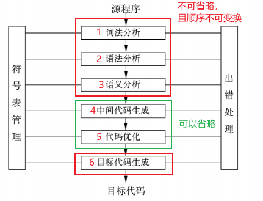

- 编译过程：**1**、**2**、**3**、4、5、**6**
- 解释过程：1、2、3


::: info 符号表

- 不断收集、记录和使用源程序中一些 *相关符号的类型和特征* 等信息，并将其存入符号表中。
- 记录源程序中各个字符的必要信息，以辅助 *语义的正确性检查* 和 *代码生成*。

:::


### ① 词法分析

> 输入：源程序

主要作用：分析构成程序的 **字符** 及由字符按照构造规则构成的 **符号**，是否 <u>符合程序语言的词法规则</u>。

> 输出：记号流

### ② 语法分析 ❗️

> 输入：记号流

主要作用：对各条语句的 **结构** 进行 *合法性分析*，分析程序中的句子结构是否正确。
  - *可以* 发现程序中 <u>所有的语法错误</u>

> 输出：语法树（分析树）

### ③ 语义分析 ❗️

> 输入：语法树

主要作用：***类型分析和检查***
  - *可以* 发现 <u>静态语义错误</u>
  - **不能** 发现程序中 <u>所有的语义错误</u>
  - **不能** 发现 <u>动态语义错误</u>（动态语义错误运行时才能发现，eg：`int a = 1 / 0;` 只能在运行阶段检查出来）

> 动态的语义错误，比如 **死循环**

### ⑥ 目标代码生成 

> 这一阶段的任务是把中间代码变换成特定机器上的绝对指令代码、可重定位的指令代码或汇编指令代码

- 目标代码生成阶段的工作 *与具体的机器密切相关*
- <u>寄存器的分配工作</u> 处于目标代码生成阶段


### ④ 中间代码生成 

::: info 中间代码生成阶段的工作是根据语义分析的输出生成中间代码。
:::

- *中间代码与具体的机器**无关***（不依赖具体的机器）, 可以将不同的高级程序语言翻译成同一种中间代码，中间代码 **可以** <u>跨平台</u>。
- 使用中间代码 ==有利于进行与机器无关的优化处理== 和 ==提高编译程序的可移植性==。
- 常见的中间代码：
   - <u>后缀式</u>、<u>三地址码</u>、<u>三元式</u>、<u>四元式</u>、<u>树（图）</u> 等


## 🍀 词法分析的工具*

### 正规式

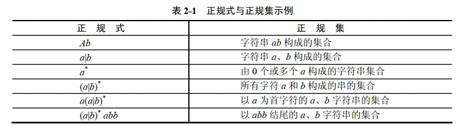

- `|` 表示两种字符串二选一
- `*` 表示该字符串可以出现 `0 ~ n` 次；


::: tabs

@tab 案例
- $(a^*a)^*b^*$ → a / ab / aab ...
- $(b^*(ab^*a)^*)^*$ → aa / baa / baba ...
- $(a^*(ba^*)^*b)^*$ → b / bb / abb / abab ...
- $(a|b)^*(aa)^*$ → a / b / aaa / baa ...
- $(b|ab)^*$ → b / ab / bb / bab ...
- $(ab^*)^*$ → a / ab / aab ...
- $(a^*b^*)^*$ → a / b / aab / abab ...

@tab 例题 1

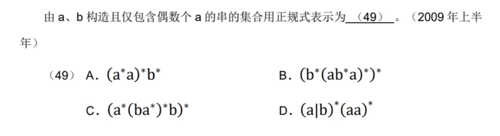

<details>
<summary>答案</summary>
B
</details>


@tab 例题 2

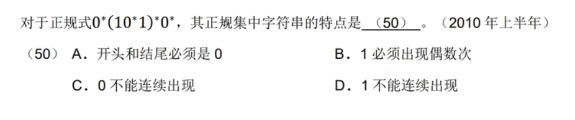

<details>
<summary>答案</summary>
B
</details>

@tab 例题 3

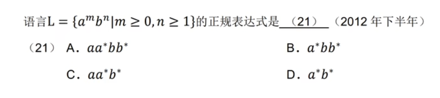

<details>
<summary>答案</summary>
B
</details>

@tab 例题 4

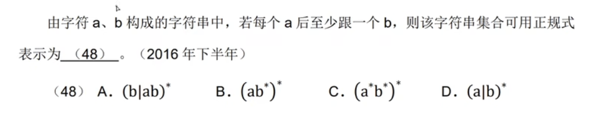

<details>
<summary>答案</summary>
A
</details>
@tab 例题 5*

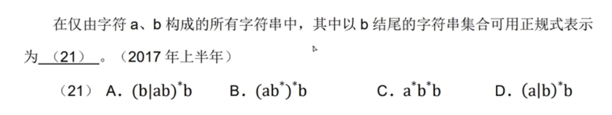

<details>
<summary>答案</summary>
D<br>
解析：题目的意思是有 n 个位置，每个位置上可以选 a 或者是 b，且必须最后一个位子是 b，然后选项中正规式满足所有排列组合的情况（即 ab / bab / aab /  abb ...）

</details>

:::


### 有限自动机*

> 有限自动机能正确地识别正规集

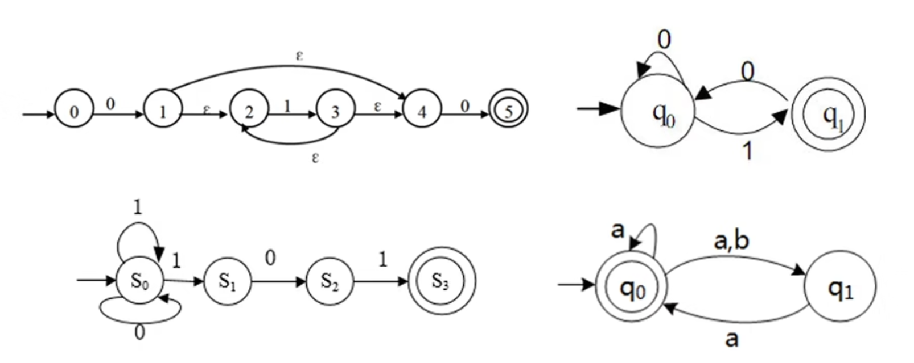

**初态**：一个圈；  **终态**：两个圈；

- 确定的有限自动机（DFA）
  - 对每一个状态来说识别字符后转移的状态是唯一的
- 不确定的有限自动机（NFA）
  - 对每一个状态来说识别字符后转移的状态是不确定的

$ε$： 不用识别即可转移（<u>可以理解为跳棋</u>）

::: tabs

@tab 例题 1


<details>
<summary>答案</summary>
D
</details>

@tab 例题 2


<details>
<summary>答案</summary>
B
</details>

@tab 例题 3


<details>
<summary>答案</summary>
C
</details>

@tab 例题 4


<details>
<summary>答案</summary>
A
</details>

@tab 例题 5


<details>
<summary>答案</summary>
C
</details>

@tab 例题 6


<details>
<summary>答案</summary>
A
</details>

@tab 例题 7


<details>
<summary>答案</summary>
C
</details>


@tab 例题 8


<details>
<summary>答案</summary>
A<br>
解析：该有限自动机必以 01 结尾，排除 B、D，C 选项不能表示 100101，错
</details>


@tab 例题 9


<details>
<summary>答案</summary>
B<br>
A 可以表示以 1 结尾的串，如 1111 ...；<br>
C 该有限自动机可以表示 01000，C 选项不可以；<br>
D 同样可以表示以 1 结尾的串；<br>
</details>

:::

### 上下文无关文法*

- 程序设计语言的绝大多数 **语法规则** 可以采用 **上下文无关文法** 进行描述。
- 上下文无关文法属于乔姆斯基定义的 2 型文法。


::: tabs

@tab 案例

简单算术表达式的结构可以用下面的上下文无关文法进行描述（E为开始符号），<u> ? </u>是符合该文法的句子。

$$
\begin{aligned}
& E → T \space | \space E + T \\
& T → F \space | \space T \times F \\
& F → -F \space | \space N \\
& N → 0 | 1 | 2 | 3 | 4 | 5 | 6 | 7 | 8 | 9
\end{aligned}
$$

A. $2--3\times4$        B. $2+-3\times4$  
C. $(2+3)\times4$       D. $2\times4-3$

> E：开始符号，N：终结符号 <br>
*E = T* <i>or</i> E = E + T <br>
*T = F* <i>or</i> T = T x F<br>
*F = -F* <i>or</i> F = N <br>
N = 0 <i>or</i> 1 <i>or</i> 2 ...<br>
推导只能从开始符号推导，最终的结果全为终结符号

<details>
<summary>答案</summary>
B <br>
解析：<br>
C 选项，无法推导出 ()，直接排除 <br>
A 选项，无法推导出 -- <br>
D 选项，无法推导出 N x N - N 的结构 <br>
B 选项，推导过程如下 <br>
E → E + T → T + T x F <br>
→ F + - F x N <br>
→ N + - N x N
</details>


@tab 例题 1

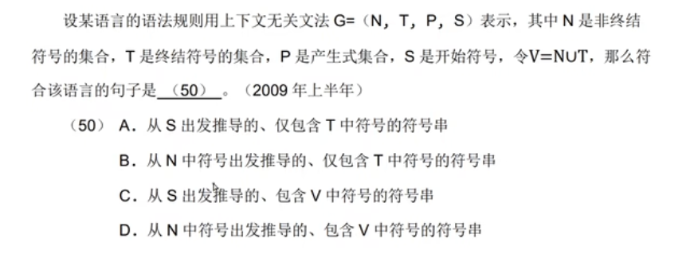


<details>
<summary>答案</summary>
A <br>
解析：S（开始符号） → P，P → N，N → T（终结符号）
</details>

@tab 例题 2

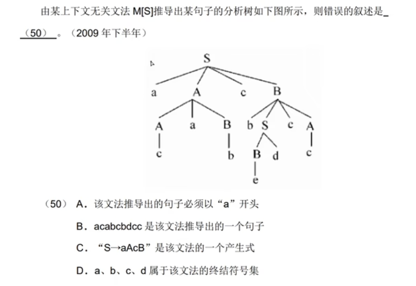


<details>
<summary>答案</summary>
A <br>
解析：S → aAcB | Bd，A → AaB | c，B → b | bScA | e（这个可能印错了，应该是 ε    ） <br>
B：aAcB → a AaB c bScA → a cab c bdcc <br>
C：产生式指推导出的句子不全是终结符号
</details>
@tab 例题 3

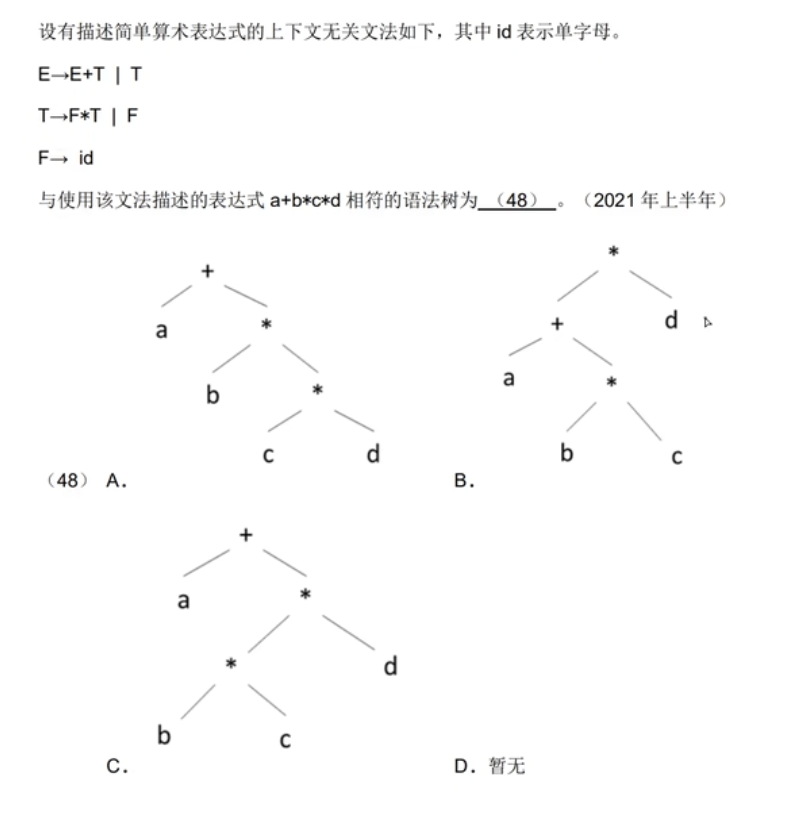


<details>
<summary>答案</summary>
A
</details>

:::


### 中缀后缀表达式*

中缀式：$a?b$ → 后缀式：$ab?$ 

<u>后缀式转中缀式可以用</u>：**栈**

中间代码有多种形式，其中树与后缀表示形式适用于解释器，而编译器多采用与机器指令格式较接近的四元式形式。

根据生成的语法树，按照不同的方式遍历即可生成形式不同的表达式：

- 中缀表达式：中序遍历（左 - 根 - 右）；
- 后缀表达式：后序便利（左 - 右 - 根）。


> 逆波兰式其实就是后缀式。


::: tabs

@tab 案例 1

中缀式 $a-b*(c+d)/e$ 转换成后缀式为： $abcd+e\div\times-$，如下图所示

```
    -
   / \
  a   ×
     / \
    b   ÷
       / \
      +   e
     / \   
    c   d   
```

@tab 案例 2

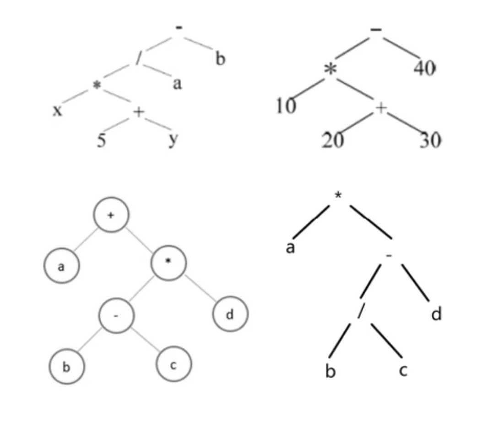

↖️：$x5y+\times a/b-$  
↗️：$10\space20\space30+\times 40-$  
↙️：$abc-d\times a+$  
↘️：$abc/d-a\times$  

@tab 例题

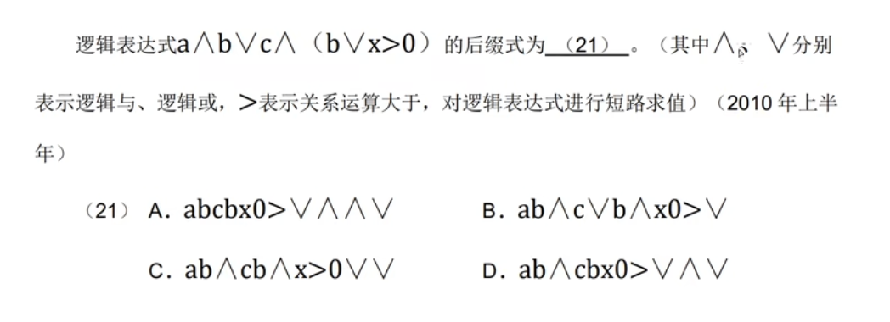

优先级：() → > → $\wedge$ → $\vee$

<details>
<summary>答案</summary>
D <br>
先将 (b || x > 0) 转换成后缀式得到 bx0>||，再根据剩余表达式符号的优先级进行转换：ab&&cbx0>||&&||
</details>

:::


## 🍀 杂题

1. 已知某高级语言源程序 A 经编译后得到机器 C 上的目标程序 B，则 <u>对 B 进行反编译，不能还原出源程序 A</u>

> 反输译通常不能把可执行文件还原成高级语言源代码，只能转換成 *功能上等价的汇编程序*

2. 脚本语言是动态语言（*动态语言都是解释型语言*），其程序结构可以在运行中改变
3. 脚本语言一般运行在解释器或虚拟机中，便于移植，开发效率较高

4. C / C++ 中指针变量可以是全局变量也可以是局部变量，无论指针变量指向何种变量，其存储空间都是一样的

5. *链表中的结点空间需要程序员根据需要* **申请和释放**，因此，数据空间应采用 **堆存储** 分配策略
   > - **栈** 是局部变量以及每次函数调用时所需保存的信息的存储区域，其 *空间的分配和释放由操作系统进行管理*。每次函数调用时，其返回地址以及调用者的环境信息（例如某些寄存器）都存放在栈中。然后，在栈中为新被调用的函数和临时变量自动分配存储空间。栈空间向低地址方向增长。
   > - **堆** 是一块动态存储区域，*由程序员在程序中进行分配和释放*，若程序语句没有释放，则程序结束时由操作系统回收。堆空间地址的增长方向是从低地址向高地址。在 C 程序中，通过调用标准库函数 malloc / calloc / realloc 等向系统动态地申请堆存储空间来存储相应规模的数据，之后用 free 函数释放所申请到的存储空间。
6. *编译过程中* 为变量分配存储单元所用的地址是 **逻辑地址**，程序 *运行时* 再映射为 **物理地址**
7. *递归下降分析法* 和 *预测分析法* 是常用的 **自顶向下** 分析法。 *移进归约分析法*、*算符优先分析法* 和 *LR 分析法* 属于 **自底向上** 的语法分析方法。

8.  Lisp 是 *函数式* 编程语言，Prolog是 *逻辑式* 程序语言，Python 支持 *过程式* 编程也支持面向对象编程，Java/C++是 *面向对象* 的编程语言。
9.  <u>语法制导翻译</u> 是一种静态语义分析方法
10. Java 的特点：采用即时编译、对象在对空间分配、自动垃圾回收处理
11. Python 的特点：跨平台、开源、支持面向对象程序设计、动态编程
12. Python 中列表（list）是一种可变的、有序的序列结构，其中元素可以重复。
    > - 元组（tuptle）、字符串（str）：不可变
    > - 集合（set）：去重复

13. 


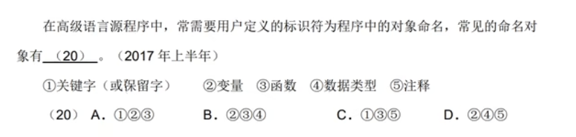
<details>
<summary>答案</summary>
B <br>
在源程序中，可由用户（程序员）为变量、函数和数据类型（比如 Java 中的枚举类型）等命名。
</details>


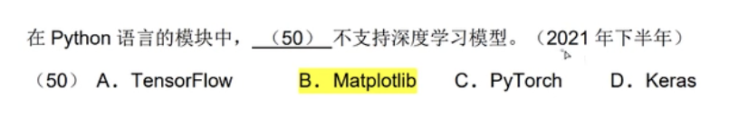

TensorFlow、PyTorch：机器学习模块

Keras：神经网络模块

Matplotlib：可视化模块


