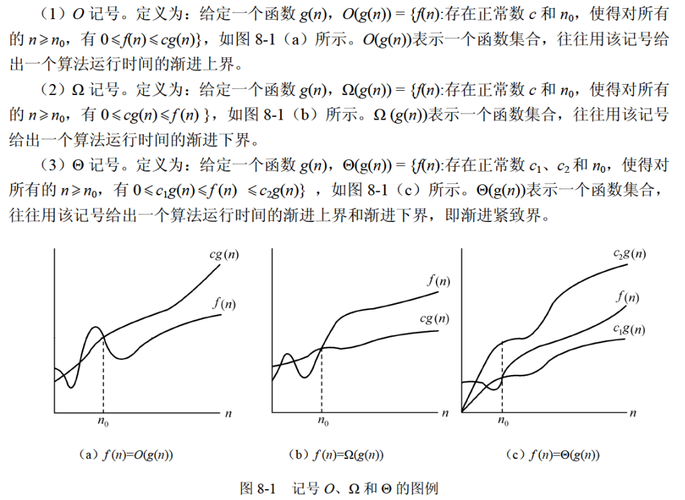
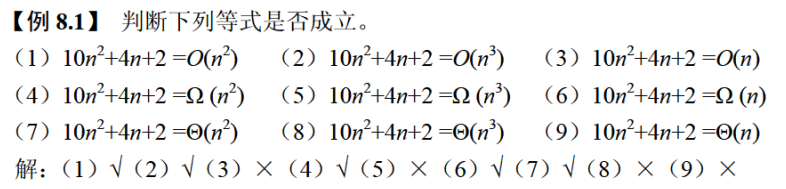
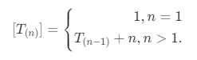
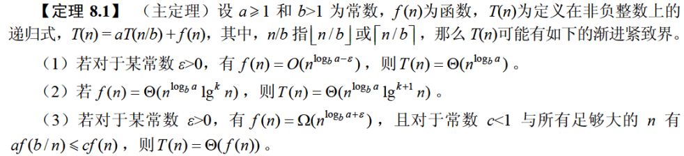
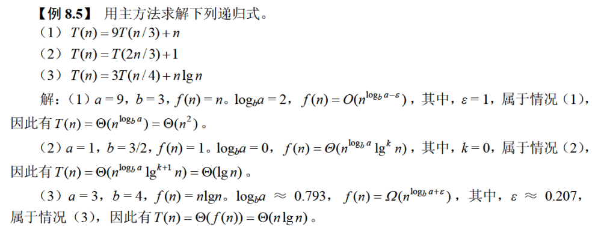
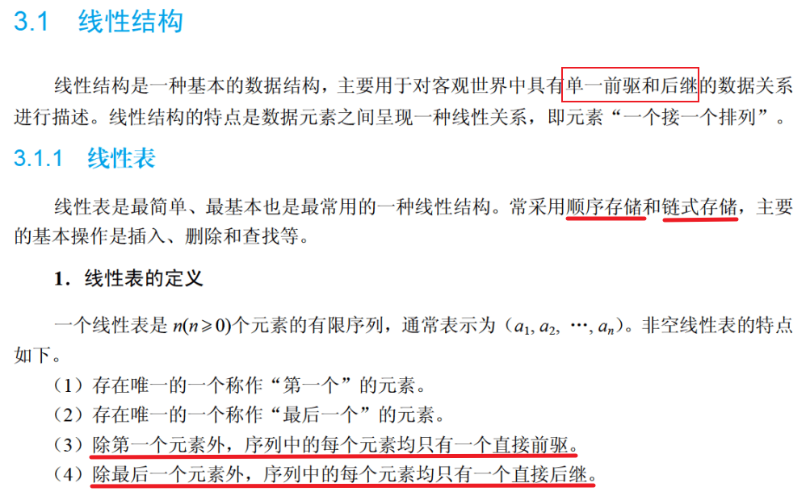
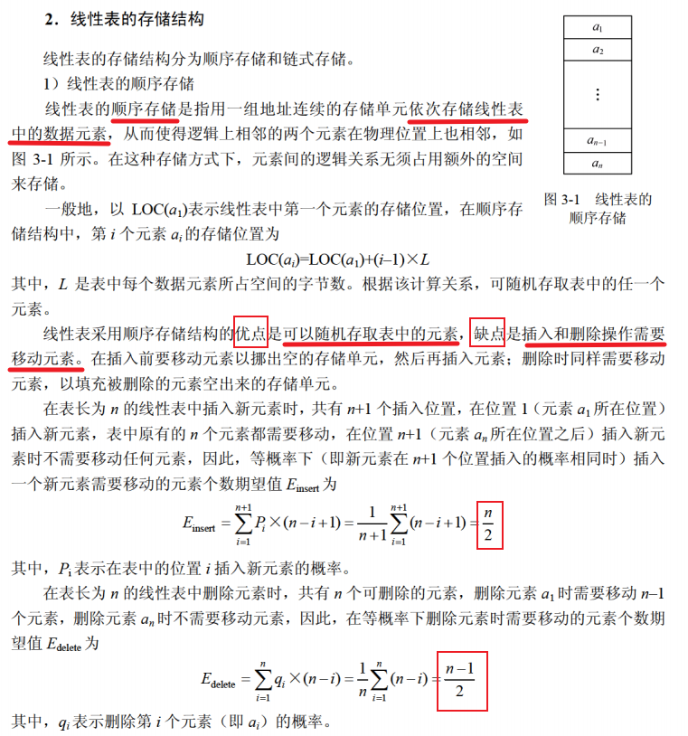
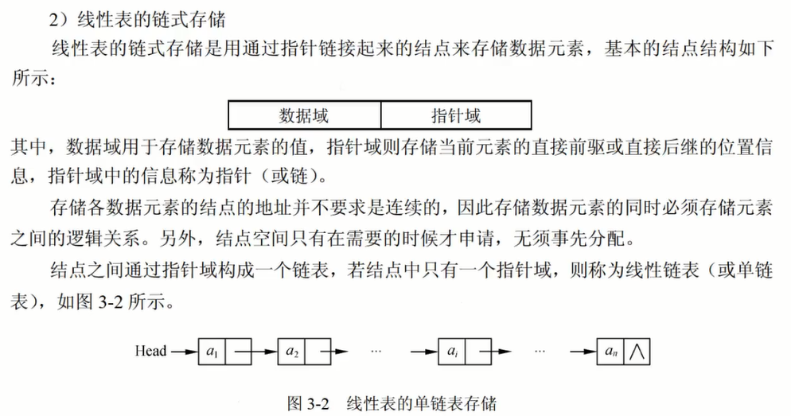

::: details 目录
[[toc]]
:::

```TODO```

## 🍀 大 O 表示法

算法时间复杂度以算法中基本操作重复执行的次数（简称频度）作为算法的时间度量。

- 一般不必要精确计算出算法的时间复杂度，**只要大致计算出相应的数量级即可**。

> [!TIP]
> $O_{(1)} < O_{(log_2{n})} < O_{(n)} < O_{(n{log_2{n}})} < O_{(n^2)} < O_{(n^3)} < O_{(2^n)} < O_{(n!)} < O_{(n^n)}$    
> $常数阶 < 对数阶 < 线性阶 < 线性对数阶 < 平方阶 < 立方阶 < 指数阶 < 阶乘阶 < n 次方阶$

$T_n$ **执行次数**（n 代表问题规模） 


规则：
- 加法规则：多项相加，保留最高阶项，并将系数化为 1
- 乘法规则：多项相乘都保留，并将系数化为 1
- 混合规则：先小括号再乘法规则最后加法规则

  
例：

$T_{(n)} = n^3 + n^2 + n{log_2{n}} + n + log_2{n} + 20$  

n = 1000 时，$n^3 = 10亿$ ， $n^2 = 100万$ ， $n{log_2{n}} ≈ 9966$ ， $n = 1000$ ， $log_2{n} ≈ 9.966$ ， $20$

$T_{1000} ≈ 10 0101 0995.66$

## 🍀 时间复杂度


① ： $O_{(1)}$ ，② ：$O_{(log_2{n})}$ ，③ ：$O_{(n)}$ ， ④ ：$O_{(n{log_2{n}})}$ ，⑤ ：$O_{(n^2)}$ ，⑥ ：$O_{(n^3)}$ 


> [!NOTE]
> 1. $O_{(1)}$：普通按顺序执行的简单代码
> 2. $O_{(log_2{n})}$：例 `while{i <= n}{ x = x * 2}`
> 3. $O_{(n)}$：for 循环
> 4. $O_{(n{log_2{n}})}$：for 循环嵌套 `while{i <= n}{ x = x * 2}`（只需要关心循环内 while 语句的执行次数）
> 5. $O_{(n^2)}$：for 循环嵌套 for 循环
> 6. $O_{(n^3)}$：3 个 for 循环嵌套
> 7. $O_{(2^n)}$
> 8. $O_{(n!)}$
> 9. $O_{(n^n)}$


## 🍀 空间复杂度

非递归情况：

1. 如果算法执行所需要的临时空间不随着某个变量 n 的大小而变化，即此算法空间复杂度为一个常量，可表示为 $O_{(1)}$
   - $T_(n) = O_{(1)}$

     ```java
       int i = 1;
       ···
       int z = 1;
       while(i <= n){
         i++;
       }
     ```
2. $O_{(n)}$ 算法执行所需要的临时空间为 n
   - $T_(n) = n = O_{(n)}$

     ```java
       int[] x = new int[n]
       for (int i = 0; i < n; i++){
         x[i] = i;
       }
     ```
3. $O_{(n^2)}$ 算法执行所需要的临时空间为 $n^2$
   - $T_(n) = n^2 = O_{(n^2)}$

     ```java
       int[][] x = new int[n][n]
       for (int i = 0; i < n; i++){
         for (int j = 0; j < n; j++){
           x[i][j] = j
         }
       }
     ```

## 🍀 渐进符号





> [!TIP]
> f(n) 为时间复杂度
> - $f(n) <= O$ 渐进上界
> - $f(n) >= Ω$ 渐进下界
> - $f(n) = Θ$ 渐进紧致界
> ps：
> - o —— 非紧的上界，$f(n) < o$
> - ω —— 非紧的下界，$f(n) > ω$


## 🍀 递归式时间、空间复杂度

- $O_{(n)} * O_{(1)}$
  - 时间复杂度 = 递归次数 * 每次递归的时间复杂度（适用于每次递归的时间复杂度不变的情况）

  ```java
  int f(int n){
    //int i = 1;  此时时间复杂度变为 O_(n)
    if (n == 1) return 1;

    return n * f(n - 1);
  }
  ```


- $O_{(log_2{n})} * O_{(1)}$
  - $\frac{n}{2^x} = 1$  →   ${log_2{n}} = x$

  ```java
  int f(int n){
    int i = 1;

    if (n == 1) return 1;

    return n * f(n / 2);
  }
  ```


- while 执行次数： $\frac{(n+1)*n}{2}$
  - 时间复杂度： $n^2$
  - 空间复杂度： $O_{(n)}$
  
  ```java
    int f(int n){
      int i = 1;
      //int[] i = new int[n]  
      
      while (i <= n){ //f(n)  f(n-1)  f(n-2)  ...  f(2)  f(1)
                      //O(n)  O(n-1)  O(n-2)  ...  O(2)  O(1)
      };              // n     n-1     n-2    ...   2     1

      return n * f(n - 1);
    }
  ```



## 🍀 递归式主方法

主方法也称为主定理，给出了求解以下形式的递归式的快速方法。

> $T_{(n)} = aT_{(n/b)} + f_{(n)}$

其中，a >= 1 和 b > 1 是常数，$f_{(n)}$ 是一个渐进的正函数。






## 🍀 线性结构与线性表定义








## 🍀 线性表的顺序存储

```java
public class SequenceList {
  final int N = 10; //容量

  int[] a;
  int n; //表长

  void init(){
    a = new int[N];

    for (int i = 0; i < N / 2; i++) {
      a[i] = i + 1;
      n = N / 2;
    }

    for (int i = 0; i < n; i++) {
      System.out.println(a[i] + "");
      System.out.println("\n");
    }
  }

  public static void main(String[] args) {
    SequenceList list = new SequenceList();

    list.init();
    list.insert(3,2022);
    list.insert(-1,192);
    list.insert(3,528);
    list.delete(3);
    list.delete(3);
    System.out.println(list.getElements(3));
    System.out.println(list.getElements(4));
  }
  //顺序表插入
  void insert(int k, int x) {
    if(k < 1 || k > n + 1) {
      return;
    }

    for (int i = n; i < k; i--) {
      a[i] = a[i - 1];
    }
    a[k - 1] = x;
    n++ ;
  }
  //顺序表删除
  void delete(int k) {
    if(k < 1 || k > n) {
      return;
    }

    for (int i = k; i < n; i++) {
      a[i - 1] = a[i];
    }
    n-- ;
  }
  //顺序表查询
  void getElements(int k) {
    if(k < 1 || k > n) {
      return -1;
    }

    return a[k - 1];
  }
}
```

## 🍀 顺序表插入、删除、查询的时间复杂度

### (1) 插入

- 顺序表末端插入，即 k = n + 1 时：$O_{(1)}$
- 顺序表首端插入，即 k = 1 时：$O_{(n)}$
- 等概率下插入一个新元素的时间复杂度（$E=\frac{n}{2}$）：$O_{(n)}$

### (2) 删除

- 删除顺序表最后一个元素，即 k = n 时：$O_{(1)}$
- 删除顺序表第一个元素，即 k = 1 时：$O_{(n)}$
- 等概率下删除一个元素的时间复杂度（$E=\frac{n - 1}{2}$）：$O_{(n)}$

### (3) 查询

- $O_{(1)}$


## 🍀 线性表的链式存储



```java
public class Node {
  int data;
  Node next;

  public Node(int data){
    this.data = data;
  }
}
```

```java
//不带 Head 节点
public class LinkList {
  Node list;

  void init() {
    Node n1 = new Node(1);
    Node n2 = new Node(2);
    Node n3 = new Node(3);

    //list = null;
    list = n1;
    n1.next = n2;
    n2.next = n3;
  }

  void printList() {

    while() {
      System.out.println(list);
      list.next;
    }
  }
}
```


```java
//不带 Head 节点


```