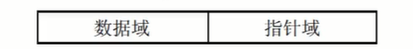
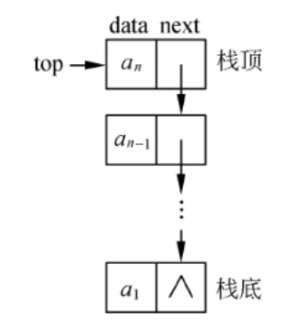
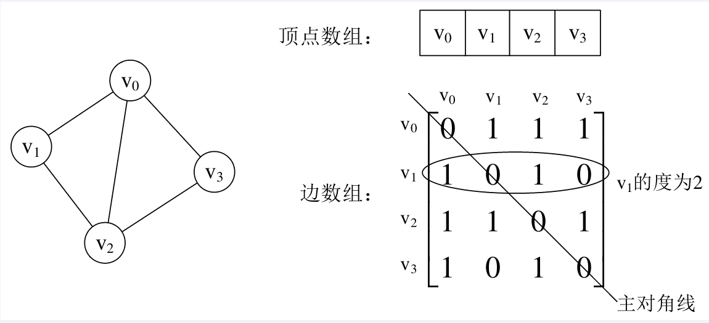
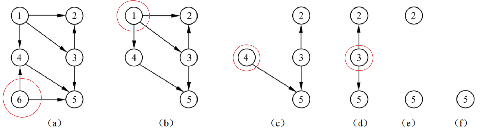

::: details 目录
[[toc]]
:::

> 57～65，9 分左右，数据结构+算法
> 复杂度、线性表、矩阵、树、图、查找、排序

## 🍀 时间、空间复杂度

### 大 O 表示法

算法时间复杂度以算法中基本操作重复执行的次数（简称频度）作为算法的时间度量。*只要大致计算出相应的数量级即可*。

::: important
$$O(1) < O(log_2{n}) < O(n) < O(n \times log_2{n}) < O(n^2) < O(n^3) < O(2^n) < O(n!) < O(n^n)$$
$$常数阶 < 对数阶 < 线性阶 < 线性对数阶 < 平方阶 < 立方阶 < 指数阶 < 阶乘阶 < n 次方阶$$
:::

- <u>加法规则</u>：多项相加，保留最高阶项，并将系数化为 1
- <u>乘法规则</u>：多项相乘都保留，并将系数化为 1
- <u>混合规则</u>：先小括号再乘法规则最后加法规则

$T_n$ **执行次数**（n 代表问题规模） 


::: tip 案例
$T_{(n)} = n^3 + n^2 + n{log_2{n}} + n + log_2{n} + 20$  

n = 1000 时，$n^3 = 10亿$ ， $n^2 = 100万$ ， $n{log_2{n}} ≈ 9966$ ， $n = 1000$ ， $log_2{n} ≈ 9.966$ ， $20$

$T_{1000} ≈ 10 0101 0995.66$
:::


### 时间复杂度


::: code-tabs

@tab ①
```java
int a = 2022； 
int b = 528； 
int t = a; 
a = b; 
b = t;
```

@tab ②
```java
int i = 1;
while(i <= n){
    i = i * 2;
}
// 设 x 为循环次数，2^（x-1） = n , x = log2n + 1
```

@tab ③
```java
int x = 1;
for(int i = 1; i <= n; i++){
    x++;
}
```

@tab ④
```java
for(int i = 1; i <= n; i++){
    int x = 1;
    while(x <= n){
        x = x * 2;
    }
}
```

@tab ⑤
```java
int x = 1;
for(int i = 1; i <= n; i++){
    for(int j = 1; j <= n; j++){
        x++;
    }
}
```

@tab ⑥
```java
int x = 1;
for(int i = 1; i <= n; i++){
    for(int j = 1; j <= n; j++){
        for(int k = 1; k <= n; k++){
            x++;
        }
    }
}
```

:::


<u>①</u>：$O(1)$ ，<u>②</u>：$O(log_2{n})$ ，<u>③</u>：$O(n)$ ，<u>④</u>：$O(n{log_2{n}})$ ，<u>⑤</u>：$O(n^2)$ ，<u>⑥</u>：$O(n^3)$ 


::: tip
1. $O(1)$：普通按顺序执行的简单代码
2. $O(log_2{n})$：例 `while{i <= n}{ x = x * 2}`
3. $O(n)$：for 循环
4. $O(n{log_2{n}})$：for 循环嵌套 `while{i <= n}{ x = x * 2}`（只需要关心循环内 while 语句的执行次数）
5. $O(n^2)$：for 循环嵌套 for 循环
6. $O(n^3)$：3 个 for 循环嵌套
7. $O(2^n)$
8. $O(n!)$
9. $O(n^n)$
:::

### 空间复杂度

非递归情况：

1. 如果算法执行所需要的临时空间不随着某个变量 n 的大小而变化，即此算法空间复杂度为一个常量，可表示为 $O(1)$
   - $T_(n) = O(1)$

     ```java
       int i = 1;
       ···
       int z = 1;
       while(i <= n){
         i++;
       }
     ```
2. $O(n)$ 算法执行所需要的临时空间为 n
   - $T_(n) = n = O(n)$

     ```java
       int[] x = new int[n]
       for (int i = 0; i < n; i++){
         x[i] = i;
       }
     ```
3. $O(n^2)$ 算法执行所需要的临时空间为 $n^2$
   - $T_(n) = n^2 = O(n^2)$

     ```java
       int[][] x = new int[n][n]
       for (int i = 0; i < n; i++){
         for (int j = 0; j < n; j++){
           x[i][j] = j
         }
       }
     ```

### 渐进符号


::: tip 做题技巧
$f(n)$ 为时间复杂度
- $f(n) \leq O$ 渐进**上**界
- $f(n) \geq Ω$ 渐进**下**界
- $f(n) = Θ$ 渐进**紧致**界  

ps：
- o —— 非紧的上界，$f(n) < o$
- ω —— 非紧的下界，$f(n) > ω$
:::

### 递归式时间、空间复杂度

> 时间复杂度 = 递归次数 × 每次递归的时间复杂度（*适用于每次递归的时间复杂度不变的情况*）

- $O(n) \times O(1)$

  ```java
  int f(int n){
    //int i = 1;  此时空间复杂度变为 O(n)
    if (n == 1) return 1;
    return n * f(n - 1);
  }
  ```

- $O(log_2{n}) \times O(1)$
  - $\frac{n}{2^x} = 1$  →  $x = {log_2{n}}$ （递归次数）

  ```java
  int f(int n){
    int i = 1;
    if (n == 1) return 1;
    return n * f(n / 2);
  }
  ```


- while 执行次数： $\frac{(n+1)\times n}{2}$
  - 时间复杂度： $O(n^2)$
  - 空间复杂度： $O(n)$
  
  ```java
    int f(int n){
      int i = 1;
      //int[] i = new int[n]  
      while (i <= n){ // 循环次数随递归变化
        //f(n)  f(n-1)  f(n-2)  ...  f(2)  f(1)
        //O(n)  O(n-1)  O(n-2)  ...  O(2)  O(1)
      };// n     n-1     n-2    ...   2     1
      return n * f(n - 1);
    }
  ```


### 🌸 递归式主方法

主方法也称为主定理，给出了求解以下形式的递归式的快速方法。

$$T(n) = aT(n/b) + f(n)$$

其中，$a \geq 1$ 和 $b > 1$ 是常数，$f(n)$ 是一个渐进的正函数。

1. 若对于某常数 $\epsilon > 0$，有 
   $$f(n) = O(n^{log_b{a}-\epsilon})$$
   则 
   $$T(n) = \Theta (n^{log_ba})$$
2. 若 
   $$f(n) = O(n^{log_ba}lg^kn)$$ 
   则   
   $$T(n) = \Theta (n^{log_ba}lg^{k+1}n)$$


## 🍀 线性表

### 线性结构与线性表定义

<u>线性结构</u>是一种基本的数据结构，主要用于对客观世界中具有**单一前驱和后继**的数据关系进行描述。

- 特点是数据元素之间呈现一种线性关系，即完素“一个接一个排列”。 


<u>线性表</u>是最简单、最基本也是最常用的一种线性结构。常采用**顺序存储**和**链式存储**，主要的基本操作是*插入*、*删除*和*查找*等。 

#### 线性表的定义  

一个线性表是 n（n ≥ 0）个元素的**有限**序列，通常表示为（$a_1$，$a_2$，⋯，$a_n$）。

非空线性表的特点如下：
   1. 存在唯一的一个称作“第一个”的元素。 
   2. 存在唯一的一个称作“最后一个”的元素。 
   3. 除第一个元素外，序列中的每个元素均只有一个直接前驱。
   4. 除最后一个元素外，序列中的每个元素均只有一个直接后继。


### 线性表的存储结构


#### 1 顺序存储


线性表的**顺序存储**是指用一组地址连续的存储单元*依次存储线性表中的数据元素*，从而使得逻辑上相邻的两个元素在物理位置上也相邻，如图所示。


在这种存储方式下，元素间的逻辑关系无须占用额外的空间来存储。 

线性表采用顺序存储结构的优点是可以**随机存取表中的元素**，缺点是~~插入和删除操作需要移动元素~~。

> - 在插入前要移动元素以挪出空的存储单元，然后再插入元素；
> - 删除时同样需要移动元素，以填充被删除的元素空出来的存储单元。

等概率下，插入一个新元素需要移动的元素个数期望值 
$$E_{insert} = \frac {n}{2}$$
删除一个新元素需要移动的元素个数期望值 
$$E_{delete} = \frac {n-1}{2}$$


```java
public class SequenceList {
    final int N = 10; //容量
    int[] a;
    int n; //表长

    void init(){
        a = new int[N];

        for (int i = 0; i < N / 2; i++) {
            a[i] = i + 1;
            n = N / 2;
        }
        for (int i = 0; i < n; i++) {
            System.out.println(a[i] + "");
            System.out.println("\n");
        }
    }

    public static void main(String[] args) {
        SequenceList list = new SequenceList();

        list.init();
        list.insert(3,2022);
        list.insert(-1,192);
        list.insert(3,528);
        list.delete(3);
        list.delete(3);
        System.out.println(list.getElements(3));
        System.out.println(list.getElements(4));
    }

    //顺序表插入
    void insert(int k, int x) {
        if(k < 1 || k > n + 1) {
            return;
        }
        for (int i = n; i >= k; i--) {
            a[i] = a[i - 1];
        }
        a[k - 1] = x;
        n++ ;
    }

    //顺序表删除
    void delete(int k) {
        if(k < 1 || k > n) {
            return;
        }
        for (int i = k; i < n; i++) {
            a[i - 1] = a[i];
        }
        n-- ;
    }

    //顺序表查询
    void getElements(int k) {
        if(k < 1 || k > n) {
            return -1;
        }
        return a[k - 1];
    }
}
```

##### 顺序表插入、删除、查询的时间复杂度

==(1) 插入==

- 顺序表末端插入，即 k = n + 1 时：$O(1)$
- 顺序表首端插入，即 k = 1 时：$O(n)$
- 等概率下插入一个新元素的时间复杂度：$O(n)$

==(2) 删除==

- 删除顺序表最后一个元素，即 k = n 时：$O(1)$
- 删除顺序表第一个元素，即 k = 1 时：$O(n)$
- 等概率下删除一个元素的时间复杂度：$O(n)$

==(3) 查询==

- $O(1)$


#### 2 链式存储

线性表的链式存储是用通过**指针**链接起来的*结点*来存储数据元素。



其中，数据域用于存储数据元素的值，**指针域**则*存储当前元素的直接前驱或直接后继的位置信息*，指针域中的信息称为指针（或链）。 

存储各数据元素的结点的地址并~~不要求是连续的~~，因此存储数据元素的同时必须存储元素之间的逻辑关系。另外，结点空间只有在需要的时候才申请，无须事先分配。 

结点之间通过指针域构成一个链表，若结点中只有一个指针域，则称为线性链表（或单链表），如下图所示。


::: code-tabs

@tab Node

```java
public class Node {
    int data;
    Node next;

    public Node(){};

    public Node(int data){
        this.data = data;
    }
}
```

@tab 不带 Head

```java {16-21,43-47}
//不带 Head 结点
public class LinkListTest {
    Node list;
    int length;

    void init() {
        length = 0;
    }

    // 插入
    boolean insert(int k, Node node) {
        if (k < 1 || k > length + 1) {
            return false;
        }

        if (k == 1) {
            node.next = list;
            list = node;
            length++;
            return true;
        }

        int i = 1;
        Node p = list;
        while (i < k - 1) {
            i++;
            p = p.next;
        }

        node.next = p.next;
        p.next = node;

        length++;
        return true;
    }

    // 删除
    boolean delete(int k) {
        if (k < 1 || k > length + 1) {
            return false;
        }

        if (k == 1) {
            list = list.next;
            length--;
            return true;
        }
        int i = 1;
        Node p = list;
        while (i < k - 1 && p != null) {
            i++;
            p = p.next;
        }
        Node s = p.next;
        p.next = s.next;

        length--;

        return true;
    }

    // 查询
    Node getNode(int k) {
        if (k < 1 || k > length) {
            return null;
        }
        int i = 1;
        Node p = list;
        while (i < k) {
            p = p.next;
            i++;
        }

        return p;
    }

    public static void main(String[] args) {
        LinkListTest LL = new LinkListTest();

        LL.init();
        LL.insert(1, new Node(123));
        LL.insert(2, new Node(456));
        LL.insert(3, new Node(789));

        LL.delete(1);

        System.out.println(LL.getNode(1).data);

        LL.printList();
    }

    void printList() {
        Node p = list;
        while (p != null) {
            System.out.print(p.data + " ");
            p = p.next;
        }
        System.out.println();
    }
}

```

@tab 插入、删除、查询

```java
public class LinkList {
    Node head;

    void init() {
        head = new Node();
        head.data = 0; // 头结点存储单链表长
        head.next = null;
    }

    // 插入
    boolean insert(int k, Node node) {
        if (k < 1 || k > head.data + 1) {
            return false;
        }

        int i = 0;
        Node p = head;

        while (i < k - 1) {
            i++;
            p = p.next;
        }

        node.next = p.next;
        p.next = node;

        head.data++;
        return true;
    }

    // 删除
    boolean delete(int k) {
        if (k < 1 || k > head.data) {
            return false;
        }
        int i = 0;
        Node p = head;
        while (i < k - 1 && p != null) {
            i++;
            p = p.next;
        }
        Node s = p.next;
        p.next = s.next;

        head.data--;

        return true;
    }

    // 查询
    Node getNode(int k) {
        if (k < 1 || k > head.data) {
            return null;
        }
        int i = 1;
        Node p = head.next;
        while (i < k) {
            p = p.next;
            i++;
        }

        return p;
    }

    public static void main(String[] args) {
        LinkList HLL = new LinkList();

        HLL.init();
        HLL.insert(1, new Node(2024));
        HLL.insert(2, new Node(528));
        HLL.insert(3, new Node(45));
        HLL.insert(2, new Node(526));

        HLL.delete(2);

        System.out.println(HLL.getNode(2).data);

//        HLL.insert(200,new Node(526));

        HLL.printList();
    }

    void printList() {
        Node p = head.next;
        while (p != null) {
            System.out.print(p.data + " ");
            p = p.next;
        }
        System.out.println();
    }

}
```

:::


##### 单链表插入、删除、查询的时间复杂度

==插入/删除/查询==

- 最好：$O(1)$
- 最坏：$O(n)$
- 平均：$O(n)$


> 循环链表插入操作的时间复杂度为$O(1)$，删除操作的时间复杂度为$O(n)$


### 栈

先进后出


栈的链式存储：



> 递归调用必须使用栈


### 队列

先进先出，顺序存储


> 采用循环队列的优点是入队和出队都不需要移动队列中的其他元素


### 串*

串是仅由字符构成的有限序列，是一种线性表。 

- <u>空串</u>：长度为零的串称为空串，空串不包含任何字符。 
- <u>空格串</u>：由一个或多个空格组成的串。虽然空格是一个空白字符，但它也是一个字符，在计算串长度时要将其计算在内。
- <u>子串</u>：由串中任意长度的**连续**字符构成的序列称为子串。含有子串的串称为主串。子串在主串中的位置是指子串首次出现时，该子串的第一个字符在主串中的位置。空串是任意串的子串。
- <u>串相等</u>：指两个串长度相等且对应序号的字符也相同。
- <u>串比较</u>：两个串比较大小时以字符的 ASCII 码值（或其他字符编码集合）作为依据。实质上，比较操作从两个串的第一个字符开始进行，字符的码值大者所在的串为大；若其中一个串先结束，则以串长较大者为大。

> ASCII 码值：`0` 48 `A` 65 `a` 97

#### 串的模式匹配

> 串 n 是否包含串 m（串 m 是否是串 n 的子串）

匹配成功的时间复杂度：
- 最好：$O(m)$
- 最坏：$O(n \times m)$ ，其匹配次数为 $(n-m+1) \times m$
- 平均：$O(n + m)$

```java
// 朴素模式匹配算法
int Index(String n, String m) {
    int k = 1;
    int i = 1, j = 1;
    while (i <= n.length() && j <= m.length()) {
        char a = n.charAt(i - 1), b = m.charAt(j - 1);
        if (a == b) {
            i++;
            j++;
        } else {
            k++;
            i = k;
            j = 1;
        }
    }
    if (j > m.length()) return k;
    else return -1;
}
```

##### 求 next[]

- <u>串的前缀</u>：包含第一个字符并且不包含最后一个字符的字串
- <u>串的后缀</u>：包含最后一个字符并且不包含第一个字符的字串

::: code-tabs

@tab 模式串

```java
通过前后缀求 next[]
模式串如下：
      i
      a b a a b a c a
next  1 2 3 4 5 6 7 8

next[1] = 0
next[2] = 1  // a (i 前面只有 a 一个字符)
```

@tab 1

```java
          i
      a b a a b a c a
next  1 2 3 4 5 6 7 8
// i 前面的字符为 ab，求其相等的前后缀长度
      a //前缀
        b //后缀
    // 不相等
next[3] = 0 + 1 = 1
```


@tab 2

```java
            i
      a b a a b a c a
next  1 2 3 4 5 6 7 8
// i 前面的字符为 aba，求其相等的前后缀长度
      a
      a b//前缀
        b a
          a//后缀
    // a = a, len = 1
next[4] = 1 + 1 = 2
```

@tab 3

```java
              i
      a b a a b a c a
next  1 2 3 4 5 6 7 8
// i 前面的字符为 abaa，求其相等的前后缀长度
      a 
      a b 
      a b a //前缀
        b a a
          a a
            a //后缀
    // a = a, len = 1
next[5] = 1 + 1 = 2
```

@tab 4

```java
                i
      a b a a b a c a
next  1 2 3 4 5 6 7 8
// i 前面的字符为 abaab，求其相等的前后缀长度
      a
      a b
      a b a
      a b a a //前缀
        b a a b
          a a b
            a b
              b //后缀
    // ab = ab, len = 2
next[6] = 2 + 1 = 3
```

@tab 5

```java
                  i
      a b a a b a c a
next  1 2 3 4 5 6 7 8
// i 前面的字符为 abaaba，求其相等的前后缀长度
      a
      a b
      a b a
      a b a a
      a b a a b //前缀
        b a a b a
          a a b a
            a b a
              b a
                a //后缀
    // aba = aba, len = 3
next[7] = 3 + 1 = 4
```

@tab 6

```java
                    i
      a b a a b a c a
next  1 2 3 4 5 6 7 8
// i 前面的字符为 abaabac，求其相等的前后缀长度
      a
      a b
      a b a
      a b a a
      a b a a b
      a b a a b a //前缀
        b a a b a c
        b a a b a c
          a a b a c
            a b a c
              b a c
                a c
                  c //后缀
    // 不相等
next[8] = 0 + 1 = 1

next[] = 01122341
```

:::

::: tip 做题技巧
- <u>第 i 个字符的 next 值</u> = 从 1 ~ i-1 串中最长相等前后缀长度 + 1 
- 特殊情况：`next[1]= 0`，`next[2]= 1`
:::


##### KMP 算法*

```java
public class KMPTest {
    int Index(char[] n, char[] m) {
        int[] next = new int[m.length];
        getNext(m, next);

        int i = 1, j = 1;
        while (i < n.length && j < m.length) {
            if (j == 0 || n[i] == m[j]) {
                i++;
                j++;
            } else j = next[j];
        }
        if (j > m.length - 1) {
            return i - m.length + 1;
        } else return -1;
    }

    int[] getNext(char[] m, int[] next) {
        next[1] = 0;
        int i = 1, j = 0;
        while (i < m.length - 1) {
            if (j == 0 || m[i] == m[j]) {
                i++;
                j++;
                next[i] = j;
            } else j = next[j];
        }
        return next;
    }

    public static void main(String[] args) {
        char[] n = " aaaab".toCharArray();
        char[] m = " aab".toCharArray();

        int res = new KMPTest().Index(n,m);
        System.out.println(res);
    }
}
```

## 🍀 数组和矩阵

一维数组：

$$a[i] = LOC + i \times L$$

- $L$：元素大小
- $LOC$：数组首地址

### 二维数组


$$a[i][j]$$

- 按 **行(M)** 优先存储：
  $$a[0][0]、a[0][1]、a[0][2]、...、a[2][2]、a[2][3]$$
  $$a[i][j] = LOC + (i \times N + j) \times L$$

- 按 **列(N)** 优先存储：
  $$a[0][0]、a[1][0]、a[2][0]、...、a[0][3]、a[1][3]、a[2][3]$$
  $$a[i][j] = LOC + (j \times M + i) \times L$$

### 矩阵

#### 对称矩阵

> 不记公式可以使用代入法做题

$$A_{i,j} = A_{j,i}$$

- 存储：主对角线元素 + 下三角区元素（即 $i \geq j$），一般**按行存储**


> 求元素位置

下标从 ==$0(A_{0,0})$== 开始：
1. 当 $i \geq j$，
   $$A_{i,j} = \frac{i \times (i+1)}{2} + j + 1$$
2. 当 $i \leq j$，
   $$A_{i,j} = \frac{j \times (j+1)}{2} + i + 1$$

下标从 ==$1(A_{1,1})$== 开始：
1. 当 $i \geq j$，
   $$A_{i,j} = \frac{i \times (i-1)}{2} + j$$
2. 当 $i \leq j$，
   $$A_{i,j} = \frac{j \times (j-1)}{2} + i$$

#### 三对角矩阵


按行存储：
1. 下标从 ==$0(A_{0,0})$== 开始：
   $$A_{i,j} = 2i + j + 1$$
2. 下标从 ==$1(A_{1,1})$== 开始：
   $$A_{i,j} = 2i + j - 2$$

#### 稀疏矩阵


**三元组顺序表** 和 **十字链表** 是对稀疏矩阵进行压缩存储的方式

## 🍀 树

> 非线性结构

### 定义

树是 n（$n \geq 0$）个结点的**有限**集合，当 n=0 时称为空树。在任一非空树中，有且仅有一个称为**根**的结点。


- 结点的层次：根为第一层，根的孩子为第二层，以此类推。
- 树的高度：一棵树的最大层数。
- 树的度：树中结点的度的最大值（一个结点的子树的个数记为该结点的度）。

### 树的性质

1. 树中的结点总数 = 树中所有结点的度数之和 + 1
2. 度为 m 的树中第 i 层上至多有 **$m^{i-1}$** 个结点（$i \geq 1$）。
3. 高度为 h 的 m 次树（度为 m 的树）至多有 **$\frac{m^h-1}{m-1}$** 个结点（~~等比数列求和~~）
4. 具有 n 个结点，度为 m 的树的最小高度为 **$\lceil log_m(n(m-1)+1) \rceil$**（~~向上取整~~）


### 二叉树

二叉树中结点的子树要区分左子树和右子树。二叉树结点最大度为 2。


二叉树的性质：
1. 第 i 层（$i \geq 1$）上至多有 **$2^{i-1}$** 个结点。
2. 高度为 h 的二叉树最多有 **$2^h -1$** 个结点
3. 对于任何一棵二叉树，**$n_0 = n_2 + 1$**（度为 0 的结点数等于度为 2 的结点数 + 1）
4. 具有 n 个结点的完全二叉树的高度为 **$\lfloor log_2n \rfloor + 1$**（~~向下取整~~） 或者 **$\lceil log_2(n+1) \rceil$**（~~向上取整~~）


- <u>满二叉树</u>：高度为 k 的二叉树有 $2^k -1$ 个结点。
- <u>完全二叉树</u>：当且仅当每个结点都与高度为 k 的满二叉树中编号从 1 到 n 的结点一一对应时
- <u>非完全二叉树</u>

> 了解：具有 n 个结点的二叉树有 ❓ 种
> $$\frac{\frac{n!}{2n!}}{n+1}$$
> - n = 3：5 种
> - n = 4：14 种
> - n = 5：42 种

#### 二叉树的存储结构

##### 1 顺序存储


假设有编号为 $i$ 的结点，则：
- 若 $i=1$，则该结点为根结点，无双亲；若 $i>1$，则该结点的双亲结点为 $\lfloor i/2 \rfloor$
- 若 $2i \leq n$，则该结点的左孩子编号为 $2i$；否则无左孩子
- 若 $2i+1 \leq n$，则该结点的右孩子编号为 $2i+1$；否则无右孩子

完全二叉树采用顺序存储结构，既*简单*又*节省空间*。

> 在最坏情况下，一个高度为 k 且只有 k 个结点的二叉树（单支树）需要 $2^k -1$ 个存储单元。

##### 2 链式存储


- 二叉链表：n 个结点有 n+1 个空指针域
- 三叉链表：n 个结点有 n+2 个空指针域


#### 二叉树的遍历

二叉树的遍历是指按照一定次序访问树中所有结点，并且每个结点仅被访问一次的过程。


==（1）先序遍历==

**根左右**

1. 访问根结点
2. 先序遍历左子树
3. 先序遍历右子树

> A BDG CEF

==（2）中序遍历== ✅

**左根右**

1. 中序遍历左子树
2. 访问根结点
3. 中序遍历右子树

> BDG A ECF

==（3）后序遍历==

**左右根**

1. 后序遍历左子树
2. 后序遍历右子树
3. 访问根结点

> GDB EFC A

==（4）层次遍历*==

**左右根**

1. 访问根结点（第 1 层）
2. 从左到右访问第 2 层的所有结点
3. 从左到右访问第 3 层的所有结点，...，第 h 层的所有结点

> A BC DEF G


::: important
先序/后序/层次遍历 + 中序遍历 -> 可以还原树的结构
:::


#### 平衡二叉树

二叉树的任意一个结点的**左右子树**高度之差的绝对值不超过 1


> 完全二叉树一定是平衡二叉树

#### 二叉排序树（二叉查找树）

- 根结点的关键字
  - *大于左* 子树所有结点的关键字；
  - **小于右** 子树所有结点的关键字；
- 左右子树也是一棵二叉排序树
- *中序遍历得到的序列是有序序列*


::: tip
给出关键字序列，构造二叉排序树：
第一个作为根结点，之后的逐个与根结点比较，小于根结点去左边，大于去右边，子树为空就插入，若存在子树，则与子树结点比较，小于去左边，大于去右边...以此类推。

构建上图所示二叉排序树的关键码序列不可能是：
- A. 23 31 17 19 11 27 13 90 61 
- B. 23 17 19 31 27 90 61 11 13 
- C. 23 17 27 19 31 13 11 90 61 ❌
- D. 23 31 90 61 27 17 19 11 13
:::

> 单支树的查找效率最差（与深度相关）


#### 最优二叉树（哈夫曼树）

带权路径长度（WPL）之和最小


- 只有度为 0、2 的结点，没有度为 1 的结点
- 具有 n 个叶子结点的哈夫曼树，总结点为 2n-1 个。


::: tip
构造哈夫曼树：
1. 从前往后找两个权值最小
2. 小左大右
3. 加入末尾
4. 权值相同从前往后
5. 用时再调
:::


::: code-tabs

@tab 1

```java
// 例
{18, 32, 4, 8, 12, 26}
// ① 权值最小： 4 8
 *12*
 /  \
4    8 // ② 小左大右
// ③ 加入末尾
{18, 32, 12, 26, *12*}
```

@tab 2

```java
// 重复 ①
 *24* // ②
 /  \
12  *12*  
    /  \
   4    8
// ③
{18, 32, 26, *24*}
```

@tab 3

```java
// 重复 ①
 *42* // ②
 /  \
18  *24*
    /  \
   12  *12*   
       /  \
      4    8
// ③
{32, 26, *42*}
```

@tab 4

```java
// 重复 ①
 *58* // ②  
 /  \
26  32
// ③
{*42*, *58*}
```

@tab 5

```java
// 重复 ①
     *100* // ②  
    /      \
  *42*     *58*
  /  \     /  \
18  *24*  26  32
    /  \
   12  *12*   
       /  \
      4    8
// ③
{*100*} ✅
```
:::


##### 哈夫曼编码


- a：0
- b：101
- c：100
- d：111
- e：1101
- f：1100

压缩比：
- 字符等长编码（若有 x 种字符，需满足 $2^n \geq x$，则等长编码为 n）


$$(300 - (18×2+32×2+4×4+8×4+12×3+26×2)) = (300 - 236)/300 = 0.21$$


## 🍀 图

图（Graph）是由顶点的有穷非空集合和顶点之间边的集合组成，通常表示为: $G(V,E)$，其中，$G$ 表示一个图，$V$ 是图 $G$ 中顶点的集合，$E$ 是图 $G$ 中边的集合。

> 在图中，任意两个结点之间都可能有直接的关系


<u>**完全图**</u>：*每个顶点与其他顶点之间都有边*。

- 含有 n 个顶点的无向完全图共有 $\frac{n(n-1)}{2}$ 条边
- 含有 n 个顶点的有向完全图共有 $n(n-1)$ 条弧

<u>顶点的度数</u>：关联于该顶点的边的数目。有向图顶点的度等于该顶点的入度和出度之和。

$$图的度数 = 2e(边数)$$

<u>回路/环</u>：第一个顶点和最后一个顶点相同的路径。

<u>**连通图**（无向图）</u>：任意两个顶点都是**连通的**（任意两个顶点之间存在**路径**）。最少有 n-1 条边，最多 n(n-1) 条。

<u>强连通图（有向图）</u>最少有 n 条弧，最多 n(n-1) 条。

### 图的存储结构

==（1）邻接矩阵表示法==


n 个顶点的图，其邻接矩阵是一个 n 阶方阵




- $A[i][j] = 1$，则表示 $v_i$ 与 $v_j$ 两个顶点之间有边
- $A[i][j] = 0$，则表示 $v_i$ 与 $v_j$ 两个顶点之间无边

> 无向图的邻接矩阵是对称的

- 对于无向图，顶点 $v_i$ 的度是邻接矩阵第 i 行（或列）中非 0 的元素个数。
- 对于有向图，第 i 行中非 0 的元素个数是顶点 $v_i$ 的出度，第 j 列的非 0 的元素个数是顶点 $v_j$ 的入度

::: tip 
E 条边的简单无向图（~~有向图~~）采用邻接矩阵存储结构，该矩阵中的非零元素个数为 2E（~~E~~） 个。
:::

> 邻接矩阵适合存储**稠密图**（边多）

==（2）邻接链表表示法==


> 邻接链表适合存储**稀疏图**（边少）

==补充：网==

边（弧）带权值的图称为网。


### 图的遍历

图的遍历是指从*某个顶点*出发，沿着某条搜索路径对图中的所有顶点进行访问且只访问一次的过程。

> 图的遍历算法是求解图的连通性问题、拓扑排序及求关键路径等算法的基础。


#### 深度优先搜索 DFS

Depth First Search

> 假设初始状态是图中所有顶点均未被访问，则从某个顶点 v 出发，首先访问该顶点，然后依次从它的各个未被访问的邻接点出发深度优先搜索遍历图，直至图中所有和 v 有路径相通的顶点都被访问到。若此时尚有其他顶点未被访问到，则另选一个未被访问的顶点作起始点，重复上述过程，直至图中所有顶点都被访问到为止。

显然，深度优先搜索是一个递归的过程。


时间复杂度：
- 邻接矩阵：$O(n^2)$
- 邻接表：$O(n+e)$


#### 广度优先搜索 BFS

Breadth First Search，把当前顶点的邻接点都访问完后，再访问下个顶点的邻接点。

> 从图中某顶点 v 出发，在访问了 v 之后依次访问 v 的各个未曾访问过的邻接点，然后分别从这些邻接点出发依次访问它们的邻接点，并使得先被访问的顶点的邻接点先于后被访问的顶点的邻接点被访问，直至图中所有已被访问的顶点的邻接点都被访问到。如果此时图中尚有顶点未被访问，则需要另选一个未曾被访问过的顶点作为新的起始点，重复上述过程，直至图中所有顶点都被访问到为止。


广度优先搜索使用**队列**实现，每个顶点最多进一次队列。

时间复杂度同 DFS。


### 拓扑排序

> 对于任何有向图而言，其拓扑排序为其所有结点的一个**线性排序** (对于同一个有向图而言可能存在多个这样的结点排序)。该排序满足这样的条件——对于图中的任意两个结点 u 和 v，若存在一条有向边从 u 指向 v，则在拓扑排序中 u 一定出现在 v 前面。

1. 选择一个入度为 0 的顶点并输出它
2. 从网中删除该顶点及与它有关的弧
3. 重复上述操作直至网中不存在入度为 0 的顶点为止



例如一个有向无环图如下:


- 结点 1 必须在结点 2、3 之前
- 结点 2 必须在结点 3、4 之前
- 结点 3 必须在结点 4、5 之前
- 结点 4 必须在结点 5 之前

则一个满足条件的拓扑排序为 [1, 2, 3, 4, 5]。

对于每一个有向无环图都至少存在一种拓扑排序；

> 不唯一的情况:

若我们删 4、5结点之前的有向边，上图变为如下所示:


则我们可得到两个不同的拓扑排序结果: [1, 2, 3, 4, 5] 和 [1, 2, 3, 5, 4]。


::: tip 补充
在有向无环图 G 的拓扑序列中，顶点 $v_i$ 在 $v_j$ 之前，则： 
- 可能存在弧 $<v_i,v_j>$，一定不存在弧 $<v_j,v_i>$。 
- 可能存在 $v_i$ 到 $v_j$ 的路径，一定不存在 $v_j$ 到 $v_i$ 的路径
:::


## 🍀 查找

- <u>静态查找表</u>：查询数据元素是否在表中/检索数据元素的各种属性
  - 顺序查找，**折半（二分）查找**，分块查找
- <u>动态查找表</u>：插入不存在的元素/删除已存在的元素
  - 二叉排序树，平衡二叉树，B_树，哈希表

### 静态查找

==（1）顺序查找==

> 对顺序存储/链式存储的查找表都适用

$$平均查找长度 ASL = \frac{n+1}{2}$$

==（2）折半查找==

> 折半查找要求线性表必须采用顺序存储结构，而且表中元素按关键字有序排列

最多比较 $\lfloor log_2n \rfloor + 1$ 次

$$平均查找长度 ASL = log_2(n+1)-1$$

::: tip 查找过程中关键字的比较序列
大大大.../小小小.../大小大小.../小大小大...
:::

### 动态查找表


==哈希表==

哈希函数的构造方法：除留取余法（~~其他方法不考~~）

$$H(key) = key \% m = 地址$$

设有 n 个数据元素，其中 m 为**接近 n 但不大于 n 的质数**（2、3、5、7、11、13、17、19、23、29、31、37、39...）

> 在构造哈希函数时，一般都要对关键字进行计算，且尽可能使关键字的所有组成部分都能起作用。~~考过~~


处理冲突的方法：

==（1）开放定址法==

$$H_i = (H(key)+d_i) \% m = 地址$$

- $i=1,2,3,...k (k \leq m-1)$， 
- 线性探测法：$d_i = 1,2,3,...,m-1$
- 二次探测法：$d_i = 1^2,-1^2,2^2,-2^2,3^2,...,\pm k^2(k \leq \frac{m}{2})$

==（2）链地址法==


哈希表的装填因子 

$$\alpha = \frac{表中装入的记录数}{哈希表的长度}$$

$\alpha$ 标志着哈希表的装满程度。$\alpha$ 越小，发生冲突的可能性越小；反之，发生冲突的可能性越大


### 堆

n 个关键码构成的序列 ${k_1,k_2,..,k_n}$，当且仅当满足下列关系时称为堆：  

- 小顶堆（二叉树，分支结点小于左右子树）

$$
\begin{cases}
k_i \leq k_{2i}\\
k_i \leq k_{2i+1}
\end{cases}
$$

- 大顶堆（二叉树，分支结点大于左右子树）

$$
\begin{cases}
k_i \geq k_{2i}\\
k_i \geq k_{2i+1}
\end{cases}
$$


> *优先队列* 使用 **堆** 数据结构实现

## 🍀 排序


假设含有 n 个记录的序列为 $\{R_1,R_2,...,R_n\}$，其相应的关键字序列为 $\{K_1,K_2,...,K_n\}$。  

将这些记录重新排序为 $\{R_{i1},R_{i2},...,R_{in}\}$，使得相应的关键字值满足条 $K_{i1}<=K_{i2}<=...<=K_{in}$，这样的一种操作称为排序。

> 通常来说，排序的目的是快速查找。

**稳定性**：若两个记录 A 和 B 的关键字值相等，但排序后 A 、 B 的先后次序保持不变，则称这种排序算法是稳定的。


### 排序算法介绍

> 归位：对于一个初始无序的关键字序列，在第一趟排序结束后，一定能将序列中的某个元素在最终有序序列中的位置确定下来。

::: tabs

@tab 直接插入排序 


> 关键字基本上有序的记录适合采用插入排序算法

把 n 个待排序的元素看成为一个有序表和一个无序表。开始时有序表中只包含 1 个元素，无序表中包含有 n-1 个元素，排序过程中每次从无序表中取出第一个元素，将它插入到有序表中的适当位置，使之成为新的有序表，重复 n-1 次可完成排序过程。

❌ 归位


@tab 希尔排序*


希尔排序实质上是一种分组插入方法。它的基本思想是: 对于 n 个待排序的数列，取一个小于 n 的整数 gap（gap 被称为步长）将待排序元素分成若干个组子序列，所有距离为 gap 的倍数的记录放在同一个组中；然后，对各组内的元素进行直接插入排序。 这一趟排序完成之后，每一个组的元素都是有序的。然后减小 gap 的值，并重复执行上述的分组和排序。重复这样的操作，当 gap=1 时，整个数列就是有序的。


@tab 简单选择排序


首先在未排序的数列中找到最小 (or 最大) 元素，然后将其存放到数列的起始位置；接着，再从剩余未排序的元素中继续寻找最小 (or 最大) 元素，然后放到已排序序列的末尾。以此类推，直到所有元素均排序完毕。

✅ 归位

> {**2**,2,1,...} → {1,2,**2**,...} → 不稳定

@tab 堆排序*


1. 初始化堆: 将数列 a[1...n] 构造成最大堆（大顶堆）。
2. 交换数据: 将 a[1] 和 a[n] 交换，使 a[n] 是 a[1...n] 中的最大值；然后将 a[1...n-1] 重新调整为最大堆。
3. 接着，将 a[1] 和 a[n-1] 交换，使 a[n-1] 是 a[1...n-1] 中的最大值；然后将 a[1...n-2] 重新调整为最大值。
4. 依次类推，直到整个数列都是有序的。

✅ 归位


@tab 冒泡排序


遍历若干次要排序的数列，每次遍历时，它都会从前往后依次的比较相邻两个数的大小；如果前者比后者大，则交换它们的位置。这样，一次遍历之后，最大的元素就在数列的末尾！ 采用相同的方法再次遍历时，第二大的元素就被排列在最大元素之前。重复此操作，直到整个数列都有序为止！

✅ 归位

@tab 🌸 快速排序


选择一个基准数（pivot），通过一趟排序将要排序的数据分割成独立的两部分；其中一部分的所有数据都比另外一部分的所有数据都要小。然后，再按此方法对这两部分数据分别进行快速排序，整个排序过程可以递归进行，以此达到整个数据变成有序序列。

> - 当输入数据基本有序时，快速排序算法具有最坏情况下的时间复杂度
> - 最坏情况下，快速排序的空间复杂度为 $O(n)$

✅ 归位


@tab 🌸 归并排序


将 2 个递增序列 $\{a_1,a_2,...,a_m\}$、$\{b_1,b_2,...,b_n\}$ 归并为一个长度为 m+n 的递增序列 ==（$m < n$ 且 m 与 n 接近）==，
- 当最终序列为 $\{a_1,a_2,...,a_m,b_1,b_2,...,b_n\}$ 时，归并过程中元素的比较次数*最少*；
- 当最终序列为 $\{a_1,b_1,a_2,b_2,...,a_m,b_n\}$ 时，归并过程中元素的比较次数**最多**；

❌ 归位

@tab 其他不考 ❌


计数排序的关键字的取值在 0～9 之间（含）


:::


