::: details 目录
[[toc]]
:::

> 计算题偏多

## 🍀 概述

计算机系统由两部分组成：
- 硬件
- 软件

通常把未配置软件的计算机称为裸机。

操作系统<u>目的</u>是：为了填补人与机器之间的鸿沟，即建立用户与计算机之间的接口，而为裸机配置的一种系统软件。

操作系统也包括了系统软件。

操作系统在计算机系统中的地位：

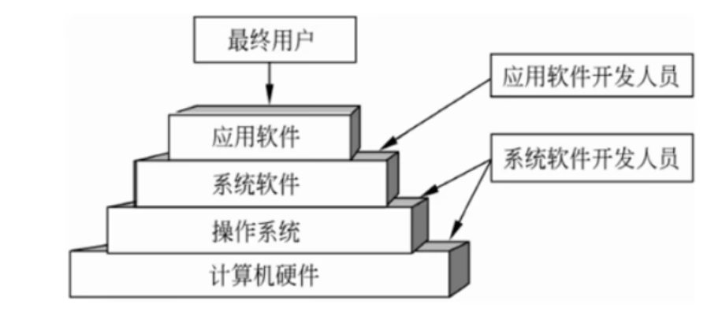

操作系统是用户与计算机之间的接口，它在计算机系统中占据重要而特殊的地位，所有其他软件，如*编辑程序*、*汇编程序*、*编译程序*、*数据库管理系统* 等**系统软件**，以及大量的应用软件都是建立在操作系统基础上的，并得到它的支持和取得它的服务。

## 🍀 程序与进程

### 顺序执行 & 前趋图

程序**顺序**执行时的<u>主要特征</u>包括：
- 顺序性、封闭性和可再现性。

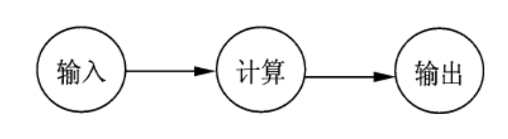

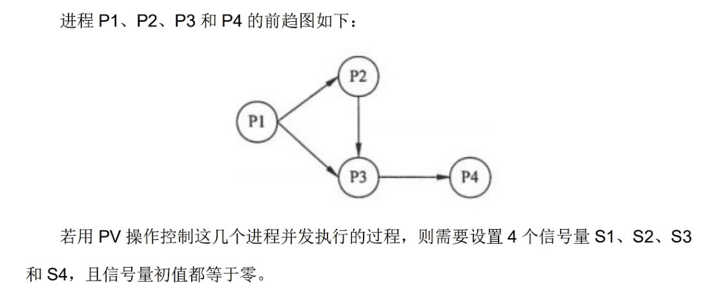

<u>PV 操作：</u> 

- $S = 0 或 1$
- $P(S): S = S - 1$
- $V(S): S = S + 1$

P1 执行完成后需执行 V(S)，P2 执行前需执行 P(S)，一个箭头需设置一个信号量 S。

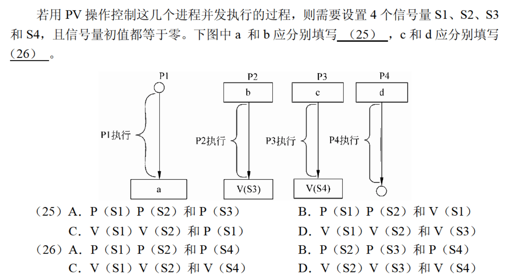

C、B

### 并发执行 & 前驱图

> 类似于流水线

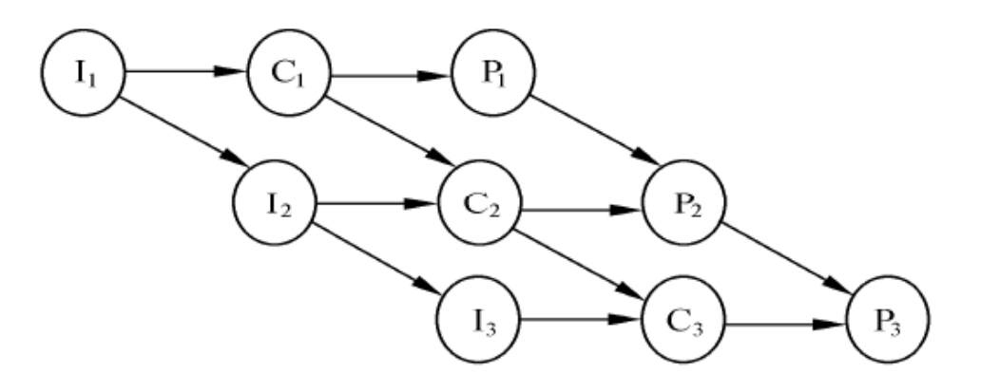

程序**并发**执行时的<u>主要特征</u>包括：
1. 失去了程序的封闭性
2. 程序和机器的执行程序的活动不再一一对应
3. 并发程序之间的相互制约性


## 🍀 三态模型

在多道程序系统中，进程在处理器上交替运行，状态也不断地发生变化，因此进程一般有 3 种基本状态：**运行**、**就绪**和**阻塞**。

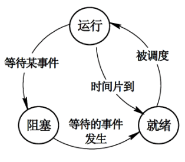

- <u>运行</u>：当一个进程在处理机上运行时。
- <u>就绪</u>：一个进程获得了除处理机外的一切所需资源，一旦得到处理机即可运行（还未得到）。
- <u>阻塞</u>（等待或睡眠）：一个进程正在等待某一事件发生而暂时停止运行，这时即使把处理机分配给进程也无法运行。


| 进程 | CPU  | 资源 |
| :--: | :--: | :--: |
| 运行 |  *√*   |  *√*  |
| 就绪 |  **X**   |  *√*  |
| 阻塞 |  **X**   |  **X**   |

## 🍀 进程间的通信

在多道程序环境的系统中存在多个可以并发执行的进程，故进程间必然存在资源共享和相互合作的问题。进程通信是指各个进程交换信息的过程。

### 同步和互斥

- <u>同步</u>：合作进程间的直接制约问题。

    进程间的同步：是指在系统中一些需要相互合作，协同工作的进程，这样的相互联系称为进程的同步。

    例如，进程 A 向缓冲区送数据，进程 B 从缓冲区取数据加工，当进程 B 要取数据加工时，必须是进程 A 完成了向缓冲区送数据的操作，否则进程 B 必须停下来等待进程 A 的操作结束。

- <u>互斥</u>：申请临界资源进程间的间接制约问题。

    进程间的互斥：是指系统中多个进程因争用临界资源而互斥执行。

    > 临界资源：在多道程序系统环境中，那些一次只能供一个进程使用的资源。如打印机、共享变量和表格等。

- <u>临界区管理的原则</u>：

    > 临界区：是进程中对临界资源实施操作的那段程序。

    对互斥临界区管理的 4 条原则如下：

    - *有空即进*：当无进程处于临界区时，允许进程进入临界区，并且只能在临界区运行有限的时间
    - *无空则等*：当有一个进程在临界区时，其他欲进入临界区的进程必须等待，以保证进程互斥地访问临界资源
    - *有限等待*：对于要求访问临界资源的进程，应保证进程能在有限的时间进入临界区，以免陷入 “**饥饿**” 状态
    - *让权等待*：当进程不能进入自己的临界区时，应立即释放处理机，以免进程陷入**忙等**状态

### 信号量机制

信号量机制是*一种有效的进程同步与互斥工具*。

信号量机制主要有：

- 整型信号量
- 记录型信号量
- 信号量集机制

整型信号量：

信号量是一个整型变量，根据控制对象的不同被赋予不同的值。信号量分为如下两类：

- 公用信号量：实现进程间的互斥，初值为 `1` 或资源的数目。
- 私用信号量：实现进程间的同步，初值为 `0` 或某个正整数。

信号量 S 的<u>物理意义</u>：

- S ≥ 0：表示某资源的可用数，此时**有可用资源**；
- S＜0：则其绝对值表示阻塞队列中等待该资源的进程数，此时无可用资源，并且有进程被阻塞。

### PV 操作

PV 操作：*实现进程同步与互斥* 的常用方法。

P 操作和 V 操作是低级通信原语，在执行期间不可分割。其中：

- <u>P 操作</u>（减）：表示**申请**一个资源；

    定义：$S = S−1$（S 表示信号量）

    - S ≥ 0：执行 P 操作的进程继续执行；
    - S＜0：无可用资源，置该进程为*阻塞*状态，并将其插入阻塞队列。

- <u>V 操作</u>（加）：表示**释放**一个资源。

    定义：$S = S+1$

    - S ≥ 0：执行 V 操作的进程继续执行；
    - S＜0：表示释放前有程序被阻塞，从阻塞状态唤醒一个进程，并将其插入就绪队列，然后执行 V 操作的进程继续。

::: tip 
- P 减 V 加，P 进 V 出
- S 的取值范围：阻塞队列中的进程数～资源数
:::

#### 利用 PV 操作实现进程的互斥：

1. 令信号量 `mutex` 的初始值为 1；
2. 进入临界区：执行 P 操作；
3. 退出临界区：执行 V 操作。

```
P(mutex)
    临界区
V(mutex)
```

#### 利用 PV 操作实现进程的同步：

实现进程的同步可用一个信号量与消息联系起来。

信号量的值：

- 为 `0`：表示希望的消息未产生；
- 非 `0`：表示希望的消息已经存在。

假定信号量 S 表示某条消息，进程可以：

- 调用 P 操作：测试消息是否到达；
- 调用 V 操作：通知消息已经准备好。

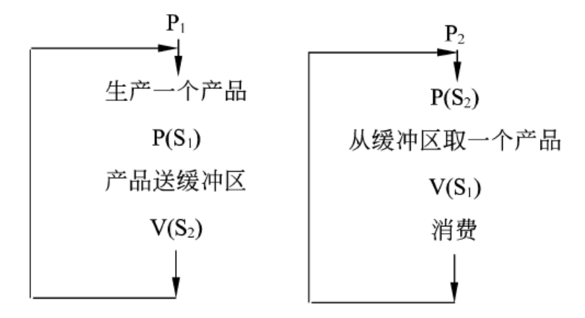

::: tip
生产者生产产品放入缓冲区，并提醒消费者你可以取了；消费者取完产品，再提醒生产者你可以继续生产了。
:::

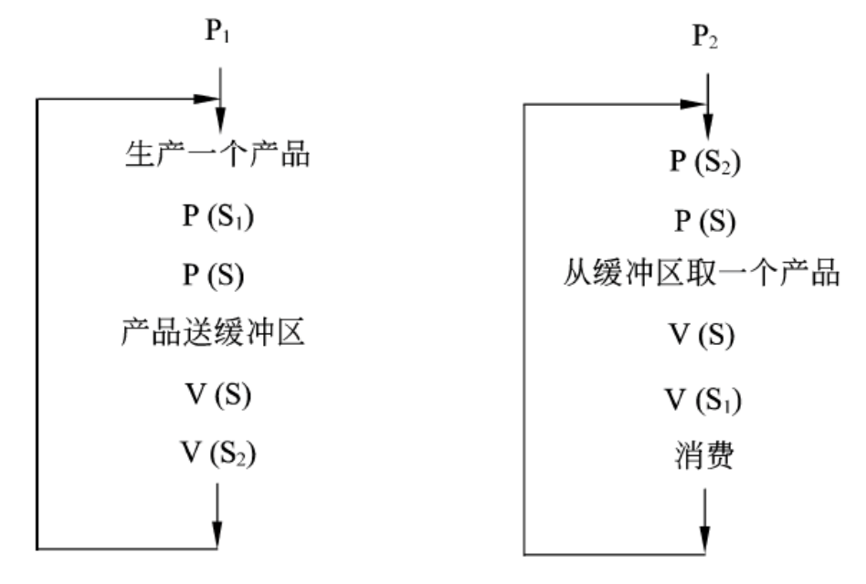

### 死锁

> 同类资源分配不当引起死锁

当有 n 个进程，m 个资源，且每个进程所需要的资源数为 k，并且系统采用的分配策略是*轮流地为每个进程分配资源*时，判断是否发生死锁的公式如下（为真则不会发生死锁）：

$$
m \geq n \times (k-1)+1
$$

#### 进程资源图

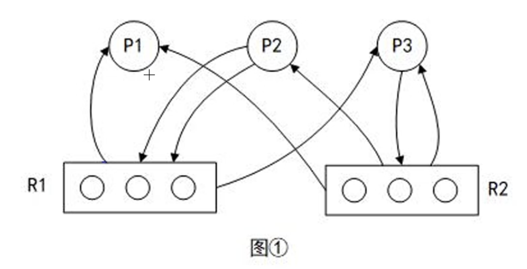

P：进程，R：资源，分配资源（R → P），申请资源（P → R）

> 先分配，再申请

::: warning 能申请到资源就是非阻塞节点，能申请到资源不意味着立即分配资源
:::

#### 死锁的处理

死锁的处理策略主要有 4 种：鸵鸟策略（即不理睬策略）、预防策略、**避免策略**和检测与解除死锁。

最著名的死锁避免算法是 Dijkstra 提出的**银行家算法**：

如果发现分配资源后系统进入**不安全状态**，则不予分配；若分配资源后系统仍处于**安全状态**，则实施分配。

> 安全状态指系统能够按某种顺序，如 `<P1,P2,...,Pn>` 来为每个进程分配所需资源，直到最大需求，使每个进程都可顺序完成。`<P1,P2,...,Pn>` 序列为安全序列。

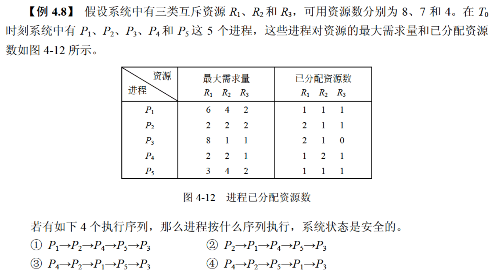

::: tip 做题技巧
列出可用的资源数 & 仍需分配的资源数，判断满足哪个进程先执行，执行后回收资源，继续判断，直至求出安全序列。
:::

## 🍀 线程

> 传统进程有两个基本属性：
>
> - 可拥有资源的**独立单位**；
> - 可独立调度和分配的**基本单位**。

引入线程的原因是，进程的系统必须付出较大的时空开销。引入线程后，将传统进程的两个基本属性分开：

- 线程：作为调度和分配的基本单位；
- 进程：作为独立分配资源的单位。

> 线程是进程中的一个实体，是被系统独立分配和调度的基本单位。

线程的特点：

- 线程基本上不拥有资源，只拥有一点运行中必不可少的资源（如程序计数器、一组寄存器和栈），它*可与同属一个进程的其他线程共享进程所拥有的全部资源*。~~注意：线程之间不能共享资源，即**线程之间不可见**~~
- 线程也具有就绪、运行和阻塞 3 种基本状态。
- 线程可创建另一个线程。
- 同一个进程中的多个线程可并发执行。


## 🍀 存储管理

### 程序局部性原理

程序在执行时将呈现出局部性规律，即在一段时间内，程序的执行仅局限于某个部分。相应地，它所访问的存储空间也局限于某个区域内。

程序的局限性表现在以下两个方面：

#### 时间局限性

- 如果程序中的某条指令一旦执行，则不久的将来该指令可能再次被执行；
- 如果某个存储单元被访问，则不久以后该存储单元可能再次被访问。

产生时间局限性的典型原因是*在程序中存在着大量的循环操作*。

#### 空间局限性

指一旦程序访问了某个存储单元，则在不久的将来，其附近的存储单元也最有可能被访问。

即程序在一段时间内所访问的地址可能集中在一定的范围内，其典型原因为*程序是顺序执行*。

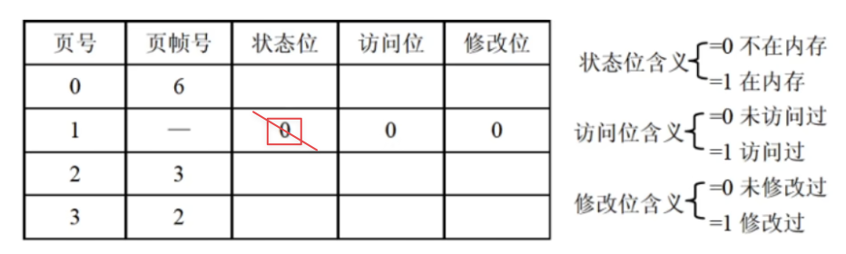

::: tip 做题技巧
- 状态位为 0，则表示不在内存，无法淘汰，排除；
  - 访问位为 0，淘汰；
  - 修改位为 0，淘汰；
  :::

### 分页存储管理

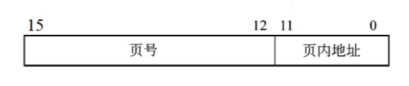

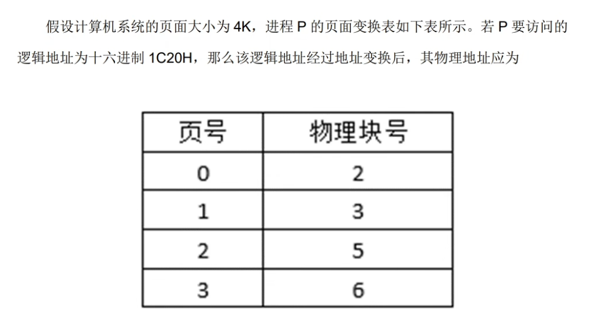

::: tip 做题技巧
- 页面大小（即页内地址的大小）为 4K，即 4096，即 $2^{12}$  
- 逻辑地址：1C20(H)，页内地址为 12 位即 $2^{12}$，即 C20(H)，则页号为 1；  
- <u>转换成物理地址</u>：只需看页号 1 对应的物理块号（页帧号），图示为 3，转换后的物理地址即为 3C20(H)
:::


### 段页式存储管理


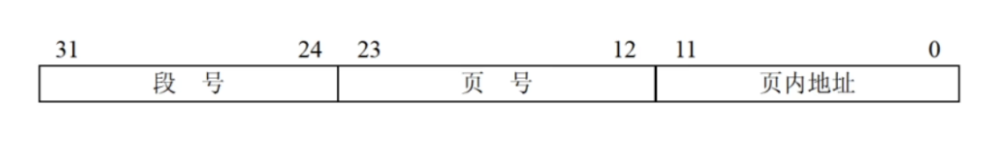


::: tip 做题技巧
- 题型：最多有 <u>？</u> 个段？每段**最大允许**有 <u>？</u> 页？页的大小为 <u>？</u> ？
- 答案：$2^8 = 256$ 个；$2^{12} = 4096$ 页；$2^{12} \div 1024 = 4K$ 
:::

## 🍀 设备管理

### 缓冲技术

> 缓冲技术可提高外设利用率，尽可能使外设处于忙状态。缓冲技术可以采用两种方式：
> - 硬件缓冲：利用专门的硬件寄存器作为缓冲；
> - 软件缓冲：通过操作系统来管理的。

### 单缓冲


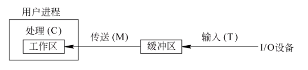

当第 1 块数据送入用户工作区后（进行数据处理），缓冲区是空闲的，可以传送第 2 块数据（输入）。即第 1 块数据的处理 C1 与第 2 块数据的输入 T2 是可以并行的，以此类推：

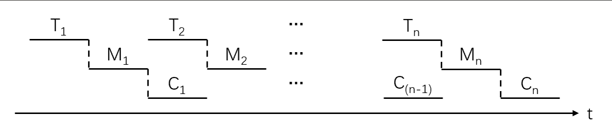

::: tip 做题技巧
计算公式为：$（T + M）* n + c$  
（前提是 c < T）
:::


### 双缓冲

> 双缓冲进一步加快 I/O 的速度，提高了设备的利用率。其工作基本过程是在设备输入时，先将数据输入到缓冲区 1，装满后便转向缓冲 2。


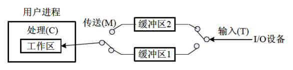

双缓冲的工作特点是，可以实现对缓冲中数据的输入 T 和提取 M，与 CPU 的计算 C，三者并行工作：

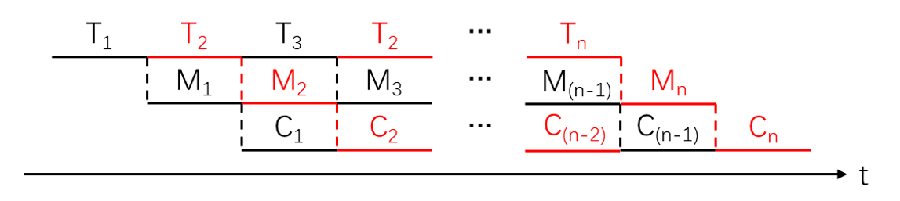


::: tip 做题技巧
计算公式为：$T * n + M + c$  
（前提是 M + c ＜T）
:::


### 磁盘调度算法

#### 先来先服务（FCFS）

根据进程请求访问**磁盘的先后次序**进行调度。

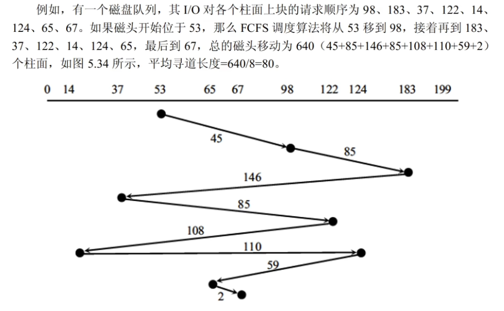


#### 最短寻道时间优先（SSTF，最短移臂算法）

该算法选择这样的进程，其要求访问的磁道与**当前磁头所在的磁道距离最近**，使得每次的寻道时间最短。

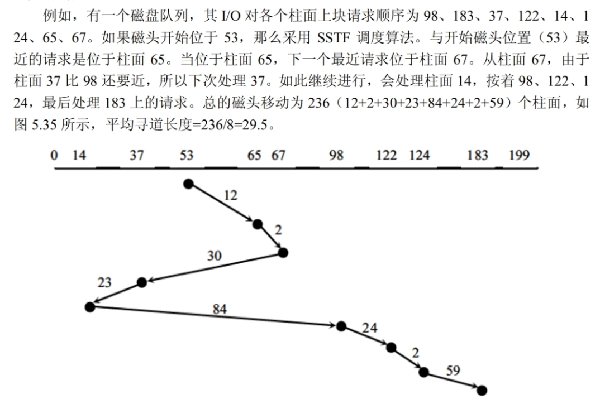


#### 扫描算法（SCAN，电梯调度算法）

总是从磁头当前位置开始，沿磁头的移动方向去**选择离当前磁头最近**的那个柱面的请求。如果沿磁头的方向无请求访问时，就改变磁头的移动方向。

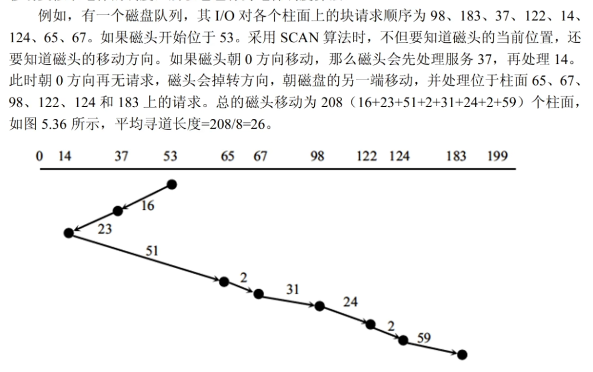

在这种调度方法下磁头的移动类似于电梯的调度，所以它也称为电梯调度算法。


#### 单向扫描算法（CSCAN，循环扫描算法）

为了减少上述 SCAN 缺点中存在的这种延迟，算法规定**磁头只做单向移动**。

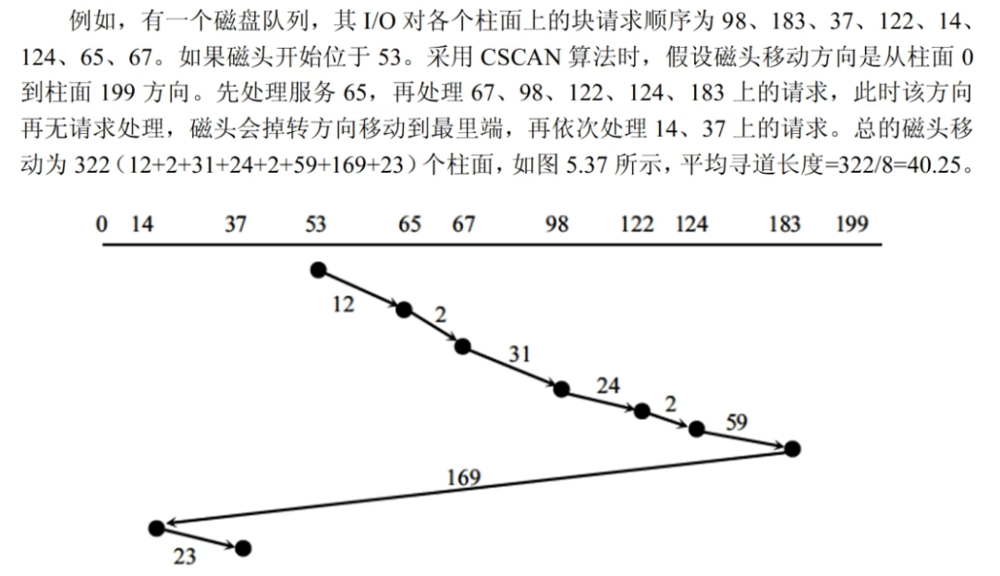


### 旋转调度算法

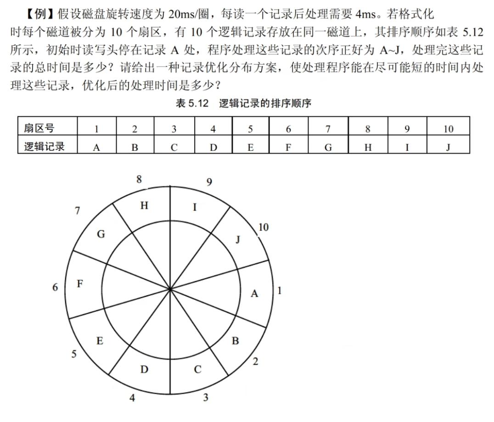

- 题目设定的处理次序为：A-J
- 磁盘旋转速度 20ms/圈，则每个记录的读取时间为 2ms
- 记录读取后，处理时间为 4ms，则处理完 A 磁头位置已经超过 B，再读取 B 需要再转到 B
- $T_{处理 A} = 2 + 4 = 6ms$
- $T_{处理 B} = 2 \times 8 + 2 + 4 = 22ms$
- ...
- $T_{总} = 6 + 22 \times 9 = 204ms$


- $T_{优化后} = 6 \times 10 = 60ms$


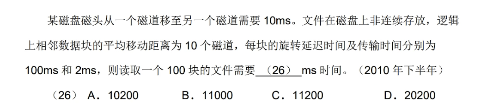

$T = （T_{磁道移动} \times 磁道数 + T_{延迟} + T_{传输}）\times 块数$


## 🍀 文件管理


### 多级索引结构

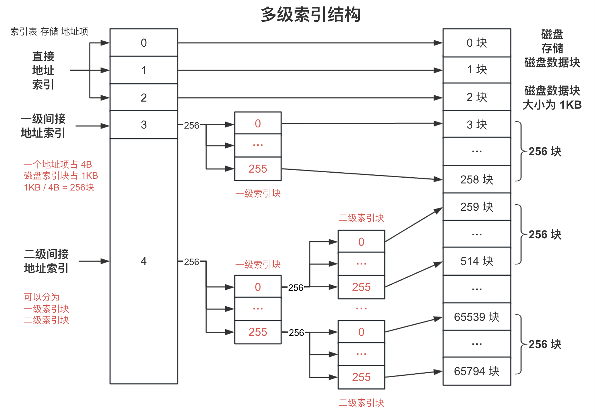

### 文件目录

- <u>文件控制块</u>（FCB）：用于文件的描述和控制的数据结构，实现了文件的 “**按名存取**”。
    - 文件控制块至少要包括*文件名*和*存放文件的物理地址*。
    - 文件控制块也称为*文件的说明*或*文件目录项*（简称*目录项*）。
- <u>文件目录</u>：文件控制块的有序集合。
    - 即文件目录是由文件控制块组成的，专门用于文件的检索。

#### 文件控制块

文件控制块中包含以下信息：

- <u>基本信息类</u>：例如文件名、文件的物理地址、文件长度和文件块数等。
- <u>存取控制信息类</u>：文件的存取权限。

> - UNIX 中，用户分成三类：文件主用户、同组用户、一般用户  
> - 以上三类用户对文件的权限为：读、写、执行

- <u>使用信息类</u>：文件建立日期、最后一次修改日期、最后一次访问的日期、当前使用的 信息（如打开文件的进程数、在文件上的等待队列）等。

#### 目录结构

> 组织好文件的目录是设计文件系统的重要环节，文件目录结构的组织方式直接影响到文件的存取速度，关系到文件的共享性和安全性。

常见的目录结构有：

- <u>一级目录结构</u>：一级目录的整个目录组织是一个线性结构，在整个系统中只需建立一张目录表，系统为每个文件分配一个目录项。
- <u>二级目录结构</u>：为了克服一级目录结构存在的缺点引入了二级目录结构。二级目录结构的组成为：
- <u>**多级目录结构**</u>：在多道程序设计系统中常采用多级目录结构。
    - 多级目录结构是*树型目录结构*。从根结点向下，每一个结点是一个目录，叶结点是文件。
    - 在各目录名之间、目录名与文件名之间需要用分隔符隔开。
    - 在采用多级目录结构的文件系统中，用户要访问一个文件，必须指出文件所在的路径名：
      - <u>路径名</u>：从某个目录开始到该文件的通路上所有各级目录名拼起来得到的。
      - <u>**绝对路径名**</u>：指从根目录开始的完整路径。
      - <u>全文件名</u>：指绝对路径名加上该文件的文件名。
      - <u>**相对路径名**</u>：从当前所在目录开始到其他目录或文件的路径。

### 位示图

位示图是一种空闲空间管理方法。通过在外存上建立一张位示图，记录文件存储器的使用情况。

*位示图用二进制的一位来表示一个物理块的使用情况：*

- `0`：表示空闲；
- `1`：表示占用。

例如：

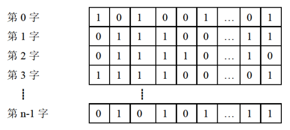

- 位示图的大小由磁盘空间的大小（物理块总数）决定。
- 位示图的描述能力强，适合各种物理结构。

> 假如计算机系统中字长为 32 位，即 1Byte = 32bit：

::: tip 做题技巧
题型 1：<u>?</u>物理块号在第<u>?</u>个字表示

- 块号从 0 开始，字号从 1 开始，公式：
    $$(n-1) \times 32 ～ n \times 32-1$$
- 块号从 0 开始，字号从 0 开始，公式：
    $$n \times 32 ～ (n+1) \times 32-1$$

题型 2：给出字长、磁盘容量、物理块大小，求位示图大小需要<u>?</u>个字

$$\frac{磁盘容量（统一单位）}{物理块大小} \div 字长$$
:::

