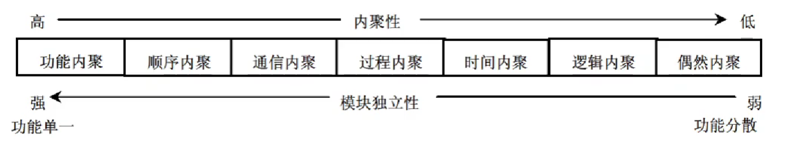

::: details 目录
[[toc]]
:::

> 数据流图

## 🍀 模块独立

### 耦合

耦合是**模块之间**的*相对独立性*（互相连接的紧密程度）的度量。

耦合取决于各个模块之间接口的*复杂程度*、*调用模块的方式*以及*通过接口的信息类型*等。

- <u>无直接耦合</u>：指两个模块之间**没有直接**的关系，属于不同模块
- <u>数据耦合</u>：指两个模块之间有调用关系，传递的是**简单的数据值**
- <u>标记耦合</u>：指两个模块之间传递的是**数据结构**
- <u>控制耦合</u>：指一个模块调用另一个模块时，传递的是**控制变量**
- <u>外部耦合</u>：模块间通过软件之外的**环境**联结
- <u>公共耦合</u>：通过一个**公共数据环境**相互作用
- <u>内容耦合</u>：当一个模块直接使用另一个模块的内部数据，或通过非正常入口转入另一个模块内部

### 内聚

内聚是对一个**模块内部***各个元素彼此结合的紧密程度*的度量。

- <u>偶然内聚</u>（巧合内聚）：各处理元素之间**没有任何联系**
- <u>逻辑内聚</u>：模块内执行若干个**逻辑上**相似的功能
- <u>时间内聚</u>：把需要**同时执行的动作**组合在一起
- <u>过程内聚</u>：一个模块完成*多个任务*，这些任务必须按指定的**过程**执行
- <u>通信内聚</u>：模块内的所有处理元素都在**同一个数据结构**上操作
- <u>顺序内聚</u>：指一个模块中的各个处理元素都密切相关于*同一功能*且必须**顺序执行**，前一功能元素的输出就是下一功能元素的输入
- <u>功能内聚</u>：最强的内聚，指模块内的所有元素**共同作用完成一个功能**，缺一不可。

::: tip 总结
耦合性和内聚性是模块独立性的两个定性标准，在将软件系统划分模块时，应尽量做到**高内聚、低耦合**，提高模块的独立性。
:::

## 🍀 系统结构设计原则

1. 分解——协调原则 ~~（考的少）~~
2. 自顶向下的原则 ~~（考的少）~~
3. 信息隐蔽、抽象的原则 ~~（考的少）~~
4. 一致性原则：统一的规范、统一的标准和统一的文件模式。
5. **明确性原则**：*功能明确*、*接口明确*、*消除多重功能和无用接口*、*避免病态连接*、*降低接口复杂度*。
6. 模块之间的耦合尽可能小，模块的内聚度尽可能高。**（高内聚、低耦合）**
7. 模块的扇入系数和扇出系数要合理。（扇入扇出适中）
8. 模块的规模适当。
9. *模块的作用范围应该在其控制范围之内*。

## 🍀 系统文档

> 只考过 1、2

1. *用户*与*系统分析人员*在系统规划和系统分析阶段通过文档进行沟通。这里的文档主要包括：

   - 可行性研究报告
   - 总体规划报告
   - 系统开发合同
   - 系统方案说明书

2. *系统开发人员*与*项目管理人员*通过文档在项目期内进行沟通。这里的文档是指<u>项目管理文件</u>，主要有：
   - 系统开发计划（工作任务分解表、PERT 图、甘特图、预算分配表等）
   - 系统开发月报
   - 系统开发总结报告

   > 有了这些文档可以：
   >- 不同阶段开发人员工作的顺利交接；
   >- 降低因为人员流动带来的风险。

3. *系统测试人员*与*系统开发人员*通过文档进行沟通。

   - 系统方案说明书
   - 系统开发合同
   - 系统设计说明书
   - 测试计划

   > 系统测试人员再将评估结果撰写成**系统测试报告**。

4. *系统开发人员*与*用户*在系统运行期间进行沟通。

   - 用户手册
   - 操作指南

5. *系统开发人员*与*系统维护人员*通过文档进行沟通。

   - 系统开发总结报告
   - 系统设计说明书

6. *用户*与*维修人员*在运行维护期间进行沟通。
   1. 用户在使用信息系统的过程中，将运行过程中的问题进行记载，形成：
      - 系统运行报告
      - 维护修改建议
   2. 系统维护人员根据以下文档对系统进行维护和升级：
      - 维护修改建议
      - 系统开发人员留下的技术手册等文档

## 🍀 数据流图

详见 [下午题 1](/VueDoc/2-软考/下午题/1.html)

::: warning
- 数据建模：E-R
- 功能建模：DFD
- 行为建模：UML
:::

## 🍀 数据字典

数据字典（DD）是为数据流图中的以下成分**做出说明**：
- 数据
- 文件
- 加工：对加工的描述称为 “小说明” 或 “加工逻辑说明
- 组成数据流或文件的**数据项**。

### 数据字典的条目

1. <u>数据流</u>条目：对 DFD 中数据流的定义，通常列出该数据流的各组成数据项。
2. <u>数据项</u>条目：*组成数据流和数据存储的最小元素*，是不可再分解的数据单位。
3. <u>数据存储</u>条目：对 DFD 中数据存储的定义。
4. <u>基本加工</u>条目：用来说明 DFD 中（下层）基本加工的处理逻辑（加工逻辑）。

> 外部实体不包括在数据字典的条目中

### 加工逻辑的描述

加工逻辑也称为 “小说明”。加工逻辑描述方法有*结构化语言*、*判定表（决策表）*和*判定树*。

> 考点内容补充：
> 1. 对数据流图的每一个基本加工，必须有一个基本加工逻辑说明
> 2. 基本加工逻辑说明必须描述基本加工如何把输入数据流变换为输出数据流的加工规则
> 3. 加工逻辑说明必须描述加工实现的策略而*不是实现加工的细节*
> 4. 加工逻辑说明中包含的信息是充足的，完备的，有用的，无冗余的。

## 🍀 杂题知识点补充

### 结构化设计主要包括：

1. 体系结构设计：定义软件的主要结构元素及其关系。
2. 数据设计：基于实体联系图确定软件涉及的文件系统的结构及数据库的表结构。
3. 接口设计：描述用户界面，软件和其他硬件设备、其他软件系统及使用人员的外部接口，以及各种构件之间的内部接口。
4. 过程设计：确定软件各个组成部分内的算法及内部数据结构，并选定某种过程的表达形式来描述各种算法。

结构化方法的分析结果的组成：
  - 一套分层的数据流图
  - 一本数据字典（词典）
  - 一组小说明（加工逻辑说明）
  - 补充材料（实体联系图）

### 结构图的基本成分包括：

**模块**、**调用**和**数据**

*黄金准则*：用户操纵控制、减轻用户的记忆负担、保持界面一致

软件系统的可维护性评价指标包括：可理解性、可测试性、可修改性、可靠性、可移植性、可使用性和效率。

构造分层 DFD 时需要注意：
   - 适当命名
   - 画数据流而不是控制流
   - 避免一个加工有过多的数据流
   - 分解尽量均匀
   - 先考虑确定状态，忽略琐碎的细节
   - 随时准备重画

