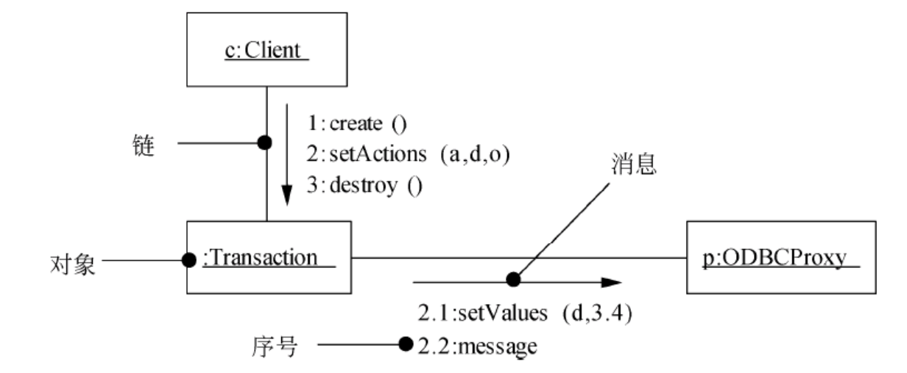

::: details 目录
[[toc]]
:::

# 🌸 面向对象基础

::: important

$成员变量 = 数据 = 属性 = 状态$

$成员函数 = 操作 = 行为 = 方法 = 函数$

:::

## 🍀 面向对象的基本概念

$面向对象 = 对象（Object）+ 分类（Classification）+ 继承（Inheritance）+ 通过消息的通信$

### 类

- <u>实体类</u> 是应用领域中的 **核心类**。实体类的对象表示现实世界中的真实的实体。
- <u>接口类（边界类）</u> 的对象为用户提供一种与系统合作交互的方式，是系统内对象和系统外参与者的 **联系媒介**.
- <u>控制类</u> 控制类的对象用来控制活动流，充当 **协调者**.

### 对象

对象通常可由对象名、属性和方法 3 个部分组成。

> 发送消息可以理解为 `对象.方法(参数)`

### 方法的重载

1. 方法名相同，参数个数不同
2. 方法名相同，参数类型不同
3. 方法名相同，参数类型的顺序不同

### 封装

一个对象把属性和行为封装为一个整体。封装是一种信息隐藏的技术。

### 继承

继承是父类和子类之间 *共享属性和方法* 的机制。

继承关系中的子类将全部拥有父类的全部属性和方法，但只能使用非私有化的属性和方法

- 子类可以继承父类属性和方法
- 子类可以有自己特殊的属性和方法
- 子类可以重写（覆盖）父类属性和方法

### 多态

同类型的对象，表现出的不同形态。（对象的多种形态）

> `Person a = new Student();`  
> 编译看左边，运行看右边

- 通用的：
  - <u>参数多态</u>：应用比较广泛的多态，被称为 *最纯的多态*。
  - <u>包含多态</u>：在许多语言中都存在，最常见的例子就是 *子类型化*，即一个类型是另一个类型的子类型。
- 特定的：
  - <u>过载多态</u>：同一个名字在不同的 *上下文中所代表的含义不同*。
  - <u>强制多态</u>：通过 *强制类型转换*（也称为强制转型）将一个对象或变量视为另一个类型的操作。

绑定在编译时进行的，叫做静态绑定，动态绑定是在运行时进行的（动态绑定支持多态）。

## 🍀 面向对象设计的原则

面向对象方法中的五大原则：

1. <u>单一责任原则</u>：就一个类而言，应该仅有一个引起它变化的原因。
2. <u>开放—封闭原则</u>：软件实体应该是可以扩展的，即开发的；但是不可修改的，即封闭的。*（扩展开放、修改关闭）*
3. <u>里氏替换原则</u>：子类型必须能够替换掉他们的基类型。*（基类出现的地方，子类一定可以出现）*
4. <u>依赖倒置原则</u>：抽象不应该依赖于细节，细节应该依赖于抽象。*（依赖于抽象，而不依赖于细节实现）* 高层模块不应该依赖于底层模块，二者都应该依赖于抽象。
5. <u>接口分离原则</u>：不应该强迫客户依赖于它们不用的方法。*（依赖于抽象，不依赖于具体）*

其他原则：

6. 重用发布等价原则：重用的粒度就是发布的粒度。
7. <u>共同封闭原则</u>：包中的所有类对于同一类性质的变化应该是共同封闭的。*一个变化若对一个包产生影响，则将对该包中的所有类产生影响，而对于其他的包不造成任何影响*。
8. <u>共同重用原则</u>：一个包中的所有类应该是共同重用的。*如果重用了包中的一个类，那么就要重用包中的所有类*。
9. 无环依赖原则：在包的依赖关系图中不允许存在环，即包之间的结构必须是一个直接的无环图形。
10. 稳定依赖原则：朝着稳定的方向进行依赖。
11. 稳定抽象原则：包的抽象程度应该和其稳定程度一致。

## 🍀 面向对象分析（OOA）

面向对象分析是为了*获对得应用问题的理解*，其主要任务是抽取和整理用户需求并建立问题域精确模型。

1. <u>认定对象</u>：定义 **问题域**
2. <u>组织对象</u>
3. <u>描述对象间的相互作用</u>
4. <u>确定对象的操作</u>
5. <u>定义对象的内部信息</u>

## 🍀 面向对象设计（OOD）

面向对象设计是采用协作的对象、对象的属性和方法 *说明软件解决方案* 的一种方式，强调的是定义软件对象和这些软件对象如何协作来满足需求，延续了面向对象分析。

1. <u>识别类及对象</u>
2. <u>定义属性</u>
3. <u>定义服务</u>
4. <u>识别关系</u>
5. <u>识别包</u>

## 🍀 面向对象程序设计

面向对象程序设计的实质：选用一种 *面向对象程序设计语言*（OOPL）：

- 采用对象、类及其相关概念所进行的程序设计；
- 关键在于加入了类和继承性，从而进一步提高了抽象程度。

特定的 OOP 概念一般是通过 OOPL 中特定的语言机制来体现的。

OOP 现在已经扩展到系统分析和软件设计的范畴，出现了面向对象分析和面向对象设计的概念。

## 🍀 面向对象测试

面向对象测试是根据规范说明来验证系统设计的正确性。

1. <u>算法层</u>：测试类中定义的每个方法，基本上相当于传统软件测试中的单元测试。
2. <u>类层</u>：测试封装在同一个类中的所有方法与属性之间的相互作用。在面向对象软件中类是基本模块，因此可以认为这是面向对象测试中所特有的模块测试。
3. <u>模板层</u>：测试一组协同工作的类之间的相互作用，大体上相当于传统软件测试中的集成测试，但是也有面向对象软件的特点（例如，对象之间通过发送消息相互作用）。
4. <u>系统层</u>：把各个子系统组装成完整的面向对象软件系统，在组装过程中同时进行测试。

# 🌸 UML

UML（Unified Modeling Language），统一建模语言

## 🍀 事物

UML 中有 4 中事物：

1. <u>结构事物</u>：结构事物是 UML 模型中的 **名词**，通常是模型的 **静态部分**，描述概念或物理元素。

    

2. <u>行为事物</u>：行为事物是 UML 模型的 **动态部分**，它们是模型中的 **动词**，描述了跨越时间和空间的行为。

    

3. <u>分组事物</u>：分组事物是 UML 模型的 **组织部分**，是一些由模型分解成 “盒子”。最主要的分组事物是 **包**（Package）。

    

4. <u>注释事物</u>：注释事物是 UML 模型的 **解释部分**。这些注释事物用来描述、说明和标注模型的任何元素。**注解**（Note）是一种主要的注释事物。

    
    

## 🍀 关系

UML 中有 4 种关系：依赖、关联、泛化和实现。

1. <u>依赖</u>：依赖是两个事物间的 **语义关系**，其中一个事物（独立事物）发生变化会影响另一个事物（依赖事物）的语义。

    

    > 如果用函数关系去理解：  
    > 依赖关系=方法，独立事物=参数，依赖事物=返回值

2. <u>关联</u>：关联是一种 **结构关系**，它描述了一组链，链是对象之间的连接。

    

    > 聚集是一种特殊类型的关联，它 *描述了整体和部分间的结构关系*，包括聚合和组合。

    - <u>聚合</u>：部分和整体的生命周期不一致，整体消失了，部分仍然存在，*部分可以脱离整体存在*。

    

    - <u>组合</u>：部分和整体的生命周期一致，整体消失了，部分也消失了，*部分不可以脱离整体存在*。

    

3. <u>泛化</u>：泛化是一种特殊/一般关系，特殊元素（子元素）的对象可替代一般元素（父元素）的对象。子元素共享了父元素的结构和行为。

    

4. <u>实现</u>（了解）：实现是类元之间的语义关系，其中一个类元指定了由另一个类元保证执行的契约。

    

## 🍀 图

### 1 类图

类图（Class Diagram）展现了 *一组对象、接口、协作和它们之间的关系*。

包括：类，接口，协作，依赖、泛化和关联关系。

符号：

- `+` : public 公有的
- `-` : private 私有的
- `#` : protected 受保护的
- `~` : package 包的

> 类图用于对系统的 **静态** 设计视图建模。通常以下述 3 种方式之一使用类图：
> 1. 对系统的词汇建模。
> 2. 对简单的协作建模。
> 3. 对逻辑数据库模式建模。

### 2 对象图

对象图展现了 *某一时刻一组对象以及它们之间的关系*，描述了在类图中所建立的事物的 **实例** 的 *静态快照*。

> 对象图给出系统的 **静态** 设计视图或静态进程视图。

### 3 用例图

- 用例图展现了 *一组用例、参与者以及它们之间的关系*。

- <u>参与者</u>：参与者是与系统交互的 *外部实体*。可能是使用者，也可能是与系统交互的外部系统、基础设备等。
- <u>用例</u>：用例是从用户角度描述系统的行为，它将系统的一个功能描述成 *一系列的事件*，这些事件最终对操作者产生有价值的观测结果。用例是一个类，它代表 *一类功能* 而不是使用该功能的某一具体实例。
- 之间的关系：
    - <u>包含</u>关系 (`<<include>>`)（用例之间）：一个用例包含另一个用例
    - <u>扩展</u>关系 (`<<extend>>`)（用例之间）：一个用例执行的时候，可能会发生一些 ~~特殊的情况或可选的情况~~，这种情况就是这个用例的扩展用例
    - <u>关联</u>关系（参与者和用例之间）
    - <u>泛化</u>关系（用例之间/参与者之间）

    > 用例图用于对系统的 **静态** 用例视图进行建模。可用以下两种方式来使用用例图：
    > - 对系统的语境建模
    > - *对系统的需求建模*

### 4 交互图（序列图、通信图）

交互图用于对系统的 **动态** 方面进行建模。一张交互图表现的是一个交互，由一组对象和它们之间的关系组成，包含它们之间可能传递的消息。

> 序列图、通信图、交互概念图、计时图均被称为交互图。

交互图一般包括 *对象、链和消息*。

1. <u>序列图</u>（顺序图、时序图）  

      

   1. 序列图是场景的图形化表示，描述了 *对象之间信息的时间顺序*。  
   2. 序列图用于展示系统中 **一个用例** 和 **多个对象** 的行为。  
   3. 序列图有两个不同于通信图的特征：
      - 序列图有 ~~对象生命线~~
      - 序列图有 ~~控制焦点~~

2. <u>通信图</u>（协作图）

    

   1. 通信图强调 *收发消息的对象的结构组织*，在早期的版本中也被称作协作图。
   2. 通信图展现了 *对象之间的消息流及其顺序*。
   3. 通信图有两个不同于序列图的特性：
      - 通信图有 ~~路径~~
      - 通信图有 ~~顺序号~~
> 序列图和通信图是同构的，它们之间可以相互转换。

3. 交互概览图 （不考）
4. 计时图 （不考）

### 5 状态图

- 状态图展现了一个 **状态机**，它由 *状态、转换、事件和活动* 组成。
- 状态图展现了 *对象的状态转换及事件顺序*。
- 状态图用于描述 *1 个对象在多个用例中的行为*
- 可以用状态图对系统的 **动态** 方面建模。当对系统、类或用例的动态方面建模时，通常是对 *反应型对象建模*。

- <u>状态</u>：初态（即初始状态）、终态（即最终状态）和中间状态。
- ~~状态变量是可选的~~
- 活动表的语法格式：`事件名(参数表)/动作表达式`
- 三种标准事件：
    - `entry`：入口动作，进入状态，立即执行
    - `exit`：出口动作，退出状态，立即执行
    - `do`：内部活动，占有限时间，并可以中断的工作
- <u>事件</u> 是在某个特定时刻发生的事情，它是对引起系统做动作或（和）从一个状态转换到另一个状态的外界事件的抽象。
- <u>转换</u> 包括 **两个** 状态（源状态，目标状态），*事件触发转换*（/迁移）；如果未标明事件，则表示在源状态的内部活动执行完之后自动触发转换。
    - 事件表达式的语法格式：`事件[监护条件]/动作表达式`，其中监护条件是一个布尔表达式，当监护条件为 true 时，转换才会发生；

#### 活动图

活动图是一种特殊的状态图，它展现了在系统内 *从一个活动到另一个活动的流程*。

- 活动图一般包括 *活动状态和动作状态、转换和对象*。
- 通常有两种使用活动图的方式：
    - 对工作流建模
    - 对操作建模

> UML 活动图是对 *一个复杂用例中的业务处理流程* 进行进一步建模的最佳工具。

​        

### 6 构件图（组件图）

- 构件图展现了 *一组构件之间的组织和依赖*。
- 构件图专注于系统的 **静态** 实现视图。
- 通常把构件映射为 *一个或多个类、接口或协作*。

### 7 部署图

- 部署图是用来对面向对象系统的 **物理** 方面建模的方法，展现了运行时处理结点以及其中构件（制品）的配置。
- 部署图展现了 *系统的软件和硬件之间的关系*，在 **实施** 阶段使用。

## 🍀 UML 图汇总

- **静态** 建模：类图、对象图、用例图
- **动态** 建模：序列图（顺序图、时序图）、通信图（协作图）、状态图、活动图
- **物理** 建模：构件图（组件图）、部署图
- 交互图：序列图（顺序图、时序图）、通信图（协作图）

