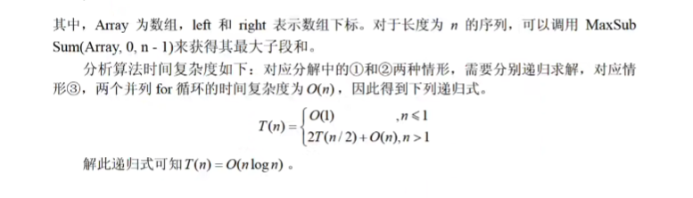

::: details 目录
[[toc]]
:::


## 🍀 时间复杂度

算法时间复杂度以算法中基本操作重复执行的次数（简称为频度）作为算法的时间度量。一般不必要精确计算出算法的时间复杂度，**只要大致计算出相应的数量级**即可，如 O (1)、O (㏒₂n)、O (n) 或 O (n²) 等。

------


递归式时间复杂度：递归的次数 x 每次递归的时间复杂度

主方法。主方法也称为主定理，给出了求解以下形式的递归式的快速方法。


## 🍀 空间复杂度

非递归：O (1) O (n) O (n²)

## 🍀 回溯法

### n 皇后问题


```c
#include<stdio.h>
#include"stdlib.h"
 
int Place(int *Column,int index){
    int i;
    for(i=1;i<index;i++){
        int Column_differ = abs(Column[index] - Column[i]);
        int Row_differ = abs(index - i);
        if(Column[i] == Column[index] || Column_differ == Row_differ)
            return 0;
    }
    return 1;
}
 
void N_Queue(int n){
    int Column_Num[n+1];
    int index = 1;
    int i;
 
    int answer_num = 0;
    for(i=1;i<=n;i++)
        Column_Num[i] = 0;
    while(index>0){
        Column_Num[index]++;
        while(Column_Num[index] <= n && !Place(Column_Num,index))
            Column_Num[index]++;
        if(Column_Num[index] <=n){
            if (index == n) {
                answer_num++;
 
                printf("方案%d：",answer_num);
 
                for(i=1;i<= n;i++){
                    printf("%d ",Column_Num[i]);
                }
                printf("\n");
            }else {
                index++;
                Column_Num[index]=0; 
            }
        }else {
            index--;
        }
    }
}
 
int main(){
    N_Queue(6);
    return 0;
}
```

## 🍀 分治法

递归有两个基本要素：

- 边界条件，即确定递归到何时终止，也称为递归出口
- 递归模式，即大问题是如何分解为小问题的，也称为递归体

分支算法在每一层递归上都有 3 个步骤：

1. 分解。将原问题分解成一系列子问题。
2. 求解。递归地求解各子问题。若子问题足够小，则直接求解。
3. 合并。将子问题的解合并成原问题的解。

### 归并排序算法

```c
#include<stdio.h>
 
#define INT_MAX 2147483647
/**
 * 归并排序
**/
void Merge(int A[],int p,int q,int r){
    int n1 = q - p + 1,n2 = r -q,i,j,k;
    int L[50],R[50];
    for(i=0;i<n1;i++)
        L[i] = A[p+i];
    for(j=0;j<n2;j++)
        R[j] = A[q+j+1];
    L[n1] = INT_MAX;
    R[n2] = INT_MAX;
    i=0;
    j=0;
    for(k=p;k<r+1;k++){
        if(L[i] < R[j]){
            A[k] = L[i];
            i++;
        }else{
            A[k]=R[j];
            j++;
        }
    }
}
 
void MergeSort(int A[],int p,int r){
    int q;
    if(p < r){
        q = (p+r) / 2;
        MergeSort(A, p, q);
        MergeSort(A, q+1, r);
        Merge(A, p, q,r);
    }
}
 
int main(){
    int A[] = {4,1,3,6,7,5,2,9};
    MergeSort(A, 0, 7);
 
    int i;
    for (i = 0; i<8; i++) {
        printf("%d ",A[i]);
    }
    printf("\n");
    return 0;
}
```


### 最大字段和问题


```c
#include<stdio.h>
#include<stdlib.h>
 
int MaxSubSum(int * Array,int left,int right){
    int sum = 0;
    int i;
    if(left == right){ /*分解到单个整数，不可继续分解*/
        if(Array[left] > 0)
            sum = Array[left];
        else
            sum = 0;
    }else{
        /*从 left 和 right 的中间分解数组*/
        int center = (left + right)/2; /*划分的位置*/
        int leftsum = MaxSubSum(Array, left, center);
        int rightsum = MaxSubSum(Array, center+1, right);
        /*计算包括 center 的最大值，判断是情形1、情形2还是情形3*/
        int s1 = 0;
        int lefts = 0;
        for(i = center;i >= left;i--){
            lefts = lefts + Array[i];
            if(lefts > s1)
                s1 = lefts;
        }
        int s2 = 0;
        int rights = 0;
        for(i = center + 1;i<= right;i++){
            rights = rights + Array[i];
            if(rights > s2)
                s2 = rights;
        }
        sum = s1 + s2;
 
        /*情形1*/
        if (sum < leftsum) {
            sum = leftsum;
        }
        /*情形2*/
        if(sum < rightsum){
            sum = rightsum;
        }
    }
         return sum;
}
 
int main(){
    int *Array = (int *)malloc(6*sizeof(int));
    Array[0] = -2;
    Array[1] = 11;
    Array[2] = -4;
    Array[3] = 13;
    Array[4] = -5;
    Array[5] = -2;
 
    int result = MaxSubSum(Array, 0, 5);
    printf("%d\n",result);
 
    return 0;
}
```





## 🍀 动态规划法

### 0-1 背包问题

```c
#include<stdio.h>
 
#define N 4 // 物品数量
#define W 5 // 背包容量
 
int max(int a,int b){
    return a > b ? a : b;
}
 
int main(){
    int v[] = {0,2,4,5,6}; // 物品价值数组
    int w[] = {0,1,2,3,4}; // 物品重量数组
 
    int f[N + 1][W + 1] = {}; // 子问题解数组
 
    int i,j;
    for(i=1;i<=N;i++){
        for(j=1;j<=W;j++){
            if(j >= w[i]){ // 选第 i 个物品的前提条件
                // 等于不选第 i 个物品 和 选第 i 个物品 两者的较大值
                f[i][j] = max(f[i-1][j],f[i-1][j-w[i]] + v[i]);
            }else{ // 不选第 i 个物品
                f[i][j] = f[i - 1][j]; // 等于从前 i-1 个物品中选，背包容量为 j 时的最大价值    
            }
        }
    }
 
    printf("%d\n",f[N][W]);
 
    return 0;
}
```

时间复杂度：O（N*W） N：物品数量 W：背包容量

### 矩阵连乘问题

- 时间复杂度：O（n³）
- 空间复杂度 O（n²）

## 🍀 贪心法

### 部分背包问题

```c
#include<stdio.h>
 
#define N 5     // 物品数量
#define W 100   // 背包容量
 
// 显示物品价值、重量、单位重量价值数组
void show(int v[],int w[],double vw[]){
    int i;
 
    printf("物品价值数组：");
    for(i = 1;i<=N;i++) printf("%d ",v[i]);
    printf("\n");
 
    printf("物品重量数组：");
    for(i = 1;i<=N;i++) printf("%d ",w[i]);
    printf("\n");
 
    printf("物品单位重量价值数组：");
    for(i = 1;i<=N;i++) printf("%0.1lf ",vw[i]);
    printf("\n");
 
}
 
double Max_Value(int v[],int w[],double vw[]){
    double result = 0.0;
 
    int i;
    int w_temp = W;
    for(i=1;i<=N;i++){
        if(w_temp >= w[i]){
            result = result + v[i];
 
            w_temp = w_temp - w[i];
        }else{
            break;
        }
    }
 
    if(w_temp > 0 && i<=N){
        result = result + w_temp * vw[i];
    }
    return result;
}
 
int main(){
 
    int v[] = {0,65,20,30,60,40};   // 物品价值数组
    int w[] = {0,30,10,20,50,40};   // 物品重量数组
 
    double vw[N + 1]; // 物品单位重量价值数组
 
    int i;
    // 初始化 物品单位重量价值数组
    for(i = 1;i<=N;i++) vw[i] = (double) v[i] / w[i];
 
    show(v, w, vw);
 
    double result =Max_Value(v, w, vw);
    printf("\nreslut %.1lf\n",result);
 
    return 0;
}
```


