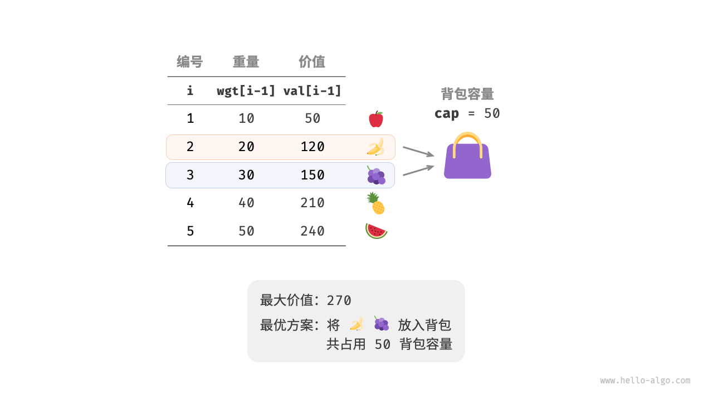

::: details 目录
[[toc]]
:::


## 🍀 回溯法

回溯算法（backtracking algorithm）是一种通过穷举来解决问题的方法，它的核心思想是从一个初始状态出发，暴力搜索所有可能的解决方案，当遇到正确的解则将其记录，直到找到解或者尝试了所有可能的选择都无法找到解为止。

回溯算法通常采用 “深度优先搜索 DFS” 来遍历解空间。

> 分支限界法常采用 “广度优先搜索” / “最小耗费优先搜索”


### 🌸 N 皇后问题

根据国际象棋的规则，皇后可以攻击与同处一行、一列或一条斜线上的棋子。给定 $n$ 个皇后和一个 $n \times n$ 大小的棋盘，寻找使得所有皇后之间无法相互攻击的摆放方案。


::: code-tabs

@tab 非递归

```c
#include <math.h>
#include <stdio.h>

#define N 4
// #define N 10

int q[N + 1]; // 存储皇后的列号

int check(int j) { // 检查第 j 个皇后的位置是否合法
    int i;
    for (i = 1; i < j; i ++ ) {
        if (q[i] == q[j] || abs(i - j) == abs(q[i] - q[j])) { // 判断是否在同一列和同一斜线上
            return 0;
        }
    }

    return 1;
}

void queen() { // 求解 N 皇后 方案
    int i;
    for (i = 1; i <= N; i ++ ) {
        q[i] = 0;
    }

    int answer = 0; // 方案数

    int j = 1; // 表示正在摆放第 j 个皇后
    while (j >= 1) {
        q[j] = q[j] + 1; // 让第 j 个皇后向后一列摆放

        while (q[j] <= N && !check(j)) { // 判断第 j 个皇后的位置是否合法
            q[j] = q[j] + 1; // 不合法就往后一个位置摆放
        }

        if (q[j] <= N) { // 表示第 j 个皇后的找到一个合法的摆放位置
            if (j == N) { // 找到了 N 皇后的一组解
                answer = answer + 1;
                printf("方案%d：", answer);

                for (i = 1; i <= N; i ++ ) {
                    printf("%d ", q[i]);
                }
                printf("\n");
            } else {
                j = j + 1; // 继续摆放下一个皇后
            }
        } else { // 表示第 j 个皇后找不到一个合法的摆放位置
            q[j] = 0; // 还原第 j 个皇后的位置
            j = j - 1; // 回溯
        }
    }
}

int main() {
    queen();

    return 0;
}
```

@tab 递归

```c
#include <math.h>
#include <stdio.h>

#define N 4
// #define N 10

int answer = 0;
int q[N + 1]; // 存储皇后的列号

int check(int j) { // 检查第 j 个皇后的位置是否合法
    int i;
    for (i = 1; i < j; i ++ ) {
        if (q[i] == q[j] || abs(i - j) == abs(q[i] - q[j])) { // 判断是否在同一列和同一斜线上
            return 0; // 0 表示 false
        }
    }
    return 1; // 1 表示 true
}

void queen(int j) {
    int i;
    for (i = 1; i <= N; i ++ ) {
        q[j] = i;

        if (check(j)) { // 当摆放的皇后位置为合法时
            if (j == N) { // 找到了 N 皇后的一组解
                answer = answer + 1;
                printf("方案%d：", answer);

                for (i = 1; i <= N; i ++ ) {
                    printf("%d ", q[i]);
                }
                printf("\n");
            } else {
                queen(j + 1); // 递归摆放下一个皇后的位置
            }
        }
    }
}

int main() {
    queen(1);

    return 0;
}
```
:::


## 🍀 分治法

> 快速排序、归并排序、汉诺塔问题

递归有两个基本要素：

- **边界条件**，即确定递归到何时终止，也称为递归出口
- **递归模式**，即大问题是如何分解为小问题的，也称为递归体

分治算法在每一层递归上都有 3 个步骤：

1. *分解*。将原问题分解成一系列子问题。
2. *求解*。递归地求解各子问题。若子问题足够小，则直接求解。
3. *合并*。将子问题的解合并成原问题的解。

### 归并排序算法

“归并排序”是分治策略的典型应用之一。


- **分**：递归地将原数组（原问题）划分为两个子数组（子问题），直到子数组只剩一个元素（最小子问题）。
- **治**：从底至顶地将有序的子数组（子问题的解）进行合并，从而得到有序的原数组（原问题的解）。


**时间复杂度为 $O(\log n)$ 的搜索算法通常是基于分治策略实现的**


### 最大字段和问题

给定长度为 n 的整数序列，$a[1…n]$, 求 $[1,n]$ 某个子区间 $[i,j]$ 使得 $a[i]+…+a[j]$ 和最大. 或者求出最大的这个和。 

> 例如 (-2,11,-4,13,-5,2) 的最大子段和为 20, 所求子区间为 $[2,4]$。


```c
#include <stdio.h>
#include <stdlib.h>

int MaxSubSum(int *Array, int left, int right) {
    int sum = 0;
    int i;

    if (left == right) { // 分解到单个整数，不可继续分解
        if (Array[left] > 0)
            sum = Array[left];
        else
            sum = 0;
    } else {
        // 从 left 和 right 中间分解数组
        int center = (left + right) / 2; // 划分的位置
        int leftSum = MaxSubSum(Array, left, center);
        int rightSum = MaxSubSum(Array, center + 1, right);

        // 计算包含 center 的最大值，判断是情形 1/2/3
        int s1 = 0;
        int lefts = 0;
        for (i = center; i >= left; i -- ) {
            lefts += Array[i];
            if (lefts > s1){
                s1 = lefts;
            }
        }

        int s2 = 0;
        int rights = 0;
        for (i = center + 1; i <= right; i ++ ) {
            rights += Array[i];
            if (rights > s2)
                s2 = rights;
        }

        sum = s1 + s2;
        // 情形 1
        if (sum < leftSum)
            sum = leftSum;
        // 情形 2
        if (sum < rightSum)
            sum = rightSum;
    }

    return sum;
}

int main() {
    int *Array = (int *) malloc(6 * sizeof(int));
    Array[0] = -2;
    Array[1] = 11;
    Array[2] = -4;
    Array[3] = 13;
    Array[4] = -5;
    Array[5] = -2;

    int result = MaxSubSum(Array, 0, 5);
    printf("%d", result);

    return 0;
}
```


## 🍀 动态规划法 ❗️❗️❗️

> 以获取问题最优解为目标

与分治法类似，将待求解问题分解成若干个子问题；与分治法不同的是，动态规划法求解的问题，经分解得到的子问题往往不是独立的。

1. 找出最优解的性质，并刻画其结构特征。
2. 递归地定义最优解的值。 
3. 以自底向上的方式计算出最优值。
4. 根据计算最优值时得到的信息，构造一个最优解。

何时应用动态规划来设计算法？
1. 最优子结构
2. 重叠子问题

### 🌸 0-1 背包问题

> 给定 $n$ 个物品，第 $i$ 个物品的重量为 $wgt[i-1]$、价值为 $val[i-1]$ ，和一个容量为 $cap$ 的背包。每个物品只能选择一次，问在限定背包容量下能放入物品的最大价值。

时间复杂度：$O(N \times W)$  N：物品数量 W：背包容量




### 矩阵连乘问题

> ==线性代数：== 一个 $p×q$ 的矩阵 A 和一个 $q×r$ 的矩阵 B 的乘积是一个新的 $p×r$ 的矩阵 C

若矩阵 A：$p×q$，矩阵 B：$q×r$，矩阵 C：$r×s$，则连乘的计算次数为：
1. $(AB)C = pqr + prs$
2. $A(BC) = qrs + pqs$

> 若 $M_1$、$M_2$、$M_3$、$M_4$ 相乘的维度序列为 2、6、3、10、3，则乘法次树为 ？  
> $M_1 = 2×6$、$M_2 = 6×3$、$M_3 = 3×10$、$M_4 = 10×3$，再按上述方法求解即可：
> $(M_1×M_2)×(M_3×M_4) = 2×6×3 + 3×10×3 + 2×3×3 = 144$

- **时间复杂度**：$O（n³）$
- **空间复杂度** $O（n²）$

## 🍀 贪心法

指在对问题进行求解时，在每一步选择中都采取最好或者最优(即最有利)的选择，从而希望能够导致结果是最好或者最优的算法。

贪婪算法所得到的结果不一定是最优的结果(有时候会是最优解)，但是都是相对近似(接近)最优解的结果

### 部分背包问题

$单位重量的价值 = 价值 / 重量$

1. 按最大价值先放背包的原则 ❌
2. 按最小重量先放背包的原则 ❌
3. 按最大单位重量价值先放背包的原则 ✅

::: code-tabs

@tab 


:::


::: code-tabs

@tab 


:::