::: details 目录
[[toc]]
:::


> **题目形式**：文字说明 + 两张数据流图 + 问题  
> **分值**：15 分 (前三题 12～13 分，必拿分；第四题知识点比较分散)


::: tip
案例/真题的【说明】中：  
- 标注 <u>下划线</u> 的文字表示 <u>加工</u>
- 标注 **加粗** 的文字表示 **实体**
- 标注 ==高亮== 的文字表示 ==数据存储==
- 标注 *斜体* 的文字表示 *数据流*
- 标注 ~~删除线~~ 的文字表示 ~~数据流图中缺失的描述~~ 
:::

## 🍀 数据流图（DFD）

数据流图（Data Flow Diagram）的基本图形元素包括数据流（Data Flow）、加工（Process）、数据存储（Data Store）和外部实体（External Agent）。


1. **外部实体 E**<u>（实体只能是唯一的）</u>：*当前系统之外的人、物、外部系统*
   - <u>人</u>：学生、老师、员工、主管、医生、客户、供应商......
   - <u>物</u>：传感器、控制器、单车、车辆、采购部门......
   - <u>外部系统</u>：支付系统、车辆交易系统、库存管理系统、道闸控制系统...... 
2. **数据存储 D**：存储数据和提供数据，存储加工的输出数据和提供加工的输入数据，例如：
   - 客户<u>表</u>、订单表、学生表
   - 巴士列表<u>文件</u>、维修记录文件、课表文件
3. **加工 P**：将输入数据<u>处理</u>后得到输出数据
   - *一个加工至少有一个输入数据流和一个输出数据流*
     - 加工只有输入没有输出称为：黑洞
     - 加工只有输出没有输入称为：白洞
     - 加工的输入数据不足以产生输出数据：灰洞 
4. <u>数据流的起点或终点必须至少有一个是加工</u>，数据流的流向可以有以下几种：
   - 加工 1 → 加工 2
   - 加工 → 数据存储 <u>（写）</u>
   - 数据存储 → 加工 <u>（读）</u>
   - 外部实体 → 加工 <u>（输入）</u>
   - 加工 → 外部实体 <u>（输出）</u>

### 案例题干

:::: tabs

@tab 🍐 例 1

> 🍐 2011 年上

==【说明】==

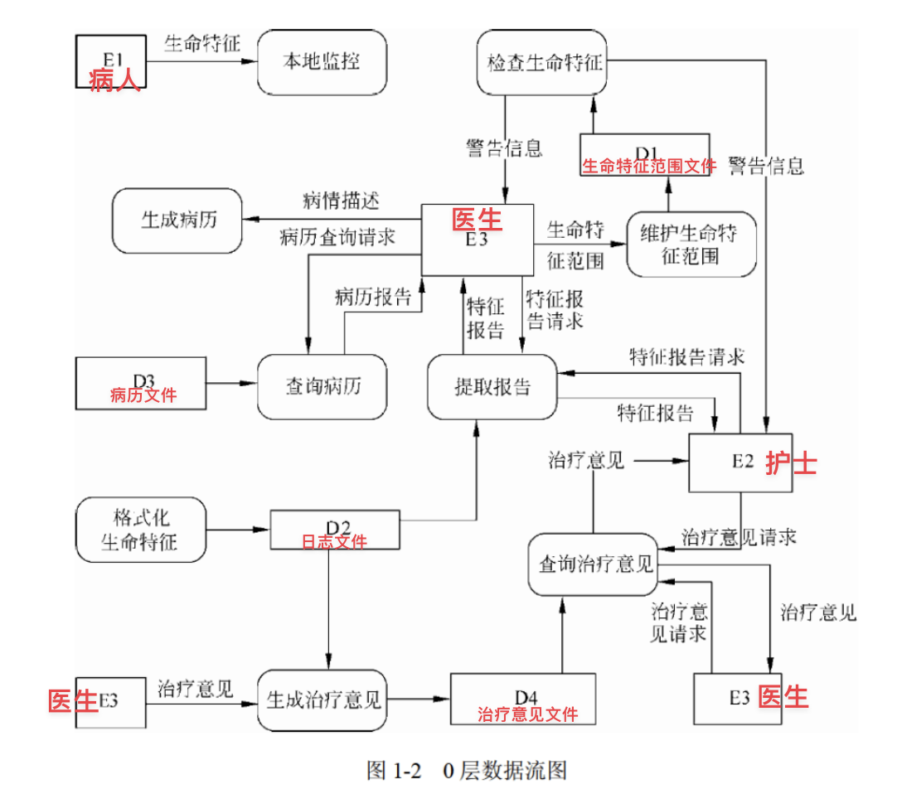

某医院欲开发病人监控系统。该系统通过各种设备监控病人的生命特征，并在生命特征
异常时向医生和护理人员报警。该系统的主要功能如下：  
（1）<u>本地监控</u> ：定期获取 **病人** 的 *生命特征*，如体温、血压、心率等数据。  
（2）<u>格式化生命特征</u>：~~对病人的各项重要生命特征数据进行格式化~~ ✅，然后存入 ==日志文件== ~~并检查生命特征~~ ❗️。  
（3）<u>检查生命特征</u>：~~将格式化后的生命特征~~ ✅ 与 ==生命特征范围文件== 中预设的正常范围进行比较。如果超出了预设范围，系统就发送一条警告信息给 **医生** 和 **护理人员**。  
（4）<u>维护生命特征范围</u>：**医生** 在必要时（如新的研究结果出现时）添加或更新生命特征值的正常范围。  
（5）<u>提取报告</u>：在 **医生** 或 **护理人员** 请求病人生命特征报告时，从 ==日志文件== 中获取病人生命特征生成特征报告，并返回给请求者。  
（6）<u>生成病历</u>：根据日志文件中的生命特征，**医生** 对病人的病情进行描述，~~形成病历存入 ==病历文件==~~ ✅。  
（7）<u>查询病历</u>：根据 **医生** 的病历查询请求，查询 ==病历文件==，给医生返回病历报告。  
（8）<u>生成治疗意见</u>：根据日志文件中的生命特征和病历，**医生** 给出 *治疗意见*，如处方等，并存入 ==治疗意见文件==。  
（9）<u>查询治疗意见</u>：**医生** 和 **护理人员** 查询治疗意见，~~据此对病人进行治疗~~。   
现采用结构化方法对病人监控系统进行分析与设计，获得如图 1-1 所示的顶层数据流图
和图 1-2 所示的 0 层数据流图。  


@tab 🍐 例 2

> 🍐 2014 年上

==【说明】==

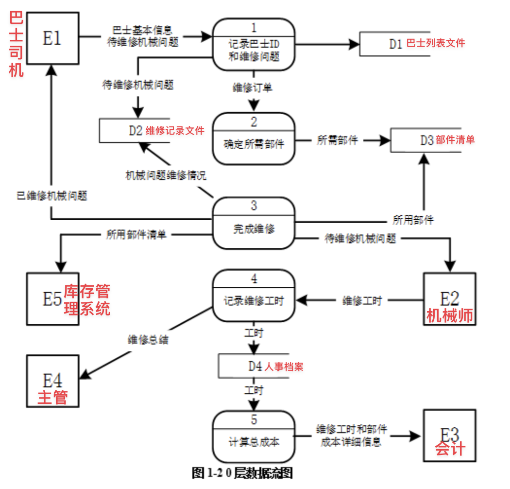

某巴士维修连锁公司欲开发巴士维修系统，以维护与维修相关的信息。该系统的主要功能如下：  
（1）<u>记录巴士 ID 和维修问题</u>。**巴士** 到车库进行维修，系统将 *巴士基本信息和 ID* 记录在 ==巴士列表文件== 中，将 *待维修机械问题* 记录在 ==维修记录文件== 中，并生成维修订单。  
（2）<u>确定所需部件</u>。根据维修订单确定维修所需部件，并在 ==部件清单== 中进行标记。  
（3）<u>完成维修</u>。**机械师** ~~根据维修记录文件中的 *待维修机械问题*~~，~~完成对巴士的维修，登记维修情况~~✅；将机械问题维修情况记录在维修记录文件中，将所用部件记录在部件清单中，并将 *所用部件清单* 发送给 **库存管理系统** 以对部件使用情况进行监控。 **巴士司机** 可查看 *已维修机械问题*。  
（4）<u>记录维修工时</u>。将 **机械师** 提供的 *维修工时* 记录在 ==人事档案== 中；将 *维修总结* 发送给 **主管** 进行绩效考核。  
（5）<u>计算维修总成本</u>。计算 ~~部件清单中实际所用部件~~、人事档案中所用维修工时的总成本；将 *维修工时和所用部件成本详细信息* 给 **会计** 进行计费。    
现采用结构化方法对巴士维修系统进行分析与设计，获得如图 1-1 所示的上下文数据流图和图 1-2 所示的 0 层数据流图。


@tab 🍐 例 3

> 🍐 2014 年下

==【说明】==

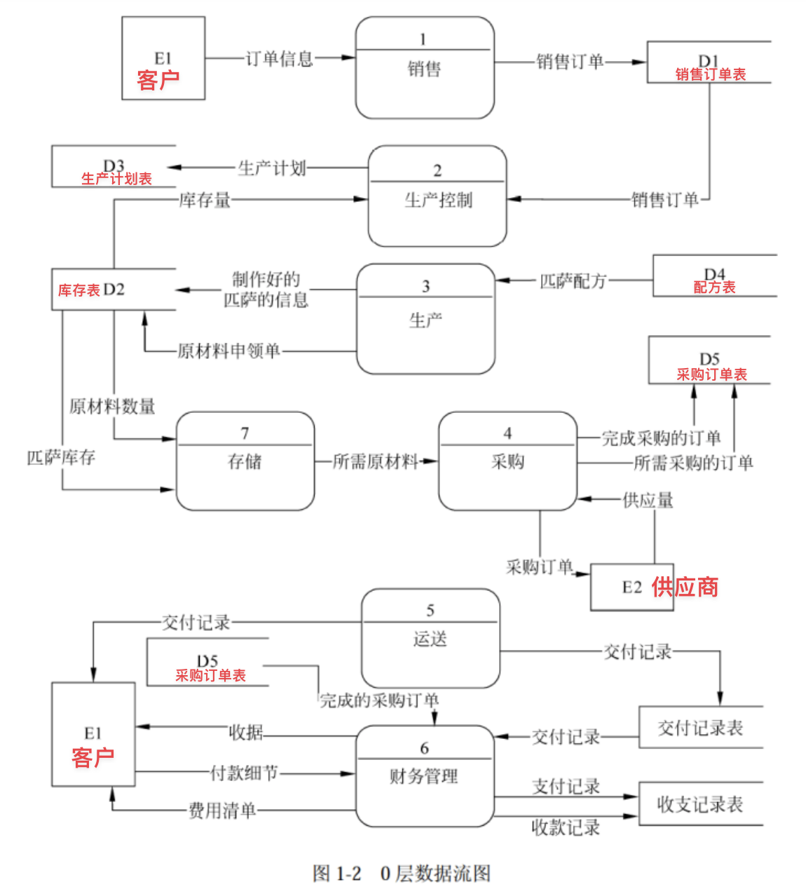

某大型匹萨加工和销售商为了有效管理生产和销售情况，欲开发一匹萨信息系统，其主要功能如下：  
（1）<u>销售</u>。处理 **客户** 的 *订单信息* ，生成 *销售订单*，并将其记录在 ==销售订单表== 中。销售订单记录了订购者、所订购的匹萨、期望的交付日期等信息。  
（2）<u>生产控制</u>。根据 *销售订单* 以及 *库存的匹萨数量*，制定匹萨生产计划（包括生产哪些匹萨、生产顺序和生产量等），并将其保存在 ==生产计划表== 中。  
（3）<u>生产</u>。根据 ~~生产计划~~ 和 ==配方表== 中的匹萨配方，向库存发出 *原材料申领单*，将制作好的匹萨的信息存入 ==库存表== 中，以便及时进行交付。  
（4）<u>采购</u>。根据所需原材料及 ~~库存量~~，确定采购数量，向 **供应商** 发送 *采购订单*，并将其记录在 ==采购订单表== 中；得到供应商的供应量，~~将原材料数量记录在 ==库存表== 中~~，在采购订单表中标记已完成采购的订单。  
（5）<u>运送</u>。~~根据销售订单~~将匹萨交付给客户，并记录在交付记录表中。  
（6）<u>财务管理</u>。在匹萨交付后，为客户开具费用清单，收款并出具收据；依据完成的采购订单给供应商支付原材料费用并 ~~出具支付细节~~；将收款和支付记录存入收支记录表中。  
（7）<u>存储</u>。检查库存的原材料、拔萨和 ~~未完成订单~~，确定所需原材料。  
现采用结构化方法对匹萨信息系统进行分析与设计，获得如图 1-1 所示的上下文数据流图和图 1-2 所示的 0 层数据流图。


::::

## 🍀 问题一（易）

> **问题类型**：找实体名称  
> **写法举例**：E1：客户  E2：财务部门  E3：支付系统  
> **技巧**：直接看图 1-2，先看和实体相关数据流较少的部分


### 案例

:::: tabs

@tab 🍐 例 1

==问：== 使用说明中的词语，给出图 1-1 中的实体 E1〜E3 的名称（3 分）

==答：== <u>E1：病人  E2：护理人员  E3：医生</u>


@tab 🍐 例 2

==问：== 使用说明中的词语，给出图 1-1 中的实体 E1〜E5 的名称（5 分）

==答：== <u>E1：巴士司机  E2：机械师  E3：会计  E4：主管  E5：库存管理系统</u>


@tab 🍐 例 3

==问：== 根据说明中的词语，给出图 1-1 中的实体 E1〜E2 的名称（4 分）

==答：== <u>E1：客户  E2：供应商</u>

::::


---


## 🍀 问题二（易）

> **题目类型**：找数据存储名称  
> **写法举例**：D1：XX 表  D2：XX 文件  D3：XX 档案  

::: tip 如果说明中没有明确指出“存入 XX 表/文件”，可以以 “数据流的名称 + 表/文件” 的格式作答
:::


### 案例

:::: tabs

@tab 🍐 例 1

==问：== 使用说明中的词语，给出图 1-2 中的数据存储 D1〜D4 的名称（4 分）

==答：== <u>D1：生命特征范围文件  D2：日志文件  D3：病历文件  D4：治疗意见文件</u>

@tab 🍐 例 2

==问：== 使用说明中的词语，给出图 1-2 中的数据存储 D1〜D4 的名称（4 分）

==答：== <u>D1：巴士列表文件  D2：维修记录文件  D3：部件清单  D4：人事档案</u>

@tab 🍐 例 3

==问：== 根据说明中的词语，给出图 1-2 中的数据存储 D1〜D5 的名称（5 分）

==答：== <u>D1：销售订单表  D2：库存表  D3：生产计划表  D4：配方表  D5：采购订单表</u>

::::

---

## 🍀 问题三（15~20 分钟）

> **题型**：根据说明和图中术语，补充图 1-2 中缺失的数据流名称及其起点和终点  

::: tip 缺失的数据流个数一般会给出，如果未给出，则理解为 X 分值的题目最多有 X 条数据流缺失
:::


### 三个解题方法

1. 父图子图平衡
   > 对比父图和子图，观察父图的数据流是否在子图上有体现
2. 加工既有输入数据流也有输出数据流
3. 数据守恒
   > 功能对应的加工是否符合说明中的描述

::: important 数据流的起点和终点必须有一个是加工!!!
:::


### 答题格式


#### 如何保持数据流图平衡？

- 父图中加工的输入数据流必须与子图中的输入输出数据流在数量上和名字上相同；
- 父图中的一个输入（输出）数据流对应子图中几个输入（输出）数据流，而子图中组成这些数据流的数据项全体正好是父图中的这一条数据流。

### 案例

:::: tabs

@tab 🍐 例 1

==问：== 图 1-2 中缺失了 4 条数据流，使用说明、图 1-1 和图 1-2 中的术语，给出数据流的名称及其起点和终点（6 分）

==答：== 

| 数据流 |  起点  |  终点  | 答题情况 |
|  :--: |  :--:  |  :--:  |  :--:  |
| 重要生命特征 | 本地监控 | 格式化生命特征 |
| 格式化后的生命特征 | 格式化生命特征 | 检查生命特征 |
| 生命特征 | D2 或 日志文件 | 生成病历  |
| 病历 | 生成病历 | D3 或 病历文件 |


@tab 🍐 例 2

==问：== 说明图 1-2 中所存在的问题（3 分）

==答：== 

- 图 1-2 中处理 3 只有输出数据流，没有输入数据流；
- 根据说明文字，D2 和 D3 ~~是黑洞~~，只有输入的数据流，没有输出的数据流；
- 父图与子图不平衡，图 1-2 中没有图 1-1 中的数据流“维修情况”。


@tab 🍐 例 3

==问：== 根据说明和图中词语，补充图 1-2 中缺失的数据流及其起点和终点（6 分）

==答：== 

| 数据流 |  起点  |  终点  | 答题情况 |
|  :--: |  :--:  |  :--:  | :--: |
| 生产计划 | D3 或 生产计划表 | 3 或 生产 |
| 库存量 | D2 或 库存表 | 4 或 采购 |
| 原材料数量 | 4 或 采购  | D2 或 库存表 |
| 销售订单 | D1 或 销售订单表 | 5 或 运送 |
| 支付细节 | 6 财务管理 | E2 供应商 |
| 未完成订单 | ==D1 或 销售订单表== | 7 或 存储 |


:::


## 🍀 问题四

:::: tabs

@tab 🍐 例 1

==问：== 说明实体 E1 和 E3之间可否有数据流，并解释其原因。（2 分）

==答：== <u>E1 和 E3 之间不可以有数据流，因为数据流的起点和终点必须有一个是加工</u>


@tab 🍐 例 2

==问：== 根据说明和图中术语，釆用补充数据流的方式，改正图 1-2 中的问题。要求给出所补充数据流的名称、起点和终点。（3 分）


==答：== 

| 数据流 |  起点  |  终点  | 答题情况 |
| :--:  |  :--:  |  :--:  |  :--:  |
| 维修情况 | E2 或 机械师 | 3 或 完成维修 |
| 待维修机械问题 | D2 或 维修记录文件 | 3 或 完成维修 |
| 实际所用部件 | D3 或 部件清单 | 5 或 计算总成本 |


::::


## 🍀 真题训练

### 题目

:::: tabs

@tab 🍐 1

> 🍐 2015 年上

==【说明】==

某大学为进一步推进无纸化考试，欲开发一考试系统。系统管理员能够创建包括专业方向、课程编号、任课教师等相关考试基础信息，教师和学生进行考试相关的工作。系统与考试有关的主要功能如下：  

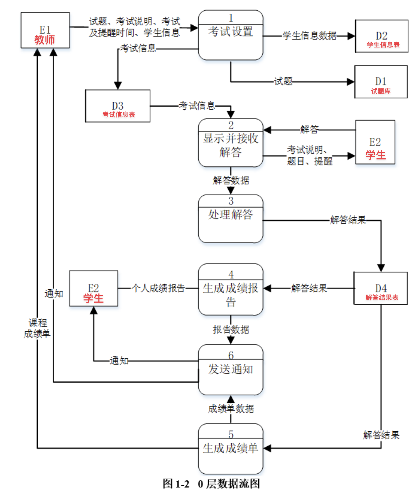

（1）<u>考试设置</u>。**教师** 制定 ==*试题*== （题目和答案），制定考试说明、考试时间和提醒时间等 ==*考试信息*==，录入参加考试的 ==*学生信息*==，并分别进行存储。  
（2）<u>显示并接收解答</u>。根据教师设定的考试信息，在考试有效时间内向 ~~**学生**~~ 显示考试说明和 ~~题目~~，根据设定的考试提醒时间进行提醒，并接收学生的解答。  
（3）<u>处理解答</u>。~~根据答案~~ 对接收到的解答数据进行处理，然后将 ==*解答结果*== 进行存储。  
（4）<u>生成成绩报告</u>。根据解答结果生成学生个人成绩报告，供学生查看。  
（5）<u>生成成绩单</u>。对解答结果进行核算后生成课程成绩单供教师查看。  
（6）<u>发送通知</u>。根据成绩报告数据，创建通知数据并将通知发送给学生；根据成绩单数据，创建通知数据并将通知发送给教师。  
现采用结构化方法对考试系统进行分析与设计，获得如图 1-1 所示的上下文数据流图和图 1-2 所示的 0 层数据流图。  


==问题一：== 使用说明中的词语，绘出图 1-1 中的实体 E1〜E2 的名称。（2 分）

==问题二：== 使用说明中的词语，给出图 1-2 中的数据存储 D1〜D4 的名称。（4 分）

==问题三：== 根据说明和图中词语，补充图 1-2 中缺失的数据流及其起点和终点。（4 分）

==问题四：== 在图 1-2 所示的数据流图中，功能（6）发送通知包含创建通知并发送给学生或老师。请分解图 1-2 中加工（6），将分解出的加工和数据流填入答题纸的对应栏内。（注：数据流
的起点和终点须使用加工的名称描述）（5 分）


@tab 🍐 2

> 🍐 2015 年下

==【说明】==


某慕课教育平台欲添加在线作业批改系统，以实现高效的作业提交与批改，并进行统计。学生和讲师的基本信息已经初始化为数据库中的学生表和讲师表。系统的主要功能如下：  

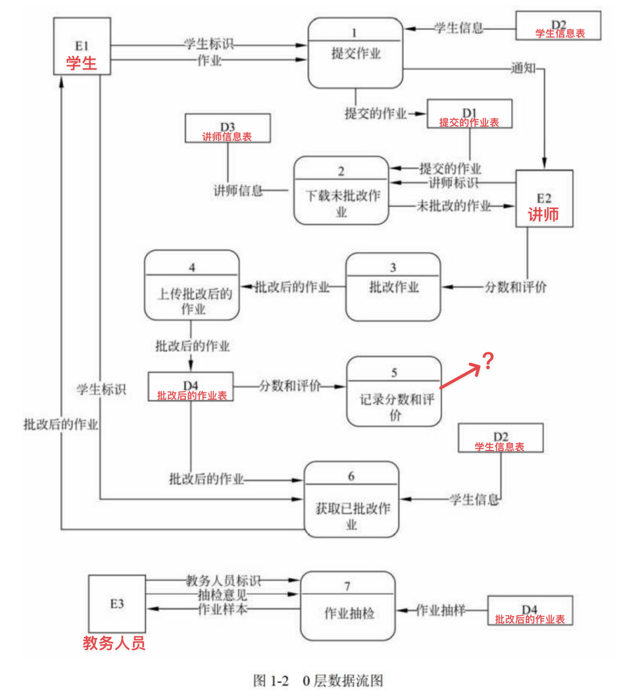

（1）<u>提交作业</u>。验证 **学生** 标识后，学生将 *电子作业* 通过在线的方式提交，并进行存储。系统 ~~给学生发送通知表明提交成功~~，通知中包含唯一编号；并通知讲师有作业提交。  
（2）<u>下载未批改作业</u>。验证 **讲师** 标识后，讲师从系统中下载学生提交的作业。下载的作业将显示在屏幕上。  
（3）<u>批改作业</u>。讲师按格式为每个题目进行批改打分，并进行整体评价。  
（4）<u>上传批改后的作业</u>。将 *批改后的作业* （包括分数和评价）返回给系统，进行存储。  
（5）<u>记录分数和评价</u>。将批改后的作业的分数和评价 ~~记录在学生信息中~~，~~并通知学生作业已批改~~。  
（6）<u>获取已批改作业</u>。根据学生标识，给学生查看批改后的作业，包括提交的作业、分数和评价。  
（7）<u>作业抽检</u>。根据 **教务人员** 标识抽取批改后的作业样本，给出抽检意见，然后 ~~形成抽检报告给讲师~~。  
现采用结构化方法对在线作业批改系统进行分析与设计，获得如图 1-1 所示的上下文数据流图和图 1-2 所示的 0 层数据流图。  


==问题一：== 使用说明中的词语，给出图 1-1 中的实体 E1〜E3 的名称。（3 分）

==问题二：== 使用说明中的词语，给出图 1-2 中的数据存储 D1〜D4 的名称（4 分）

==问题三：== 根据说明和图中术语，补充图 1-2 中缺失的数据流及其起点和终点。（6 分）

==问题四：== 若发送给学生和讲师的通知是通过第三方 Email 系统进行的，则需要对图 1-1 和图 1-2 进行哪些修改？用 100 字以内文字加以说明（2 分）


@tab 🍐 3

> 🍐 2016 年上

==【说明】==

某会议中心提供举办会议的场地设施和各种设备，供公司与各类组织机构租用。场地包括一个大型报告厅、一个小型报告厅以及诸多会议室。这些报告厅和会议室可提供的设备有投影仪、白板、视频播放/回放设备、计算机等。为了加强管理，该中心欲开发一会议预订系统，系统的主要功能如下。

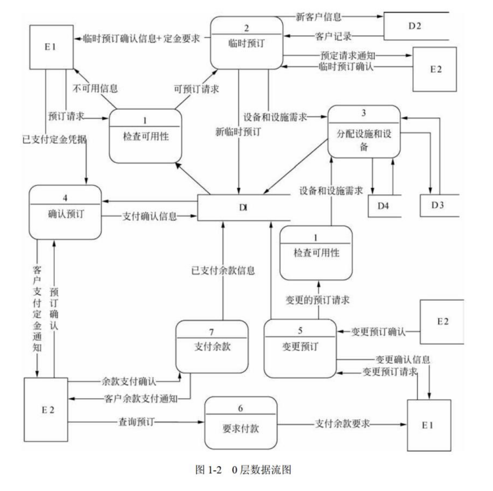


（1）<u>检查可用性</u>。 **客户** 提交预订请求后，检查预订表，判定所申请的场地是否在申请日期内可用；如果不可用，返回不可用信息。  
（2）<u>临时预订</u>。 **会议中心管理员** 收到客户预定请求的通知之后，提交确认。系统生成新临时预订存入 ==预订表==，并对新客户创建一条 *客户信息记录* 加以保存。根据客户记录给客户发送临时预订确认信息和支付定金要求。  
（3）<u>分配设施与设备</u>。根据临时预订或变更预定的 *设备和设施需求* ，分配所需设备（均能满足用户要求）和设施，更新 ==相应的表== 和预订表。  
（4）<u>确认预订</u>。管理员收到客户支付定金的通知后，检查确认，更新预订表，~~根据客户记录~~ ~~给客户发送预订确认信息~~。  
（5）<u>变更预订</u>。客户还可以在支付余款前提交变更预订请求，对变更的预订请求检查可用性，如果可用，分配设施和设备；如果不可用，返回不可用信息。管理员确认变更后，~~根据客户记录~~ 给客户发送确认信息。
（6）<u>要求付款</u>。管理员 ~~从预订表中查询~~ *距预订的会议时间两周内的预定* ，~~根据客户记录~~ 给满足条件的客户发送支付余款要求。  
（7）<u>支付余款</u>。管理员收到客户余款支付的通知后，检查确认，更新预订表中的已支付余款信息。  
现采用结构化方法对会议预定系统进行分析与设计，获得如图 1-1 所示的上下文数据流图和图 1-2 所示的 0 层数据流图（不完整）。


==问题一：== 使用说明中的词语，给出图 1-1 中的实体 E1〜E2 的名称。（2 分）

==问题二：== 使用说明中的词语，给出图 1-2 中的数据存储 D1〜D4 的名称。（4 分）

==问题三：== 根据说明和图中术语，补充图 1-2 中缺失的数据流及其起点和终点。（6 分）

==问题四：== 如果发送给客户的确认信息是通过 Email 系统向客户信息中的电子邮件地址进行发送的，那么需要对图 1-1 和 1-2 进行哪些修改？用 150 字以内文字加以说明。（3 分）


@tab 🍐 4

> 🍐 2016 年下

==【说明】==

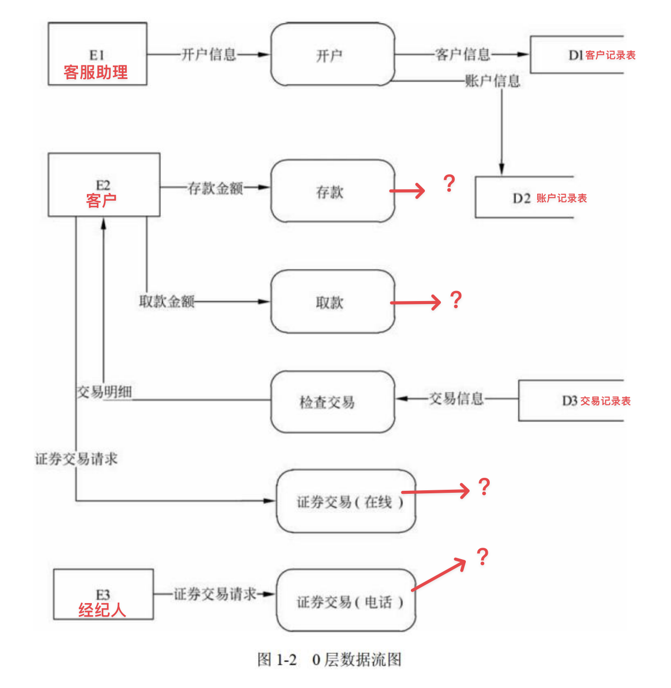


某证券交易所为了方便提供证券交易服务，欲开发一证券交易平台，该平台的主要功能如下：  
（1）<u>开户</u>。根据 **客户服务助理** 提交的开户信息，进行开户，并将客户信息存入 ==客户记录== 中，账户信息（余额等）存入 ==账户记录== 中。  
（2）<u>存款</u>。 **客户** 可以向其账户中存款，根据存款金额 ~~修改账户余额~~。  
（3）<u>取款</u>。客户可以从其账户中取款，根据取款金额 ~~修改账户余额~~。  
（4）<u>证券交易</u>。客户和 **经纪人** 均可以进行证券交易（客户通过在线方式，经纪人通过电话），~~将交易信息存入交易记录中~~。  
（5）<u>检查交易</u>。平台从 ==交易记录== 中读取交易信息，将交易明细返回给客户。  
现采用结构化方法对该证券交易平台进行分析与设计，获得如图 1-1 所示的上下文数据流图和图 1-2 所示的 0 层数据流图。


==问题一：== 使用说明中的词语，给出图 1-1 中的实体 E1〜E3 的名称。（3 分）

==问题二：== 使用说明中的词语，给出图 1-2 中的数据存储 D1〜D3 的名称。（3 分）

==问题三：== 根据说明和图中的术语，补充图 1-2 中缺失的数据流及其起点和终点。（4 分）

==问题四：== 实际的证券交易通常是在证券交易中心完成的，因此，该平台的“证券交易”功能需将交易信息传递给证券交易中心。针对这个功能需求，需要对图 1-1 和图 1-2 进行哪些修改，
请用 200 字以内的文字加以说明。（5 分）


@tab 🍐 5

> 🍐 2017 年上

==【说明】==

某医疗器械公司作为复杂医疗产品的集成商，必须保持高质量部件的及时供应。为了实现这一目标，该公司欲开发一采购系统。系统的主要功能如下：  


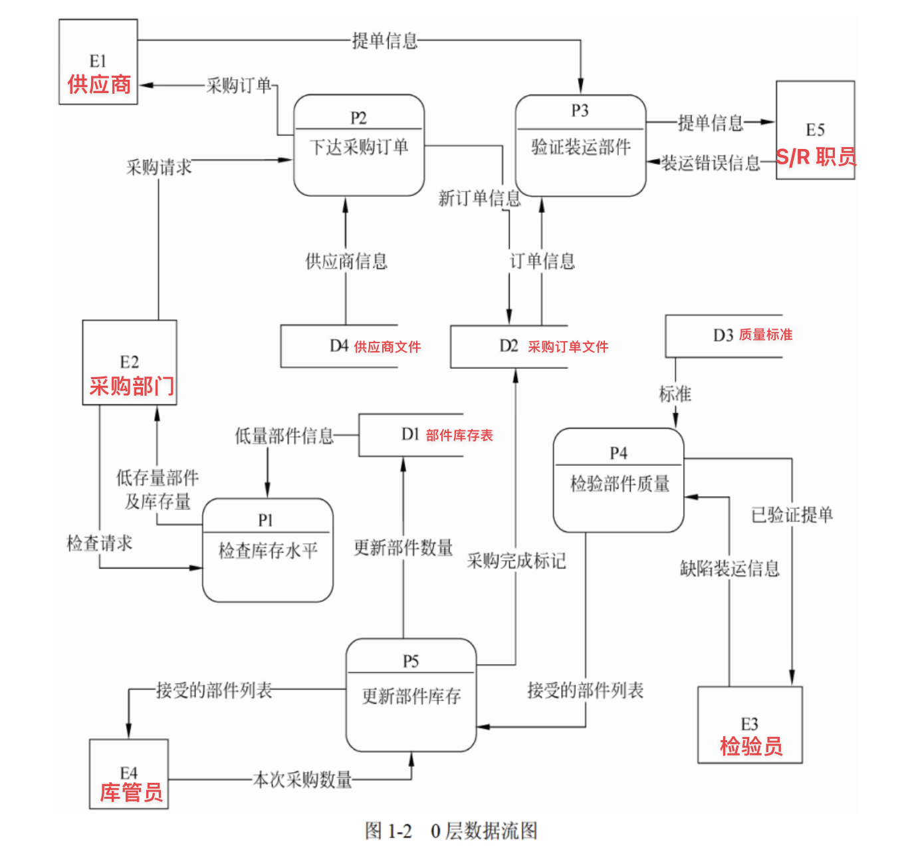


1. <u>检查库存水平</u>。 **采购部门** 每天检查 *部件库存量*，当特定部件的库存量降至其订货点时，返回低存量部件及库存量。  
2. <u>下达采购订单</u>。采购部门针对低存量部件及库存量提交采购请求，向其 **供应商** （通过 ==供应商文件== 访问供应商数据）下达采购订单，并存储于 ==采购订单文件== 中。  
3. 交运部件。当供应商提交提单并交运部件时，运输和接收（S/R）部门通过执行以下三步过程接收货物：  
（1）<u>验证装运部件</u>。通过访问采购订单并将其与提单进行比较来验证装运的部件，并将提单信息发给 **S/R 职员**。如果收货部件项目出现在采购订单和提单上，则已验证的提单和收货部件项目将被送去检验。否则，~~将 S/R 职员提交的装运错误信息生成装运错误通知发送给供应商~~。  
（2）<u>检验部件质量</u>。通过访问 *质量标准* 来检查装运部件的质量，并将已验证的提单发给 **检验员** 。如果部件满足所有质量标准，则将其添加到接受的部件列表用于更新部件库存。如果部件未通过检查，则 ~~将检验员创建的缺陷装运信息生成缺陷装运通知发送给供应商~~。  
（3）<u>更新部件库存</u>。 **库管员** 根据收到的接受的部件列表添加本次采购数量，~~与原有库存量累加~~ 来更新库存部件中的库存量。标记订单采购完成。  
现采用结构化方法对该采购系统进行分析与设计，获得如图 1-1 所示的上下文数据流图和图 1-2 所示的 0 层数据流图。  


==问题一：== 使用说明中的词语，给出图 1-1 中的实体 E1〜E5 的名称。（5 分）

==问题二：== 使用说明中的词语，给出图 1-2 中的数据存储 D1〜D4 的名称。（4 分）

==问题三：== 根据说明和图中术语，补充图 1-2 中缺失的数据流及其起点和终点。（4 分）

==问题四：== 用 200 字以内文字，说明建模图 1-1 和图 1-2 时如何保持数据流图平衡（2 分）


@tab 🍐 6

> 🍐 2017 年下

==【说明】==

某公司拟开发一个共享单车系统，采用北斗定位系统进行单车定位，提供针对用户的 APP 以及微信小程序、基于 Web 的管理与监控系统。该共享单车系统的主要功能如下。  

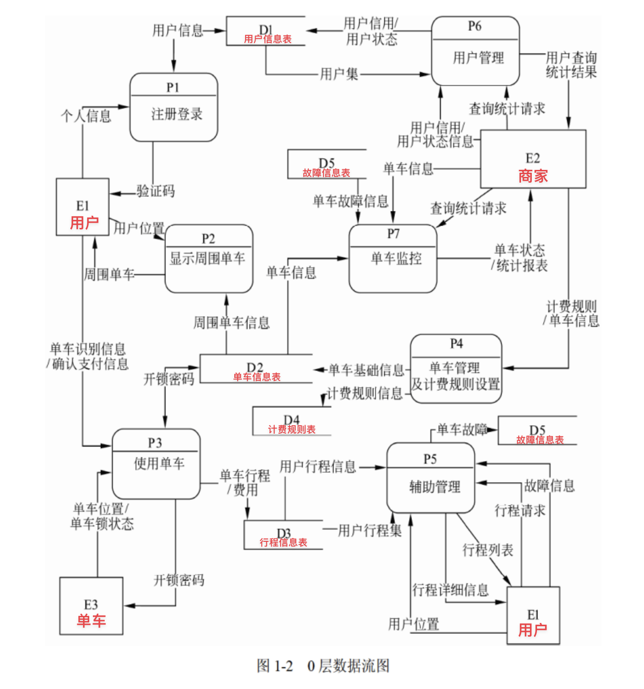


（1）<u>用户注册登录</u>。 **用户** 在 APP 端输入手机号并获取验证码后进行注册，将用户信息进行存储。用户登录后<u>显示用户所在位置周围的单车</u>。  
（2）<u>使用单车</u>。  
    ① 扫码/手动开锁。通过扫描二维码或手动输入编码 ~~获取开锁密码~~，~~系统发送开锁指令进行开锁~~，系统修改 **单车** 状态，新建单车行程。  
    ② 骑行单车。单车定时上传位置，更新行程。  
    ③ 锁车结账。用户停止使用或手动锁车并结束行程后，~~系统根据已设置好的计费规则及使用时间自动结算~~，~~更新本次骑行的费用~~ 并显示给用户，用户确认支付后，~~记录行程的支付状态~~。系统还将~~重置单车的开锁密码和单车状态~~。  
（3）<u>辅助管理</u>。  
    ① 查询。用户可以查看行程列表和行程详细信息。  
    ② 报修。用户上报所在位置或单车位置以及单车故障信息并进行记录。  
（4）管理与监控。  
    ① <u>单车管理及计费规则设置</u>。 **商家** 对单车基础信息、状态等进行管理，对计费规则进行设置并存储。  
    ② <u>单车监控</u>。对单车、故障、~~行程~~ 等进行查询统计。  
    ③ <u>用户管理</u>。管理用户信用与状态信息，对用户进行查询统计。  
现采用结构化方法对共享单车系统进行分析与设计，获得如图 1-1 所示的上下文数据流
图和图 1-2 所示的 0 层数据流图。


==问题一：== 使用说明中的词语，给出图 1-1 中的实体 E1〜E3 的名称。（3 分）

==问题二：== 使用说明中的词语，给出图 1-2 中的数据存储 D1〜D5 的名称（5 分）

==问题三：== 根据说明和图中术语及符号，补充图 1-2 中缺失的数据流及其起点和终点。（5 分）

==问题四：== 根据说明中术语，说明“使用单车”可以分解为哪些子加工？（2 分）


@tab 🍐 7

> 🍐 2018 年上

==【说明】==

某医疗护理机构为老年人或有护理需求者提供专业护理，现欲开发一基于 Web 的医疗管理系统，以改善医疗护理效率。该系统的主要功能如下：  

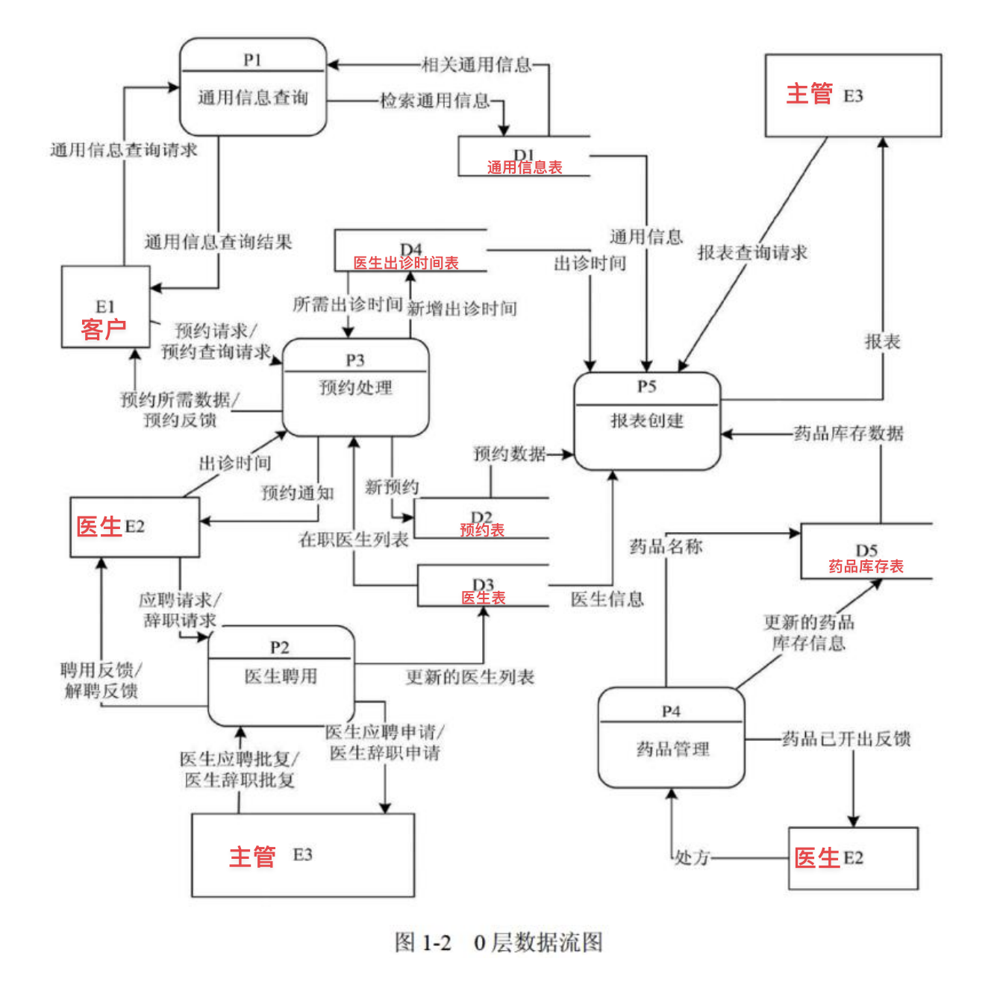

（1）<u>通用信息查询</u>。**客户** 提交通用信息查询请求，查询 ==通用信息表==，返回查询结果。  
（2）<u>医生聘用</u>。**医生** 提出应聘／辞职申请，交由 **主管** 进行聘用/解聘审批，更新 ==医生表==，并给医生反馈聘用/解聘结果； ~~删除解聘医生的出诊安排~~。  
（3）<u>预约处理</u>。**医生** 安排出诊时间，存入 ==医生出诊时间表==；根据 **客户** 提交的预约查询请求，查询在职医生及其出诊时间等预约所需数据 并返回；创建预约，提交预约请求，在 ==预约表== 中新增预约记录，~~更新所约医生出诊时间~~ 并给医生发送预约通知；给客户反馈预约结果。  
（4）<u>药品管理</u>。**医生** 提交处方，根据药品名称从药品数据中 ~~查询相关 *药品库存信息*~~，开出药品，更新对应药品的库存 ~~以及预约表中的治疗信息~~；给医生发送“药品已开出”反馈。  
（5）<u>报表创建</u>。根据 **主管** 提交的报表查询请求（报表类型和时间段），从预约数据、通用信息、药品库存数据、医生以及医生出诊时间中进行查询，生成报表返回给主管。  

现采用结构化方法对医疗管理系统进行分析与设计，获得如图 1-1 所示的上下文数据流图和图 1-2 所示的 0 层数据流图。


==问题一：== 使用说明中的词语，给出图 1-1 中的实体 E1〜E3 的名称。（3 分）

==问题二：== 使用说明中的词语，给出图 1-2 中的数据存储 D1〜D5 的名称。（5 分）

==问题三：== 使用说明和图中术语，补充图 1-2 中缺失的数据流及其起点和终点。（4 分）

==问题四：== 使用说明中的词语，说明“预约处理”可以分解为哪些子加工，并说明建模图 1-1 和图 1-2 是如何保持数据流图平衡。（3 分）


@tab 🍐 8

> 🍐 2018 年下

==【说明】==

某房产中介连锁企业欲开发一个基于 Web 的房屋中介信息系统，以有效管理房源和客户，提高成交率。该系统的主要功能是：  

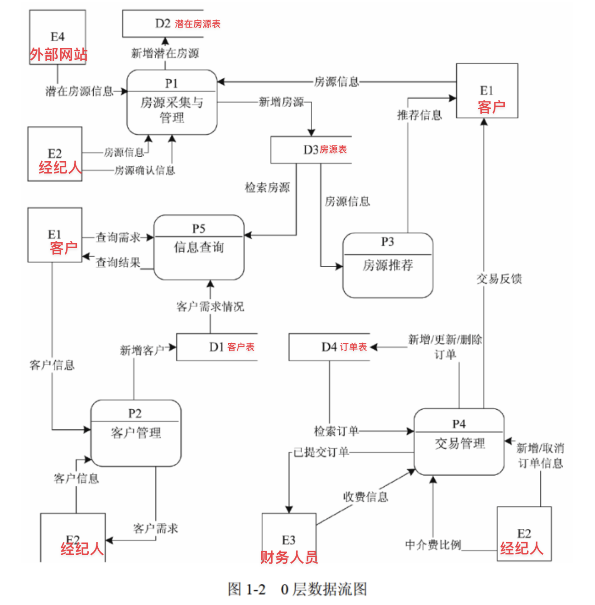

（1）<u>房源采集与管理</u>。系统自动采集 **外部网站** 的潜在房源信息，保存为 *潜在房源*。由 **经纪人** 联系确认的潜在房源变为房源，并添加出售/出租房源的客户。由经纪人或 **客户** 登记的出售/出租房源，系统将其保存为房源。房源信息包括基本情况、配套设施、交易类型、委托方式、业主等。~~经纪人可以对房源进行更新等管理操作~~。  
（2）<u>客户管理</u>。求租/求购客户进行注册、更新，推送客户需求给 **经纪人** ，或由经纪人对求租/求购客户进行登记、更新。客户信息包括身份证号、姓名、手机号、需求情况、委托方式等。  
（3）<u>房源推荐</u>。~~根据客户的需求情况~~（求购/求租需求情况以及出售/出租房源信息），向已登录的客户推荐房源。  
（4）<u>交易管理</u>。经纪人对租售客户双方进行交易信息管理，包括订单提交和取消，设置收取中介费比例。财务人员收取中介费之后，表示该订单已完成，系统更新订单状态和 ~~房源状态~~ ，向客户和 ~~经纪人发送交易反馈~~。  
（5）<u>信息查询</u>。**客户** 根据自身查询需求查询房屋供需信息。  

现采用结构化方法对房屋中介信息系统进行分析与设计，获得如图 1-1 所示的上下文数据流图和图 1-2 所示的 0 层数据流图。


==问题一：== 使用说明中的词语，给出图 1-1 中的实体 E1〜E4 的名称。（4 分）

==问题二：== 使用说明中的词语，给出图 1-2 中的数据存储 D1〜D4 的名称。（4 分）

==问题三：== 根据说明和图中术语，补充图 1-2 中缺失的数据流及其起点和终点。（3 分）

==问题四：== 根据说明中术语，给出图 1-1 中数据流“客户信息”“房源信息”的组成。（4 分）


@tab 🍐 9

> 🍐 2019 年上

==【说明】==

某学校欲开发一学生跟踪系统，以便更自动化、更全面地对学生在校情况（到课情况和健康状态等）进行管理和追踪，使家长能及时了解子女的到课情况和健康状态，并在有健康问题时及时与医护机构对接。该系统的主要功能是：  

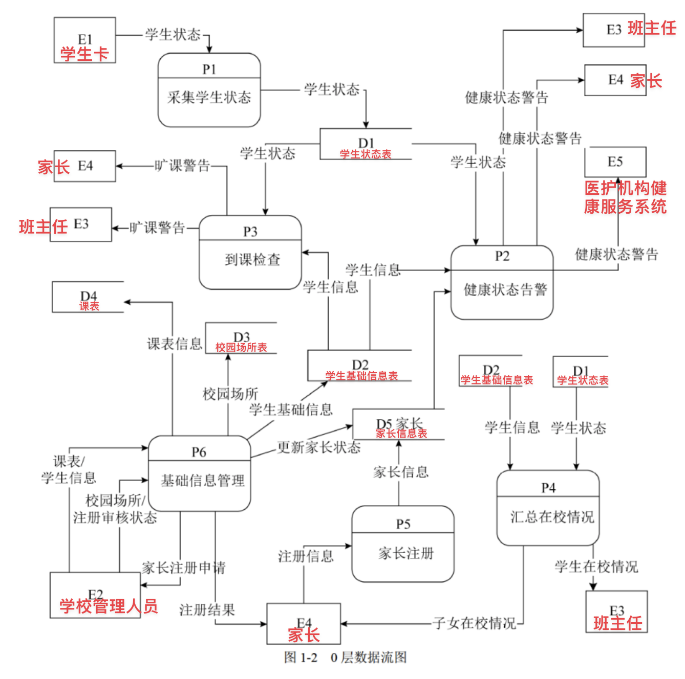

（1）<u>采集学生状态</u>。通过 **学生卡传感器**，采集学生心率、体温（摄氏度）等健康指标及其所在位置等信息并记录。每张学生卡有唯一的标识（ID）与一个学生对应。  
（2）<u>健康状态告警</u>。在学生健康状态出问题时，系统向 班主任、家长 和 **医护机构健康服务系统** 发出健康状态警告，由 **医护机构健康服务系统** 通知相关医生进行处理。  
（3）<u>到课检查</u>。综合比对学生状态、~~课表以及所处校园场所之间的信息对学生到课情况进行判定~~。对旷课学生，向其 **家长** 和 **班主任** 发送旷课警告。  
（4）<u>汇总在校情况</u>。定期 ~~汇总在校情况~~，并将报告发送给 **家长** 和 **班主任**。  
（5）<u>家长注册</u>。**家长** 注册使用该系统，~~指定自己子女，存入家长信息~~，待审核。  
（6）<u>基础信息管理</u>。**学校管理人员** 对学生及其所用学生卡和班主任、*课表*（班级、上课时间及场所等）、*校园场所*（名称和所在位置区域）等基础信息进行管理；~~对家长注册申请进行审核~~，更新家长状态，~~将家长 ID 加入学生信息记录中~~ 使家长与其子女进行关联，向家长发送注册结果。一个学生至少有一个家长，可以有多个家长。课表信息包括班级、班主任、时间和位置等。  

现采用结构化方法对学生跟踪系统进行分析与设计，获得如图 1-1 所示的上下文数据流图和图 1-2 所示的 0 层数据流图。


==问题一：== 使用说明中的词语，给出图 1-1 中的实体 E1〜E5 的名称。（5 分）

==问题二：== 使用说明中的词语，给出图 1-2 中的数据存储 D1〜D4 的名称。（4 分）

==问题三：== 根据说明和图中术语，补充图 1-2 中缺失的数据流及其起点和终点（三条即可）。（3 分）

==问题四：== 根据说明中的术语，说明图 1-1 中数据流“学生状态”和“学生信息”的组成。（3 分）


@tab 🍐 10

> 🍐 2019 年下

==【说明】==

某公司欲开发一款二手车物流系统，以有效提升物流成交效率。该系统的主要功能是：  

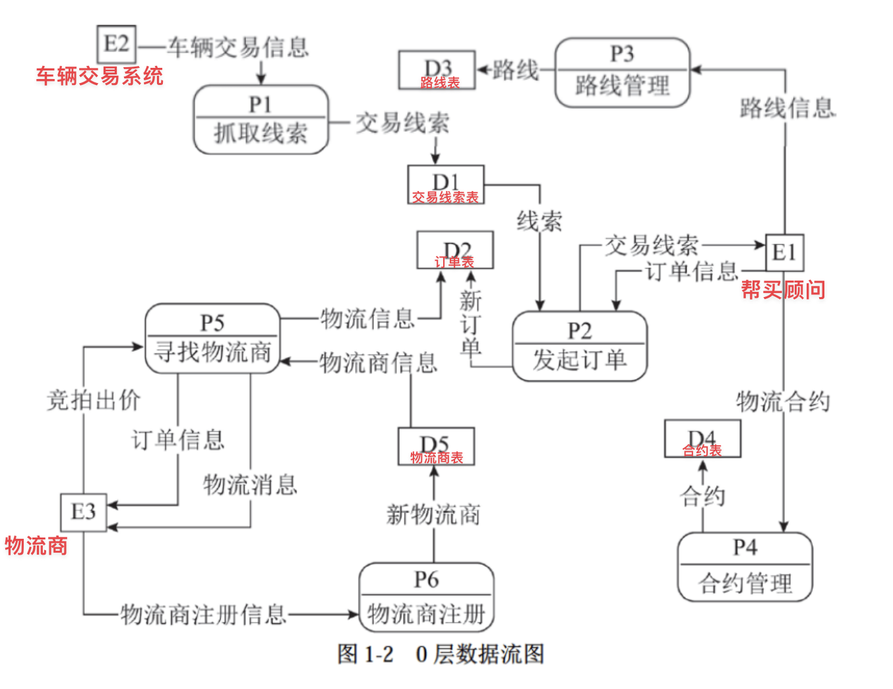

（1）<u>订单管理</u>：系统抓取线索，将 **车辆交易系统** 的交易信息抓取为 *线索*。帮买顾问看到有买车线索后，会打电话询问买家是否需要物流，若需要，**帮买顾问** 就将这个线索发起为 *订单* 并在系统中存储，然后 ~~系统帮助买家寻找物流商进行承运~~。  
（2）<u>路线管理</u>：**帮买顾问** 对物流商的路线进行管理，存储的 *路线信息* 包括路线类型、物流商、起止地点。路线分为三种，即固定路线、包车路线、竞拍体系，其中固定路线和包车路线是合约制。包车路线的发车时间由公司自行管理，是订单的首选途径。  
（3）<u>合约管理</u>：~~帮买顾问根据公司与物流商确定的合约~~，对合约内容进行设置，*合约信息* 包括物流商信息、路线起止城市、价格、有效期等。  
（4）<u>寻找物流商</u>：~~系统根据订单的类型~~（保卖车、全国购和普通二手车）、起止城市、需要的服务模式（买家接、送到买家等）进行自动派发或以竞拍体系方式选择合适的物流商。  
> 即：有新订单时，若为保卖车或全国购，则直接分配到竞拍体系中；否则，若符合固定路线和/或包车路线，系统自动分配给合约物流商，若不符合固定路线和包车路线，系统将订单信息分配到竞拍体系中。竞拍体系接收到订单后，将订单信息推送给有相关路线的物流商，**物流商** 对订单进行竞拍出价，最优报价的物流商中标。最后，给承运的物流商发送物流消息，更新订单的物流信息，~~给车辆交易系统发送物流信息~~。   
 
（5）<u>物流商注册</u>：**物流商** 账号的注册开通。 

现采用结构化方法对二手车物流系统进行分析与设计，获得如图 1-1 所示的上下文数据流图和图 1-2 所示的 0 层数据流图。


==问题一：== 使用说明中的词语，给出图 1-1 中的实体 E1〜E3 的名称。（3 分）

==问题二：== 使用说明中的词语，给出图 1-2 中的数据存储 D1〜D5 的名称。（5 分）

==问题三：== 根据说明和图中术语，补充图 1-2 中缺失的数据流及其起点和终点。（4 分）

==问题四：== 根据说明，采用结构化语言对“P5：寻找物流商”的加工逻辑进行描述。（3 分）


@tab 🍐 11

> 🍐 2020 年下

==【说明】==

某工厂制造企业开发了智能检测系统以有效提升检测效率，节约人力资源，该系统的主要功能包括：  

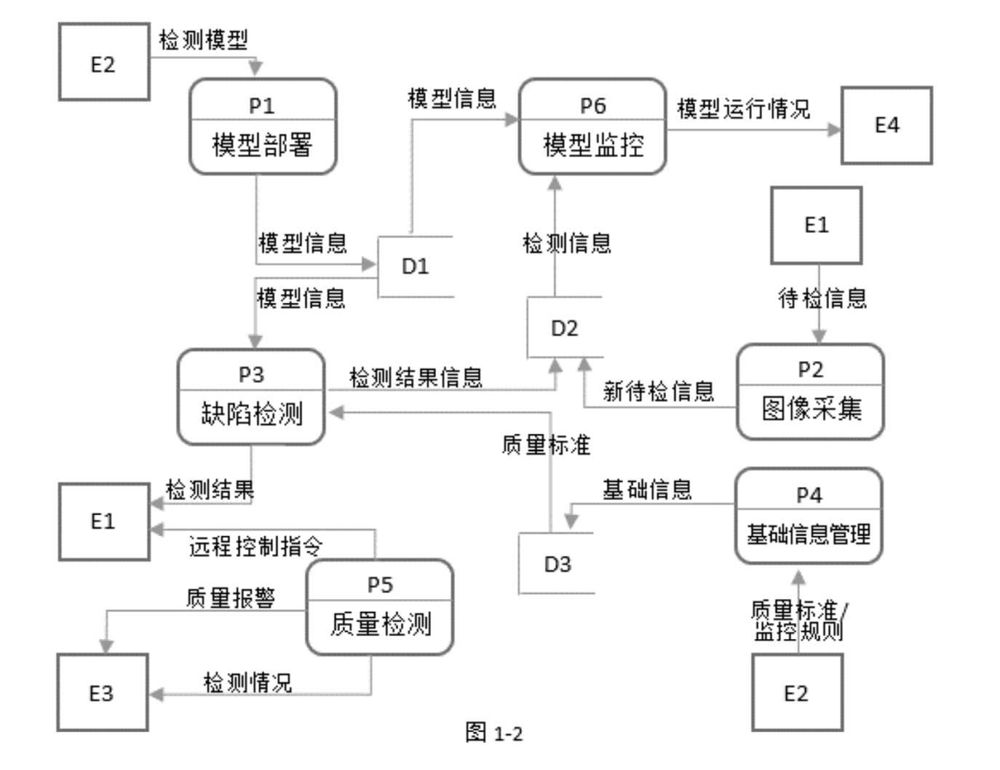

（1）<u>基础信息管理</u>。**管理员** 对检测标准和监控规则等基础信息设置。  
（2）<u>检测模型部署</u>。**管理员** 对常用机器学习方法建立检测模型分布。  
（3）<u>图像采集</u>。实时将检测多样的 **产品** 待检测建分存储，包括产品结构，生产时间，图像信号和产品图像。  
（4）<u>缺陷检测</u>。根据 *检测模型* 和 *检测质量标准* ~~对图像采集所收到的 *产品检测信息* 中所有图像进行检测~~ 或所有图像检测合格。若一个产品出现一张图像检测不合格，就表示该产品不合格，对不合格产品，其检测结果包括，产品型号和不合格类型。  
（5）<u>质量检测</u>。根据 *监控规则* 对产品质量进行监控，将检测情况展示给检测业务员，若不满足条件，向检测业务员发送质量报警，检测是质量发起远程控制部分，向检测设备发送控制指令进行处理。  
（6）<u>模型监控</u>。在系统中部署的模型、产品的检测信息 ~~结合基础信息~~ 进行监测分析，将模型运行情况发给监控人员。  
现采用结构化方法对智能检测系统，进行分析与设计，获得如图 1-1 的上下文数据流图和图 1-2 的数据流图。


==问题一：== 使用说明中的语句给出图 1-1 中的实体 E1〜E4 的名称。（4 分）

==问题二：== 使用说明中的语句给出图 1-2 中的数据存储 D1〜D3 的名称。（3 分）

==问题三：== 根据说明和图中术语，补齐图 1-2 中缺失的数据及起点和终点。（5 分）

==问题四：== 根据说明，采用结构化语言对缺陷检测的加工逻辑进行描述（3 分）


@tab 🍐 12

> 🍐 2021 年上

==【说明】==

某停车场运营方为了降低运营成本，减员增效，提供良好的停车体验，欲开发无人值守停车系统，该系统的主要功能是：  

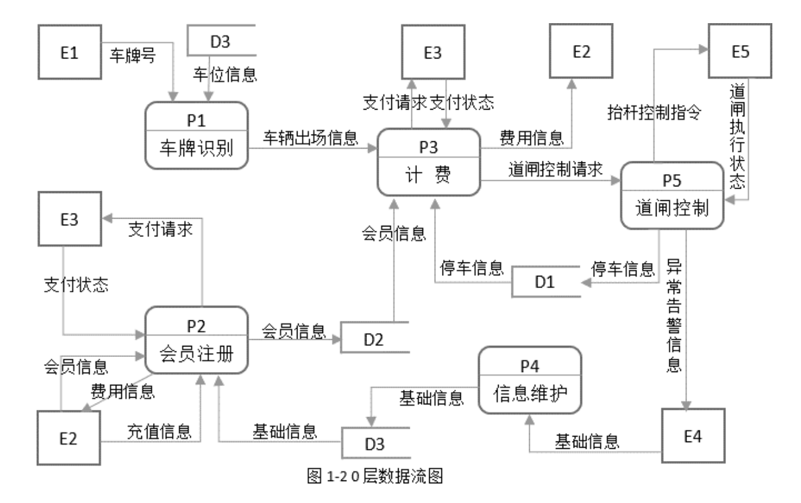

（1）<u>信息维护</u>。**管理人员** 对 *车位*（总数、空余车位数等）、*计费规则* 等基础信息进行设置。  
（2）<u>会员注册</u>。**车主** 提供手机号、车牌号等信息进行注册，提交 *充值信息*（等级、绑定并授权支付系统进行充值或交费的支付账号）不同级别和充值额度享受不同停车折扣点。  
（3）<u>车牌识别</u>。当 **车辆** 进入停车场时，若有（空余车位数大于 1），自动识别车牌号后进行 ~~道闸控制~~，当车主开车离开停车场时，识别车牌号，计费成功后，请求道闸控制。  
（4）<u>计费</u>。更新车辆离场时间，根据计费规则计算出停车费用，若车主是会员，提示停车费用：若储存余额够本次停车费用，自动扣费，~~更新余额~~，若储值余额不足，自动使用授权缴费账号请求 **支付系统** 进行支付，获取支付状态。若非会员临时停车，提示停车费用，车主通过扫描费用信息中的支付码调用 **支付系统** 自助交费，获取支付状态。  
（5）<u>道闸控制</u>。根据 *道闸控制请求* 向 **道闸控制系统** 发送放行指令和接收道闸执行状态。若道闸执行状态为正常放行时，对入场车辆，将车牌号及其入场时间信息存入停车记录，修改空余车位数；对出场车辆更新停车状态，~~修改空余车位数~~。当因道闸重置系统出现问题（断网断电或是故障为抬杠等情况），而无法在规定的时间内接收到其返回的执行状态正常放行时，系统向 **管理人员** 发送异常告警信息，之后管理人员安排故障排查处理，确保车辆有序出入停车场。  

现采用结构化方法对无人值守停车系统进行分析与设计，获得如图 1-1 所示的上下文数据流图和图 1-2 所示的 0 层数据流图。


==问题一：== 使用说明中的词语，给出图 1-1 中的实体 E1〜E5 的名称。（5 分）

==问题二：== 使用说明中的词语，给出图 1-2 中的数据存储 D1〜D3 的名称。（3 分）

==问题三：== 根据说明和图中术语，补充图 1-2 中缺失的数据流及其起点和终点（4 分）

==问题四：== 根据说明，采用结构化语言对“道闸控制”的加工逻辑进行描述。（3 分）


@tab 🍐 13

> 🍐 2021 年下

==【说明】==

某现代农业种植基地为进一步提升农作物种植过程的智能化，欲开发智慧农业平台，集管理和销售于一体，该平台的主要功能有:  

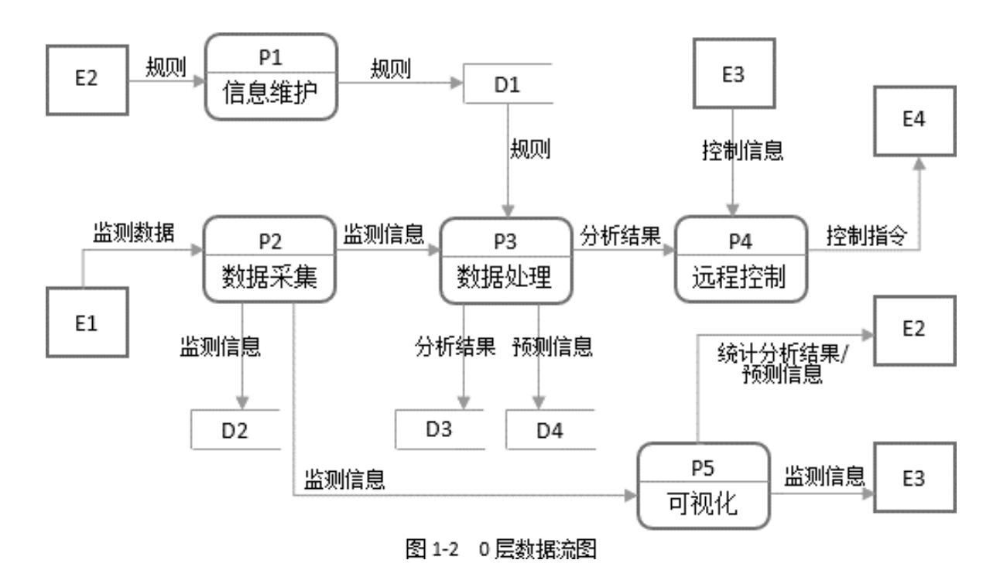

（1）<u>信息维护</u>。**农业专家** 对农作物、环境等监测数据的 *监控处理规则* 进行维护。  
（2）<u>数据采集</u>。获取 **传感器** 上传的农作物长势、土壤墒情、气候等连续监测数据，解析后将监测信息进行数据处理、可视化和存储等操作。  
（3）<u>数据处理</u>。对实时监测信息根据 *监控处理规则* 进行监测分析，将分析结果进行可视化并进行存储、远程控制，对历史监测信息进行综合统计和预测，将预测信息进行可视化和存储。  
（4）<u>远程控制</u>。根据 ~~监控处理规则~~ 对分析结果进行判定，依据判定结果自动对 **控制器** 进行远程控制。平台也可以根据 **农业人员** 提供的控制信息对控制器进行远程控制。  
（5）<u>可视化</u>。实时向 **农业人员** 展示监测信息：实时给 **农业专家** 展示 ~~统计分析结果~~ 和 ~~预测信息~~ 或根据农业专家 ~~请求~~ 进行展示。  

现采用结构化方法对智慧农业平台进行分析与设计，获得如图 1-1 所示的上下文数据流图和图 1-2 所示的 0 层数据流图。


==问题一：== 使用说明中的词语，给出图 1-1 中的实体 E1〜E4 的名称。（4 分）

==问题二：== 使用说明中的词语，给出图 1-2 中的数据存储 D1〜D4 的名称。（4 分）

==问题三：== 根据说明和图中术语，补充图 1-2 中缺失的数据流及其起点和终点。（4 分）

==问题四：== 根据说明，“数据处理”可以分解为哪些子加工？进一步进行分解时，需要注意哪三种常见的错误？（3 分）


@tab 🍐 14

> 🍐 2022 年上

==【说明】==

某公司欲开发一款外卖订餐系统，集多家外卖平台和商户为一体，为用户提供在线浏览餐品、订餐和配送等服务。该系统的主要功能是：  

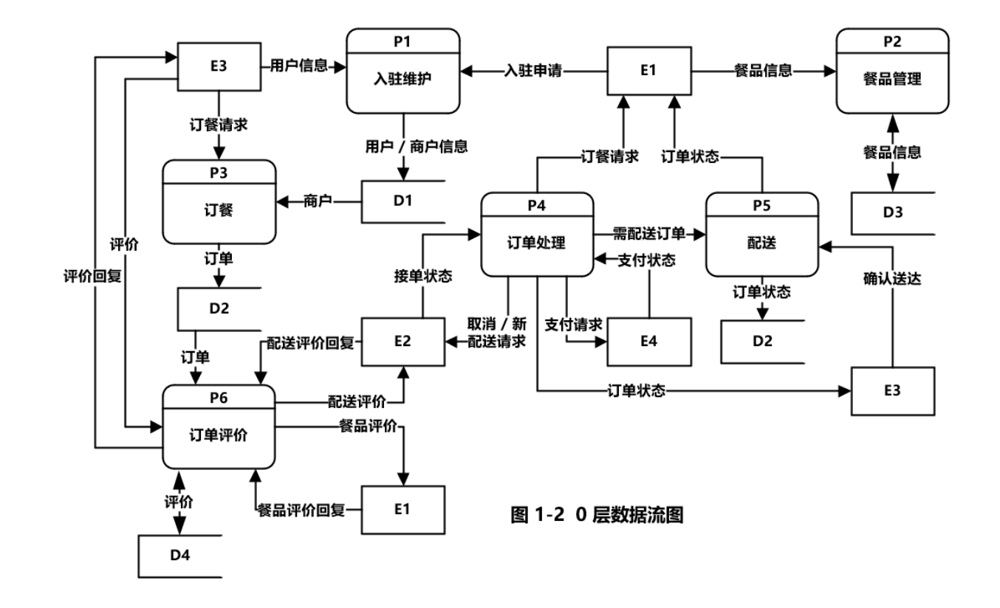

（1）<u>入驻管理</u>。用户注册；**商户** 申请入驻，设置按时间段接单数量阅值等。系统存储商户/用户信息。  
（2）<u>餐品管理</u>。**商户** 对餐品的基本信息和优惠信息进行发布、修改、删除。系统存储相关信息。  
（3）<u>订餐</u>。**用户** ~~浏览商户餐单~~，选择餐品及数量后提交订餐请求。系统存储订餐订单。  
（4）<u>订单处理</u>。~~收到订餐请求~~ 后，向外卖平台请求配送。外卖平台接到请求后发布配送单，由平台骑手接单，外卖平台根据是否有骑手接单返回接单状态。若外卖平台接单成功，系统给 **支付系统** 发送支付请求，接收支付状态。支付成功，~~更新订单状态为已接单~~，向商户发送订餐请求并由商户打印订单，给用户发送订单状态；若支付失败，更新订单状态为下单失败，向外卖平台请求取消配送，向用户发送下单失败。若系统接到外卖平台返回接单失败或超时未返回接单状态，则更新订单状态为下单失败，向用户发送下单失败。  
（5）<u>配送</u>。商户备餐后，由 **骑手** 取餐配送给用户。送达后由用户扫描骑手出示的订单上的配送码后确认送达，订单状态更改为已送达，并发送给商户。  
（6）<u>订单评价</u>。用户可以对订单餐品、骑手配送服务进行评价，推送给对应的商户、所在外卖平台，商户和外卖平台对用户的评价进行回复。系统存储评价。  
现采用结构化方法对外卖订餐系统进行分析与设计，获得如图 1-1 所示的上下文数据流图和图 1-2 所示的 0 层数据流图。


==问题一：== 使用说明中的词语，给出图 1-1 中的实体 E1〜E4 的名称。（4 分）

==问题二：== 使用说明中的词语，给出图 1-2 中的数据存储 D1〜D4 的名称。（4 分）

==问题三：== 根据说明和图中术语，补充图 1-2 中缺失的数据流及其起点和终点。（4 分）

==问题四：== 根据说明，采用结构化语言对“订单处理”的加工逻辑进行描述。（3 分）


@tab 🍐 15

> 🍐 2022 年下

==【说明】==

随着新能源车数量的迅猛增长，全国各地电动汽车配套充电桩急速增长，同时也带来了充电桩计量准确性的问题。充电桩都需要配备相应的电能计量和电费计费功能，需要对充电计量准确性强制进行检定。现需开发计量检定云端软件，其主要功能是：  

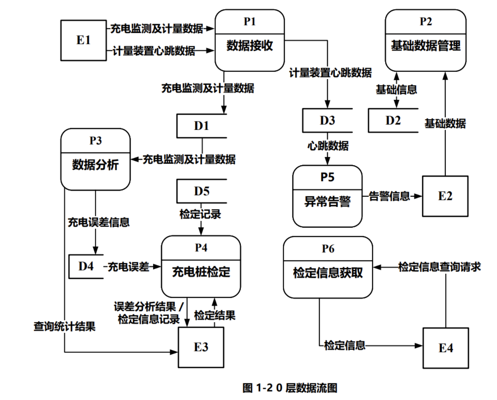

（1）<u>数据接收</u>。接收 **计量装置** 上报的充电数据，即充电过程中电压、电流、电能等 *充电监测数据和计量数据*（充电监测数据为充电桩监测的数据，计量数据为计量装置计量的数据，以秒为间隔单位），接收 *计量装置心跳数据*，并分别进行存储。  
（2）<u>基础数据维护</u>。**管理员** 对充电桩、计量检定装置等基础数据进行维护。  
（3）<u>数据分析</u>。实现电压、电流、电能数据的对比，进行误差分析，记录充电桩的充电误差，供计量装置检定。系统根据 **计量检测人员** ~~给出的查询和统计条件~~ 展示查询统计结果。  
（4）<u>充电桩检定</u>。分析充电误差：计量检测人员根据误差分析结果和检定信息记录，对充电桩进行检定，提交检定结果：系统 ~~<u>更新充电桩中的检定信息</u>~~（检定结果和检定时间），~~并存储于检定记录~~。  
（5）<u>异常告警</u>。检测计量装置心跳，当心跳停止时，向管理员发出告警。  
（6）<u>检定信息获取</u>。供其它与充电桩相关的 **第三方服务** ~~<u>查询充电桩中的检定信息</u>~~。  

现采用结构化方法对计量检定云端软件进行分析与设计，获得如图 1-1 所示的上下文数据流图和图 1-2 所示的 0 层数据流图。


==问题一：== 使用说明中的词语，给出图 1-1 中的实体 E1〜E4 的名称。（4 分）

==问题二：== 使用说明中的词语，给出图 1-2 中的数据存储 D1〜D5 的名称。（5 分）

==问题三：== 根据说明和图中术语，补充图 1-2 中缺失的数据流及其起点和终点。（4 分）

==问题四：== 根据说明，给出“充电监测与计量数据”数据流的组成。（2 分）


@tab 🍐 16

> 🍐 2023 年上

==【说明】==

随着农业领域科学种植的发展，需要对农业基地及农事进行信息化管理，为租户和农户等人员提供种植相关服务。现欲开发农事管理服务平台，其主要功能是：  

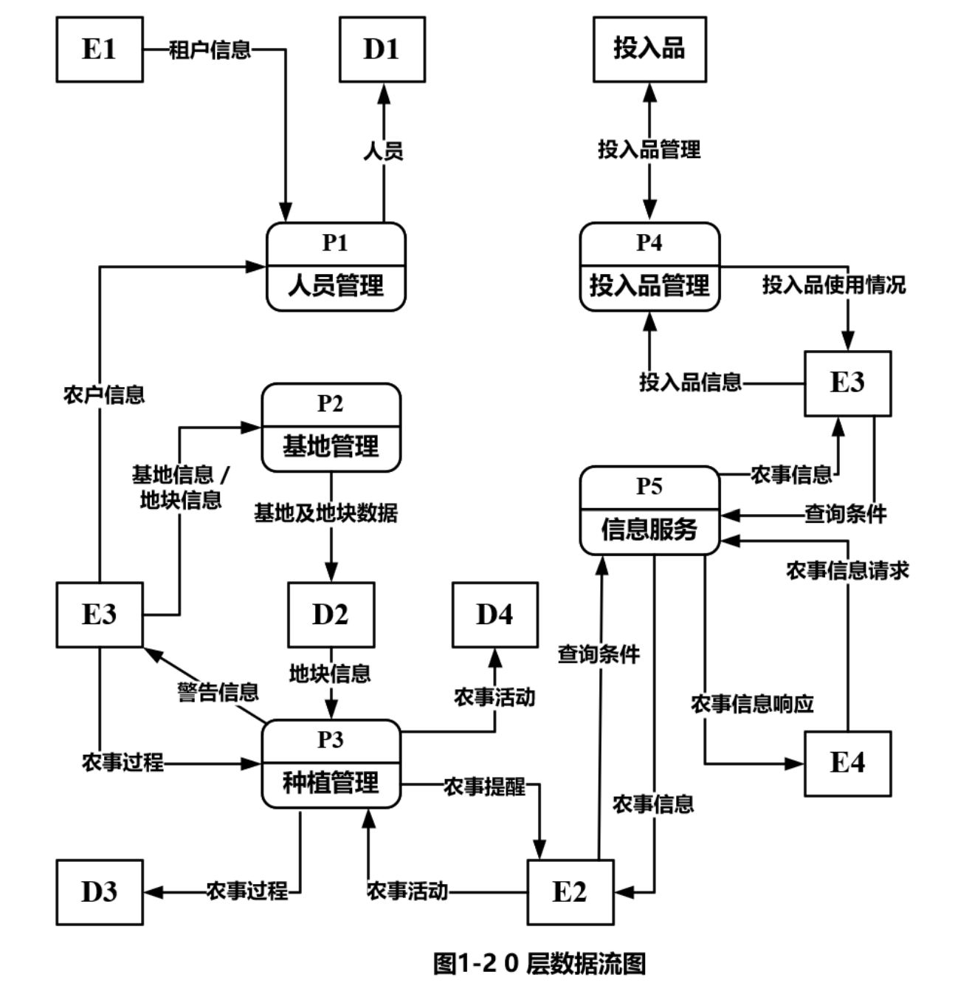

（1）<u>人员管理</u>。**平台管理员** 管理租户；租户管理农户并为其分配负责的地块，租户和农户以人员类型区分。  
（2）<u>基地管理</u>。**租户** 填写基地名称、地域等描述信息，在显示的地图上绘制地块。  
（3）<u>种植管理</u>。**租户** 设定作物及其从种植到采收的整个农事过程，包括农事活动及其实施计划，**农户** 根据相应农事过程提醒进行农事活动并记录。系统会在设定时间向农户进行农事提醒，对逾期未实施活动向租户发出逾期警告。  
（4）<u>投入品管理</u>。**租户** 统一维护化肥，杀虫剂等投入品信息。**农户** ~~在农事活动中设定投入品的实际消耗~~。  
（5）<u>信息服务</u>。用户按查询条件发起农事信息请求，对 ~~相关地块~~ ~~农事活动实施情况~~（如 ~~与农事过程比对~~）等农事信息进行筛选、对比和统计等处理，并将响应信息进行展示。系统也给其他第三方软件提供 APP 接口，通过接口访问的方式，提供 *账号，密码和查询条件* 发起农事信息请求，返回特定格式的农事信息，无查询条件时默返回账号下所有信息，多查询条件时返回满足全部条件的信息。  
现采用结构化方法对农事管理服务平台进行分析与设计，获得如图 1-1 所示的上下文数据流图和图 1-2 所示的 0 层数据流图。


==问题一：== 使用说明中的词语，给出图 1-1 中的实体 E1~E4 的名称。（4 分）

==问题二：== 使用说明中的词语，给出图 1-2 中的数据存储 D1~D4 的名称。（4 分）

==问题三：== 根据说明和图中术语，补充图 1-2 中缺失的数据流及其起点和终点。（4 分）

==问题四：== 根据说明，给出“农事信息请求”数据流的组成。（3 分）

::::


### 解答

::: warning 标 ❌ 的为错误答案
:::

:::: tabs

@tab 🍐 1

==答 1：== <u>E1：教师  E2：学生</u> ✅

==答 2：== <u>D1：试题表  D2：学生信息表  D3：考试信息表  D4：解答结果表</u> ✅

==答 3：== 

| 数据流信息 |  起点  |  终点  |
| :--: |  :--:  |  :--:  | 
| 题目 | D1 | 2 |
| 答案 | D1 | 3 |


==答 4：== 

分解为加工 1：发送通知，加工 2：创建通知

| 数据流信息 |  起点  |  终点  |
| :--: |  :--:  |  :--:  | 
| 报告数据 | 生成成绩报告 | 创建通知 |
| 成绩单数据 | 生成成绩单 | 创建通知 |
| 通知数据 | 创建通知 | 发送通知 |


@tab 🍐 2


==答 1：== <u>E1：学生  E2：讲师  E3：教务人员</u> ✅


==答 2：== <u>D1：提交的作业表  D2：学生信息表  D3：讲师信息表  D4：批改后的作业表</u> ✅


==答 3：== 

| 数据流信息 |  起点  |  终点  |
| :--: |  :--:  |  :--:  | 
| 提交成功通知 | 1 | E1 |
| 分数和评价 | 5 | D2 |
| 作业已批改通知 | 5 | E1 |
| 抽检报告 | 7 | E2 |


==答 4：== 

<u>图 1-1 和 图 1-2 需要新增一个外部主体 E4：Email 系统，由在线作业批改系统将通知信息通过 Email 系统发送给 E1 和 E2 ；~~另外图 1-2 还需要新增一个加工：发送邮件，数据流及其起点、终点信息如下：~~ ❌</u>

::: warning 第三方 Email 系统即为外部实体，而非本系统内部加工
:::

==【参考答案】==：将 Email 系统作外部实体，并将通知的终点全部改 Email 系统。  
==【解析】==：
1. 需要对图 1-1 和图 1-2 进行修改，添加外部实体 “Email 系统”，并将数据流通知的终点都改为 Email 系统；
2. 在图 1-1 中将唯一加工到 E1 和 E2 的通知数据流终点改为 “Email 系统”；
3. 在图 1-2 中，将加工 1 到 E2 的数据流通知的终点改为 “Email 系统”；
4. 还需要将问题 3 补充数据流 “提交成功通知” 和 “作业已批改通知” 的终点也改为 “Email 系统”。


@tab 🍐 3

==答 1：== <u>E1：客户  E2：会议中心管理员</u> ✅

==答 2：== <u>D1：预定表  D2：客户表  D3：设备表  D4：设施表</u> ✅


==答 3：== 

| 数据流信息 |  起点  |  终点  |
| :--: |  :--:  |  :--:  | 
| 已支付定金的客户记录 | D2 | 4 |
| 预定确认信息 | 4 | E1 |
| 距预订的会议时间两周内的预定信息 | D1 | 6 |
| 满足条件的客户记录 | D2 | 6 |
| 客户记录 | D2 | 5 |
| 已支付余款凭据 | E1 | 7 |


==答 4：== 

1. 需要对图 1-1 和图 1-2 进行修改，添加外部实体 “Email 系统”；
2. 在图 1-1 中将唯一加工到 E1 的数据流 “临时预定/预定/变更确认信息” 的终点改为 Email 系统；
3. 在图 1-2 中，将加工 2 到 E1 的数据流 “临时预定确认信息” 、加工 5 到 E1 的数据流 “变更确认信息”的终点改为 “Email 系统”；
4. 还需要将问题 3 中补充数据流 “预定确认信息” 的终点也改为 “Email 系统”。


@tab 🍐 4


==答 1：== <u>E1：客户服务助理  E2：客户  E3：经纪人</u> ✅


==答 2：== <u>D1：客户记录表  D2：账户记录表  D3：交易记录表</u> ✅


==答 3：== 

| 数据流信息 |  起点  |  终点  |
| :--: |  :--:  |  :--:  | 
| 余额 | 存款 | D2 |
| 余额 | 取款 | D2 |
| 交易信息 | 证券交易（在线） | D3 |
| 交易信息 | 证券交易（电话） | D3 |


==答 4：== 

1. 在图 1-1 中，将 “证券交易中心” 作为外部实体，添加从 “证券交易平台” 到此外部实体的数据流 “交易信息”；
2. 需要对图 1-2 进行修改，添加外部实体 “证券交易中心”；
3. ~~在图 1-2 中，将 D3 到加工检查交易的数据流 “交易信息” 的起点改为 “证券交易中心”~~；
4. 还需要将问题 3 中补充数据流 “交易信息” 的终点也改为 “证券交易中心”。


@tab 🍐 5


==答 1：== <u>E1：供应商  E2：采购部门  E3：检验员  E4：库管员  E5：S/R 职员</u> ✅


==答 2：== <u>D1：部件库存表  D2：采购订单文件  D3：质量标准文件  D4：供应商文件</u> ✅


==答 3：== 

| 数据流信息 |  起点  |  终点  |
| :--: |  :--:  |  :--:  | 
| 装运错误通知 | P3 | E1 |
| 缺陷装运通知 | P4 | E1 |
| 已验证的提单信息 | P3 | P4 |
| 原有部件库存量 | D1 | P5 |


==答 4：== 

<u>图 1-1（或父图）中某加工的输入输出数据流必须与图 1-2（或子图）的输入输出数据流在数量和名字上相同；图 1-1（或父图）中的一个输入（或输出）数据流对应于图 1-2（或子图）中几个输入（或输出）数据流；而图 1-2（或子图）中组成这些数据流的数据项全体正好是父图中的这一条数据流。</u>

~~图 1-1 中唯一加工到 E1 的数据流 “通知” 未在图 1-2 中体现，根据说明文字，如果收货部件项目没有出现在采购订单和提单上，则将 S/R 职员提交的装运错误信息生成装运错误通知发送给供应商；如果部件未通过检查，则将检验员创建的缺陷装运信息生成缺陷装运通知发送给供应商。添加这两个数据流后，图 1-1 和图 1-2 才能保持数据流图平衡。~~


@tab 🍐 6


==答 1：== <u>E1：用户  E2：商家  E3：单车</u> ✅


==答 2：== <u>D1：用户表  D2：单车表  D3：行程表  D4：计费规则表  D5：单车故障表</u> ✅


==答 3：== 

| 数据流信息 |  起点  |  终点  |
| :--: |  :--:  |  :--:  | 
| 计费规则 | D4 | P3 |✅
| 骑行费用 | P3 | E1 |✅
| 单车状态 | P3 | E3 |✅
| 行程信息 | D3 | P7 |✅
| 开锁指令 | P3 | E1 |
| 开锁密码 | P3 | E3 |


==答 4：== 

<u>“使用单车” 可以分解为 “扫码/手动开锁”、“更新行程”、“锁车结账”</u>

或 <u>分解为 “扫码/手动开锁”、“更新行程”、“锁车”、“计算费用”、“重置开锁密码”、“用户确认支付”</u>


@tab 🍐 7


==答 1：== <u>E1：客户  E2：医生  E3：主管</u> ✅


==答 2：== <u>D1：通用信息表  D2：预约表  D3：医生表  D4：医生出诊时间表  D5：药品库存表</u> ✅


==答 3：== 

| 数据流信息 |  起点  |  终点  |
| :--: |  :--:  |  :--:  | 
| 删除的医生出诊安排 | P2 | D4 |✅
| 治疗信息 | P4 | D2 |
| 药品库存信息 | D5 | P4 |
| 更新的出诊时间 | P3 | D4 |


==答 4：== 
1. “预约处理” 可以分解为 “预约查询”、“创建预约”、“安排出诊时间”、“预约反馈”；

2. 图 1-1（或父图）中某加工的输入输出数据流必须与图 1-2（或子图）的输入输出数据流在数量和名字上相同；图 1-1（或父图）中的一个输入（或输出）数据流对应于图 1-2（或子图）中几个输入（或输出）数据流；而图 1-2（或子图）中组成这些数据流的数据项全体正好是父图中的这一条数据流。


@tab 🍐 8


==答 1：== <u>E1：客户  E2：经纪人  E3：财务人员  E4：外部网站</u> ✅


==答 2：== <u>D1：客户表  D2：潜在房源表  D3：房源表  D4：订单表</u> ✅


==答 3：== 

| 数据流信息 |  起点  |  终点  |
| :--: |  :--:  |  :--:  | 
| 交易反馈 | P4 | E2 |
| 客户需求情况 | D1 | P3 |
| 更新房源状态 | P4 | D3 |
| 潜在房源信息 | D2 | P1 |


==答 4：== 

$客户信息=身份证号+姓名+手机号+需求情况+委托方式$

$房源信息=基本情况＋配套设施+交易类型+委托方式+业主$

@tab 🍐 9


==答 1：== <u>E1：学生卡  E2：学校管理人员  E3：班主任  E4：家长  E5：医护机构健康服务系统</u> ✅


==答 2：== <u>D1：学生状态表  D2：学生基础信息表  D3：校园场所表  D4：课表</u> ✅  D5：家长表


==答 3：== 

| 数据流信息 |  起点  |  终点  |
| :--: |  :--:  |  :--:  | 
| 场所信息 | D3 | P3 |
| 课表信息 | D4 | P3 |
| 家长信息 | D5 | P3 |
| 课表信息 | D4 | P4 |
| 场所信息 | D3 | P4 |
| 家长信息 | D5 | P4 |
| 家长 ID | P6 | D2 |
| 家长注册申请 | P5 | P6 |

> 解析：根据课表信息、场所信息、学生信息、学生状态可以判定学生到课情况/在校情况，根据家长信息向家长发送警告/报告。

==答 4：== 

$学生状态 = 学生卡 ID + 心率 + 体温 + 位置 + 时间$  
$学生信息 = 学生 ID + 学生卡 ID + {家长 ID}^* + 班主任 ID + 班级$

@tab 🍐 10


==答 1：== <u>E1：帮买顾问  E2：车辆交易系统  E3：物流商</u> ✅


==答 2：== <u>D1：交易线索表  D2：订单表  D3：路线表  D4：合约表  D5：物流商表</u> ✅


==答 3：== 

| 数据流信息 |  起点  |  终点  |
| :--: |  :--:  |  :--:  | 
| 物流信息 | P5 | E2 |
| 订单信息 | D2 | P5 |
| 路线信息 | D3 | P5 |
| 合约信息 | D4 | P5 |


==答 4：== 

```
接收新订单 
IF 是保卖车或全国购  
    THEN 执行竞拍体系，最优报价物流商中标  
ELSE  
    IF 订单路线有固定路线和/或包车路线  
        THEN 自动派发给物流商  
    ELSE 执行竞拍体系，最优报价物流商中标  
    ENDIF  
ENDIF  
给物流商发送物流消息  
更新订单的物流信息  
给车辆交易系统发送物流信息  
```

@tab 🍐 11


==答 1：== <u>E1：检测设备❓  E2：管理员  E3：检测业务员  E4：监控人员</u> ✅


==答 2：== <u>D1：模型信息表  D2：检测信息表  D3：基础信息表</u> ✅


==答 3：== 

| 数据流信息 |  起点  |  终点  |
| :--: |  :--:  |  :--:  | 
| 产品检测信息❓ | P2 | P3 |
| 远程控制命令 | E3 | P5 |
| 监控规则 | D3 | P5 |
| 基础信息 | D3 | P6 |


==答 4：== 


```
接收产品检测信息
对所有图像进行检测
IF 一个产品出现一张图像检测不合格
    THEN 产品不合格
        不合格产品的检测结果包括产品型号和不合格类型
ENDIF
```


@tab 🍐 12


==答 1：== <u>E1：车辆  E2：车主  E3：支付系统  E4：管理人员  E5：道闸控制系统</u> ✅


==答 2：== <u>D1：停车记录表  D2：会员信息表  D3：基础信息表</u> ✅


==答 3：== 

| 数据流信息 |  起点  |  终点  |
| :--: |  :--:  |  :--:  | 
| 道闸控制请求 | P1 | P5 |
| 更新余额 | P3 | D2 |
| 修改空余车位数 | P5 | D3 |
| 计费规则 | D3 | P3 |


==答 4：== 

```
收到道闸控制请求

IF 接收道闸执行状态为正常放行
    THEN
    IF 车辆入场
        THEN 将车牌号及其入场时间信息存入停车记录，
            修改空余车位数
    ELSE 
        更新停车状态，修改空余车位数
    ENDIF
ELSE 
    系统向管理人员发送异常告警信息
ENDIF
```


@tab 🍐 13


==答 1：== <u>E1：传感器  E2：农业专家  E3：农业人员  E4：控制器</u> ✅


==答 2：== <u>D1：监控处理规则表  D2：监测信息表  D3：分析结果表  D4：预测信息表</u> ✅


==答 3：== 

| 数据流信息 |  起点  |  终点  |
| :--: |  :--:  |  :--:  | 
| 监控处理规则 | D1 | P4 |
| 历史监测信息 | D2 | P3 |
| 分析结果 | P3❓ | P5 |
| 预测信息 | P3❓ | P5 |
| 请求 | E2 | P5 |


==答 4：== 

“数据处理” 可以分解为：  
1. 监测分析实时监测信息；
2. 分析结果可视化、存储、远程控制；
3. 综合统计和预测历史监测信息；
4. 预测信息可视化、存储

需要注意：
1. 加工有输入但是没有输出
2. 加工有输出但是没有输入
3. 加工的输入不足以产生输出

@tab 🍐 14


==答 1：== <u>E1：商户  E2：外卖平台❓  E3：用户  E4：支付系统</u> ✅


==答 2：== <u>D1：用户/商户信息表  D2：订单信息表  D3：餐品信息表  D4：评价信息表</u> ✅


==答 3：== 

| 数据流信息 |  起点  |  终点  |
| :--: |  :--:  |  :--:  | 
| 餐单 | D3 | P3 |
| 餐单 | P3 | E3 |
| 订单请求 | P3 | P4 |
| 订单状态 | P4 | D2 |
| ~~配送码~~（不确定） | P5 | E3 |


==答 4：== 

```
收到订餐请求

向外卖平台请求配送
外卖平台接到请求后发布配送单，由平台骑手接单，
外卖平台根据是否有骑手接单返回接单状态

IF 外卖平台接单成功
    THEN 系统给支付系统发送支付请求，接收支付状态
    IF 支付成功
        THEN 更新订单状态为已接单，
            向商户发送订餐请求并由商户打印订单，
            给用户发送订单状态
    ELSE
        更新订单状态为下单失败，
        向外卖平台请求取消配送，
        向用户发送下单失败
    ENDIF
ELSE IF 外卖平台返回接单失败或超时未返回接单状态
    更新订单状态为下单失败，
    向用户发送下单失败
ENDIF
```


@tab 🍐 15


==答 1：== <u>E1：计量装置  E2：管理员  E3：计量检测人员  E4：第三方服务</u> ✅


==答 2：== <u>D1：充电监测计量数据表  D2：基础信息表  D3：心跳数据表  D4：充电误差信息表  D5：检定记录表</u> ✅


==答 3：== 

| 数据流信息 |  起点  |  终点  |
| :--: |  :--:  |  :--:  | 
| 查询和统计条件 | E3 | P3 |
| 检定信息 | P4 | D5 |
| 更新检定信息❓ | P4 | D1 |
| 检定信息❓ | D1 | P6 |


==答 4：== 

充电监测与计量数据 = 电压、电流、电能等充电监测数据和计量数据（充电监测数据为充电桩监测的数据，计量数据为计量装置计量的数据，以秒为间隔单位）

@tab 🍐 16


==答 1：== <u>E1：平台管理员  E2：农户  E3：租户  E4：第三方软件</u> ✅


==答 2：== <u>D1：人员信息表  D2：基地及地块信息表  D3：农事过程表  D4：农事活动表</u> ✅


==答 3：== 

> 难

| 数据流信息 |  起点  |  终点  |
| :--: |  :--:  |  :--:  | 
| 投入品消耗量 | D4 | P4 |
| 地块信息 | D2 | P5 |
| 农事过程信息 | D3 | P5 |
| 农事活动信息 | D4 | P5 |


==答 4：== 

$农事信息请求 = 账号 + 密码 + 查询条件$

::::
