::: details 目录
[[toc]]
:::

基础知识详见 [面向对象&UML](/VueDoc/2-软考/上午题/7.html)

## 🍀 题型

> 2017 下 ～ 2021 下考察的是类图+用例图的题型，重点学习！  
> 可能会考状态图和活动图。

1. UML 类图
    - 类
    - 关系——依赖、**关联**（聚合+组合）、**泛化**、~~实现（基本不考）~~
    - 接口（不考）
    - 协作（不考）
2. UML 用例图
    - 用例——参与者
    - 关系
      - <u>用例之间</u>：**扩展** 关系 `<<extend>>` 和 **包含** 关系 `<<include>>`
      - <u>参与者和用例之间</u>：关联关系
      - <u>用例之间 / 参与者之间</u>：泛化关系

    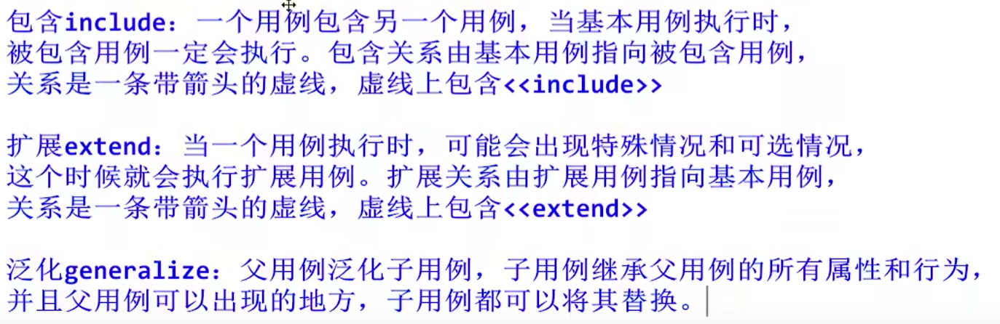

## 🍀 真题训练

### 题目

> 折叠侧边栏以呈现最佳观看效果

:::: tabs

@tab 🍐 01

> 🍐 2010 年下

阅读下列说明和 UML 图，回答问题 1 至问题 3，将解答填入答题纸的对应栏内。

==【说明】==

某网上药店允许顾客凭借医生开具的处方，通过网络在该药店购买处方上的药品。该网上药店的基本功能描述如下：

1. 注册。顾客在买药之前，必须先在网上药店注册。注册过程中需填写顾客资料以及付款方式（信用卡或者支付宝账户）。此外顾客必须与药店签订一份授权协议书，授权药店可以向其医生确认处方的真伪。
2. 登录。已经注册的顾客可以登录到网上药房购买药品。如果是没有注册的顾客，系统将拒绝其登录。
3. 录入及提交处方。登录成功后，顾客按照“处方录入界面”显示的信息，填写开具处方的医生的信息以及处方上的药品信息。填写完成后，提交该处方。
4. 验证处方。对于已经提交的处方（系统将其状态设置为“处方已提交”），其验证过程为：  
    1. 核实医生信息。如果医生信息不正确，该处方的状态被设置为“医生信息无效”，并取消这个处方的购买请求；如果医生信息是正确的，系统给该医生发送处方确认请求，并将处方状态修改为“审核中”。  
    2. 如果医生回复处方无效，系统取消处方，并将处方状态设置为“无效处方”。如果医生没有在 7 天内给出确认答复，系统也会取消处方，并将处方状态设置为“无法审核”。  
    3. 如果医生在 7 天内给出了确认答复，该处方的状态被修改为“准许付款”。系统取消所有未通过验证的处方，并自动发送一封电子邮件给顾客，通知顾客处方被取消以及取消的原因。
5. 对于通过验证的处方，系统自动计算药品的价格并邮寄药品给己经付款的顾客。

该网上药店采用面向对象方法开发，使用 UML 进行建模。系统的类图如图 3-1 所示。

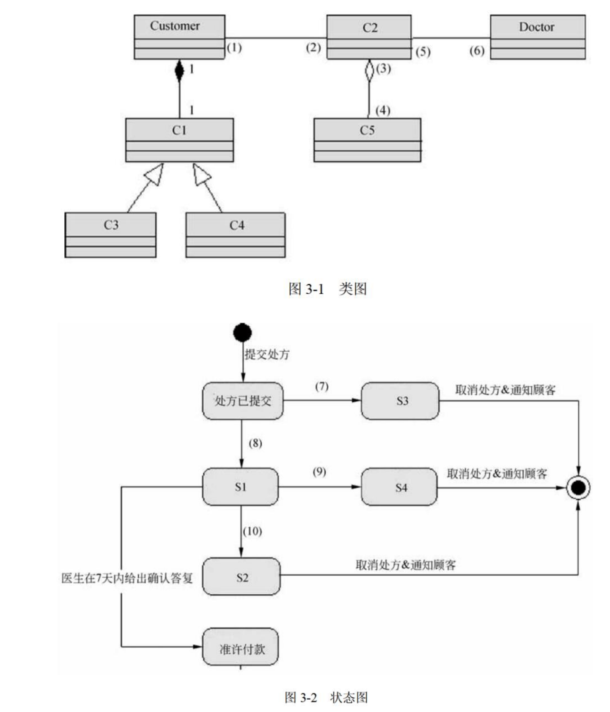

==【问题 1】==（8 分）

根据说明中的描述，给出图 3-1 中缺少的 C1〜C5 所对应的类名以及1. 〜6. 处所
对应的多重度。

==【问题 2】==（4 分）

图 3-2 给出了“处方”的部分状态图。根据说明中的描述，给出图 3-2 中缺少的 S1〜
S4 所对应的状态名以及（7）〜（10）处所对应的迁移（transition）名。

==【问题 3】==（3 分）

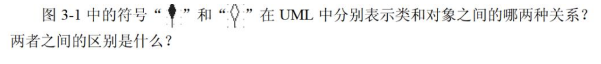

@tab 🍐 02

> 🍐 2012 年上

阅读下列说明和 UML 图，回答问题 1 至问题 3，将解答填入答题纸的对应栏内。

==【说明】==

某网上购物平台的主要功能如下：

1. 创建订单。顾客（Customer）在线创建订单（Order），主要操作是向订单中添加项目、从订单中删除项目。订单中应列出所订购的商品（Product）及其数量（quantities）。
2. 提交订单。订单通过网络来提交。在提交订单时，顾客需要提供其姓名（name）、收货地址（address）、以及付款方式（form of payment）（预付卡、信用卡或者现金）。为了制定送货计划以及安排送货车辆，系统必须确定订单量（volume）。除此之外，还必须记录每种商品的名称（name）、造价（cost price）、售价（sale price）以及单件商品的包装体积（cubic volume）。
3. 处理订单。订单处理人员接收来自系统的订单；根据订单内容，安排配货，制定送货计划。在送货计划中不仅要指明发货日期（delivery date），还要记录每个订单的限时发送要求（Delivery Time Window）。
4. 派单。订单处理人员将己配好货的订单转交给派送人员。
5. 送货／收货。派送人员将货物送到顾客指定的收货地址。当顾客收货时，需要在运货单（delivery slip）上签收。签收后的运货单最终需交还给订单处理人员。
6. 收货确认。当订单处理人员收到签收过的运货单后，会和顾客进行一次再确认。

现采用面向对象方法开发上述系统，得到如图 3-1 所示的用例图和图 3-2 所示的类图。

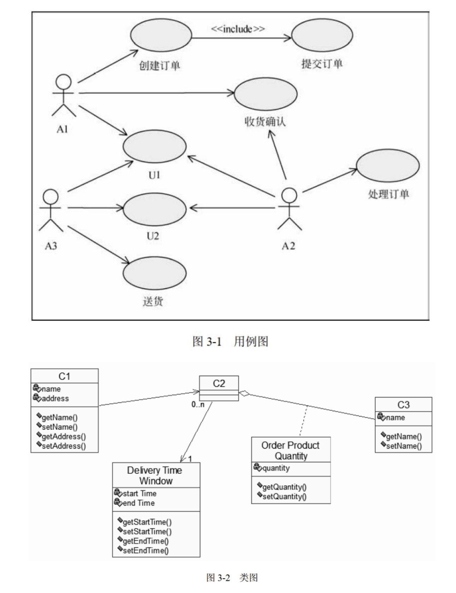

==【问题 1】==（5 分）

根据说明中的描述，给出图 3-1 中 A1〜A3 所对应的参与者名称和 U1〜U2 处所对应
的用例名称。

==【问题 2】==（7 分）

根据说明中的描述，给出图 3-2 中 C1〜C3 所对应的类名以及1. 〜4. 处所对应的
多重度（类名使用说明中给出的英文词汇）。

==【问题 3】==（3 分）

根据说明中的描述，将类 C2 和 C3 的属性补充完整（属性名使用说明中给出的英文词
汇）。

@tab 🍐 03

> 🍐 2012 年下

阅读下列说明和 UML 图，回答问题 1 至问题 3，将解答填入答题纸的对应栏内。

==【说明】==

某城市的各国家公园周边建造了许多供游客租用的小木屋和营地，为此，该城市设置了一个中心售票处和若干个区域售票处。游客若想租用小木屋或营地，必须前往中心售票处进行预定并用现金支付全额费用。所有的预定操作全部由售票处的工作人员手工完成。现欲开发一信息系统，实现小木屋和营地的预定及管理功能，以取代手工操作。该系统的主要功能描述如下：

1. 管理预定申请。游客可以前往任何一个售票处提出预定申请。系统对来自各个售票处的预定申请进行统一管理。
2. 预定。预定操作包含登记游客预定信息、计算租赁费用、付费等步骤。
3. 支付管理。游客付费时可以选择现金和信用卡付款两种方式。使用信用卡支付可以享受 3%的折扣，现金支付没有折扣。
4. 游客取消预定。预定成功之后，游客可以在任何时间取消预定，但需支付赔偿金，剩余部分则退还给游客。赔偿金的计算规则是，在预定入住时间之前的 48 小时内取消，支付租赁费用 10%的赔偿金；在预定入住时间之后取消，则支付租赁费用 50%的赔偿金。
5. 自动取消预定。如果遇到恶劣天气（如暴雨、山洪等），系统会自动取消所有的预定，发布取消预定消息，全额退款。
6. 信息查询。售票处工作人员查询小木屋和营地的预定情况和使用情况，以判断是否能够批准游客的预定申请。

现采用面向对象方法开发上述系统，得到如表 3-1 所示的用例列表和表 3-2 所示的类列
表。对应的用例图和类图分别如图 3-1 和 3-2 所示。

==【问题 1】==（6 分）

根据说明中的描述与表 3-1，给出图 3-1 中 UC1〜UC6 处所对应的用例名称。

==【问题 2】==（7 分）

根据说明中的描述与表 3-2，给出图 3-2 中 C1〜C7 处所对应的类名。

==【问题 3】==（2 分）

对于某些需求量非常大的小木屋或营地，说明中功能 4 的赔偿金计算规则，不足以弥补取消预定所带来的损失。如果要根据预定的时段以及所预定场地的需求量，设计不同层次的赔偿金计算规则，需要对图 3-2 进行怎样的修改？（请用文字说明）

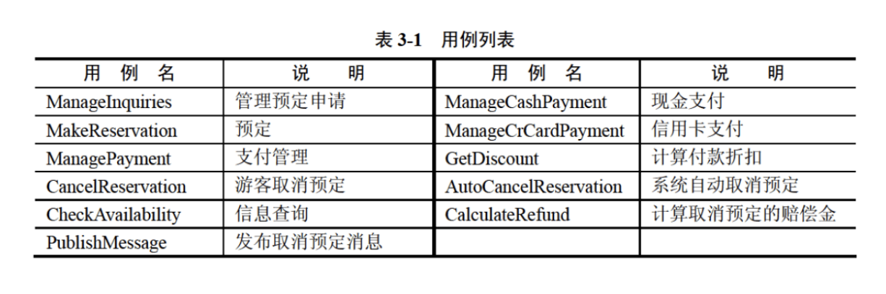

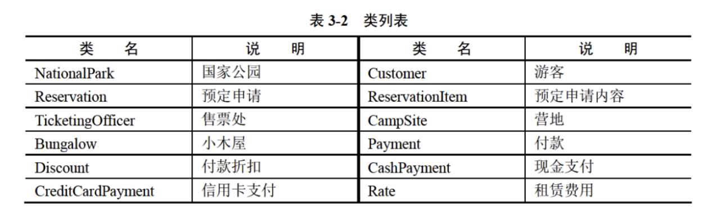

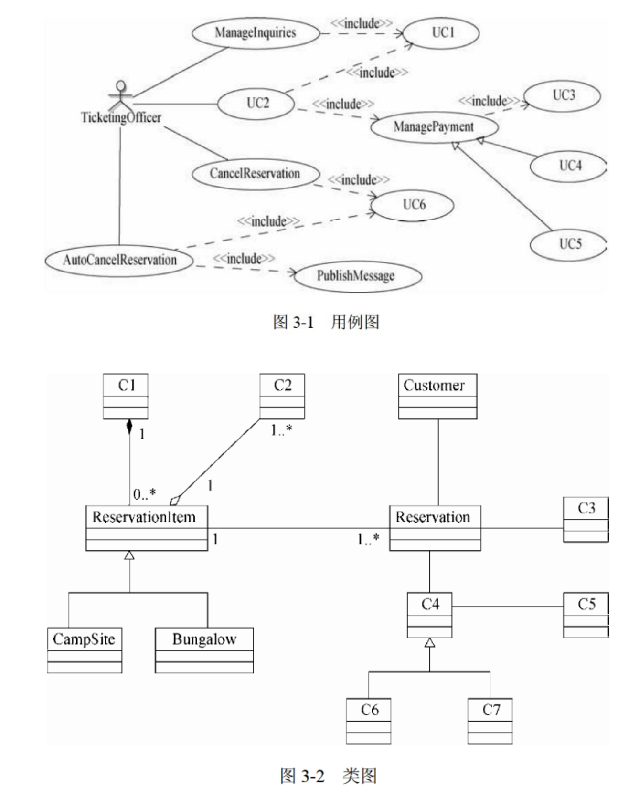

@tab 🍐 04

> 🍐 2013 年上

阅读下列说明和 UML 图，回答问题 1 至问题 3，将解答填入答题纸的对应栏内。

==【说明】==

某城市拟开发一个基于 Web 城市黄页，公开发布该城市重要的组织或机构（以下统称为客户）的基本信息，方便城市生活。该系统的主要功能描述如下：
1. 搜索信息：任何使用 Internert 的网络用户都可以搜索发布在城市黄页中的信息，例如客户的名称、地址、联系电话等。
2. 认证：客户若想在城市黄页上发布信息，需通过系统的认证。认证成功后，该客户成为系统授权用户。
3. 更新信息：授权用户登录系统后，可以更改自己在城市黄页中的相关信息，例如变更联系电话等。
4. 删除客户：对于拒绝继续在城市黄页上发布信息的客户，由系统管理员删除该客户的相关信息。

系统采用面向对象方法进行开发，在开发过程中认定出如表 3-1 所示的类。系统的用例图和类图分别如图 3-1 和图 3-2 所示。

==【问题 1】==（5 分） 

根据说明中的描述，给出图 3-1 中 A1 和 A2 处所对应的参与者，UC1 和 UC2 所对应 的用例以及 （1） 处的关系。 

==【问题 2】==（7 分） 

根据说明中的描述，给出图 3-2 中 C1〜C5 所对应的类名（表 3-1 中给出的类名）和 （2） 〜（5） 处所对应的多重度。 

==【问题 3】==（3 分） 

认定类是面向对象分析中非常关键的一个步骤。一般首先从问题域中得到候选类集合，在根据相应的原则从该集合中删除不作为类的，剩余的就是从问题域中认定出来的类。简要说明选择候选类的原则，以及对候选类集合进行删除的原则。

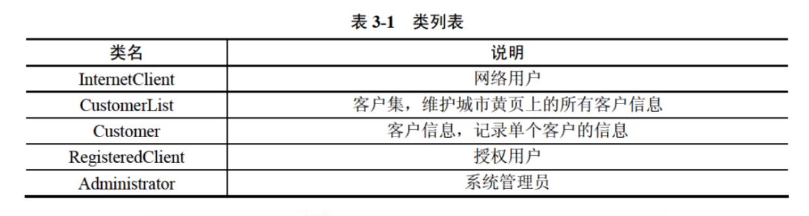

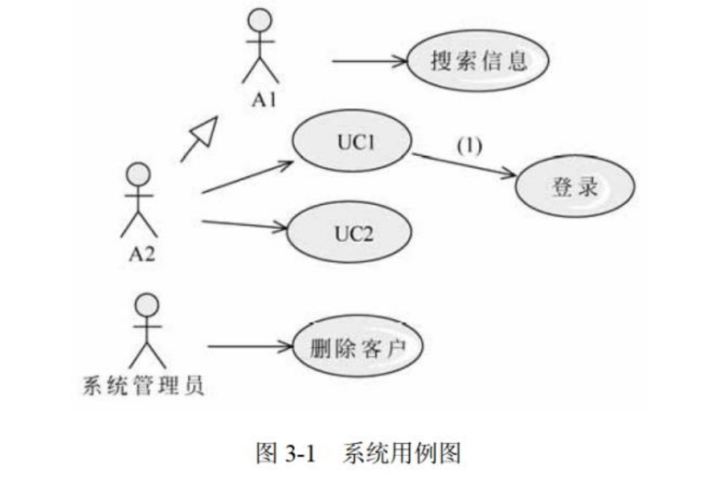

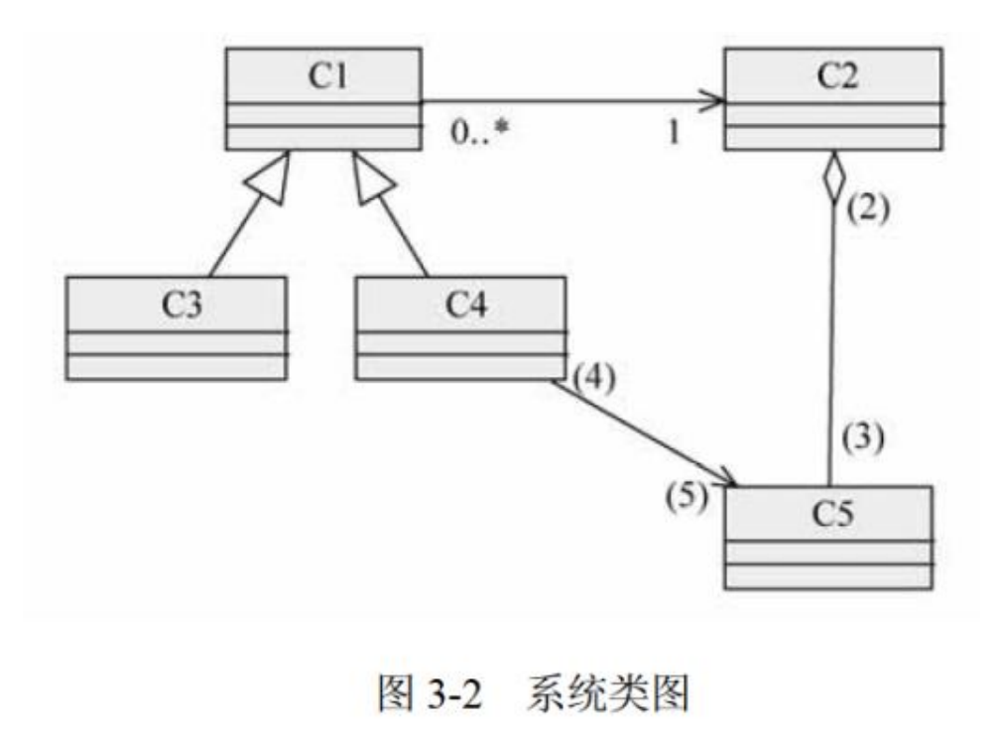

@tab 🍐 05

> 🍐 2013 年下

阅读下列说明和 UML 图，回答问题 1 至问题 3，将解答填入答题纸的对应栏内。

==【说明】==

某航空公司会员积分系统（CFrequentFlyer）的主要功能描述如下：

1. 乘客只要办理该航空公司的会员卡，即可成为普卡会员（CBasice）。随着飞行里程数的积累，可以从普卡会员升级到银卡会员（CSilver）或金卡会员（CGold）。非会员（CNonMember）不能累积里程数。
2. 每年年末，系统根据会员在本年度累积的里程数对下一年会员等级进行调整。
3. 普卡会员在一年内累积的里程数若满 25,000 英里但不足 50,000 英里，则自动升级为银卡会员；若累积的里程数在 50,000 英里以上，则自动升级为金卡会员。银卡会员在一年内累积的里程数若在 50,000 英里以上，则自动升级为金卡会员。
4. 若一年内没有达到对应级别要求的里程数，则自动降低会员等级。金卡会员一年内累积的里程数若不足 25,000 英里，则自动降级为普卡会员；若累积的里程数达到 25,000英里，但是不足 50,000 英里，则自动降级为银卡会员。银卡会员一年内累积的里程数若不足 25,000 英里，则自动降级为普卡会员。

采用面向对象方法对会员积分系统进行分析与设计，得到如图 3-1 所示的状态图和图3-2 所示的类图。

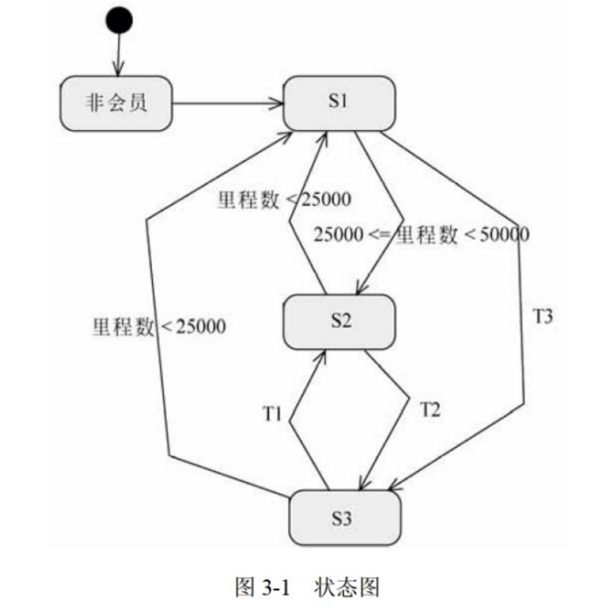

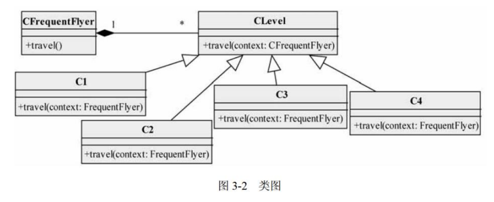

==【问题 1】==（6 分）

根据说明中的描述，给出图 3-1 中 S1〜S3 处所对应的状态以及 T1〜T3 处所对应的迁移的名称。

==【问题 2】==（4 分）

根据说明中的描述，给出图 3-2 中 C1〜C4 所对应的类名（类名使用说明中给出的英文词汇）。

==【问题 3】==（5 分）

图 3-2 所示的类图中使用了哪种 **设计模式**  ？在这种**设计 模式**下，类 CFrequentFlyer 必须具有的属性是什么？C1〜C4 中的 travel 方法应具有什么功能？

@tab 🍐 06

> 🍐 2014 年上

阅读下列说明和 UML 图，回答问题 1 至问题 3，将解答填入答题纸的对应栏内。

==【说明】==

某高校图书馆欲建设一个图书馆管理系统，目前已经完成了需求分析阶段的工作。功能需求均使用用例进行描述，其中用例“借书（Check Out Books）”的详细描述如下。

- 参与者：读者（Patron）。
- 典型事件流：
  1. 输入读者 ID；
  2. 确认该读者能够借阅图书，并记录读者 ID；
  3. 输入所要借阅的图书 ID；
  4. 根据图书目录中的图书 ID 确认该书可以借阅，计算归还时间，生成借阅记录；
  5. 通知读者图书归还时间。

重复步骤 3〜5，直到读者结束借阅图书。
- 备选事件流：  
  2a. 若读者不能借阅图书，说明读者违反了图书馆的借书制度（例如，没有支付借书费
  用等）  
      ① 告知读者不能借阅，并说明拒绝借阅的原因；  
      ② 本用例结束。  
  4a．读者要借阅的书无法外借  
      ① 告知读者本书无法借阅；  
      ② 回到步骤 3。 

说明：图书的归还时间与读者的身份有关。如果读者是教师，图书可以借阅一年；如果是学生，则只能借阅 3 个月。读者 ID 中包含读者身份信息。

现采用面向对象方法开发该系统，得到如图 3-1 所示的系统类模型（部分）；以及如图3-2 所示的系统操作“checkOut(bookID)（借书）”通信图（或协作图）。

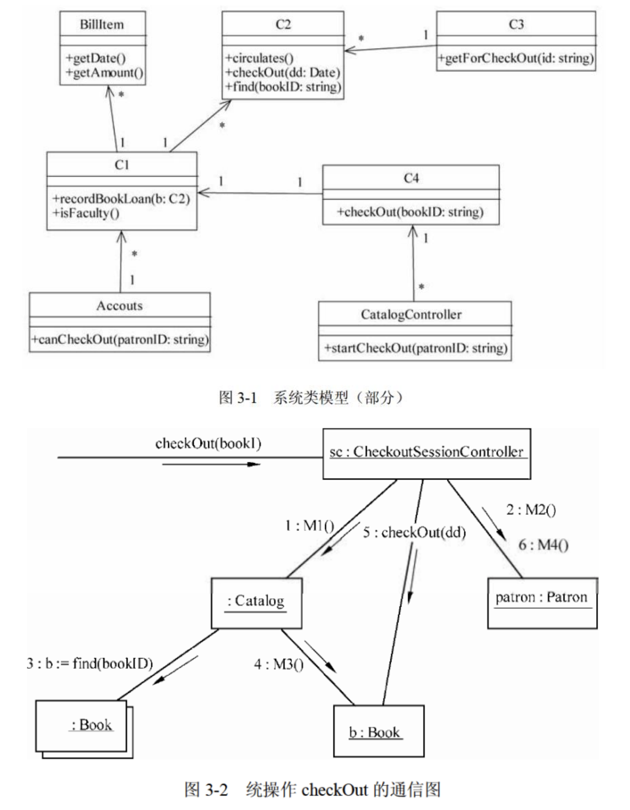

==【问题 1】==（8 分）

根据说明中的描述，以及图 3-1 和图 3-2，给出图 3-1 中 C1〜C4 处所对应的类名（类名使用图 3-1 和图 3-2 中给出的英文词汇）。

==【问题 2】==（4 分）

根据说明中的描述，以及图 3-1 和图 3-2，给出图 3-2 中 M1〜M4 处所对应的方法名（方法名使用图 3-1 和图 3-2 中给出的英文词汇）。

==【问题 3】==（3 分）

用例“借书”的备选事件流 4a 中，根据借书制度来判定读者能否借阅图书。若图书馆的借书制度会不断地扩充，并需要根据图书馆的实际运行情况来调整具体使用哪些制度。为满足这一要求，在原有类设计的基础上，可以采用何种 **设计模式** ？简要说明原因。

@tab 🍐 07

> 🍐 2014 年下

阅读下列说明和 UML 图，回答问题 1 至问题 3，将解答填入答题纸的对应栏内。

==【说明】==

某公司欲开发一个管理选民信息的软件系统。系统的基本需求描述如下：
1. 每个人（Person）可以是一个合法选民（Eligible）或者无效的选民(Ineligible)。
2. 每个合法选民必须通过该系统对其投票所在区域（即选区，Riding）进行注册
（Registration）。每个合法选民仅能注册一个选区。
1. 选民所属选区由其居住地址（Address）决定。假设每个人只有一个地址，地址可
以是镇（Town）或者城市（City）。
1. 某些选区可能包含多个镇；而某些较大的城市也可能包含多个选区。现采用面向
对象方法对该系统进行分析与设计，得到如图 3-1 所示的初始类图。

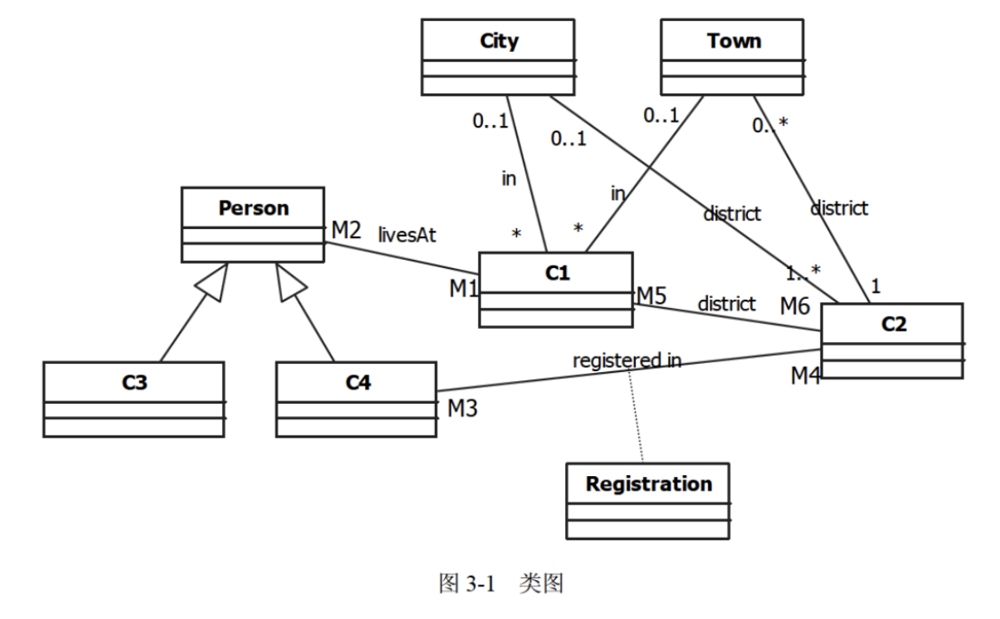

==【问题 1】==（8 分）

根据说明中的描述，给出图 3-1 中 C1〜C4 所对应的类名（类名使用说明中给出的英文词汇）。

==【问题 2】==（3 分）

根据说明中的描述，给出图 3-1 中 M1〜M6 处的多重度。

==【问题 3】==（4 分）

现对该系统提出了以下新需求：
1. 某些人拥有在多个选区投票的权利，因此需要注册多个选区；
2. 对于满足 （1） 的选民，需要划定其“主要居住地”，以确定他们应该在哪个选区进行投票。
为了满足上述需求，需要对图 3-1 所示的类图进行哪些修改？请用 100 字以内文字说
明。

@tab 🍐 08

> 🍐 2015 年上

阅读下列说明和 UML 图，回答问题 1 至问题 3，将解答填入答题纸的对应栏内。

==【说明】==

某物品拍卖网站为参与者提供物品拍卖平台，组织拍卖过程，提供在线或线下交易服务。

网站主要功能描述如下：
1. 拍卖参与者分为个人参与者和团体参与者两种。不同的团体也可以组成新的团体参与拍卖活动。网站记录每个参与者的名称。
2. 一次拍卖中，参与者或者是买方，或者是卖方。
3. 一次拍卖只拍出来自一个卖方的一件拍卖品；多个买方可以出价：卖方接受其中一个出价作为成交价，拍卖过程结束。
4. 在拍卖结算阶段，买卖双方可以选择两种成交方式：线下成交，买卖双方在事先约定好的成交地点，当面完成物价款的支付和拍卖品的交付；在线成交，买方通过网上支付平台支付物价款，拍卖品由卖方通过快递邮寄给买方。

一次拍卖过程的基本事件流描述如下：
1. 卖方在网站上发起一次拍卖，并设置本次拍卖的起拍价。
2. 确定拍卖标的以及拍卖标的保留价（若在拍卖时间结束时，所有出价均低于拍卖标的保留价，则本次拍卖失败）。
3. 在网站上发布本次拍卖品的介绍。
4. 买方参与拍卖，给出竞拍价。
5. 卖方选择接受一个竞拍价作为成交价，结束拍卖。
6. 系统记录拍卖成交价，进入拍卖结算阶段。
7. 卖方和买方协商拍卖品成交方式，并完成成交。

现采用面向对象方法对系统进行分析与设计，得到如表 3-1 所示的类列表以及如图 3-1
所示的类图，类中关键属性与方法如表 3-2 所示。

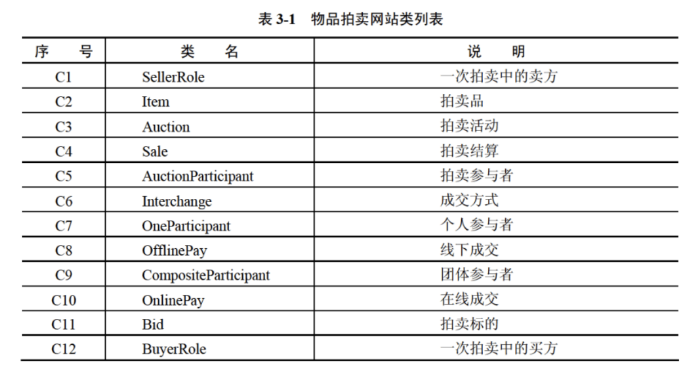

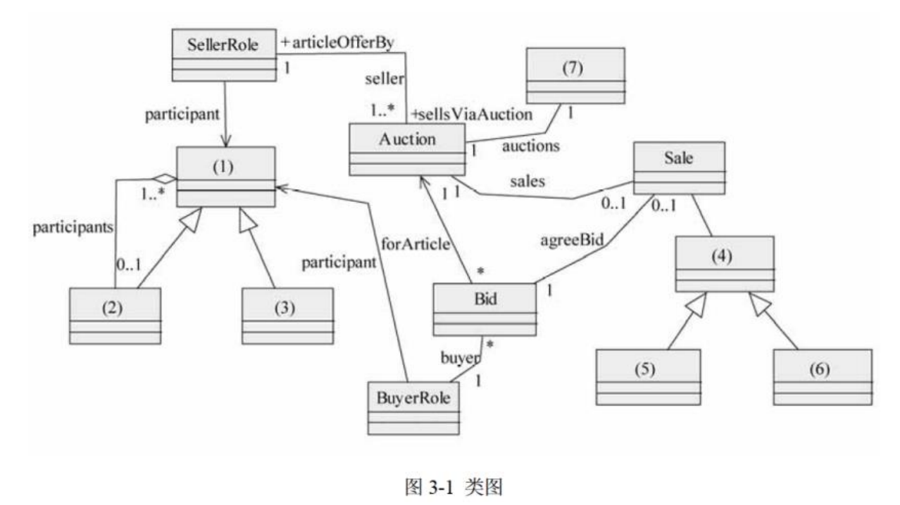

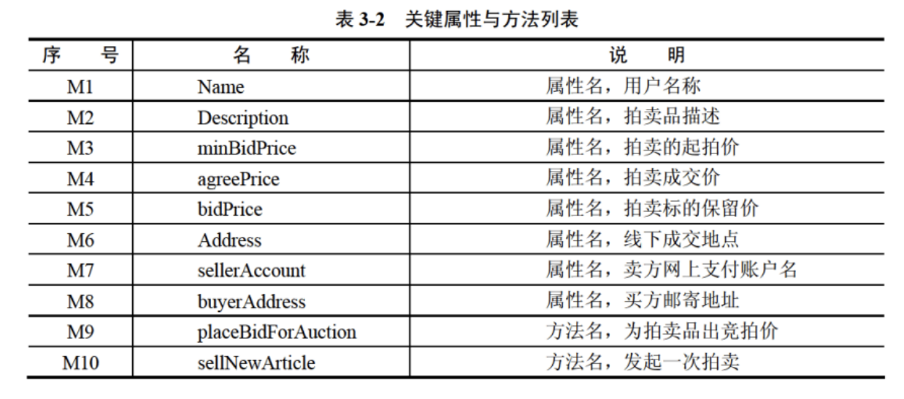

==【问题 1】==（7 分）

根据说明中的描述，给出图 3-1 中 （1）〜（7）所对应的类名（类名使用表 3-1 中给出的序号）。

==【问题 2】==（5 分）

根据说明中的描述，确定表 3-2 中的属性／方法分别属于哪个类（类名、方法／属性名使用表 3-1、3-2 中给出的序号）。

==【问题 3】==（3 分）

在图 3-1 采用了何种 **设计模式** ？以 100 字以内文字说明采用这种 **设计模式** 的原因。

@tab 🍐 09

> 🍐 2015 年下

阅读下列说明和 UML 图，回答问题 1 至问题 3，将解答填入答题纸的对应栏内。

==【说明】==

某出版社拟开发一个在线销售各种学术出版物的网上商店（ACShop），其主要的功能需求描述如下：
1. ACShop 在线销售的学术出版物包括论文、学术报告或讲座资料等。
2. ACShop 的客户分为两种：未注册客户和注册客户。
3. 未注册客户可以浏览或检索出版物，将出版物添加到购物车中。未注册客户进行注册操作之后，成为 ACShop 注册客户。
4. 注册客户登录之后，可将待购买的出版物添加到购物车中，并进行结账操作。结账操作的具体流程描述如下：  
    - ① 从预先填写的地址列表中选择一个作为本次交易的收货地址。如果没有地址信息，则可以添加新地址。  
    - ② 选择付款方式。ACShop 支持信用卡付款和银行转账两种方式。注册客户可以从预先填写的信用卡或银行账号中选择一个付款。若没有付款方式信息，则可以添加新付款方式。  
    - ③ 确认提交购物车中待购买的出版物后，ACShop 会自动生成与之相对应的订单。  
5. 管理员负责维护在线销售的出版物目录，包括添加新出版物或者更新在售出版物
信息等操作。

现采用面向对象方法分析并设计该网上商店 ACShop，得到如图 3-1 所示的用例图和图3-2 所示的类图

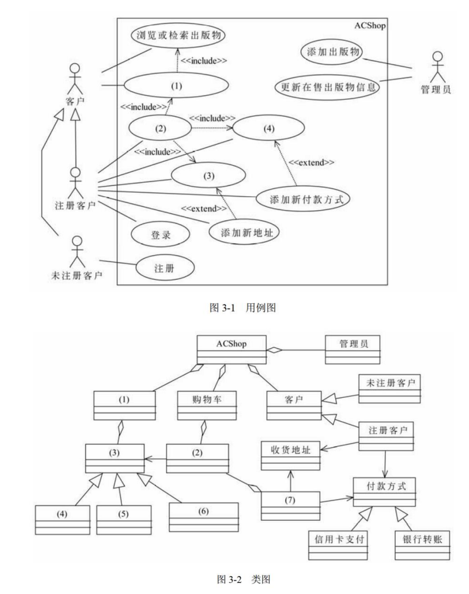

==【问题 1】==（4 分）

根据说明中的描述，给出图 3-1 中 （1）〜（4） 所对应的用例名。

==【问题 2】==（4 分）

根据说明中的描述，分别说明用例“添加新地址”和“添加新付款方式”会在何种情况下由图 3-1 中的用例 （3） 和 （4） 扩展而来？

==【问题 3】==（7 分）

根据说明中的描述，给出图 3-2 中 （1）〜（7）所对应的类名。

@tab 🍐 10

> 🍐 2016 年上

阅读下列说明和 UML 图，回答问题 1 至问题 3，将解答填入答题纸的对应栏内。

==【说明】==

某软件公司欲设计实现一个虚拟世界仿真系统。系统中的虚拟世界用于模拟现实世界中的不同环境（由用户设置并创建），用户通过操作仿真系统中的 1〜2 个机器人来探索虚拟世界。机器人维护着两个变量 b1 和 b2，用来保存从虚拟世界中读取的字符。

该系统的主要功能描述如下：
1. 机器人探索虚拟世界（Run Robots）。用户使用编辑器（Editor）编写文件以设置想要模拟的环境，将文件导入系统（Load File）从而在仿真系统中建立虚拟世界（SetupWorld）。机器人在虚拟世界中的行为也在文件中进行定义，建立机器人的探索行为程序（Setup Program）。机器人在虚拟世界中探索时（Run Program），有 2 种运行模式：   
   - ① 自动控制（Run）：事先编排好机器人的动作序列（指令（Instruction）），执行指令，使机器人可以连续动作。若干条指令构成机器人的指令集（Instruction Set）。  
   - ② 单步控制（Step）：自动控制方式的一种特殊形式，只执行指定指令中的一个动作。  
2. 手动控制机器人（Manipulate Robots）。选定 1 个机器人后（Select Robot），可以采用手动方式控制它。手动控制有 4 种方式：
   - ① Move：机器人朝着正前方移动一个交叉点。
   - ② Left：机器人原地沿逆时针方向旋转 90 度。
   - ③ Read：机器人读取其所在位置的字符，并将这个字符的值赋给 b1；如果这个位置上没有字符，则不改变 b1 的当前值。
   - ④ Write：将 b1 中的字符写入机器人当前所在的位置，如果这个位置上已经有字符，该字符的值将会被 b1 的值替代。如果这时 b1 没有值，即在执行 Write 动作之前没有执行过任何 Read 动作，那么需要提示用户相应的错误信息（Show Errors）。

手动控制与单步控制的区别在于，单步控制时执行的是指令中的动作，只有一种控制方式，即执行下一个动作；而手动控制时有 4 种动作。

现采用面向对象方法设计并实现该仿真系统，得到如图 3-1 所示的用例图和图 3-2 所示的初始类图。图 3-2 中的类“Interpreter”和“Parser”用于解析描述虚拟世界的文件以及机器人行为文件中的指令集。

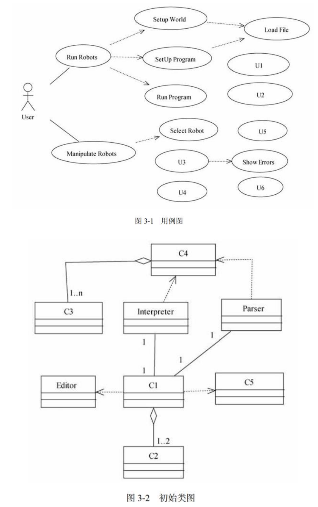

==【问题 1】==（6 分）

根据说明中的描述，给出图 3-1 中 U1〜U6 所对应的用例名。

==【问题 2】==（4 分）

图 3-1 中用例 U1〜U6 分别与哪个（哪些）用例之间有关系，是何种关系？

==【问题 3】==（5 分）

根据说明中的描述，给出图 3-2 中 C1〜C5 所对应的类名。

@tab 🍐 11

> 🍐 2016 年下

阅读下列说明和 UML 图，回答问题 1 至问题 3，将解答填入答题纸的对应栏内。

==【说明】==

某种出售罐装饮料的自动售货机（Vending Machine）的工作过程描述如下：

1. 顾客选择所需购买的饮料及数量。
2. 顾客从投币口向自动售货机中投入硬币（该自动售货机只接收硬币）。硬币器收集投入的硬币并计算其对应的价值。如果所投入的硬币足够购买所需数量的这种饮料且饮料数量足够，则推出饮料，计算找零，顾客取走饮料和找回的硬币；如果投入的硬币不够或者所选购的饮料数量不足，则提示用户继续投入硬币或重新选择饮料及数量。
3. 一次购买结束之后，将硬币器中的硬币移走（清空硬币器），等待下一次交易。自动售货机还设有一个退币按钮，用于退还顾客所投入的硬币。已经成功购买饮料的钱
是不会被退回的。

现采用面向对象方法分析和设计该自动售货机的软件系统，得到如图 3-1 所示的用例图，其中，用例“购买饮料”的用例规约描述如下。
- 参与者：顾客。
- 主要事件流：
  1. 顾客选择需要购买的饮料和数量，投入硬币；
  2. 自动售货机检查顾客是否投入足够的硬币；
  3. 自动售货机检查饮料储存仓中所选购的饮料是否足够；
  4. 自动售货机推出饮料；
  5. 自动售货机返回找零。
- 备选事件流：
  - 2a．若投入的硬币不足，则给出提示并退回到 1；
  - 3a．若所选购的饮料数量不足，则给出提示并退回到 1。

根据用例 “购买饮料” 得到自动售货机的 4 个状态：“空闲” 状态、“准备服务” 状态、“可购买” 状态以及 “饮料出售” 状态，对应的状态图如图 3-2 所示。

所设计的类图如图 3-3 所示。

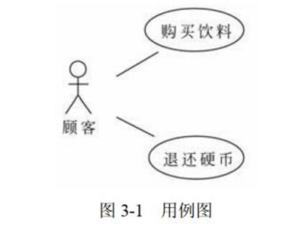

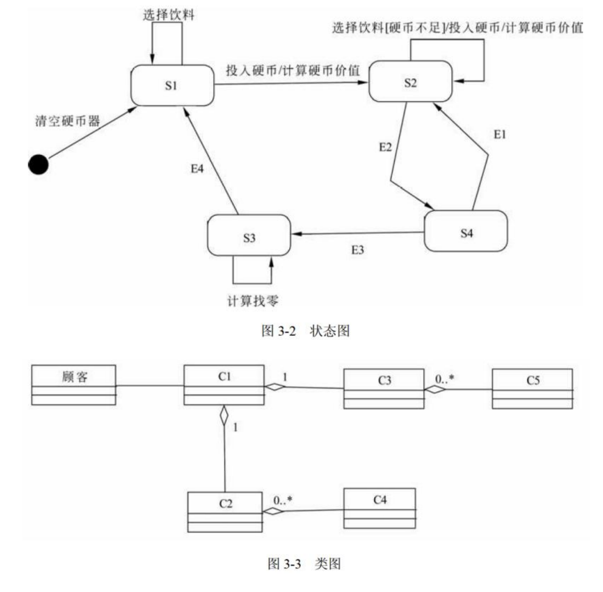

==【问题 1】==（6 分）

根据说明中的描述，使用说明中的术语，给出图 3-2 中的 S1〜S4 所对应的状态名。

==【问题 2】==（4 分）

根据说明中的描述，使用说明中的术语，给出图 3-2 中的 E1〜E4 所对应的事件名称。

==【问题 3】==（5 分）

根据说明中的描述，使用说明中的术语，给出图 3-3 中 C1〜C5 所对应的类名。

@tab 🍐 12 ✅

> 🍐 2017 年上

阅读下列说明和 UML 图，回答问题 1 至问题 3，将解答填入答题纸的对应栏内。

==【说明】==

某玩具公司正在开发一套电动玩具在线销售系统，用于向注册会员提供端对端的玩具定制和销售服务。在系统设计阶段，“创建新订单（New-Order）”的设计用例详细描述如表 3-1 所示，候选设计类分类如表 3-2 所示，并根据该用例设计出部分类图如图 3-1 所示。

在订单处理的过程中，会员可以点击“取消订单”取消该订单。如果支付失败，该订单将被标记为挂起状态，可后续重新支付，如果挂起超时 30 分钟未支付，系统将自动取消该订单。订单支付成功后，系统判断订单类型：

1. 对于常规订单，标记为备货状态，订单信息发送到货运部，完成打包后交付快递发货；
2. 对于定制订单，会自动进入定制状态，定制完成后交付快递发货。会员在系统中点击“收货”按钮变为收货状态，结束整个订单的处理流程。根据订单处理过程所设计的状态图如图 3-2 所示。

==【问题 1】==（6 分）

根据表 3-1 中所标记的候选设计类，请按照其类别将编号 C1〜C12 分别填入表 3-2 中
的（a）、（b）和（c）处。

==【问题 2】==（4 分）

根据创建新订单的用例描述，请给出图 3-1 中 X1〜X4 处对应类的名称。

==【问题 3】==（5 分）

根据订单处理过程的描述，在图 3-2 中 S1〜S5 处分别填入对应的状态名称。

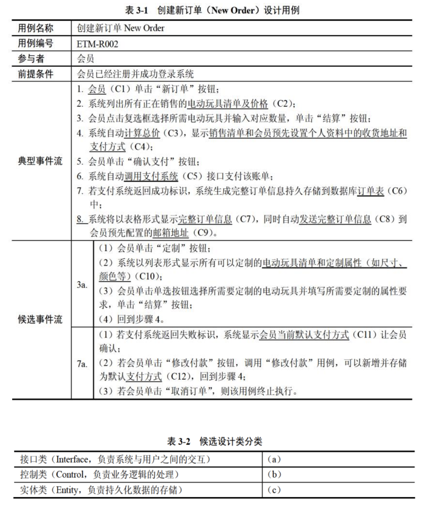

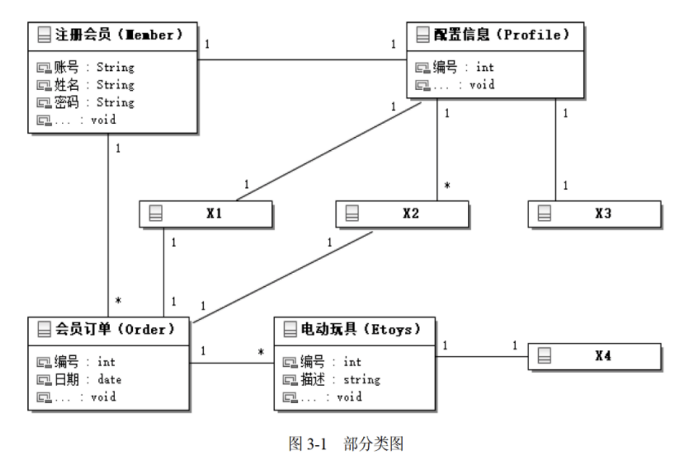

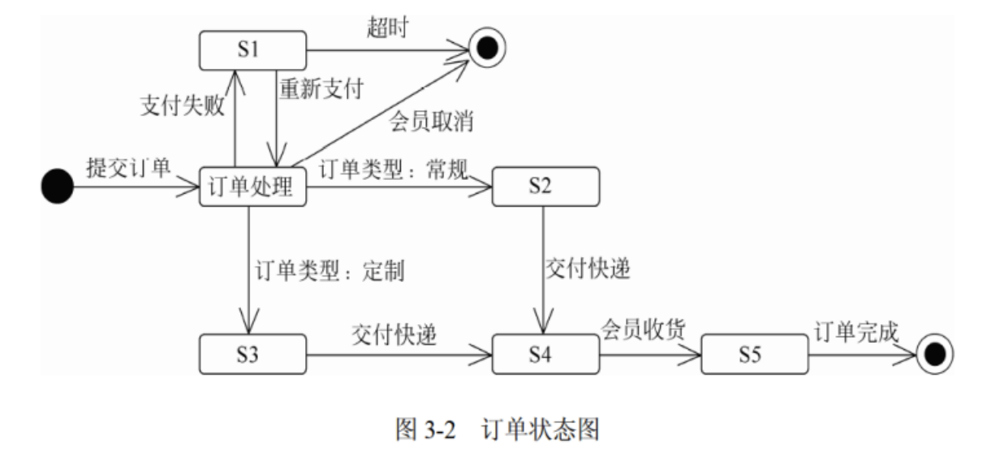

@tab 🍐 13 ✅

> 🍐 2017 年下

阅读下列说明和 UML 图，回答问题 1 至问题 3，将解答填入答题纸的对应栏内。

==【说明】==

某大学拟开发一个用于管理学术出版物（**Publication**）的数字图书馆系统，用户可以从该系统查询或下载已发表的学术出版物。系统的主要功能如下：

1. 登录系统。系统的用户（**User**）仅限于该大学的学生（**Student**）、教师（**Faculty**）和其他工作人员（**Staff**）。在访问系统之前，用户必须使用其校园账户和密码登录系统。
2. 查询某位作者（**Author**）的所有出版物。系统中保存了会议文章（**ConfPaper**）、期刊文章（**JournalArticle**）和校内技术报告（**TechReport**）等学术出版物的信息，如题目、作者以及出版年份等。除此之外，系统还存储了不同类型出版物的一些特有信息：
   1. 对于会议文章，系统还记录了会议名称、召开时间以及召开地点；
   2. 对于期刊文章，系统还记录了期刊名称、出版月份、期号以及主办单位；
   3. 对于校内技术报告，系统记录了由学校分配的唯一 ID。
3. 查询指定会议集（**Proceedings**）或某个期刊特定期（**Edition**）的所有文章。会议集包含了发表在该会议（在某个特定时间段、特定地点召开）上的所有文章。期刊的每一期在特定时间发行，其中包含若干篇文章。
4. 下载出版物。系统记录每个出版物被下载的次数。
5. 查询引用了某篇出版物的所有出版物。在学术出版物中引用他人或早期的文献作为相关工作或背景资料是很常见的现象。用户也可以在系统中为某篇出版物注册引用通知，若有新的出版物引用了该出版物，系统将发送电子邮件通知该用户。

现在采用面向对象方法对该系统进行开发，得到系统的初始设计类图如图 3-1 所示。

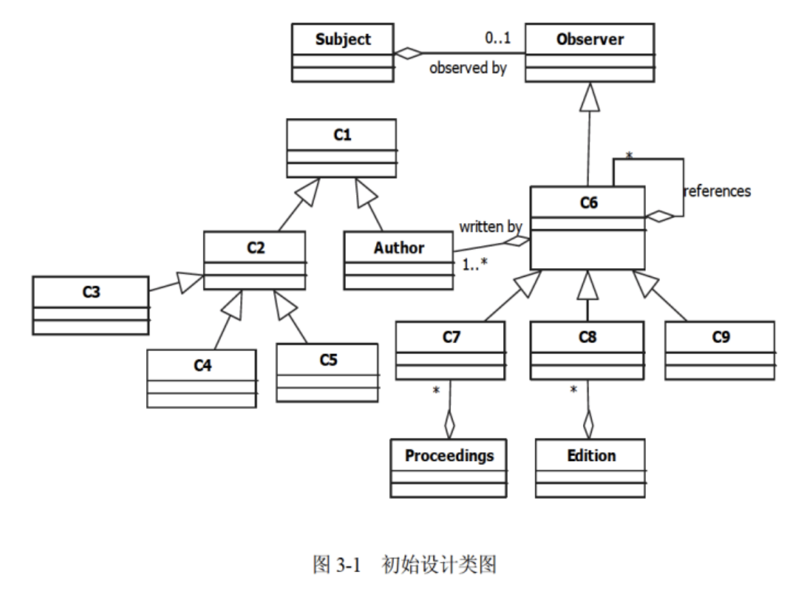

==【问题 1】==（9 分）

根据说明中的描述，给出图 3-1 中 C1〜C9 所对应的类名。

==【问题 2】==（4 分）

根据说明中的描述，给出图 3-1 中类 C6〜C9 的属性。

==【问题 3】==（2 分）

图 3-1 中包含了哪种 **设计模式** ？实现的是该系统的哪个功能？

@tab 🍐 14 ✅

> 🍐 2018 年上

阅读下列说明和 UML 图，回答问题 1 至问题 3，将解答填入答题纸的对应栏内。

==【说明】==

某 ETC（Electronic Toll Collection，不停车收费）系统在高速公路沿线的特定位置上设置一个横跨道路上空的龙门架（Toll gantry），龙门架下包括 6 条车道（Traffic lanes），每条车道上安装有雷达传感器（Radar sensor）、无线传输器（Radio transceiver）和数码相机（Digital Camera）等用于不停车收费的设备，以完成正常行驶速度下的收费工作。该系统的基本工作过程如下：

1. 每辆汽车上安装有车载器，驾驶员（**Driver**）将一张具有唯一识别码的磁卡插入车载器中。磁卡中还包含有驾驶员账户的当前信用记录。
2. 当汽车通过某条车道时，不停车收费设备识别车载器内的特有编码，判断车型，将收集到的相关信息发送到该路段所属的区域系统（**Regional center**）中，计算通行费用，创建收费交易（*Transaction*），从驾驶员的专用账户中扣除通行费用。如果驾驶员账户透支，则记录透支账户交易信息。区域系统再将交易后的账户信息发送到维护驾驶员账户信息的中心系统（**Central system**）。
3. 车载器中的磁卡可以使用邮局的付款机进行充值。充值信息会传送至中心系统，以更新驾驶员账户的余额。
4. 当没有安装车载器或者车载器发生故障的车辆通过车道时，车道上的数码相机将对车辆进行拍照，并将车辆照片及拍摄时间发送到区域系统，记录失败的交易信息；并将该交易信息发送到中心系统。
5. 区域系统会获取不停车收费设备所记录的交通事件（*Traffic events*）；交通广播电台（**Traffic advice center**）根据这些交通事件进行路况分析并播报路况。

现采用面向对象方法对上述系统进行分析与设计，得到如表 3-1 所示的用例列表以及如
图 3-1 所示的用例图和图 3-2 所示的分析类图。

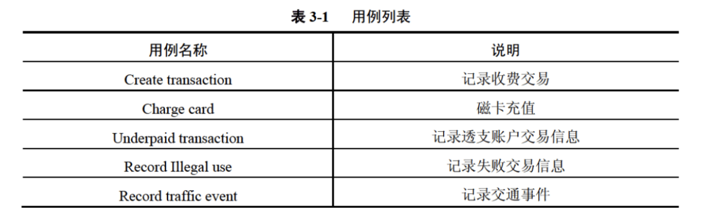

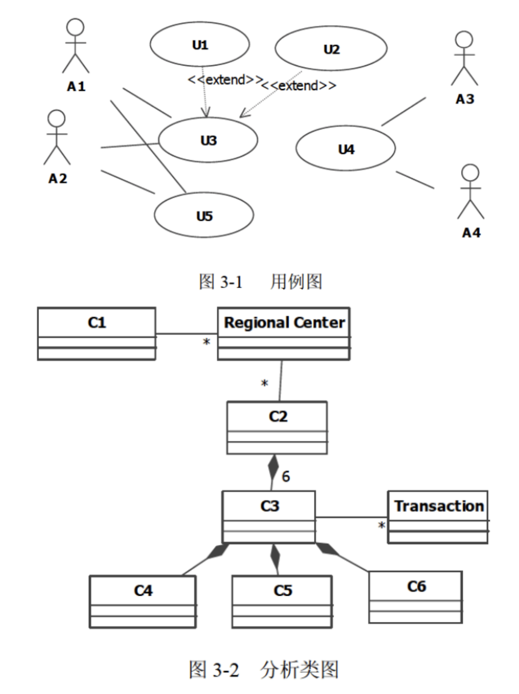

==【问题 1】==（4 分）

根据说明中的描述，给出图 3-1 中 A1〜A4 所对应的参与者名称。

==【问题 2】==（5 分）

根据说明中的描述及表 3-1，给出图 3-1 中 U1〜U5 所对应的用例名称。

==【问题 3】==（6 分）

根据说明中的描述，给出图 3-2 中 C1〜C6 所对应的类名。

@tab 🍐 15 ✅

> 🍐 2018 年下

阅读下列说明和 UML 图，回答问题 1 至问题 3，将解答填入答题纸的对应栏内。

==【说明】==

1. 社交网络平台（SNS）的主要功能之一是建立在线群组，群组中的成员之间可以互相分享或挖掘兴趣和活动。每个群组包含标题、管理员以及成员列表等信息。
2. 社交网络平台的用户可以自行选择加入某个群组。每个群组拥有一个主页，群组内的所有成员都可以查看主页上的内容。如果在群组的主页上发布或更新了信息，群组中的成员会自动接收到发布或更新后的信息。
3. 用户可以加入一个群组也可以退出这个群组。用户退出群组后，不会再接收到该群组发布或更新的任何信息。

现采用面向对象方法对上述需求进行分析与设计，得到如表 3-1 所示的类列表和如图3-1 所示的类图。

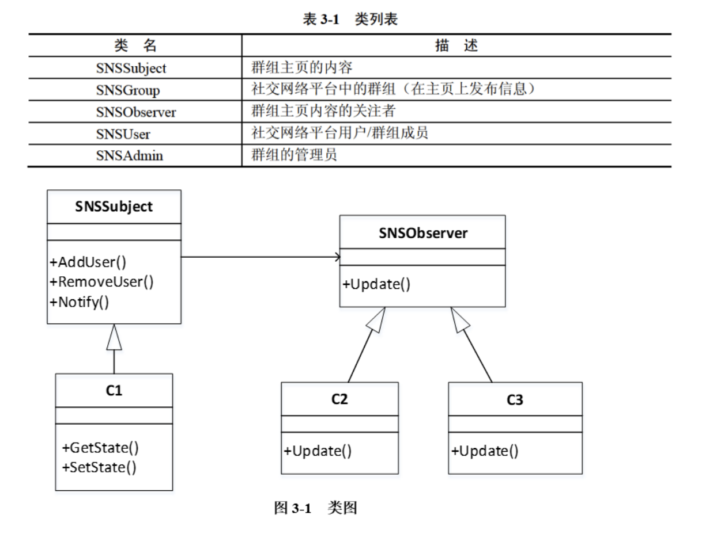

==【问题 1】==（6 分）

根据说明中的描述，给出图 3-1 中 C1〜C3 所对应的类名。

==【问题 2】==（6 分）

图 3-1 中采用了哪一种 **设计模式** ？说明该模式的意图及其适用场合。

==【问题 3】==（3 分）

现在对上述社交网络平台提出了新的需求：一个群体可以作为另外一个群体中的成员，例如群体 A 加入群体 B。那么，群体 A 中的所有成员就自动成为群体 B 中的成员。若要实现这个新需求，需要对图 3-1 进行哪些修改? （以文字方式描述）

@tab 🍐 16 ✅

> 🍐 2019 年上

阅读下列说明和 UML 图，回答问题 1 至问题 3，将解答填入答题纸的对应栏内。

==【说明】==

某图书公司欲开发一个基于 Web 的书籍销售系统，为顾客（**Customer**）提供在线购买书籍（**Books**）的功能，同时对公司书籍的库存及销售情况进行管理。系统的主要功能描述如下：

1. 首次使用系统时，顾客需要在系统中注册（*Register detail*）。顾客填写注册信息表要求的信息，包括姓名（name）、收货地址（address）、电子邮箱（email）等，系统将为其生成一个注册码。
2. 注册成功的顾客可以登录系统在线购买书籍（*Buy books*）。购买时可以浏览书籍信息，包括书名（title）、作者（author）、内容简介（introduction）等。如果某种书籍的库存量为 0，那么顾客无法查询到该书籍的信息。顾客选择所需购买的书籍及购买数量（quantities），若购买数量超过库存量，提示库存不足；若购买数量小于库存量，系统将显示验证界面，要求顾客输入注册码。注册码验证正确后，自动生成订单（**Order**），否则，提示验证码错误。如果顾客需要，可以选择打印订单（*Print order*）。
3. 派送人员（**Dispatcher**）每天早晨从系统中获取当日的派送列表信息（*Produce picklist*），按照收货地址派送顾客订购的书籍。
4. 用于销售的书籍由公司的采购人员（**Buyer**）进行采购（*Reorder books*）。采购人员每天从系统中获取库存量低于再次订购量的书籍信息，对这些书籍进行再次购买，以保证充足的库存量。新书籍到货时，采购人员向在线销售目录（**Catalog**）中添加新的书籍信息（*Add books*）。
5. 采购人员根据书籍的销售情况，对销量较低的书籍设置折扣或促销活动（*Promotebooks*）。
6. 当新书籍到货时，仓库管理员（**Warehouseman**）接收书籍，更新库存（*Updatestock*）。

现采用面向对象方法开发书籍销售系统，得到如图 3-1 所示的用例图和图 3-2 所示的初
始类图（部分）。

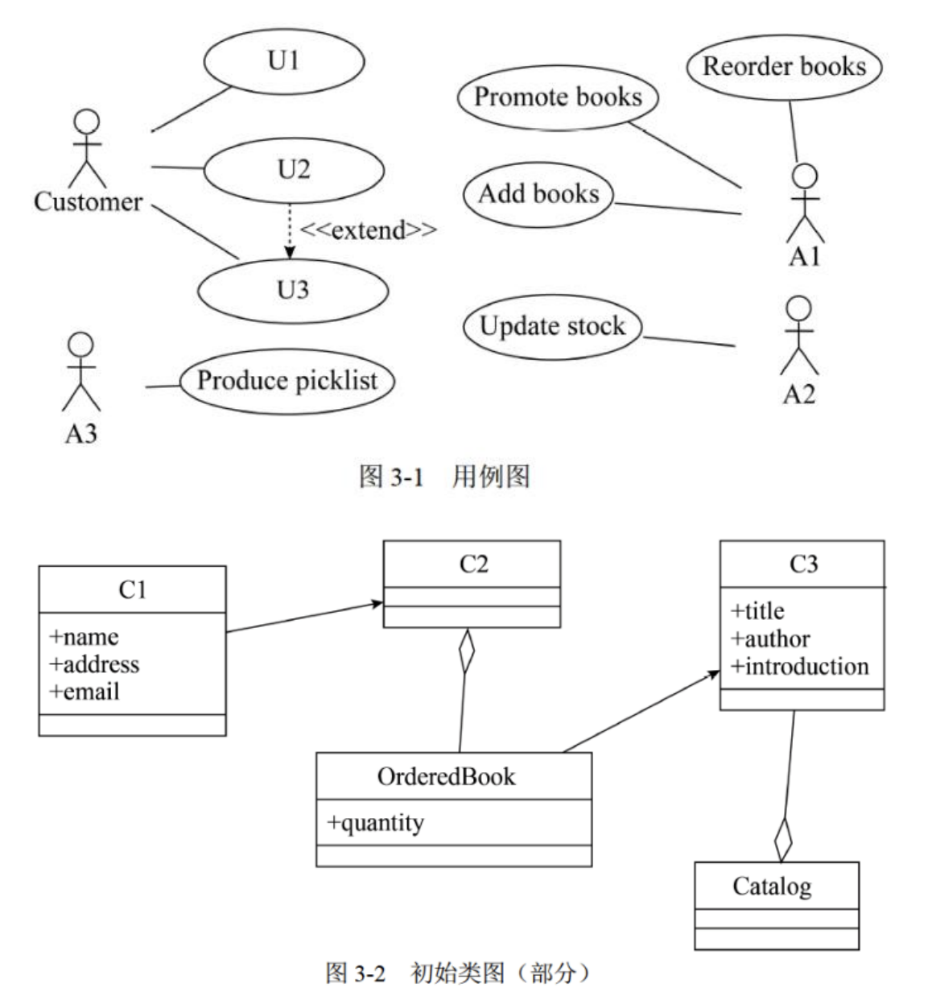

==【问题 1】==（6 分）

根据说明中的描述，给出图 3-1 中 A1〜A3 所对应的参与者名称和 U1〜U3 处所对应的用例名称。

==【问题 2】==（6 分）

根据说明中的描述，给出图 3-1 中用例 U3 的用例描述。（用例描述中必须包括基本事件流和所有的备选事件流）。

==【问题 3】==（3 分）

根据说明中的描述，给出图 3-2 中 C1〜C3 所对应的类名。

@tab 🍐 17 ✅

> 🍐 2019 年下

阅读下列说明和 UML 图，回答问题 1 至问题 3，将解答填入答题纸的对应栏内。

==【说明】==

某牙科诊所拟开发一套信息系统，用于管理病人的基本信息和就诊信息。诊所工作人员包括：医护人员（**DentalStaff**）、接待员（**Receptionist**）和办公人员（**OfficeStaff**）等。系统主要功能需求描述如下：

1. ~~记录病人基本信息~~（*Maintain patient info*）。初次就诊的病人，由接待员将病人基本信息录入系统。病人基本信息包括病人姓名、身份证号、出生日期、性别、首次就诊时间和最后一次就诊时间等。每位病人与其医保信息（**MedicalInsurance**）关联。
2. ~~记录就诊信息~~（*Record office visit info*）。病人在诊所的每一次就诊，由接待员将就诊信息（**Office Visit**）录入系统。就诊信息包括就诊时间、就诊费用、支付代码、病人支付费用和医保支付费用等。
3. 记录治疗信息（*Record dental procedure*）。病人在就诊时，可能需要接受多项治疗，每项治疗（**Procedure**）可能由多位医护人员为其服务。治疗信息包括：治疗项目名称、治疗项目描述、治疗的牙齿和费用等。治疗信息由每位参与治疗的医护人员分别向系统中录入。
4. ~~打印发票~~（*Print invoices*）。发票（**Invoice**）由办公人员打印。发票分为两种：给医保机构的发票（**InsuranceInvoice**）和给病人的发票（**PatientInvoice**）。两种发票内容相同，只是支付的费用不同。当收到治疗费用后，办公人员在系统中更新支付状态（*Enter payment*）。
5. 记录医护人员信息（*Maintain dental staff info*）。办公人员将医护人员信息录入系统。医护人员信息包括姓名、职位、身份证号、家庭住址和联系电话等。
6. 医护人员可以查询并打印其参与的治疗项目相关信息（*Search and print procedureinfo*）。

现采用面向对象方法开发该系统，得到如图 3-1 所示的用例图和 3-2 所示的初始类图。

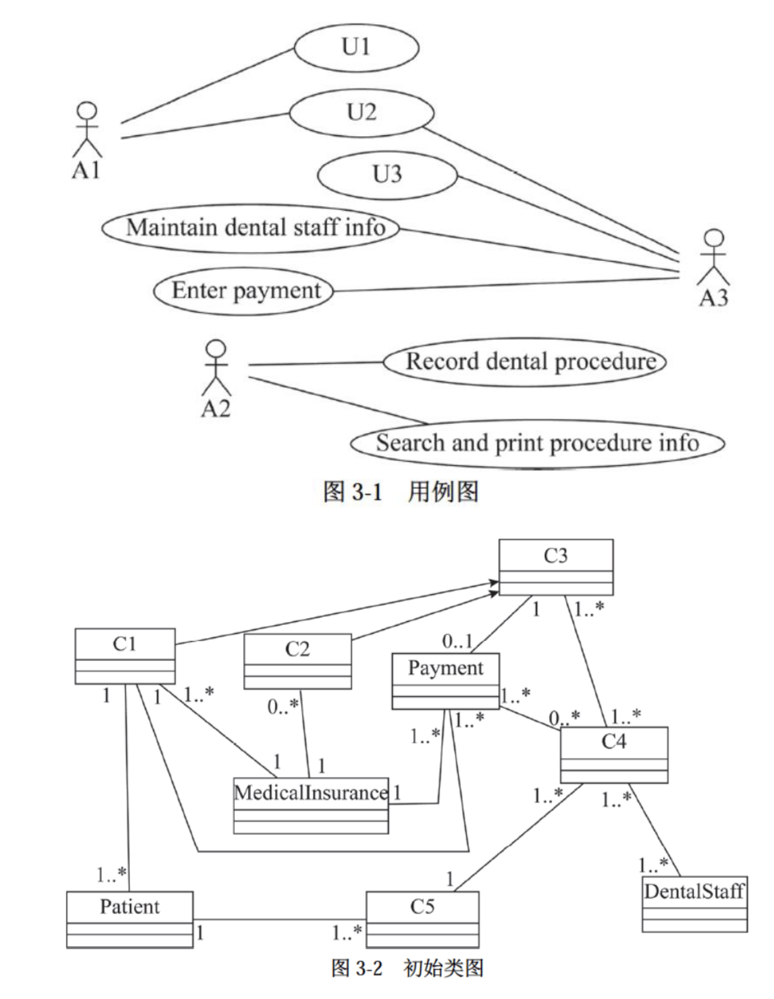

==【问题 1】==（6 分）

根据说明中的描述，给出图 3-1 中 A1〜A3 所对应的参与者名称和 U1〜U3 所对应的
用例名称。

==【问题 2】==（5 分）

根据说明中的描述，给出图 3-2 中 C1〜C5 所对应的类名。

==【问题 3】==（4 分）

根据说明中的描述，给出图 3-2 中类 C4、C5、Patient 和 DentalStaff 的必要属性。

@tab 🍐 18 ✅

> 🍐 2020 年下

阅读下列说明和 UML 图，回答问题 1 至问题 3，将解答填入答题纸的对应栏内。

==【说明】==

某房产公司欲开发一个房产信息管理系统，其主要功能描述如下：

1. 公司销售的房产（**Property**）分为住宅（**House**）和公寓（**Cando**）两类。针对每套房产，系统存储房产证明、地址、建造年份、建筑面积，销售报价、房产照片以及销售状态（在售，售出，停售）等信息。对于住宅，还需存储楼层、公摊面积、是否有地下室等信息；对于公寓，还需存储是否有阳台等信息。
2. 公司雇佣了多名房产经纪（**Agent**），负责销售房产，系统中需要存储房产经纪的基本信息，包括：姓名、家庭住址、联系电话、受雇的起止时间等。一套房产同一时段仅由一名房产经纪负责销售，系统中会记录房产经纪负责每套房产的起始时间和终止时间。
3. 系统用户（**User**）包括房产经纪和系统管理员（**Manager**），用户需经过系统身份验证之后才能登录系统。房产经纪登录系统之后，可以录入负责销售的房产信息，也可以查询所负责的房产信息。房产经纪可以修改其负责的房产信息，但需要经过系统管理员的审批授权。
4. 系统管理员可以从系统中导出所有房产的信息列表，系统管理员定期将售出和停售的房产信息进行归档，若公司确定不再销售某套房产，系统管理员将该房产信息从系统中删除。

现采用面向对象方法开发该系统，得到如图 3-1 所示的用例图和图 3-2 所示的初始类图。

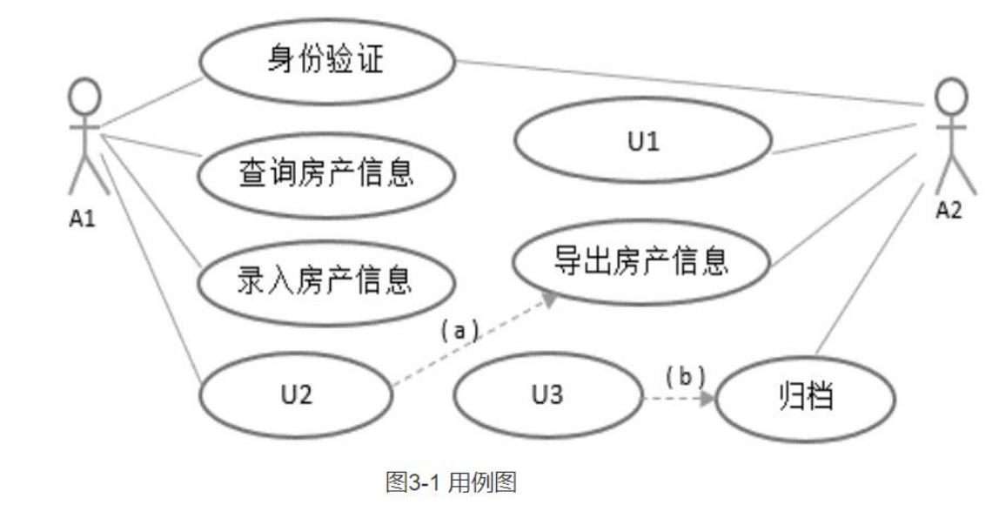

> 这里的（a）应该是指向 U1 比较合理

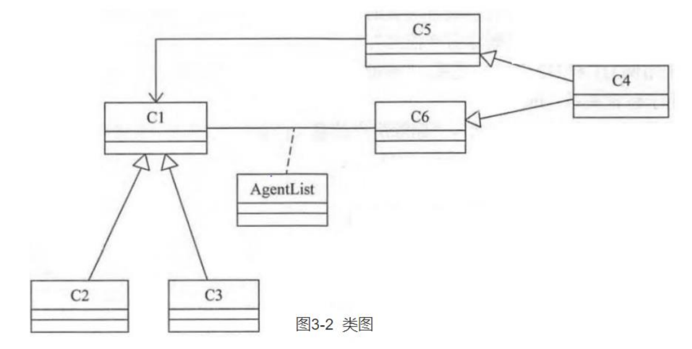

> 这里 C5 和 C6 应该是 C4 的子类，箭头反了

==【问题 1】==（7 分）

1. 根据说明中描述，分别给出图 3-1 中 A1 到 A2 所对应的参与者名称以及 U1 到 U3 所对应的用例名称。
2. 根据说明中描述，分别给图 3-1 中（a）和（b）用例之间的关系。

==【问题 2】==（6 分）

根据说明中描述，分别给图 3-2 中 C1〜C6 所对应的类名称。

==【问题 3】==（2 分）

图 3-2 中 AgentList 是一个英文名称，用来进一步阐述 C1 和 C6 之间的关系，根据说明中的描述，给出 AgentList 的主要属性。

@tab 🍐 19 ✅

> 🍐 2021 年上

阅读下列说明和 UML 图，回答问题 1 至问题 3，将解答填入答题纸的对应栏内。

==【说明】==

某中医医院拟开发一套线上抓药 APP，允许患者凭借该医院医生开具的处方线上抓药，并提供免费送药上门服务。该系统的主要功能描述如下：

1. <u>注册</u>：患者扫描医院提供的二维码进行注册，注册过程中，患者需提供其病历号，系统根据病历号自动获取患者基本信息。
2. <u>登录</u>：已注册的患者可以登录系统进行线上抓药，未册的患者系统拒绝其登陆。
3. ~~<u>确认处方</u>~~：患者登录后，可以查看医生开具的所有处方。患者选择需要抓药的处方和数量（需要抓几副药），同时说明是否需要煎制。~~选择取药方式~~：自行到店取药或者送药上门，若选择送药上门，患者需要提供提供收货人姓名、联系方式和收货地址。系统自动计算本次抓药的费用，患者可以使用~~微信或支付宝等支付方式~~支付费用。支付成功之后，处方被发送给药师进行药品配制。
4. <u>处理处方</u>：药师根据处方配置好药品。若患者要求煎制，药师对配置好的药品进行煎制。煎制完成，药师将该处方设置为已完成。若患者选择的是自行取药，取药后确认已取药。
5. <u>药品派送</u>：处方完成后，对于选择送药上门的患者，系统将给快递人员发送药品配送信息，等待快递人员取药；并给患者发送收获验证码。
6. <u>送药上门</u>：快递人员将配制好的药品送到患者指定的收获地址。患者收货时，向快递人员出示收获验证码，快递人员使用该验证码确认药品已送到。

现采用面向对象分析与设计方法开发上述系统，得到如图 3-1 所示的用例图以及图 3-2
所示的类图。

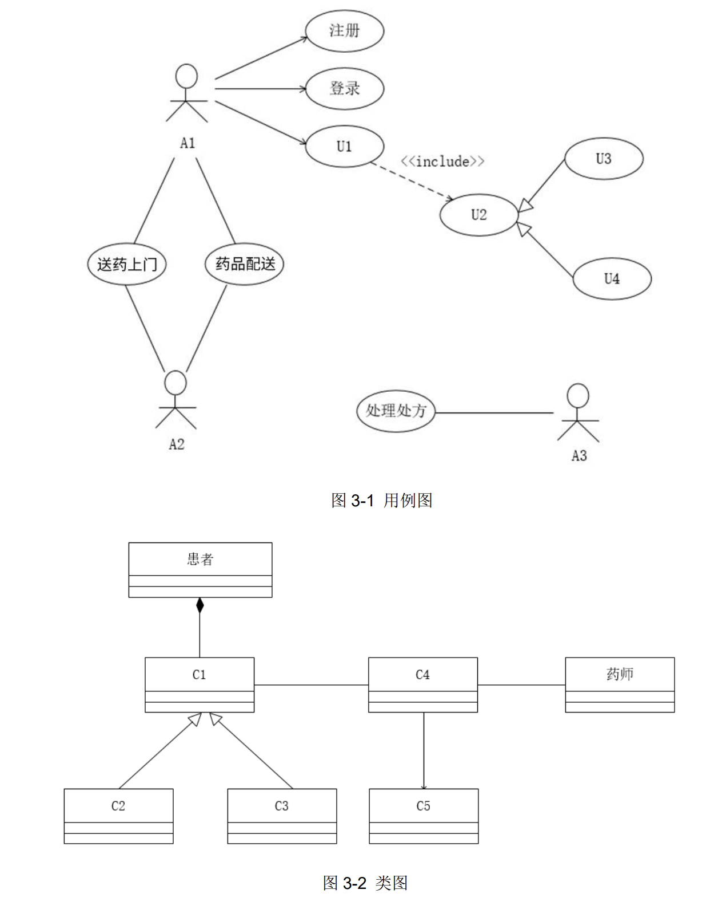

==【问题 1】==（7 分）

根据说明中的描述，给出图 3-1 中 A1〜A3 所对应的参与者名称和 U1〜U4 处所对应的用例名称。

==【问题 2】==（5 分）

根据说明中的描述，给出图 3-2 中 C1〜C5 所对应的类名。

==【问题 3】==（3 分）

简要解释用例之间的 include、extend 和 generalize 关系的内涵。

@tab 🍐 20 ✅

> 🍐 2021 年下

阅读下列说明和 UML 图，回答问题 1 至问题 3，将解答填入答题纸的对应栏内。

==【说明】==

某游戏公司欲开发一款吃金币游戏。游戏的背景为一种回廊式迷宫（**Maze**），在迷宫的不同位置上设置有墙。迷宫中有两种类型的机器人（**Robos**）：小精灵（**PacMan**）和幽灵（**Ghost**）。游戏的目的就是控制小精灵在迷宫中游走，吞吃迷宫路径上的金币，且不能被幽灵抓到。幽灵在迷宫中游走，并会吃掉遇到的小精灵。机器人游走时，以单位距离的倍数计算游走路径的长度。当迷宫中至少存在一个小精灵和一个幽灵时，游戏开始。

机器人上有两种传感器，使机器人具有一定的感知能力。这两种传感器分别是：

1. 前向传感器（**FrontSensor**）。探测在机器人当前位置的左边、右边和前方是否有墙（机器人遇到墙时，必须改变游走方向）。机器人根据前向传感器的探测结果，决定朝哪个方向运动。
2. 近距离传感器（**ProxiSensor**）。探测在机器人的视线范围内（正前方）是否存在隐藏的金币或幽灵。近距离传感器并不报告探测到的对象是否正在移动以及朝哪个方向移动。但是如果近距离传感器的连续两次探测结果表明被探测对象处于不同的位置，则可以推到出该对象在移动。

另外，每个机器人都 ~~设置有一个计时器~~（**Timer**），用于支持执行预先定义好的定时事件。

机器人的动作包括：原地向左或向右旋转 90°、向前或向后移动。

建立迷宫：用户可以使用编辑器（**Editor**）~~编写迷宫文件~~，建立用户自定义的迷宫。将 ~~迷宫文件导入~~ 游戏系统建立用户自定义的迷宫。

现采用面向对象分析与设计方法开发该游戏，得到如图 3-1 所示的用例图以及图 3-2 所
示的初始类图。

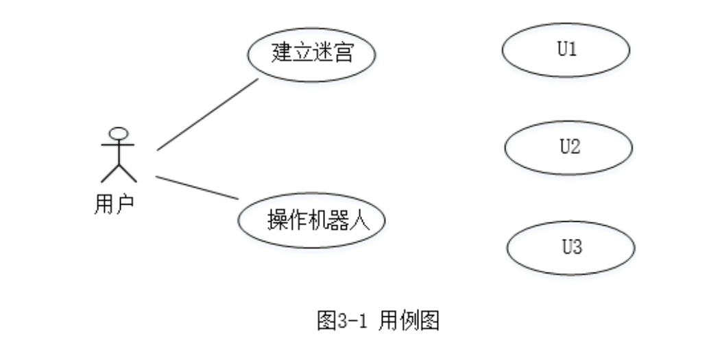

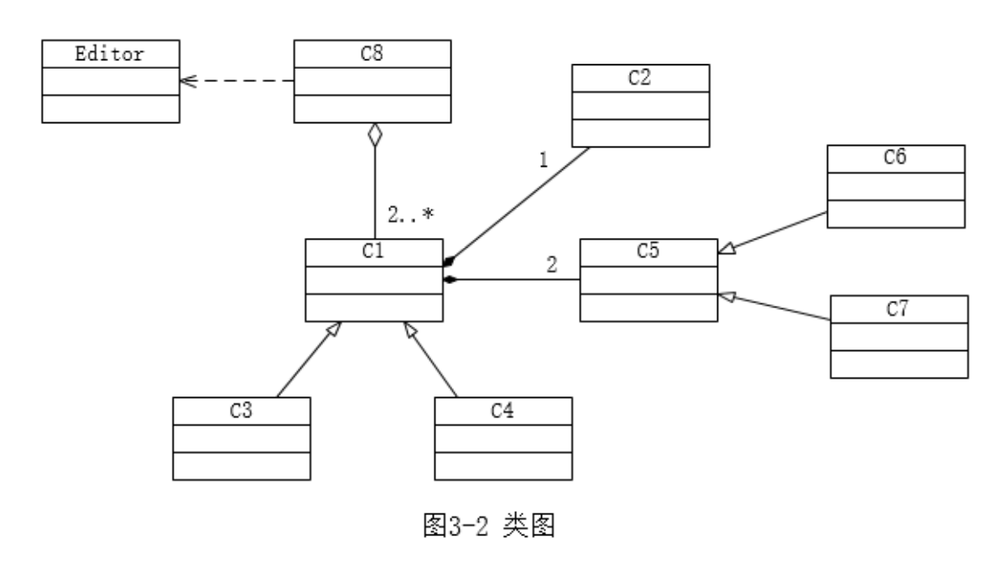

==【问题 1】==（3 分）

根据说明中的描述，给出图 3-1 中 U1〜U3 所对应的用例名。

==【问题 2】==（4 分）

图 3-1 中用例 U1〜U3 分别与哪个（哪些）用例之间有关系，是何种关系？

==【问题 3】==（8 分）

根据说明中的描述，给出图 3-2 中 C1〜C8 所对应的类名。

@tab 🍐 21 ✅

> 🍐 2022 年上

阅读下列说明和 UML 图，回答问题 1 至问题 3，将解答填入答题纸的对应栏内。

==【说明】==

某公司的人事部门拥有一个地址簿（**AddressBook**）管理系统（AddressBookSystem），用于管理公司所有员工的地址记录（**PersonAddress**）。员工的地址记录包括：姓名、住址、城市、省份、邮政编码以及联系电话等信息。

管理员可以完成对地址簿中地址记录的管理操作，包括：
1. <u>管理地址记录</u>。根据公司的人员变动情况，对地址记录进行添加、修改、删除等操作。
2. <u>排序</u>。按照员工姓氏的字典顺序或邮政编码对地址簿中的所有记录进行排序。
3. <u>打印地址记录</u>。以邮件标签的格式打印一个地址单独的地址簿。系统会对地址记录进行管理，为便于管理，管理员在系统中为公司的不同部门建立员工的地址簿的操作，包括：
   1. <u>创建地址簿</u>。新建一个地址簿并保存。
   2. <u>打开地址簿</u>。打开一个已有的地址簿。
   3. <u>修改地址簿</u>。对打开的地址簿进行修改并保存。

系统将提供一个 GUI（图形用户界面）实现对地址簿的各种操作。

现采用面向对象方法分析并设计该地址簿管理系统，得到如图 3-1 所示的用例图以及图
3-2 所示的类图。

==【问题 1】==（6 分）

根据说明中的描述，给出图 3-1 中 U1〜U6 所对应的用例名。

==【问题 2】==（5 分）

根据说明中的描述，给出图 3-2 中类 AddressBook 的主要属性和方法以及类 PersonAddress 的主要属性（可以使用说明中的文字）

==【问题 3】==（4 分）

根据说明中的描述以及图 3-1 所示的用例图，请简要说明 include 和 extend 关系的含义是什么？

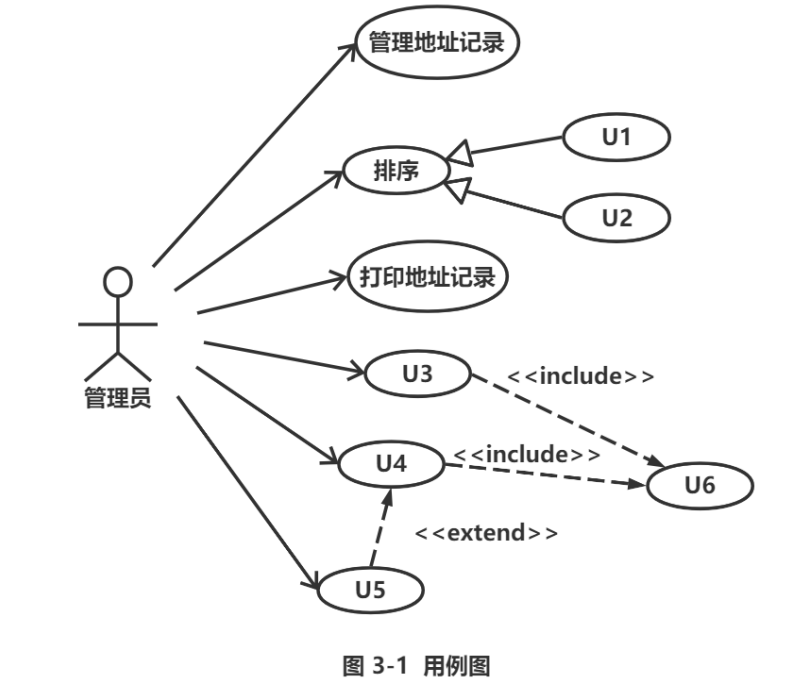

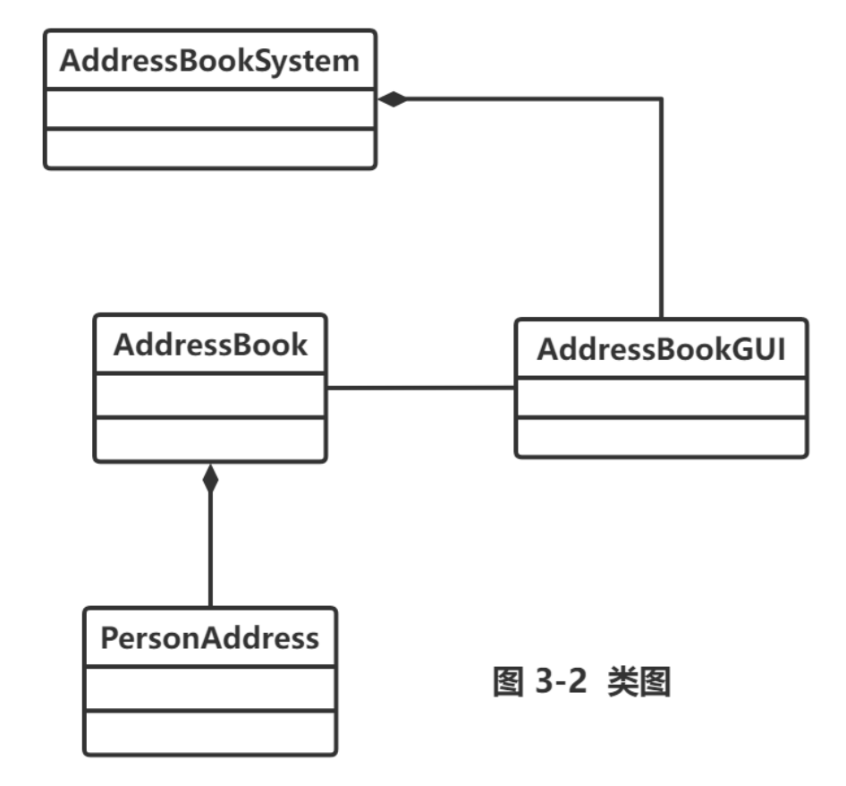

@tab 🍐 22 ✅

> 🍐 2022 年下

阅读下列说明和 UML 图，回答问题 1 至问题 3，将解答填入答题纸的对应栏内。

==【说明】==

图 3-1 所示为某软件系统中一个温度控制模块的界面。界面上提供了两种温度计量单位，即华氏度（Farechet）和摄氏度（Celsius）。软件支持两种计量单位之间的自动换算，即

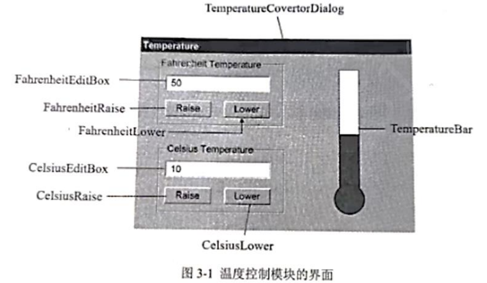

若输入一个华氏度的温度，其对应的摄氏度温度值会自动出现在摄氏度的显示框内，反之亦然。

用户可以通过该界面上的按钮 Raise（升高温度）和 Lower（降低温度）来改变温度的值。界面右侧是个温度计，将数字形式的温度转换成温度计上的制度比例进行显示。当温度值改变时，温度计的显示也随之同步变化。

现采用面向对象方法现实该温度控制模板，得到如图 3-2 所示的用例图和图 3-3 所示的类图。

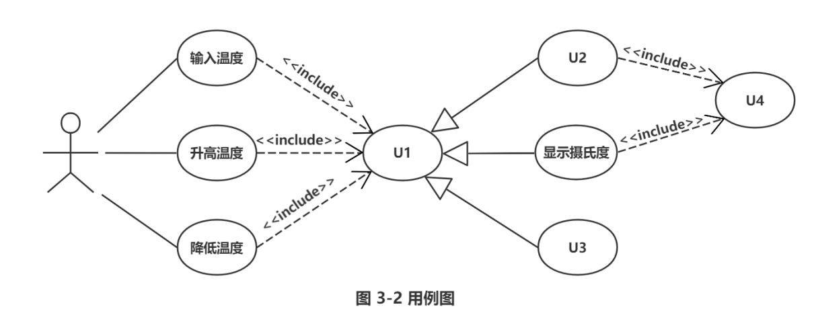

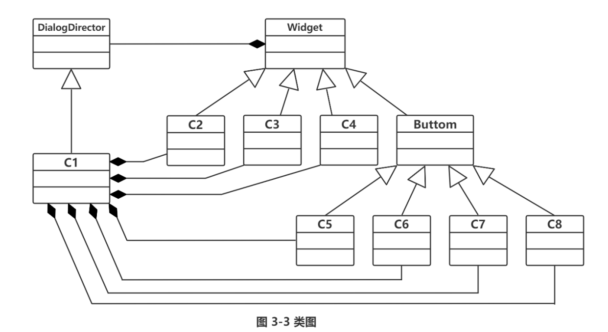

==【问题 1】==（6 分）

根据说明中的描述，给出图 3-2 中 U1〜U4 所对应的用例名。

==【问题 2】==（5 分）

根据说明中的描述，给出图 3-3 中 C1〜C8 所对应的类名（类名使用图 3-1 中标注的词汇）。

==【问题 3】==（4 分）

现需将图 3-1 所示的界面改造为一个更为通用的 GUI 应用，能够实现任意计量单位之间的换算，例如千克和克之间的换、厘米和英寸之间的换算等等。为了实现这个新的需求，可以在图 3-3 所示的类图上增加哪种 **设计模式** ？请解释选择该 **设计模式** 的原因（不超过 50字）。

@tab 🍐 23 ✅

> 🍐 2023 年上

阅读下列说明和 UML 图，回答问题 1 至问题 3，将解答填入答题纸的对应栏内。

==【说明】==

某高校图书馆购买了若干学术资源的镜像数据库（**MinorDBMino**）资源，现要求开发一套数字图书馆（**Digitallibrary**）系统，面向校内用户（**User**）提供学术资源（**Resoure**）浏览，检索和下载服务。系统的主要功能描述如下：

1. 系统中存储了每个镜像数据库的基本信息，包括：数据库名称，访问地址，数据库属性以及数据库简介等信息，用户进入某个镜像数据库后，可以浏览检索以及下载其中的学术资源。
2. 学术资源包括会议论文（**ConferencePaper**）、期刑论文（**JounalArticle**）以及学位论文（**Thesis**）等；系统中存储了每个学术资源的题名、作者、发表时间、来源（哪个镜像数据库）、被引次数、下载次数等信息。对于会议论文，还需记录会议名称，召开时间以及召开地点；同一次会议的论文被收录在会议集（**Proceeding**）中。对于期刊论文，还需记录期刊名称，出版月份，期号以及主办单位；同一期号的论文被收录在一本期刊（**Edition**）中。对于学位论文，记录了学位类别（博士/硕士），毕业学校，专业及指导教师。会议集包含发表在该会议（在某个特定时间段，特定地点召开）上的所有文章。期刊的每一期在特定时间发行，其中包含若干篇文章。
3. 系统用户（**User**）包括在校学生（**Student**），教师（**Teacher**）以及其他在职人员（**Staff**）。用户使用学校的统一身份认证登录系统后，使用系统提供的各项服务。
4. 系统提供多种资源检索的方式，主要包括：按照资源的题名检索（*SearchByTitle*），按照作者名称检索（*SearchByAuthor*），按照来源检索（*SearchBySource*）等。
5. 用户可以下载资源，系统记录每个资源被下载的次数。

现采用面向对象分析与设计方法开发该系统，得到如图 3-1 所示的用例图以及图 3-2 所示的类图。

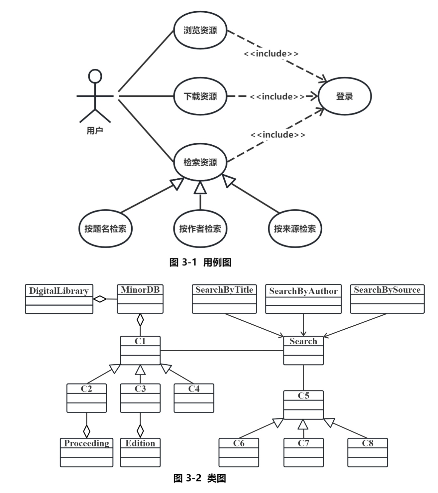

==【问题 1】==（8 分）

根据说明中的描述，给出图 3-2 中 C1~C8 对应的类名。

==【问题 2】==（4 分）

根据说明中的描述，给出图 3-2 的类 C1~C4 的关键属性。

==【问题 3】==（3 分）

在该系统的开发过程中遇到了新的要求：用户能够在系统中对其所关注的数字资源注册他引通知，若该资源的他引次数发生变化，系候可以及时通知该用户，为了实现这个新的要求，可以在图 3-2 所示的类图中增加哪种 **设计模式** ？用 150 字以内文字解释选择该模式的原因。

::::

### 解答

:::: tabs

@tab 🍐 01

==答 1：== 

<u>C1：</u>付款方式  <u>C2：</u>处方  <u>C3：</u>信用卡  
<u>C4：</u>支付宝账户  <u>C5：</u>处方上的药品（或药品）

> C3，C4 可以互换

<u>（1）</u>1  <u>（2）</u>0..\*  <u>（3）</u>1
<u>（4）</u>1..\*  <u>（5）</u>0..\*  <u>（6）</u>1

==答 2：== 

<u>S1：</u>审核中  <u>S2：</u>无法审核  <u>S3：</u>医生信息无效  <u>S4：</u>无效处方

> S2\S4 可交换

<u>（7）</u>医生信息不正确  <u>（8）</u>医生信息正确  
<u>（9）</u>医生回复处方无效  <u>（10）</u>医生没有在 7 天内给出确认答复

> (9)\(10) 可交换

==答 3：== 

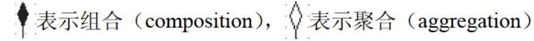

在组合关系中，整体对象与部分对象具有同一的生存周期。当整体对象不存在时，部分对象也不存在。而在聚合关系中，对整体对象与部分对象没有这样的要求。

@tab 🍐 02

==答 1：== 

<u>A1：</u>顾客  <u>A2：</u>订单处理人员  <u>A3：</u>派送人员

<u>U1：</u>收货  <u>U2：</u>派单 

==答 2：== 

<u>C1：</u>Customer  <u>C2：</u>Order  <u>C3：</u>Product  

<u>（1）</u>1  <u>（2）</u>0..n 或 0..\*  
<u>（3）</u>0..n 或 0..\*   <u>（4）</u>1..n 或 1..\* 

==答 3：== 

<u>C2</u>: volume、delivery date、form of payment 

<u>C3</u>: cubic volume、cost price、sale price

@tab 🍐 03

==答 1：== 

<u>UC1：</u>CheckAvailablity  <u>UC2：</u>MakeReservation  
<u>UC3：</u>GetDiscount  <u>UC4：</u>ManageCashPayment  
<u>UC5：</u>ManageCrCardPayment  <u>UC6：</u>CalculateRefund

> UC4 和 UC5 可以互换

==答 2：== 

<u>C1：</u>NationalPark  <u>C2：</u>Rate  
<u>C3：</u>TicketingOfficer  <u>C4：</u>Payment  
<u>C5：</u>Discount  <u>C6：</u>CashPayment  
<u>C7：</u>CreditCardPayment  

> C6 和 C7 可以互换

==答 3：== 

1：增加一个新的类，该类与类 Reservationltem 之间有关联关系。 

或 2：修改 Rate 类，使其具有计算赔偿金的功能。

@tab 🍐 04

==答 1：== 

<u>A1：</u>网络用户 或 InternetClient  
<u>A2：</u>授权用户 或 RegisteredClient  

<u>UC1：</u>更新信息  <u>UC2：</u>认证  

<u>（1）</u>＜\<include>>

==答 2：== 

<u>C1：</u>InternetClient  <u>C2：</u>CustomerList  
<u>C3：</u>RegisteredClient  <u>C4：</u>Administrator  
<u>C5：</u>Customer  

<u>（2）</u>1  <u>（3）</u>0..\*  
<u>（4）</u>0..1  <u>（5）</u>0..1  

==答 3：== 

选择候选类时通常考虑的是问题域中自然存在的名词。 

具有下列特征的候选类需要删除：含义相近（冗余）、含义不明确的对象、暗示实现方式的、表示属性或特征、有动词含义的名词（表示行为和方法）。

@tab 🍐 05

==答 1：== 

<u>S1：</u>普卡、普卡会员  <u>S2：</u>银卡、银卡会员  <u>S3：</u>金卡、金卡会员

<u>T1：</u>25000 <= 里程数 ＜50000  <u>T2：</u>里程数 >= 50000  <u>T3：</u>里程数 >= 50000  

==答 2：== 

<u>C1：</u>CNonMember  <u>C2：</u>CBasic  <u>C3：</u>CSilver  <u>C4：</u>CGold 

==答 3：== ❓

使用了 State 模式（状态模式）。 

类 CFrequentFlyer 必须具有的属性：CLevel 的对象。 

travel 方法的功能：计算飞行里程数，根据里程数判断是否需要调整会员级别（跳转到不同的状态）。

@tab 🍐 06

==答 1：== 

<u>C1：</u>Patron  <u>C2：</u>Book  <u>C3：</u>Catalog  
<u>C4：</u>CheckoutSessionController  

==答 2：== 

<u>M1：</u>getForCheckOut  <u>M2：</u>isFaculty  
<u>M3：</u>circulates  <u>M4：</u>recordBookLoan

==答 3：== 

策略模式。策略模式定义了一系列算法，并将每个算法封装起来，而且使它们可以相互替换。策略模式让算法独立于使用它们的客户而变化。适用于需要在不同情况下使用不同的策略（算法），或者策略还可能在未来用其他方式来实现。

@tab 🍐 07

==答 1：== 

<u>C1：</u>Address  <u>C2：</u>Riding  <u>C3：</u>Ineligible  <u>C4：</u>Eligible  

==答 2：== 

<u>M1：</u>1  <u>M2：</u>\* 或 0..\*  <u>M3：</u>*  <u>M4：</u>1
<u>M5：</u>*  <u>M6：</u>1    

==答 3：== 

1. M1 处改 1..\*，在 Registration 类中增加 address 属性，指明注册时使用的是哪个地址。 
2. 增加一个类 “主要居住地”，作为类 Address 的子类；类 Person 与类 “主要居住地”之间具有关系联系，且每个人只有一个主要居住地。

@tab 🍐 08

==答 1：== 

<u>（1）</u>C5（AuctionParticipant）  <u>（2）</u>C9（CompositeParticipant）  
<u>（3）</u>C7 （OneParticipant）  <u>（4）</u>C6（Interchange）  
<u>（5）</u>C8 （OfflinePay）  <u>（6）</u> C10 （OnlinePay） 
<u>（7）</u>C2 （Item）  

==答 2：== 

| 属性/方法序号 | 所属类的序号 | 属性/方法序号 | 所属类的序号 |
| :--: | :--: | :--: | :--: |
| M1 | C5 | M6 | C8 |
| M2 | C2 | M7 | C10 |
| M3 | C3 | M8 | C10 |
| M4 | C4 | M9 | C12 |
| M5 | C11 | M10 | C1 |

==答 3：== ❓

在图 3-1 中使用了 Composite 模式。 以树形结构表示个人参与者和团体参与者之间的“部分-整体”关系，使得对单个对 象和组合对象的使用具有一致性。

@tab 🍐 09

==答 1：== 

<u>（1）</u>将（待购买）出版物添加到购物车  <u>（2）</u>结账  
<u>（3）</u>选择收货地址  <u>（4）</u>选择付款方式

==答 2：== 

“添加新地址” 的扩展条件：地址信息为空或没有地址信息。 

“添加新付款方式” 的扩展条件：付款方式信息为空或没有付款方式信息。

==答 3：== 

<u>（1）</u>目录或出版物目录  <u>（2）</u>待购买的出版物  
<u>（3）</u>出版物  <u>（4）</u>论文  <u>（5）</u> 学术报告  
<u>（6）</u>讲座资料  <u>（7）</u>订单

> 注：（4）～（6）答案次序可以互换

@tab 🍐 10

==答 1：== 

<u>U1：</u>Run  <u>U2：</u>Step  <u>U3：</u>Write  <u>U4：</u>Read  <u>U5：</u>Left  <u>U6：</u>Move

==答 2：== 

U1 ~ U2 与 Run Program 有关系：是泛化关系。 

U3 ~ U6 与 Manipulate Robots 有关系：是泛化关系

==答 3：== 

<u>C1：</u>World  <u>C2：</u>Robot/Robots  <u>C3：</u>Instruction  <u>C4：</u>InstructionSet  <u>C5：</u>Error/Errors

@tab 🍐 11

==答 1：== 

<u>S1：</u>空闲  <u>S2：</u>准备服务  <u>S3：</u>饮料出售  <u>S4：</u>可购买

==答 2：== 

<u>E1：</u>所选购的饮料数量不足  <u>E2：</u>选择饮料［硬币足够购买饮料］  <u>E3：</u>所选购的饮料数量足够/推出饮料  <u>E4：</u>取走饮料/找零并清空硬币器

==答 3：== 

<u>C1：</u>自动售货机  <u>C2：</u>硬币器  <u>C3：</u>饮料存储仓  <u>C4：</u>硬币  <u>C5：</u>饮料  

@tab 🍐 12 ✅

==答 1：== 

<u>（a）：</u>C2、C4、C7、C10、C11   
<u>（b）：</u>C3、C5、C8  
<u>（c）：</u>C1、C6、C9、C12  

==答 2：== 

<u>X1：</u>收货地址  <u>X2：</u>支付方式  <u>X3：</u>邮箱地址  <u>X4：</u>定制属性  

==答 3：== 

<u>S1：</u>挂起  <u>S2：</u>备货  <u>S3：</u>定制  <u>S4：</u>发货  <u>S5：</u>收货  

@tab 🍐 13 ✅❓

==答 1：== 

<u>C1：</u>**Person**  <u>C2：</u>User  <u>C3：</u>Student  
<u>C4：</u>Faculty  <u>C5：</u>Staff  <u>C6：</u>Publication  
<u>C7：</u>ConfPaper  <u>C8：</u>JournalArticle  <u>C9：</u>TechReport  

==答 2：== 

<u>C6：</u>Publication（题目、作者、出版年份）  
<u>C7：</u>ConfPaper（~~题目、作者、出版年份、~~ 会议名称、召开时间、召开地点）  
<u>C8：</u>JournalArticle（~~题目、作者、出版年份、~~ 期刊名称、出版月份、期号、主办单位）  
<u>C9：</u>TechReport（校内 ID ~~、题目、作者、出版年份~~）  

==答 3：== 

图 3-1 包含的是观察者模式（Observer pattern）。

该设计模式所实现的功能是：若有新的出版物引用了该出版物，系统将发送电子邮件通知该用户。

@tab 🍐 14 ✅

==答 1：== 

<u>A1：</u>Driver  <u>A2：</u>Central system  
<u>A3：</u>Regional center  <u>A4：</u>Traffic advice center

> A1 和 A2 是否可以互换？

==答 2：== 

​    

<u>U1：</u>Underpaid transaction  <u>U2：</u>Record Illegal use  <u>U3：</u>Create transaction  <u>U4：</u>Record traffic event  <u>U5：</u>Charge card

==答 3：== 

<u>C1：</u>Central system  <u>C2：</u>Toll gantry  <u>C3：</u>Traffic lanes  
<u>C4：</u>Radar sensor  <u>C5：</u>Radio transceiver  <u>C6：</u>Digital Camera  

@tab 🍐 15 ✅❓

==答 1：== 

<u>C1：</u>SNSGroup  <u>C2：</u>SNSUser  <u>C3：</u>SNSAdmin  

==答 2：== 

**观察者（Observer）模式**。 

意图：定义对象间的一种一对多的依赖关系，当一个对象的状态发生改变时，所有依赖于它的对象都得到通知并被自动更新。 

观察者模式的适用场合：
1. 当一个抽象模型有两个方面，其中一个方面依赖于另一个方面，将这两者封装在独立的对象中以使它们可以各自独立地改变和复用。
2. 当对一个对象的改变需要同时改变其他对象，而不知道具体有多少对象有待改变时。 
3. 当一个对象必须通知其他对象，而它又不能假定其他对象是谁，即不希望这些对象是紧耦合的。

==答 3：== 

1. 在 SNSSubject 和 SNSObserver 之间增加继承关系：SNSObserver 为基类， SNSSubject 为派生类。
2. 类 SNSGroup 增加自关联（自己到自己的关联关系）。

@tab 🍐 16 ✅

==答 1：== 

<u>A1：</u>Buyer  <u>A2：</u>Warehouseman  <u>A3：</u>Dispatcher

<u>U1：</u>Register detail  <u>U2：</u>Print order  <u>U3：</u>Buy books

==答 2：== 

基本事件流：  
顾客登录系统，浏览书籍信息，选择所需购买的书籍及其数量，进入验证界面，输入注册码，生成订单。 

备选事件流：  
（1）书籍的购买数量大于其库存量，提示库存不足。  
（2）注册码不正确，提示验证码错误。  
（3）顾客要求打印订单信息。

==答 3：== 

<u>C1：</u>Customer  <u>C2：</u>Order  <u>C3：</u>Books

@tab 🍐 17 ✅

==答 1：== 

<u>A1：</u>Receptionist  <u>A2：</u>DentalStaff  <u>A3：</u>OfficeStaff

<u>U1：</u>Record office visit info  <u>U2：</u>Maintain patient info  <u>U3：</u>Print invoices

==答 2：== 

<u>C1：</u>PatientInvoice  <u>C2：</u>InsuranceInvoice  
<u>C3：</u>Invoice  <u>C4：</u>Procedure  <u>C5：</u>Office Visit  

==答 3：== 

<u>C4(Procedure)：</u>治疗项目名称、治疗项目描述、治疗的牙齿、费用  
<u>C5(Office Visit)：</u>就诊时间、就诊费用、支付代码、病人支付费用、医保支付费用  
<u>Patient：</u>姓名、身份证号、出生日期、性别、首次就诊时间、最后一次就诊时间  
<u>DentalStaff：</u>姓名、职位、身份证号、家庭住址、联系电话

@tab 🍐 18 ✅

==答 1：== 

<u>A1：</u>房产经纪  <u>A2：</u>系统管理员

<u>U1：</u>审批授权  <u>U2：</u>修改房产信息  <u>U3：</u>删除房产信息

<u>（a）：</u><\<include>>  <u>（b）：</u><\<extend>>

==答 2：== 

<u>C1：</u>Property  <u>C2：</u>House  <u>C3：</u>Cando  

<u>C4：</u>User  <u>C5：</u>Manager  <u>C6：</u>Agent

==答 3：== 

AgentList 的主要属性：房产经纪负责每套房产的起始时间和终止时间

@tab 🍐 19 ✅

==答 1：== 

<u>A1：</u>患者  <u>A2：</u>快递人员  <u>A3：</u>药师

<u>U1：</u>确认处方  <u>U2：</u>支付方式  <u>U3：</u>支付宝  <u>U4：</u>微信支付

==答 2：== 

<u>C1：</u>支付方式  <u>C2：</u>支付宝  <u>C3：</u>微信  

<u>C4：</u>处方  <u>C5：</u>药品  

==答 3：== 

- 包含 include 关系：一个用例包含另一个用例。基本用例执行之前，被包含用例必须（都）先执行。包含关系由基本用例指向被包含用例，关系是一条带箭头的虚线，虚线上标注有 `<<include>>`
- 扩展 extend 关系：执行基本用例前，可能会出现特殊情况和可选情况，这时就会执行扩展用例。扩展关系由扩展用例指向基本用例，关系是一条带箭头的虚线，虚线上标注有 `<<extend>>`
- 泛化 generalize 关系：父用例泛化子用例，子用例继承父用例的所有属性和行为，并且父用例出现的地方，子用例都能将其替换。泛化关系在用例图中使用空心的箭头表示，箭头方向由子用例指向父用例。

@tab 🍐 20 ✅

==答 1：== 

<u>U1：</u>编写迷宫文件  <u>U2：</u>导入迷宫文件  <u>U3：</u>设置计时器

==答 2：== 

U1、U2 与建立迷宫是泛化关系，U3 与操作机器人是包含关系。

==答 3：== 

<u>C1：</u>Robos  <u>C2：</u>Timer  <u>C3：</u>PacMan  <u>C4：</u>Ghost  
<u>C5：</u>Sensor  <u>C6：</u>FrontSensor  <u>C7：</u>ProxiSensor  <u>C8：</u>Maze  

@tab 🍐 21 ✅

==答 1：==

<u>U1：</u>按姓氏的字典顺序排序  <u>U2：</u>按邮政编码排序  

==答案不唯一：== ❓

1. <u>U3：</u>创建地址簿  <u>U4：</u>打开地址簿  <u>U5：</u>修改地址簿  <u>U6：</u>保存地址簿
2. <u>U3：</u>修改地址簿  <u>U4：</u>创建地址簿  <u>U5：</u>打开地址簿  <u>U6：</u>保存地址簿
3. <u>U3：</u>打开地址簿  <u>U4：</u>修改地址簿  <u>U5：</u>保存地址簿  <u>U6：</u>创建地址簿
4. <u>U3：</u>保存地址簿  <u>U4：</u>打开地址簿  <u>U5：</u>修改地址簿  <u>U6：</u>创建地址簿
5. <u>U3：</u>创建地址簿  <u>U4：</u>修改地址簿  <u>U5：</u>打开地址簿  <u>U6：</u>保存地址簿
6. <u>U3：</u>创建地址簿  <u>U4：</u>打开地址簿  <u>U5：</u>修改地址簿  <u>U6：</u>GUI（图形用户界面）

==答 2：== 

AddressBook 的主要属性：部门号、姓名、住址、城市、省份、邮政编码、联系电话等

AddressBook 的主要方法：：添加地址记录、修改地址记录、删除地址记录、排序地址记录、打印地址记录、创建地址簿、打开地址簿、修改地址簿

PersonAddress 的主要属性：姓名、住址、城市、省份、邮政编码、联系电话等

==答 3：== 

- 包含 include 关系：一个用例包含另一个用例。基本用例执行之前，被包含用例必须（都）先执行。包含关系由基本用例指向被包含用例，关系是一条带箭头的虚线，虚线上标注有 `<<include>>`
- 扩展 extend 关系：执行基本用例前，可能会出现特殊情况和可选情况，这时就会执行扩展用例。扩展关系由扩展用例指向基本用例，关系是一条带箭头的虚线，虚线上标注有 `<<extend>>`

@tab 🍐 22 ✅❓

==答 1：== 

<u>U1：</u>显示温度  <u>U2：</u>显示华氏度  <u>U3：</u>显示温度计  <u>U4：</u>单位自动换算

==答 2：== 

<u>C1：</u>TemperatureCovertorDialog  <u>C2：</u>FahrenheitEditBox  
<u>C3：</u>CelsiusEditBox  <u>C4：</u>TemperatureBar  
<u>C5：</u>FahrenheitRaise  <u>C6：</u>FahrenheitLower  
<u>C7：</u>CelsiusRaise  <u>C8：</u>CelsiusLower  

> C2~C4 顺序可互换，C5~C8 顺序可互换。

==答 3：== ❓

应当增加“策略模式”，策略模式将一系列的算法封装起来，并使得它们可以相互替换。

适用于需要使用一个算法的不同变体的场景。

@tab 🍐 23 ✅❓

==答 1：== 

<u>C1：</u>Resoure  <u>C2：</u>ConferencePaper  <u>C3：</u>JounalArticle  <u>C4：</u>Thesis  
<u>C5：</u>User  <u>C6：</u>Student  <u>C7：</u>Teacher  <u>C8：</u>Staff 

==答 2：== 

<u>C1：</u>题名、作者、发表时间、来源、被引次数、下载次数等  
<u>C2：</u>会议名称、召开时间、召开地点  
<u>C3：</u>期刊名称、出版月份、期号、主办单位  
<u>C4：</u>学位类别（博士/硕士）、毕业学校、专业、指导教师  

==答 3：== ❓

观察者模式，该模式适合当一个对象的状态发生改变时，所有依赖于它的对象都得到通知并被自动更新，符合问题描述中的当资源他引次数发生变化，便通知所有关注该资源的用户。

::::

