[自个儿家的营养师 WEI](https://www.xiaohongshu.com/user/profile/613629a3000000000201c8b0)

## Week 1

### Day01 产后第一餐 ✅

#### 饮食建议

对于分娩后的宝妈来说挺重要的，由于身体和肠胃都比较虚弱，温热、易消化的半流质食物会比较适合

1. 分娩后，产妇身体和肠胃非常虚弱
2. 要选择温热、易消化的半流质食物
3. 清淡饮食，注意一次不可吃太多

#### 产后第一餐计划

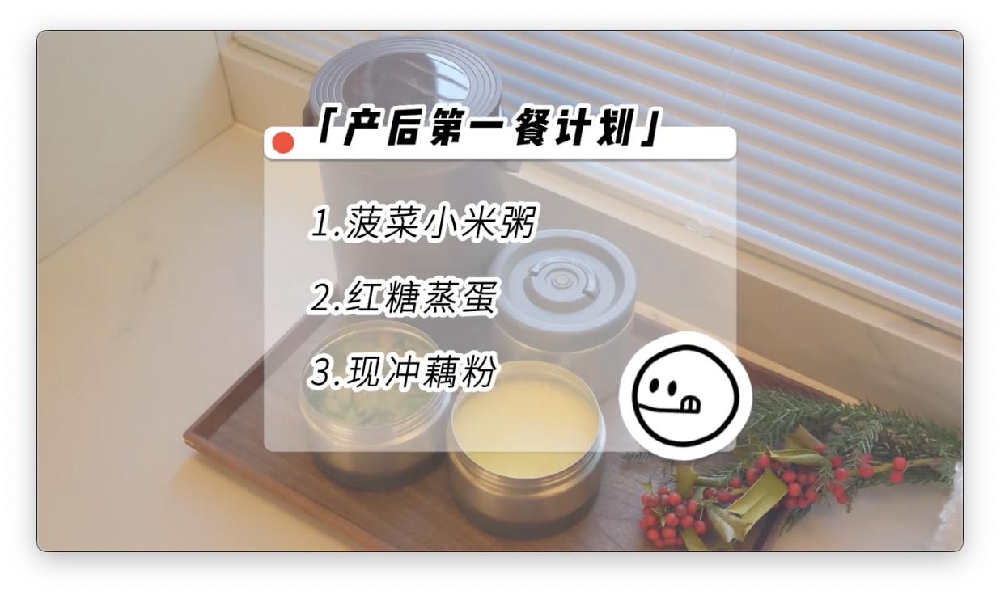

> 备菜：
> - 小米 75g，枸杞 10g
> - 三个鸡蛋，10g 红糖
> - 10g 藕粉

1. **菠菜小米粥**（调理脾胃，补气养血）
   1. 小米 75g，清水 750g，枸杞 10g，用电饭锅（或压力锅）熬制
   2. 锅里下盐和食用油烫菠菜（有效去除菠菜里的草酸植酸），去除头部之后切段
   3. 将菠菜段放入小米粥拌匀就好了
   4. 装入保温饭盒（饭盒先用开水烫一下）
2. **红糖蒸蛋**（活血化瘀，优质蛋白）
   1. 三个鸡蛋（约 100g）打散
   2. 10g 红糖，用 150ml 的 45 度温水化开
   3. 直接用保温饭盒蒸鸡蛋，鸡蛋液 + 红糖水搅拌均匀
   4. 盖上保鲜膜，戳几个孔，蒸 20min（蒸烤箱）
3. **现冲藕粉**（散瘀止血，容易消化，医院现冲即可）
   1. 10g 藕粉用 15ml 凉开水化开
   2. 然后冲入约 135ml 开水
   3. 不断搅拌就好了

---

### Day02 ✅

#### 饮食建议

产后第二天子宫恢复过程的开始，此时由于肠胃功能较差还是以半流质食物为主

1. 以清淡、易消化的半流质食物为主
2. 饮食要利尿排毒、活血化瘀排恶露
3. 不要喝下奶汤，易导致乳腺管堵塞

#### 早餐

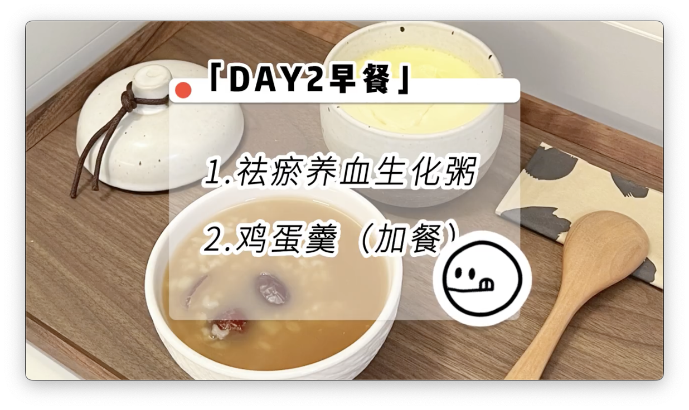

> 备菜
> - 当归 6g、山楂 5g、甘草 3g、桃仁 6g、川芎（xiong）5g、炮姜 5g：温中散寒

1. **祛瘀养血生化粥**
    > 活血化瘀止痛，排除恶露（适合产后 7 天内食用，第二天开始喝会比较好，3-7 天为宜）适合产后腹痛腹胀，恶露不下的情况下喝
   1. 配料：
      - 当归 6g：补血止痛
      - 山楂 5g：消食健脾
      - 甘草 3g：补气止痛
      - 桃仁 6g：产后瘀痛
      - 川芎（xiong）5g：活血化瘀
      - 炮姜 5g：温中散寒
   2. 红枣挑出来，将其他配料加入清水 1200ml，小火煎煮 30min 捞出渣滓后，汤用于煮粥
   3. 电饭煲里倒入 100g 大米，倒入熬好的药膳汤，放入去核的红枣
   4. 在煮好的粥里加入红糖拌匀
2. 加餐：**鸡蛋羹**（优质蛋白、容易消化吸收）
   - 同 Day 01，将红糖水换成了盐水

#### 午餐

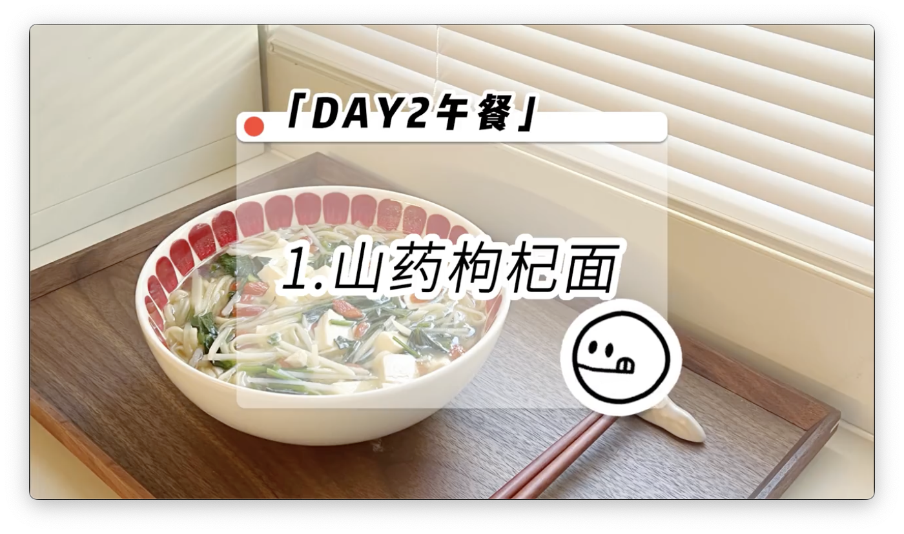

1. **山药枸杞面**
   1. 配料：
      - 豆腐 100g：优质蛋白
      - 菠菜 30g：补铁
      - 陈皮 3g：健脾
      - 枸杞 15g：补气
      - 山药 30g：健脾胃
      - 挂面 50g
   2. 陈皮热水浸泡 10min
   3. 山药去皮后刨丝更容易消化
   4. 豆腐切块，菠菜切段
   5. 锅中下入姜丝爆香后取出，山药和豆腐翻炒后加入开水（下奶后可换成鸡汤会更好）
   6. 下入挂面，放入菠菜段和枸杞
   7. 倒入陈皮水
   8. 最后加入盐和生抽调味

#### 晚餐

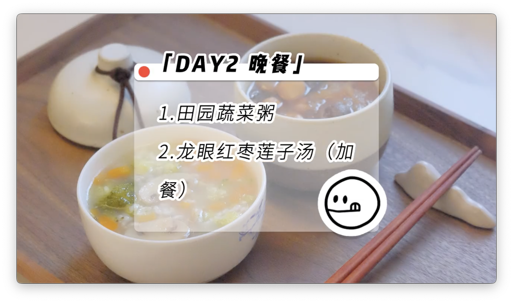

1. **田园蔬菜粥**
    > 容易消化，营养全面，非常适合作为第二天的康复餐
   1. 西蓝花、胡萝卜和白蘑各 50g，加入 100g 大米煮成粥
   2. 煮好后加入少量盐和亚麻籽油即可
2. 龙眼红枣莲子汤（加餐）
    > 养心安神，健脾利水
   1. 配料：
      - 银耳 8g
      - 红枣 50g
      - 松子仁 15g
      - 龙眼 7 个
      - 红豆 20g
      - 莲子 50g
   2. 银耳提前泡发
   3. 其他材料清洗干净后加水
   4. 加入泡好的银耳炖煮
   5. 最后加入红糖 15g 即可

---

### Day03 ✅

#### 饮食建议

产后第 3 天，随着身体和肠胃逐渐恢复，可以适当增加富含蛋白质、维 A/C 和 B 族维生素的食物，有利于伤口的愈合。不过是否开始喝下奶汤建议先检查乳腺管是否通畅。饮食还是以容易消化的食物为主

1. 适当补充蛋白质 | 维 A/C 等有利伤口愈合
2. 喝下奶汤前先检查乳腺管是否通畅
3. 不宜吃得太饱，可随饿随吃

#### 早餐

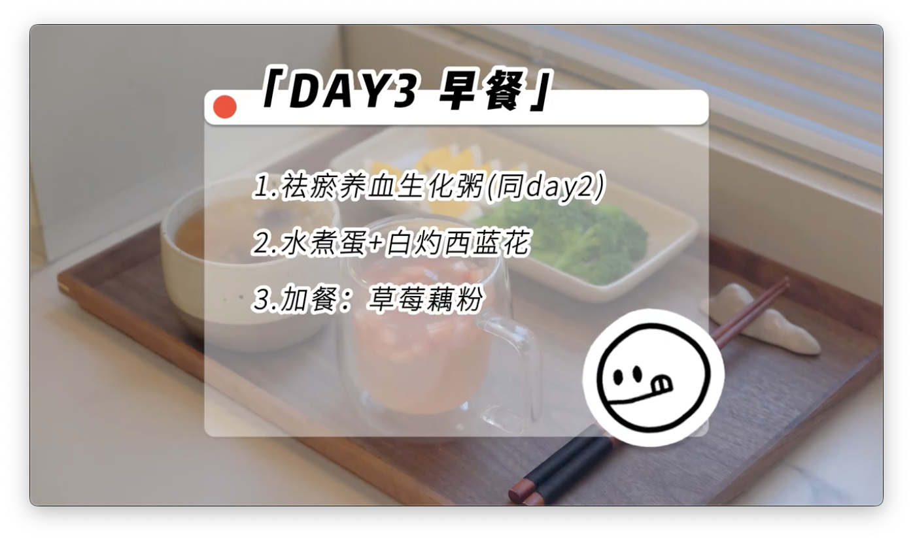

1. 祛瘀养血生化粥（同 day02）
2. 水煮蛋 + 白灼西蓝花
3. 加餐：草莓藕粉

> 酸甜开胃，补充维 C

#### 午餐

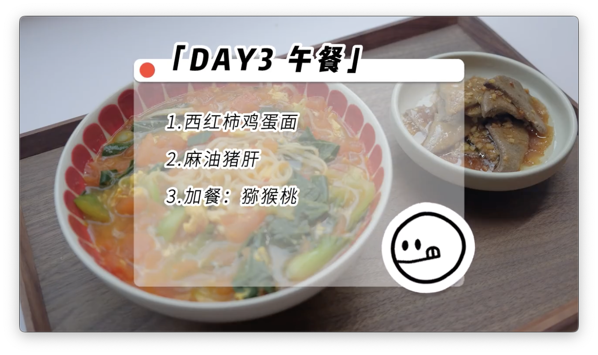

1. 西红柿鸡蛋面
2. 麻油猪肝（补铁补血补维 A，促排恶露）
   1. 猪肝切片（50g 左右）
   2. 加入淀粉抓洗，冲干净
   3. 水沸后加入姜片、料酒去腥
   4. 下入猪肝焯水至全熟
   5. 酱料：水淀粉 + 1 勺生抽 + 半勺蚝油拌匀备用，锅中少油 + 姜末爆香，加入调好的酱汁，最后加入亚麻籽油（传统是黑芝麻油）
   6. 淋到猪肝上即可
   7. 加餐：猕猴桃

#### 晚餐

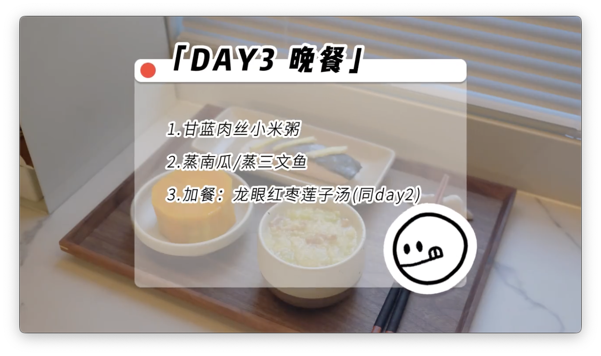

1. 甘蓝肉丝小米粥（健脾养胃，营养丰富）
2. 蒸南瓜 / 蒸三文鱼
3. 加餐：龙眼红枣莲子汤（同 day02）

---

### Day04 ✅

#### 饮食建议

产后第 4 天，随着身体和肠胃逐渐恢复，可以适当增加富含蛋白质、维 A/C 和 B 族维生素的食物，有利于伤口的愈合。
正式泌乳了可以喝些下奶汤催乳。饮食还是以容易消化的食物为主

1. 若正式泌乳了可适当喝些催奶汤
2. 增加富含膳食纤维的蔬菜 / 杂粮
3. 适当补充蛋白质！维 A/C 有利伤口愈合

#### 早餐

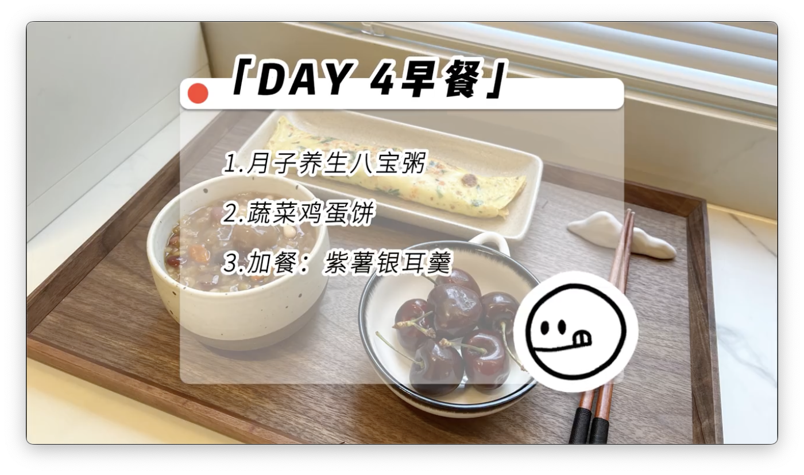

1. 月子养生八宝粥（益气补血，养心安神）
   1. 配料：花生 10g、葡萄干 10g、松子仁 10g、枸杞 10g、绿豆 20g、红豆 20g、糯米 75g、薏仁 10g、芡实 10g、龙眼 5 个、红枣 6 个、莲子 10g
   2. 晚上提前预约，煮好后放入 15g 红糖
2. 蔬菜鸡蛋饼（鸡蛋煎饼）
   1. 配料：鸡蛋、面粉、青菜、胡萝卜
3. 加餐：紫薯银耳羹（补充胶原蛋白）

#### 午餐

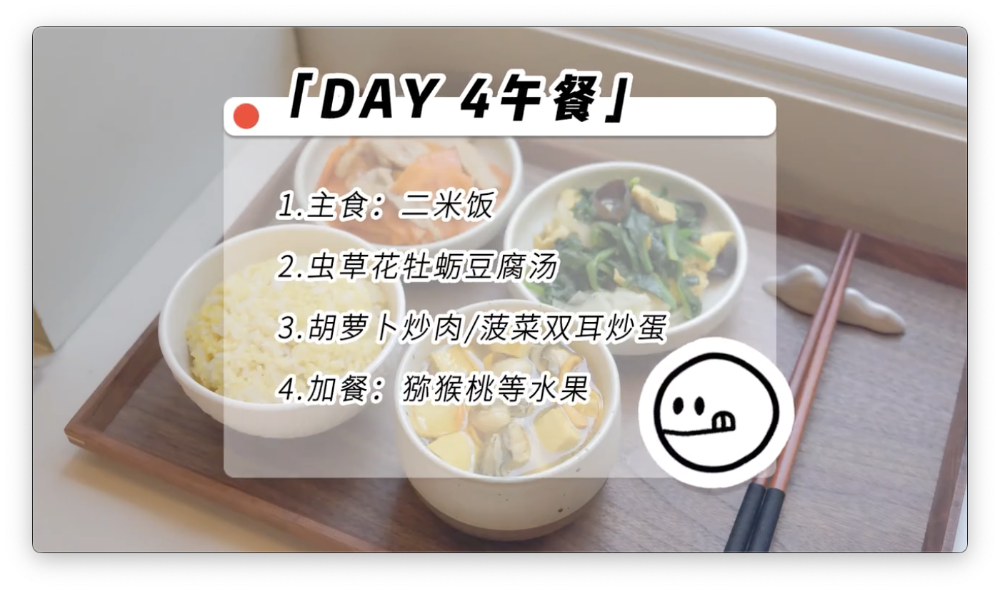

1. 主食：二米饭（小米 + 白米）
2. **虫草花牡蛎豆腐汤**（补锌补钙、催乳下奶）
   1. 姜末爆香，加入豆腐先煎一会
   2. 加一点生抽、加入沸水
   3. 加入虫草花炖煮
   4. 牡蛎加入少量淀粉搅拌，下入汤锅
   5. 最后加盐调味，出锅
3. 胡萝卜炒肉、菠菜双耳炒蛋
4. 加餐：猕猴桃等水果

#### 晚餐

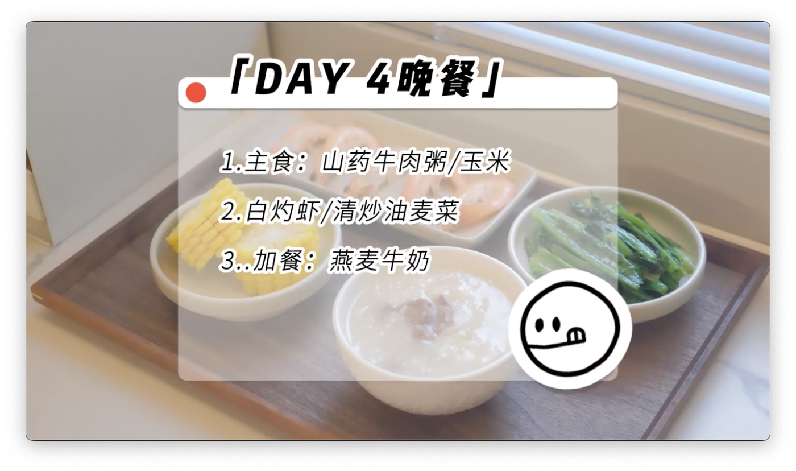

1. 主食：山药牛肉粥（温中养胃、高锌高蛋白）、玉米
   1. 山药打碎（或剁碎）、加入大米煮成山药粥
   2. 牛肉切片加生抽、蚝油腌制入味
   3. 牛肉加入山药粥中烫熟即可
2. 白灼虾、清炒油麦菜
3. 加餐：燕麦牛奶

---

### Day05 ✅

#### 饮食建议

随着身体和肠胃逐渐恢复，可以适当增加富含蛋白质、维 A/C 和 B 族维生素的食物，有利于伤口的愈合。
正式泌乳了可以喝些下奶汤催乳。饮食还是以容易消化的食物为主
多吃助眠的食物：比如桂圆、莲子和牛奶等

1. 多吃助眠的食物：桂圆 / 莲子 / 牛奶等
2. 适当补充蛋白质维 A/C 有利伤口愈合
3. 多吃蔬果，水果最好蒸过或者烫一下

#### 早餐

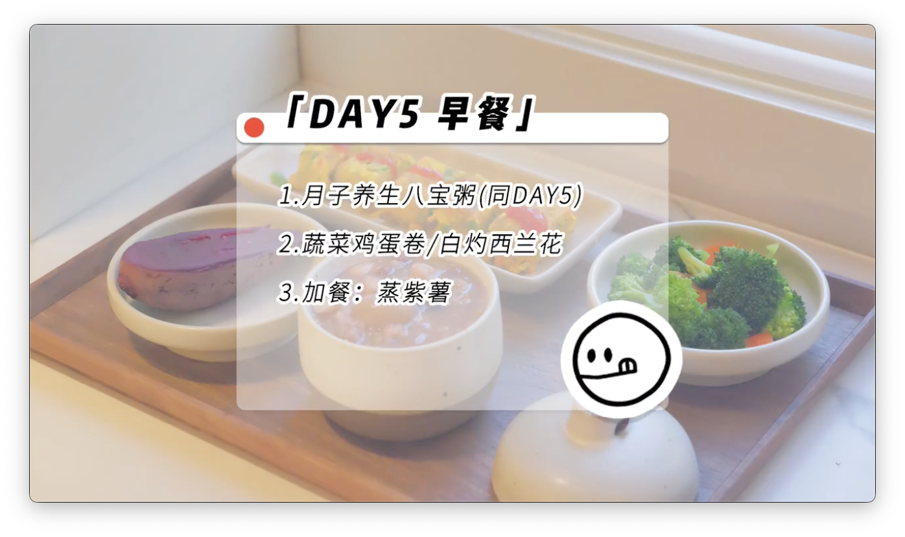

1. 月子养生八宝粥
2. 蔬菜鸡蛋卷、白灼西蓝花
   1. 胡萝卜、青椒、洋葱打（切）碎
   2. 鸡蛋 + 盐 + 生抽，打散
   3. 加入蔬菜碎搅拌均匀
   4. 热锅下入蛋液，定型后卷起
   5. 切成块状，沾番茄酱更佳
3. 加餐：蒸紫薯

#### 午餐

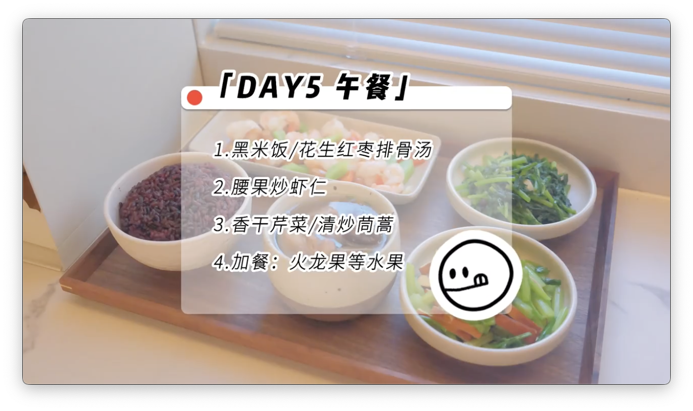

1. 黑米饭
2. **花生红枣排骨汤**（益气补血，强身健骨）
   1. 配料：红皮花生 60g、红枣 6 颗、党参 3g（补中益气）、杜仲 5g（强筋骨）
   2. 党参、杜仲洗净后，加入 1L 水，小火熬煮 1h，弃渣留汁备用
   3. 排骨焯水洗净，放入电饭锅中，加入姜片和杜仲党参水
   4. 再放入花生红枣和 30g 米酒（醪糟），炖煮
   5. 熬好后加盐调味即可（~~* 可以加入葱花提味 *~~）
3. 腰果炒虾仁 (补锌补维 C)
4. 香干芹菜、清炒茼蒿
5. 加餐：火龙果等水果

#### 晚餐

1. 山药枸杞面（同 day02）
2. 白切鸡
3. 加餐：紫薯牛奶银耳羹（补充胶原蛋白和钙）

---

### Day06 ✅

#### 饮食建议

饮食需要兼顾活血化瘀和利尿消肿。
随着身体和肠胃逐渐恢复，
可以逐渐过渡到正常饮食。
适当增加富含铁、维 A/C 和 B 族维生素的食物，
有利于伤口的愈合。

1. 可以逐渐过渡到普通饮食
2. 多吃富含铁、维 C 和蛋白质的食物
3. 饮食兼顾利尿排毒、活血化瘀

#### 早餐

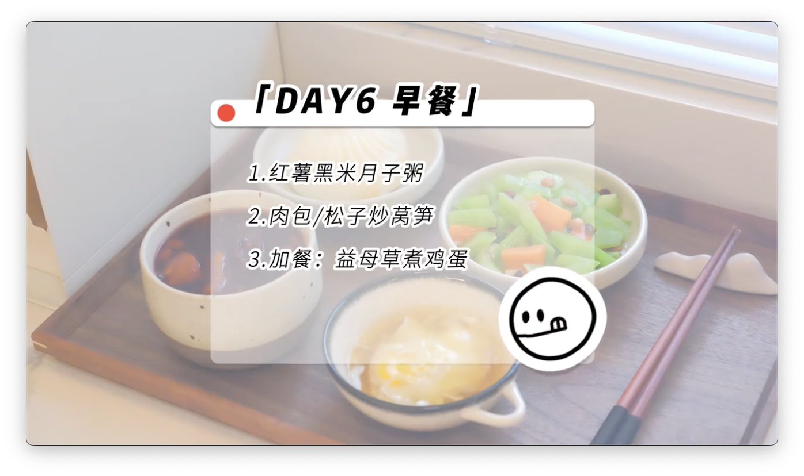

1. 红薯黑米月子粥
> 补气养血，调理脾胃
   1. 配料：红薯 150g、枸杞 15g、糯米 50g、红枣 6 颗、黑米 50g
   2. 电压力锅焖煮 30min
1. 肉包、松子炒莴笋
2. 加餐：益母草煮鸡蛋
> 活血化瘀、利水消肿
   1. 配料：干益母草 10g、鸡蛋 1 个
   2. 益母草洗净后加水炖煮 30min，去渣留汤
   3. 打入鸡蛋煮成荷包蛋

#### 午餐

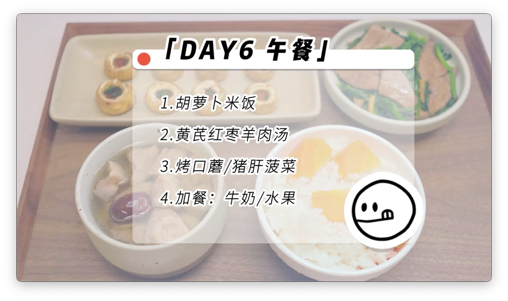

1. 胡萝卜米饭（蒸米饭时放几块胡萝卜）
2. **黄芪（qi）红枣羊肉汤**
   
   > 补气益血，温中养胃
   1. 羊肉切片，冷水下锅，加姜片、料酒焯血水
   2. 加入黄芪 5g、红枣 6 颗
   3. 电压力锅焖煮 40min
   4. 加盐调味
3. 烤口蘑
   1. 口蘑洗干净后去蒂，撒一些海盐
   2. 放入烤箱，上下火 180 度烤 15min
   3. ~~ 可撒葱花点缀~~
4. 猪肝菠菜
   1. 猪肝切片，洗净后焯水，变色捞出
   2. 菠菜焯水去草酸
   3. 起锅烧油，下入姜丝爆香
   4. 下入猪肝，加入蚝油、生抽翻炒
   5. 最后下入菠菜，加盐调味
5. 加餐：牛奶 / 水果

#### 晚餐

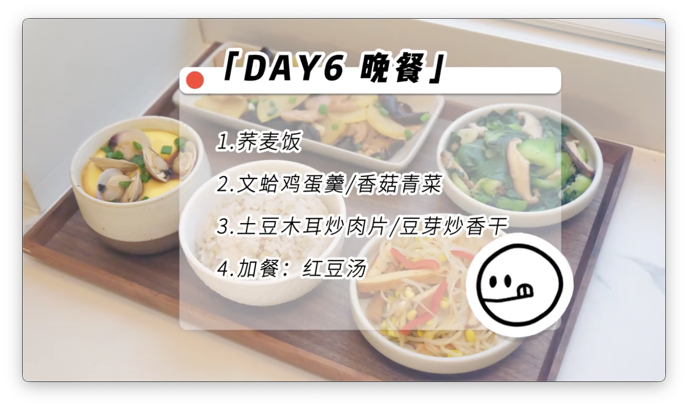

1. 荞麦饭
   > 补充膳食纤维
2. 文蛤鸡蛋羹
   > 补铁补锌，容易消化
   1. 文蛤冷水下锅，加入姜片料酒煮至开口
   2. 留部分清汤晾凉备用
   3. 2 个鸡蛋 + 150ml 文蛤汤拌匀
   4. 放入多余的文蛤肉
   5. 蒸 15min
   6. 最后加香油、生抽、葱花
3. 香菇青菜、土豆木耳炒肉片、豆芽炒香干
4. 加餐：红豆汤

---

### Day07 ✅

#### 饮食建议

宝妈胃口开始好转，食欲增加，但也不宜吃的过饱
三餐需注意粗细、荤素搭配，饮食均衡胜过大补
避免韭菜、花椒等可能回奶的食物

1. 胃口好转食欲增加，但也不宜饱食
2. 饮食均衡胜过大补，粗细荤素搭配
3. 避免韭菜、花椒等可能回奶的食物

#### 早餐

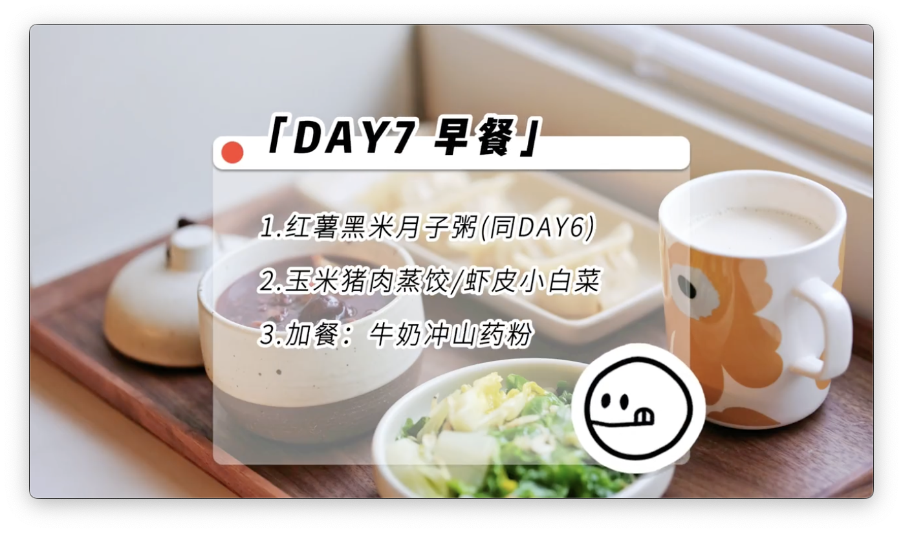

1. 红薯黑米月子粥（同 day06）
2. 玉米猪肉蒸饺
3. 虾皮~~小白菜~~（换成娃娃菜）
   1. 起锅烧油，加入姜丝爆香
   2. 放入娃娃菜
   3. 放入虾皮补钙提味
   4. 加盐调味
4. 加餐：牛奶冲山药粉
   1. 两勺山药粉冲入热牛奶拌匀即可

#### 午餐

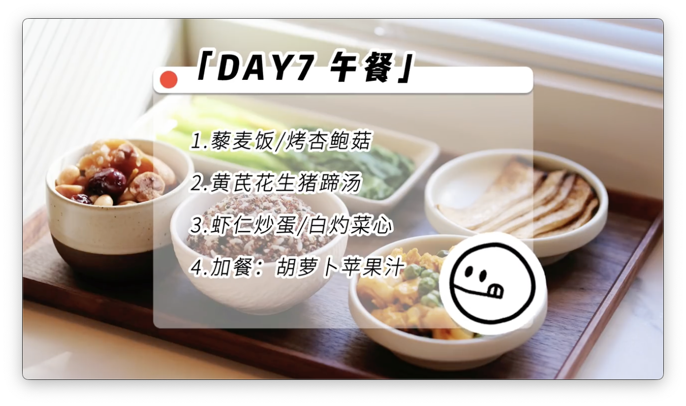

1. 藜麦饭（低 GI 高叶酸）
2. 海盐烤杏鲍菇
   1. 杏鲍菇切厚片
   2. 烤盘刷油，铺上杏鲍菇， 撒上海盐调味
   3. 放入烤箱 180 度烤 15min
3. **黄芪花生猪蹄汤**
   > 催乳下奶，滋阴养颜
   1. 配料：
      - 山楂 10g：健胃消食
      - 当归 5g：活血润肠
      - 黄芪 10g：健脾利尿
      - 花生 50g：催乳养胃
      - 红枣 9 颗：补脾和胃
   2. 猪蹄焯水后加入洗净的辅料，开火撇去浮沫后小火炖 2h（把猪蹄炖烂有助于胶原蛋白的消化吸收）
4. 虾仁炒蛋
   1. 虾仁、青豆焯熟
   2. 炒鸡蛋，盛出备用
   3. 起锅烧油，姜丝爆香，加入虾仁、青豆，放少许生抽调味
   4. 放入鸡蛋，加盐，翻炒均匀，出锅
5. 白灼菜心
   1. 水里加盐和食用油把菜心焯熟
   2. 浇上白灼汁（生抽、蚝油、白糖、芡汁，烧开）
6. 加餐：胡萝卜苹果汁
   1. 胡萝卜块、苹果块放入破壁机，加入温开水，果汁档即可

#### 晚餐

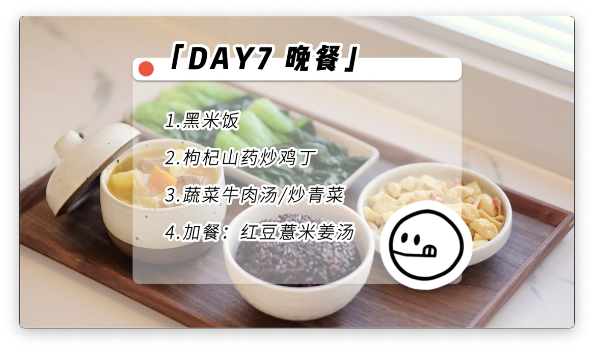

1. 黑米饭（高纤维高锌）
2. 枸杞山药炒鸡丁
   > 益气健脾，养阴补血
   1. 配料：鸡胸肉 150g、山药 50g（养胃）、黄花菜 15g（补铁）、陈皮 15g（健脾）、枸杞 15g（润肺）
   2. 陈皮、枸杞、黄花菜提前泡好
   3. 鸡胸肉切丁，用盐、料酒、淀粉腌制
   4. 山药切丁，黄花菜切小段
   5. 先把鸡丁炒熟备用
   6. 起锅烧油，将姜丝爆香后放入黄花菜、山药翻炒
   7. 然后倒入鸡丁、枸杞和陈皮水
   8. 放盐、生抽调味，勾芡
3. 蔬菜牛肉汤
   1. 胡萝卜、西芹、洋葱、土豆、包菜、牛肉切块
   2. 西红柿去皮切块
   3. 起锅烧油，下入胡萝卜、西芹、洋葱炒香
   4. 放入西红柿、牛肉、土豆，加水炖煮 60min 至牛肉软烂
   5. 放入生抽和盐调味
   6. 最后放入包菜炖 5min
4. 炒青菜（小油菜）
5. 加餐：红豆薏米姜汤（祛湿利水消肿）
   1. 配料：薏米 60g、姜片 5 片、红豆 50g
   2. 红豆、薏米提前加水泡 3h
   3. 加入电压力锅焖煮
   4. 最后根据口味加入红糖即可

---

## Week 2

---

### Day08 ✅

#### 饮食建议

1. 胃口好转食欲增加，但也不宜饱食
2. 饮食均衡胜过大补，粗细荤素搭配
3. 催乳提上日程，多喝汤汤水水

#### 早餐

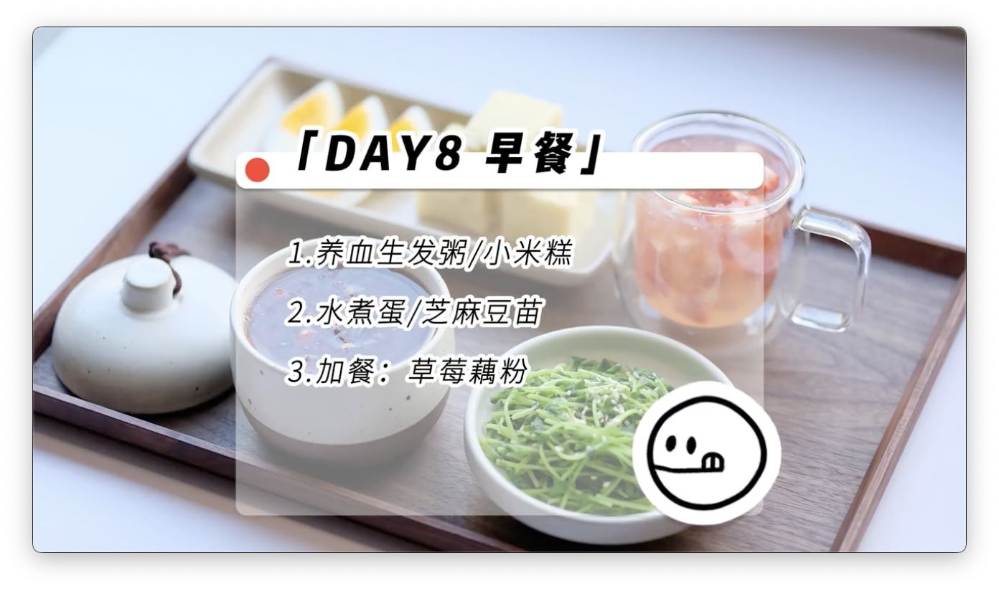

1. 养血生发粥
   > 养阴补血，促进生发
   1. 配料：糯米 50g，红枣 6 颗（补脾和胃），黑米 50g（高纤维），芡实 15g（益肾固精），制何首乌 10g（补肾），枸杞 15g（补肝润肺），莲子 15g（养心安神）
   2. 制何首乌加水煮 30min，去渣留汤煮粥
   3. 芡实提前泡
   4. 食材洗净后加入电压力锅煮成粥
2. 小米糕
3. 水煮蛋
4. 芝麻豆苗
   1. 锅中加盐、亚麻籽油
   2. 下入豆苗烫 10s 捞出
   3. 撒上熟芝麻和海盐
5. 加餐：草莓藕粉
   1. 2 颗草莓切丁
   2. 杯中加入 10g 藕粉
   3. 凉水拌匀后冲入沸水
   4. 最后撒上草莓丁搅拌

#### 午餐

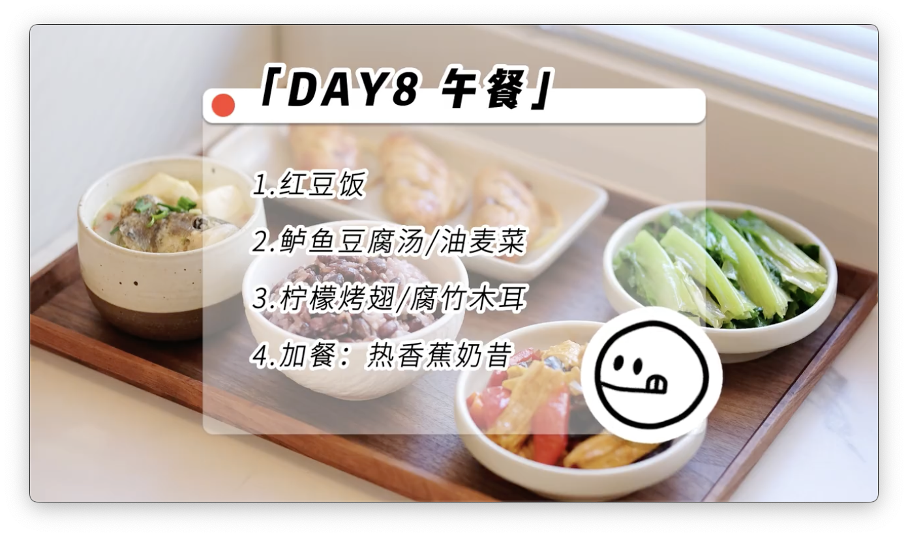

> 早餐后提前将红豆、腐竹和木耳泡上

1. 红豆饭（红豆: 米饭 = 1:1）
2. 鲈鱼豆腐汤
   > 健脾下奶，利尿消肿
   1. 姜片爆香后下切好的鱼块煎至两面金黄
   2. 冲入开水，下嫩豆腐焖煮 10min
   3. 加盐、枸杞和葱花即可出锅
3. 炒油麦菜
4. 柠檬烤翅
   1. 鸡翅两面改刀腌制
   2. 腌料：盐 3g、料酒 5g、生抽 10g、蚝油 10g、蜂蜜 5g、柠檬 0.5 个
   3. 腌制 1h 入味
   4. 放入烤箱（柠檬片放鸡翅下方）
   5. 180 度上下火烤 30min
5. 腐竹炒木耳
   1. 姜片爆香下甜椒翻炒后加入腐竹和木耳
   2. 加盐、生抽和水淀粉勾芡
6. 加餐：热香蕉牛奶
   1. 香蕉加温牛奶打成奶昔

#### 晚餐

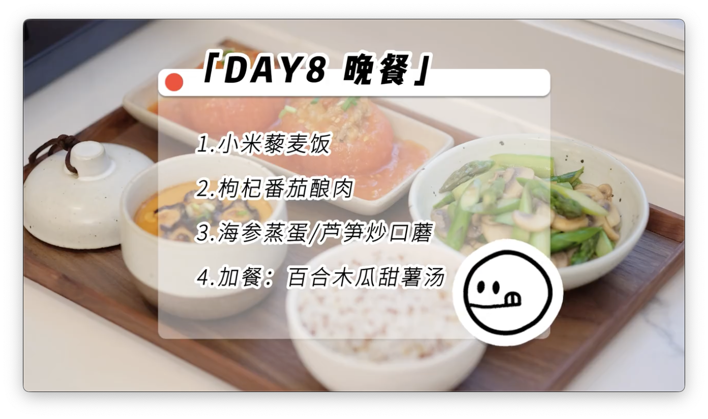

1. 小米藜麦饭
2. 枸杞番茄酿肉
  - 番茄划十字刀、去头挖瓤备用
  - 山楂 5g、枸杞 10g 提前泡热水
  - 肉馅：猪肉馅 200g、姜末 3g、食盐 3g、料酒 5g、蚝油 8g、生抽 15g、淀粉 5g、山楂 5g 切碎、枸杞 10g
  - 肉馅装入番茄，待蒸
  - 挖出来的番茄肉倒入锅中加盐、生抽、水淀粉收汁
  - 番茄去皮，倒入番茄汁
3. 海参蒸蛋
  - 鸡蛋: 盐水 = 1:1.5 混合，发好的海参切片，一部分放入蛋液中，盖盖和番茄酿肉一起蒸 15min，取出后放入剩下的海参，点上葱花闷一会，上桌前点上香油和生抽即可
4. 芦笋炒口蘑
  - 芦笋斜刀切段，焯水
  - 姜片爆香后放入口蘑煸炒，倒入芦笋加生抽、盐、水淀粉勾芡，翻炒均匀即可

加餐：

1. 百合木瓜甜薯汤
  - 红薯 30g、红枣 2 颗、龙眼 3 颗、红糖 3g、干百合 3g、枸杞 3g、木瓜 50g、姜片 2g，加 200ml 水
  - 晚饭后吃，蒸 30min 即可

---

### Day09 ✅

#### 饮食建议

1. 饮食均衡胜过大补，粗细荤素搭配
2. 应以调理气血为主，催乳为辅
3. 催乳的同时不忘补血，比如蛏子、猪肝等

#### 早餐

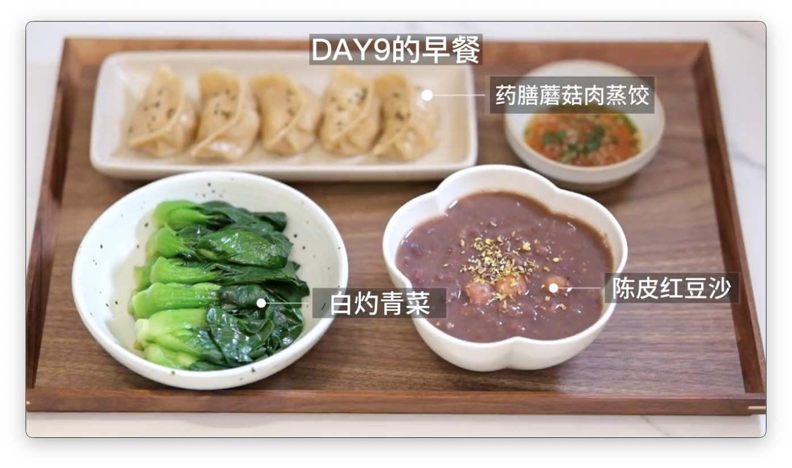

1. 药膳蘑菇肉蒸饺
   > 健脾益气，滋补肝肾
   1. 杜仲煮水 200ml 去渣留汤
   2. 250g 面粉加 15g 山药粉，加入杜仲水和成面团
   3. 肉馅：五花肉 200g、虾仁 50g、鸡蛋 1 个、冬笋 50g、香菇 30g
   4. 五花肉、虾仁；冬笋、香菇分别剁（打）碎
   5. 将佐料和调料（盐 3g，生抽 10g）放入肉馅里搅拌均匀
   6. 擀皮包饺子
2. 陈皮红豆沙
   1. 红豆提前 3h 泡水
   2. 下锅加入莲子和陈皮、水一起熬煮 1h
   3. 盛出部分放入料理机打碎，然后混合，加入红糖
   4. 桂花点缀
3. 白灼青菜
4. 加餐：红豆沙牛乳
   1. 陈皮红豆沙冲入热牛奶

#### 午餐

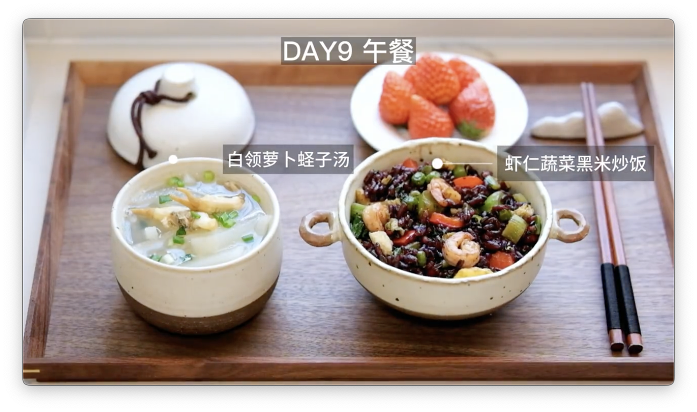

1. 虾仁蔬菜炒黑米饭
   > 粗细搭配，营养均衡
   1. 白米、黑米各 1 杯，洗净后加入等量的水，蒸烤箱蒸 45min
   2. 菜心、甜椒切丁
   3. 青豆和虾仁焯水后捞出
   4. 鸡蛋煎好划散
   5. 菜心炒至断生，加入红椒、虾仁、青豆，翻炒后加盐、生抽、蚝油调味
   6. 加入放凉后的 hei'mi 鸡蛋
2. 白萝卜蛏子汤
   > 增强食欲，补铁补锌
   1. 蛏子吐沙，把壳搓洗干净，冷水下锅
   2. 放入姜片和料酒去腥，开口后捞出，取出蛏子肉
   3. 烧沸后的蛏子汤过滤备用
   4. 白萝卜切丝
   5. 姜丝爆香后加入白萝卜丝，倒入蛏子汤煮 10min，保留天然鲜味
   6. 加入蛏子、盐和葱花即可
3. 加餐：山药豆浆
   > 养胃下奶，容易吸收
   1. 原味豆浆粉 + 山药粉，冲入热水即可

#### 晚餐

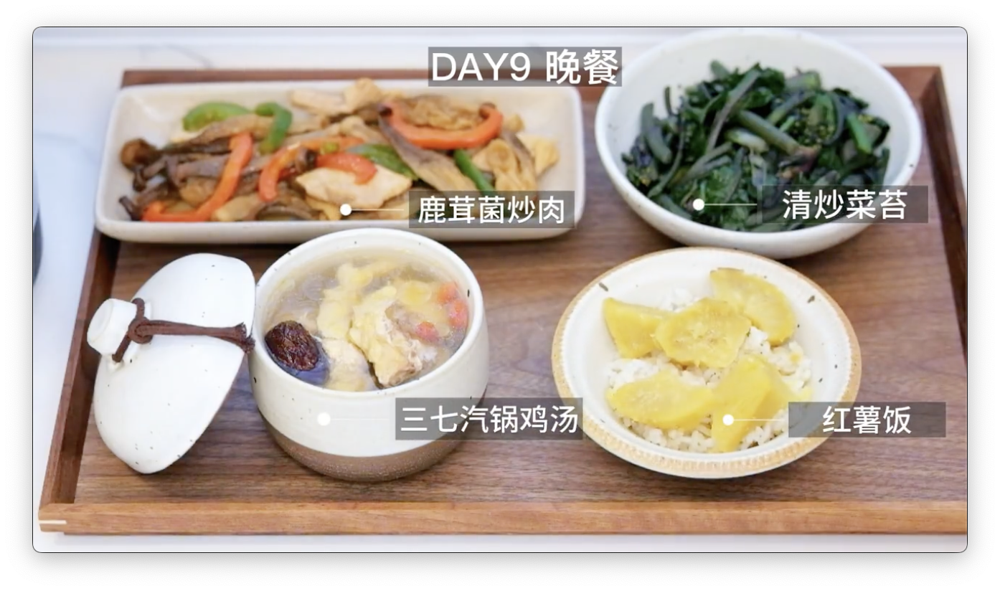

1. 红薯饭
2. 三七汽锅鸡
   > 月子鸡汤使用童子鸡 / 公鸡更合适
   > 益气活血，滋补下奶
   1. 陶瓷汽锅姜片垫底，码上童子鸡块，加入三七和红枣
   2. 少量盐调味
3. 鹿茸菌炒肉
   1. 甜椒切丝，猪肉切片
   2. 姜丝爆香后放入肉片划散
   3. 加入甜椒丝和泡好的鹿茸菌
   4. 盐、生抽、水淀粉勾芡即可
4. 炒菜薹
5. 加餐：三红薏仁甜汤圆
   > 补血安神，通乳利水
   1. 配料：薏仁 25g、汤圆 10 颗、红芸豆 50g、玉米 100g、枸杞 10g、红枣 8 颗、生姜 10g、桂圆肉 10 颗、柠檬 20g
   2. 加入 2.5L 水熬煮，加入汤圆煮 5min，加入冰糖和柠檬汁，搅拌均匀

---

### Day10 ✅

#### 饮食建议

1. 饮食均衡胜过大补，粗细荤素搭配
2. 慎食辣椒、胡椒等辛辣调味料，易上火
3. 适当增加优质蛋白，如牛肉、鱼、豆腐、瘦肉等

#### 早餐

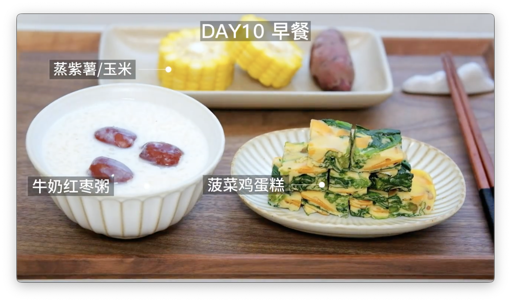

1. 红枣牛奶粥
   1. 红枣去核
   2. 电饭锅中加入大米 50g、糯米 50g、红枣 10 颗和少量水
   3. 红枣粥烧熟后，加入 250ml 牛奶
   4. 煮沸后搅拌均匀即可
2. 菠菜鸡蛋糕
   1. 菠菜切段、胡萝卜刨片
   2. 锅中加盐和少量油焯菠菜去草酸
   3. 3 个鸡蛋加少量盐打散
   4. 碗底刷油防粘连，倒入蛋液，放入菠菜段和胡萝卜片
   5. 盖上保鲜膜，戳几个洞，放入蒸烤箱蒸 15min，脱模切成块
3. 蒸紫薯、玉米
4. 加餐：膳食纤维饮
   > 产褥期全天膳食纤维建议摄入量应达到 25g~30g，本餐仅能提供 6g 左右
   > 补充高膳食纤维饮食，可刺激肠蠕动，缓解便秘
   - 纽特舒玛™️水溶性膳食纤维粉（1 条就可补充 10g 膳食纤维）

#### 午餐

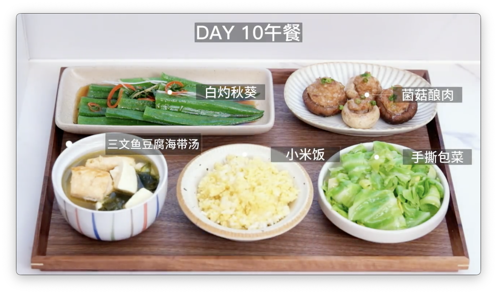

1. 小米饭（小米: 大米 = 1:1）
2. 菌菇酿肉
   1. 五花肉 200g 切块，加葱姜盐各 3g、生抽 15g、蚝油 5g、淀粉 3g、少量水，打碎成肉糜
   2. 蘑菇去蒂，填入肉馅，烤箱上下火 180 度烤 20min
3. 三文鱼豆腐海带汤
   > 下奶补碘补钙
   1. 三文鱼（富含 DHA）切块
   2. 煎过后加入开水
   3. 加入嫩豆腐、海带苗
   4. 加盐调味
4. 白灼秋葵
   1. 秋葵对半切开，锅中加盐和少许油，下秋葵焯熟
   2. 配上白灼汁：生抽、盐、水、油，加甜椒丝、葱丝（烧开）
   3. 淋到秋葵上即可
5. 手撕包菜（建议选择大平包，叶多茎少）
6. 加餐：混合坚果

#### 晚餐

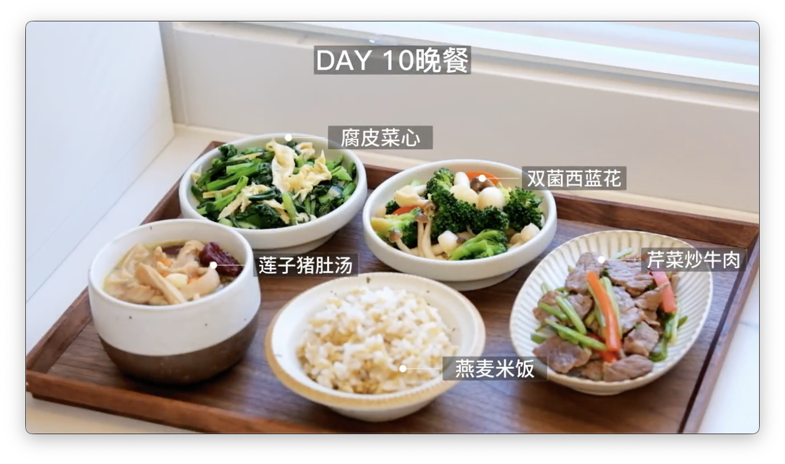

1. 燕麦米饭（大米: 燕麦 = 1:1）
2. 莲子猪肚汤
   > 健脾暖胃，益气消食
   1. 配料：猪肚 200g、陈皮 3g、枸杞 10g、山楂 5g、红枣 6 颗、莲子 20g
   2. 锅中加入猪肚和其他食材
   3. 放入水、姜片和葱段，盖上盖子小火焖煮 1h，最后加盐和枸杞调味
3. 芹菜炒牛肉
   1. 芹菜和甜椒切段，牛里脊切片，加生抽蚝油腌制入味
   2. 牛肉划散后加入芹菜、甜椒、盐，翻炒至熟
4. 双菌西蓝花
   1. 西蓝花切小块和菌菇一起焯水至熟
   2. 姜丝爆香后下入食材
   3. 调味：盐、生抽、蚝油
   4. 勾芡翻炒即可
5. 腐皮菜心
   1. 菜心、油豆皮切段
   2. 下锅后加盐和糖翻炒即可
6. 加餐：草莓燕窝牛奶
   1. 碗中加入草莓和鲜炖燕窝，冲入热牛奶即可

---

### Day11 ✅

#### 早餐

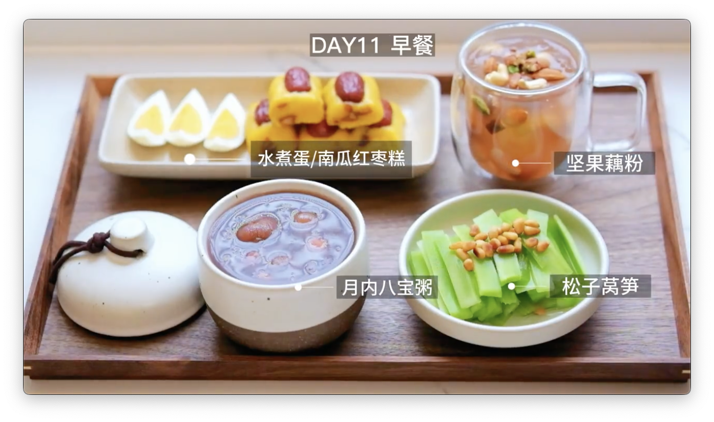

- 月子八宝粥
  > 培元补气，养心安神
  - 黑米 40g、桂圆 6 颗、芡实 15g、薏米仁 15g、红豆 20g、绿豆 20g、莲子 15g、花生 10g、糯米 40g
- 土豆南瓜红枣糕
  - 南瓜 200g、土豆 100g、红枣 100g、糯米粉 250g
  - 土豆南瓜蒸熟，捣成泥备用
  - 红枣切小块，和糯米粉加入土豆南瓜泥中，揉成面团
  - 分成小块，放上红枣片（半个枣），上锅蒸 10min 即可
- 松子莴笋
  - 莴笋切片，放盐水焯一遍，撒上松子仁
- 水煮蛋

加餐：
- 坚果藕粉
  - 1 勺藕粉，加热水搅匀后拌入坚果

#### 午餐

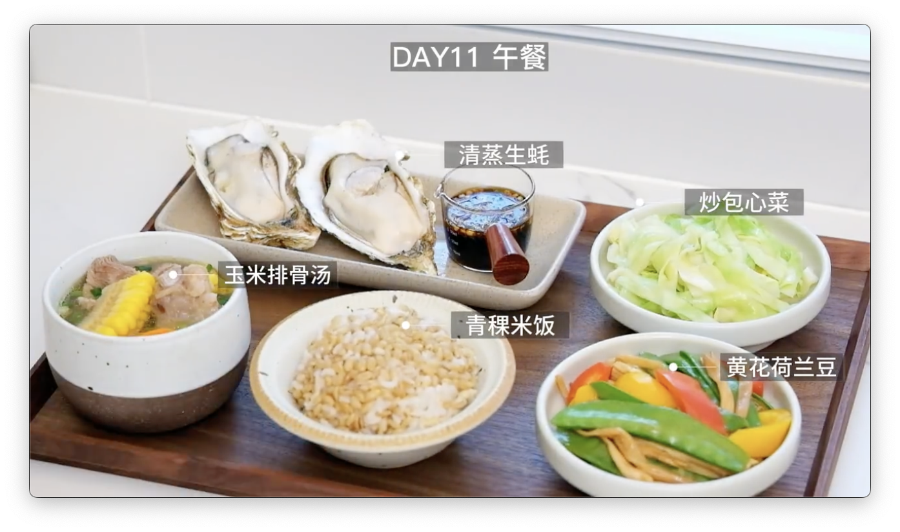

- 青稞米饭（1:1，富含膳食纤维和β- 葡聚糖，对血糖控制和改善肠道健康有好处）
- 玉米排骨汤
  - 排骨冷水下锅，加姜片、料酒焯水去腥
  - 排骨加热水、玉米、胡萝卜块、姜片，炖煮 50min，加盐调味
- 蒸生蚝（补锌）
  - 生蚝刷干净，上锅蒸 5min（每个放一片生姜）
  - 蘸汁（无辣版）：葱姜末各 3g、生抽 2 勺、香醋 1 勺、蚝油半勺、白糖 3g、盐 0.5g
- 黄花菜荷兰豆
  - 黄花菜（铁含量高）、腐竹（豆制品）提前泡好，甜椒（维 C 含量非常高）切块
  - 姜丝爆香后，下入锅中翻炒，生抽、蚝油、盐、水淀粉勾芡调味
- 清炒包心菜

加餐：
- 无花果 草莓 蓝莓水果盘

#### 晚餐

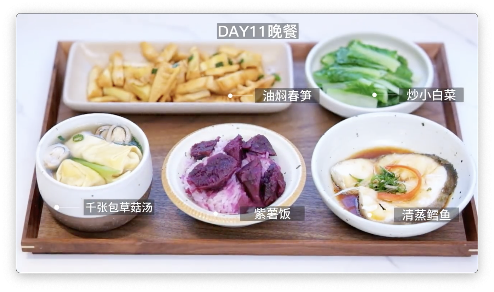

- 紫薯饭
- 千张包草菇汤
  - 海米（15g）泡开后打碎，加入肉馅（200g）和调料（葱姜水 20g、盐 3g、生抽 15g、蚝油 5g、香油 5g），搅打
  - 千张切块，放入肉馅卷成千张包（提前蒸一遍不容易散）
  - 草菇焯水后对半切，下锅煎出香味后加开水和千张包
  - 最后加入油麦菜和盐
- 清蒸鳕鱼
  - 鳕鱼上放葱段和姜片，蒸 8min
  - 葱段和姜丝爆香后倒入生抽、水和白糖，熬成料汁，浇在蒸好的鳕鱼上
- 油焖春笋（膳食纤维含量高）
  - 春笋划刀后剥开，切段
  - 下锅煎炒，放盐、糖、生抽、料酒调味，再加水焖 8min，最后撒点葱花
- 炒小白菜

加餐：
- 红豆薏米姜汤

---

### Day12 ✅

#### 早餐

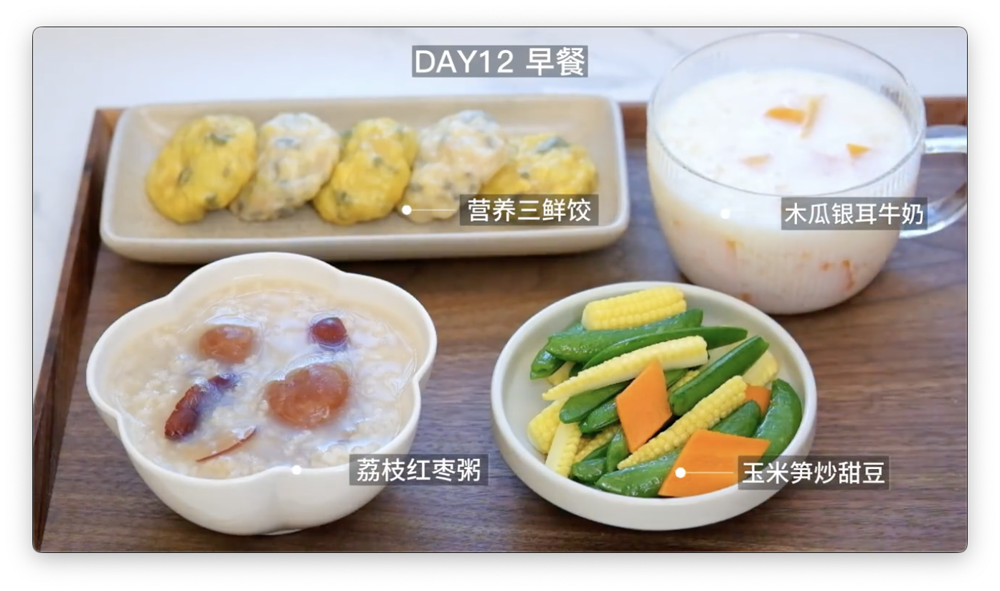

- 荔枝营养粥（益气生津、健脾消肿）
  - 干荔枝、红枣（剪开熬粥更香）
- 营养三鲜饺（调理心脾，补血生乳）
  - 娃娃菜 200g、粉丝 50g、黄花菜 20g、干木耳 15g、鸡蛋 2 个、虾仁 100g、豆腐 200g
  - 干货提前泡发，娃娃菜切碎后加盐出水
  - 黄花菜、木耳、虾仁切丁，一起放入盆中，加入生抽 20g、蚝油 8g、盐 3g、香油 10g、葱姜末各 3g，最后加入豆腐捏碎后搅拌均匀
  - 饺子皮擀薄，包成小包子反着放，放入蒸锅蒸 10min
- 玉米笋炒甜豆
  - 甜豆、玉米笋、胡萝卜焯水至熟，加盐和糖调味后翻炒

加餐：
- 木瓜银耳牛奶
  - 木瓜加（即食）银耳煮至软烂，加牛奶搅拌

#### 午餐

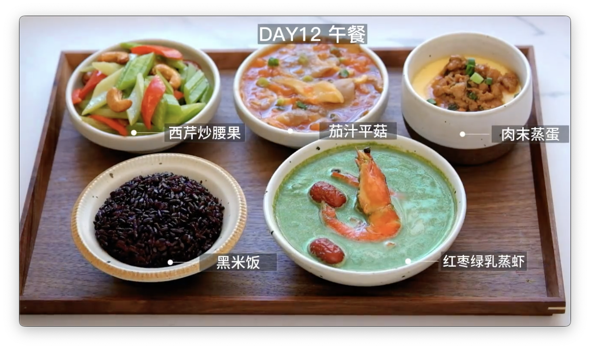

- 黑米饭
- 红枣绿乳蒸虾（通乳利水，润肠通便）
  - 菠菜洗净（不去根，很有营养），焯水去草酸
  - 切段后放入料理机加入豆浆和盐打成汁
  - 倒入处理干净的黑虎虾上，放上红枣盖保鲜膜蒸 10min
- 肉沫蒸蛋
  - 2 个鸡蛋打散后，加入 120ml 温水，蒸 10min
  - 姜末爆香后放入肉馅（200g）炒散，加少许料酒（10g）、盐（3g）、生抽（15g）、蚝油（5g）、水淀粉（60g）勾芡调味，放在蒸蛋上即可
- 茄汁平菇
  - 番茄去皮后切小块，下锅翻炒出汁，加水熬煮
  - 加入平菇翻炒，加盐、生抽、水淀粉勾芡调味
- 西芹炒腰果
  - 西芹、甜椒切块，焯水断生
  - 加腰果下锅翻炒，加盐、糖翻炒即可

加餐：
- 猕猴桃 / 香蕉

#### 晚餐

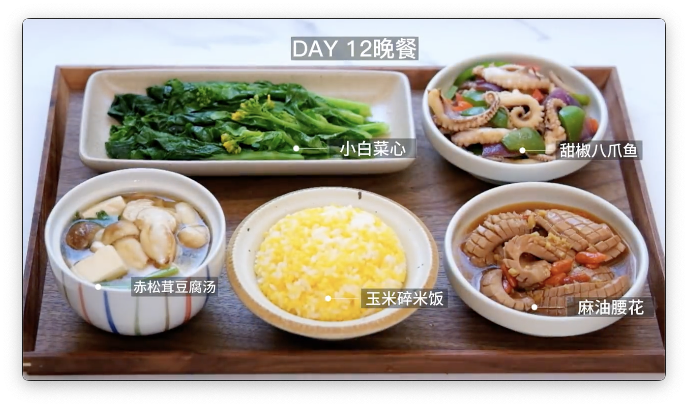

- 玉米碎米饭
- 赤松茸豆腐汤
  - 赤松茸切片后下锅煎一下（可去掉些涩味），倒入开水并放入嫩豆腐块熬煮
  - 加盐和生抽调味，再来点香芹段提香
- 麻油腰花（强腰健骨，滋补肝肾）
  - 猪腰（硒、铁、B 族维生素含量高）对半切开、改花刀，加葱姜盐料酒腌制去腥
  - 沸水下锅焯至变色
  - 葱末爆香后加入水淀粉勾芡，加入生抽、蚝油、盐调味后放入腰花翻炒，最后撒上枸杞和芝麻油就好了
- ~~ 甜椒八爪鱼~~
- 炒小菜心

加餐：
- 低脂版黑芝麻糊
  - 糯米 15g、小米 15g、红豆 15g、黑芝麻 15g
  - 加入 500ml 水打成浓汤

---

### Day13 ✅

#### 早餐

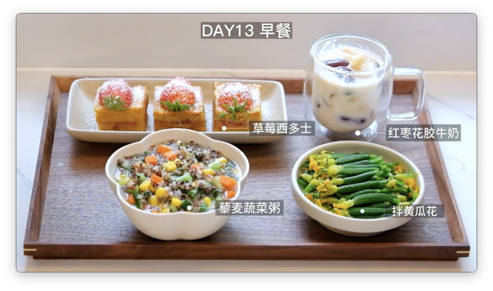

- 藜麦蔬菜粥
  - 三色藜麦泡水洗净，胡萝卜和青菜切丁
  - 藜麦加水、胡萝卜丁、玉米粒煮 15min
  - 最后加入青菜和盐即可
- 草莓西多士
  - 全麦吐司切去四边，抹上自制的低糖版草莓酱，分成 4 小块裹上鸡蛋液
  - 将吐司煎至四面金黄，摆上草莓，最后撒上椰蓉
- ~~ 拌黄瓜花~~

加餐：
- 红枣花胶牛奶
  - 花胶泡发一晚，切块，红枣去核，放入锅中加水没过食材，小火煮 15min，最后加入一盒牛奶

#### 午餐

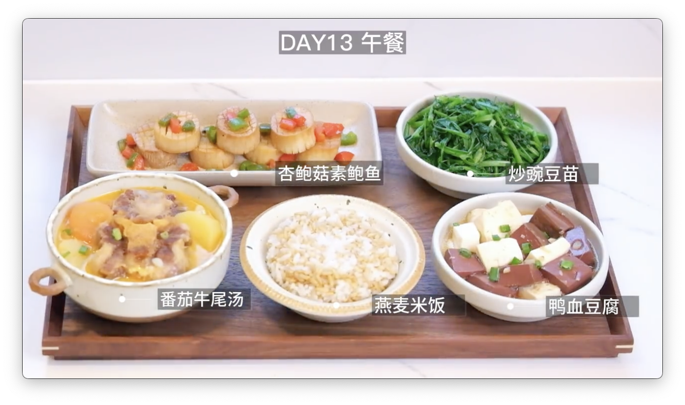

- 燕麦米饭
- 番茄牛尾汤（营养全面，高蛋白，优质碳水，高锌 / B 族维生素）
  - 番茄去皮，和土豆、洋葱切块
  - 牛尾焯水后煎至两面金黄取出
  - 锅中放入洋葱、番茄炒香，然后加入牛尾、土豆和开水，焖煮 1.5h 后加盐调味，撒上葱花
- 杏鲍菇素鲍鱼（高膳食纤维）
  - 红绿甜椒切丁，杏鲍菇切块、两面改十字花刀
  - 杏鲍菇两面煎金黄后，放入盐、生抽和甜椒丁
- 鸭血豆腐（补铁）
  - 豆腐、鸭血切丁后焯水（加盐豆腐不易散）
  - 盐、生抽、蚝油、水淀粉调成酱汁
  - 姜末爆香后，下入豆腐、鸭血和酱汁，焖煮 3min
- 炒豌豆苗

加餐：
- 羽衣甘蓝苹果汁（高膳食纤维、高维 A、维 C）
  - 羽衣甘蓝农药残留比较多，最好使用果蔬机泡一遍再焯一遍水
  - 和苹果切块后放入料理机加温水打成果汁

#### 晚餐

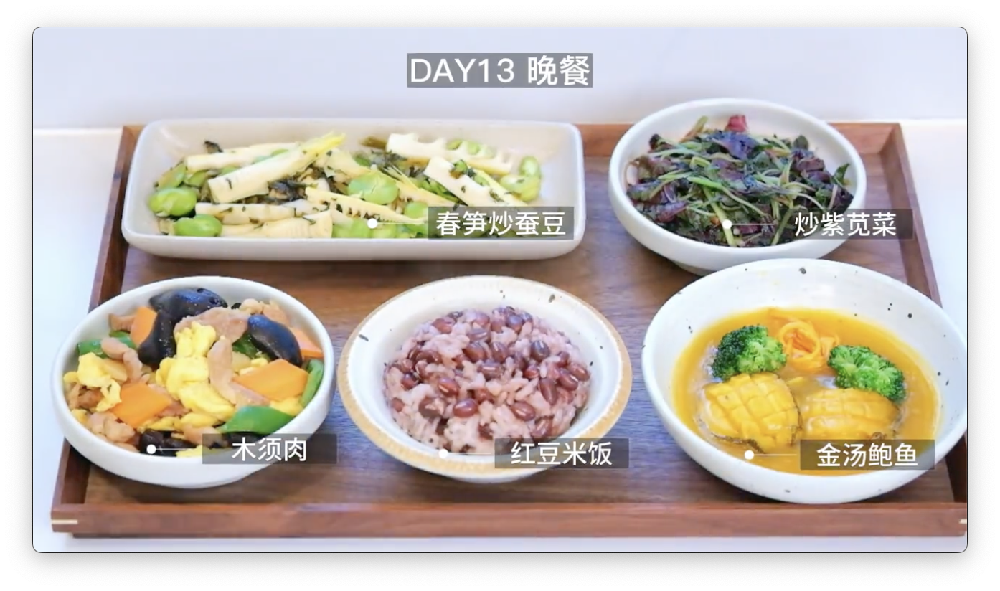

- 红豆饭
- 金汤鲍鱼（鲍鱼补锌补碘，南瓜金汤养胃）
  - 南瓜 250g 切块加入 500g 水打成南瓜汤
  - 过滤后即为简易版的金汤
  - 西蓝花焯水，鲍鱼改花刀，焯水去腥
  - 锅中下入金汤和虫草花，盐和蚝油调味
  - 下入鲍鱼，小火煨 3min，出锅放 2 块西蓝花
- 木须肉
  - 猪肉切片，胡萝卜、甜椒切块，木耳泡发焯熟，鸡蛋划散备用
  - 猪肉和胡萝卜炒过后放入木耳和甜椒
  - 再加盐、生抽、鸡蛋翻炒均匀即可
- 蚕豆炒春笋（时令）
  - 春笋切段和蚕豆一起焯水
  - 锅中加入雪菜、春笋和蚕豆，加盐、糖、生抽调味即可
- 炒紫苋菜（高钙、高叶酸、高维 C）
  - 加盐焯水，先放茎再放叶，变软即可捞出
  - 蒜片爆香，加入苋菜和盐、糖翻炒

加餐：
- 椰青

---

### Day14 ✅

#### 早餐

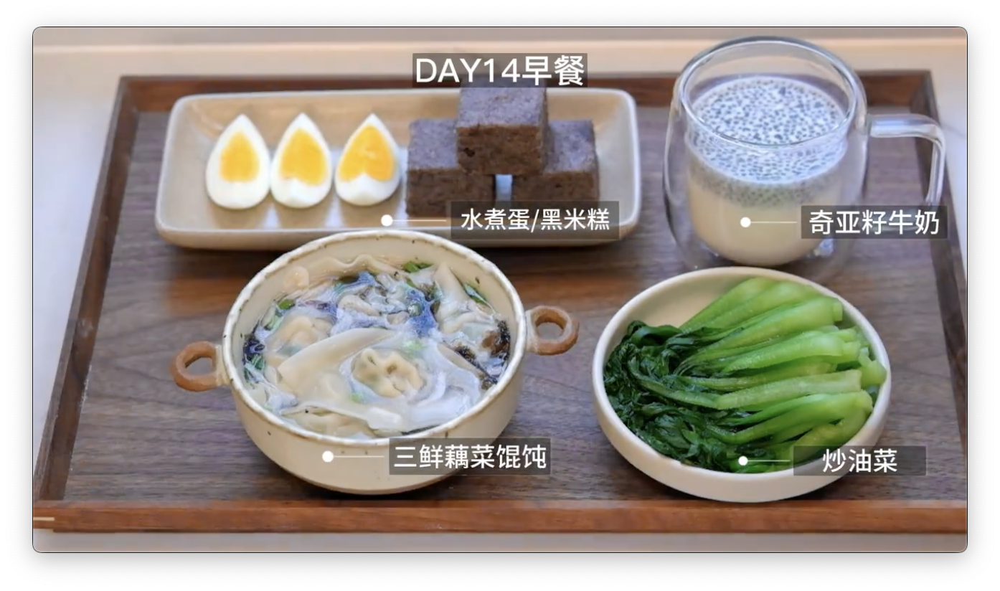

- 三鲜藕菜馄饨
  - 小油菜 200g（切碎）、猪肉 200g、虾仁 100g、莲藕 50g、山药 50g（分别打碎），混合，加入盐 3g、生抽 15g、蚝油 5g、芝麻油 10g、葱姜各 5g（葱姜水）
  - 包馄饨
  - 食用：碗底放盐、葱花、紫菜和猪油，冲入馄饨汤
- 水煮蛋
- 黑米糕
- 炒油菜

加餐：
- 奇亚籽牛奶
  - 奇亚籽先用少量热水泡 10min，然后冲入牛奶

#### 午餐

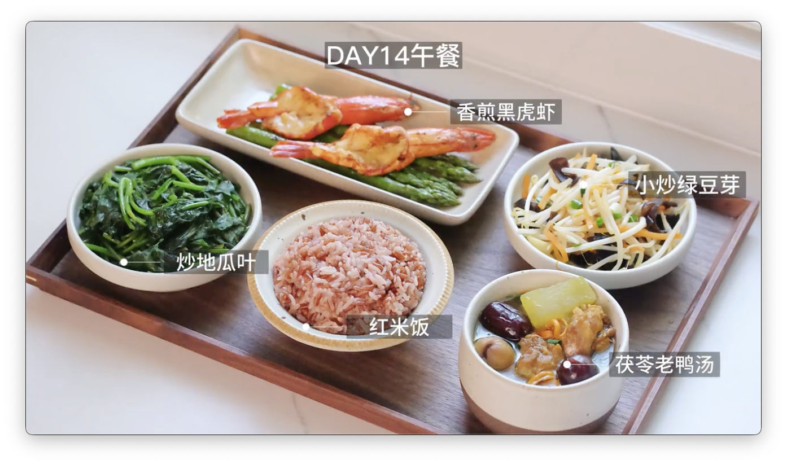

- 红米饭
- 茯苓老鸭汤（安心养神，活血利水）
  - 桂圆 6 颗、红枣 6 颗、茯苓 15g
  - 冬瓜去皮切块，鸭肉去除厚皮减少油脂、加姜片和料酒焯水
  - 倒入锅中，加桂圆、红枣、茯苓和开水，中小火焖煮 1h
  - 加入冬瓜块和虫草花，继续小火焖煮 30min
  - 加盐调味
- 香煎黑虎虾
  - 黑虎虾去须，开背去虾线，加盐腌制 30min
  - 锅中煎至虾肉微黄至熟取出装盘
  - 放入芦笋加盐翻炒
- 小炒绿豆芽
  - 胡萝卜刨丝、木耳切小块，和豆芽加盐、生抽下锅翻炒
- 炒地瓜叶

加餐：
- 全麦面包 + 低糖版草莓酱
  - 400g 草莓 + 20g 白糖打碎，小火熬制 5min 至浓稠，放入玻璃罐中冷藏可保存 1 周

#### 晚餐

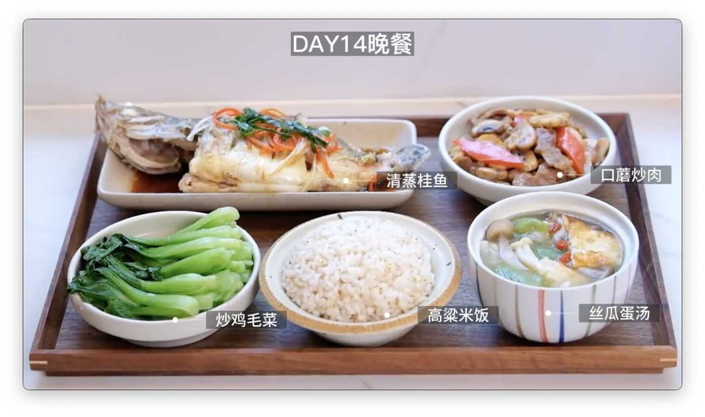

- 高粱米饭
- 丝瓜蛋汤（通乳下奶）
  - 丝瓜削皮切块，然后用盐腌 10min，再把水挤掉（去土腥味）
  - 鸡蛋（3 个）煎好切块
  - 放入所有食材（+ 海鲜菇），加开水煮一会，最后放枸杞和盐即可
- 清蒸桂鱼
  - 桂鱼背部改到，塞入姜片，蒸 10min
  - 加蒸鱼豉油，葱丝，淋热油激发香味
- 口蘑炒肉
  - 猪肉、口蘑切片，先将猪肉炒熟，然后下入口蘑炒出汁
  - 放入甜椒、盐、生抽、蚝油、水淀粉勾芡调味
- 炒鸡毛菜

加餐：
- 红枣花生椰肉饮
  - 椰肉 50g、花生 10g、糯米 10g、红枣 15g
  - 红枣去核，加入 500ml 水，豆浆模式

---

## Week 3

---

### Day15 ✅

#### 早餐

- 吐司牛奶布丁
  - 吐司两片切块放入烤盘
  - 2 个鸡蛋加入 200ml 牛奶，打散后倒入吐司中
  - 烤箱 180 度烤 20min
  - 加一些蓝莓、草莓，撒上椰蓉装饰
- 红豆牛奶
  - 红豆粥前一晚预约好，第二天加一些牛奶即可，喜欢甜可以加一些红糖
- 拌豌豆苗（day08 早餐）

加餐：
- 胡萝卜苹果汁
  - 苹果 150g、胡萝卜 75g、温水 500ml，打成果汁

#### 午餐

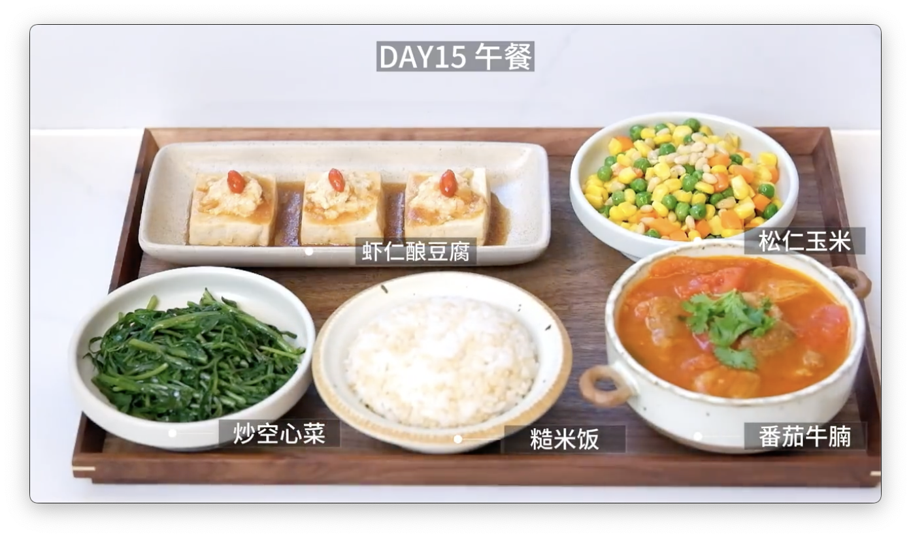

- 糙米饭
- 番茄牛腩
  - 牛腩焯水，番茄去皮、切块
  - 葱姜爆香后，下番茄（留 1/4）炒出汁，下入牛腩，加生抽 2 勺、蚝油半勺翻炒
  - 加开水焖煮 1h（可多炖一会更软烂），加盐调味
  - 加入剩下的番茄，加点香菜提味
- 虾仁酿豆腐
  - 豆腐切厚方块，中间挖孔，挖出的豆腐备用，和虾仁一起加盐、姜末打成泥
  - 填入豆腐虾滑，枸杞点缀
  - 再搭配酱汁：姜蒜末各 3g，白醋 5g，蚝油 5g，生抽 10g，淀粉 3g，饮用水 100ml
  - 豆腐盖上锅盖焖煎至底部金黄，倒入调好的酱汁，不断浇汁到豆腐上，最后收汁即可
- 松仁玉米
  - 胡萝卜 + 玉米 + 豌豆焯水
  - 冷锅下入盐 3g，白糖 5g，橄榄油 10g，饮用水 50g，熬汁
  - 下入什锦菜，加入水淀粉勾芡，翻炒收汁
  - 最后撒上松仁即可
- 炒空心菜

> 加餐：
> - 雷允上月子膏方

#### 晚餐

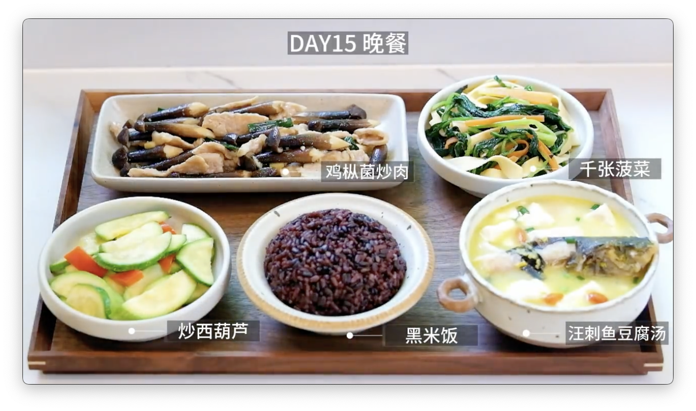

- 黑米饭
- （汪刺）鱼豆腐汤
  - 鱼改刀，嫩豆腐切块
  - 先煎两个鸡蛋，再把鱼煎至两面金黄
  - 下嫩豆腐，冲入开水，加荷包蛋一起煮
  - 最后加入枸杞、葱花点缀
- 鸡枞菌炒肉
  - 猪肉切片，加盐，生抽，淀粉和食用油腌制入味，加入锅中划散盛出备用
  - 鸡枞菌焯水后倒入锅中煸炒，再倒入猪肉，加盐、蚝油、葱段翻炒
- 炒西葫芦
  - 西葫芦切片，红甜椒切块，翻炒后加盐、糖
- 千张拌菠菜
  - 菠菜、千张分别焯水，去草酸和豆腥味
  - 再搭配些胡萝卜丝，加盐、糖、少量蚝油调味即可

加餐：
- 无糖黑芝麻饼 + 黑豆豆浆

---

### Day16 ✅

#### 早餐

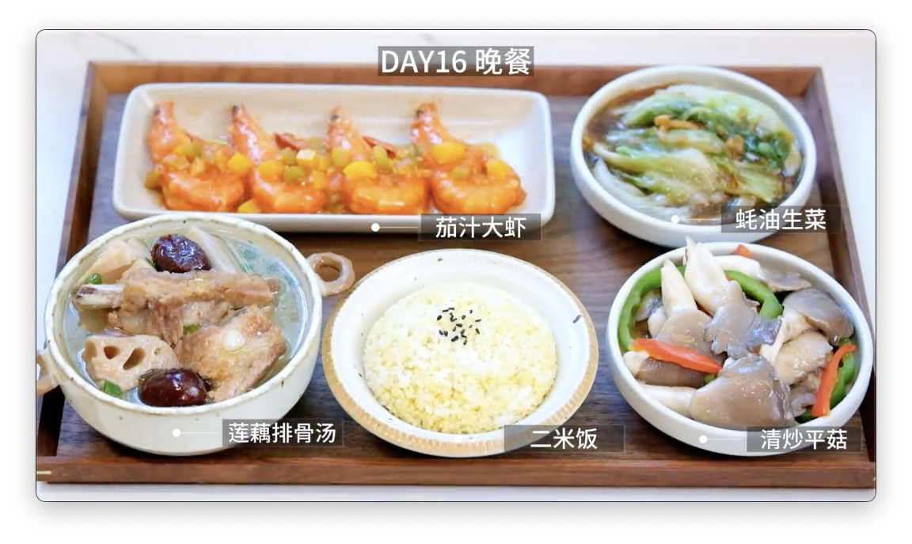

- 樱花虾蒸蛋
  - 2 颗鸡蛋加盐打散，再加入 100ml 清水，撇去浮沫
  - 放入樱花虾蒸 15min
  - 出锅后放几片秋葵（焯过水）点缀
  - 吃的时候加点生抽、香油
- 山药 | 红薯 | 紫薯泥
  - 切片，蒸 15min，分别加入少量白糖和牛奶，放入破壁机搅拌，用裱花袋挤成冰淇淋状
- 白灼秋葵
  - 秋葵对半切开，焯水，锅中加盐和食用油
  - 淋上调好的白灼汁即可

加餐：
- 酒酿汤圆
  - 冷水下红枣多煮会
  - 煮沸后下入小汤圆、酒酿、鸡蛋液和枸杞

#### 午餐

- 红米饭（铁含量较高）
- 奶香蘑菇汤
  - 准备一份简化的法式白汁：黄油 20g、面粉 20g、牛奶 400ml，熬煮一会，略浓稠即可
  - 香菇、口蘑切片，下锅煸至两面金黄
  - 放入洋葱碎和迷迭香炒出香味
  - 炒好的蘑菇 + 白汁倒入破壁机搅拌模式
  - 最后加盐调味，收汁至喜欢的浓度
  - 放些煎好的蘑菇片和橄榄油点缀
- 烤秋刀鱼
  - 秋刀鱼两面撒盐、刷橄榄油腌制 30min，烤箱 180 度烤 10min
  - 吃的时候搭配柠檬汁可以去腥
- 肉沫豆角
  - 肉沫煸炒出油脂厚加入豆角丁翻炒至熟透

加餐：
- 红枣燕麦银耳羹
  - 红枣 5 颗，干银耳 4g，奇亚籽燕麦 20g，饮用水 800ml
  - 倒入破壁机制作即可

#### 晚餐

- 二米饭（小米 + 白米）
- 莲藕排骨红枣汤
  - 排骨加姜片料酒焯水，放入锅中翻炒去油
  - 加入开水，放入粉藕和红枣，盖盖小火炖煮 1.5h
  - 盐和葱花调味即可
- 茄汁大虾
  - 大虾去须开背去虾线后焯水
  - 番茄去皮下锅炒出汁，加入红绿彩椒、盐、糖、生抽调味
  - 下入大虾，收汁入味即可
- 素炒平菇
- 蚝油生菜

加餐：
- 桂圆山药小米粥
  - 小米 75g，山药 150g、桂圆 12 颗、饮用水 1200ml
  - 熬煮半小时后加入枸杞点缀即可

---

### Day17 ✅

#### 早餐

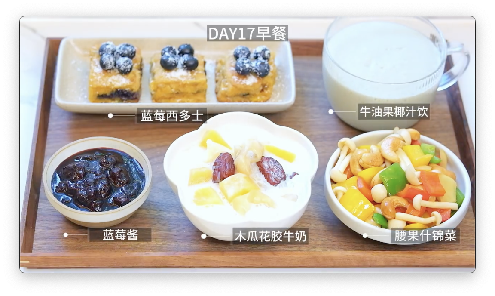

- 自制吐司（面包机）
  - 蓝莓果酱：蓝莓 400g、糖 40g、柠檬汁（半个），使用面包机制作
  - 蓝莓西多士：吐司切去边缘刷蓝莓酱，再盖一片吐司，裹蛋液煎至两面金黄，放几颗蓝莓摆盘，撒上椰蓉即可
- 木瓜花胶牛奶
  - 木瓜 200g、红枣 6 颗、花胶两条、干银耳 4g、纯牛奶 250ml
  - 所有食材加水小火炖煮 30min，最后加入 250ml 牛奶即可
- 腰果什锦菜
  - 彩椒（红黄绿）切段（维 C 含量高）
  - 白玉菇煎过后加入彩椒和腰果，盐和耗油调味

加餐：
- 牛油果香蕉椰饮
  - 香蕉、牛油果加椰汁放入破壁机打成奶昔

#### 午餐

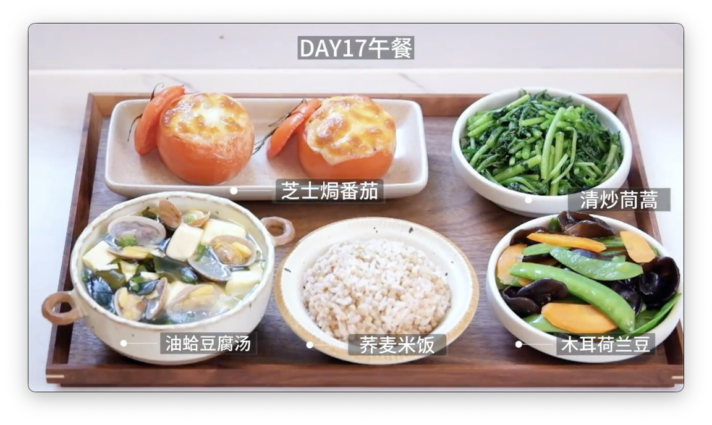

- 荞麦米饭
- 芝士焗番茄（芝士钙含量高）
  - 番茄去头，挖孔备用
  - 杏鲍菇、洋葱切丁，牛肉切丁后用盐、蚝油、淀粉腌制，一起下锅翻炒至变色
  - 放凉后加入马苏里拉芝士碎搅拌，填入番茄中
  - 顶部再撒满芝士碎，烤箱 180 度烤 10min
- 油蛤裙带菜豆腐汤
  - 裙带菜提前泡发
  - 豆腐、裙带菜加水煮沸后加入油蛤，最后盐和葱花调味
- 木耳荷兰豆
  - 荷兰豆、木耳、胡萝卜一起焯水
  - 入锅翻炒，加盐糖和蚝油调味即可
- 清炒茼蒿

加餐：
- 芝士面包 + 西红柿饮
  - 牛角包从中间切开（不切断），放入芝士，微波炉叮 30s 即可
  - 掏出的番茄和香蕉一起放入料理机，加水搅拌（果蔬汁）

#### 晚餐

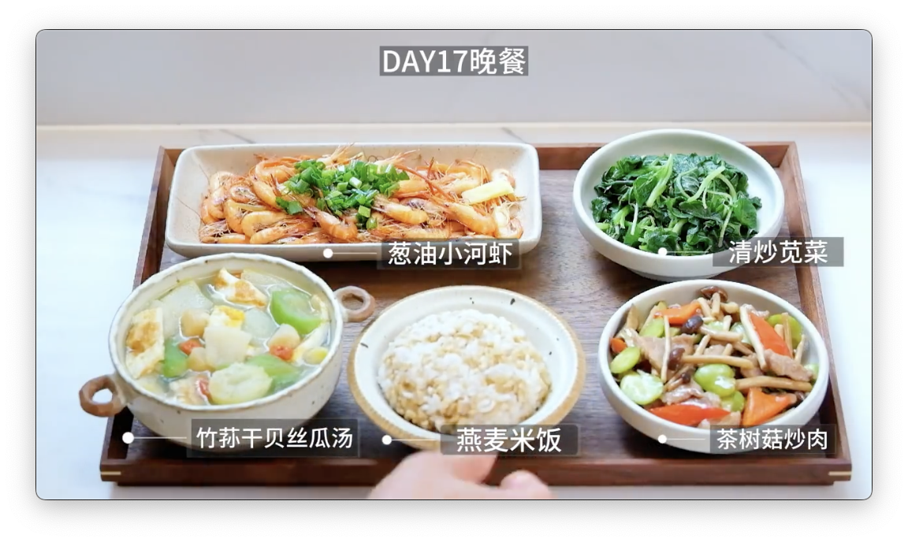

- 燕麦米饭
- 干贝竹荪丝瓜汤
  - 泡好的竹荪用剪刀剪去底部的白圈，顶部的伞裙也要去掉，切段，丝瓜切滚刀块
  - 干贝炒香后放入丝瓜翻炒，倒入开水、竹荪和煎好的荷包蛋
  - 煮 5min 后加盐和枸杞即可
- 葱油小河虾
  - 锅中加盐和葱姜蒜，烧沸后下入小河虾，再次沸腾后捞出
  - 加葱花和生抽，浇上热油即可
- 茶树菇炒肉
  - 茶树菇切段，瘦肉切片（盐和淀粉腌制）
  - 蚕豆和茶树菇焯水
  - 肉片下锅划散后加入所有食材（加胡萝卜片），盐和生抽调味
- 清炒苋菜

加餐：
- 自制椰汁
  - 椰青开口取出椰肉和椰汁
  - 取椰肉 50g、椰汁和 200ml 牛奶，破壁机搅拌

---

### Day18 ✅

#### 早餐

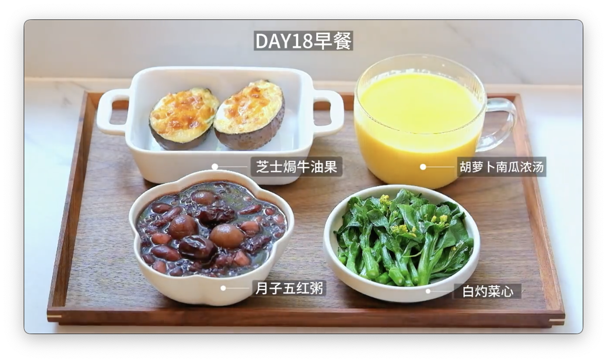

- 月子五红粥
  - 红枣 8 颗、桂圆 10 颗、花生 30g、黑米 50g、红芸豆 50g、红米 50g、红豆 50g、枸杞 15g
- 芝士焗牛油果
  - 牛油果对半切开，果核位置刚好可以倒入一个鹌鹑蛋，再摆上芝士碎，烤箱 180 度烤 10min
- 白灼菜心

加餐：
- 胡萝卜南瓜浓汤
  - 南瓜 250g、胡萝卜 125g 切块，倒入破壁机，加入 400ml 饮用水，浓汤模式，最后倒入 250ml 牛奶

#### 午餐

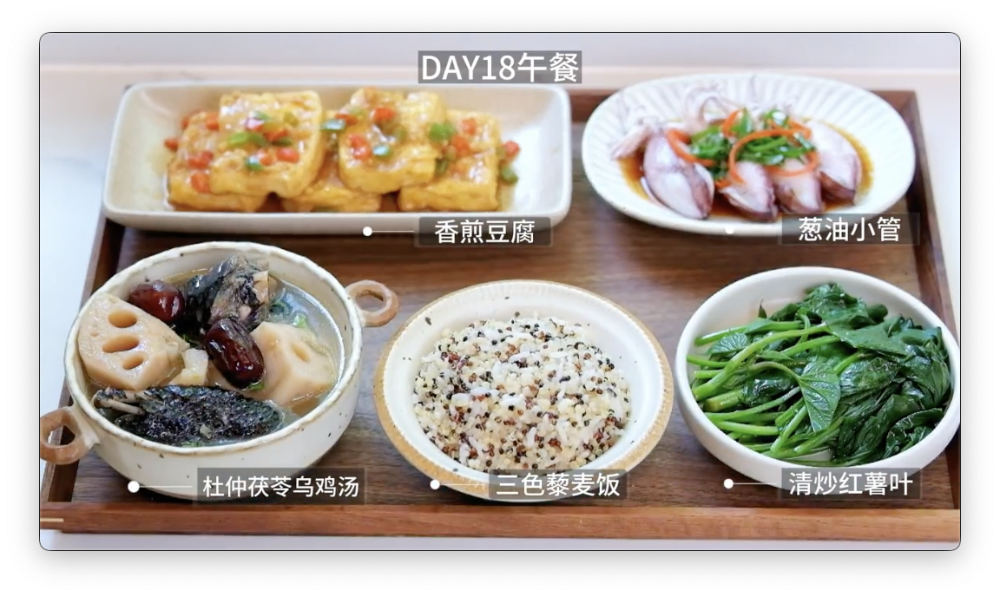

- 三色藜麦饭
- ~~ 葱油小管（小鱿鱼）~~
- 杜仲茯苓乌鸡汤
  - 红枣 5 颗，杜仲 5g，陈皮 3g，党参 3g，茯苓 15g
  - 乌鸡切块加姜片焯水后，放入锅中翻炒，再加入热水并撇去浮沫
  - 加入辅料，醪糟 30g，最后加入莲藕，盖盖焖煮 1h
  - 出锅加盐和葱花即可
- 香煎豆腐
  - 甜椒切丁，老豆腐切块
  - 酱汁：姜蒜末各 3g，红绿甜椒各 15g，盐糖各 3g，生抽 15g，蚝油 8g，饮用水 200ml
  - 豆腐裹蛋液和面粉，在锅中煎至两面金黄，倒入酱汁，盖盖小火焖 3min，收汁即可
- 清炒红薯叶

加餐：
- 银耳莲子羹
  - 干银耳 5g、莲子 20g、百合 10g、枸杞 10g、红枣 5 颗

#### 晚餐

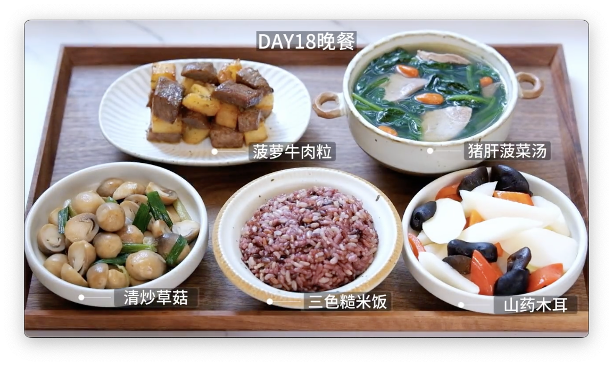

- 三色糙米饭
  - 糙米、黑米、红米 : 白米 = 1 : 1
- 猪肝菠菜汤（补铁，补维 A）
  - 猪肝最好每周安排一次
  - 猪肝切片洗净后加盐、料酒和淀粉腌制去腥（做猪肝汤不用太多）
  - 水中放姜丝烧沸后下猪肝，变色后就放入菠菜（焯过水），加入盐、菌菇粉、枸杞和香油调味
- 菠萝牛肉粒
  - 牛肉、菠萝切块，菠萝加盐水浸泡 10min（减少菠萝蛋白酶），牛肉加盐、生抽、蚝油、食用油腌制 10min
  - 将牛肉煎上色，倒入菠萝粒翻炒，最后撒上欧芹碎或香菜
- 山药炒木耳
  - 甜椒和山药切块，木耳和山药焯水至断生
  - 一起下锅翻炒，加入盐、糖、水淀粉调味
- 清炒草菇
  - 草菇焯水去异味，对半切开
  - 葱姜爆香后下锅翻炒，煎出香味
  - 加少量的水逼出鲜味，最后加入盐、水淀粉和葱段即可

加餐：
- 坚果藕粉

---

### Day19 ✅

#### 早餐

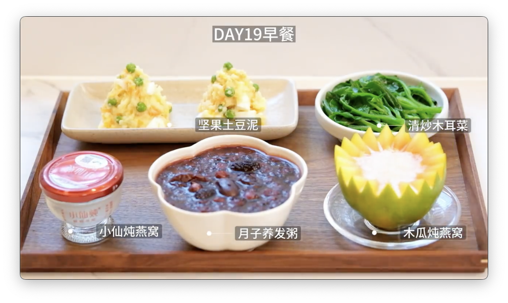

- 月子养发粥
  - 干桑葚 20g、枸杞 15g、黑米 100g、芡实 50g、红枣
- 坚果土豆泥沙拉
  - 胡萝卜、土豆切块，和青豆、鸡蛋一起蒸 10min，坚果打碎
  - 胡萝卜和土豆压成泥，加入盐、牛奶喝橄榄油搅拌均匀
  - 再倒入青豆、鸡蛋、坚果，搅拌均匀
- 清炒木耳菜

加餐：
- 木瓜炖燕窝
  - 雕花刀做个木瓜盅，去籽后放入几块木瓜，蒸 5min 左右
  - 加入燕窝和牛奶即可

#### 午餐

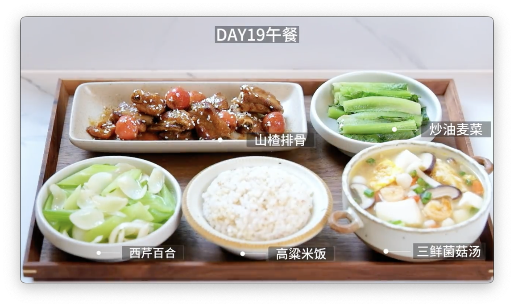

- 高粱米饭（高粱米: 白米 = 1:1）
- 山楂排骨（山楂能促进食欲和帮助消化，非常适合月子期食用，孕期不建议）
  - 山楂去核，排骨焯水
  - 少量冰糖炒糖色，给排骨炒上色
  - 加热水没过排骨，加入一半的山楂，放入少量盐和 2 勺生抽
  - 盖盖小火焖煮 45min，加入剩下的山楂翻炒即可
- 三鲜菌菇汤
  - 香菇切片，虾仁用盐和料酒腌制，鸡蛋提前煎好切块
  - 把白玉菇和香菇煸炒出香味，再加入虾仁翻炒
  - 然后加入热水、豆腐、鸡蛋和盐煮 5min
  - 最后加入泡好的枸杞和葱花即可
- 西芹百合
  - 西芹削皮切块，和百合一起焯水去生
  - 调料汁：盐、糖、水淀粉
  - 食材和料汁一起倒入锅中快速翻炒即可
- 炒油麦菜

加餐：
- 鹰嘴豆豆浆
  - 花生 10g、核桃 10g、红枣 3 颗、鹰嘴豆 50g，600ml 饮用水

#### 晚餐

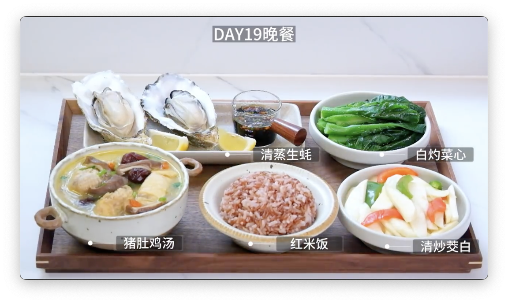

- 红米饭
- 猪肚鸡汤
  - 党参 5g、枸杞 10g、莲子 25g、红枣 8 颗
  - 鸡块加葱姜料酒焯水，处理过的猪肚切块
  - 锅中加姜片、少量花椒粉翻炒后加入鸡块
  - 加入开水撇去浮沫，放入党参、莲子和红枣，中小火焖煮 1h
  - 最后加入泡发的枸杞、盐和葱花
- 清蒸生蚝（补锌）
  - 生蚝刷洗干净，水开后放入锅中蒸 5min
  - 蘸汁：葱姜末各 3g、生抽 2 勺、香醋 1 勺、蚝油半勺、白糖 3g、盐 0.5g
- 清炒茭白
  - 茭白剥皮，切片后焯水断生，和青红甜椒一起翻炒
  - 盐、糖和水淀粉调味即可
- 白灼菜心

加餐：
- 椰青

---

### Day20 ✅

#### 早餐

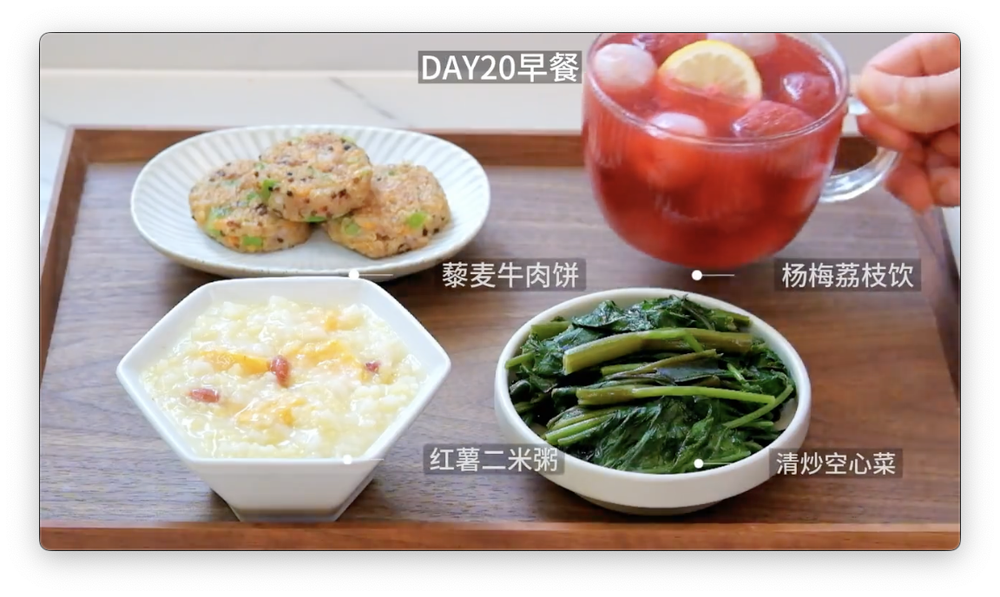

- 红薯二米粥
  - 小米 50g、大米 50g、枸杞 10g、红薯 200g
- 藜麦牛肉饼
  - 三色藜麦煮 15min 捞出备用
  - 牛肉加盐、生抽和蚝油打成肉沫
  - 食材：熟藜麦 200g、面粉 50g、鸡蛋 1 个、胡萝卜 30g、洋葱 30g、青甜椒 60g、牛肉 150g、生抽 8g、蚝油 5g、盐 3g
  - 搅拌均匀揉成小圆饼，放入锅中两面煎熟
- 清炒空心菜

加餐：
- 杨梅荔枝饮
  - 杨梅 500g、荔枝 10 颗、饮用水 500ml、柠檬 1/3 个
  - 杨梅洗过后焯水 10s，然后加水煮 10min，关火放荔枝，放凉后加几片柠檬

#### 午餐

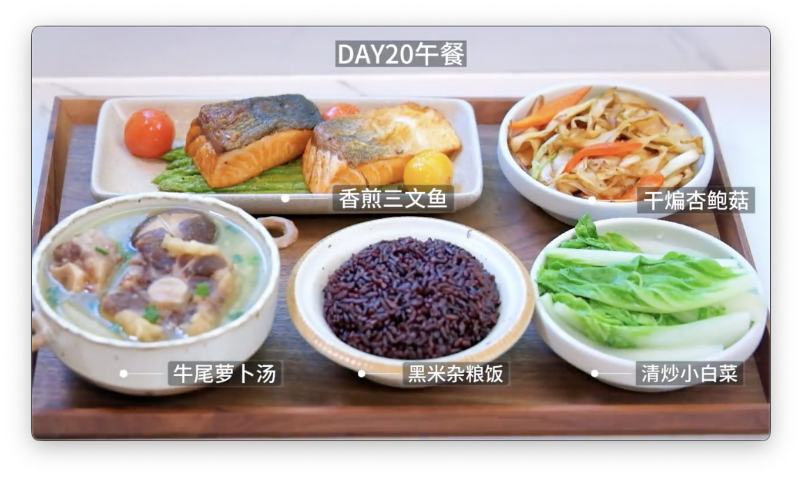

- 黑米饭
- 香煎三文鱼
  - 三文鱼擦干后用盐腌制半小时
  - 三面煎至金黄，再煎一些芦笋和小番茄当配菜，撒点盐调味即可
  - 可搭配些柠檬汁，去腥解腻
- 牛尾萝卜汤（牛尾胶原蛋白含量丰富）
  - 白萝卜切块
  - 牛尾加姜片焯水，加开水焖煮 1h
  - 放入萝卜块和香菇，加盐调味，盖盖焖煮 30min，撒葱花即可
- 干煸杏鲍菇
  - 杏鲍菇刨成薄片，先用盐抓出水后再煸炒
  - 加入葱段、甜椒和生抽翻炒即可
- ~~小白菜~~

加餐：
- 姜撞奶

#### 晚餐

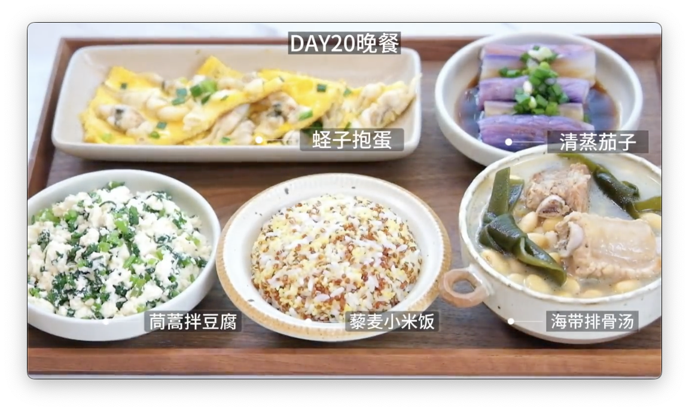

- 藜麦小米饭
  - 红藜麦: 小米: 大米 = 1:1:2
- 海带黄豆排骨汤
  - 排骨 400g、干黄豆 100g、海带节 200g
  - 排骨加料酒冷水下锅焯水，把带脂肪的一面煎一下，加入提前泡好的黄豆，倒入开水，小火焖煮 1h 至软烂
  - 放入海带和盐煮 10min
- 蛏子抱蛋
  - 蛏子加开水泡开口，把肉剔出来沥水
  - 热锅下蛋液、蛏子肉、葱花和盐即可
- 茼蒿拌豆腐
  - 老豆腐和茼蒿焯水断生
  - 茼蒿切小段，豆腐抓碎后加盐、香油
  - 混合在一起
- 清蒸茄子
  - 小茄子对半切开后泡盐水（不易变色）
  - 冷水下锅大火蒸 10min 即可
  - 酱汁：生抽 1 勺、香醋半勺、香油半勺、白糖 2g、盐 1g、葱花适量

加餐：
- 山药豆浆

---

### Day21 ✅

#### 早餐

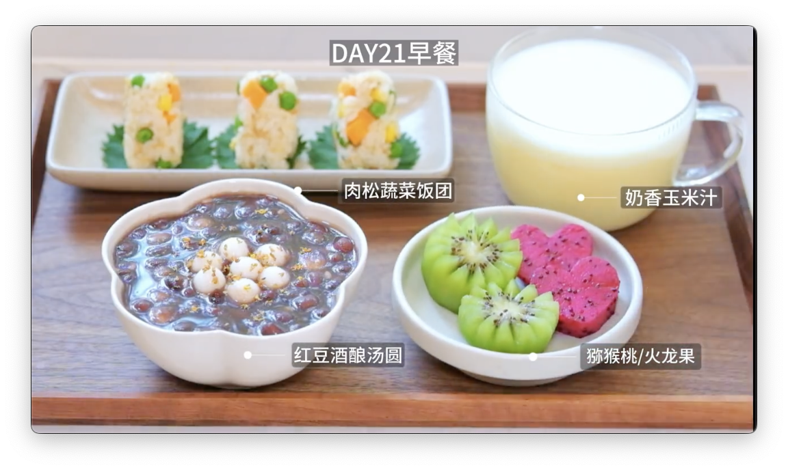

- 红豆酒酿圆子
  - 前一晚预约红豆汤，早上加入酒酿和小汤圆，汤圆浮起来即可
  - 爱吃甜可以加点红糖，撒点桂花点缀
- 肉松蔬菜饭团
  - 水中加盐和橄榄油，放入玉米、青豆、胡萝卜粒焯熟
  - 和米饭、肉松、盐一起抓拌均匀
- 猕猴桃 / 火龙果

加餐：
- 奶香玉米汁
  - 小米 15g、大米 15g、甜玉米 100g、牛奶 200ml
  - 加入 400ml 饮用水，米糊模式，牛奶最后加

#### 午餐

- 燕麦杂粮饭
- 油蛤丝瓜汤
  - 丝瓜切块翻炒，倒入开水煮 3min 后下入油蛤，加点料酒、姜丝和盐
- 肉酿豆腐
  - 豆腐切厚方块，中间挖孔，挖出的豆腐和肉沫一起调成肉馅，填回豆腐上
  - 酱汁：盐 2g，生抽 15g，淀粉 2g，饮用水 100ml
  - 先煎豆腐带肉馅的一面，煎至两面金黄，倒入调好的酱汁，盖盖小火焖煮 3min，最后收汁撒上葱花即可
- 番茄炒蛋
  - 番茄去皮切块，鸡蛋 4 个提前炒散
  - 番茄下锅炒出沙，加一点清水，再下入鸡蛋，加盐、糖、水淀粉、葱花调味
- 清炒包心菜

加餐：
- 混合坚果

#### 晚餐

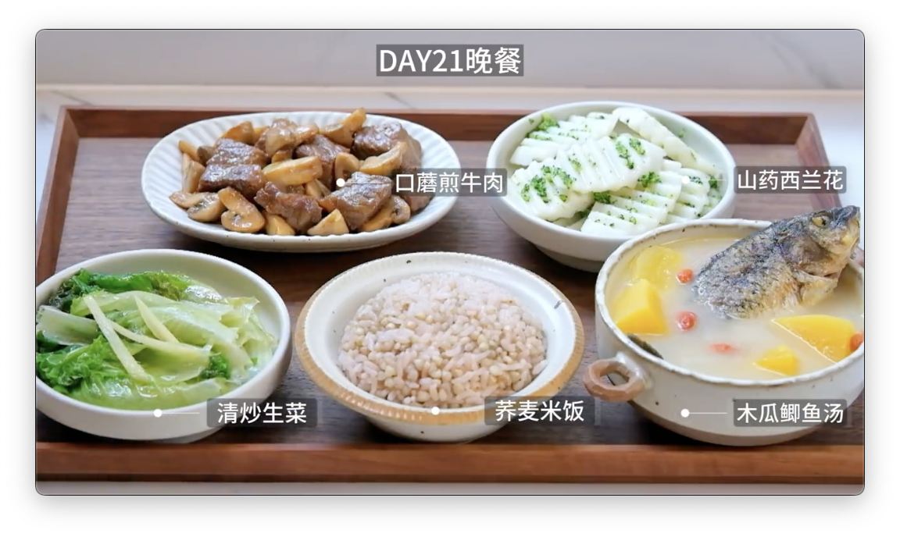

- 荞麦杂粮饭
- 木瓜鲫鱼汤（促进乳汁分泌，减轻炎症）
  - 木瓜削皮切块，鲫鱼煎至两面金黄，倒入开水
  - 木瓜打底，放鲫鱼，倒入开水，炖煮 20min
  - 最后加点盐和枸杞即可
- 口蘑煎牛肉
  - 牛肉、口蘑切块，牛肉加盐、生抽、蚝油、盐腌制 10min
  - 牛肉煎熟后盛出，煎口蘑，然后放牛肉和盐，炒熟即可
- 山药西兰花
  - 山药切片（狼牙土豆切片器），西蓝花把花蕾切下来
  - 山药焯水 3min 至熟，和西蓝花蕾一起翻炒，加少量水、盐即可
- 清炒生菜

加餐：
- 银耳莲子羹

---

## Week 4

---

### Day22 ✅

#### 早餐

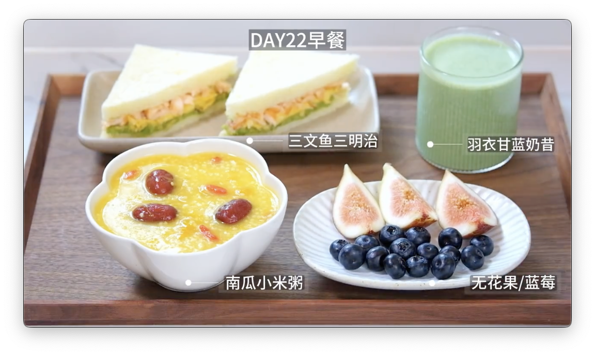

- 小米南瓜粥
  - 小米 100g、枸杞 10g、红枣 8 颗、贝贝南瓜 1 个
- 三文鱼三明治
  - 吐司切掉 4 边
  - 三文鱼用盐腌制后切块，两面煎至金黄，捣碎后加一些柠檬汁去腥
  - 再煎 2 个嫩鸡蛋
  - 牛油果加点盐后压成泥
  - 吐司片涂上牛油果酱，放上鸡蛋和三文鱼（可加点沙拉酱），盖上吐司即可
- 无花果 / 蓝莓

加餐：
- 羽衣甘蓝奶昔（对骨骼好）
  - 香蕉 1 根，羽衣甘蓝（焯水）20g，牛奶 250ml

#### 午餐

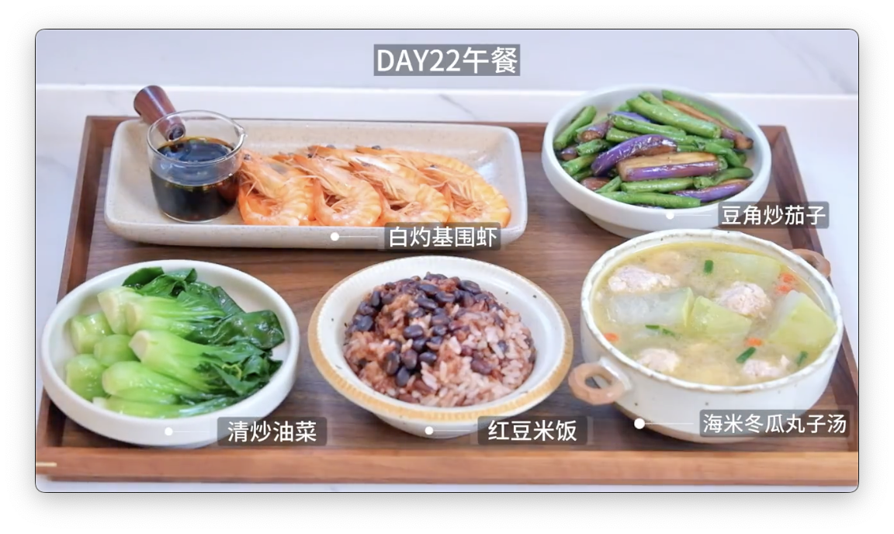

- 红豆米饭
- 海米冬瓜丸子汤
  - 丸子：肉沫加盐、葱姜水、蛋清搅拌后加淀粉搅匀
  - 下海米和干贝炒香（汤会比较鲜），放入冬瓜翻炒后倒入开水
  - 转小火后下入丸子（不容易起沫），加点盐、葱花、枸杞即可
- 白灼基围虾
  - 水中加葱姜，下入基围虾煮 1min 左右
  - 白灼汁：（胡萝卜丝、葱丝）生抽、盐、水和油，小火烧开即可
- 豆角炒茄子
  - 茄子切段后加盐杀水
  - 将豆角和茄子煎熟，加盐、白糖、生抽调味
- 清炒油菜

加餐：
- 芝士可颂 + 牛奶
  - 可颂对半切开加芝士，微波炉叮几秒

#### 晚餐

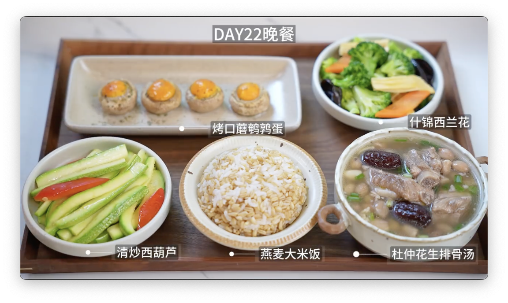

- 燕麦米饭
- 杜仲花生排骨汤
  - 党参 3g、杜仲 6g、花生 80g、红枣 8 颗、排骨 500g
  - 排骨加生姜料酒焯水后捞出
  - 锅中加入所有食材和 30g 醪糟，加热水盖盖小火煮 1h
  - 盐、葱花、枸杞调味即可
- 烤口蘑鹌鹑蛋
  - 口蘑去根，洗净后放点芝士，加颗鹌鹑蛋和海盐提味
  - 小个的口蘑直接加芝士，烤箱 180 度烤 15min
  - 最后撒点欧芹碎提香
- 什锦西兰花
  - 锅中加水、油和食用盐，先把木耳、腐竹和胡萝卜焯断生，再把西蓝花焯熟
  - 一起下锅翻炒，加入盐、白糖、水淀粉调味即可
- 清炒西葫芦

加餐：
- 椰汁西米露

---

### Day23 ✅

#### 早餐

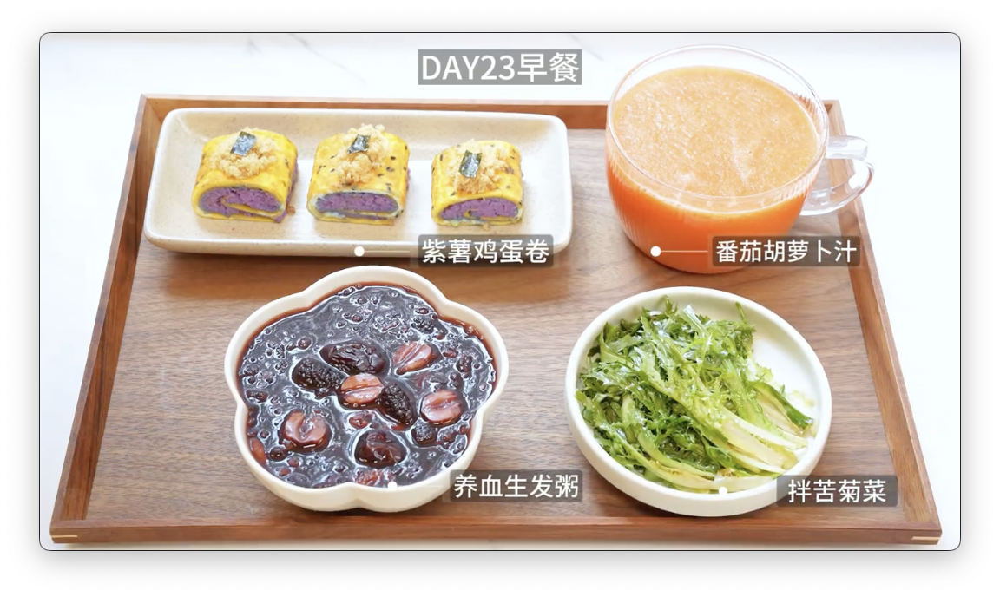

- 养血生发粥（预防产后掉发）
  - 黑米 50g、糯米 50g、莲子 20g、干桑葚 15g、枸杞 10g、制首乌 5g、芡实 20g
  - 制首乌煮 1h，去渣留汤，高压锅熬粥
- 紫薯鸡蛋卷
  - 紫薯去皮蒸 20min，加牛奶搅拌成泥
  - 煎鸡蛋饼（2 个鸡蛋，黑芝麻，盐），定型后倒出，抹上紫薯泥卷起来，加点海苔肉松提味
- 拌苦菊

加餐：
- 西红柿胡萝卜汁
  - 番茄 2 个和胡萝卜半根，温水 400ml，果汁模式打两次

#### 午餐

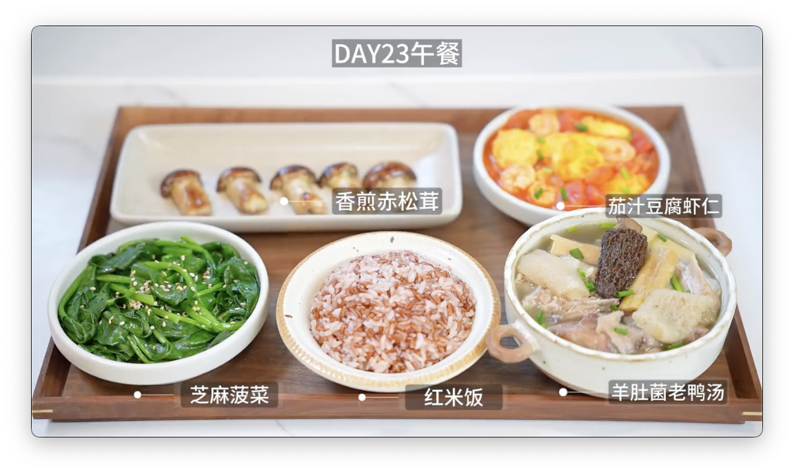

- 红米饭
- 羊肚菌老鸭汤
  - 鸭肉焯水，倒入高压锅，加入羊肚菌、竹荪和笋干（日常加点火腿更好吃），炖 25min 左右，加盐和葱花调味
- 茄汁豆腐虾仁
  - 玉子豆腐切块，煎至两面金黄
  - 番茄切块炒出沙，加入玉子豆腐和虾仁，加盐、生抽、水淀粉调味即可
- 香煎赤松茸
  - 赤松茸对半切开，煎至两面金黄，撒点盐调味即可
- 芝麻菠菜

加餐：
- 百合木瓜甜薯汤
  - 红薯 1 个、红枣 8 颗、木瓜半个、百合 20g，可以加点红糖

#### 晚餐

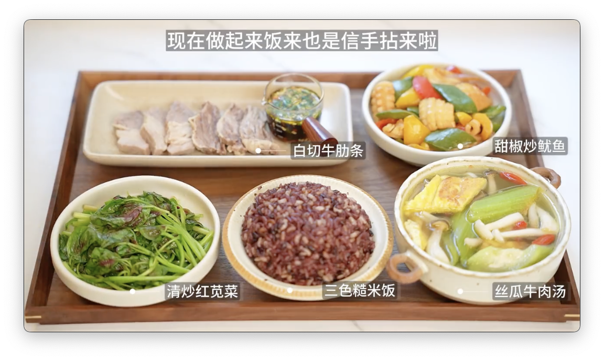

- 三色糙米饭
- 白切牛肋条
  - 牛肋条焯水后捞出，和胡萝卜西芹洋葱一起炖 1h
  - 切片后搭配蘸汁吃
  - 蘸汁：姜末、葱花、白芝麻各 5g 淋热油，酱油 15g，香醋 10g，香菜 5g
- ~~ 甜椒炒鱿鱼~~
- 丝瓜菌菇牛肉汤
  - 煮过牛肋条的汤捞出杂蔬后，放入丝瓜、菌菇和盐
  - 最后加点鸡蛋（煎的鸡蛋饼切块）和枸杞即可
- 清炒苋菜

加餐：
- 山药牛奶

---

### Day24 ✅

#### 早餐

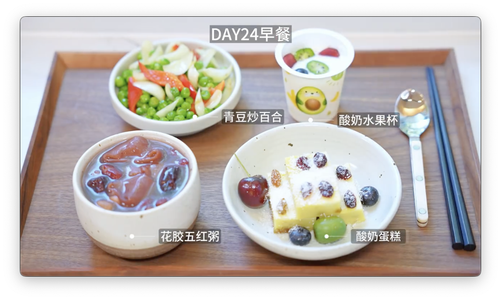

- 酸奶蛋糕
  - 2 个鸡蛋、一杯酸奶（100g），再加入少量糖和 30g 淀粉搅打至无颗粒
  - 烤碗（盘）刷油，倒入蛋糕液，加点葡萄和蔓越莓干，盖保鲜膜厚蒸 30min，切块搭配些水果和椰蓉摆盘即可
- 花胶五红粥
  - 红豆 50g、糯米 50g、红枣 8 颗、花胶 2 条、花生 30g、红芸豆 30g、红米 50g
- 青豆炒百合
  - 青豆、百合、甜椒焯水至断生
  - 倒入盐、糖和水淀粉调的料汁翻炒均匀即可

加餐：
- 酸奶水果杯
- 北海牧场⼩果泥酸奶

#### 午餐

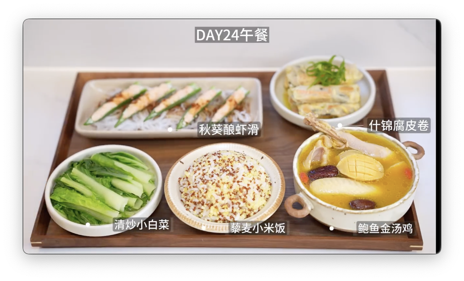

- 藜麦小米饭
  - 藜麦：小米：白米 = 1:1:2
- 鲍鱼金汤鸡
    - 250g 南瓜切块加入 500g 水打成南瓜汤，过滤后即为简易版的金汤
    - 鲍鱼 5 头、干贝 30g、红枣 6 颗、花胶 30g
    - 和焯过血水的鸡（整只）一起放入炖锅，倒入金汤和水
- 秋葵酿虾滑
  - 虾仁加盐、淀粉、蛋清搅打成虾滑，秋葵对半切开
  - 在盘底铺上粉丝，把虾滑抹到秋葵上，蒸 15min
  - 搭配一些低盐生抽即可
- 什锦腐皮卷
  - 茭白 1 根、胡萝卜半根、鸡蛋 1 个、干黄花菜 20g、干木耳 5g、盐 3g、淀粉 6g、蚝油 5g、香油 5g
  - 配菜放在豆皮上卷成卷，蒸 15min，可以淋一点鸡汤更好吃
- ~~ 清炒小白菜~~

加餐：
- 减脂版芝麻糊

#### 晚餐

- 黑米饭
- 茄汁黑鱼片
  - 鱼片加盐、蛋清、姜蒜水、淀粉腌制
  - 大小番茄切块
  - 姜末爆香，加番茄块熬成茄汁
  - 鱼骨煎过后加开水熬成白汤，加入茄汁一起熬 10min
  - 盐和生抽调味，加金针菇和小番茄丰富口感
  - 最后放鱼片煮 1min 即可
- 山药肉沫蒸蛋
  - 铁棍山药（100g）打成泥
  - 肉馅：山药、肉沫 200g、玉米 100g、姜末 3g、盐 3g、生抽 10g、蚝油 5g
  - 肉馅填入小碗，打上鸡蛋，蒸 15min
  - 香油和葱花点缀即可
- 口蘑扒芦笋
  - 芦笋下锅煎熟，加盐调味
  - 再煎口蘑，倒入盐、生抽、蚝油调制的芡汁
  - 最后浇到芦笋上即可
- 清炒油麦菜

加餐：
- 坚果藕粉

---

### Day25 ✅

#### 早餐

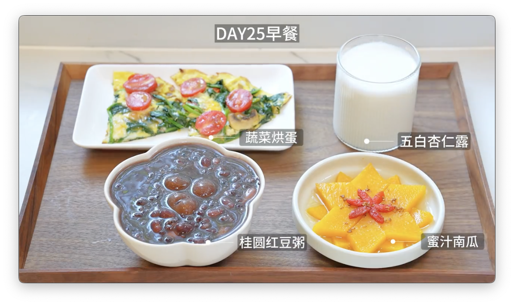

- 桂圆红豆粥
  - 糯米 50g、花生 30g、桂圆 7 颗、红豆 100g、黑米 50g
- 蔬菜烘蛋
  - 口蘑、洋葱、小番茄切块
  - 2 个鸡蛋加盐打散
  - 洋葱煸香后，放入口蘑炒至金黄
  - 放入菠菜和小番茄翻炒几下，淋上蛋液，关火焖 3min，撒点盐调味即可
- 蜜汁南瓜
  - 南瓜切成菱形块，摆好后蒸 10min，点缀枸杞后，淋上调稀的桂花蜂蜜

加餐：
- 五白杏仁露
  - 百合 10g、干淮山药 15g、杏仁 20g、茯苓 15g、莲子 15g
  - 加入冰糖和 600ml 饮用水，豆浆模式

#### 午餐

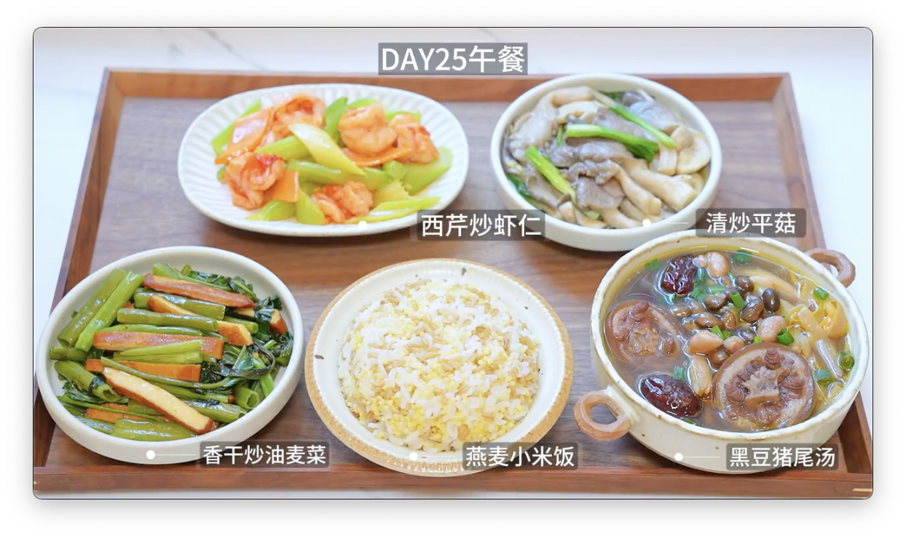

- 燕麦小米饭
- 黑豆猪尾汤
  - 猪尾 1 条、花生 20g、红枣 8 颗、黑豆 30g、干黄花菜 20g
  - 猪尾冷水下锅焯，撇去浮沫
  - 空锅加入所有配料，加一勺醪糟和开水，小火炖煮 1.5h，最后加盐和葱花调味
- 西芹炒虾仁
  - 西芹和胡萝卜焯水断生，虾仁煎熟后盛出
  - 西芹胡萝卜翻炒后加入虾仁，加盐、糖、水淀粉勾芡调味
- 清炒平菇
  - 平菇撕瓣冲洗干净，下锅煎炒后加盐、蚝油、葱段调味
- 香干炒空心菜
  - 香干煎过后加空心菜茎翻炒，然后加入菜叶，加盐糖调味

加餐：
- 月子膏方

#### 晚餐

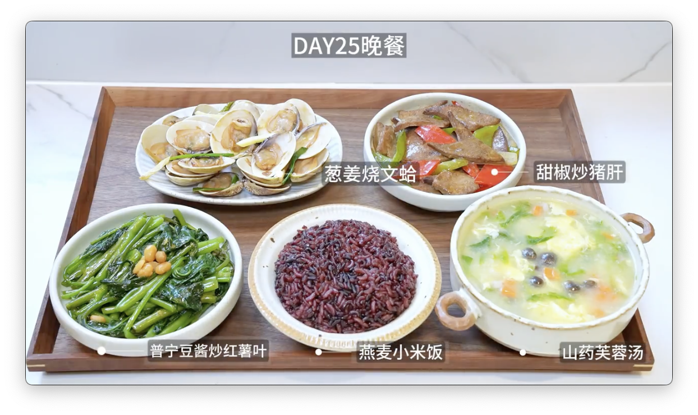

- 紫米杂粮饭
- 山药芙蓉汤
  - 山药打成泥备用
  - 干贝炒香后倒入海鲜菇和胡萝卜丁，再倒入热水和山药泥煮 3min，边搅拌边淋蛋液，最后加点青菜和盐即可
- 彩椒炒猪肝
  - 猪肝加淀粉泡水去腥，水（加姜片）沸后下锅焯水，变色后捞出
  - 酱汁：蚝油 1 勺、生抽 2 勺、盐白糖各 2g、淀粉 1 勺，水 60ml
  - 下洋葱、彩椒翻炒后，加猪肝倒入酱汁快速翻炒
- 葱姜烧文蛤
  - 文蛤冷水（加姜丝）下锅煮至开口
  - 葱姜丝下锅炒香后倒入文蛤，淋入生抽、淀粉和文蛤汤调的酱汁，翻炒均匀即可
- 普宁豆酱炒红薯叶
  - 杆炒断生后下红薯叶和普宁豆酱，翻炒均匀即可

加餐：
- 香蕉奶昔

---

### Day26 ✅

#### 早餐

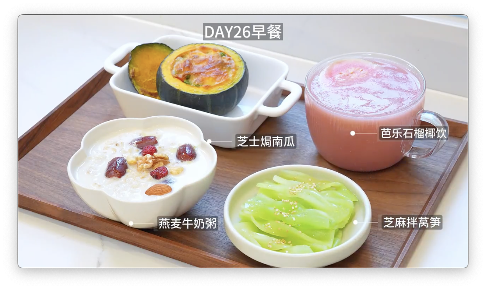

- 燕麦牛奶粥
  - 红枣去核，和生燕麦一起加水煮 10min，最后倒入一杯牛奶，加点坚果
- 芝士焗南瓜
  - 贝贝南瓜开口去籽
  - 海米提前泡发，加玉米、青豆、红甜椒翻炒调味，放凉后加芝士碎拌匀，填入南瓜盅里，顶部再撒上些芝士
  - 烤箱 180 度烤 30min
- 芝麻拌莴笋

加餐：
- 芭乐石榴椰饮 + SIM01 青春菌
  - 益生菌 1 包，椰青 1 个，石榴粒 200g，红心芭乐 1 个
  - 芭乐切块，石榴粒放入裱花袋里挤成石榴汁，倒入椰子水，果汁模式搅拌
  - 可以再加一袋益生菌调理

#### 午餐

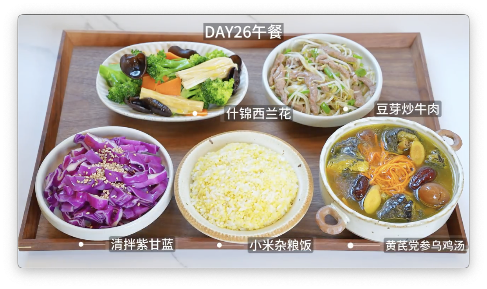

- 小米杂粮饭
- 黄芪党参乌鸡汤
  - 黄芪 10g、党参 5g、乌鸡半只、虫草花 100g、红枣桂圆各 8 颗
  - 乌鸡切块泡血水、冷水下锅焯水
  - 空锅加入所有食材，加醪糟和热水煮 45min
  - 最后加入虫草花和盐，小火 5min 即可
- 豆芽炒牛肉
  - 牛肉加生抽、蚝油、淀粉腌制
  - 煎熟后放入豆芽和葱花，加盐翻炒即可
- 什锦西蓝花
  - 西蓝花、胡萝卜、腐竹、木耳焯水断生
  - 一起加入锅中，加盐、菌菇鲜和水淀粉调的料汁，翻炒均匀即可
- 拌紫甘蓝

加餐：
- 西芹雪梨汁
  - 西芹加雪梨打碎滤汁

#### 晚餐

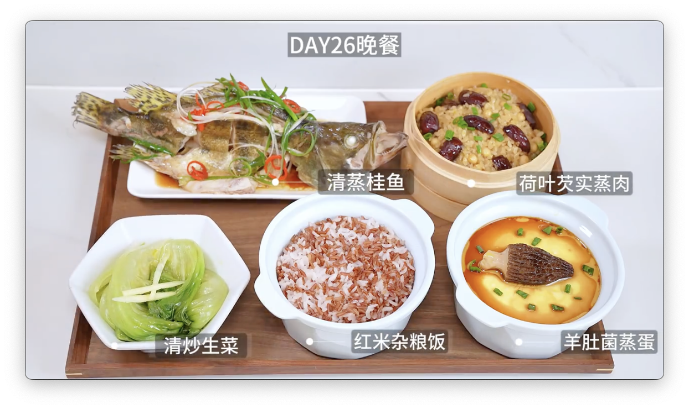

- 红米杂粮饭
- 羊肚菌蒸蛋
  - 羊肚菌洗净后热水泡发 30min
  - 2 个鸡蛋加少量盐打散和 100ml 泡羊肚菌的水混合，蒸 7min 后放入羊肚菌，再蒸 8min，最后香油和生抽调味（80 度蒸 15min，再 15min）
- 荷叶芡实蒸肉
  - 猪肉 200g、生抽 10g、蚝油 5g、盐糖各 2g、芡实 30g、红枣 3 颗、糯米 50g
  - 将糯米、芡实和红枣放入腌好的梅花肉一起拌匀，摆在铺好荷叶的蒸笼里，最后再盖一片荷叶，蒸 45min
- 清蒸桂鱼
  - 桂鱼开花刀抹盐后，塞入姜片，蒸 20min，淋上蒸鱼豉油，烹热油即可
- 清炒生菜

加餐：
- 混合坚果

---

### Day27 ✅

#### 早餐

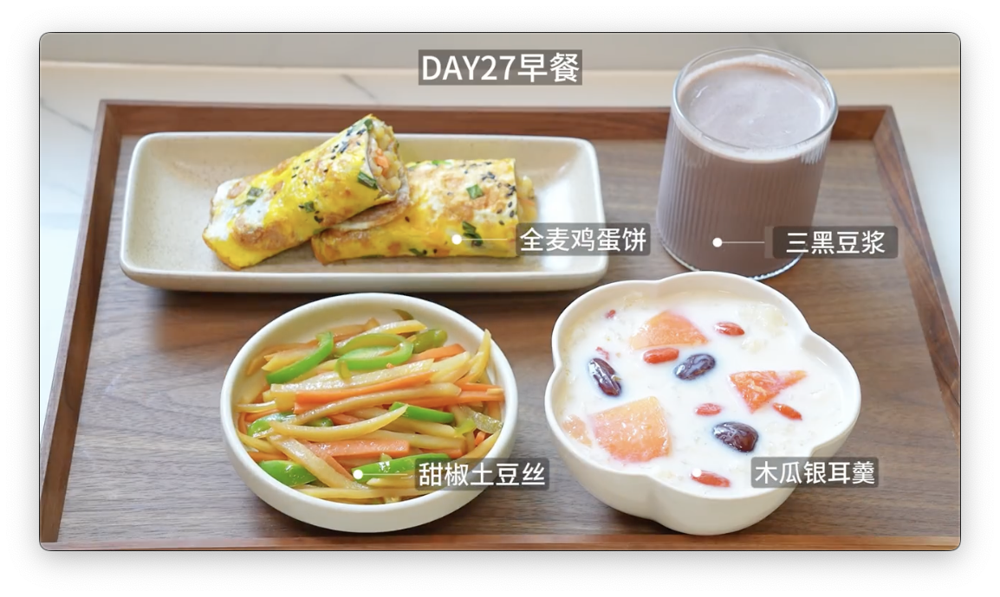

- 木瓜银耳羹
  - 红枣 6 颗，牛奶木瓜 0.5 个，干银耳 10g，枸杞 10g
  - 加少量水炖煮 30min，最后加入牛奶和泡好的枸杞即可
- 全麦鸡蛋饼
  - 白面 75g、全麦粉 75g，饮用水 375ml，盐 1g
  - 面粉加水搅拌成糊状
  - 甜椒、胡萝卜、土豆丝加盐、生抽、香醋翻炒
  - 平底锅刷油，倒入面糊，搭配鸡蛋、黑芝麻和葱花，喜欢可以再加个马苏里拉芝士片，卷上炒好的甜椒土豆丝即可
- 甜椒土豆丝

加餐：
- 三黑豆浆
  - 黑豆 25g、黑米 25g、黑芝麻 5g、核桃仁 10g、600ml 水

#### 午餐

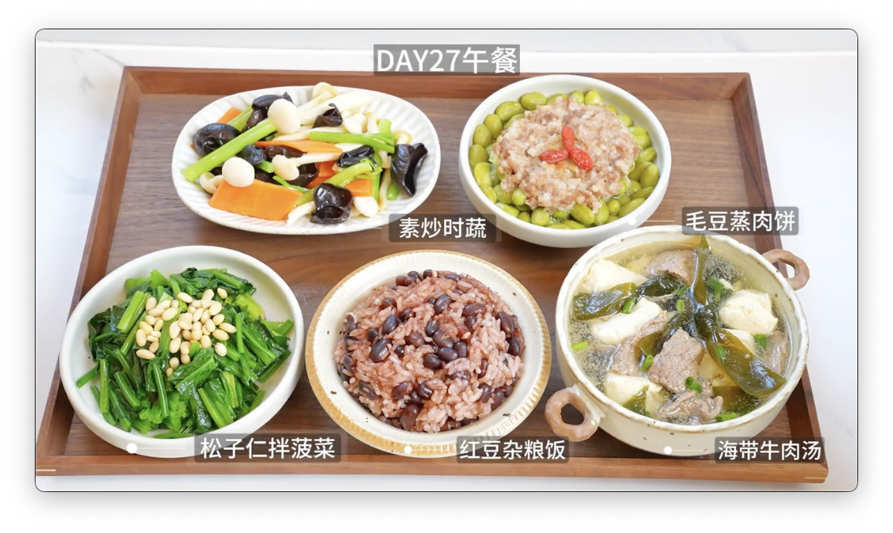

- 红豆杂粮饭
- 海带牛肉汤
  - 牛肉切片，加葱姜水、生抽、蚝油腌制
  - 姜片爆香后下海带（结）翻炒，然后加入嫩豆腐块和热水焖煮 15min，最后下牛肉烫熟，加点盐和葱花即可
- 毛豆蒸肉饼
  - 肉沫加盐、菌菇粉、葱姜水和生抽调味
  - 鲜毛豆装盘底撒点海盐，摆上肉饼一起蒸 15min，点缀几颗枸杞
- 素炒时蔬
  - 海鲜菇、木耳、胡萝卜焯水断生，再加入香芹一起翻炒，盐、白糖和菌菇鲜调味
- 松子拌菠菜

加餐：
- 五黑糕

#### 晚餐

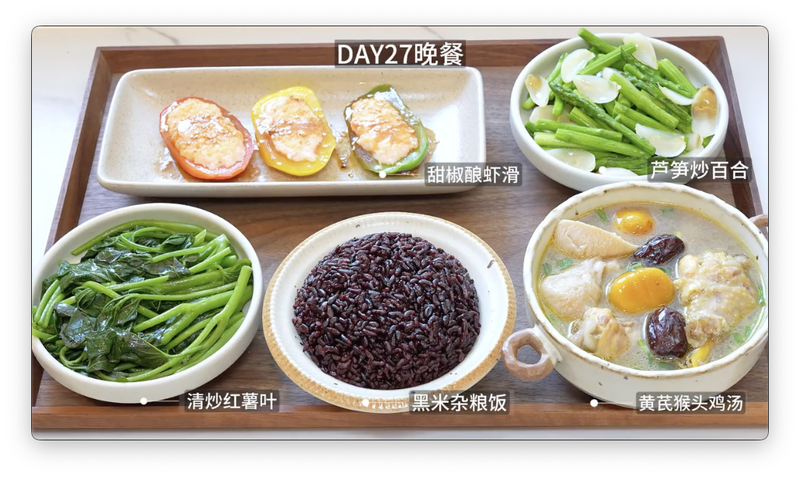

- 黑米饭
- 黄芪猴头鸡汤
  - 土鸡半只，鲜猴头菇 1 个，板栗 9 颗，红枣 8 颗，黄芪 5g
  - 猴头菇掰成块
  - 黄芪、姜片、葱段爆香，放入焯过水的鸡块翻炒，倒入开水和其他食材，盖盖小火焖煮 45min，最后盐和葱花调味
- 彩椒酿虾滑
  - 虾仁加盐、菌菇粉、淀粉、蛋清打成虾滑
  - 甜椒竖切，填入虾滑，下锅煎制，定型后翻面，倒点盐、生抽和水淀粉调味，焖 2min 即可
- 芦笋炒百合
  - 芦笋切段，鲜百合掰成瓣，姜丝爆香后一起下锅翻炒，加点盐、糖、菌菇粉调味即可
- 清炒红薯叶

加餐：
- 芝麻糊

---

### Day28 ✅

#### 早餐

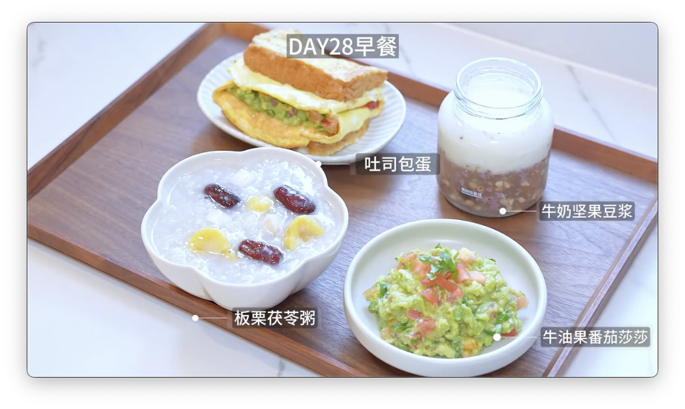

- 板栗茯苓红枣粥
  - 红枣 8 颗、茯苓 20g、板栗 50g、糯米 30g、大米 30g
- 牛油果番茄莎莎
  - 番茄、香菜切碎，牛油果加柠檬和海盐压成泥，混合均匀即可（月子早期可微波炉叮几秒）
- 吐司包蛋
  - 2 个鸡蛋打散，倒入煎锅，放入吐司使两面都沾上蛋液，煎至定型，裹上牛油果番茄莎莎（再撒点番茄酱也行）

加餐：
- 牛奶坚果藕粉

#### 午餐

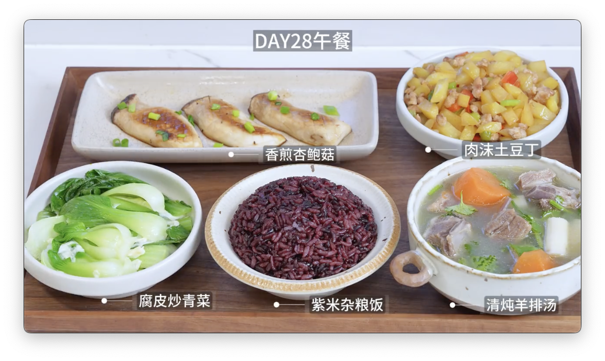

- 紫米杂粮饭
- 清炖羊排汤
  - 加姜片焯水去血水，花椒和小茴香各 1g 装布袋去腥
  - 加入胡萝卜和山药，小火炖煮 1h，最后加盐和香菜调味
- 香煎杏鲍菇
  - 杏鲍菇对半切开改花刀，先煎花刀一面，煎至两面金黄，最后撒盐、葱花调味即可
- 肉沫土豆丁
  - 炒好的肉沫加土豆丁翻炒，加生抽、蚝油调味，最后加甜椒丁和水淀粉勾芡
- 腐皮炒青菜

加餐：
- 猴头山药粉

#### 晚餐

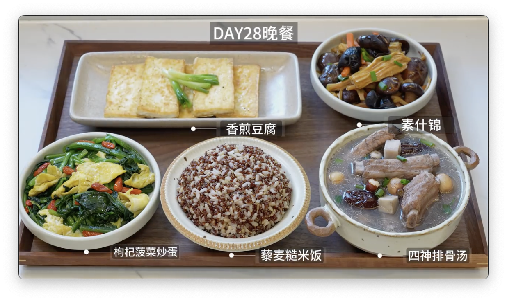

- 藜麦糙米饭
  - 藜麦：糙米：大米 = 1:1:1
- 四神排骨汤
  - 红枣 6 颗、芡实 20g、茯苓 20g、红莲子 20g、淮山药 20g、肋排 500g
  - 肋排加姜片焯水
  - 所有材料入锅焖煮 1h，最后加盐和葱花调味即可
- 素什锦
  - 香菇、黄花菜、木耳、腐竹、花生温水泡开
  - 香菇胡萝卜丝煸炒后加入其他食材
  - 倒入盐、生抽、蚝油和香菇水，翻炒后小火焖煮 10min，撒上葱花即可
- 枸杞菠菜炒蛋
  - 菠菜焯水去草酸
  - 鸡蛋炒散下入菠菜和泡好的枸杞
  - 盐和菌菇粉调味即可

加餐：
- 桂圆莲子银耳羹

---

## Week 5

---

- 谷类 225~275g，其中全谷物和杂豆不少于 1/3；
- 薯类 75g；
- 蔬菜类 400-500g，其中绿叶蔬菜和红黄色等有色蔬菜占 2/3 以上；
- 水果类 200~350g;
- 鱼、禽、蛋、肉类（含动物内脏）总量为 175~225g；
- 牛奶 300-500ml；
- 大豆类 25g；
- 坚果 10g；
- 烹调油 25g，食盐不超过 5g；
- 饮水量为 2100ml。

### Day29

#### 早餐

1. 银耳百合红枣粥
2. 包子
3. 红薯

#### 午餐

1. 二米饭
2. 牛肉砂锅⭐
3. 肉末茄子
4. 干锅花菜
5. 青菜

#### 晚餐

1. 荞麦饭
2. 鲫鱼豆腐汤⭐
3. 酸辣春笋手撕鸡
4. 香芹炒豆干
5. 青菜

---

### Day30

#### 早餐

1. 藜麦小米莲子粥
2. 鲜虾馄饨
3. 蒸蛋

#### 午餐

1. 糙米饭
2. 冬瓜海带豆芽汤
3. 牙签牛肉
4. 酸辣土豆丝
5. 青菜

#### 晚餐

1. 黑米饭
2. 虾滑粉丝煲⭐
3. 清蒸鲈鱼
4. 油焖春笋
5. 青菜

---

### Day31

#### 早餐

1. 红豆薏米粥
2. 全麦吐司
3. 玉米

#### 午餐

1. 高粱饭
2. 重庆鸡公煲
3. 牙签牛肉
4. 番茄花菜
5. 青菜

#### 晚餐

1. 紫米饭
2. 红烧羊肉煲⭐
3. 辣子鸡
4. 香煎豆腐
5. 青菜

---

### Day32

#### 早餐

1. 补肾养发五黑粥
2. 低卡蔬菜蛋饼
3. 红薯

#### 午餐

1. 青稞饭
2. 四鲜汤⭐️
3. 孜然羊肉
4. 番茄炒蛋
5. 青菜

#### 晚餐

1. 红米饭
2. 鱼羊鲜⭐
3. 蚂蚁上树
4. 干煸豆角
5. 青菜

---

### Day33

#### 早餐

1. 核桃花生补脑粥
2. 豆腐粉丝包
3. 水煮蛋

#### 午餐

1. 三色藜麦饭
2. 蛤蜊大酱汤⭐
3. 鱼香肉丝
4. 老奶洋芋
5. 青菜

#### 晚餐

1. 燕麦饭
2. 海三鲜笋炸鹌鹑(汤)⭐
3. 菠萝咕噜肉⭐️
4. 拌脆皮豆腐⭐
5. 青菜

---

### Day34

#### 早餐

1. 气血双补五红粥
2. 韭菜鸡蛋盒子
3. 蒸玉米

#### 午餐

泰式冬阴功火锅

#### 晚餐

1. 玉米渣饭
2. 番茄紫菜蛋花汤
3. 蒜蓉罗氏虾
4. 木耳炒山药
5. 青菜

---

### Day35

#### 早餐

1. 紫薯山药粥
2. 红糖馒头
3. 荷包蛋

#### 午餐

1. 藜麦饭
2. 党参枸杞乌鸡汤⭐
3. 麻酱金针菇肥牛⭐️
4. 麻婆豆腐
5. 青菜

#### 晚餐

1. 红豆饭
2. 白菜炖粉条
3. 锅包肉
4. 地三鲜
5. 青菜

---

## Week 6

---

### Day36

#### 早餐

1. 银耳莲子粥
2. 鸡蛋火腿三明治
3. 红薯

#### 午餐

1. 二米饭
2. 水盆羊肉⭐️
3. 肉沫豆角
4. 香橙烤翅
5. 青菜

#### 晚餐

1. 荞麦饭
2. 黄花菜肉片汤
3. 蒜泥白肉⭐
4. 茄汁平菇
5. 青菜

---

### Day37

#### 早餐

1. 百合莲子粥
2. 鲜虾馄饨
3. 蒸蛋

#### 午餐

1. 糙米饭
2. 无水鸡肉蔬菜煲⭐
3. 香菜菠萝牛肉
4. 干锅土豆片
5. 青菜

#### 晚餐

1. 黑米饭
2. 番茄牛肉豆芽汤⭐
3. 竹笋焖鸡
4. 杏鲍菇炒肉
5. 青菜

---

### Day38

#### 早餐

1. 奶香红豆粥
2. 鸡蛋饼
3. 蒸玉米

#### 午餐

1. 高粱饭
2. 酸汤肥牛⭐️
3. 糖醋里脊
4. 麻婆豆腐
5. 青菜

#### 晚餐

1. 紫米饭
2. 老妈蹄花⭐️
3. 红烧鲫鱼
4. 炒茄条
5. 青菜

---

### Day39

#### 早餐

1. 红枣小米粥
2. 鲜肉包
3. 拌莴笋

#### 午餐

1. 青稞饭
2. 番茄牛腩煲⭐️
3. 避风塘香酥虾
4. 豆腐抱蛋
5. 青菜

#### 晚餐

1. 红米饭
2. 白菜肉丝年糕汤⭐
3. 孜然鸡胸肉条
4. 酸辣土豆丝
5. 青菜

---

### Day40

#### 早餐

1. 淮山芡实粥
2. 豆腐粉丝包
3. 水煮蛋

#### 午餐

1. 三色藜麦饭
2. 竹荪排骨汤
3. 大盘鸡
4. 糖醋灯笼茄子
5. 青菜

#### 晚餐

1. 燕麦饭
2. 温泉蛋豆腐煲⭐
3. 茄汁大虾
4. 木须肉
5. 青菜

---

### Day41

#### 早餐

1. 黑豆核桃粥
2. 鲜肉馄饨
3. 荷包蛋

#### 午餐

牛奶麻辣烫

#### 晚餐

1. 玉米渣饭
2. 电饭煲炖鸡汤⭐️
3. 牙签牛肉⭐
4. 麻辣土豆片
5. 青菜

---

### Day42

#### 早餐

1. 紫薯燕麦粥
2. 红糖馒头
3. 煎蛋

#### 午餐

1. 藜麦饭
2. 鲜虾豆腐煲⭐
3. 平底锅烤鱼
4. 小炒肉
5. 青菜

#### 晚餐

1. 红豆饭
2. 腌笃鲜⭐
3. 袋袋烤鸡
4. 烤茄子
5. 青菜

---

## 营养搭配

建议乳母每天摄入：**200g 鱼、禽、蛋和瘦肉**（其中包括 **蛋类 50g**）。为满足蛋白质、能量和钙的需要，还要摄入 **25g 大豆**（或相当量的大豆制品）**10g 坚果**、**300g 牛奶**。
- 为保证乳汁中碘和维生素 A 的含量，乳母应选用碘盐烹调食物，适当摄入**海带、紫菜、鱼、贝类**等海产品和动物肝脏、蛋黄等动物性食物。

乳母整个哺乳期（包括月子）均应坚持食物多样，每天的膳食应包括**谷薯类**、**蔬菜水果类**、**畜禽鱼蛋奶类**、**大豆坚果类**食物。通过选择小份量食物、同类食物互换、粗细搭配、荤素双拼、色彩多样的方法，达到食物多样。

乳母一天食物建议量为：
- 谷类 225~275g，其中全谷物和杂豆不少于 1/3；
- 薯类 75g；
- 蔬菜类 400-500g，其中绿叶蔬菜和红黄色等有色蔬菜占 2/3 以上；
- 水果类 200~350g;
- 鱼、禽、蛋、肉类（含动物内脏）总量为 175~225g；
- 牛奶 300-500ml；
- 大豆类 25g；
- 坚果 10g；
- 烹调油 25g，食盐不超过 5g；
- 饮水量为 2100ml。

为保证维生素 A 的需要，建议每周吃 1~2 次动物肝脏，总量达 85g 猪肝或 40g 鸡肝。动物性食物和大豆类食物之间可做适当的替换，豆制品喜好者可以适当增加大豆制品，减少动物性食物，反之亦可。

乳母要达到 240μg/d 碘的推荐量以满足身体需要，除选用碘盐烹调食物外，还需增加碘含量比较丰富的海产品摄入，如海带、紫菜、贻贝等，建议每周摄入 1~2 次富含碘的海产品。可提供 140μg 碘的常见食物有：海带（鲜，120g）、紫菜（3g）、贻贝（40g）、海鱼（50g）。

1. 餐前不宜喝太多汤。餐前多喝汤会导致食量减少，但对于需要补充营养的乳母而言，应该增加而不是滅少食量，所以餐前不宜喝太多汤。可在餐前喝半碗至一碗汤，待到八九成饱后再喝一碗汤。
2. 喝汤的同时要吃肉。**肉汤的营养成分大约只有肉的 1/10**，为了满足产妇和宝宝的营养，应该连肉带汤一起食用。
3. 不宜喝多油浓汤。太浓、脂肪太多的汤不仅会影响产妇的食欲，还会引起婴儿脂肪消化不良性腹污。煲汤的材料宜选择一些脂肪含量较低的肉类，如鱼类、瘦肉、去皮的禽类、瘦排骨等，也可喝蛋花汤、豆腐汤、蔬菜汤、面汤及米汤等。

## 饮食

### 杂粮饭

- 红豆饭 ———— 红豆: 大米 = 1:1
- 黑米饭 ———— 黑米: 大米 = 1:1
- 二米饭 ———— 小米: 大米 = 1:1
- 荞麦饭 ———— 荞麦: 大米 = 1:1
- 燕麦饭 ———— 燕麦: 大米 = 3:1
- 玉米饭 ———— 玉米碴: 大米 = 3:1
- 薏米饭 ———— : 大米 = 1:1
- 红米饭 ———— : 大米 = 1:1
- 紫米饭 ———— : 大米 = 1:1
- 饭 ———— : 大米 = 1:1

### 补铁

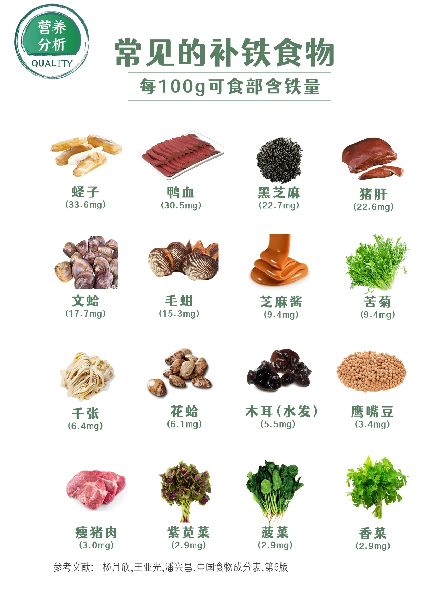

⭐️孕妇膳食铁推荐摄入量（RNI）：
①孕早期 (20mg/d)
②孕中期 (24mg/d)
③孕晚期 (29mg/d)

1️⃣肉类中的铁吸收率高于蔬菜的铁
2️⃣如果主要靠蔬菜补铁建议摄入量翻倍
3️⃣蔬菜焯水食用可以降低植酸并能防止维生素 C 的大量流失，有益铁的吸收
4️⃣饮食中铁的吸收率仅有 10%-15%，人体会根据对铁的需求量动态调节
5️⃣育龄女性、孕妇、婴幼儿和青少年容易出现缺铁
6️⃣长期铁摄入不足引起系列的缺铁症状和疾病
7️⃣人体没有主动排铁的功能，长期过量积累会出现慢性中毒，过犹不及

### 补钙

一般来说牛奶🥛是补钙首选，不愿意喝牛奶的就在日常的饮食里多增加这些钙含量高的食物

### 叶酸

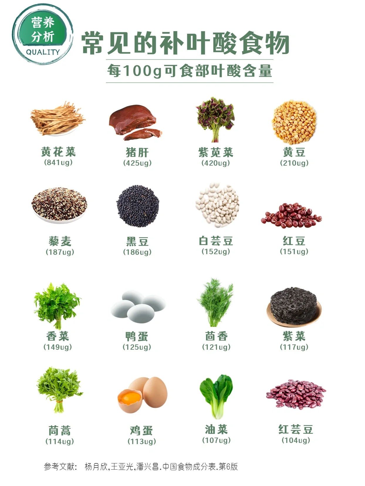

### 膳食纤维

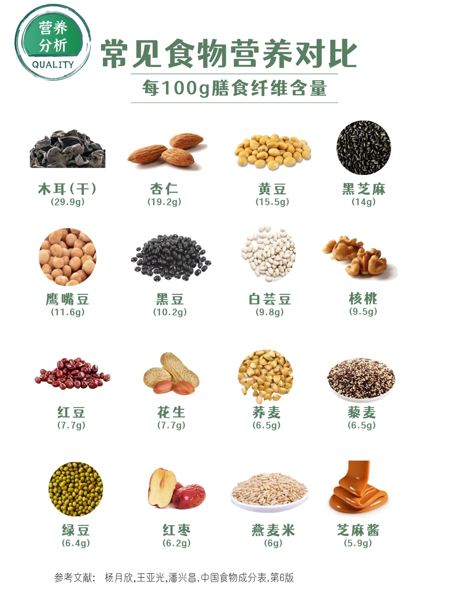

膳食纤维的好处：

- 🔸改善便秘
膳食纤维的易吸水特性可增加粪便体积，然后在肠道发酵，通过增加菌群数量而增加粪便重量，刺激排便
- 🔸促进益生菌生长
发酵的膳食纤维是结肠微生物的底物，可改善结肠内微生物菌群的构成，刺激有益肠道菌群生长，维持肠道免疫功能
- 🔸血糖调节
膳食纤维具有良好的粘性和吸附性，可延缓和减少葡萄糖的吸收利用，减慢血糖水平和胰岛素
- 🔸饱腹感和体重调节
膳食纤维吸收水分可延缓胃排空、增加饱腹感；能吸附脂肪酸、胆固醇等，促进肠道蠕动，缩短营养物质与肠细胞接触时间，减少能量摄入

⭐️成人的适宜摄入量：25-30g/d

### 维生素 A

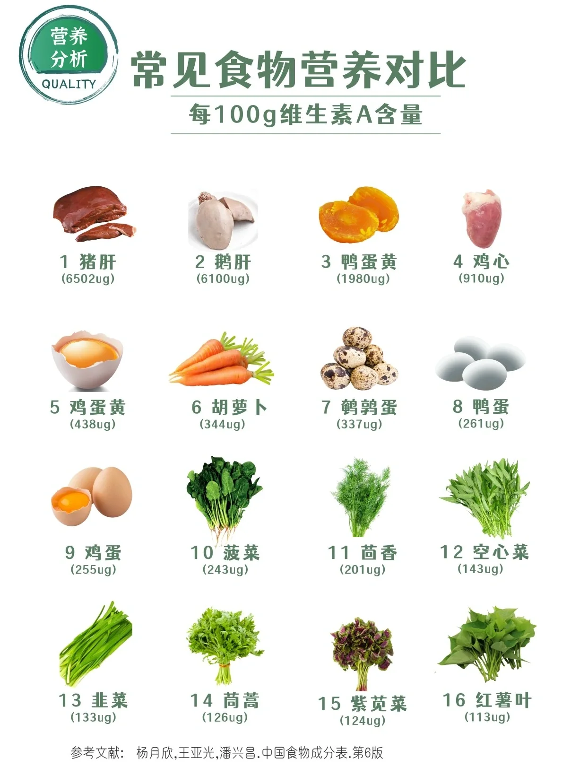

⭐️平里日晚上用眼较多、皮肤状态不好的朋友们建议多吃，特别是 16 种食物里的 8 种蔬菜。
因为肝类维生素 A 含量太高，吃多了有维生素 A 过量中毒风险。而蔬菜里的都是类胡萝卜素，是非常好的抗氧化剂，有助于缓解体内炎症，即使吃多了也没有中毒风险
⭐️维生素 A 参与细胞 DNA RNA 的合成，缺乏时会导致男性精子数量减少、活力下降，也可影响胎盘发育。在备孕的同学和孕妇要多注意补充
⭐️维生素 A 是一个万能维生素，在基因表达、视觉、维持上皮组织和皮肤、免疫防御和机体生长等都会起到作用

### 维生素 C

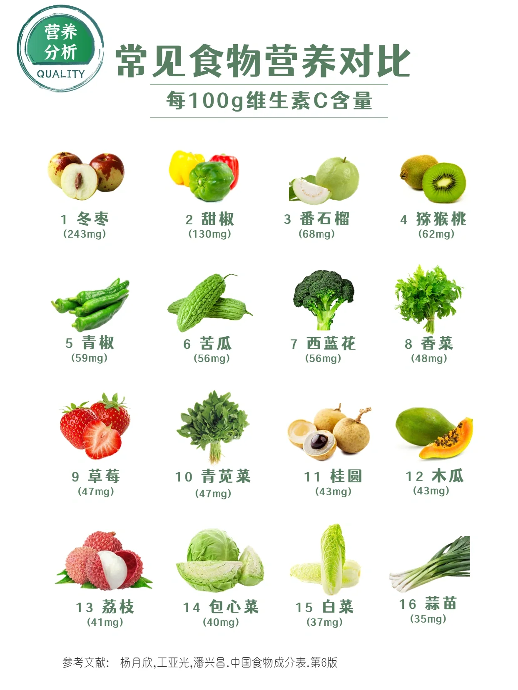

除了对皮肤美白也有一定的作用，更重要的是这些功能：

- 🔸促进胶原蛋合成：胶原是骨骼、牙齿、皮肤和腱的基础，可以形成瘢痕组织促使伤口愈合，可以形成毛细血管的支撑材料防止淤伤
- 🔸抗氧化：维生素 C 可以通过自身氧化来保护食物中的物质不被氧化，减少组织炎症。比如：防止和延缓维生素 A 和维生素 E 的氧化；改善钙、铁和叶酸的利用；防止血液循环系统的氧化损伤等
- 🔸其他：促进有机物解毒和抗体形成

⭐️看完以上几点你会发现，当受伤了、身体虚弱、感觉有炎症的时候，多吃富含维生素 C 的食物肯定没错，亲测有效

### 锌

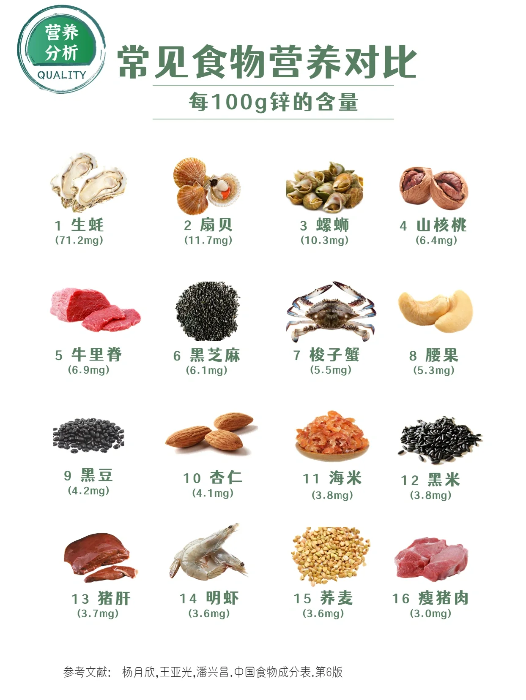

一旦发生轻微缺锌对身体就会有很大的伤害

- 🔸对于备孕和孕期女性的影响：
锌参与促黄体激素、促卵泡激素、促性腺激素等有关内分泌激素的代谢，对胎儿生长发育、性器官和性功能发育均有重要调节作用。
当然缺锌对于男性的精子形成等也会有影响
推荐黑豆来改善卵巢功能是有科学依据的✅
- 🔸锌可促进淋巴细胞分裂，增加 T 细胞的数量和活力。缺锌会导致免疫功能受损，比如反馈的口腔溃疡、感染等
- 🔸锌能促进生长发育，若儿童发育不良并伴有食欲不振时，应当考虑锌的缺乏
- 🔸其他：促进大脑发育和伤口愈合。

锌的推荐摄入量 (RNI)

18~50 岁健康成人：男 (12.5mg/d)、女 (7.5mg/d)

孕期：9.5mug/d

男性对锌的需要量要比女性多 67%，更要多吃，补锌不一定就要吃生蚝，图片里的其他 15 种富含锌的食物也建议每天安排。其中，动物性食物来源的锌吸收率更高一些

### 维生素 B6

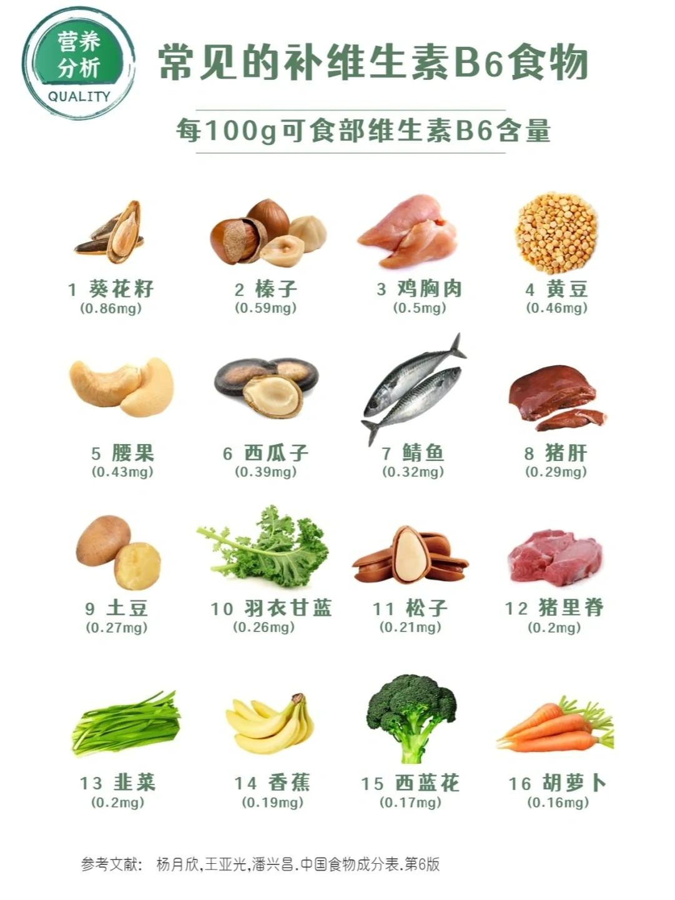

维生素 B6 是目前营养治疗的一线方案

常规的孕吐营养治疗方法
- 🔸从预防开始：推荐怀孕推荐怀孕前 1 个月开始补充维生素，可减少妊娠恶心呕吐的发生率和严重程度（A 级证据）
- 🔸生姜可减轻恶心症状（B 级证据）
- 🔸轻度和中度的妊娠期恶心呕吐可通过以下缓解措施：休息以及避免可能加重症状的气味、热、潮湿以及闪光等感觉刺激；少食多餐，避免暴饮暴食；避免辛辣和油腻食物；建议晨起后吃清淡固体食物或高蛋白小吃以及苏打饼干
- 🔸维生素 B 6 单药治疗：可用于一线药物治疗（A 级证据）

维生素 B6 本身也是非常重要的 B 族维生素，长期缺乏会导致巨幼红细胞贫血等问题。

### 膳食宝塔

## 注意

### 缓解孕吐方法

容易孕吐的几个场景：
1⃣空腹 / 肚子饿的时候：比如早上起床后和晚上睡觉前、下午 3 点左右；
2⃣对一些气味敏感：比如油烟、空气差、新到的一些快递包装等
3⃣身体弱的时候：有 1 天轻度感冒，那天的孕吐是最厉害的，吃什么吐什么

所以围绕着这 3 点，我把家里能够用上的方法都试了一遍✅
1⃣减少空腹出现的情况：
🔸少吃多餐：3 正餐 + 2 加餐，午餐和晚餐后 2-3 小时吃 1 顿加餐
🔸早上起来下床前先吃 1 包苏打饼干垫肚子，同时中和胃酸刺激
🔸饭菜迎合孕妇口味变化：不过于追求少油少盐清淡饮食，目前的口味要比孕前还稍微重一些
2⃣优化空气质量
🔸远离敏感源：比如油烟等已知容易孕吐的气味
🔸注意通风全开：吃饭时开窗，油烟机、空调通风、空气净化器全开
🔸用天然气味掩盖：比如柚子皮、橘子皮、橙子皮、姜片、花香等都可以
3⃣营养支持
🔸因为孕吐 / 胃口差容易营养缺乏，所以应适当增加营养补充剂
🔸研究证明孕前 1 个月开始补偿维生素可减少孕吐发生的概率和严重程度（A 级证据）
🔸我们家平日有吃复合维生素片和鱼油的习惯，家属一开始孕吐症状确实较轻
🔸孕期铁需求量增加，注意补铁，否则容易导致免疫下降
🔸日常少熬夜，多休息，家人及时疏导负面情绪和压力影响

如果吐了怎么缓解❓
我一般先给家属一块柚子皮缓解气味
然后喝少量苏打水中和食管中残留的胃酸刺激
稍微舒服点了就吃点苏打饼干垫肚子
同时换到空气好点的区域，看综艺等转换注意力

### 产后不得不重视，调理肠道才是重中之重❗️

产后恢复首先需要调理的就是肠胃了

肠道恢复的好，身体恢复的才越快✅

妊娠后胃肠蠕动减弱，胃酸分泌量减少，一般需要 1～2 周才能逐渐恢复。

肠道作为最大的免疫器官， 集中着人体大部分的免疫细胞。另外产后受激素等因素影响，情绪不稳定、睡眠不足、产后抑郁、缺少运动等会进一步导致肠道恢复慢。所以家属产后的肠道恢复是我月子餐里优先考虑的

1. 产后初期：进食清淡、稀软、易消化的食物，特别是前三天以半流质食物为主，不给受伤的肠道添负担
2. 饮食搭配注重营养均衡：哺乳期的食物搭配最简单的就是参考《中国哺乳期妇女平衡膳食宝塔》，新版《中国居民膳食指南 2022 版》也是很好的日常营养工具书，营养够了才能有助身体细胞的修复
3. 日常补充益生菌： 益生菌属于有益菌，定时补充可增加肠道有益菌数量和菌群多样性。一个平衡的肠道微生态，有助于增强自身抵抗力。我们常说的肠脑轴也就是说，一个舒服安乐的肠胃，反过来也会舒缓大脑情绪、缓解压力

益生菌选择注意事项📝

🔸看活菌数：每天要吃到起效量，才能达到临床有效用量，而不同菌株每日要吃的起效量不同，例如乳双歧杆菌 Bl-04 每天要吃 50 亿 CFU、鼠李糖乳杆菌 GG 每天要吃 40 亿 CFU 等等

🔸看菌株种类和作用： 不同菌株之间功能存在差异，比如鼠李糖乳杆菌 GG 能够增强免疫，乳双歧杆菌 HN019 可以促进肠道蠕动，国际上益生菌必须限定到菌株号

🔸发挥作用的关键是 “活性”： 不要用 40℃以上的水冲饮 避免与抗生素同时服用 饭后复用更佳

我给家属选的是 Lifespace 广谱益生菌，里面有 15 种活性菌株，1 粒就有 320 亿活菌，都有对应的菌株编号，并达到了相对应的起效量。一天 2 粒，能有效帮助产后宝妈们恢复健康，提高抵抗力💯

### 孕期体重管理不再焦虑，必看营养建议干货~

家属孕前体重 90 斤 BMI 17.1 属于偏瘦，
产前体重 115 斤 BMI 21.9 属于正常
产后体重 102 斤，月子结束时已恢复至 98 斤✌
-
家属孕早期时特别担心体重增长太多产后无法恢复
所以专门整理过相关营养建议给她看，缓解她的焦虑

后来整个孕期都没有刻意控制饮食✅
大家也可以对照着图 2⃣的表格自己看下体重增长是否在合理范围内

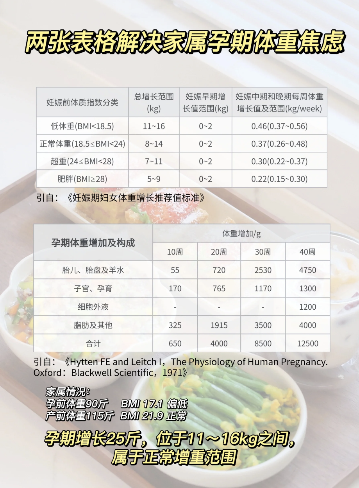

-
孕期体重管理在日常饮食上的营养建议📝
🔸合理控制总能量：
孕早 / 中 / 晚期的推荐日能量摄入量分别是 1800/2100/2230kcal/d
🔸不要抗拒碳水 优选低 GI 主食：
碳水化合物所提供的能量应占膳食总能量的 50-60%；
低血糖生成指数 (GI) 食物有利于血糖控制；
减少白米白面等精制加工高 GI 主食；
增加全谷类、薯类及杂豆等低 GI 主食
🔸增加膳食纤维的摄入量
膳食纤维能降低食物的血糖指数，有降血糖作用；
中国膳食指南建议膳食纤维日摄入量为 25-30g；
蔬菜推荐 400-500g/d  水果推荐 200-300g/d
🔸适量食用天然甜味剂替代添加糖
限制白糖、果糖等单糖和双糖的使用量
天然甜味剂有甜度、热量低，对人体更安全
适量食用可以提升菜肴风味，却不会增加不必要的热量和血糖升高
-
家里孕期和产后用的代糖是这款怡口罗汉果零卡糖，
0 糖 0 卡 0GI，40 年的代糖老品牌了，口感无限接近白砂糖，还不错哦~

