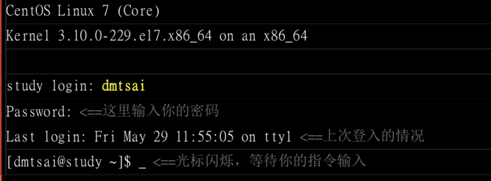

这里就不记录了，就是讲解一些 ui 界面的基础功能，很基础的操作方式等，[鸟哥网站阅读](http://linux.vbird.org/linux_basic/0160startlinux.php)

## 🍀 GNOME 的操作与注销

### 注销、重启、关机
右上角点击后，就会出现相关按钮

### 重新启动 x window 的快速按钮

一般可以手动直接修改 X window 的配置文件，需要重启 x 才会生效（不是重启机器），
方法如下：

- 直接注销，然后再重新登录即可
- 在 x 的画面中直接按下 alt + ctrl + backspace（退格键？删除键盘）

### x window 与文本模式的切换
文本模式就是终端机接口、terminal、console。linux 预设的情况下会提供 6 个终端来让使用者登录，
切换方式使用 ctrl + alt + f1~f6 组合按键。f1~ f6 各表示的含义如下

- f2 ~ f6 ：终端 tty2 ~ tty6
- f1 ：图形界面

要搞清楚 tty 与 x 的关系，上面没有出现 tty1，是因为练习机默认是启动图形界面的，
那么 x 窗口将会出现在 tty1 上，tty1 就是 centos 给你默认启动的一个。

举个例子，你现在切换到 tty3 上了，那么输入命令

```
# 纯文本界面下，不能有 x 存在，可启动窗口界面的做法
startx
```

使用 startx 需要满足以下条件：

- 没有其他 x window
- 必须已经安装了 x window system，并且 x server 是能够顺利启动的
- 最好有窗口管理员，例如 GNOME/KDE 或则是阳春的 TWM 等

其实窗口环境就是「文字界面 + x 窗口软件」的组合。startx 并不一定需要管理员身份启动，
而且可以通过管理服务的程序中将 graphical.target 目标服务设置为默认，就可以默认使用图形界面了

### 在终端界面登录 linux
在终端界面，如果没有登录过的话，也需要使用账户名和密码登录（太简单不记录）,



- 上图第一行和第二行是 `/etc.issue` 里面的命令显示的
- `last login...`：显示上一次这个账户登录的时间与终端机名称，可以检查是否上次自己登录过
- 登录成功显示的 `[dmtsai@study~]$` 中的
  - ~ 表示用户的家的目录的意思，比如，root 的家目录就在 /root，所以 ~ 就代表 /root 的意思，而 dmtsai 的家目录在 /home/dmtsai
  - dmtsai 是当前用户的账户
  - @ 之后的 study 是主机名
  - $ 表示是普通用户，# 表示是 root 用户

离开系统的命令是 `exit`，则会退出终端机，这个也是注销当前用户。
在 x window 中点击 log out （注销）按也会退出到文字界面（当然是通过 startx 启动的 x window 中注销时）
