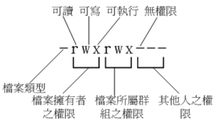

文件权限是如何针对使用者与群组来设定的呢？这个部分相当重要，如果不懂这部分，
那么你将老是听不懂别人在说什么。尤其是当你屏幕上出现了「Permission deny」的时候

## 🍀 Linux 文件属性

```bash
# 切换到 root 账户
[mrcode@study root]$ su -
Password:
Last login: Mon Oct  7 22:18:11 CST 2019 on pts/0
[root@study ~]# pwd
/root

# 查看当前目录下的文件数据
[root@study ~]# ls -al
total 32
#    权限  连接 拥有者 群组 文件容量 修改日期    文档名
dr-xr-x---.  6 root root  219 Oct  4 22:48 .
dr-xr-xr-x. 17 root root  224 Oct  4 18:31 ..
-rw-------.  1 root root 2175 Oct  4 18:32 anaconda-ks.cfg
-rw-------.  1 root root    5 Oct  4 22:48 .bash_history
-rw-r--r--.  1 root root   18 Dec 29  2013 .bash_logout
-rw-r--r--.  1 root root  176 Dec 29  2013 .bash_profile
-rw-r--r--.  1 root root  176 Dec 29  2013 .bashrc
drwx------.  4 root root   31 Oct  4 22:48 .cache
drwxr-xr-x.  3 root root   18 Oct  4 22:48 .config
-rw-r--r--.  1 root root  100 Dec 29  2013 .cshrc
drwx------.  3 root root   25 Oct  4 18:38 .dbus
-rw-r--r--.  1 root root 2206 Oct  4 18:42 initial-setup-ks.cfg
drwxr-xr-x.  3 root root   19 Oct  4 22:48 .local
-rw-r--r--.  1 root root  129 Dec 29  2013 .tcshrc
```

由于后续的 chgrc、chown 等指令可能都需要使用 root 指令，所以这里使用 root 身份来学习，

- `su -`：切换到 root 身份
- exit：回到你自己的身份
- `ls -al`： list 的意思

  - a：当前目录下的所有文件，包括隐藏文件
  - l：显示详细信息，包括大小，属组，创建时间

### 文件的类型与权限
就是这一串了 `-rw-------` ，有十个字符



文件类型

- d：表示目录
- `-`：文件
- l：连接文档（link file）
- b：装置文件里面的可供存储的接口设备（可随机存取装置）
- c：装置文件里面的串行端口设备、例如键盘、鼠标（一次性读取装置）

接下来就是三个为一组的「rwx」，r 代表刻度 read、w 可写 write、x 可执行 execute，如果没有则使用横线占位

- 第一组：文件拥有者的权限;

  `-rw-r--r--`：就表示可读写，但是不可执行
- 第二组：加入此群组之账户的权限
- 第三组：非本人且没有加入本群组之其他账户的权限

### 连接

表示有多少文档名连接到此节点（i-node)

每个文件都会将他的权限与数学记录到文件系统的 i-node 中，不过这里使用的目录树是使用文件名来记录，
因此每个文档名就会连接到一个 i-node，关于 i-node 后续会讲解

### 拥有者

该文档属于谁

### 所属群组
该文档属于哪个组

### 文件容量，默认单位 bytes
### 修改日期
这个文件的建档日期或则是最佳的修改日期

```bash
# 日期为 月 日 时间，但是这个文件被修改的时间距离现在太久了则只会显示年份了
drwxr-xr-x.  3 root root   19 Oct  4 22:48 .local
-rw-r--r--.  1 root root  129 Dec 29  2013 .tcshrc
```

如果想显示完整的日期时间格式，可以利用 ls 的选项，`ls -l --full-time`

```bash
[root@study ~]# ls -l --full-time
总用量 8
-rw-------. 1 root root 2175 2019-10-04 18:32:06.481779774 +0800 anaconda-ks.cfg
-rw-r--r--. 1 root root 2206 2019-10-04 18:42:03.993000000 +0800 initial-setup-ks.cfgs
```

前面说到过语系的问题，可以修改 `/etc.local.conf` 中的 LANG 变量来永久修改

### 文档名

没什么好说的，特殊是 一个点 `.`，表示隐藏文件，
至于更多的用法，自行查看 ls --help 或则 man ls 或 info ls 等文档了（小提示，当语系为`LANG=zh_CN.UTF-8` 时，文档里面有部分描述是中文的）


::: tip
非常重要的是权限，上面的也稍微记录下
:::

### 权限识别练习

```
-rw-r--r--.  1 root root   18 Dec 29  2013 .bash_logout
drwxr-xr--.  1 root testgroup   18 Dec 29  2013 groups/
```

- 第一个文件：只有 root 可读写，但是没有执行权限
- 第二个目录：

  - root：可读可写
  - testgroup：可读，不能写，**可执行，因此可以能够进入该目录**
  - 取他人：只有 r，可读，但是没有 x，所以都不能进入此目录

### Linux 文件权限的重要性

与 windows 系统不一样的是，在 linux 系统中，每一个文件都加了很多的属性，特别是群租的概念，
最大的用途就是在数据安全性上面

- 系统保护的功能

  举个简单例子，在你的系统中，关于系统服务的文件通常只有 root 才能读写或执行，
  例如 `/etc/shadow` 这个账户管理的文件，这个文件的是个字符都是横线，不能读写执行，
  但是 root 不受限制
- 团队开发软件或数据共享的功能

  就是多人协作的时候，希望每个人都可以使用某一些目录下的文件，而其他人不开放。
  比如 testgroup 团队有三个人 t1、t2、t3 ，那么就可以将团队所需的文件权限设置为 `-rwxrws---`
  该组内的都可读写与执行（等等，这里怎么是 s? 后续会讲解）
- 未将权限设置妥当的危害

  很简单，比如只有 root 才能做的开关机，新增、或删除用户等等的指令，那么随意人都可以用的话，
  就乱套了

## 🍀 如何改变文件属性与权限

一个文件的属性与权限有很多，那么我们可以修改哪些呢？这里先介绍几个常用与群组、拥有者、各种身份的权限修改指令

- chgrp：改变文件所属群组
- chown：改变文件拥有者
- chmod：改变文件的权限、SUID、SGID、SBIT 等等的特性

### 改变所属群组 chgrp

语法如下：

```bash
chgrp [-R] 文件或目录

-R：递归变更，如果是目录，则变更该目录以及目录下的所有文件
```

```bash
# 注意看这里，还补全群组
[root@study ~]# chgrp us
usbmuxd  users    
[root@study ~]# chgrp users initial-setup-ks.cfg
[root@study ~]# ls -al initial-setup-ks.cfg
-rw-r--r--. 1 root users 2206 10月  4 18:42 initial-setup-ks.cfg
[root@study ~]# chgrp root initial-setup-ks.cfg
[root@study ~]# ls -al initial-setup-ks.cfg
-rw-r--r--. 1 root root 2206 10月  4 18:42 initial-setup-ks.cfg
```

::: tip
在改变群组的时候，这个组名，必须存在 /etc/group 中
:::
### 改变文件拥有者 chown

::: tip
同样需要改变为存在  /etc/passwd 中有记录的用户名称
:::

语法如下

```bash
chown [-R] 账户名称 文件或目录
chown [-R] 账户名称:组名 文件或目录
```

```bash
[root@study ~]# ls -al initial-setup-ks.cfg
-rw-r--r--. 1 root root 2206 10月  4 18:42 initial-setup-ks.cfg
# 修改为 mrcode 所拥有
[root@study ~]# chown mrcode initial-setup-ks.cfg
[root@study ~]# ls -al initial-setup-ks.cfg
-rw-r--r--. 1 mrcode root 2206 10月  4 18:42 initial-setup-ks.cfg
# 同时修改拥有者和群组
[root@study ~]# chown root:root initial-setup-ks.cfg
[root@study ~]# ls -al initial-setup-ks.cfg
-rw-r--r--. 1 root root 2206 10月  4 18:42 initial-setup-ks.cfg
```


那么什么时候使用 chown 和 chgrp 呢？他们都可以修改组，其实只是一个包含了另一个的功能了而已，
拿这个案例来讲解下

一般我们复制文件使用 cp 命令（`cp 来源文件 目标文件`），那么我需要把某个文件拷贝给 mrcode

```bash
[root@study ~]# cp initial-setup-ks.cfg initial-setup-ks-mrcode.cfg
[root@study ~]# ls -al initial-setup-ks*
-rw-r--r--. 1 root root 2206 10月  4 18:42 initial-setup-ks.cfg
# 注意看这个拷贝出来的拥有者和群组还是 root，就算我给了 mrcode，他也不能读取，权限不够
-rw-r--r--. 1 root root 2206 10月  7 23:30 initial-setup-ks-mrcode.cfg
# 那么使用 chown 同时修改拥有者和群组为 mrcode
[root@study ~]# chown mrcode:mrcode initial-setup-ks-mrcode.cfg
[root@study ~]# ls -al initial-setup-ks*
-rw-r--r--. 1 root   root   2206 10月  4 18:42 initial-setup-ks.cfg
-rw-r--r--. 1 mrcode mrcode 2206 10月  7 23:30 initial-setup-ks-mrcode.cfg
```

### 改变权限 chmod
chmod 指令改变权限有两种形式，一种使用数字，一种使用符号

#### 数字类型改变文件权限

- r = 4
- w = 2
- x = 1

每种身份 owner、group、others 各自的三个权限 r、w、x 分数是需要累加的，
例如权限是 `-rwxrwx---` ，那么分数为：

- owner：rwx = 4 + 2 + 1 = 7
- group：rwx = 4 + 2 + 1 = 7
- ohters：--- = 0 + 0 + 0= 0

语法为

```
chmod [-R] xyz 文件或目录

xyz：就是刚刚的数值类型的权限范围，为 rwz 属性数值的相加
-R：递归
```

常用权限数值：

- `-rw-rw-r--` 664 ：一般文件，可读可写无执行
- `-rwxr-x-r-x` 755：shell 脚本文件，拥有者可读写执行，其他的都只能可读可执行，不可编辑
- `-rwxr------` 740：不希望该文件被其他人看到（能看到文件，但是不能读取里面的内容）

修改示例就是 `chmod 740 text.txt`

#### 符号类型改变文件权限
权限分三组：

- user
- group
- other

每个组的首字母就代表了这个符号类型，其中 a 表示所有

```
chmod u/g/o/a +/-/= r/w/x 文件或目录
```

把一个文件更改为 `-rwxr-xr-x`

```bash
[root@study ~]# ls -al initial-setup-ks-mrcode.cfg
-rw-r--r--. 1 mrcode mrcode 2206 10月  7 23:30 initial-setup-ks-mrcode.cfg

# 三组字母可以写一起
[root@study ~]# chmod u=rwx,go=rx initial-setup-ks-mrcode.cfg
[root@study ~]# ls -al initial-setup-ks-mrcode.cfg
-rwxr-xr-x. 1 mrcode mrcode 2206 10月  7 23:30 initial-setup-ks-mrcode.cfg
```

那么还有一个需求，不知道原来的权限，但是需要让某个文件具有每个人都有写入的权限

```bash
[root@study ~]# ls -al initial-setup-ks-mrcode.cfg
-rwxr-xr-x. 1 mrcode mrcode 2206 10月  7 23:30 initial-setup-ks-mrcode.cfg

# 开始没有写入权限，使用 + 来增加写入权限
[root@study ~]# chmod o+w initial-setup-ks-mrcode.cfg
[root@study ~]# ls -al initial-setup-ks-mrcode.cfg
-rwxr-xrwx. 1 mrcode mrcode 2206 10月  7 23:30 initial-setup-ks-mrcode.cfg

```

## 🍀 目录与文件之权限意义

前面谈到这些文件权限对于数据安全的重要性，那么对于一般文件与目录有何不同呢？

### 权限对文件的重要性

文件是实际含有数据的地方，包括一般文件、数据库文件、二进制可执行文件（binary program）等，
因此，权限对于文件来说，意义是：

- r（read）：可读取此文件的实际内容
- w（write）：可以修改文件内容，但是不能删除
- x（execute）：该文件具有可以被系统执行的权限

x 怎么理解呢？在 windows 中一个文件是否具有执行的能力是由扩展名来判断的，如 `.ext`、`.bat` 等，
在 linux 下就靠这个 x 来决定，根文档名没有关系

### 权限对目录的重要性

目录主要的内容在记录文件名列表，文件名有目录有强烈的关联，rwx 对目录的意义如下

- r（read contents in directory）

  具有读取目录结构列表的权限，使用 ls 这指令就可以将该目录的内容列表显示出来
- w（modify contents of directory）

  表示你具有异动该目录结构列表的权限：

  - 建立新的文件与目录
  - 删除已存在的文件与目录（不论该文件的权限为何）
  - 将以存在的文件或目录进行更名
  - 搬移该目录内的文件、目录位置

- x（access directory）

  目录只是记录文件名而已，总不能拿来执行吧？那么 x 代表的是用户能否进入该目录称为工作目录的用途


组件 | 内容          | 迭代物件   | r            | w              | x
-----|---------------|------------|--------------|----------------|-----------------
文件 | 详细资料 data | 文件文件夹 | 读到文件内容 | 修改文件内容   | 执行文件内容
目录 | 文档名        | 可分类抽屉 | 读到文件列表 | 修改文件或目录 | 进入该目录的权限

下面来一个例子

```bash
[mrcode@study home]$ ls -l
total 4
# ab 文件夹属于 root ，mrcode 这个账户不属于 root 组
drwxrwxr--.  2 root   root     17 Oct  8 22:57 abc
drwx------. 18 mrcode mrcode 4096 Oct  8 23:01 mrcode
-rwxr-----.  1 root   root      0 Oct  7 23:45 txt
# 所以当要查看文件列表的时候，能看到有 txt，但是其他的属性都是问号，能访问文件列表
[mrcode@study home]$ ls -l abc/
ls: cannot access abc/txt: Permission denied
total 0
-????????? ? ? ? ?            ? txt
# 使用 root 身份看下，能看到 txt 文件具有 r 读权限
[mrcode@study home]$ sudo ls -l abc/
total 0
-rw-rw-r--. 1 root root 0 Oct  8 22:57 txt

# 所以我们来读一下这个文件，发现提示没有权限，
[mrcode@study home]$ cat abc/txt
cat: abc/txt: Permission denied
```

所以这个例子就很好的说明了，目录就是大门，大门都进不去，里面的东西就算可以读取，也读不了

在开放权限的时候，一般需要开放 r 与 x 权限，让人能进入到这个目录，否则就只能看到目录下面的文件名而已，
但是对于 w 写的权限需要慎重。

下面来说下：

```bash
[mrcode@study ~]$ pwd
/home/mrcode
[mrcode@study ~]$ ls -l
total 0
# abc.txt在 /home/mrcode 目录下，但是该文件属于 root ，但看文件 mrcode 肯定无法读写执行了
-rwx------. 1 root   root   0 Oct  8 23:10 abc.txt
```

问题：在上面的环境中， mrcode 能否删除 abc.txt 呢？
是可以的，因为 abc.txt 在 mrcode 的家 /home/mrcode ，而这个目录树属于 mrcode 的，
按照上面讲过的，该目录 mrcode 具有 rwx 权限，虽然不能对该文件读写，但是可以 **删除** 掉！

有一个例子很好的解释了这个现象：假设有一个莫名其妙的人拿了一个保险箱放到你家里，你打不开，但是可以扔掉

### 用户操作功能与权限

这里讲个特殊的案例，分别有以下两个文档：

- /dir1/file1
- /dir2

现在我使用 mrcode 这个账户，那么这个账户针对 /dir1、/dir1/file1、/dir2 分别需要哪些 **最小的权限**，
才能达成各项任务？

操作动作              | /dir1 | /dir1/file1 | /dir2 | 重点
----------------------|-------|-------------|-------|-------------------------------------------------------
读取 file1 内容       | x     | r           | -     | 要能够进入 /dir1 才能读到里面的文件数据
修改 file1 内容       | x     | rw          | -     | 先要进入 /dir1 ，且修改 file1
执行 file1 内容       | x     | rx          | -     | 先进入 /dir1，且运行
删除 file1 文件       | x     | -           | -     | 先进入 /dir1 就可以删除了
将 file 1 复制到 dir2 | x     | r           | wx    | 先进入 /dir1，可以读取 file1 ，且能够修改 /dir2 的数据

上面的，修改和执行，都需要有可读权限垫底才行，但是 复制到 dir2 的时候，为啥不需要读权限了呢？（这里没搞懂）

没有 r 权限在 tab 自动补全也有展现，没有 r 的话，不能帮你自动补全这个文档名

## 🍀 Linux 文件种类与扩展名
一直在强调的一个概念就是在 linux 下任何设备都是文件，连数据沟通的接口也有专属的文件在负责，
所以除了前面讲到的 `-` 文件与 `d` 目录外，还有哪些种类的文件呢？

### 文件种类

- 正规文件（regular file）

  为 `-` 的文件，另外依照文件的内容又大致分为：

  - 纯文本文档（ASCII）：比如使用 cat ~/.bashrc，就能把该文件内容读取出来
  - 二进制文件（binary)：可执行文件 scripts （文字型批处理文件不算）
  - 数据格式文件（data）：有些程序运行中会读取某些特定文件格式的文件

    比如 linux 在登录时，会将登录的数据记录在 /var/log/wtmp 文件内，
    但是使用 cat 时，会读出来乱码，因为是一种特殊格式的文件

  笔者唯一没有明白的就是 二进制文件，怎么是 scripts 文件呢？
- 目录（directory）：d
- 连接文档（link）：类似 windows 中的快捷方式，用小写（L）的 l 表示
- 设备与装置文件（device)

  与系统周边及存储等相关文件，通常都集中在 /dev 这个目录下，通常又分为两种：

  - 区块（block）设备文档：使用 b 表示

    就是一些存储数据，供系统随机存取的接口设备，比如硬盘、软盘等。
    可以随机在硬盘的不同区块读写。可以看看 /dev/sda 会发现第一个属性就是 b
  - 字符（character）设备文件：用 c 表示

    一些串行端口的接口设备，例如键盘鼠标等。这些设备的特性就是一次性读取的，不能够截断输出。
    举例来说，你不可能让鼠标跳跃到另一个画面，而是连续性滑动到另一个地方
- 数据接口文件（sockets）：用 s 表示

  这种类型的文件通常被用在网络上的数据承接。启动程序监听客户端的请求，客户端透过这个 socket 来进行数据的沟通
  最常在 /run 或 /tmp 这个目录中
- 数据传送文件（FIFO,pipe）：使用 p 表示

  FIFO 也是一种特殊的文件类型，主要目的在解决多个程序同时存取一个文件所造成的并发错误问题，
  是 first-in-first-out 的缩写

除了设备文件是我们系统中很重要的文件，最好不要随意修改（通常也不会让你修改）之外，
另外一个有趣的文件就是连接文档了。就是 windows 下的快捷方式

### linux 文件扩展名

基本上 linux 的文件是没有所谓的文件扩展名的，前面就谈过时依靠权限中的 x 来决定的，
有 x 权限表示这个文件具有可被执行的能力

但是「可执行的权限」与具有「可执行的程序代码」是两回事，比如一个 text.txt 文件权限有 x，
但是这个 txt 文件明显是不具备可执行的程序代码，如果将 cat 这个可以执行的命令，将他的权限中的 x
去掉，那么 cat 就无法执行了

所以具有可执行的能力，但是具体能不能执行还需要看文件的内容。
所以通常我们会使用扩展名来了解该文件是什么东西，一般如下规定：

- `.sh`：脚本或批处理文件（scripts），因为是使用 shell 写成的，所以扩展名就编程 `.sh`
- `Z、.tar、.tar.gz、.zip、.tgz`：经过打包的压缩文件。不同的压缩软件压缩的扩展名不同如，gunzip、tar
- `.html、.php`：网页相关文件

有一种情况需要注意，你从网络上下载一个可执行文件，下载之后变成了不可执行的了，那么有可能就是
可执行权限被改变了

### linux 文件长度限制

使用传统的 ext2/3/4 文件系统以及进来被  centOS 7 预设文件系统的 xfs，针对文件名长度限制：
单一文件或目录的最大长度为 255 bytes，以一个 ASCII 英文占用一个 bytes 来说，则大约可达 255 个字符长度。
若以每个中文占用 2 bytes 来说，则是 128 个中文字

我们希望 linux 的文件名可以一看就知道该文件是干什么的，所以文件名通常会很长

### linux 文件名的限制

由于在终端下执行一些指令操作，一般来说，在设置文件名的时候，最好避免一些特殊文字比较好

```
* ? > < ; & ! [] | \ ' "" ` () {}
```

因为这些符号在终端下是有特殊意义的，比如文件名以「.」 开头时，代表这个文件为隐藏文件，
另外常常会用到 -option 子类的选项，所以最好避免文件名开头使用 - 和 + 号
