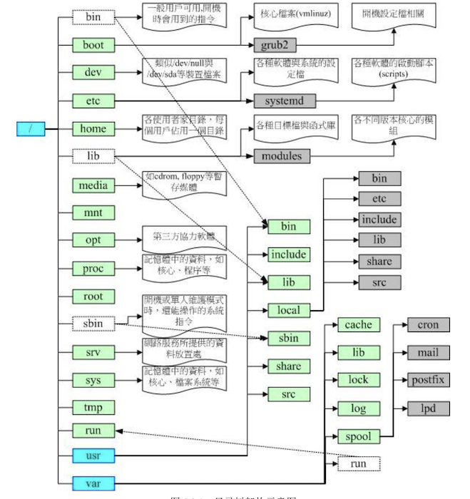

知道为什么每套 linux distribution 的配置文件、执行文件、每个目录内放置的东西其实都差不多？是因为有一套标准依据

## 🍀 Linux 目录配置的依据 FHS
由于 linux distribution 太多，所以有了 FHS（Filesystem Hierarchy Standard）标准。

该标准主要目的是：让使用者可以了解到已安装软件通常放置于哪个目录下，
FHS 的重点在于每个特定的目录下应该要放上面样子的数据。

好处就是目录架构不变的情况下，发展处开发者想要的独特风格

FHS 是根据过去的经验一直在持续的改版，依据文件系统使用的频繁与是否允许使用者随意更动，
而将目录定义成为四种交互作用的形态

|          -          |    可分享的（shareable）     | 不可分享的（unshareable） |
|:-------------------:|:----------------------------:|:-------------------------:|
|   不变得（static)   |     `/usr`（软件放置处）     |    `/etc` （配置文件）    |
|          -          |    `/opt `（第三方软件）     |  `/boot` （开机与核心）   |
| 可变动的（variable) |  `/var/mail` （使用者邮箱)   |  `/var/run` （程序相关）  |
|          -          | `/var/spool/news` （新闻组） | ` /var/lock` （程序相关） |


上表中是一些代表性的目录，而下面放置的数据后面会讲到，这里主要了解什么是那四个类型？

- 可分享的：

  可以分享给其他系统挂载使用的目录；所以包括执行文件与用户的邮件等数据，是能够分享给网络上其他主机挂载用的目录
- 不可分享的：

  自己机器上面运行的装置文件或则是与程序有关的 socket 文件等，由于仅与自身机器有关，就不适合分享了
- 不变得：

  有些数据是不会经常变动的，跟随 distribution 而不变动的。例如函数库、文件说明文件、系统管理员所管理的主机服务配置文件等
- 可变动的：

  经常改变的数据，例如登录文件、一般用户可自行收受的新闻组等

事实上 FHS 针对目录树架构仅定义出三层目录下应该放置什么数据：

- `/` ： root 根目录，与开机系统有关
- `/usr` ：unix software resource 与软件安装/执行有关
- `/var`：variable 与系统运作过程有关

### 根目录 / 的意义与内容

根目录是整个系统最重要的一个目录，里面所有的目录都是由根目录衍生出来的，同时也与  
开机、还原、系统修复等动作有关。

因此 FHS 标准建议是：根目录所在分区槽应该越小越好，且应用程序所安装的软件最好不要与根目录放在同一个分区槽内，
报纸根目录越小越好。如此不但效能较佳，根目录所在的文件系统也较不容易发生问题

因此 FHS 定义出根目录下应该要有以下目录存在，即使没有实体目录，也希望至少有连接文件存在

第一部分：FHS 要求必须要存在的目录

- `/bin`

  系统有很多放置执行文件的目录，单 /bin 比较特殊。
  因为放置的是在单人维护模式下还能够被操作的指令。

  /bin 下的指令可以被 root 与一般账户所使用，主要有 cat、chmod、chown、date、mv、mkdir、cp、bash 等常用命令
- `/boot`

  主要放置开机会使用到的文件，包括 linux 核心文件以及开机选单与开机锁需配置文件等。

  **Linux kernel 常用额文件名为 vmlinuz** ，如果使用 grub2 开机管理程序，则还会存在 /boot/grub2 这个目录
- `/dev`

  任何装置与接口设备都是以文件形态存在这个目录当中。只要透过存取这个目录下的某个文件，
  就等于存取某个装置，比较重要的文件有 /dev/null、/dev/zero、/dev/tty、/dev/loop*、/dev/sd* 等
- `/etc`

  系统主要的配置文件几乎都放在这个目录中，例如人员的账户密码文件、各种服务的启动文件等，
  一般来说，这个目录下的各文件属性是可以让一般使用者查阅的，但是只有 root 有权利修改。
  **FHS 建议不要放置可执行文件 (binary)** 在这个目录中。

  比较重要的有 /etc/modprobe.d、/etc/passwd、/etc/fstab、/etc/issue 等。

  另外 FHS 还规范几个重要的目录页最好咋 /etc 目录下：

  - `/etc/opt/` ：必要，放置第三方协力软件 /opt 的相关配置文件
  - `/etc/xqq/` ：建议，与 x window 有关的各种配置文件，尤其是 xorg.conf 这 x server 的配置文件
  - `/etc/sgml` ：建议，与 SGML 格式有管的各项配置文件
  - `/etc/xm` ：建议，与 XML 格式有关的各项配置文件
- `/lib`

  系统的函式库非常的多，而 lib 下放的是在 **开机时会用到的函数库**，以及在 /bin 和 /sbin 下的指令会呼叫的函数库。

  另外 FHS 还要求 /lib/modules 目录存在，主要放可抽换式的核心先关模块（驱动程序）
- `/media`

  放的是可移除的设备，例如 软盘、光盘、 DVD 等都暂时挂载于此。

  常见的有 /media/floppy、/media/cdrom 等

- `/mnt`

  如果暂时挂载某些额外的设备，一般建议可以放到这个目录中，在很早的时候该目录用途与 /mnt 相同，
  只是有了 /media 后，这个目录就用来暂时挂载用了
- `opt`

  放第三方协力软件的目录。比如 KDE 这个桌面管理系统是一个独立的计划，不过他可以安装到 linux 系统中，
  因此 KDE 就建议放置到该目录下了。

  如果你想要自行安装额外的软件（非原本 distribution 提供的），那么也建议放这里，
  不过，以前的 linux 系统中，还是习惯放在 **/usr/local** 目录下
- `run`

  早期的 FHS 规定系统开机后所产生的各项信息应该放置到 /var/run 目录下，
  新版的则规范到 /run 目录下了，由于 /run 可以用来内存仿真，因此效能上会好很多
- `/sbin`

  Linux 有非常多的指令是用来设置系统环境的，这些指令只有 root才能够利用来设置系统，
  其他用户只能用来「查询」。放在 /sbin 下的为开机过程中所需要的，包括了开机、修复、还原系统所需要的指令。

  至于某些服务器软件程序，一般放置到 /usr/sbin 中。
  至于本机自行安装的软件产生的系统执行文件（system binary）则放到 /usr/local/sbin 中了。

  常见的指令包括：fdisk、fsck、ifconfig、mkfs 等
- `/srv`

  src 可以视为 「service」的缩写，是一些网络服务启动之后，这些服务所需要取用的数据目录。
  常见的服务如 www、ftp 等。例如：www 服务器需要的网页资源就可以放在 /srv/www 里面。

  不过，系统的服务数据如果尚未要提供给英特网上任何人浏览的话，预设还是建议放在 /var/lib 下

- `/tmp`

  一般用户或则是正在执行的程序暂时放文件的地方。该目录是任何人都可以存取的，所以需要定期清理一下。
  因此 FHS 甚至建议在开机时，应该删除该目录下的文件

- `/usr`：属于第二层 FHS 规范，后续介绍
- `/var`：属于第二层 FHS 规范，主要放置变动性的数据，后续介绍

第二部分：FHS 建议可以存在的目录

- `/home`

  系统默认的用户目录。在你新增一个一般使用者账户时，默认的用户家目录都会规范到这里来。
  比较重要的是，家的木有两种代号：

  - ~：代表目前这个用户的家目录
  - ~mrcode：则代表 mrcode 的家目录
- `/lib<qual>` 用来存放于 /lib 不同的格式的二进制函数库，例如支持 64 位的 /lib64 函数库
- `/root`

  系统管理员 root 的家目录。之所以放这里，是因为如果进入单人维护模式而仅挂载根目录时，该目录就能够拥有 root 的家目录，
  所以会希望 root 的家目录与根目录放同一个分区槽中

事实上 FHS 针对目录所定义的标准就仅有上面的规范，不过还有其他的目录一需要了解下，
也是 linux 当中几个非常重要的目录：

- `/lost+found`

  这个目录使用标准的 ext2/3/4 文件系统格式才会产生的一个目录，目的是当文件系统发生错误时，
  将一些遗失的片段放到这个目录下。

  不过如果使用的是 xfs 文件系统的话，就不会存在这个目录了

- `/proc`

  这个目录本身是一个「虚拟文件系统（virtual filesystem），放的数据都在内存当中，
  例如系统核心、进程信息（process）、周边装置的状态以及网络状态等。

  因为这个目录下的数据都是内存当中，使用本身不占任何硬盘空间。比较重要的文件：

  ```
  /proc
    cpuinfo
    dma
    interrupts
    ioports
    net/*
  ```
  等
- `/sys`

  与 proc 非常类似，也是一个虚拟的文件系统，主要也是记录核心与系统硬件信息较相关的信息。
  包括目前已加载的核心模块与核心侦测到的硬件装置信息等。同样不占用硬盘容量

### /usr 的意义与内容

根据 FHS 的基本定义， /usr 里面放置的数据属于可以分享的与不可变动的，
如果你知道如何透过网络进行分区槽的挂载（例如在服务器篇会谈到的 NFS 服务器），
那么 /usr 确实可以分享给局域网内的其他主机来使用

/usr 不是 user 的缩写，而是 Unix Software Resource 的缩写（Unix 操作系统软件资源），
FHS 建议所有软件开发者，应该将他们的数据合理的分辨放置到这个目录下的次目录，而不要自行建立该软件自己独立的目录。

因为所有系统默认的软件（distribution 发布者提供的软件）都会放置到 /usr 下，
因此该目录类似 windows 「c:/windows 和 c:/Program files」这两个目录的综合体。

一般来说 /usr 的此目录建议有以下：

第一部分：FHS 要求必须要存在的目录

- `/usr/bin/`

  所有一般用户能够使用的指令都放在这里。 CentOS7 新版已经将全部的用户指令放在这里，
  而使用连接文件的方式将 /bin 连接到这里。也就是说 /usr/bin 与 /bin 是一样的了。
  而且 FHS 要求在此目录下不应该有子目录
- `/usr/lib/`

  基本上 与 /lib 功能相同，使用 /lib 就是连接到此目录的
- `/usr/local/`

  系统管理员在本机自行安装自己下载的软件（非 distribution 默认提供），建议安装到此目录。
  比如，distribution 提供的软件较旧，想安装新的但是又不想移除旧版本的，就可以将新版安装到这里。

  该目录下也是具有 bin、etc、include、lib 的次目录
- `/usr/sbin`

  非系统正常运作所需要的系统指令。最长久的就是某些网络服务器软件的指令（daemon）。
  不过功能基本与 /sbin 差不多，因此 /sbin 也是连接到此目录的
- `/usr/share/`

  主要放置只读架构的数据文件和共享文件。在该目录下的数据几乎是不分硬件架构均可读取的数据，
  因为几乎上都是文本文件。常见的还有以下次目录

  - `/usr/share/man`：联机帮助文件
  - `/usr/share/doc`：软件杂项的文件说明
  - `/usr/share/zoneinfo` 与时区有关的时区文件

第二部分：FHS 建议可以存在的目录

- `/usr/games/`：与游戏比较相关的数据
- `/usr/include`：

  c/c++ 等程序语言的档头（header）与包含档（include）放置处，当我们以 tarball 方式
  （tar.gz 的方式安装软件）安装某些数据时，会使用到里头的许多包含档
- `/usr/libexe`

  某些不被一般使用者惯用的执行档或脚本，例如大部分的 x 窗口下的操作指令
- `/usr/lib<qual>`

  与 `/lib<qual>` 功能相同，连接过来的
- `/usr/src`

  一般源码建议放这里，src 有 source 的意思。
  至于核心源码则建议放到 /usr/src/linux 目录下

### /var 的意义与内容

如果 /usr 是安装时会占用较大硬盘容量的目录，那么 /var 则是在运行后才会渐渐占用容量的。
主要放置的是针对常态性变动的文件，包括 cache、登录文件（log file）以及某些软件所产生的文件，
包括程序文件（lock file，run file），或则例如 mysql 数据库的文件等，
常见的目录有

第一部分：FHS 要求必须要存在的目录

- `/var/cache`：应用程序运行中使用的缓存文件
- `/var/lib`：

  程序本身执行过程中，需要用到的数据文件存放处。在此目录下各自的软件应该要有各自的目录，
  比如：mysql 数据库放到 /var/lib/mysql 而 rpm 的数据库则放到 /var/lib/rpm
- `/var/lock`

  某些装置或是文件资源一次只能被一个程序使用，所以这里存放的是加锁的标识，
  目前此目录已经挪到 /run/lock 中了
- `/var/mail`：个人电子邮件信箱目录，不过也被放置到了 /var/spool/mail 中了，通常两个目录互为连接文件
- `/var/run`

  某些程序或则是服务启动后，会将他们的 PID 放置在这个目录下，与 /run 相同，也连接到 /run 下了。
  至于 PID  后续讲解
- `/var/spool`

  通常放置一些对了数据，这些数据被使用后通常都会被删除。
  比如：系统受到新信会放到 /var/spool/mail 中，但使用者手下该信件后该封信原则上就会被删除。
  信件如果展示寄不出去，则会放到 /var/spool/mqueue 中。等待被送出后会被删除。

  如果是工作排程数据（crontab）就会被放到 /var/spool/cron 目录中

建议在读完整个基础篇之后，可以挑战 FHS 官网英文文件，会让你对于 linux 操作系统的目录有更深入的了解

### 针对 FHS 各家 distribution 的异同，与 CentOS 7 的变化

由于 FHS 仅是定义出上层 / 与次层 /var 的目录内容应该放置的文件或目录，
其他的就由开发者自行配置了。

如： CentOS 网络设置数据放在 /etc/sysconfig/network-scripts 下。
但是 SuSE 的则放在 /etc/sysconfig/netwok 目录下，所以名称不一致，但是记住大致的 FHS 标准，差异性其实不大

centOS7 相对于老版做了改进，将许多原本应该要在  / 目录中的数据全部挪到 /usr 里面去，然后进行连接设置。
包括以下这些：

- /bin -> /usr/bin
- /sbin -> /usr/sbin
- /lib -> /usr/lib
- /lib64 -> /usr/lib64
- /var/lock -> /run/lock
- /var/run -> /run

## 🍀 目录树（directory tree）

在 linux 下，所有的文件与目录都是由根目录开始的，所以称为这种配置方式为 目录树，主要特性如下：

- 目录树的起始点为根目录 （/)
- 每个目录可以使用本地端的分区（partition）文件系统，也可以使用网络上的文件系统。举例来说，就是可以利用 Network File System（NFS）服务器挂载某些特定的目录
- 每一个文件在此目录树种的文件名（包含完整路径）都是独一无二的

可以使用命令 `ls -l /` 来查看根目录下又哪些文件与数据。
下图将较为重要的文件数据列出来，那么目录树架构如下图这样



学习了这么多，那么现在回去看看安装前 [主机规划与磁盘划分](../02/)，对于当初如何要这样划分，
现在你就明白了。

根据 FHS 的定义，最好能将 /var 独立出来，因为当 /var 死掉时，你的根目录还会活着，还可以进入救援模式

## 🍀 绝对路径与相对路径

文件名与路径的写法分为：

- 绝对路径：由根目录开始写起的文件或目录，例如 /home/mrcode/.bashrc
- 相对路径：开头不是 / 则是相对路径，例如：  ./home/mrcode

对于 . 的概念：

- `.`：代表当前目录，也可以使用 ./ 来表示
- `..`：代表上一层目录，也可以使用 ../ 来表示

## 🍀 CentOS 的观察，linux 版本查询

除了第一章中谈到的 Linux distribution 的差异性，除了 FHS 之外，还有个 Linux Standard Base（LSB）
的标准是可以依循的。

可以简单的使用 ls 来查看 FHS 规范的目录是否正确的存在你的 Linux 系统中，
那么 支持 LSB 标准的 distribution 在 `https://www.linuxbase.org/lsb-cert/productdir.php?by_lsb`
中被列出

如果想要知道确切的核心与 LSB 所需求的几种重要的标准的话，就需要例如 uname 与 lsb_release 等指令来查询了。

lsb_release 软件不是默认安装软件了，因此需要先安装。

但是这里，新安装的机器居然不能连接外网，可以与宿主机通网了。那么这里无法安装，只能先记录命令

```bash
# 检查 linux 核心与操作系统的位版本
# 查看核心版本
[mrcode@study ~]$ uname -r
3.10.0-1062.el7.x86_64
# 查看操作系统位版本
[mrcode@study ~]$ uname -m
x86_64

# 如果可以联网的话，可以安装 lsb_release 指令（使用 root 身份）
yum install redhat-lsb
# 安装完成之后，使用指令
lsb_release -a

# 就会显示 LSB Version 等版本信息，如下类似的信息
Distributor ID：CentOS
Description : CentOS linux release 7.0(Core)
Release :  7.0
```

这里不能联网就先不去要捣鼓联网，因为后面会讲解网络部分，会使用到这种没有网络的场景
