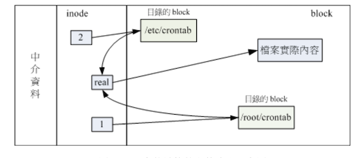

本章讲解如何查询整体文件系统的总容量与每个目录所占用的容量。
此外前面谈到的文件类型中尚未将清楚的连接文档（link file）也会在这里介绍

## 🍀 磁盘与目录的容量
磁盘整体数据是在 superblock 区块中，但是每个各别文件的容量则在 inode 中记载的。
可以使用如下指令查询：

- df：列出文件系统的整体磁盘使用量
- du：评估文件系统的磁盘使用量（常用在预估目录所占容量）

### df

```bash
df [-ahikHTm] [目录或文件名]
```
- a：列出所有的文件系统，包括系统特有的 /proc 等文件系统
- k：以 KBytes 的容量显示个文件系统
- m：以 MBytes 的容量显示
- h：以人类容易阅读的 GBytes、MBytes、KBytes 等格式自行显示
- H：以 M=1000K 取代 M=1024k 的进位方式
- T：连同该 partition 的 filesystem 名称（例如 xfs）也列出
- i：不用磁盘容量，而已 inode 的数量来显示

实践练习

将系统内所有的 filesystem 列出来

```bash
[mrcode@study ~]$ df
Filesystem              1K-blocks    Used Available Use% Mounted on
devtmpfs                   578464       0    578464   0% /dev
tmpfs                      595476       0    595476   0% /dev/shm
tmpfs                      595476    8660    586816   2% /run
tmpfs                      595476       0    595476   0% /sys/fs/cgroup
/dev/mapper/centos-root  10475520 4795672   5679848  46% /
/dev/mapper/centos-home   5232640   40552   5192088   1% /home
/dev/sda2                 1038336  174108    864228  17% /boot
tmpfs                      119096      12    119084   1% /run/user/42
tmpfs                      119096       0    119096   0% /run/user/1000
# 不加任何选项，会默认将系统内所有的（不含特殊内存内的文件系统与 swap）都以 1 Kbytes 的容量列出来
# /dev/shm 是与内存有关的挂载，可以先忽略
```

- Filesystem：代表该文件系统是在哪个 partition
- 1k-block2：该列下的单位为 1kb，可以利用 -h 或 -m 来改变容量
- Used：已使用掉的磁盘空间
- Available：可用空间
- Use%：磁盘使用率
- Mounted on：磁盘挂载的目录（挂载点）

将容量结果以容易阅读的容量格式显示

```bash
[mrcode@study ~]$ df -h
Filesystem               Size  Used Avail Use% Mounted on
devtmpfs                 565M     0  565M   0% /dev
tmpfs                    582M     0  582M   0% /dev/shm
tmpfs                    582M  8.5M  574M   2% /run
tmpfs                    582M     0  582M   0% /sys/fs/cgroup
/dev/mapper/centos-root   10G  4.6G  5.5G  46% /
/dev/mapper/centos-home  5.0G   40M  5.0G   1% /home
/dev/sda2               1014M  171M  844M  17% /boot
tmpfs                    117M   12K  117M   1% /run/user/42
tmpfs                    117M     0  117M   0% /run/user/1000
```

将系统内的所有特殊文件格式及名称都列出来

```bash
[mrcode@study ~]$ df -aT
Filesystem              Type       1K-blocks    Used Available Use% Mounted on
sysfs                   sysfs              0       0         0    - /sys
proc                    proc               0       0         0    - /proc
devtmpfs                devtmpfs      578464       0    578464   0% /dev
securityfs              securityfs         0       0         0    - /sys/kernel/security
tmpfs                   tmpfs         595476       0    595476   0% /dev/shm

# 这里只是其中一部分，还有很多，几乎上都在内存中，例如 /proc 这个挂载点
# 因此这些特殊的文件系统都不会占用磁盘空间
```

将 /etc/ 下的可用的磁盘容量以易读格式显示

```bash
[mrcode@study ~]$ df -h /etc/
Filesystem               Size  Used Avail Use% Mounted on
/dev/mapper/centos-root   10G  4.6G  5.5G  46% /

# 在 df 后面加上目录或则是文件时，df 会自动分析该目录或文件所在的 partition，
# 并将该 partition 容量显示出来，所以就可以知道该目录下又多少容量可用了
```

将目前各个 partition 当中可用的 inode 数量列出

```bash
[mrcode@study ~]$ df -ih
Filesystem              Inodes IUsed IFree IUse% Mounted on
devtmpfs                  142K   382  141K    1% /dev
tmpfs                     146K     1  146K    1% /dev/shm
tmpfs                     146K   653  145K    1% /run
tmpfs                     146K    16  146K    1% /sys/fs/cgroup
/dev/mapper/centos-root   5.0M  150K  4.9M    3% /
/dev/mapper/centos-home   2.5M   237  2.5M    1% /home
/dev/sda2                 512K   340  512K    1% /boot
tmpfs                     146K     9  146K    1% /run/user/42
tmpfs                     146K     1  146K    1% /run/user/1000

# -i 主要列出可用的 inode 剩余容量与总容量
# 会发现，通常 inode 的数量剩余逗比 block 还要多
```

由于 df 主要读取的数据几乎都是针对一整个文件系统，因此读取的范围主要是在 Superblock 内的信息，所以该指令显示结果速度非常快速。
在显示结果中，要特别留意根目录容量，因为我们所有的数据都是由根目录衍生出来的（这里应该说的是，当前这颗磁盘分区，没有额外的挂载，几乎上所有数据都放在了同一个分区上。

另外需要注意的是：如果使用 -a 参数时，系统会出现 /proc 这个挂载点，但是里面的东西
都是 0，不要紧张。 /proc 的东西都是 linux 系统所需要加载的系统数据，
而且是挂载在「内存中」的，所以不会占用磁盘空间

至于 /dev/shm/ 目录，其实是利用内存虚拟出来的磁盘空间，通常是总物理内存的一半。
由于是透过内存仿真出来的磁盘，在该目录下建立任何数据文件时，访问速度非常快。
只是 **该目录下的东西不是持久性的，下次开机后就失效了**

### du

```bash
du [-ahskm] 文件或目录名称
```

- a：列出所有的文件与目录容量，默认仅统计目录下的文件量
- h：以人类易读的容量格式显示
- s：列出总量，而不列出每个各别的目录占用容量
- S：不包括子目录下的总计，与 -s 有差别
- k：以 KBytes 列出容量显示
- m：以 MBytes 列出容量显示

实践练习

```bash
# 列出当前目录下的所有文件容量
[root@study ~]# du
4       ./.cache/dconf
4       ./.cache/abrt
8       ./.cache
4       ./.dbus/session-bus
4       ./.dbus
0       ./.config/abrt
0       ./.config
0       ./.local/share
0       ./.local
56      .
# 不加参数会默认当前目录下的文件与目录所占用的磁盘空间
# 实际显示只显示了目录，不包含文件
# 下面哪个 . 的总量为 56 K(默认是以 kbytes 显示的)，是 目录 + 文件占用的
# 看这里的几个目录加起来肯定没有 56 这么大

# 列出当前目录下所有文件容量（包括文件）
[root@study ~]# du -a
4       ./.bash_logout
4       ./.bash_profile
4       ./.bashrc
4       ./.cshrc
4       ./.tcshrc
4       ./anaconda-ks.cfg  # 省略了很多显示结果，这里就是一个文件
4       ./.cache/dconf/user
56      .

# 检查根目录下每个目录所占用的容量
[root@study ~]# du -sm /*
0       /bin
138     /boot
0       /dev
42      /etc
8       /home
0       /lib
0       /lib64
0       /media
0       /mnt
0       /opt
du: 无法访问"/proc/32240/task/32240/fd/3": 没有那个文件或目录
du: 无法访问"/proc/32240/task/32240/fdinfo/3": 没有那个文件或目录
du: 无法访问"/proc/32240/fd/3": 没有那个文件或目录
du: 无法访问"/proc/32240/fdinfo/3": 没有那个文件或目录
0       /proc       # 不占用空间
1       /root
9       /run
0       /sbin
0       /srv
0       /sys
1       /tmp
4182    /usr      # 可以看到系统初期最大的就是这个了
347     /var
```

与 df 不一样，du 指令会直接到文件系统内搜寻所有的文件数据，所以上述例子显示不是很快，
因为要搜寻文件数据。默认容量为 kb，可使用 -h 等参数来格式化容量

```bash
# -s 与 -s 的区别，看总量
# -s 为 56k 是包含了下面的所有子目录
# -S 不包含子目录的 只有 44k
[root@study ~]# du -sh
56K     .
[root@study ~]# du -Sh
4.0K    ./.cache/dconf
4.0K    ./.cache/abrt
0       ./.cache
4.0K    ./.dbus/session-bus
0       ./.dbus
0       ./.config/abrt
0       ./.config
0       ./.local/share
0       ./.local
44K     .
```

## 🍀 实体链接与符号链接 ln
link 链接在前面 Linux 文件属性 与 Linux 文件种类与扩展名 中简单讲解过。本章详细讲解

链接文档有两种：

- 类似 windows 的快捷方式的文件
- 通过 inode 连接来产生新文档名，而不是产生新文件，**称为实体链接**

### Hard Link 实体链接、硬式连结或实际连结

前面文件系统中了解到：

- 每个文件都会占用一个 inode，文件内容由 inode 记录指向
- 想要读取该文件，必须要经过目录记录的文件名来指向到正确的 inode 号码才能读取

也就是说，文件名只与目录有关，但是文件内容则与 inode 有关。
因此有没有可能：多个文档名对应到同一个 inode 号码呢？肯定有，这就是 Hard Link 的由来。

简单说：hard link 只是在某个目录下新增一个文件名链接到某个 inode 号码的关联记录而已

例如：假设 /root/crontab 是 /etc/crontab 的实体链接（他们两个文件名都对应到同一个 inode），
这两个文件名的所有相关信息都会一模一样（除了文件名之外）

```bash
[root@study ~]# ll -i /etc/crontab
# 查看文件属性与 inode 号码
17639161 -rw-r--r--. 1 root root 451 6月  10 2014 /etc/crontab
# 建立实体链接
[root@study ~]# ln /etc/crontab .
# 对比两个文件的属性
[root@study ~]# ll -i /etc/crontab crontab
17639161 -rw-r--r--. 2 root root 451 6月  10 2014 crontab
17639161 -rw-r--r--. 2 root root 451 6月  10 2014 /etc/crontab
```



上面原始文件的 1 变成了 2，该字段称为「连结」，表示有多少个文件名链接到这个 inode 号码;

- 这里将任意一个文件删除，其实 inode 与 block 都还是存在的。
- 无论通过哪一个文件来编辑内容，都会反应到 inode 与 block 中

一般来说，使用 hard link 设置连接文件时，磁盘空间与 inode 的数目都不会改变。
除非遇到说，在目录中新增文件名时，刚好 block 满了，那么就会多出来一个 block 记录文件名

限制如下：

- 不能跨 Filesystem ：不是同一个 indoe 号码了，肯定不能了
- 不能 link 目录：

  如果使用 hard link 链接到目录时，链接的数据需要连同被链接目录下所有数据都建立连接。
  当新建文件时需要建立该文件的 hard link，这对环境影响太大，所以不支持

## 🍀 Symbolic Link 符号链接、快捷方式
Symbolic 就是建立一个独立的文件，而这个文件会让数据的读取指向他 link 的那个文件名。
原始文件被删，该文件肯定也打不开了

```bash
# 建立符号链接
[root@study ~]# ln -s /etc/crontab crontab2
# 对比
[root@study ~]# ll -i /etc/crontab crontab crontab2
17639161 -rw-r--r--. 2 root root 451 6月  10 2014 crontab
17639161 -rw-r--r--. 2 root root 451 6月  10 2014 /etc/crontab
# 可以看到上面两个一模一样，有一个 hard link 和原始文件。并且他们的 inode 是 2
# 而下面这个符号链接的信息和上面的都不一样，唯独后面有一个连接指向了原始文件
25377009 lrwxrwxrwx. 1 root root  12 10月 22 00:00 crontab2 -> /etc/crontab

```


```bash
ln [-sf] 来源文件 目标文件

-s：不加参数就是建立实体链接 hard link，加 -s 就是建立符号链接
-f：如果 目标文件 存在时，就主动的将目标文件直接移除后再建立
```

实践练习

```bash
# 将 /etc/passwd 复制到 /tmp 并观察 inode 与 block
[root@study ~]# cd /tmp/
[root@study tmp]# cp -a /etc/passwd .
[root@study tmp]# du -sb; df -i
153266  .   # du -sb 计算 /tmp/ 下有多少 bytes 容量
文件系统                  Inode 已用(I) 可用(I) 已用(I)% 挂载点
/dev/mapper/centos-root 5242880  153177 5089703       3% /
# df -i 显示 inode 的使用量

# 将 /tmp/passwd 制作 hard link 称为 passwd-hd 文件，并观察文件与容量
[root@study tmp]# ln passwd passwd-hd
[root@study tmp]# du -sb; df -i
153266  .
文件系统                  Inode 已用(I) 可用(I) 已用(I)% 挂载点
/dev/mapper/centos-root 5242880  153177 5089703       3% /
# 观察总容量 153266 没有改变
# 观察已用的 inode 153177 没有改变

# 将 /tmp/passwd 建立符号链接
[root@study tmp]# du -sb; df -i
153272  .
文件系统                  Inode 已用(I) 可用(I) 已用(I)% 挂载点
/dev/mapper/centos-root 5242880  153178 5089702       3% /
# 观察总容量 153266 变成了 153272
# 观察已用的 inode 153177 变成了 153178

[root@study tmp]# ls -li passwd*
16797769 -rw-r--r--. 2 root root 2323 10月  4 18:31 passwd
16797769 -rw-r--r--. 2 root root 2323 10月  4 18:31 passwd-hd
16807525 lrwxrwxrwx. 1 root root    6 10月 22 00:20 passwd-so -> passwd
# 可以看到这里的符号链接文件大小 6 kb，而上面 153272 - 153266 = 6

## 🍀 删除源文件 passwd ，其他两个链接文件是否能打开？
[root@study tmp]# rm passwd
rm：是否删除普通文件 "passwd"？y
[root@study tmp]# cat passwd-hd
... 正常显示
[root@study tmp]# cat passwd-so
cat: passwd-so: 没有那个文件或目录

# 查看状态
[root@study tmp]# ls -l passwd*
-rw-r--r--. 1 root root 2323 10月  4 18:31 passwd-hd
# 这里后面的文件名在能链接到源文件的时候，会显示绿色，现在链接不到了就会显示红色了
lrwxrwxrwx. 1 root root    6 10月 22 00:20 passwd-so -> passwd

```


```bash
# 如果使用下面的命令，将 /bin/ 目录创建了一个符号链接（快捷方式）
ln -s /bin /root/bin
[root@study bin]# ll -l /root/
lrwxrwxrwx. 1 root   root      5 10月 22 00:28 bin -> /bin/

# 那么这个时候如果你要执行下面的命令的话，
# 这里千万不要执行，否则会将 bin 下的文件数据全部干掉的
cd /root/bin; rm .

# 通过下面的方式查看，和硬链接一样，他们都连到了同一个 node
# 所以这里与文件链接还不一样，上面看是单独的目录 -> /bin/
# 这里  cd 通过快捷方式进入到真正的目录下，所以操作等同于操作 bin 本身
[root@study bin]# ls -lid /bin/ /root/bin/
78 dr-xr-xr-x. 2 root root 57344 10月 11 05:03 /bin/
78 dr-xr-xr-x. 2 root root 57344 10月 11 05:03 /root/bin/

# 使用命令删除刚刚那个目录链接文档
# 注意这里的提示。带斜杠貌似是直接指向了连接的目录，不带才是符号链接本身
[root@study bin]# rm /root/bin/
rm: 无法删除"/root/bin/": 是一个目录
[root@study bin]# rm /root/bin
rm：是否删除符号链接 "/root/bin"？y
```

基本上，符号链接的用途比较广。需要掌握

### 关于目录的 link 数量

创建一个目录 link 会显示几？对于文件来说会显示 1.那么目录呢？

```bash
[root@study tmp]# ls -ld /tmp/
# link 数量为 40
drwxrwxrwt. 40 root root 4096 10月 22 00:43 /tmp/
# 创建目录
[root@study tmp]# mkdir testing1
[root@study tmp]# ls -ld /tmp/
# /tmp/ link +1 变成 41 了
drwxrwxrwt. 41 root root 4096 10月 22 00:44 /tmp/

# 看下该目录的 link 为 2，表示有两个,是为什么？
[root@study tmp]# ls -ld /tmp/testing1/
drwxr-xr-x. 2 root root 6 10月 22 00:44 /tmp/testing1/

# 新建立的一个目录下包含了当前目录
# /tmp/testing1/ /temp/testing1/.  这两个路径都链接到同一个 inode，所以 link 为 2
[root@study tmp]# ls -al /tmp/testing1/
总用量 8
drwxr-xr-x.  2 root root    6 10月 22 00:44 .
drwxrwxrwt. 41 root root 4096 10月 22 00:46 ..

```
