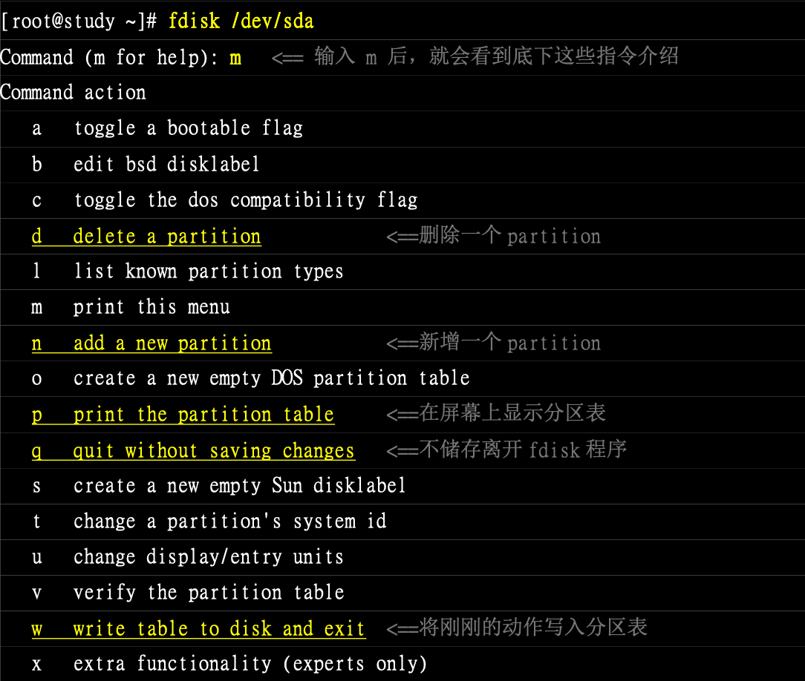
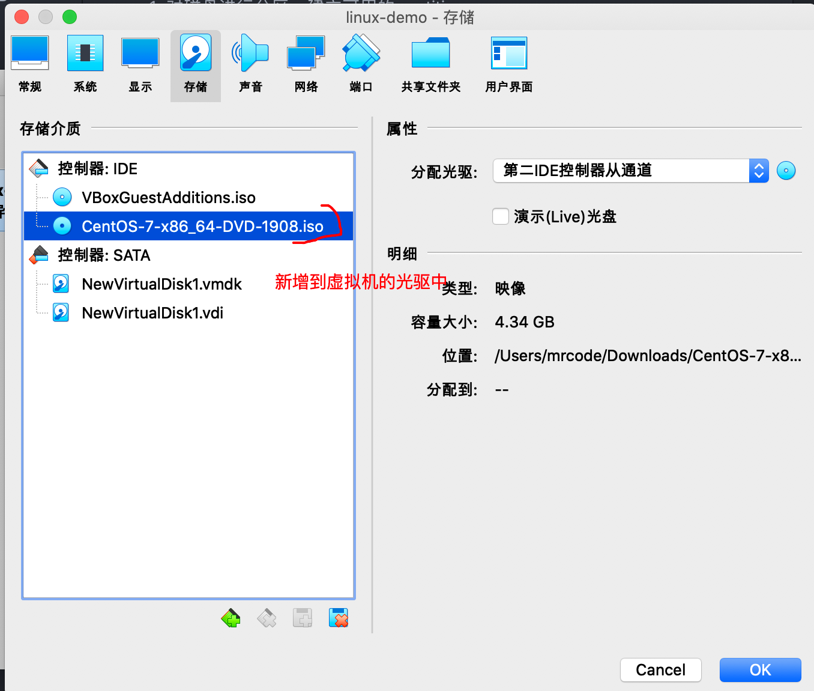

对于系统管理者（root）而言，磁盘管理是非常重要的一环，尤其是近来磁盘已经渐渐被当成是消耗品了。

想要在系统里面新增一颗磁盘时，应该做的有：

1. 对磁盘进行分区，建立可用的 partition
2. 对该 partition 进行格式化（format），建立系统可用的 filesystem
3. 可选：对刚刚建立好的 filesystem 进行检查
4. 在 linux 系统上，建立挂载点（目录），并将它挂载上来

当然在上述步骤中有很多细致的需要考虑，比如磁盘分区槽（partition）需要多大？是否需要加入 jounal 的功能？inode 与 block 的数量应该如何划分等。

但是这些问题的决定，都需要与你的主机用途来考虑的，因此在本节，讲解几个入门操作，其他的自己去实战了解

## 🍀  观察磁盘分区状态

磁盘分区主要有 MBR 和 GPT 两种格式，支持的工具不一样（后续讲解的 parted 都支持），
习惯使用的是 fdisk 、gdisk 来处理分区。

###  lsblk 列出系统上所有磁盘列表

```bash
lsblk [-dfipt] [device]
```

- d：仅列出磁盘本身，并不会列出该磁盘的分区数据
- f：同时列出该磁盘内的文件系统名称
- i：使用 ASCII 的线段输出，不要使用复杂的编码（在某些环境下很有用）
- m：同时输出该装置在 /dev 下的权限数据（rwx）
- p：列出该装置的完整文件名，而不是仅列出最后的名字
- t：列出该磁盘装置的详细数据，包括磁盘队列机制、预读写的数据量大小等

实践练习

列出本系统下的所有磁盘与磁盘内的分区信息

```bash
[mrcode@study ~]$ lsblk
NAME            MAJ:MIN RM  SIZE RO TYPE MOUNTPOINT
sda               8:0    0 40.8G  0 disk 				# 这是一整颗磁盘
├─sda1            8:1    0    2M  0 part
├─sda2            8:2    0    1G  0 part /boot
└─sda3            8:3    0   30G  0 part 				# 在 sda3 内的其他的文件系统
  ├─centos-root 253:0    0   10G  0 lvm  /
  ├─centos-swap 253:1    0    1G  0 lvm  [SWAP]
  └─centos-home 253:2    0    5G  0 lvm  /home
sdb               8:16   0    2G  0 disk
sr0              11:0    1 73.6M  0 rom
```

从输出来看，主要有 sda 、sdb、sr0 装置，而 sda 下面又分了 3 个分区，其中 sda3 还有 LVM 产生的文件系统

- NAME：装置文件名，会省略 /dev 等前导目录
- MAJ:MIN：其实核心认识的装置都是通过这两个代码来熟悉的，分别是：`主要:次要` 装置
- RM：是否为颗拆卸装置（removable device）。如光盘、USB 磁盘等
- SIZE：容量
- RO：是否为只读
- TYPE：磁盘 disk、分区槽 partition、只读存储器 rom
- MOUTPOINT：挂载点

列出 /dev/sda (前面已经说过了，使用虚拟机不同，磁盘里面没有 vda 的，我的是 sda 哦) 装置内的所有数据的完整文件名

```bash
[root@study ~]# lsblk -ip /dev/sda
NAME                        MAJ:MIN RM  SIZE RO TYPE MOUNTPOINT
/dev/sda                      8:0    0 40.8G  0 disk
|-/dev/sda1                   8:1    0    2M  0 part
|-/dev/sda2                   8:2    0    1G  0 part /boot
`-/dev/sda3                   8:3    0   30G  0 part
  |-/dev/mapper/centos-root 253:0    0   10G  0 lvm  /
  |-/dev/mapper/centos-swap 253:1    0    1G  0 lvm  [SWAP]
  `-/dev/mapper/centos-home 253:2    0    5G  0 lvm  /home
```

### 列出装置的 UUID 等参数

使用 `lsblk -f` 可以列出来 UUID 的数据，不过习惯使用 blkid 来找出装置的 UUID，可以用来作为挂载或则是使用这个装置/文件系统用

```bash
[root@study ~]# lsblk -f
NAME            FSTYPE    LABEL           UUID                                   MOUNTPOINT
sda                                                                              
├─sda1                                                                           
├─sda2          xfs                       13d0663f-4cbd-412d-aa9f-975eb18da590   /boot
└─sda3          LVM2_memb                 cksKYp-dPYj-CCPQ-Qxpq-m6rE-bhcL-84NkM3
  ├─centos-root xfs                       7b220a88-4e13-4869-9aa9-87031303f3e1   /
  ├─centos-swap swap                      0576b616-9606-434b-91c6-b99cbba5597d   [SWAP]
  └─centos-home xfs                       d475b892-bcde-4c97-99da-497f3ff7163c   /home
sdb                                                                              
sr0             iso9660   VBox_GAs_6.0.10 2019-07-12-09-13-14-35   

# 显示格式不一样，还多了分区的 UUID，感觉上面的少了一个 dsa1 的呢？
[root@study ~]# blkid
/dev/sda1: PARTUUID="bf674a46-65e1-43b1-a348-ac2c06c25293"
/dev/sda2: UUID="13d0663f-4cbd-412d-aa9f-975eb18da590" TYPE="xfs" PARTUUID="783703d8-96cb-48fa-bfdb-853e7a0b1581"
/dev/sda3: UUID="cksKYp-dPYj-CCPQ-Qxpq-m6rE-bhcL-84NkM3" TYPE="LVM2_member" PARTUUID="cb3c0557-b7a5-493c-bab0-250a62a11099"
/dev/sr0: UUID="2019-07-12-09-13-14-35" LABEL="VBox_GAs_6.0.10" TYPE="iso9660"
/dev/mapper/centos-root: UUID="7b220a88-4e13-4869-9aa9-87031303f3e1" TYPE="xfs"
/dev/mapper/centos-swap: UUID="0576b616-9606-434b-91c6-b99cbba5597d" TYPE="swap"
/dev/mapper/centos-home: UUID="d475b892-bcde-4c97-99da-497f3ff7163c" TYPE="xfs"
```

### parted 列出磁盘的分区表类型与分区信息

```bash
# 语法：parted device_name print
[root@study ~]# parted /dev/sda print
Model: ATA VBOX HARDDISK (scsi)										# 磁盘模块名称（厂商）
Disk /dev/sda: 43.8GB															# 磁盘的总容量
Sector size (logical/physical): 512B/512B					# 磁盘的每个逻辑/物理扇区容量
Partition Table: gpt						# 分区格式
Disk Flags: pmbr_boot

# 下面是分区信息
Number  Start   End     Size    File system  Name  标志
 1      1049kB  3146kB  2097kB                     bios_grub
 2      3146kB  1077MB  1074MB  xfs
 3      1077MB  33.3GB  32.2GB                     lvm

```

## 🍀 磁盘分区：gdisk、fdisk

- MBR：使用 fdisk 分区
- GPT：使用 gdisk 分区

两个工具使用相似，通过内部的说明来操作，不需要死记硬背。刚刚通过 parted 指令输出的结果得知 sda 这个磁盘是 GPT 分区，所以下面的使用 gdisk 来操作

### gdisk

语法很简单

```bash
gdisk 装置名称
```

例：观察 /dev/sda 磁盘的分区与相关数据

```bash
[root@study ~]# gdisk /dev/sda
GPT fdisk (gdisk) version 0.8.10

Partition table scan:
  MBR: protective
  BSD: not present
  APM: not present
  GPT: present
# 找到了 GPT 的分区表
Found valid GPT with protective MBR; using GPT.

Command (? for help): ?  # 等待你输入指令，可以输入问号显示说明
b       back up GPT data to a file
c       change a partition's name
d       delete a partition		# 删除分区
i       show detailed information on a partition
l       list known partition types
n       add a new partition		# 增加分区
o       create a new empty GUID partition table (GPT)
p       print the partition table # 打印分区表（常用）
q       quit without saving changes # 不存储分区就直接离开 gdisk
r       recovery and transformation options (experts only)
s       sort partitions
t       change a partition's type code
v       verify disk
w       write table to disk and exit	# 存储分区操作后离开 gdisk
x       extra functionality (experts only)
?       print this menu

```

再来回顾下步骤：

1. 使用 lsblk 或 blkid 找到磁盘
2. 使用 parted /dev/xxx print 来找出内部的分表表类型
3. 使用 gdisk 或 fdisk 来操作

通过上面的帮助，有两个重要信息：指令 q 和 w，在 gdisk 里面执行的操作，**只有使用这两个指令后才会生效**，
使用 q 退出不生效，使用 w 生效并离开。

```bash
Command (? for help): p		# 输出目前磁盘的状态
Disk /dev/sda: 85491712 sectors, 40.8 GiB				# 磁盘文件名、扇区数量、总容量
Logical sector size: 512 bytes									# 单一扇区大小为 512 bytes
Disk identifier (GUID): 67038DBF-B66A-4D0F-92B2-BFBF0744CD1D	# 磁盘的 GPT标识符
Partition table holds up to 128 entries
First usable sector is 34, last usable sector is 85491678
Partitions will be aligned on 2048-sector boundaries
Total free space is 20467645 sectors (9.8 GiB)

# 下面是分区信息
# 分区编号 开始扇区号码			 结束扇区号码    容量大小
Number  Start (sector)    End (sector)  Size       Code  Name
   1            2048            6143   2.0 MiB     EF02  
   2            6144         2103295   1024.0 MiB  0700  
   3         2103296        65026047   30.0 GiB    8E00
# 这里的 Code linux 为 8300，swap 为 8200，不过只是一个提示，不见得真的代表此分区槽内的文件系统
```

从上表可以发现几件事情：

- 整颗磁盘还可以进行额外的分区

  最大扇区为 85491712 个，下面三个分区表（第三个）结束扇区为 65026047，
  在上面信息中也提示了空闲的扇区 `20467645 sectors (9.8 GiB)`

- 分区槽的设计中，新分区通常选用上一个分区的结束扇区号码数加 1 作为起始扇区号码

::: warning
注意不要在 MBR 分区上使用 gdisk，如果指令按错，恐怕分区记录会挂掉，
另外在 gdisk 中操作，离开的时候记得按 q ，不要按 w 就不会生效
:::

### 用 gdisk 新增分区槽

最开始安装的时候就预留了一块容量来做练习，在上面也看到了还剩余 9.8 G 的空余容量，假设有如下的分区需求：

- 1 GB 的 xfs 文件系统（linux）
- 1 GB 的 vfat 文件系统（windows）
- 0.5 GB 的 swap （linux swap）

```bash
[root@study ~]# gdisk /dev/sda
Command (? for help): p
Number  Start (sector)    End (sector)  Size       Code  Name
   1            2048            6143   2.0 MiB     EF02  
   2            6144         2103295   1024.0 MiB  0700  
   3         2103296        65026047   30.0 GiB    8E00
# 打印分区信息，主要目的是为了找到最后一个 sector 的号码，这里是 65026047
# 使用指令 n 增加物理分区
Command (? for help): n
Partition number (4-128, default 4): 4  # 分区号码，这里默认就是 4，所以可以直接按回车
First sector (34-85491678, default = 65026048) or {+-}size{KMGTP}: # 第一个扇区号码，同样有默认的
Last sector (65026048-85491678, default = 85491678) or {+-}size{KMGTP}: +1G  # 结束扇区号码
# 上面有默认的值，不需要我们自己计算扇区数量，使用 +- KMGTP 等单位容量方式来容量

# 选择未来该分区槽预计使用的文件系统，预设的都是 linux 文件系统的 8300
Current type is 'Linux filesystem'
Hex code or GUID (L to show codes, Enter = 8300):
Changed type of partition to 'Linux filesystem'

# 再次打印，就发现多了刚刚分出来的分区信息
Command (? for help): p
Disk /dev/sda: 85491712 sectors, 40.8 GiB
Logical sector size: 512 bytes
Disk identifier (GUID): 67038DBF-B66A-4D0F-92B2-BFBF0744CD1D
Partition table holds up to 128 entries
First usable sector is 34, last usable sector is 85491678
Partitions will be aligned on 2048-sector boundaries
Total free space is 18370493 sectors (8.8 GiB)

Number  Start (sector)    End (sector)  Size       Code  Name
   1            2048            6143   2.0 MiB     EF02  
   2            6144         2103295   1024.0 MiB  0700  
   3         2103296        65026047   30.0 GiB    8E00  
   4        65026048        67123199   1024.0 MiB  8300  Linux filesystem

那么后面两个区的分区继续，记得每次分区完就打印下信息，查看是否正确

Command (? for help): n
Partition number (5-128, default 5):
First sector (34-85491678, default = 67123200) or {+-}size{KMGTP}:
Last sector (67123200-85491678, default = 85491678) or {+-}size{KMGTP}: +1G
Current type is 'Linux filesystem'
Hex code or GUID (L to show codes, Enter = 8300): 0700  # 0700 为 windows 文件系统
Changed type of partition to 'Microsoft basic data'

Command (? for help): n
Partition number (6-128, default 6):
First sector (34-85491678, default = 69220352) or {+-}size{KMGTP}:
Last sector (69220352-85491678, default = 85491678) or {+-}size{KMGTP}: +500M
Current type is 'Linux filesystem'
Hex code or GUID (L to show codes, Enter = 8300): 8200  # linux swap
Changed type of partition to 'Linux swap'

# 最后分区完成后的分区信息如下
Command (? for help): n
...
Number  Start (sector)    End (sector)  Size       Code  Name
   1            2048            6143   2.0 MiB     EF02  
   2            6144         2103295   1024.0 MiB  0700  
   3         2103296        65026047   30.0 GiB    8E00  
   4        65026048        67123199   1024.0 MiB  8300  Linux filesystem
   5        67123200        69220351   1024.0 MiB  0700  Microsoft basic data
   6        69220352        70244351   500.0 MiB   8200  Linux swap

# 分区的时候需要使用到 code，上面有对应的 code 数值了
# 如果忘记或则不知道，可以使用 l 命令来显示所有的 code 值
Command (? for help): l
0700 Microsoft basic data  0c01 Microsoft reserved    2700 Windows RE          
3000 ONIE boot             3001 ONIE config           4100 PowerPC PReP boot  
...

# 最后使用 w 命令写入磁盘分区表
Command (? for help): w

Final checks complete. About to write GPT data. THIS WILL OVERWRITE EXISTING
PARTITIONS!!

Do you want to proceed? (Y/N): y
OK; writing new GUID partition table (GPT) to /dev/sda.
Warning: The kernel is still using the old partition table.
The new table will be used at the next reboot.
The operation has completed successfully.

# 等你输入 y 确认之后，开始执行，上面的警告信息翻译如下
警告：内核仍在使用旧的分区表。
新表将在下次重新启动时使用。
操作已成功完成。

# 查看信息，发现分区中还没有出现 sda4、5、6 ，这是因为核心还没有更新
[root@study ~]# cat /proc/partitions
major minor  #blocks  name

   8        0   42745856 sda
   8        1       2048 sda1
   8        2    1048576 sda2
   8        3   31461376 sda3
   8       16    2097152 sdb
  11        0      75354 sr0
 253        0   10485760 dm-0
 253        1    1048576 dm-1
 253        2    5242880 dm-2
```

对于警告内核未生效，我们有两种方式来处理，第一种就是重新启动，另一种就是通过 partprobe 指令来处理


### partprobe 更新 Linux 核心的分区表信息

```bash
# -s 输出信息，不加则不会输出任何信息
[root@study ~]# partprobe -s
/dev/sda: gpt partitions 1 2 3 4 5 6
Warning: 无法以读写方式打开 /dev/sr0 (只读文件系统)。/dev/sr0 已按照只读方式打开。

# 查看磁盘状态，发现出现了 4、5、6 分区
[root@study ~]# lsblk /dev/sda
NAME            MAJ:MIN RM  SIZE RO TYPE MOUNTPOINT
sda               8:0    0 40.8G  0 disk 
├─sda1            8:1    0    2M  0 part 
├─sda2            8:2    0    1G  0 part /boot
├─sda3            8:3    0   30G  0 part 
│ ├─centos-root 253:0    0   10G  0 lvm  /
│ ├─centos-swap 253:1    0    1G  0 lvm  [SWAP]
│ └─centos-home 253:2    0    5G  0 lvm  /home
├─sda4            8:4    0    1G  0 part 
├─sda5            8:5    0    1G  0 part 
└─sda6            8:6    0  500M  0 part 

# 查看分区记录，也出现了 4、5、6
[root@study ~]# cat /proc/partitions 
major minor  #blocks  name

   8        0   42745856 sda
   8        1       2048 sda1
   8        2    1048576 sda2
   8        3   31461376 sda3
   8        4    1048576 sda4
   8        5    1048576 sda5
   8        6     512000 sda6
   8       16    2097152 sdb
  11        0      75354 sr0
 253        0   10485760 dm-0
 253        1    1048576 dm-1
 253        2    5242880 dm-2

```

### 用 gdisk 删除一个分区槽

```bash
[root@study ~]# gdisk /dev/sda
GPT fdisk (gdisk) version 0.8.10

Partition table scan:
  MBR: protective
  BSD: not present
  APM: not present
  GPT: present

Found valid GPT with protective MBR; using GPT.

# 查看分区信息
Command (? for help): p
Disk /dev/sda: 85491712 sectors, 40.8 GiB
Logical sector size: 512 bytes
Disk identifier (GUID): 67038DBF-B66A-4D0F-92B2-BFBF0744CD1D
Partition table holds up to 128 entries
First usable sector is 34, last usable sector is 85491678
Partitions will be aligned on 2048-sector boundaries
Total free space is 15249341 sectors (7.3 GiB)

Number  Start (sector)    End (sector)  Size       Code  Name
   1            2048            6143   2.0 MiB     EF02  
   2            6144         2103295   1024.0 MiB  0700  
   3         2103296        65026047   30.0 GiB    8E00  
   4        65026048        67123199   1024.0 MiB  8300  Linux filesystem
   5        67123200        69220351   1024.0 MiB  0700  Microsoft basic data
   6        69220352        70244351   500.0 MiB   8200  Linux swap

# 删除第 6 个分区
Command (? for help): d
Partition number (1-6): 6

# 再次查看，发现 6 不在了
Command (? for help): p
Disk /dev/sda: 85491712 sectors, 40.8 GiB
Logical sector size: 512 bytes
Disk identifier (GUID): 67038DBF-B66A-4D0F-92B2-BFBF0744CD1D
Partition table holds up to 128 entries
First usable sector is 34, last usable sector is 85491678
Partitions will be aligned on 2048-sector boundaries
Total free space is 16273341 sectors (7.8 GiB)

Number  Start (sector)    End (sector)  Size       Code  Name
   1            2048            6143   2.0 MiB     EF02  
   2            6144         2103295   1024.0 MiB  0700  
   3         2103296        65026047   30.0 GiB    8E00  
   4        65026048        67123199   1024.0 MiB  8300  Linux filesystem
   5        67123200        69220351   1024.0 MiB  0700  Microsoft basic data

# 写入并离开
Command (? for help): w

Final checks complete. About to write GPT data. THIS WILL OVERWRITE EXISTING
PARTITIONS!!

Do you want to proceed? (Y/N): y
OK; writing new GUID partition table (GPT) to /dev/sda.
Warning: The kernel is still using the old partition table.
The new table will be used at the next reboot.
The operation has completed successfully.

# 查看磁盘状态，发现 sda6 还存在，只是因为没有更新核心分区表导致的
# 使用命令 partprobe -s 更新下再查看就没有了
[root@study ~]# lsblk
NAME            MAJ:MIN RM  SIZE RO TYPE MOUNTPOINT
sda               8:0    0 40.8G  0 disk 
├─sda1            8:1    0    2M  0 part 
├─sda2            8:2    0    1G  0 part /boot
├─sda3            8:3    0   30G  0 part 
│ ├─centos-root 253:0    0   10G  0 lvm  /
│ ├─centos-swap 253:1    0    1G  0 lvm  [SWAP]
│ └─centos-home 253:2    0    5G  0 lvm  /home
├─sda4            8:4    0    1G  0 part 
├─sda5            8:5    0    1G  0 part 
└─sda6            8:6    0  500M  0 part 
sdb               8:16   0    2G  0 disk 
sr0              11:0    1 73.6M  0 rom  

```

需要注意的是：不要去处理一个 **正在使用中的分区槽** 。例如：现在已经使用了 /dev/sda5，
必须先将 /dev/sda5 先 **卸载** ，否则直接删除该分区的话，虽然磁盘会写入正确的分区信息，
但是核心会无法更新分区表的信息。

总之：千万不要处理正在活动的文件系统，先卸载后再处理

### fdisk

虽然 MBR 在未来可能会慢慢淘汰，但是如果恰巧你遇到了呢，使用方式与 gdisk 类似，下面列出指令帮助文档



## 🍀  磁盘格式化（建立文件系统）

分区完成之后需要进行格式化才能使用磁盘，可以使用指令「make filesystem，mkfs」，该指令是一个综合指令，回去调用正确的系统格式化工具软件。因为 CentOS 7 使用 xfs 作为预设文件系统，下面先介绍 mkfs.xfs ，再介绍新一代的 mkfs.ext4，最后再聊 mkfs 这个综合指令

### XFS 文件系统 mkfs.xfs

常听到的格式化其实应该称为「建立文件系统（make filesystem）」。

```bash
mkfs.xfs [-b bsize][-d parms][-i parms][-l parms][-L parms][-f][-r parms] 设备名称
```

选项与参数：下面描述关于单位的说明，没有加单位则为 bytes，可以用 k、m、g、t、p 等来解释，特殊的为 s 单位，指的是 sector 的个数

- b：后面接 block 容量，可由 512 到 64k，不过最大容量限制为 Linux 的 4k

- d：后面接 data section 的相关参数，主要的值有：

  - agcount=数值：设置需要几个存储群组（AG），通常与 CPU 有关

  - agsize=数值：每个 AG 设置为多少容量，通常 agcount/agsize 只选一个设置即可

  - file：格式的的装置是个文件而不是个装置（例如虚拟磁盘）

  - size=数值：data section 的数量，你可不将全部的容量用完的意思

  - su=数值：当有 RAID 时，哪个 stripe 数值，与下面的 sw 搭配使用

  - sw=数值：当有 RAID 时，用于存储的磁盘数量（需扣除备份碟与备用碟）

  - sunit-数值：与 su 类型，不过单位使用的是「几个 sector（512bytes大小）」

  - swidth=数值：su*sw 的值，但是以「几个 sector*（512bytes 大小）」来设置

- f：如果装置内已经有文件系统，则需要使用该参数来强制格式化

- i：与 inode 有较相关的设置，主要的设置值有：

  - size=数值：最小是 256bytes，最大是 2k，一般保留 256 足够使用了
  - internal=[0|1]：log 装置是否为内建？预设为 1 内建，如果需要使用外置的，配置下面的参数
  - logdev=device：指定 log 装置在哪个装置上
  - size=数值：指定这块登录区的容量，通常最小需要  512 个 block，大约 2M 以上

- L：指定该文件系统的表头名称 Label name

- r：指定 realtime section 的相关设置，常见的有

  - extsize=数值：就是那个重要的 extent 数值，一般不需要设置，担忧 RAID 时，最好设置与 swidth 相同的数值，最小为 4k ，最大为 1G

实践练习

```bash
# 将前面分区出来的 /dev/sda4 格式化为 xfs 文件系统
[root@study ~]# mkfs.xfs /dev/sda4
meta-data=/dev/sda4              isize=512    agcount=4, agsize=65536 blks
         =                       sectsz=512   attr=2, projid32bit=1
         =                       crc=1        finobt=0, sparse=0
data     =                       bsize=4096   blocks=262144, imaxpct=25
         =                       sunit=0      swidth=0 blks
naming   =version 2              bsize=4096   ascii-ci=0 ftype=1
log      =internal log           bsize=4096   blocks=2560, version=2
         =                       sectsz=512   sunit=0 blks, lazy-count=1
realtime =none                   extsz=4096   blocks=0, rtextents=0
# 很快就格式化完成了，不加任何参数使用的是默认值，较重要的是 inode 与 block 的数值
# isize 就是 inode的大小，bsize 就是 block 的大小

# 查看信息，确定为 xfs 了
[root@study ~]# blkid /dev/sda4
/dev/sda4: UUID="4079b244-7ef8-47eb-85d0-1d634c8c703f" TYPE="xfs" PARTLABEL="Linux filesystem" PARTUUID="3819b115-2ab8-4fb6-8425-bb2ff8e797b7" 
```

一般使用默认的 xfs 文件系统参数来格式化即可，如果有其他额外的定制则需要添加对应的参数来设置。比如：因为 xfs 可以使用多个数据流来读写系统，增加速度，因此哪个 agcount 可以跟 CPU 的核心数量来做搭配。比如服务器有一颗 4 核心 8 线程的 CPU，其实就相当于是 8 核心了，可以设置为 8

```bash
# 找出系统的 CPU 数量，并设置 agcount 数量
[root@study ~]# grep 'processor' /proc/cpuinfo
processor       : 0
# 这里只有一个 processor，则表示只有一颗 CPU

# 使用 -f （前面已经格式化有文件系统了，强制）-d 指定 agcount 数值
[root@study ~]# mkfs.xfs -f -d agcount=1 /dev/sda4
meta-data=/dev/sda4              isize=512    agcount=1, agsize=262144 blks
         =                       sectsz=512   attr=2, projid32bit=1
         =                       crc=1        finobt=0, sparse=0
data     =                       bsize=4096   blocks=262144, imaxpct=25
         =                       sunit=0      swidth=0 blks
naming   =version 2              bsize=4096   ascii-ci=0 ftype=1
log      =internal log           bsize=4096   blocks=2560, version=2
         =                       sectsz=512   sunit=0 blks, lazy-count=1
realtime =none                   extsz=4096   blocks=0, rtextents=0
# 不过：笔者发现，默认的 agcount=4 而不是按照 cpu 数量来的

```

### XFS 文件系统 for RAID 效能优化（Optional）

在后续会谈到「进阶文件系统的设置」，其中就有磁盘阵列，是多颗磁盘组成一颗大磁盘的意思，利用同步写入到这些磁盘的技术，不但可以加快读写速度，还可以让某一颗磁盘坏掉时，整个文件系统还是开源持续运作的状态，这就是所谓的容错

基本上，磁盘阵列 RAID 就是通过将文件先细分为数个小型的分区区块（stripe）后，将他们分别放到磁盘阵列里面的所有磁盘，所以一个文件是被同时写入到多个磁盘中去的（这也是为什么磁盘阵列高效读取的原因之一）。为了文件数据的安全，在这些磁盘中还会规划处一部分作为备份磁盘（parity disk），以及可能会保留一个以上的备用磁盘（spare disk），这些区块基本上会占用掉磁盘阵列的总容量，但是对于数据来说比较有保障

分区区块 stripe 的数值大多介于 4k 到 1m 之间，这与你的磁盘阵列卡支持的项目有关。stripe 与你的文件数据容量以及效能相关性较高。当用于大型文件时，一般建议 stripe 可以设置大一点，这样磁盘阵列读写频率会降低，效能会提升。如果是用于系统，那么小文件比较多的情况下，stripe 建议大约在 64K 左右可能会更好。不过，这些参数最好经过测试之后看是否能达到预期效果再调整。更详细的信息在后续再讲解

「磁盘阵列章节」在后续学完，再回过头来看该章节。

文件系统的读写要能够有优化，最好能够搭配磁盘阵列的参数来设计；提前先在文件系统就将 stripe 规划好，哪交给 RAID 去存取时，它就无需重复进行文件的 stripe 过程，效能会更好，在格式化时，优化效能与哪些有关系呢？下面模拟一个环境：

- CPU 2 核心，所以设置 agcount 为 2
- 当初设置 RAID 的 stripe 指定为 256k ，因此 su 最好设置为 256k
- 设置的磁盘阵列有 8 颗，因为是 RAID5 的设置，所以有一个 parity（备份碟）因此指定 sw 为 7
- 由上述数据可以发现数据宽度 swidth 应该为 256k * 7 = 1792k，可以设置 extsize 为 1792k

这里仅快速的使用 mkfs.xfs 的参数来处理格式化动作（相关磁盘阵列要求的数量等，请自行百度）

```bash
[root@study ~]# mkfs.xfs -f -d agcount=2,su=256k,sw=7 -r extsize=1792k /dev/sda4
meta-data=/dev/sda4              isize=512    agcount=2, agsize=131072 blks
         =                       sectsz=512   attr=2, projid32bit=1
         =                       crc=1        finobt=0, sparse=0
data     =                       bsize=4096   blocks=262144, imaxpct=25
         =                       sunit=64     swidth=448 blks
naming   =version 2              bsize=4096   ascii-ci=0 ftype=1
log      =internal log           bsize=4096   blocks=2560, version=2
         =                       sectsz=512   sunit=64 blks, lazy-count=1
realtime =none                   extsz=1835008 blocks=0, rtextents=0
# 关注 agcount、sunit、swidth、extsz 的值
```

从输出结果来看，agcount 没有问题

- agcount：没有问题
- sunit：64 个 block，64 * 4096（单个block 容量）=256K（也就是 su 的数值）
- swidth：448 * 4k = 1792k（extsize 的数值）

如果 sunit 与 swidth 直接套用在 mkfs.xfs 中的话，就需要注意了，因为指令中的这两个参数用的是「几个 512bytes 的 sector 数量

- sunit：256k/(512byte*1024)=512 个 sector 
- Swidth：7 个磁盘 * sunit = 7 * 512 = 3584 个 sector

所以指令就需要变成下面这样了

```bash
mkfs.xfs -f -d agcount=2,sunit=512,swidth=3584 -r extsize=1792k /dev/sda4
```

### EXT4 文件系统 mkfs.ext4

```bash
mkfs.ext4 [-b size][-L label] 装置名称

- b：设置 block 的大小，有 1k、2k、4k 的容量
- L：装置表头名称
```

实践练习

```bash
# 将 /dev/sda5 格式化为 ext4 文件系统
[root@study ~]# mkfs.ext4 /dev/sda5
mke2fs 1.42.9 (28-Dec-2013)
文件系统标签=
OS type: Linux
块大小=4096 (log=2)		# 每一个 block 大小
分块大小=4096 (log=2)
Stride=0 blocks, Stripe width=0 blocks	# 与 RAID 相关性较高
65536 inodes, 262144 blocks		# 总计 inode、block 数量
13107 blocks (5.00%) reserved for the super user
第一个数据块=0
Maximum filesystem blocks=268435456
8 block groups		# 共有 8 个 block groups
32768 blocks per group, 32768 fragments per group
8192 inodes per group
Superblock backups stored on blocks: 
        32768, 98304, 163840, 229376

Allocating group tables: 完成                            
正在写入inode表: 完成                            
Creating journal (8192 blocks): 完成
Writing superblocks and filesystem accounting information: 完成

[root@study ~]# dumpe2fs -h /dev/sda5
dumpe2fs 1.42.9 (28-Dec-2013)
Filesystem volume name:   <none>
Last mounted on:          <not available>
Filesystem UUID:          939ac781-62e4-48a9-a4c5-d804e0f0ee52
Filesystem magic number:  0xEF53
Filesystem revision #:    1 (dynamic)
Filesystem features:      has_journal ext_attr resize_inode dir_index filetype extent 64bit flex_bg sparse_super large_file huge_file uninit_bg dir_nlink extra_isize
Filesystem flags:         signed_directory_hash 
Default mount options:    user_xattr acl
Filesystem state:         clean
Errors behavior:          Continue
Filesystem OS type:       Linux
Inode count:              65536
Block count:              262144
Reserved block count:     13107
Free blocks:              249189
Free blocks:              249189
Free inodes:              65525
First block:              0
Block size:               4096
Fragment size:            4096
Group descriptor size:    64
Reserved GDT blocks:      127
Blocks per group:         32768
Fragments per group:      32768
Inodes per group:         8192
Inode blocks per group:   512
Flex block group size:    16
Filesystem created:       Tue Oct 22 08:51:57 2019
Last mount time:          n/a
Last write time:          Tue Oct 22 08:51:57 2019
Mount count:              0
Maximum mount count:      -1
Last checked:             Tue Oct 22 08:51:57 2019
Check interval:           0 (<none>)
Lifetime writes:          33 MB
Reserved blocks uid:      0 (user root)
Reserved blocks gid:      0 (group root)
First inode:              11
Inode size:               256
Required extra isize:     28
Desired extra isize:      28
Journal inode:            8
Default directory hash:   half_md4
Directory Hash Seed:      9f6434c1-738d-47e2-ae2c-bc766c2198cd
Journal backup:           inode blocks
Journal features:         (none)
日志大小:             32M
Journal length:           8192
Journal sequence:         0x00000001
Journal start:            0

```

这里之后了之前讲解过的 [dumpe2fs](./01.md#dumpe2fs-查询-ext-家族-superblock-信息的指令) 命令，这里就能再回过头去练习了

### 其他文件系统 mkfs

mkfs 是一个综合指令，当使用 `mkfs -t xfs` 指令时，其实会去找 mkfs.xfs 相关参数给我们使用。如果还想知道该命令支持哪些文件系统格式，可以使用 tab 的补全来显示

```bash
[root@study ~]# mkfs [tab*2]
mkfs         mkfs.cramfs  mkfs.ext3    mkfs.fat     mkfs.msdos   mkfs.xfs
mkfs.btrfs   mkfs.ext2    mkfs.ext4    mkfs.minix   mkfs.vfat 

# 这里看到这么多的支持格式，如果将刚才的 /dev/sda5 格式化为 vfat 可以这样做
[root@study ~]# mkfs -t vfat /dev/sda5 
mkfs.fat 3.0.20 (12 Jun 2013)
[root@study ~]# blkid /dev/sda5
/dev/sda5: UUID="4DA6-A982" TYPE="vfat" PARTLABEL="Microsoft basic data" PARTUUID="9cffc784-99a3-40f6-8e5f-0c71b3bb7f05" 
```

## 🍀 文件系统检验

当文件系统出现问题是，如硬件、软件、硬件等问题等宕机时。现在我们知道文件系统运作时会有磁盘与内存数据异步的状况发生，因此在宕机时可能导致文件系统的错乱。

不同的文件系统救援的指令不太一样，这里主要针对 xfs、ext4 两个主流的来讲解

### xfs_repair 处理 XFS 文件系统

当有 xfs 文件系统错乱才需要使用该命令

```bash
xfs_repair [-fnd] 装置名

- f：后面的装置是个文件（如虚拟硬盘）而不是实体状态
- n：单纯检查并不修改文件系统的任何数据
- d：通常用在单人维护模式下，针对根目录进行检查与修复的动作，很危险！不要随便使用
```

实践练习

``` bash
检查 /dev/sda4 的文件系统
[root@study ~]# xfs_repair /dev/sda4
Phase 1 - find and verify superblock...
Phase 2 - using internal log
        - zero log...
        - scan filesystem freespace and inode maps...
        - found root inode chunk
Phase 3 - for each AG...
        - scan and clear agi unlinked lists...
        - process known inodes and perform inode discovery...
        - agno = 0
        - agno = 1
        - process newly discovered inodes...
Phase 4 - check for duplicate blocks...
        - setting up duplicate extent list...
        - check for inodes claiming duplicate blocks...
        - agno = 0
        - agno = 1
Phase 5 - rebuild AG headers and trees...
        - reset superblock...
Phase 6 - check inode connectivity...
        - resetting contents of realtime bitmap and summary inodes
        - traversing filesystem ...
        - traversal finished ...
        - moving disconnected inodes to lost+found ...
Phase 7 - verify and correct link counts...
done
# 共有 7 个重要的检查流程，详细的流程介绍可以 man xfs_repair 查看

# 检查下系统原本就有的 /dev/centos/home 文件系统
[root@study ~]# xfs_repair /dev/centos/home 
xfs_repair: /dev/centos/home contains a mounted filesystem
xfs_repair: /dev/centos/home contains a mounted and writable filesystem

fatal error -- couldn't initialize XFS library

```

xfs_repair 可以检查或修复文件系统，因为修复工作是个很庞大的任务，不允许已挂载的文件系统，所以上面会提示 `xfs_repair /dev/centos/home` 是一个已挂载的文件系统（需要卸载后再处理）。

Linux 系统还有个根目录装置无法被卸载，要对根目录救援怎么办？这个就是单人救援模式来处理了，使用参数 `-d` 进入。记得很危险这个指令！

### fsck.ext4 处理 ext4 文件系统

```bash
fsck.ext4 [-pf][-b superblock] 装置名称
```

选项与参数：

- p：当文件系统在修复时，若有需要回复 y 的动作时，自动回复 y 来继续进行修复动作
- f：强制检查。一般来说，如果 fsck 没有发现任何 unclean 的旗标，不会主动进入细部检查的，可以通过 -f 参数强制检查
- D：针对该文件系统下的目录进行优化配置
- b：后面接 superblock 的位置。一般来说该选项用不到，但是如果 superblock 因故损坏时，通过该参数即可利用文件系统内备份的 superblock 来尝试救援。一般来说 superblock 备份在： 1k block 放在 8193、2k block 放在16384、4k block 放在 32786

实践练习

```bash
# 找出刚刚建立的 /dev/sda5 的另一块 superblock，并检查它
# 发现报错了，这个是前面练习格式化成非 ext 系统了，这里需要格式化回来
[root@study ~]# dumpe2fs -h /dev/sda5 | grep 'Blocks per group'
dumpe2fs 1.42.9 (28-Dec-2013)
dumpe2fs: Bad magic number in super-block 当尝试打开 /dev/sda5 时
# 格式回 ext4
[root@study ~]# mkfs.ext4 /dev/sda5
[root@study ~]# dumpe2fs -h /dev/sda5 | grep 'Blocks per group'
dumpe2fs 1.42.9 (28-Dec-2013)
Blocks per group:         32768
# 看起来每个 block 群组会有 32768 个 block，因此第二个 superblock 应该就在 32768 上
# 因为 block 号码为 0 号开始

[root@study ~]# fsck.ext4 -b 32768 /dev/sda5
e2fsck 1.42.9 (28-Dec-2013)
/dev/sda5 was not cleanly unmounted, 强制检查.
第一步: 检查inode,块,和大小
删除 inode 1577 has zero dtime.  处理<y>? 是
第二步: 检查目录结构
第3步: 检查目录连接性
Pass 4: Checking reference counts
第5步: 检查簇概要信息

/dev/sda5: ***** 文件系统已修改 *****  # 文件系统被修改过，所以出现了警告
/dev/sda5: 11/65536 files (0.0% non-contiguous), 12955/262144 blocks

# 如果没有检查到问题，则不会强制检查
[root@study ~]# fsck.ext4 /dev/sda5
e2fsck 1.42.9 (28-Dec-2013)
/dev/sda5: clean, 11/65536 files, 12955/262144 blocks
# -f 参数强制检查
[root@study ~]# fsck.ext4 -f /dev/sda5
e2fsck 1.42.9 (28-Dec-2013)
第一步: 检查inode,块,和大小
第二步: 检查目录结构
第3步: 检查目录连接性
Pass 4: Checking reference counts
第5步: 检查簇概要信息
/dev/sda5: 11/65536 files (0.0% non-contiguous), 12955/262144 blocks

```

xfs_repair s或 fsck.ext4 都是用来检查与修正文件系统错误的指令。注意：通常只有身为 root 且你的文件系统有问题的时候才使用该指令，正常情况下不要使用，可能会造成对系统的危害。通常使用的时候，都是系统出现了极大的问题，导致在 linux 开机的时候得进入单人单机模式下进行维护的行为时，才必须使用此指令

另外，如果怀疑刚格式化的磁盘有问题，也可以使用这些指令来检查，此外这些指令在扫描磁盘时，可能会造成部分 filesystem 的修订，所以：执行 xfs_repair、fsck.ext4 时，被检查的 partition 不能挂载到系统上，需要先卸载


## 🍀 文件系统挂载与卸载

前面提到过挂载点是目录，目录是进入磁盘分区槽（其实是文件系统）的入口。在挂载前需要确定几件事情：

- 单一文件系统不应该被重复挂载在不同的挂载点（目录）中

- 单一目录不应该重复挂载多个文件系统

- 要作为挂载点的目录，理论上都是空目录才是

  如果不是空目录，挂载之后，原来目录下的内容会暂时消失，等待分区被卸载之后才会显示出来

在 linux 系统上需要使用 mount 指令，该指令很难，这里简单学一点

```bash
mount -a
mount [-l]
mount [-t 文件系统] LABEL='' 挂载点
mount [-t 文件系统] UUID='' 挂载点
mount [-t 文件系统] 装置文件名='' 挂载点
```

选项与参数：

- a：按照配置文件 /etc/fstab 的数据将所有未挂载的磁盘都挂载上来
- l：单纯的输入 mount 会显示目前挂载的信息。加上 -l 可增列 Label 名称
- t：可以加上文件系统种类来指定欲挂载的类型。常见的 Linux 支持类型有
  - xfs
  - ext3
  - ext4
  - reiserfs
  - vfat
  - Iso9660（光盘格式）
  - nfs（网络文件系统类型）
  - cifs（网络文件系统类型）
  - smbfs（网络文件系统类型）
- o：后面可以接一些挂载时额外加上的参数，例如账户、密码、读写权限等
  - async、sync：此文件系统是否使用同步写入（sync）或异步（async）的内存机制，请参考文件系统运作方式。预设为 async
  - atime、noatime：是否修订文件的读取时间（atime），为了效能，某些时刻刻使用 noatime
  - ro、rw：挂载文件系统位只读（ro）或可擦写（rw）
  - auto、noauto：允许此 filesystem 被 以 mount -a 自动挂载（auto）
  - dev、nodev：是否允许此 filesystem 上，可建立装置文件？dev 为允许
  - suid、nosuid：是否允许此 filesystem 含有 suid、sgid 的文件格式
  - exec、noexec：是否允许此 filesystem 上拥有可执行 binary 文件
  - user、nouser：是否允许此 filesystem 让任何使用者执行 mount ？一般来说 mount 仅有 root 可以进行，但下达 user 参数则可以让一般 user 也能够对此 partition 进行 mount
  - defaults：默认值为 rw、suid、dev、exec、auto、nouser、async
  - remount：重新挂载，这在系统除错或重新更新参数时，很有用

基本上 CentOS 7 不需要加上 -t 这个选项，系统会自动分析使用的是什么文件系统格式，这也是使用 blkid 就能够显示正确的文件系统的缘故。

那么 centos 是怎么找出文件系统类型的呢？由于文件系统几乎都有 superblock ，可以通过分析 superblock 搭配 linux 自己的驱动程序去测试挂载，如果成功了，就like自动的使用该类型的文件系统挂载起来。那么可以主要在以下两个文件中找到有哪些 filesystem 支持上述的挂载测试

- /etc/filesystems：系统指定的测试挂载文件系统类型的优先级
- /proc/filesystems：linux 系统已经加载的文件系统类型

可以在 `/lib/modules/$(uname -r)/kernel/fs/` 目录中找到相关文件系统类型的驱动程序，比如 ext4 的驱动在 `/lib/modules/$(uname -r)/kernel/fs/ext4/` 目录下

注：`$(uname -r)`括号中的指令可以执行的，使用这种占位来引用指令输出的结果

另外，过去都习惯使用装置文件名然后直接用该文件名来挂载，不过这里推荐使用 UUID 来识别文件系统，因为是独一无二的，很可靠


### 挂载 xfs/ext4/vfat 等文件系统

```bash
# 先找出 uuid，使用 uuid 来挂载文件系统到 /data/xfs 内
[root@study fs]# blkid /dev/sda4
/dev/sda4: UUID="819c0c18-8d4a-4c3f-9a98-0ab039e769f5" TYPE="xfs" PARTLABEL="Linux filesystem" PARTUUID="3819b115-2ab8-4fb6-8425-bb2ff8e797b7" 
[root@study fs]# mount UUID="819c0c18-8d4a-4c3f-9a98-0ab039e769f5" /data/xfs
mount: 挂载点 /data/xfs 不存在
[root@study fs]# mkdir -p /data/xfs
[root@study fs]# mount UUID="819c0c18-8d4a-4c3f-9a98-0ab039e769f5" /data/xfs
[root@study fs]# df /data/xfs
文件系统         1K-块  已用    可用 	  已用% 挂载点
/dev/sda4      1038336 32896 1005440    4% /data/xfs
# 这里顺利挂载了，且容量约为 1g 左右
[root@study fs]# df -h /data/xfs
文件系统        容量  已用  可用 已用% 挂载点
/dev/sda4      1014M   33M  982M    4% /data/xfs


# 使用相同的方式，将 /dev/sda5 挂载到 /dev/ext4 目录
[root@study fs]# mkdir /data/ext4
[root@study fs]# blkid /dev/sda5
/dev/sda5: UUID="b0923041-024a-47cf-a4b8-d59b573855d7" TYPE="ext4" PARTLABEL="Microsoft basic data" PARTUUID="9cffc784-99a3-40f6-8e5f-0c71b3bb7f05" 
[root@study fs]# mount UUID="b0923041-024a-47cf-a4b8-d59b573855d7" /data/ext4
[root@study fs]# df /data/ext4
文件系统        1K-块  已用   可用 已用% 挂载点
/dev/sda5      999320  2564 927944    1% /data/ext4

```

### 挂载 CD 或 DVD 光盘

这里拿出装系统的时候那个 iso 的文件，加载到虚拟机中



```bash
[root@study ~]# blkid
/dev/sr0: UUID="2019-07-12-09-13-14-35" LABEL="VBox_GAs_6.0.10" TYPE="iso9660" 
# 找到上图的光驱
/dev/sr1: UUID="2019-09-11-18-50-31-00" LABEL="CentOS 7 x86_64" TYPE="iso9660" PTTYPE="dos" 
...

# 挂载到 /data/cdrom 目录下
[root@study ~]# mkdir /data/cdrom
[root@study ~]# mount /dev/sr1 /data/cdrom/
mount: /dev/sr1 写保护，将以只读方式挂载
[root@study ~]# df /data/cdrom/
文件系统         1K-块    已用  可用 已用% 挂载点
/dev/sr1       4554702 4554702     0  100% /data/cdrom

```

光驱挂载之后就无法退出盘片了，除非卸载才能够退出。在图形界面，系统会自动帮你挂载这个光盘到 /media/ 里面去，也可以不卸除就直接退出，但是文字界面就没有这个福利了


### 挂载 vfat （USB 磁盘）

USB 不能是 NTFS 的文件系统

```bash
由于笔者没有 USB 磁盘，这里就不做练习了，直接复制命令
blkid
/dev/sda1:UUID="xxxx22" TYPE="vfat"
mkdir /data/usb
mount -o codepage=950,iocharset=utf8 UUID="xxxx22" /data/usb
df /data/usb
文件系统         1K-块    已用    可用 已用% 挂载点
/dev/sda1    4554702 4554702     0  100% /data/usb
```

如果带有中文文件名的数据，那么可以在挂载时指定下挂载文件系统所使用的语系数据，在 man mount 找到 vfat 文件格式当中可用使用 codepage 来处理，中文语系代码为 950

如果你使用的 usb 磁盘是 NTFS 时，因为预设的 CentOS 7 不支持 NTFS 文件系统格式，所以需要安装 NTFS 文件系统的驱动程序后，才可以（该部分后续讲解 yum 服务器时会继续）


### 重新挂载根目录与挂载不特定目录

根目录不能被卸载的，如果想要改变挂载参数或则根目录出现「只读」状态时，如何重新挂载呢？最可能的处理方式就是重新启动系统，但是可以用下面的指令来做

```bash
# 将 / 重新挂载，并加入参数为 rw 与 auto
mount -o remount,rw,auto /
```

另外，可以利用 mount 来将某个目录挂载到另外一个木去，这并不是挂载文件系统，而是额外故障某个目录的方法，虽然下面的演示也可以使用 symbolic link 来连结，不过在某些不支持符号链接的程序运行中，就可以通过这种方式来处理

```bash
[root@study ~]# mkdir /data/var
[root@study ~]# mount --bind /var /data/var
[root@study ~]# ls -lid /var /data/var
69 drwxr-xr-x. 20 root root 282 10月  4 18:38 /data/var
69 drwxr-xr-x. 20 root root 282 10月  4 18:38 /var
# 可以看到两个目录一模一样

# 通过 mount 指令查找 var 内容，看到下面的 /data/var 的挂载属性
[root@study ~]# mount | grep var
sunrpc on /var/lib/nfs/rpc_pipefs type rpc_pipefs (rw,relatime)
/dev/mapper/centos-root on /data/var type xfs (rw,relatime,seclabel,attr2,inode64,noquota)
# 从此进入 /data/var 就是进入 /var 的效果了
```

### umount 将装置文件卸除

```bash
umount [-fn] 装置文件名或挂载点

-f：强制卸除，可用在类似网络文件系统无法读取到的情况下
-l：like卸除文件系统，比 -f 还强
-n：不更新 /etc/mtab 情况下卸除

# 将本章讲解的示例挂载全部卸除
/dev/sr1 on /data/cdrom type iso9660 (ro,relatime)
/dev/mapper/centos-root on /data/var type xfs (rw,relatime,seclabel,attr2,inode64,noquota)

# 笔者这里刚才虚拟机重启了，找不到 /data/xfs 和 /data/ext4 的挂载点信息了
# 查看了下目录信息，发现变成最后一个 一样的了，都是 /dev/mapper/centos-root

# 卸载后面可以使用以下方式
# umount /dev/sr1  # 用装置文件名
umount /data/cdrom # 用挂载点来卸载
umount /data/var # 说是这个装置有被其他方式挂载，这里一定要用挂载点
# 这里笔者就懵逼了，完全看不出来怎么算是被其他挂载点挂载的？

```

## 🍀 磁盘/文件系统参数修订

某些时候，可能希望修改一下目前文件系统的一些相关信息，比如需要修改 Label name，或则是 journal 的参数，或则是其他磁盘、文件系统运作时的相关参数（DMA 启动与否）。这个时候就需要下面的相关指令了

### mknod

在 Linux 下所有的装置都以文件来代表的，但是那个文件如何代表该装置呢？

```bash
[mrcode@study ~]$ ll /dev/sda*
# 注意这里的 8,0 这一列
brw-rw----. 1 root disk 8, 0 Oct 27 17:36 /dev/sda
brw-rw----. 1 root disk 8, 1 Oct 27 17:36 /dev/sda1
brw-rw----. 1 root disk 8, 2 Oct 27 17:36 /dev/sda2
brw-rw----. 1 root disk 8, 3 Oct 27 17:36 /dev/sda3
brw-rw----. 1 root disk 8, 4 Oct 27 17:36 /dev/sda4
brw-rw----. 1 root disk 8, 5 Oct 27 17:36 /dev/sda5

```

上面信息中的 8 为主要装置代码（Major），而 0~5 则为次要装置代码（Minor），linux 核心就是通过这两个数值来决定的。举例来说，常见的磁盘文件名 /dev/sda 与 /dev/loop0 装置代码如下所示

| 磁盘文件名 | Major | Minor |
| :--------: | :---: | :---: |
|  /dev/sda  |   8   | 0-15  |
|  /dev/sdb  |   8   | 16-31 |
| /dev/loop0 |   7   |   0   |
| /dev/loop1 |   7   |   1   |

可以通过核心官网连结了解更多核心支撑的硬件装置代码。基本上 linux 核心 2.6 以后，硬件文件名已经都可以被系统自动的实时产生了，不需要手动创建装置文件。不够某些情况下需要东涌处理装置文件，例如在某些服务被关到特定目录下时（chroot）就需要这样做了，此时 mknod 指令可以实现

```bash
mknod 装置文件名 [bcp][Major][Minor]
选项与参数
装置种类：
 b：设置装置名称成为一个周边存储设备文件，例如磁盘等
 c：设置装置名称成为一个周边输入设备文件，例如鼠标、键盘灯
 p：设置装置名称成为一个 FIFO 文件
Major：主要装置代码
Minor：次要装置代码
```

实践练习

```bash
# 上述介绍知道  /dev/sda10 的装置代码为 8，10 ，请建立并查阅此装置
[root@study ~]# mknod /dev/sda10 b 8 10
[root@study ~]# ll /dev/sda10
brw-r--r--. 1 root root 8, 10 10月 27 17:52 /dev/sda10
# 注意前面的 b 和 8，10 这个是有意义的不要随意设定

# 建立一个 FIFO 文件
[root@study ~]# mknod /tmp/testpipe p
[root@study ~]# ll /tmp/testpipe 
prw-r--r--. 1 root root 0 10月 27 17:53 /tmp/testpipe
# 该文件不是一般文件，不可以随便放这里，测试完成后删除掉该文件

[root@study ~]# rm /dev/sda10 /tmp/testpipe 
rm：是否删除块特殊文件 "/dev/sda10"？y
rm：是否删除先进先出 "/tmp/testpipe"？y

```

### xfs_admin 修改 XFS 文件系统的 UUID 与 Lable name

如果当初格式化的手忘记加上 lable name，后来想要重新加上，不需要重新格式化

```bash
xfs_admin [-lu] [-L labe][-U uuid] 装置文件名
```

选项与参数：

- l：列出这个装置的 lable
- u：列出这个装置的 uuid
- L：设置这个装置的 label name
- U：设置这个装置的 uuid

```bash
# 开始查看，没有 label
[root@study ~]# xfs_admin -l /dev/sda4
label = ""
# 设置后，发现后了
[root@study ~]# xfs_admin -L mrcode_xfs /dev/sda4
writing all SBs
new label = "mrcode_xfs"
[root@study ~]# xfs_admin -l /dev/sda4
label = "mrcode_xfs"

# 利用 uuidgen 产生新 UUID 来设置 /dev/sda4 ，并测试挂载
[root@study ~]# umount /dev/sda4
umount: /dev/sda4：未挂载  # 前面练习中我说咋没有发现他了，原来挂载失效了？
# 生成 uuid
[root@study ~]# uuidgen
edfa7161-5847-4935-80e1-6e081be9ab77
[root@study ~]# xfs_admin -u /dev/sda4
UUID = 819c0c18-8d4a-4c3f-9a98-0ab039e769f5
# 修改为新生成的 uuid
[root@study ~]# xfs_admin -U edfa7161-5847-4935-80e1-6e081be9ab77 /dev/sda4
Clearing log and setting UUID
writing all SBs
new UUID = edfa7161-5847-4935-80e1-6e081be9ab77
# 用新的 uuid 挂载
[root@study ~]# mount UUID=edfa7161-5847-4935-80e1-6e081be9ab77 /data/xfs

```

### tune2fs 修改 ext4 的 label name 与 UUID

```bash
tune2fs [-l][-L label][-U uuid] 装置名

-l：类似 dumpe2fs -h 的功能，将 superblock 内的数据读出来
-L：修改 label name
-U：修改 UUID
```

实践练习

```bash
[root@study ~]# dumpe2fs -h /dev/sda5 | grep name
dumpe2fs 1.42.9 (28-Dec-2013)
Filesystem volume name:   <none>		# 无名称
[root@study ~]# tune2fs -L mrcode_ext4 /dev/sda5
tune2fs 1.42.9 (28-Dec-2013)
[root@study ~]# mount LABEL=mrcode_ext4 /data/ext4
# 再次查看就有了
[root@study ~]# dumpe2fs -h /dev/sda5 | grep name
dumpe2fs 1.42.9 (28-Dec-2013)
Filesystem volume name:   mrcode_ext4

```

