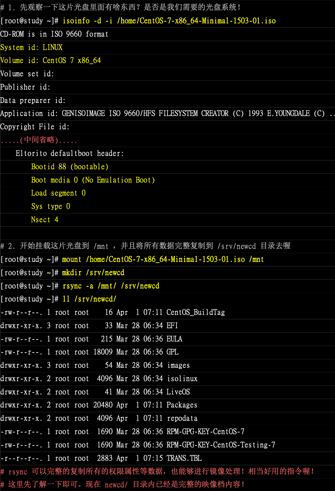
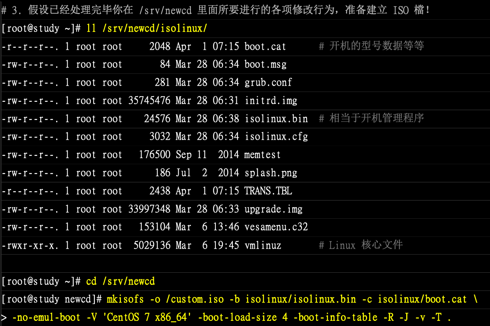

企业喜欢使用磁带来进行备份，容量高、存储时限常、耐摔等等，至于以前的 DVD/CD 等，因为存储速度慢、容量没有大幅度提升，很少使用了

虽然现在很少使用了，不过在特别的情况下，没有这东西又不行，因此这里介绍在文本模式的刻录行为是怎么处理的，通常做法是这样的：

1. 现将所需要备份的数据建立成为一个映像文档（iso)，利用 mkisofs 指令来处理
2. 将该映像文件刻录到光盘或则 DVD 中，利用 cdrecord 指令来处理

## 🍀 mkisofs 建立映像文档

刻录可开机与不可开机的光盘，使用方法不太一样

### 制作一般数据光盘映像文件

```bash
mkisofs [-o 映像文档][-Jrv][-V vol][-m file] 待备份文件 -graft-point isodir=systemdir ..
```

选项与参数：

- o：接想要产生的映像文档名
- J：产生较兼容于 windows 机器的文件名结构，可增加文件名长度 64 个 unicode 字符
- r：通过 Rock Ridge 产生支持 Unix/Linux 的文件数据，可记录较多的信息（如 UID/GID) 等
- v：显示建立 ISO 文件的过程
- V vol：建立 Volume ，有点像 windows 在文件总管内看到的 CD title 的东西
- m file：-m 为排除文件（exclude），后面的文件不备份到该映像文档中，也可以使用 * 通配符
- -graft-point：graft 有转嫁或移植的意思，相关资料在下面说明

mkisofs 有非常多好用的选项，只想制作数据光盘时，上述的选项就够用了。光盘格式一般称为 iso9660，这种格式一般仅支持旧版的 DOS 文件名（文件只能以 8.3 即 文件名 8 个字符，扩展名 3 个字符的方式存在）。如果加上 -r 选项后，文件信息能够被记录得比较完整

此外，一般预设的情况下，所有要被加到映像中的文件都会被放置到映像文件的根目录，如此一来可能会造成刻录后的文件分类不易的情况，可以使用 -graft-point 选项

- 映像文件中的目录所在 等于 实际 Linux 文件系统的目录所在
- /movies=/srv/movies（在 Linux 的 /srv/movies 内的文件，加到映像文件中的 /movies/ 目录）
- /linux/etc=/etc（将 Linux 中的 /etc/ 内的所有数据备份到映像文件中的 /liux/etc 目录中

```bash
# 假如想要讲 /root、/home、/etc 等目录内的数据通过刻录起来的话，先要处理下映像
# 先不使用 -graft-point 的选项处理
[root@study ~]# mkisofs -v -o /tmp/system.img /root /home/ /etc/
I: -input-charset not specified, using utf-8 (detected in locale settings)
genisoimage 1.1.11 (Linux)
Scanning /root
... 很多的文件记录输出
Writing:   The File(s)                             Start Block 955
  9.23% done, estimate finish Tue Oct 29 03:55:51 2019
 18.47% done, estimate finish Tue Oct 29 03:55:51 2019
 27.72% done, estimate finish Tue Oct 29 03:55:51 2019
 36.94% done, estimate finish Tue Oct 29 03:55:51 2019
 46.19% done, estimate finish Tue Oct 29 03:55:51 2019
 55.39% done, estimate finish Tue Oct 29 03:55:51 2019
 64.62% done, estimate finish Tue Oct 29 03:55:51 2019
 73.85% done, estimate finish Tue Oct 29 03:55:51 2019
 83.08% done, estimate finish Tue Oct 29 03:55:52 2019
 92.33% done, estimate finish Tue Oct 29 03:55:52 2019
Total translation table size: 0
Total rockridge attributes bytes: 0
Total directory bytes: 1869824
Path table size(bytes): 13350
Done with: The File(s)                             Block(s)    53057
Writing:   Ending Padblock                         Start Block 54012
Done with: Ending Padblock                         Block(s)    150
Max brk space used 378000
54162 extents written (105 MB)
# 笔者这个直接成功了，在树上因为 /etc/crontab 和 /root/crontab 中有相同的文件
# 他们没有被归档的时候，都会出现在映像文档中的根目录，所以报错

[root@study ~]# ll -h /tmp/system.img 
-rw-r--r--. 1 root root 106M 10月 29 03:55 /tmp/system.img

# 查看该映像中的内容
# 可以挂载到某个目录下，再查看
[root@study ~]# mount -o loop /tmp/system.img /mnt/
mount: /dev/loop0 写保护，将以只读方式挂载
[root@study ~]# df -h /mnt/
文件系统        容量  已用  可用 已用% 挂载点
/dev/loop0      106M  106M     0  100% /mnt
# 使用 ll /mnt 指令查看，只发现里面全是没有路径的文件
```

发现所有的数据都放在了映像文件中的根目录，下面使用归档再看看

```bash
# 卸载掉
umount /mnt

[root@study ~]# mkisofs -r -V 'linux_file' -o /tmp/system.img -m /roo/etc --graft-point /root=/root /home/=/home /etc=/etc

[root@study ~]# ll -h /tmp/system.img 
-rw-r--r--. 1 root root 107M 10月 29 04:05 /tmp/system.img
[root@study ~]# mount -o loop /tmp/system.img /mnt/
mount: /dev/loop0 写保护，将以只读方式挂载
[root@study ~]# ll /mnt/
总用量 46
dr-xr-xr-x. 143 root root 38912 10月  4 18:38 etc
dr-xr-xr-x.   4 root root  2048 10月  8 23:01 home
dr-xr-xr-x.   7 root root  4096 10月 29 00:57 root
dr-xr-xr-x.   9 root root  2048 10月 29 04:05 rr_moved
```

## 🍀 制作/修改可开机光盘映像文档

要制作一键安装系统的光盘，需要修改原版光盘映像文件，改成可以自动加载某些程序的流程；刻录成光盘后，放入光驱，只要开机利用光盘来开机，就直接安装系统，不再需要询问管理员一些问题，等于是自动化处理，当然这些流程很麻烦，需要了解 kickstart 等相关技术，这里先不谈。本章让你知道如何让光盘内容被修改之后，还可以刻录成可开机的映像文档

笔者刚开始使用 mac，传入虚拟机文档不知道怎么弄，特别慢。就不跟着练习了，直接截图了

```bash
# 查看 iso 的信息
isoinfo -d -i /home/CentOS-7.iso 
# 挂载该 iso 到 /mnt
mount /home/CentOS-7.iso /mnt
mkdir /srv/newcd
# rsync 可以完整复制所有的权限属性等数据，也可以进行镜像处理
# 现在 newcd 总已经是完整映像文档的内容了
rsync -a /mnt /srv/newcd
ll /srv/newcd/
# 这里就可以修改 newcd 里面的内容了，假设已经处理完
ll /srv/newcd/isolinux
cd /srv/newcd
mkisofs -o /custom.iso -b isolinux/isolinux.bin -c isolinux/boot.cat \
> -no-emul-boot -V 'CentOS 7 x86_64' -boot-load-size 4 -boot-info-table -R -J -v -T
# 运行之后，就会存在一个 /custom.img 的文件存在,可以将该文件刻录到光盘上
```





## 🍀 cdrecord 光盘刻录工具

新版的 CentOS 7 使用的是 wodim 指令来进行刻录行为（旧版是 cdrecord，为了兼容 wodim 也链接了旧版的）

```bash
# 常见的指令入戏
wodim --devices dev/det/sr0			# 查询刻录机的 BUS 位置
wodim -v dev=/dev/sr0 blank=[fast|all]	# 抹除重复读写片
wodim -v dev=/dev/sr0 -format		# 格式化 DVD + RW
wodim -v dev=/dev/sr0 [可用选项功能] file.iso
```

选项与参数：

- devices：用在扫描磁盘总线并找出可用的刻录机，后续的装置为 ATA 接口
- v：在 cdrecord 运作的过程中，显示过程
- dev=/dev/sr0：可以找出此光驱的 bus 地址，非常重要
- `blank[fast|all]：blank 为抹除可重复写的 Cd/DVD-RW ，使用 fast 较快，all 较完成
- format：对光盘进行格式化，但是仅针对 DVD+RW 这种格式的 DVD
- 可用选项与功能：
  - `-data`：指定后面的文件以数据格式写入，不是以 CD 音轨（-audio）方式写入
  - speed=x：指定刻录速度，例如 CD 可用 speed=40 为 40 倍数，DVD 则可用 speed=4 之类
  - `-eject`：指定刻录完毕后自动退出光盘
  - fs=Ym：指定多少缓存存储器，可用在将映像档先暂存至缓冲存储器。预设为 4m，一般建议可增加到 8m，不过还是得视你的刻录机而定
- 针对 DVD 的选项功能：
  - driveropts=burnfree：打开 Buffer Underrun Free 模式的写入功能
  - `-sao`：支持 DVD-RW 的格式

### 侦测你的刻录机所在位置

文不能模式的刻录确实比较麻烦，需要先找到刻录机才行。早期刻录机都是使用 SCSI 接口，因此配合 SCSI 接口认定来查询

```bash
[root@study ~]# ll /dev/sr0 
brw-rw----+ 1 root cdrom 11, 0 10月 28 21:38 /dev/sr0	 # 一般 Linux 光驱文件名
[root@study ~]# wodim --devices dev=/dev/sr0
wodim: Warning: controller returns zero sized CD capabilities page.
wodim: Warning: controller returns wrong size for CD capabilities page.
wodim: Warning: controller returns wrong page 0 for CD capabilities page (2A).
wodim: Overview of accessible drives (1 found) :
-------------------------------------------------------------------------
 0  dev='/dev/sr0'      rwrw-- : 'VBOX' 'CD-ROM'
-------------------------------------------------------------------------

#笔者这个是虚拟机的，因此无法真正的使用，那么下面的指令直接记录书上的步骤
```

### 进入 CD/DVD 的刻录动作

如何将 /tmp/system.img 刻录到 cd/dvd 里面？

```bash
# 0. 先抹除光盘的原始内容：（非可重复读写则可略过此步骤）
wodim -v dev=/dev/sr0 blank=fast
# 中间会抛出一堆信息告诉你抹除的进度，而且会有 10 秒的时间等待你取消
# 1. 开始刻录; eject 刻录完成之后，DVD 会被退出光驱，记得推回去
wodim -v dev=/dev/sr0 speed=4 -dummy -eject /tmp/system.img
# 2. 刻录完成后，测试挂载一下，检验内容
mount /dev/sr0/mnt
dh -h /mnt
ll /mnt
umount /mnt
```

简单刻录上面的语法就够了，但是还是建议在图形化界面中来刻录