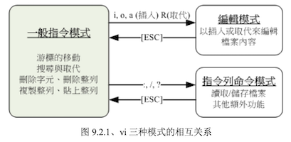
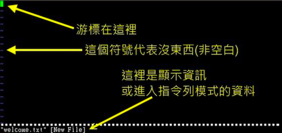
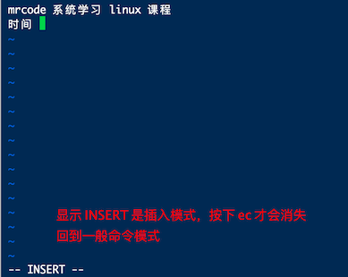
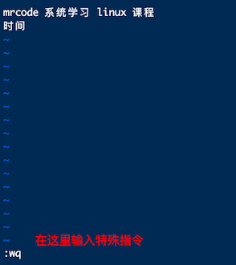

# vi 的使用

基本上 vi 共分为三种模式：一般指令模式、编辑模式、指令列命令模式

- 一般指令模式（command mode）

  以 vi 打开一个文件就直接进入一般指令模式了（默认模式，也简称一般模式）。

  在该模式中，可以使用「上下左右」按键移动光标，可以使用「删除字符」或「删除整列」来处理文件内容，也可以使用「复制、粘贴」

- 编辑模式（insert mode）

  在一般模式中可以进行删除、复制、粘贴等动作，但是无法编辑文件内容。

  需要按下「i、I、o、O、a、A、r、R」等任意按键后才会进入编辑模式，通常会在左下方出现 INSERT 或 REPLACE 的字样，可以通过 esc 按键退出编辑模式，回到一般指令模式

- 指令列命令模式（commadn-line mode）

  在一般模式中，输入「:、/、?」任意字符，则光标会移动到最底下的一列。

  在这个模式中，可以提供你搜索、读取、存盘、大量取代字符、离开 vi、显示行号等功能

简单说，可以将这三个模式想象成下面的图标来表示



注意这里互换，编辑模式不能直接换到指令列模式！

## 🍀 简易执行范例

建立一个名为 welcome.txt 的文件

1. 进入一般指令模式

  ```bash
  [mrcode@study ~]$ vi welcome.txt
  ```

	

	如果开启的文件是一个已存在的，则左下角的 New File 则会变成 readonly 字样

2. 按下 i 进入编辑模式

   

3. 按下 esc 按钮回到一般指令模式

4. 进入指令列模式，文件存储并离开 vi 环境

   

此时 welcome.txt 就已经建立起来了，需要注意的是，如果文件权限不对，例如为 -r--r--r-- 时，那么可能无法写入，可以使用强制写入方式（:wq!），前提是：*你的权限可以改变该文件的权限时*

## 🍀 按键说明

### 第一部分：一般指令模式可用的按钮说明

移动光标的方法

|      按键       | 说明                                                         |
| :-------------: | :----------------------------------------------------------- |
|  h 或 左箭头 ←  | 光标向左移动一个字符                                         |
|  j 或 下箭头 ↓  | 光标向下移动一个字符                                         |
| k 或 向上箭头 ↑ | 光标向上移动一个字符                                         |
|  i 或 右箭头 →  | 光标向右移动一个字符                                         |
|    特别说明     | hjki 在键盘上是排列在一起 的，适合移动光标，移动多个的话可以加上数值再按方向键，比如 30↓ ，向下移动 30 行（注意是一般指令模式下） |
|    ctrl + f     | **常用**；向下移动一页，相当于 Page Down 按键                |
|    ctrl + b     | **常用**；向上移动一页                                       |
|    ctrl + d     | 向下移动半页                                                 |
|    ctrl + u     | 向上移动半页                                                 |
|        +        | 光标移动到非空格符的下一列                                   |
|        -        | 光标移动到非空格符的上一列                                   |
|   `n<space>`    | n 表示数字，如按下 20 ，再按空格键，光标会向右移动 n 个字符  |
| 0 或功能键 Home | **常用**；移动到这一行的最前面字自字符处                     |
| `$`或功能键 End | **常用**；移动到这一行的后面字符处                           |
|        H        | 光标移动到这个屏幕的最上方那一行的第一个字符                 |
|        M        | 光标移动到这个屏幕的中央那一行的第一个字符                   |
|        L        | 光标移动到这个屏幕的最下方那一行的第一个字符                 |
|        G        | **常用**；移动到这个文件的最后一行                           |
|       nG        | n  为数字，移动到这个文件的第 n 行。可配合 `:set nu` 显示行号，再移动到具体的行 |
|       gg        | **常用**；移动到这个文件的第一行，相当于 1G 的功能           |
|   `n<Enter>`    | **常用**；n 为数字，光标向下移动 n 行                        |

搜索与取代

|           按键           | 说明                                                         |
| :----------------------: | ------------------------------------------------------------ |
|          /word           | **常用**；向光标之下寻找一个名称为 word 的字符串             |
|          ?word           | 向光标之上寻找 word                                          |
|            n             | n 为键盘的 n 按键。代表「重复前一个搜索动作」比如找到多个搜索结果的时候，可以按 n 来跳到下一个下一个 |
|            N             | 大写的 N 按键，与 n 相反                                     |
|           说明           | 使用 /word 配合 n 或 N 是非常方便的，可以让你重复的找到一些你搜寻的关键词 |
| `:n1，n2s/word1/word2/g` | **常用**；n1 与 n2 为数值。在第 n1 与 n2 列之间查找 word1 这个字符串，并将该字符串替换为 word2；比如：`:100,200s/mrcode/MRCODE/g` 就是在 100 到 200 列之间寻找 mrcode 并替换成大写的 |
|   `1,$s/word1/word2/g`   | **常用**；从第一行到最后一行，将 word1 替换成 word2          |
|  `1,$s/word1/word2/gc`   | **常用**；从第一行到最后一行，将 word1 替换为 word2，在替换前，显示字符让用户确认（confirm）是否需要替换 |

删除、复制、粘贴

|   按键   | 说明                                                                                |
|:--------:|-------------------------------------------------------------------------------------|
|   x,X    | **常用**；在一行字当中，x 为向后删除一个字符（相当于 del 按键），X 向前删除一个字符 |
|    nx    | n 为数值，连续向后删除 n 个字符                                                     |
|    dd    | **常用**；删除光标所在列（这一行文本）                                              |
|   ndd    | **常用**；删除光标所在的向下 n 行，例如 20dd 则是删除 20 行                         |
|   d1G    | 删除光标所在到第一行的所有数据                                                      |
|    dG    | 删除光标所在到最后一行的所有数据                                                    |
|    d$    | 删除光标所在处，到该行最后一个字符                                                  |
|    d0    | 删除光标所在处，到该行最前面一个字符，这个 0 就是数值 0                             |
|    yy    | **常用**；复制光标所在处的行                                                        |
|   nyy    | **常用**；n 为数值，复制光标所在的向下 n 行                                         |
|   y1G    | 复制光标所在处到第一行的所有数据                                                    |
|    yG    | 复制光标所在处到最后一行的所有数据                                                  |
|    y0    | 复制光标所在处那个字符到该行第一个字符的数据                                        |
|    y$    | 复制光标所在处那个字符到该行最后一个字符的数据                                      |
|   p,P    | **常用**；p 为将以复制的数据在光标的下一行粘贴上，P 则为贴在光标的上一行。          |
|    J     | 将光标所在行与下一行的数据结合成同一行                                              |
|    c     | 重复删除多个数据，例如向下删除 10 行，10cj                                          |
|    u     | **常用**；复原前一个动作                                                            |
| ctrl + r | **常用**；重做上一个动作                                                            |
|   说明   | u 与 ctrl + r 是很常用的执行，一个是复原，一个是重做一次                            |
|    .     | **常用**；小数点，重复前一个动作。例如先要重复删除、重复粘贴等，按下小数点就可以了  |

### 第二部分：一般指令模式切换到编辑模式可用的按键说明

| 按键 | 说明                                                         |
| :--: | ------------------------------------------------------------ |
| i,I  | **常用**；进入插入模式（insert mode）：i 从当前光标所在处插入，I 从当前所在行的第一个非空格符号处插入 |
| a,A  | **常用**；进入插入模式，a 从当前光标所在的下一个字符开始插入，A 从光标所在行的最后一个字符处开始插入 |
| o,O  | **常用**；进入插入模式，o 从当前光标所在的下一行插入新行，O 从光标所在处的上一行插入新的行 |
| r,R  | **常用**；进入取代模式（Replace mode）：r 只会取代光标所在的那个字符一次；R 会一直取代光标所在的文字，直到按下 ESC 为止 |
| 说明 | 上面这些按键中，在 vi 画面左下角会出现  ---INSERT--- 或 ---REPLACE--- 的字样。 |
| Esc  | **常用**；退出编辑模式，回到一般指令模式中                   |

### 第三部分：一般指令模式切换到指令模式的可用按钮说明

指令列模式的存储、离开等指令

|        按键         | 说明                                                         |
| :-----------------: | ------------------------------------------------------------ |
|         :w          | **常用**；将编辑的数据写入硬盘文件中                         |
|         :w!         | 若文件属性为「只读」时，强制写入该文件。不过，到底能不能写入，还是跟你对该文件的文件权限有关 |
|         :q          | **常用**；离开 vi                                            |
|         :q!         | 不想存储，强制离开                                           |
|        说明         | ！惊叹号在 vi 中，常常具有「强制」的意思                     |
|         :wq         | **常用**；存储后离开，后面加 ！则表示强制存储后离开          |
|         ZZ          | 若文件没有改动，则不存储离开，若文件已经被改动过，则存储后离开 |
|    :w[filename]     | 将编辑的数据存成另一个文件，类似另存为                       |
|    :r[rilename]     | 在编辑的数据中，读取另一个文件的数据。即将 filename 文件内容加到光标所在处后面 |
| :n1,n2 w [filename] | 将 n1 到 n2 的内容存储成 filename 这个文件。（n 说的是行数把？） |
|     :! command      | 暂时离开 vi 到指令模式下执行 comman 的显示结果！例如 「:!  ls  /home」即可再 vi 中查看 /home 下以 ls输出的文件信息；这个笔者感觉很常用，在编辑中往往会忘记路径啥的，通过这个就可以查看了 |

vi 环境的变更

|   按键    | 说明                   |
|:---------:|------------------------|
|  :set nu  | 在每一行最前面显示行号 |
| :set nonu | 取消行号               |

特别注意，在 vi 中 「数字」是很有意义的，数字通常代表重复做几次的意思，也有可能是代表去到第几个什么什么的意思。

比如：要删除 50 行，使用 「50dd」；向下移动 20 行，使用 「20j」或「20↓」

会上面这些指令就已经很厉害了，因为常用到的指令也只有不到一半，除了上面列举到常用的之外，其他的都不用死记硬背，用到再查询即可

## 🍀 一个案例练习

http://linux.vbird.org/linux_basic/0310vi/man_db.conf 可以使用这个文件来测试


```bash
[mrcode@study ~]$ cd /tmp/
[mrcode@study tmp]$ mkdir vitest; cd vitest;
# 开启文件
[mrcode@study vitest]$ vi man_db.conf
# 按 i 进入插入模式，把上面网址里面的内容复制，然后粘贴到这里
# 按 Esc 键，回到一般指令模式，并输入「:wq」保存并退出
# 由于该虚拟机还没有网络，不知道怎么下载文件，上面间接的完成了下载的功能，下面开始练习

# 设置行号
:set nu
# 温馨提示，上面的文件其实比书上的的多一行，就是头尾的 # 少一行，下面的第 43,59 才能看到 as

# 移动到第 43 行，然后向右移动 59 个字符，找到小括号里面的单词
「43G」跳转到第 43 行，			「59→」 可以看到光标跳转到了第 59 个字符后面，能看到 "(as 开头的文案"

# 移动到第 1 行，并且向下搜索「gzip」字符，请问在第几行？
「gg」或则 「1G」跳转到第一行，「/gzip」向下搜索，回车后，会定位到 93,23

# 将 29 到 41 行之间的「小写 man 字符串」改为「大写 MAN 字符串」，并且一个一个挑选是否需要修改
# 如果在挑选过程中一直按 y，结果会在最后一列出现改变了几个 man ？
「:29,41s/man/MAN/gc」会高亮被选中的 man，并且在最下面出现提示是否要替换。这里一直按 y
最后会提示：13 substitutions on 13 lines ，改变了 13 个；
注意的是：高亮是所有的都高亮，但是替换只是在指定的行之间

# 修改之后，突然反悔了，要全部复原，有哪些方法？
1. 简单的方法可以一直按 u 一个一个的撤销刚刚的替换
2. 使用强制不存储离开 「:q!」，之后再读取一次文件

# 复制 66 到 71 这 6 行的内容，（含有 MANDB_MAP），并且贴到最后一行之后
先跳转到 66 行 「66G」，再向下复制 6 行 「6yy」，此时会在指令列中显示 6 lines yanked
再跳转到最后一行「G」光标会定位到第 132 行，使用「p」粘贴到当前光标所在的下一行上
注意：粘贴多行的话，先会粘贴第一行，然后在指令列显示有 6 行需要粘贴，需要手动按下回车键确认粘贴，一次回车粘贴一行。粘贴 6 行后，光标会定位到第 138 行

# 113 行到 128 行之间的开头为 # 号的批注数据不要了，要如何删除?
先跳转到第 113 行：「113G」
再输入 「16dd」删除，其实这里为什么是 16 而不是 128 - 113 = 15，这里面的包含头不包含尾而来的，要注意这个是否包不包含当前一行，在上面的文档中有些描述可能就不太准确

# 将整个文件另存为 man.test.config；上面删除 16 行之后，只剩下 116 行了，待会对比两个文件
使用指令 「:w man.test.config」
会在指令列提示："man.test.config" [New] 116L, 4862C written
如果使用 「:wq! man.test.config」 则你没有机会看到上述的提示，另存后就强制退出当前文件了

特别注意：使用 :w man.test.config 指令后，可以直接强制退出当前的文件，因为当前还在 man_db.config 中，强制退出的话，刚才删除的操作等都不会写到 man_db.config 文件中去，而另存里面的文件却保存了刚刚删除等操作后的数据

# 去到第 25 行，并删除 15 个字符，结果出现的第一个单字是什么？
「25G」然后「15x」看到留下的字符串是「_to MANPATH mapping」,下划线是光标所在处

# 在第一行新增一行，该内容输入 「I am a student...」
「gg」，再按「O」大写的 o 会在光标所在处的上一行插入新行

# 存储后离开
:wq
```

上面的练习部分比如删除字符等，与书上的部分内容对不上，我想可能是因为整个文件内容就对不上的原因

## 🍀 vim 的暂存档、救援恢复与开启时的警告讯息

在你编辑过程中，突然宕机等情况下，在你还诶呦保存的时候，可能就想要是能恢复下刚刚未保存的数据就好了

那么 vim 就提供了这样的功能，是通过暂存档来实现的。在使用 vim 编辑时，会在被编辑的文件目录下，再建立一个名为 `.filename.swp` 的文件，编辑的数据会被存在该文件中。

来测试这个恢复功能（注：下面的部分指令，现在还未讲解，后续讲解后，再回头来这里练习下）

```bash
[mrcode@study vitest]$ cd /tmp/vitest/
[mrcode@study vitest]$ vim man_db.conf
# 使用 vim 进入文件后，然后按 ctrl + z 组合键，会退出来，并提示下面的信息
# 该组合键的作用是吧 vim man_db.conf 丢到背景去执行（后续在 16 章程序管理中会讲解）
[1]+  Stopped                 vim man_db.conf

# 找到 .swp 的文件
[mrcode@study vitest]$ ls -al
total 48
drwxrwxr-x.  2 mrcode mrcode    96 Oct 29 18:27 .
drwxrwxrwt. 54 root   root    4096 Oct 29 18:26 ..
-rw-rw-r--.  1 mrcode mrcode  4862 Oct 29 17:13 man_db.conf
-rw-r--r--.  1 mrcode mrcode 16384 Oct 29 18:27 .man_db.conf.swp

# 仿真断线停止 vim 工作
# 现在可以暂时理解为宕机了
[mrcode@study vitest]$ kill -9 %1

[1]+  Stopped                 vim man_db.conf
# swp 文件还存在
[mrcode@study vitest]$ ls -al .man_db.conf.swp
-rw-r--r--. 1 mrcode mrcode 16384 Oct 29 18:27 .man_db.conf.swp
[1]+  Killed                  vim man_db.conf

# 再次进入该文件
[mrcode@study vitest]$ vim man_db.conf
E325: ATTENTION		# 错误代码
Found a swap file by the name ".man_db.conf.swp"   # 有暂存当的存在，并显示相关信息
          owned by: mrcode   dated: Tue Oct 29 18:27:34 2019
         file name: /tmp/vitest/man_db.conf  # 这个暂存当实际属于哪个文件
          modified: no
         user name: mrcode   host name: study.centos.mrcode
        process ID: 2259
While opening file "man_db.conf"
             dated: Tue Oct 29 17:13:28 2019

# 下面说明可能发生这个错误的两个主要原因与解决方案
(1) Another program may be editing the same file.  If this is the case,
    be careful not to end up with two different instances of the same
    file when making changes.  Quit, or continue with caution.
(2) An edit session for this file crashed.
    If this is the case, use ":recover" or "vim -r man_db.conf"
    to recover the changes (see ":help recovery").
    If you did this already, delete the swap file ".man_db.conf.swp"
    to avoid this message.

# 下面说明你可以进行的动作
Swap file ".man_db.conf.swp" already exists!
[O]pen Read-Only, (E)dit anyway, (R)ecover, (D)elete it, (Q)uit, (A)bort:

```

上面翻译成中文有如下的主要信息：由于暂存文件的存在，vim 会主动判断你的这个文件可能有些问题，上面列出的两个主要原因与解决方案翻译如下：

1. 可能有其他人或程序同时在编辑这个文件

   - 找到另外那个程序或人员，请他将该 vim 的工作结束，然后你再继续处理
   - 如果只是想要看该文件的内容并不会有任何修改编辑的行为，那么可以选择开启成为只读文件（O），就是那个 [o] pen Read-Only 选项

2. 在前一个 vim 环境中，可能因为某些不知名的原因导致 vim 中断（crashed）

   这就是常见的不正常结束 vim 产生的后果。解决方案依据不同的情况不同，常见的处理方法为：

   - 如果之前的 vim 处理动作尚未存储，此时应该按下 R （使用 (R)ecover 选项），此时 vim 会载入 .man_db.conf.swp 的内容，让你自己来决定要不要存储！不过需要你离开 vim 后手动删除 .man_db.conf.swp 文件，避免下次打开还出现这样的警告
   - 如果你确定这个暂存文件是没有用的，可以直接按下 D（(D)elete it）删除它

下面是出现的 6 个选项的说明：

- `[O]pen Read-Only`：以只读方式打开。不能编辑
- `(E)dit anyway`：以正常方式打开文件，不会载入暂存文件中的内容。不过很容易出现两个使用者互相改变对方的文件等问题。不推荐（如果是多人编辑的情况下）
- ` (R)ecover`：加载暂存文件的内容，用在恢复之前未保存的内容，恢复之后记得手动删除暂存文件
- ` (D)elete it`：确定暂存文件是无用的，删除它
- `(Q)uit`：离开 vim，不会进行任何动作
- `(A)bort`：忽略这个编辑行为，感觉上与 quit 非常类似。
