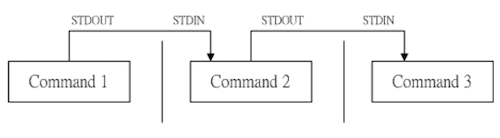

# 管线命令（pipe）

bash 命令执行的时候有输出数据，如果这群数据必须经过几道手续之后才能得到我们想要的格式，这就可以使用管线命令（pipe）来完成了

假设我们想知道 `/etc/` 下有多少文件，可以使用 `ls /etc/` 来查询，不过因为文件太多了，输出占满整个屏幕，导致最开始是什么文件看不到了，这就可以通过管线命令结合 less 指令来达成

```bash
[mrcode@study ~]$ ls -al | less
```

如此一来， `ls -al` 指令输出后的内容，能够被 less 读取，并且利用 less 的功能，可以前后翻动相关信息

管线命令**仅能处理**由前一个指令传来的**正确信息**（standard output），对于 standard error 没有直接处理的能力，整体管线命令可以使用下图表示



在每个管线后面接的第一个数据必定是「指令」，而且这个指令必须能接受 standard input 的数据才可以，这样的指令则是「管线命令」，例如 less、more、head、tail 等都是可以接受 standard input 的管线命令。而 ls、cp、mv 等就不是管线命令了，因为他们不不会接受来自 stdin 的数据。管线命令主要有两个比较需要注意的地方：

- 管线命令仅会处理 standard output ，对于 standard error output 会忽略
- 管线命令必须要能接受来自前一个指令的数据成为 standard input 继续处理才行

如果硬要 standard error 可以被管线命令所使用可以使用如下方式

```bash
2>&1   让标准错误输出转成标准输出
```

那么下面来玩一些管线命令，以下知识点对系统管理费用有用

## 🍀 截取命令 cut、grep

简单说：将一段时间经过分析后，取出我们想要的。或则是经过由分析关键词，取得我们所想要的那一行。一般来说，截取信息通常是针对一行一行来分析的。

### cut

```bash
cut -d '分割字符' -f fields  # 用于有特定分割字符
cut -c 字符区间							 # 用于排列整齐的信息
```

选项与参数：

- d：后面接分割字符。与 `-f` 一起使用
- f：依据 -d 的分割字符将一段信息分区成数段，用 -f 取出第几段的意思
- c：以字符（characters）的单位取出固定字符区间

```bash
# 范例 1：将 PATH 变量取出，我要找出第 5 个路径
[mrcode@study ~]$ echo ${PATH}
/usr/lib64/qt-3.3/bin:/usr/local/bin:/usr/bin:/usr/local/sbin:/usr/sbin:/home/mrcode/.local/bin:/home/mrcode/bin
# 数量是从 1 开始，不是从 0 哟
[mrcode@study ~]$ echo ${PATH} | cut -d ':' -f 5
/usr/sbin

# 取出第 5 个和第 6 个
[mrcode@study ~]$ echo ${PATH} | cut -d ':' -f 5,6
/usr/sbin:/home/mrcode/.local/bin


# 范例 2 ：将 export 输出的信息，取得第 12 字符以后的所有字符串
[mrcode@study ~]$ export
declare -x HISTCONTROL="ignoredups"
declare -x HISTSIZE="1000"
declare -x HOME="/home/mrcode"
declare -x HOSTNAME="study.centos.mrcode"
...

# 以上数据每个都是排列整齐的，有着 declare -x 前缀
# 那么想要把前缀去掉，就可以这样做
[mrcode@study ~]$ export | cut -c 12-
HISTCONTROL="ignoredups"
HISTSIZE="1000"
HOME="/home/mrcode"
# 使用 12-15 则是截取出这个区间的字符
# 使用 12 则只截取 12 这个字符

# 范例 3 ：用 last 将显示的登陆者信息，仅留下用户名
[mrcode@study ~]$ last
# 账户 		终端机					登录 IP					日期时间						
mrcode   pts/1        192.168.0.105    Mon Dec  2 01:25   still logged in   
mrcode   pts/0        192.168.0.105    Mon Dec  2 01:25   still logged in   
mrcode   pts/1        192.168.0.105    Mon Dec  2 00:21 - 01:12  (00:51)  
# 用空格分隔的数据，那么可以这样做
[mrcode@study ~]$ last | cut -d ' ' -f 1
mrcode
mrcode
mrcode
# 其实 账户和终端机之间的空格有好几个，并不是一个所以使用下面的命令并不能把 终端机一列也提取出来
last | cut -d ' ' -f 1,2
```

cut 主要的用途：将同一行里面的数据进行分解

常使用在分析一些数据或文字数据的时候，因为有时候会以某些字符当做分区的参数，然后将数据切割，以取得我们所需要的数据，作者常常在分析 log 文件的时候，但是 cut 在处理多空格相连的数据时，就比较麻烦，所以某些常见可能需要使用下一章节要讲解的 awk 来取代

### grep

cut 是将一行信息中，取出某部分我们想要的数据，而 grep 则是分析一堆信息，若一行当中有匹配的数据，则将这一行数据拿出来

```bash
grep [-acinv] [--color=auto] '搜索的字符串' filename
```

选项与参数：

- a：将 binary 文件以 text 文件的方式搜索数据
- c：计算找到「搜索字符」的次数
- i：忽略大小写
- n：输出行号
- v：反向选择，显示出没有搜索字符串的那一行数据
- `--color`：可以将找到的关键词部分加上颜色显示

```bash
# 范例 1：将 last 中，有出现 root 的那一行找出来
[mrcode@study ~]$ last | grep 'root'
root     tty3                          Sun Oct  6 23:16 - crash  (22:40)    
root     tty4                          Fri Oct  4 22:48 - 22:48  (00:00)  
# 会发现 root 被高亮颜色了，我们时候 type 命令查看，发现被自动加上了 color 参数
[mrcode@study ~]$ type grep
grep is aliased to 'grep --color=auto'

# 范例 2：与 范例 1 相反，不要 root 的数据
[mrcode@study ~]$ last | grep -v 'root'
mrcode   pts/1        192.168.0.105    Mon Dec  2 01:25   still logged in   
mrcode   pts/0        192.168.0.105    Mon Dec  2 01:25   still logged in   
mrcode   pts/1        192.168.0.105    Mon Dec  2 00:21 - 01:12  (00:51)
reboot   system boot  3.10.0-1062.el7. Fri Oct  4 18:47 - 03:43  (08:56)

# 范例 3：在 last 的输出信息中，只要有 root 就取出，并且只取第一栏
# 结合 cut 命令取出第一栏
[mrcode@study ~]$ last | grep 'root' | cut -d ' ' -f 1
root
root

# 范例 4：取出 /etc/man_db.conf 内涵 MANPATH 的那几行
[mrcode@study ~]$ grep 'MANPATH' /etc/man_db.conf
# MANDATORY_MANPATH                     manpath_element
# MANPATH_MAP           path_element    manpath_element

```

grep 支持的语法很多，用在正规表示法里，能够处理的数据太多。但是这里先不了解正规表示法，下一章再来讲解

这里只需要了解下，grep 可以解析一行文字，取得关键词，若改行有存在关键词，就会整行取出来

## 🍀 排序命令：sort、wc、uniq

### sort

可以依据不同的数据形态来排序。例如数字与文字的排序不一样，另外，排序的字符与语系的编码有关，因此，如果需要排序时，建议使用 LANG=C 来让语系统一，数据排序比较好一些

```bash
sort [-fbMnrtuk] [file or stdin]
```

选项与参数：

- f：忽略大小写的差异
- b：忽略最前面的空格符
- M：以月份的名字来排序，例如 JAN、DEC 等排序方法
- n：使用纯数字进行排序，默认是以文字形态来排序
- r：反向排序
- u：uniq，相同的数据中，仅出现一行代表，也就是去重
- t：分隔符，预设使用 「tab」来分割
- k：以那个区间（field）来进行排序

```bash
# 范例 1：个人账户都记录在 /etc/passwd 下，将账户进行排序
[mrcode@study ~]$ cat /etc/passwd | sort
abrt:x:173:173::/etc/abrt:/sbin/nologin
adm:x:3:4:adm:/var/adm:/sbin/nologin
avahi:x:70:70:Avahi mDNS/DNS-SD Stack:/var/run/avahi-daemon:/sbin/nologin
bin:x:1:1:bin:/bin:/sbin/nologin
chrony:x:993:990::/var/lib/chrony:/sbin/nologin
# 可以看到按字符排序了

# 范例 2：/etc/passwd 内容是以 : 来分割的，想使用第三栏进行排序
[mrcode@study ~]$ cat /etc/passwd | sort -t ':' -k 3
root:x:0:0:root:/root:/bin/bash
mrcode:x:1000:1000:mrcode:/home/mrcode:/bin/bash
qemu:x:107:107:qemu user:/:/sbin/nologin
operator:x:11:0:operator:/root:/sbin/nologin
# 第三栏是数字，但是这里并没有按数字大小来排序，因为默认使用文字排序
# 与数值大小进行排序
[mrcode@study ~]$ cat /etc/passwd | sort -t ':' -k 3 -n
root:x:0:0:root:/root:/bin/bash
bin:x:1:1:bin:/bin:/sbin/nologin
daemon:x:2:2:daemon:/sbin:/sbin/nologin
adm:x:3:4:adm:/var/adm:/sbin/nologin
lp:x:4:7:lp:/var/spool/lpd:/sbin/nologin

# 范例 3：利用 last ，将输出的数据仅取账户，并排序
[mrcode@study ~]$ last | cut -d ' ' -f 1 | sort

mrcode
mrcode

```

### uniq

```bash
uniq [-ic]
- i：忽略大小写
- c：进行计数
```

实践练习

```bash
# 范例 1： 使用 last 将账户列出，仅取出账户，排序后去重
[mrcode@study ~]$ last | cut -d ' ' -f 1 | sort | uniq

mrcode
reboot
root
wtmp

# 范例 2：以上题，统计每个账户登录的总次数
[mrcode@study ~]$ last | cut -d ' ' -f 1 | sort | uniq -c
      1
    136 mrcode
     19 reboot
      2 root
      1 wtmp

# 第一行和 wtmp 是 last 的默认字符，可以忽略
```

### wc

wc 可以计算输出的信息。比如：/etc/man_db.conf 这个文件里面有多少字？多少行？

```bash
wc [-lwm]

-l：仅列出行
-w：仅列出多少字（英文单字）
-m：多少字符
```

```bash
# 范例 1：/etc/man_db.conf 这个文件里面有多少字
[mrcode@study ~]$ cat  /etc/man_db.conf | wc
	   行     字数	   字符数
    131     723    5171

# 范例 2：last 可以输出登陆者，但是 last 最后两行并非账户内容，那么该如何以一行指令取得登录系统的总人次？
last | grep [a-zA-Z] | grep -v 'wtmp' | grep -v 'reboot' | grep -v 'unknown' | wc -l
138
# grep 正则匹配，排除了非英文字符的账户
# grep -v 反向选择，相当于排除了指定的账户
# 最后使用 wc 统计行数
```

## 🍀 双向重导向：tee

前一节讲解到 > 会将数据流整个栓送给文件或装置，因此除非去读取该文件或装置，那么如果想要将整个暑假流的处理过程中将某段信息存下来该怎么做？就可以使用 tree

```bash
Standard input   ------> tee --------> Screen
												  ↓
												 file
# 流程如上
```

tee 会同时将数据流分送到文件与屏幕，而输出到屏幕的其实就是 stdout，那么就可以让指令继续处理

```bash
tee [-a] file
- a：以累加（append）的方式，将数据加入 file 中
```

```bash
# 将 last 内容输出到 last.list 文件中，并继续处理
[mrcode@study ~]$ last | tee last.list | cut -d " " -f 1

# 将 ls 数据存一分到 ~/homefile 同时屏幕也输出信息
[mrcode@study ~]$ ls -l /home/ | tee ~/hoefile | more

```

## 🍀 字符转换命令：tr、col、join、paste、expand

在 vim 程序编辑器中提到过 DOS 换行符与 Unix 不一样，并且可以使用 dos2unix 与 unix2dos 来完成转换。

那么思考下，是否还有其他的字符转换命令，比如：将大写改成小写、将数据中的 tab 转成空格、如何将两篇信息整合成一篇？

### tr：正则替换或删除字符

tr 可以用来删除一段信息中的文字，或则是进行文字信息的替换

```bash
tr [-ds] SET1 ...

-d：删除信息当中的 SET1 这个字符串
-s：替换重复的字符
```

```bash
# 范例 1：将 last 输出的信息中，原有的小写变成大写字符
[mrcode@study ~]$ last | tr '[a-z]' '[A-Z]'
MRCODE   PTS/1        192.168.0.105    MON DEC  2 07:00   STILL LOGGED IN

# 范例 2：将 /etc/passwd 输出的信息中，将冒号 : 删除
[mrcode@study ~]$ cat /etc/passwd | tr -d ':'
rootx00root/root/bin/bash

# 范例 3：将 /etc/passwd 转成 dos 换行到 ~/passwd 中，再将 ^M 符号删除
# 由于我这里没有安装 unix2dos 这里无法实际演示
cp /etc/passwd ~/passwd && unix2dos ~/passwd
file /etc/passwd ~/passwd
cat ~/passwd | tr -d '\r' > ~/passwd.linux
# \r 是 dos 的换行符
ll /etc/passwd ~/passwd*
# 就会发现处理之后和源文件一样大小了
# 本例子是：将 unix 转成 dos，/n 转成了 /r/n ，然后使用 tr 命令将 /r 删除了，相当于又还原了

#那么经过上面的分析之后，其实转换程序就是转换了换行符，那么可以利用 tr 手动来完成转换
[mrcode@study ~]$ cp /etc/passwd ~/passwd
[mrcode@study ~]$ file /etc/passwd ~/passwd
/etc/passwd:         ASCII text
/home/mrcode/passwd: ASCII text
# 将 unix 换行符 \n 替换成 dos 换行符 \r\n
[mrcode@study ~]$ cat passwd | tr '\n' '\r\n' > passwd.dos
[mrcode@study ~]$ file passwd*
passwd:     ASCII text
passwd.dos: ASCII text, with CR line terminators		# 可以看到已经变了
# 再将 \r 删掉
[mrcode@study ~]$ cat passwd | tr -d '\r' > passwd.linux
[mrcode@study ~]$ file passwd*
passwd:       ASCII text
passwd.dos:   ASCII text, with CR line terminators
passwd.linux: ASCII text

```

该指令也可以写在正规表示法里面，因为他也是由正规表示法的方式来取代数据的，比如上面使用 `[]` 来设置字符，通常用来取代文件中的怪异符号。

### col：将 tab 转换成对等的空格

```bash
col [-xb]

-x:将 tab 键转换成对等的空格键
```

```bash
# 范例 ： 利用 cat -A 显示出所有的特殊按键，最后以 col 将 tab 转成空白
[mrcode@study ~]$ cat -A /etc/man_db.conf
MANDATORY_MANPATH^I^I^Imanpath_element$		# ^I 的符号就是 tab

[mrcode@study ~]$ cat /etc/man_db.conf | col -x | cat -A | more
MANDATORY_MANPATH                      /usr/src/pvm3/man$

```

虽然 col 有特殊的用途，但是很多时候可以用来简单的将 tab 取代为空格键，并且可以取代会对等宽度的空格

### join：合并两个文件中相同行的数据

```bash
join [-ti12] file1 file2
```

选项与参数：

- t：join 默认以空格符分割数据，并且比对「第一个字段」的数据，如果两个文件相同，则将两笔数据连城一行，且第一个字段放在第一个
- i：忽略大小写
- 1：数值 1，代表「第一个文件要用哪个字段来分析」
- 2：数值 2，代表「第二个文件要用哪个字段来分析」

```bash
# 范例 1：用 root 身份，将 /etc/passwd 与 /etc/shadow 相关数据整合成一栏
[root@study ~]# head -n 3 /etc/passwd /etc/shadow
==> /etc/passwd <==
root:x:0:0:root:/root:/bin/bash
bin:x:1:1:bin:/bin:/sbin/nologin
daemon:x:2:2:daemon:/sbin:/sbin/nologin

==> /etc/shadow <==
root:$6$oTg/fYGfv9/GIl6h$UEcmYlRZacV757rHtXlvmu5xH5TWGfqd3eDOEotB3CAc5mcW5UEoMTSg0pDICd/sYGrEScsHQY9tYZY0FGkKS1::0:99999:7:::
bin:*:17834:0:99999:7:::
daemon:*:17834:0:99999:7:::
# 输出的信息来看，最左边的的账户有相同的账户，且以 : 分割

[root@study ~]# join -t ':' /etc/passwd /etc/shadow | head -n 3
# 看到了吗，作用就是将某个字段的数据合并成一段
root:x:0:0:root:/root:/bin/bash:$6$oTg/fYGfv9/GIl6h$UEcmYlRZacV757rHtXlvmu5xH5TWGfqd3eDOEotB3CAc5mcW5UEoMTSg0pDICd/sYGrEScsHQY9tYZY0FGkKS1::0:99999:7:::
bin:x:1:1:bin:/bin:/sbin/nologin:*:17834:0:99999:7:::
daemon:x:2:2:daemon:/sbin:/sbin/nologin:*:17834:0:99999:7:::

# 范例 2：/etc/passwd 第四个字段是 GID，/etc.group 的第三个字段是 GID ,那么如何将两个文件合并？
[root@study ~]# head -n 3 /etc/passwd /etc/group
==> /etc/passwd <==
root:x:0:0:root:/root:/bin/bash
bin:x:1:1:bin:/bin:/sbin/nologin
daemon:x:2:2:daemon:/sbin:/sbin/nologin

==> /etc/group <==
root:x:0:
bin:x:1:
daemon:x:2:

# 下面两种写法一致
join -t ':' -1 4 -2 3 /etc/passwd /etc/group | head -n 3
join -t ':' -1 4 /etc/passwd -2 3 /etc/group | head -n
# 报错了，提示没有排序过，所以在使用时要先对内容排序，这样才能合并两行数据
join: /etc/passwd:6: is not sorted: sync:x:5:0:sync:/sbin:/bin/sync
join: /etc/group:11: is not sorted: wheel:x:10:mrcode
# 看下面被整合的内容
0:root:x:0:root:/root:/bin/bash:root:x:
1:bin:x:1:bin:/bin:/sbin/nologin:bin:x:
2:daemon:x:2:daemon:/sbin:/sbin/nologin:daemon:x:

```

### paste：将两行贴在一起

将两行贴在一起，且中间以 tab 隔开

```bash
paste [-d] file1 file2

-d：后面可以接分割符。默认以 tab 来分割
- ：如果 file 部分写成 -，表示来自 standard input
```

```bash
# 范例 1：用 root 身份，将 /etc/passwd 与 /etc/shadow 同一行贴在一起
[root@study ~]# paste /etc/passwd /etc/shadow | head -n 3
root:x:0:0:root:/root:/bin/bash root:$6$oTg/fYGfv9/GIl6h$UEcmYlRZacV757rHtXlvmu5xH5TWGfqd3eDOEotB3CAc5mcW5UEoMTSg0pDICd/sYGrEScsHQY9tYZY0FGkKS1::0:99999:7:::
bin:x:1:1:bin:/bin:/sbin/nologin        bin:*:17834:0:99999:7:::
daemon:x:2:2:daemon:/sbin:/sbin/nologin daemon:*:17834:0:99999:7:::

# 范例 2：先将 /etc/group 用 cat 读出，然后与范例 1 贴在一起，且仅取出前三行
# paset 文件部分可以是多个，这里最后一个文件使用了 -，也就是 cat /cat/etc/group
[root@study ~]# cat /etc/group | paste /etc/passwd /etc/shadow - | head -n 3
root:x:0:0:root:/root:/bin/bash root:$6$oTg/fYGfv9/GIl6h$UEcmYlRZacV757rHtXlvmu5xH5TWGfqd3eDOEotB3CAc5mcW5UEoMTSg0pDICd/sYGrEScsHQY9tYZY0FGkKS1::0:99999:7:::       root:x:0:
bin:x:1:1:bin:/bin:/sbin/nologin        bin:*:17834:0:99999:7:::        bin:x:1:
daemon:x:2:2:daemon:/sbin:/sbin/nologin daemon:*:17834:0:99999:7:::     daemon:x:2:

```

### expand：将 tab 转成空格

```bash
expand [-t] file

-t：后面可以接数字。一般来说，一个 tab 可以用 8 个空格取代，这里自定义几个空格取代
```

```bash
# 范例 1：将 /etc/man_db.conf 内行首为 MANPATH 的字样取出，仅取前三行
[root@study ~]# grep '^MANPATH' /etc/man_db.conf | head -n 3
MANPATH_MAP     /bin                    /usr/share/man
MANPATH_MAP     /usr/bin                /usr/share/man
MANPATH_MAP     /sbin                   /usr/share/man
# 行首正则为 ^,下接讲解

# 范例 2：承上，将所有的符号都列出来
[root@study ~]# grep '^MANPATH' /etc/man_db.conf | head -n 3 | cat -A
MANPATH_MAP^I/bin^I^I^I/usr/share/man$
MANPATH_MAP^I/usr/bin^I^I/usr/share/man$
MANPATH_MAP^I/sbin^I^I^I/usr/share/man$
# ^I 是 tab

# 范例 3：承上，将 tab 转成 6 个空格
[root@study ~]# grep '^MANPATH' /etc/man_db.conf | head -n 3 | expand -t 6 | cat -A
MANPATH_MAP /bin              /usr/share/man$
MANPATH_MAP /usr/bin          /usr/share/man$
MANPATH_MAP /sbin             /usr/share/man$
# 可以看到 tab 被替换成空格了
```

有一个需要特别注意：tab 最大功能就是格式排列整齐，但是换成空格之后，就不一定是排列整齐的了，也可以参考一下  unexpand 这个将空白转成 tab 的指令

```bash
[root@study ~]# grep '^MANPATH' /etc/man_db.conf | head -n 3 | expand -t 6 | unexpand -t 6 | cat -A
MANPATH_MAP /bin^I^I^I/usr/share/man$
MANPATH_MAP /usr/bin^I^I/usr/share/man$
MANPATH_MAP /sbin^I^I^I/usr/share/man$
# 可以看到，范例 3 的还可以被 unexpand 给转换回来
```

## 🍀 分区命令：split

split 可以分割文件，按文件大小或行数来分割

```bash
split [-bl] file PREFIX

-b：后面可接要分区的大小，可加单位，如 b、k、m 等
-l：以行数进行分区

PREFIX：表示分区文件命名前缀
```

```bash
# 范例 1：/etc/services 有 600 多 k，若想要分成 300k 一个文件
[mrcode@study ~]$ cd /tmp; split -b 300k /etc/services servers
[mrcode@study tmp]$ ll servers*
-rw-rw-r--. 1 mrcode mrcode 307200 Dec  2 09:53 serversaa
-rw-rw-r--. 1 mrcode mrcode 307200 Dec  2 09:53 serversab
-rw-rw-r--. 1 mrcode mrcode  55893 Dec  2 09:53 serversac

# 范例 2：如何将上面三个文件合成一个文件？
[mrcode@study tmp]$ cat serversa* > servicesback
[mrcode@study tmp]$ ll serv*
-rw-rw-r--. 1 mrcode mrcode 307200 Dec  2 09:53 serversaa
-rw-rw-r--. 1 mrcode mrcode 307200 Dec  2 09:53 serversab
-rw-rw-r--. 1 mrcode mrcode  55893 Dec  2 09:53 serversac
-rw-rw-r--. 1 mrcode mrcode 670293 Dec  2 09:54 servicesback

# 范例 3：使用 ls -al / 输出的信息中，每 10 行记录成一个文件
# 这里文件使用了 - ，表示使用标准输入，前面讲过的
[mrcode@study tmp]$ ls -al / | split -l 10 - lsroot
[mrcode@study tmp]$ ll lsroot*
-rw-rw-r--. 1 mrcode mrcode 456 Dec  2 09:57 lsrootaa
-rw-rw-r--. 1 mrcode mrcode 523 Dec  2 09:57 lsrootab
-rw-rw-r--. 1 mrcode mrcode 192 Dec  2 09:57 lsrootac
[mrcode@study tmp]$ wc -l lsroot*
  10 lsrootaa
  10 lsrootab
   4 lsrootac
  24 total
# - 一般用在，指令 stdout/stdin 时，但偏偏又没有文件，就用 - 来表示 stdout/stdin
```

## 🍀 参数代换：xargs

产生某个指令的参数。xargs 可以读入 stdin 的数据，并且以空格符或换行符号作为分辨，将 stdin 的数据分割成为 arguments。

```bash
xargs [-0epn] command
```

- 0：数值 0，如果输入的 stdin 含有特殊字符，例如 \`、\\、空格等时，可以将他转义为一个普通字符
- e：EOF（end of file）。后面可以接一个字符串，当 xargs 分析到这个字符串时，会停止继续工作；注意：`-e'sync'` 选项与后面的 eof 字符中间没有空格
- p：在执行每个指令的 argument 时，都会询问使用者
- n：后面接次数，每次 command 指令执行时，要使用几个参数

当 xargs 后面没有接任何指令时，默认是以 echo 来进行输出的

实践练习

```bash
# 范例 1：将 /etc/passwd 内第一栏取出，仅取三行，使用 id 这个指令将每个账户内容秀出来
# id 可以查询用户的 UID/GID 等信息
[mrcode@study tmp]$ id root
uid=0(root) gid=0(root) groups=0(root)

# 通过之前的指令把前三行的第一栏用户名提取出来
[mrcode@study tmp]$ cat /etc/passwd | head -n 3 | cut -d ':' -f 1
root
bin
daemon

# 通过 $(cmd) 可以预先取得参数，但可惜的时候，id 这个指令只能接收一个参数，导致报错了
[mrcode@study tmp]$ id $(cat /etc/passwd | head -n 3 | cut -d ':' -f 1)
id: extra operand ‘bin’
Try 'id --help' for more information.

# 因为 ID 不是管线命令，管线前的输出都没有用，相当于只输出了 id 的内容
[mrcode@study tmp]$ cat /etc/passwd | head -n 3 | cut -d ':' -f 1 | id
uid=1000(mrcode) gid=1000(mrcode) groups=1000(mrcode),10(wheel) context=unconfined_u:unconfined_r:unconfined_t:s0-s0:c0.c1023

# xargs 将 3 个账户处理后给 id，一样的会报错
[mrcode@study tmp]$ cat /etc/passwd | head -n 3 | cut -d ':' -f 1 | xargs id
id: extra operand ‘bin’
Try 'id --help' for more information.

# 通过 -n 来指定每次指令命令使用几个参数
# 因为前面输出是三行，在 xargs 中会被当成 3 个参数
[mrcode@study tmp]$ cat /etc/passwd | head -n 3 | cut -d ':' -f 1 | xargs -n 1 id
uid=0(root) gid=0(root) groups=0(root)
uid=1(bin) gid=1(bin) groups=1(bin)
uid=2(daemon) gid=2(daemon) groups=2(daemon)

# 范例 2：同上，但是每次执行 id 时，都要询问使用者是否动作
[mrcode@study tmp]$ cat /etc/passwd | head -n 3 | cut -d ':' -f 1 | xargs -n 1 -p id
id root ?...			# 这里没有输入 y 被判定为不执行了
id bin ?...y
uid=1(bin) gid=1(bin) groups=1(bin)
id daemon ?...

# 范例 3：将所有的 /etc/passwd 内的账户都以 id 查询，但差到 sync 就结束指令串
[mrcode@study tmp]$ cat /etc/passwd | cut -d ':' -f 1 | xargs -e'sync' -n 1 id
uid=0(root) gid=0(root) groups=0(root)
uid=1(bin) gid=1(bin) groups=1(bin)
uid=2(daemon) gid=2(daemon) groups=2(daemon)
uid=3(adm) gid=4(adm) groups=4(adm)
uid=4(lp) gid=7(lp) groups=7(lp)

```

xargs 是一个非常好用的指令，一般使用它的原因是，很多指令其实并不支持管线命令，因此可以通过 xargs 来提供该指令引用 standard input 。如果还不太明白，下面在来看一个例子

```bash
# 范例 4：找出 /usr/sbin 下具有特殊权限的文件名，并使用 ls -l 列出详细属性
# 但是 ls 不是管线命令
[mrcode@study tmp]$ find /usr/bin/ -perm /7000 | ls
# 可以使用 $(cmd) 语法
[mrcode@study tmp]$ ls -l $(find /usr/bin/ -perm /7000)

# 使用 xargs
[mrcode@study tmp]$ find /usr/bin/ -perm /7000 | xargs -n 1 ls -l
-r-xr-sr-x. 1 root tty 15344 Jun 10  2014 /usr/bin/wall
-rwsr-xr-x. 1 root root 32096 Oct 31  2018 /usr/bin/fusermount
```

## 🍀 关于减号 `-` 的用途

管线命令在 bash 的连续的处理程序中是相当重要的。另外，在 log file 的分析中也是很重要的一环。

另外，在管线命令中，常常会使用到前一个指令的 stdout 作为这次的 stdin，某些指令需要用到文件名（例如 tar）来进行处理时，该 stdin 与 stdout 可以利用减号 `-`来替代

```bash
# 将 /home 里的文件打包，但打包的数据不是记录到文件，而是传送到 stdout
# 经过管线后，将 tar -cvf - /home 传送给后面的 tar -xvf - ，
# 这里的 - 就是取用前一个指令的 stdout
mkdir /tmp/homeback
[mrcode@study tmp]$ tar -cvf - /home/ | tar -xvf - -C /tmp/homeback/
```
