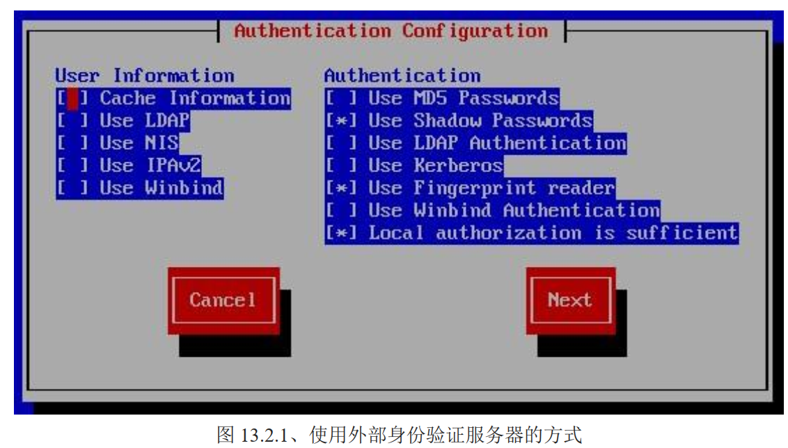

# 账号管理

由新增与移除使用者开始讲解

## 🍀 新增与移除账户（使用者）

涉及到 useradd、相关配置文件、passwd、usermod、userdel 等知识点

### useradd

```bash
useradd [-u UID] [-g 初始群组] [-G 次要群组] [-mM] [-c 说明栏] [-d 家目录绝对路径] [-s shell] 使用者账户

选项与参数：

	-u：UID 是一组数字。直接指定一个特定的 UID 给该账户
	-g：字符串的初始组名，该字符串的 GID 在 /etc/passwd 的第 3 个字段内
	-G：字符串的次要群组，该选项会修改 /etc/group 内的相关字段
	-M：强制！不要建立用户家目录（系统账户默认值）
	-m：强制！要建立用户家目录（一般账户默认）
	-c：/etc/passwd 中第 5 字段的说明内容，可以随便设置
	-d：指定某个目录成为家目录，请务必使用决定路径
	-r：建立一个系统账户，该账户的 UID 有限制（参考 /etc/login.defs）
	-s：后面接一个 shell，若没有指定则预设是 /bin/bash
	-e：后面接一个日期，格式为 YYYY-MM-DD ，此项可写入 shadow 第 8 字段，即是账户失效日期
	-f：后面接 shadow 的第 7 字段，该密码是否会失效。0 为立刻失效，-1 为永远不失效（密码只会过期而强制域登录时重新设置）

```

注意这里是没有密码配置的，密码的设置需要用到 passwd 指令

实践练习，创建一般账户

```bash
# 范例 1： 完全参考默认值创建一个用户，名称为 mrcode1
[root@study ~]# useradd mrcode1
[root@study ~]# ll -d /home/mrcode1/
drwx------. 3 mrcode1 mrcode1 78 Feb 20 17:12 /home/mrcode1/
# 默认会创建家目录，且权限为 700，这是重点！

[root@study ~]# grep mrcode1 /etc/passwd /etc/shadow /etc/group
/etc/passwd:mrcode1:x:1001:1001::/home/mrcode1:/bin/bash
/etc/shadow:mrcode1:!!:18312:0:99999:7:::
/etc/group:mrcode1:x:1001:			# 预设会建立一个与账户同名的群组名
```

可以看到系统规定好了非常多的默认值，所以可以简单的使用 useradd 账户名 来创建使用者。 CentOS 这些默认值主要会帮我们处理几个操作

- 在 `/etc/passwd` 中创建一行与账户相关的数据，包括建立 UID、GID、家目录等
- 在 `/etc/shadow` 中创建该账户的密码相关参数，但是无密码
- 在 `/etc/group` 中创建一个与账户名同名的组名
- 在 `/home` 下创建一个与账户同名的目录作为家的目录，且权限为 700

对于账户密码需要使用 passwd 指令来完成。如果需要定制相关参数，就需要使用选项与参数来详细定制了

```bash
# 范例 2：假设已知道系统中有一个组名为 users，且 UID 1500 并不存在，请用 users 为初始群组，以及 UID 为 1500 创建一个名为 mrcode2 的账户
[root@study ~]# useradd -u 1500 -g users mrcode2
[root@study ~]# ll -d /home/mrcode2
drwx------. 3 mrcode2 users 78 Feb 20 17:20 /home/mrcode2

[root@study ~]# grep mrcode2 /etc/passwd /etc/shadow /etc/group
/etc/passwd:mrcode2:x:1500:100::/home/mrcode2:/bin/bash
/etc/shadow:mrcode2:!!:18312:0:99999:7:::
# 对比上述文件，是不是发现少了一个 mrcode2 的群组？因为初始群组是 users（并且已经存在了），所以就没有必要创建 mrcode2 群组了
```

创建系统账户（system account）

```bash
# 范例 3 ：创建一个系统账户，名为 mrcode3
[root@study ~]# useradd -r mrcode3

# 可以看到没有创建家的目录
[root@study ~]# ll -d /home/mrcode3
ls: cannot access /home/mrcode3: No such file or directory

[root@study ~]# grep /etc/passwd /etc/shadow /etc/group
/etc/passwd:mrcode3:x:988:982::/home/mrcode3:/bin/bash
/etc/shadow:mrcode3:!!:18312::::::
/etc/group:mrcode3:x:982:

```

注意上面的 988:982,前面谈到过，一般账户的 UID 为 1000 以后，那么用户创建的系统账户一般是小于 1000 的。另外由于系统账户要是用来进行运行操作系统所需服务的权限设置，所以系统账户默认都不会主动建立家的目录

系统内置了默认值，那么这些默认值是出自哪里的呢？这就需要了解下 useradd 所使用的参考文件了

### 相关配置文件（useradd 参考文件）

可以使用 `useradd -D`显示默认值

```bash
[root@study ~]# useradd -D
GROUP=100						# 预设群组
HOME=/home						# 默认加目录所在目录
INACTIVE=-1						# 密码失效日，在 shadow 内的第 7 字段
EXPIRE=							# 账户失效日，在 shadow 内的第 8 字段
SHELL=/bin/bash					# 预设的 shell
SKEL=/etc/skel					# 用户家的目录内容数据参考目录
CREATE_MAIL_SPOOL=yes			# 是否主动帮使用者建立邮件信息（mailbox）
```

#### `/etc/default/useradd`

以上信息是存在 `/etc/default/useradd` 文件中的，那么默认值造成的行为是：

- `GROUP=100`：100 这个 GID 对应的群组也就是 users

  但是对于 mrcode1 来说，他的初始群组是 mrcode1，而不是 users，这是因为针对群组的角度有以下两种：

  - 私有群组机制

    系统会建立一个与账户一样的群组给使用者作为初始群组。这种机制比较有保密性，因为使用者都有自己的群组，而家目录权限也将会设定为 700（仅有自己可以进入自己的家目录）。代表性的 distributions 有 RHEL、Fedora、CentOS 等

  - 公共群组机制

    就是以默认值来给定初始群组，因此每个账户都属于 users（默认值）群组，且默认家目录通常的权限会是 `drwx-xr-x ... username users ...`。代表 distributions 有 SuSE 等

  我们的学习机是 CentOS，所以看到的不是默认值

- `HOME=/home`：用户家目录的基准目录（basedir）

  用户名的家目录通常是与账户名相同的，比如 /home/mrcode1

- `INACTIVE=-1`：密码过期后是否会失效的设定值

  在前面讲到 shadow 文件结构，第 7 个字段将会影响密码过期后，在多久时间内还可以使用旧密码登录。0 表示立刻失效，-1 表示永远不失效，如 30 ，则标识过期 30 天后失效

- `EXPIRE=` ：账户失效日期

  shadow 文件中第 8 字段内容，设置账户在哪个日期后直接失效，通常不会设置此项目，如果是付费的回会员系统，则有可能使用

- `SHELL=/bin/bash`：默认使用的 shell 程序文件名

  假如你的系统为 mail server，希望每个账户只能使用 email 的收发信功能，不允许用户登录系统取得 shell，就可以在这里设置为 `/sbin/nologin`，那么预设新用户创建后就无法登录了。

- `SKEL=/etc/skel`：用户家目录参考基准目录

  比如一个新用户 mrcode1 ，那么他的家的目录 `/home/mrcode1` 中的数据是由这里的基准目录中的数据复制过去的。

- `CREATE_MAIL_SPOOL=yes`：建立使用者的 mailbox

  `ll /var/spool/mail/mrcode1` 查看会存在该文件，

#### `/etc/login.defs`

初上上述的基本设置之外， UID/GID 密码参数是在 `/etc/login.defs` 中配置的

```bash
# 这里去掉了原始文件中的注释描述
MAIL_DIR	/var/spool/mail				# 用户默认邮箱目录

PASS_MAX_DAYS	99999					# /etc/shadow 内的第 5 字段，多少天需要变更密码
PASS_MIN_DAYS	0						# /etc/shadow 内的第 4 字段，多少天不可重新设置密码
PASS_MIN_LEN	5						# 密码最短的字符长度，已被 pam 模块取代，该配置已失效
PASS_WARN_AGE	7						# /etc/shadow 内的第 6 字段，过期前 7 天会发送警告消息

UID_MIN                  1000			# 用户的最小 UID ，1000 以下由系统保留
UID_MAX                 60000			# 最大的 UID
SYS_UID_MIN               201			# 保留给用户自行创建的系统账户最小 UID
SYS_UID_MAX               999			# 保留给用户自行创建的系统账户最大 UID

GID_MIN                  1000			# 自定义组的最小 GID
GID_MAX                 60000			# 自定义组的最大 GID
SYS_GID_MIN               201			# 保留给用户创建的系统账户组 ID
SYS_GID_MAX               999			


CREATE_HOME	yes							# 在不加 —M 或 -m 时，是否主动创建用户家目录

UMASK           077						# 用户家目录建立的 umask，因此权限会是 700

USERGROUPS_ENAB yes						# 使用 userdel 删除时，是否删除初始群组
	
ENCRYPT_METHOD SHA512					# 密码加密的机制使用的是  sha512 
```

具体如下：

- `mailbox` 所在目录

  用户的默认 mailbox 文件存放目录 `/var/spool/mail`

- `shadow` 面膜第 4、5、6 字段内容

  `/etc/shadow` 内每一行基本上都有  `0:99999:7` 的存在，就是这里预设的

- `UID/GID` 数值相关

  虽然 LInux 核心支持的账户可大 2的32次方 ，但是一台主机上管理这么多账户也很麻烦。

  那么数值自增原理是：拿到这里配置的 `UID_MIN`和 `/etc/passwd` 中搜寻最大的 UID 数值，并找出两个源中最大的一个+1 得到新用户的 UID

  比如使用 `useradd -r sysaccount` 就会得到 大于 201 小于 1000 的 UID 了

- 用户家目录设置

  `CREATE_HOME	yes` 会让你在使用 useradd 时，自动加上 -m 属性创建家的目录，如果不需要则会加上 -M ，家的目录全是是 `drwx------` 是因为 UMASk=077 的缘故

- 用户删除与密码设置

  `USERGROUPS_ENAB yes	` 使用 userdel 删除时，且该账户所属的初始群组已经没有人在该组下了，则删掉该组。

小结：使用 useradd 指令在 linux 上创建账户时，至少会参考：

- `/etc/default/useradd`
- `/etc/login.defs`
- `/etc/skel/*`

这些文件作为默认值等参考，而承载与记录数据则是 `/etc/passwd`、`/etc/shadow`、`/etc/group`、`/etc/gshadow` 与家目录。所以如果你了解整个程序修改的是那些文件和内容，也可以直接手动修改这些文件。

### passwd

使用 useradd 创建账户之后，在预设的情况下，该账户暂时无法登录，因为在 `/etc/shadow` 第 2 个字段中内容为 `!!`，这个是一个无效密码，所以无法被登录。

```bash
passwd [--stdin] [账户名称]		# 所有人均可使用来修改自己的密码
passwd [-l] [-u] [--stdin] [-S] [-n 天数] [-x 天数] [-w 天数] [-i 日期] 账户			# root 功能

选项与参数：

	--stdin：可以接受前一个管线的数据，作为密码输入，对 shell script 中有较大作用
	-l：Lock 意思，就是会将 /etc/shadow 第 2 字段前面加上 ! 使密码失效
	-u：Unlock，与 -l 相反
	-S：列出密码相关参数，也就是 shadow 文件内的大部分信息
	-n：后面接天数，shadow 第 4 字段，多久不可修改密码
	-x：后面接天数，shadow 第 5 字段，多久内必须要修改密码
	-w：后面接天数，shadow 第 6 字段，密码过期天的警告天数
	-i：后面接天数，shadow 第 7 字段，密码失效天数，当密码过期后多久失效
```

实战练习

```bash
# 用 root 给 mrcode2 设置密码
[root@study mrcode]# passwd mrcode2
Changing password for user mrcode2.
New password: 						# 这里我输入了 12345678，有一个警告
BAD PASSWORD: The password fails the dictionary check - it is too simplistic/systematic
Retype new password: 				# 这里还是输入 12345678 成功了
passwd: all authentication tokens updated successfully.
```
在 root 账户下，虽然有提示，但是最后还是会给你过，可见 root 账户的威力有多大。那么使用一般账户来修改自己的密码

```bash
# 范例 2 ：使用 mrcode2 登录后，修改 mrcode2 自己的密码
[mrcode2@study ~]$ passwd 
Changing password for user mrcode2.
Changing password for mrcode2.
(current) UNIX password: 
New password: 
# 密码太简单，无法通过
BAD PASSWORD: The password fails the dictionary check - it is based on a dictionary word
New password: 
# 与旧密码类似，无法通过
BAD PASSWORD: The password is too similar to the old one
New password: 
BAD PASSWORD: The password fails the dictionary check - it does not contain enough DIFFERENT characters
# 超过重试次数，直接结束了
passwd: Have exhausted maximum number of retries for service
[mrcode2@study ~]$ 
[mrcode2@study ~]$ passwd 
Changing password for user mrcode2.
Changing password for mrcode2.
(current) UNIX password: 
# 旧密码输入不正确，直接结束
passwd: Authentication token manipulation error
[mrcode2@study ~]$ 
[mrcode2@study ~]$ passwd 
Changing password for user mrcode2.
Changing password for mrcode2.
(current) UNIX password: 
New password: 
Retype new password: 
# 终于修改成功了，需要符合条件的密码，还不能是简单的重复的密码
passwd: all authentication tokens updated successfully.

```

密码规范校验非常严格，新的 distribution 大多使用 PAM 模块来进行密码的校验，包括太短、密码与账户相同、密码为字典常见字符串等，都会被拒绝。

root 账户修改密码，不用输入旧密码，而一般用户则需要先输入旧密码。

PAM 模块的管理机制写在 `/etc/pam.d/passwd` 中，而该文件与密码有关的测试模块使用 `pam_cracklib.so`，该模块会校验密码相关的信息，并且取代 `/etc/login.defs`内的 `PASS_MIN_LEN` 的设置，对于 PAM 后续会再介绍。理论上你的密码最好符合以下要求：

- 密码不能与账户相同
- 密码不要选用字典里面会出现的字符串
- 密码长度需要超过 8 个字符
- 密码不要使用个人信息，如身份证、手机号码、其他电话号码等
- 密码不要使用简单的关系，如 1+1=2 等
- 密码尽量使用大小写字符、数字、特殊字符组合等

为了方便系统管理，新版 passwd 还加入了很多创意选项，个人认为最好用的大概是 `--stdin`了，如下面这样修改密码

```bash
# 范例 3：使用 standard input 建立用户的密码
# 这里使用 root 身份吧 mrcode2 的密码设置成了 abc543CC
[root@study mrcode]# echo "abc543CC" | passwd --stdin mrcode2
Changing password for user mrcode2.
passwd: all authentication tokens updated successfully.
```

上面指令会直接更新用户密码，好处是方便处理，缺点是这个密码会保留在指令中，若被攻击，人家可以在 `/root/.bash_history` 中找到该密码，所以该操作一般仅用在 shell script 的大量账户创建中。

注意：该选项并不存在所有的 distribution 版本中，请使用 `man passwd` 确认是否有该选项

```bash
范例 4：管理 mrcode2 的密码具有 60 天变更、密码过期 10 天后账户失效的设置
[root@study mrcode]# passwd -S mrcode2
mrcode2 PS 2020-02-24 0 99999 7 -1 (Password set, SHA512 crypt.)
# 用户最近修改密码 2020-02-24 , 0 最小天数、99999 变更天数、7 警告天数，密码不会失效

[root@study mrcode]# passwd -x 60 -i 10 mrcode2
Adjusting aging data for user mrcode2.
passwd: Success
[root@study mrcode]# passwd -S mrcode2
mrcode2 PS 2020-02-24 0 60 7 10 (Password set, SHA512 crypt.)
```

那么怎么让某个账户暂时无法登录主机呢？比如 mrcode2 这个账户老乱来，最简单的办法就是让他无法登录主机，可以让他的密码变成不合法的 （shadow 第 2 字段长度变更）

```bash
# 范例 5：让 mrocde2 的账户失效
[root@study mrcode]# passwd -l mrcode2 
Locking password for user mrcode2.
passwd: Success
[root@study mrcode]# passwd -S mrcode2
mrcode2 LK 2020-02-24 0 60 7 10 (Password locked.)		# 被锁住了

[root@study mrcode]# grep 'mrcode2' /etc/shadow
# 查看第2字段，密码前面增加了 !!
mrcode2:!!$6$UhalDiXq$q7lGzX.sMx55zXJwmWKNghBrHjEAvuutRcUcqrhxWbjoWy0Z3R7tIoeIio2tuptBenG62JjjVIdfaRFIQwJKw.:18316:0:60:7:10::

# 解锁账户，发现 !! 被去掉了
[root@study mrcode]# passwd -u mrcode2
Unlocking password for user mrcode2.
passwd: Success
[root@study mrcode]# grep 'mrcode2' /etc/shadow
mrcode2:$6$UhalDiXq$q7lGzX.sMx55zXJwmWKNghBrHjEAvuutRcUcqrhxWbjoWy0Z3R7tIoeIio2tuptBenG62JjjVIdfaRFIQwJKw.:18316:0:60:7:10::
```

### chage

除了使用 `passwd -S` 之外，chage 可以使密码参数显示更详细

```bash
chage [-ldEImMW] 账户名

选项与参数：
	-l: 列出该账户的详细密码参数
	-d：后面接日期，修改 shadow 第 3 字段，最近一次修改密码的日期，格式为 YYYY-MM-DD
	-E：后面接日期，修改 shadow 第 8 字段，账户失效日，格式 YYYY-MM-DD
	-I：后面接天数，修改 shadow 第 7 字段，密码失效日期
	-m：后面接天数，修改 shadow 第 4 字段，密码最短保留天数
	-M：后面接天数，修改 shadow 第 5 字段，密码多久需要修改
	-W：后面接天数，修改 shadow 第 6 字段，密码过期前警告天数
```

```bash
# 范例 1：列出 mrcode2 的详细密码参数
[root@study mrcode]# chage -l mrcode2 
Last password change					: Feb 24, 2020
Password expires					: Apr 24, 2020
Password inactive					: May 04, 2020
Account expires						: never
Minimum number of days between password change		: 0
Maximum number of days between password change		: 60
Number of days of warning before password expires	: 7
```

使用  passwd 看不到这么详细的配置，使用 chage 就可以了，更详细的使用方式可以  `man chage`

chage 还可以实现让：使用者在第一次登陆时，强制他们一定要修改密码后才能够使用，可以使用如下方式来处理

```bash
# 范例 2：创建一个名为 agetest 账户，该账户第一次登陆使用默认密码，但必须要修改密码后，使用新的密码才能够登陆系统使用 bash 环境

[root@study mrcode]# useradd agetest
# 修改账户和密码为同一个
[root@study mrcode]# echo "agetest" | passwd --stdin agetest
Changing password for user agetest.
passwd: all authentication tokens updated successfully.
# 修改最近修改密码时间为 0 ，这里
[root@study mrcode]# chage -d 0 agetest
[root@study mrcode]# chage -l agetest | head -n 3
Last password change					: password must be changed
Password expires					: password must be changed
Password inactive					: password must be changed
[root@study mrcode]# grep 'agetest' /etc/shadow
agetest:$6$9MX2dbGl$hyI3sKNt5fgSmi1n8xE/PXK6uiC9G7BeUMbluMil7Z9KVWKHO2aIdbCApLCWsLBPgqmiQAeUy48oPoq96Z/5z.:0:0:99999:7:::

# 
[root@study mrcode]# passwd -S agetest 
agetest PS 1970-01-01 0 99999 7 -1 (Password set, SHA512 crypt.)
# 可以看到最近修改密码设置为 0 的话，通过 passwd 会看到是 1970-01-01 ，所以会有问题
```

```bash
# 范例 3：尝试以 agetest 登陆
WARNING! The remote SSH server rejected X11 forwarding request.
You are required to change your password immediately (root enforced)
Last login: Mon Feb 24 11:30:57 2020
WARNING: Your password has expired.
You must change your password now and login again!
更改用户 agetest 的密码 。
为 agetest 更改 STRESS 密码。
（当前）UNIX 密码：			# 第一次登陆需要强制修改密码
新的 密码：
重新输入新的 密码：
passwd：所有的身份验证令牌已经成功更新。

# 修改完成之后，再看密码参数信息，就发现正常了
[root@study mrcode]# chage -l agetest
Last password change					: Feb 24, 2020
Password expires					: never
Password inactive					: never
Account expires						: never
Minimum number of days between password change		: 0
Maximum number of days between password change		: 99999
Number of days of warning before password expires	: 7
[root@study mrcode]# passwd -S agetest 
agetest PS 2020-02-24 0 99999 7 -1 (Password set, SHA512 crypt.)
```


### usermod

账户创建好之后，还可以修改选项的，可以直接修改 `/etc/passwd 或 /etc/shadow` 文件，也可以使用该指令来修改

```bash
usermod [-cdefgGlsuLU] username
```

选项与参数：

- `-c`：后面接账户说明， passwd 第 5 字段，账户说明
- `-d`： 后面接账户的家的目录，passwd 第 6 字段
- `-e`：后面接日期，格式为 YYYY-MM-DD，passwd 第 8 字段，失效日期
- `-f`：后面接天数，shadow 第 7 字段
- `-g`：后面接初始群组，passwd 第 4 字段，GID 字段
- `-G`：后面接次要群组，修改的是 /etc/group 内容
- `-a`：与 -G 合用，可 增加次要群组的支持，而非设置
- `-l`：后面接账户名称，也就是修改账户名，passwd 第 1 字段
- `-s`：后面接 Shell 的实际文件，例如 /bin/bash 或 /bin/csh 等
- `-u`：后面就 UID 数字，passwd 第 3 字段
- `-L`：暂时将用户的密码冻结，shadow 密码字段
- `-U`：解冻用户密码

仔细对比，会发现 usermod 选项与 useradd 很类似，他们都是用来微调选项参数的。对于 usermod 的 `-L 和` -U` 参数也不是所有的 distribution 中都有的

```bash
# 范例 1：修改 mrcode2 的说明栏
[root@study mrcode]# usermod -c "mrcode test" mrcode2
[root@study mrcode]# grep mrcode2 /etc/passwd
mrcode2:x:1500:100:mrcode test:/home/mrcode2:/bin/bash
```

```bash
# 范例 2：修改 mrcode2 在 2020/02/25 失效
[root@study mrcode]# usermod -e "2020-02-25" mrcode2
# 可以看到有过期日期，如果直接查看文件内容的话，之前说过了，文件里面存储的是天数，不容易直观看出来是哪一天
[root@study mrcode]# chage -l mrcode2 | grep 'Account expires'
Account expires						: Feb 25, 2020
```

```bash
# 范例 3：当时创建 mrcode3 系统账户时，没有给家的目录，给它创建家的目录
[root@study mrcode]# grep mrcode3 /etc/passwd
mrcode3:x:988:982::/home/mrcode3:/bin/bash
# 虽然有目录指向，但是该目录并不存在
[root@study mrcode]# ll -d /home/mrcode3
ls: cannot access /home/mrcode3: No such file or directory

# copy 参考目录
[root@study mrcode]# cp -a /etc/skel/ /home/mrcode3
# -R 连该目录下的所有文件都一起修改所属用户/群组
[root@study mrcode]# chown -R mrcode3:mrcode3 /home/mrcode3
[root@study mrcode]# ll -d /home/mrcode3/
drwxr-xr-x. 3 mrcode3 mrcode3 78 Jan 17 14:32 /home/mrcode3/
# 这里不使用 -R，因为只要修改目录的权限
[root@study mrcode]# chmod 700 /home/mrcode3
[root@study mrcode]# ll -a ~mrcode3
total 12
drwx------. 3 mrcode3 mrcode3  78 Jan 17 14:32 .
drwxr-xr-x. 7 root    root     80 Feb 24 13:10 ..
-rw-r--r--. 1 mrcode3 mrcode3  18 Aug  8  2019 .bash_logout
-rw-r--r--. 1 mrcode3 mrcode3 193 Aug  8  2019 .bash_profile
-rw-r--r--. 1 mrcode3 mrcode3 231 Aug  8  2019 .bashrc
drwxr-xr-x. 4 mrcode3 mrcode3  39 Jan 17 14:30 .mozilla

```


### userdel

删除用户的相关数据，使用起来很简单了，用户数据有：

- 用户账户、密码相关参数：`/etc/passwd 、/etc/shadow`
- 使用者群组相关参数：`/etc/group、/etc/gshadow`
- 用户个人文件数据：`/home/username、/var/spool/mail/username ...`

```bash
userdel [-r] username  

-r：连同用户的家目录也一起删除
```

```bash
# 范例 1： 删除 mrcode2 用户，连家目录也一起删掉
[root@study mrcode]# userdel -r mrcode2
userdel: user mrcode2 is currently used by process 4472		
# 上面提示有进程在使用该账户，所以没有删除成功
[root@study mrcode]# grep mrcode /etc/passwd
mrcode:x:1000:1000:mrcode:/home/mrcode:/bin/bash
mrcode1:x:1001:1001::/home/mrcode1:/bin/bash
mrcode2:x:1500:100:mrcode test:/home/mrcode2:/bin/bash
mrcode3:x:988:982::/home/mrcode3:/bin/bash
# 退出登录 mrcode2 的中断，再次尝试删除成功。passwd 中也没有了
[root@study mrcode]# userdel -r mrcode2
[root@study mrcode]# grep mrcode /etc/passwd
mrcode:x:1000:1000:mrcode:/home/mrcode:/bin/bash
mrcode1:x:1001:1001::/home/mrcode1:/bin/bash
mrcode3:x:988:982::/home/mrcode3:/bin/bash
```

但是需要注意的是：如果想要删除该用户相关的所有文件等数据，在该指令下达之前，使用 `find / -user username` 找出整个系统内属于 username 的文件，再加以删除。这是因为当一个用户使用过一段时间之后，有他自己产生的数据等文件，比如他的邮件信箱或者是例行工作排程（crontab 后续第十五章讲解）

## 🍀 用户功能

useradd、usermod、userdel 指令都是系统管理员所能够使用的指令，一般用户除了 passwd 更改密码之外，还有以下几个常用的账户数据变更与查询的指令

### id

该指令可以查询某人或自己的相关 UID、GID 等信息，参数很多，但是不需要额外记忆，全部列出来就行

```bash
# 范例 1： 查询 root 自己的相关 ID 信息
[root@study mrcode]# id
uid=0(root) gid=0(root) groups=0(root) context=unconfined_u:unconfined_r:unconfined_t:s0-s0:c0.c1023
# context是 SELinux 的内容，暂时不要理会

# 范例 2： 查询 mrcode 1
[root@study mrcode]# id mrcode1
uid=1001(mrcode1) gid=1001(mrcode1) groups=1001(mrcode1)

# 输入一个不存在的账户，得到 no such user 的信息，也可以用来判定该系统上是否有某个账户
[root@study mrcode]# id mrcode00
id: mrcode00: no such user

```

### finger

中文字面意思是：手指或者指纹的意思，它可以查询很多用户相关的信息，其实大部分都在 /etc/passwd 文件里面的信息。由于该指令有点危险，所以新版本中默认不安装该软件；

由于无网络，这里还是使用 [挂载光盘方式](../07/03.md#挂载-cd-或-dvd-光盘) 来安装

```bash
# 先确定是否有挂载光驱到 /mnt 目录下
[root@study mrcode]# df -hT /mnt/
Filesystem                    Type  Size  Used Avail Use% Mounted on
/dev/mapper/centos_study-root xfs    35G  4.4G   31G  13% /				# 这里为空，标识没有
# 找到你的光驱所在位置，这里 Centos 7 在 /dev/sr0
[root@study mrcode]# blkid
/dev/sr0: UUID="2019-09-11-18-50-31-00" LABEL="CentOS 7 x86_64" TYPE="iso9660" PTTYPE="dos" 
/dev/sda1: UUID="e9d54afb-2afe-42de-87fe-9f55d747fcd9" TYPE="xfs" 
/dev/sda2: UUID="CNUXwS-J3Lh-0nDA-TssW-l1vT-90us-MHYnT1" TYPE="LVM2_member" 
/dev/mapper/centos_study-root: UUID="d7e09bb4-2f04-4ed4-b377-91a22fe85ce7" TYPE="xfs" 
/dev/mapper/centos_study-swap: UUID="684eebc0-3f70-4fc1-9a5d-d683f6a07cd0" TYPE="swap" 
# 挂载光盘到 /mnt
[root@study mrcode]# mount /dev/sr0 /mnt/
mount: /dev/sr0 is write-protected, mounting read-only
[root@study mrcode]# df -hT /mnt/
Filesystem     Type     Size  Used Avail Use% Mounted on
/dev/sr0       iso9660  4.4G  4.4G     0 100% /mnt		# 现在有了

[root@study mrcode]# rpm -ivh /mnt/Packages/fin
findutils-4.5.11-6.el7.x86_64.rpm     finger-0.17-52.el7.x86_64.rpm         finger-server-0.17-52.el7.x86_64.rpm  
[root@study mrcode]# rpm -ivh /mnt/Packages/finger-[0-9]*
warning: /mnt/Packages/finger-0.17-52.el7.x86_64.rpm: Header V3 RSA/SHA256 Signature, key ID f4a80eb5: NOKEY
Preparing...                          ################################# [100%]
Updating / installing...
   1:finger-0.17-52.el7               ################################# [100%]
[root@study mrcode]# ll /mnt/Packages/finger-[0-9]*
-rw-rw-r--. 1 root root 26100 Aug 29  2014 /mnt/Packages/finger-0.17-52.el7.x86_64.rpm
```

安装好之后，进行使用

```bash
finger [-s] username

选项与参数：
	-s：仅列出用户的账户、全名、终端机代号与登录时间
	-m：列出与后面接的账户相同者，而不是利用部分比对（包括全名部分）
```

```bash
# 范例 1：观察 mrcode1 的用户相关账户属性
[root@study mrcode]# finger mrcode1
Login: mrcode1        			Name: 
Directory: /home/mrcode1            	Shell: /bin/bash
Never logged in.
No mail.
No Plan.
```

由于 finger 类似指纹功能，会将用户先关属性列出来，其实他列出的几乎都是 /etc/passwd 文件里面的信息。列出的信息如下含义：

- Login：使用者账户。 /etc/passwd 第 1 字段
- Name：全名，/etc/passwd 第 5 字段，或称为批注信息
- Directory：家目录
- Shell： shell 文件
- Never logged in.：figner 还会调查用户登录主机情况
- No mail：调查 /var/spool/mail 中的信箱资料
- No Plan：调查 `/~mrcode1/.plan` 文件，并将该文件取出来说明

不过否能查询到 Mail 与 Plan 则与全新有关了，因为 Mail/Plan 都是与使用者自己的权限设置有关系。比如 root 能够查询到这些信息，但是不见得 mrcode3 能查询到 mrcode1 的这些信息。

此外，我们可以建立自己想要执行的预定计划，当然，最多是给自己看的，可以这样做

```bash
# 范例 2：利用 mrcode1 建立自己的计划文件
[mrcode1@study ~]$ echo "I will study Linux during this year." > ~/.plan
[mrcode1@study ~]$ finger mrcode1
Login: mrcode1        			Name: 
Directory: /home/mrcode1            	Shell: /bin/bash
On since 一 2月 24 13:48 (CST) on pts/2 from 192.168.4.170
   2 seconds idle
No mail.
Plan:
I will study Linux during this year.			# 可以看到计划了

```

```bash
# 范例 3：找出目前在系统上面登录的用户与登录时间
[mrcode1@study ~]$ finger 
Login     Name       Tty      Idle  Login Time   Office     Office Phone   Host
mrcode    mrcode     pts/0    2:24  Feb 21 14:51                           (192.168.4.170)
mrcode    mrcode     pts/1       2  Feb 21 16:21                           (192.168.4.170)
mrcode1              pts/2          Feb 24 13:48                           (192.168.4.170)

```

可以看到 mrcode 登录了两个 tty 终端。还列出了其他的 Office     Office Phone，那么这两个可以通过 chfn 指令来配置

### chfn

chfn 类似 change finger 的意思，方法如下

```bash
chfn [-foph] [账户名]

选项与参数：
	-f：后面接完整的大名
	-o：您办公室的房间号码
	-p：办公室的电话号码
	-h：家里的电话号码
```

```bash
# 范例 1：mrcode 自己更改自己的相关信息
[mrcode1@study ~]$ chfn
Changing finger information for mrcode1.
名称 []: Mrcode1 test
办公 []: DIV^H in kSU	 # 这里输入了退格键，导致无效，下面重新输入的
chfn: control characters are not allowed
办公 []: 06-123456
办公电话 []: 06-456789
住宅电话 []: 06-789000

密码：				# 这里需要输入自己的密码，用来确认身份
Finger information changed.

# 上面忘记修改终端机语言了，下面重来下
# 会发现已经配置过的会有提示
[mrcode1@study ~]$ chfn
Changing finger information for mrcode1.
Name [Mrcode1 test]: Mrcode1 test
Office [06-123456]: 06-123456
Office Phone [06-456789]: 06-456789
Home Phone [06-789000]: 06-789000

Password: 
Finger information changed.


# 最后查看信息，发现一家有了
[mrcode1@study ~]$ finger mrcode1
Login: mrcode1        			Name: Mrcode1 test
Directory: /home/mrcode1            	Shell: /bin/bash
Office: 06-123456, 06-456789		Home Phone: 06-789000
On since Mon Feb 24 13:48 (CST) on pts/2 from 192.168.4.170
   5 seconds idle
No mail.
Plan:
I will study Linux during this year.

# 这些信息其实是存在 第 5 个字段中的，用逗号隔开了
[mrcode1@study ~]$ grep mrcode1 /etc/passwd
mrcode1:x:1001:1001:Mrcode1 test,06-123456,06-456789,06-789000:/home/mrcode1:/bin/bash
```

该指令一般来说不使用的，除非你有很多用户。他类似论坛里面个人资料属性维护一样的意思

### chsh

change shell 的简写

```bash
chsh [-ls]

选项与参数：
	-l：列出目前系统上可用的 shell。其实就是 /etc/shells 中的内容
	-s：设置修改自己的 shell
```

```bash
# 范例 1：用 mrcode1 身份列出系统上所有合法的 shell，并且制定 chs 为自己的 shell
[mrcode1@study ~]$ chsh -l
/bin/sh
/bin/bash
/usr/bin/sh
/usr/bin/bash
/bin/tcsh
/bin/csh
# 我这里和书上对比少了/sbin/nologin /usr/sbin/nologin ，就是那个合法不可登录的 shell

[mrcode1@study ~]$ chsh -s /bin/csh; grep mrcode1 /etc/passwd
Changing shell for mrcode1.
Password: 
Shell changed.
mrcode1:x:1001:1001:Mrcode1 test,06-123456,06-456789,06-789000:/home/mrcode1:/bin/csh

# 可用看到已经修改成 csh 了，记得再修改回来
[mrcode1@study ~]$ chsh -s /bin/bash 
Changing shell for mrcode1.
Password: 
Shell changed.
```

不论是 chfn 与 chsh 都是能够让一般用户修改 /etc/passwd 这个系统文件的，所以这两个指令文件的权限是什么？

```bash
[mrcode1@study ~]$ ll $(which chsh)
-rws--x--x. 1 root root 23880 Aug  9  2019 /usr/bin/chsh
```

之前讲到过的 [SUID 权限](../06/04.md#文件特殊权限-suid、sgid、sbit)，S 出现在了文件拥有者的权限位置上。

## 🍀 新增与移除群组

基本能够群组的内容都与这两个文件有关：`/etc/group`、`/etc/gshadow` ，比较简单，对上面两个文件的新增、修改与移除，如果还加上有效群组的概念，那么 newgrp 与 gpasswd 则需要了解

### groupadd

```bash
group add [-g gid] [-r] 组名

选项与参数：
	-g：后面接某个特定的GID，用来指定 GID
	-r：建立系统群组。与 /etc/login.defs 内的 GID_MIN 有关
```

```bash
# 范例 1：新建一个群组，名称为 group1
[root@study mrcode]# groupadd group1
[root@study mrcode]# grep group1 /etc/group  /etc/gshadow
/etc/group:group1:x:1502:
/etc/gshadow:group1:!::
# 一般组的 GID 默认是从 1000 以上的，这里出现了 1502，是 /etc/group 中最大 GID+1 决定的
```

### groupmod

与 groupadd 类似，修改 group 相关参数

```bash
groupmod [-g gid] [-n group_name] 群组名

选项与参数：
	-g：修改现有的 GID 数字
	-n：修改现有的组名
```

```bash
# 范例 1：将上个范例创建的 group1 名称修改为 mygroup s,GID 为 201
[root@study mrcode]# groupmod -g 201 -n mygroup group1
[root@study mrcode]# grep group1 /etc/group  /etc/gshadow; grep mygroup /etc/group /etc/gshadow
/etc/group:mygroup:x:201:
/etc/gshadow:mygroup:!::
```

温馨提示：不要随意修改 GID，容易造成系统资源的错乱

### groupdel

删除群组

```bash
groupdel [groupname]
```

```bash
# 范例 1： 将刚刚的 mygroup 删除
[root@study mrcode]# groupdel mygroup 

# 范例 2：删除 mrcode1 这个群组
[root@study mrcode]# groupdel mrcode1
groupdel: cannot remove the primary group of user 'mrcode1'
```

会发现，mrcode1 群组无法删除，原因就是有用户在使用该群组

```bash
[root@study mrcode]# grep mrcode1 /etc/group
mrcode1:x:1001:
[root@study mrcode]# grep 1001 /etc/passwd
mrcode1:x:1001:1001:Mrcode1 test,06-123456,06-456789,06-789000:/home/mrcode1:/bin/bash
# 可以看到 mrcode1 在的初始群组就是该群组，因此无法删除，否则会导致 mrcode1 登录系统会找不到 GID,造成困扰
```

那么如果非要删除呢？只能群人该组没有人使用的时候才可以删除，你可以这样做

- 修改 mrcode1 的 GID
- 删除 mrcode1 的使用者

上述方法实际上还是在删除规则中的方法。没有强制删除一说，同样会导致引用该组的文件，查询不到相关组的情况

### gpasswd 群组管理员功能

如果系统管理员太忙了，就可以创建群组管理员来管理哪些账户可以加入/移除该群组

```bash
# 关于系统管理员 root 做的操作
gpasswd groupname
gpasswd [-A user1,...][-M user3,...] groupname
gpasswd [-rR] groupname

选项与参数：
	若没有任何参数时，标识给予 groupname 一个密码 （/etc/gshadow）
	-A：将 groupname 的主控制权交由后面的使用者管理，也就是该组的管理员
	-M：将某些账户加入这个群组中
	-r：将 groupname 的密码移除
	-R：让 groupname 的密码栏失效
	
# 关于群组管理员 Group administrator 做的操作
gpasswd [-ad] user groupname

选项与参数：
	-a：将某位使用者加入到该组
	-d：将某位使用者移除该组
```

实践练习

```bash
# 范例 1：建立一个新群组，名称为 testgroup 且群组交由 mrcode1 管理
[root@study mrcode]# groupadd testgroup		# 创建群组
[root@study mrcode]# gpasswd testgroup		# 设置一个密码
Changing the password for group testgroup
New Password: 
Re-enter new password: 

# 添加 mrcode1 为管理员
[root@study mrcode]# gpasswd -A mrcode1 testgroup
[root@study mrcode]# grep testgroup /etc/group /etc/gshadow
/etc/group:testgroup:x:1502:
/etc/gshadow:testgroup:$6$7mtnL/qNA97Cyxx$xGkPMKtlRucwCBFpsfYGoBM4BLQvYmoTYOvwvBzOMpJyFz1YTBTV7nZvGDvOyG8jhtQ0WGDdl1xhgq959xJ4s/:mrcode1:
```

```bash
# 范例 2：以 mrcode1 登录系统，并且让他加入 mrcode1 mrcode3 称为 testgroup 的成员
[mrcode1@study ~]$ gpasswd -a mrcode1  testgroup
Adding user mrcode1 to group testgroup
[mrcode1@study ~]$ gpasswd -a mrcode3  testgroup
Adding user mrcode3 to group testgroup

[root@study mrcode]# grep testgroup /etc/group /etc/gshadow
/etc/group:testgroup:x:1502:mrcode1,mrcode3
/etc/gshadow:testgroup:$6$7mtnL/qNA97Cyxx$xGkPMKtlRucwCBFpsfYGoBM4BLQvYmoTYOvwvBzOMpJyFz1YTBTV7nZvGDvOyG8jhtQ0WGDdl1xhgq959xJ4s/:mrcode1:mrcode1,mrcode3
```

## 🍀 账户管理实例

账户管理需要考虑使用场景，比如让一台主机上的多个账户协同工作：学校的专题生需要分组，同一组的同学间必须能够互相修改对方的数据文件，同时这些同学又需要保留自己的私密数据，因此直接公开家目录是不合适的。

下面提供几个例子来思考与学习

**任务 1**：单纯的完成任务，假设需要的账户数据如下，该如何操作？


账户名称 | 账户全名 | 次要群组 | 是否可登陆主机 | 密码 
:--|--|--|---|---
myuser1|1st user|mygroup1|可以|password
myuser2|2st user|mygroup2|可以|password
myuser3|3st user|无|不可以|password

```bash
# 先处理账户相关属性
# 由于账户由次要群组，不见得存在，所以要手动创建
[root@study mrcode]# groupadd mygroup1
[root@study mrcode]# useradd -G mygroup1 -c "1st user" myuser1
[root@study mrcode]# useradd -G mygroup1 -c "2st user" myuser2
[root@study mrcode]# useradd -c "3st user" -s /sbin/nologin  myuser3

# 处理密码
[root@study mrcode]# echo "password" | passwd --stdin myuser1
Changing password for user myuser1.
passwd: all authentication tokens updated successfully.
[root@study mrcode]# echo "password" | passwd --stdin myuser2
Changing password for user myuser2.
passwd: all authentication tokens updated successfully.
[root@study mrcode]# echo "password" | passwd --stdin myuser3
Changing password for user myuser3.
passwd: all authentication tokens updated successfully.
```

**任务 2**：使用者 pro1、pro2、pro3 是同一个项目计划的开发人员，想要这三个用户在同一个目录下工作，但这三个用户还是拥有自己的家目录与基本的私有群组。假设该项目计划在 /srv/projecta 目录下开发，如何进行

```bash
# 1.创建这三个用户
# 2.把他们的次要群组添加到 projecta 群组
[root@study mrcode]# groupadd projecta
[root@study mrcode]# useradd -G projecta -c "projecta user"  pro1
[root@study mrcode]# useradd -G projecta -c "projecta user"  pro2
[root@study mrcode]# useradd -G projecta -c "projecta user"  pro3
[root@study mrcode]# echo "password" | passwd --stdin pro1
[root@study mrcode]# echo "password" | passwd --stdin pro2
[root@study mrcode]# echo "password" | passwd --stdin pro3

# 创建 /srv/projecta 目录，并且属于 projecta 群组
[root@study mrcode]# mkdir /srv/projecta
[root@study mrcode]# ll -d /srv/projecta; chgrp projecta /srv/projecta/; ll -d /srv/projecta
drwxr-xr-x. 2 root root 6 Feb 24 15:04 /srv/projecta
drwxr-xr-x. 2 root projecta 6 Feb 24 15:04 /srv/projecta		# 已经更改为 projecta 群组了
# 由于只给这 3 个人使用，所以该目录权限需要设置 SGID （这里不清楚的到第 6 章看 SGID 是含义）
# 2 SGID，770 其他人不可访问，拥有者和群组可访问修改和执行
[root@study mrcode]# chmod 2770 /srv/projecta/
[root@study mrcode]# ll -d /srv/projecta
drwxrws---. 2 root projecta 6 Feb 24 15:04 /srv/projecta
```

但是接下来有一个困扰的问题发生了，假如 任务1 的 myuser1 是 projecta 项目的助理，他需要这个项目的内容，但是 _他不可以修改_ 该目录类的任何数据

- 方案 1：将他加入 projecta 群组，此时他拥有所有权限，不符合要求
- 方案 2：将文件目录权限修改为 2775；非群组人员拥有读和执行的权限，这个也不符合要求

此时发现，无能为力了，但是可由借助外部身份认证系统，针对某个人设置专属的权限

## 🍀 使用外部身份认证系统

在谈 ACL 之前，先来谈一个概念性的操作，因为目前没有服务器可供练习

有时候，除了本机的账户之外，可能还会使用到其他外部的身份验证服务器所提供的验证身份的功能，如 windows 下有个 Active Directory （AD）的身份验证系统，还有 Linux 为了提供不同主机使用同一组账户密码，也会使用到 LDAP、NIS 等服务器提供的身份验证等

如果 Linux 主机要使用到上面提供的这些外部身份验证系统时，可能要额外设置，为了简化用户的操作流程，CentOS 提供了一个 authconfig-tui 的指令给我们参考，该指令的执行结果如下：



在画面中使用 tab 按钮切换选项（因为这里没有适用的服务器可以测试，后续谈到服务器章节时可以使用这种方式），不过上图大概支持 MD5 这个早期的密码格式了。此外，不要随便将已经启用的项目（也就是被 * 号标识的项目）取消掉，可能会导致某些账户失效