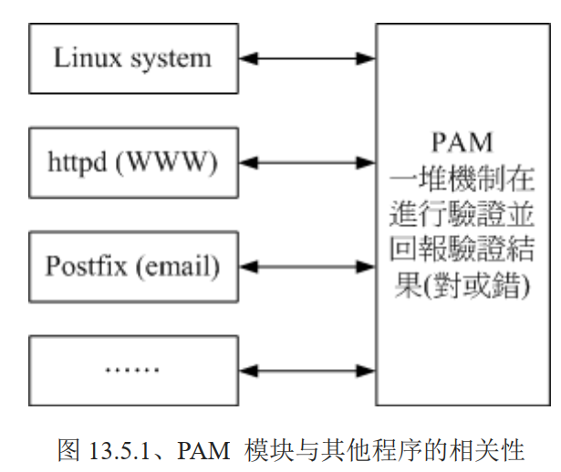
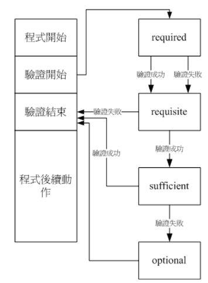

# 用户的特殊 shell 与 PAM 模块

前面讲解的大多是一般身份用户与系统管理员 root 的相关操作，而且大多是关于可登陆系统的账户来说的。

那么想要建立一个 **仅仅能使用 mail server 相关邮件服务的账户，而该账户并不能登陆 Linux 主机**，如果分配密码则

另外 前面说`/etc/login.defs`文件中，关于密码长度默认是 5 个字符串长度，但是该值以及被 PAM 模块所取代了，那么 PAM 是什么？为什么他可以影响我们使用者的登录呢？

## 🍀 特殊的 shell：`/sbin/nologin`

在 passwd 文件结构里面有看到过这个 shell 的配置，如果配置了这个 shell 给一个账户，那么该账户试图登录的时候，就会提示如下的信息

```bash
This account is currently not available
```

这里说的无法登录仅表示：这个使用者无法使用 bash 或其他 shell 来登录系统，并不是说无法使用其他系统资源

那么上面的提示内容，仅仅提示该账户目前不可用，其实可以通过 `/etc/nologin.txt` 文件来自定义提示内容

```bash
# 利用纯 mail 账户，例如 myuser3 时，显示自定义内容给登陆者查看

[root@study ~]# vim /etc/nologin.txt
 该账户只用来接收邮件，不提供登录服务。

# 之前创建 myuser3 的时候 shell 就设置的是 /sbin/nologin
[pro2@study ~]$ su -l myuser3
Password: 
该账户只用来接收邮件，不提供登录服务。

# 可以看到提示信息就被自定义了
```

## 🍀 PAM 模块简介

PAM（Pluggable Authentication Modules 嵌入式模块）可以说是一套应用程序编程接口，提供了许多验证机制，只要使用者将验证阶段的需求告知 PAM 后，PAM 就能返回验证结果成功或失败。

没有用 PAM 之前，需要自己写程序处理账户密码的验证，那么就有人收集了很多验证需求实现后提供了一个验证模块。因此程序都可以引用该模块来进行验证



如图示，PAM 是一个独立的 API，你的程序也可以引入他来进行验证

PAM 用来进行验证的数据成为模块（Modules），每个 PAM 模块功能都不太相同，比如，之前 passwd 指令输入密码，报错提示在字典上面找到的字符串，这是 PAM 的 pam_cracklib.so 模块的功能

## 🍀 PAM 模块设置语法

这里以  passwd 指令调用的 PAM 来说明：

1. 用户开始执行 `/usr/bin/passwd` 程序，并输入密码
2. passwd 调用 PAM 模块进行验证
3. PAM 模块会到 `/etc/pam.d/` 寻找与指令 passwd 同名的配置文件
4. 根据 `/etc/pam.d/passwd` 内的设置，引用相关的 PAM 模块逐步进行验证分析；

那么从这里就看出来了，他的入口配置是：

1. 配置文件要放到 `/etc/pam.d/` 中，且同名
2. 程序要调用

下面先来看看配置文件的内容。

```bash
[pro2@study ~]$ cat /etc/pam.d/passwd 
#%PAM-1.0		# PAM 版本说明
auth       include	system-auth			# 每一行是一个验证程序
account    include	system-auth
password   substack	system-auth
-password   optional	pam_gnome_keyring.so use_authtok
password   substack	postlogin
验证类别	控制标准	PAM 模块与该模块的参数
```

该文件中，除了第一行声明  PAM 版本外，其他的 `#` 开头的均为批注内容

上面第 2 字段中出现的 include 是标识，调用后面的文件来作为这个类别的验证，所以是调用 `/etc/pam.d/system-auth` 文件来进行验证

1. 验证类别（type）：主要分为 4 种

   - auth：authentication 认证

     主要用来校验使用者的身份验证，这种类别通常是需要密码来校验的，所以后续接的模块是用来校验用户的身份

   - account：account 账户

     大部分是在进行 authorization 授权，这种类别主要检验使用者是否具有正确的权限，比如：使用一个过期的密码来登录，就无法登录了

   - session

     该使用者在此次登录（或使用这个指令）期间，PAM 所给予的环境设置。这个类别通常用在记录用户登录与注销时的信息。

     例如：假如你常常使用 su 或 sudo 指令，那么应该可以在 `/var/log/secure` 里面发现很多关于 pam 的说明，而且记载的数据是`session open、session close` 的信息

   - password 密码

     主要提供验证的修改工作，比如修改密码

   这 4 个验证类型通常是有顺序的（也有例外），有顺序是因为：

   1. 总是要先验证身份（auth）后
   2. 系统才能够获取到用户身份给予适当的授权与权限设置（account）
   3. 登录与注销期间的环境才需要设置，需要记录登录与注销信息 （session）
   4. 修改密码时，使用 password 类别

   根据业务来看，貌似是有必要有顺序的

2. 验证的控制旗标（control flag）

    简单说：是验证通过的标准，主要有 4 种控制方式

   - required

     验证成功则带有 success 标志，失败则 failure 标志，但是都会继续后续的验证流程

   - requisite

     若验证失败立刻返回 failure 标志，并终止后续的验证流程。若验证成功则带有 success 标志，并继续后续的验证流程。

      由于失败就终止，因此失败时所产生的 PAM 信息无法通过后续的模块来记录了

   - sufficient

     若验证成功立刻回传 success 给原程序，并终止后续验证流程；

      若验证失败则带有 failure 标志并继续后续的验证流程。与 requisite 相反

   - optional

     该模块控件大多数是显示信息，并不是用在验证方面

   图示如下：

   

## 🍀 常用模块简介

由于常常需要通过各种方式来登录 login 系统，来看看登录所需要的 PAM 流程：

```bash
[mrcode@study ~]$ cat /etc/pam.d/login 
#%PAM-1.0
auth [user_unknown=ignore success=ok ignore=ignore default=bad] pam_securetty.so
auth       substack     system-auth
auth       include      postlogin
account    required     pam_nologin.so
account    include      system-auth
password   include      system-auth
# pam_selinux.so close should be the first session rule
session    required     pam_selinux.so close
session    required     pam_loginuid.so
session    optional     pam_console.so
# pam_selinux.so open should only be followed by sessions to be executed in the user context
session    required     pam_selinux.so open
session    required     pam_namespace.so
session    optional     pam_keyinit.so force revoke
session    include      system-auth
session    include      postlogin
-session   optional     pam_ck_connector.so

# 这里看到最多的应该是有引用了 system-auth，来观察下
[mrcode@study ~]$ cat /etc/pam.d/system-auth
#%PAM-1.0
# This file is auto-generated.
# User changes will be destroyed the next time authconfig is run.
auth        required      pam_env.so
auth        required      pam_faildelay.so delay=2000000
auth        sufficient    pam_fprintd.so
auth        sufficient    pam_unix.so nullok try_first_pass
auth        requisite     pam_succeed_if.so uid >= 1000 quiet_success
auth        required      pam_deny.so

account     required      pam_unix.so
account     sufficient    pam_localuser.so
account     sufficient    pam_succeed_if.so uid < 1000 quiet
account     required      pam_permit.so

password    requisite     pam_pwquality.so try_first_pass local_users_only retry=3 authtok_type=
password    sufficient    pam_unix.so sha512 shadow nullok try_first_pass use_authtok
password    required      pam_deny.so

session     optional      pam_keyinit.so revoke
session     required      pam_limits.so
-session     optional      pam_systemd.so
session     [success=1 default=ignore] pam_succeed_if.so service in crond quiet use_uid
session     required      pam_unix.so

```

system-auth 用到了非常多的 PAM 模块，每个模块的功能都不太相同，详细的模块数据可以在以下位置找到：

- `/etc/pam.d/*`：每个程序个别的 PAM 配置文件
- `/lib64/security/*`：PAM 模块文件的实际放置目录
- `/etc/security/*`：其他 PAM 环境的配置文件
- `/usr/share/doc/pam-*`：详细的 PAM 说明文件

```bash
[root@study ~]# find / -name *.pam_nologin
/usr/share/doc/pam-1.1.8/txts/README.pam_nologin
比如 pam_nologin.so 的说明文件，就在以上路径，可以阅读下
```

下面介绍几个常用的模块，详细的信息需要自己去查阅资料

- pam_securetty.so：限制系统管理员 root 只能怪从安全的 secure 终端机登录

  例如 tty1、tty2 就是传统的终端机装置名称。安全的终端机设置在 `/etc/securetty` 文件中，里面列出了终端机名称，查看下就知道为什么 root 可以从 tty1~tt2 登录，而不能通过 telnet 登录了

- pam_nologin.so：可以限制一般用户是否能够登录主机

  当 `/etc/nologin` 文件存在时，则所有一般使用者均无法再登录系统了，并在他们的终端机上会将该文件内容显示出来；

  正常情况下，该文件是不能存在系统中的，该模块对 root 以及已经登录系统中的一般账户没有影响。注意：该文件与 `/etc/nologin.txt` 不是同一个

- pam_selinux.so：SELinux 是个针对程序来进行细部管理权限的功能

  在后续的第 16 章中再来讨论 SELinux。由于 SELinux 会影响到用户执行程序的权限，因此利用 PAM 模块，将 SELinux 暂时关闭，等到验证通过后，在启动

- pam_console.so：

  当系统出现某些问题，或则是需要使用特殊的终端接口（如 RS232 之类的终端机联机设备）登录主机时，该模块可以帮助处理一些文件权限问题，让使用者可以通过特殊终端接口 console 顺利登录系统

- pam_loginuid.so：

  系统账户与一般账户的 UID 不同的，一般账户 UID 均大于 1000 才合理。可以用该模块来验证使用者的 UID 是否符合要求
  
- pam_unix.so：

  很复杂的且重要的模块，可以用在验证阶段的认证功能，可以用在授权阶段的账户许可证管理，可以用在会议（session）阶段的登录文件记录，甚至可以用在密码更新阶段的校验。该模块在早期用的较多

- pam_pwquality.so：

  可以用来校验密码强度，包括是否在字典中、密码输入几次都失败就断掉此次联机等功能。

  最早使用的是 pam_cracklib.so 模块，后来改成 pam_pwquality.so 模块，pam_pwquality.so 兼容 pam_cracklib.so 模块，同时提供了 `/etc/security/pwquality.conf` 文件可以额外指定默认值，比较容易处理修改

- pam_limits.so

  在第 10 章中讲解的 ulimit，就是该模块提供的能力，更多信息可以查看 `/etc/security/limits.conf` 

了解了模块大致功能后，这里讨论下 login 的 PAM 验证机制流程：

1. 验证阶段 auth：
   1. 经过 pam_securetty.so ，如果使用者是 root 时，会参考 /etc/securetty 的设置
   2. 经过 pam_env.so 设置额外的环境变量
   3. 经过 pam_unix.so 校验密码，若通过则回报 login 程序
   4. 若未通过，则继续往下以 pam_succeed_if.so 判断 UID 是大于 1000，若小于 1000 则回报失败
   5. 若大于 1000 则以 pam_deny.so 拒绝联机
2. 授权阶段 account：
   1. 以 pam_nologin.so 判断 /etc/nologin 是否存在，若存在则不允许一般使用者登录
   2. 接下来以 pam_unix.so 及 pam_localuser.so 进行账户管理
   3. 再以 pam_succeed_if.so 判断 UID 是否小于 1000，若小于 1000 则不记录登录信息
   4. 最后已 pam_permit.so 允许该账户登录
3. 密码阶段 password：
   1. 以 pam_pwauality.so 设置密码仅能尝试错误 3 次
   2. 接下来以 pam_unix.so 通过 sha512 shadow 等功能进行密码校验，若通过则回报 login 程序
   3. 若不通过则以 pam_deny.so 聚焦登录
4. 会议阶段 session：
   1. 以 pam_selinux.so 暂时关闭 SELinux
   2. 使用 pam_limits.so 设置好用户能够操作的系统资源
   3. 登录成功后开始记录相关信息在登录文件中
   4. 以 pam_loginuid.so 规范不同的 UID 权限
   5. 开启 pam_selinux.so 功能

这小节感觉太难了，笔者没有看懂也联想不到，只知道 /etc/nologin 文件存在的话，一般使用者都不能登录，远程联机有可能无法使用 root 登录，这些都是 PAM 模块提供的功能

## 🍀 其他相关文件

前面讲到：

- `/etc/securetty` 会影响到 root 可登录的安全终端机
- `/etc/nologin` 会影响到一般使用者是否能够登录
- `/etc/pam.d` 是 PAM 相关配置文件所在目录
- `/usr/share/doc/pam-(版本)` 是 PAM 说明文件所在目录
- `/lib64/security` 是 PAM 模块程序文件所在目录

主要的 PAM 文件都在 `/etc/security` 目录中，下面介绍几个可能会用到的配置文件

### limits.conf

[ 第 10 章讲到的 ulimit 功能 ](./10/02.md#与文件系统及程序的限制关系：ulimit)，除了修改使用者的 `~/.bashrc` 配置文件外，系统管理员可以通过 PAM 来管理，就是 `/etc/security/limits.conf` 这个文件。这里做个简单介绍

```bash
# 范例 1：mrcode1 这个用户只能建立 100MB 的文件，且大于 90MB 会警告

[root@study ~]# vim /etc/security/limits.conf 
#<domain>      <type>  <item>         <value>
#
mrcode1 soft    fsize   90000
mrcode1 hard    fsize   100000
# 账户	限制类型	限制项目	限制值
1 字段：账户或群组，若为群组则前面需要加上 @，例如 @projecta
2 字段：类型，是严格 hard，还是仅警告 soft
3 字段：此例中是文件容量
4 字段：为限制值，在此列中单位为 KB

# 使用 mrcode1 登录后执行以下操作
[mrcode1@study ~]$ ulimit -a
core file size          (blocks, -c) 0
data seg size           (kbytes, -d) unlimited
scheduling priority             (-e) 0
file size               (blocks, -f) 90000		# 查看到这里限制变成了 90000

#尝试创建大于 90MB 的文件
[mrcode1@study ~]$ dd if=/dev/zero of=test bs=1M count=110
File size limit exceeded (core dumped)
[mrcode1@study ~]$ ll --block-size=K test
-rw-rw-r--. 1 mrcode1 mrcode1 90000K Feb 25 22:07 test
# 发现该文件最多只有 90MB

```

```bash
# 范例 2： 限制 pro1 这个群组，每次仅能有一个用户登录系统 maxlogins
[root@study ~]# vim /etc/security/limits.conf
@pro1   hard    maxlogins 1

# 群组功能限制，似乎只对初始群组才有效果限制
# 如果尝试多个 pro1 的登录时，第二个以后就无法登录了
# 并且会在 /var/secure 文件中还会出现如下的信息
pam_limits(login:session): Too many logins (max 1) for pro1
```

该文件设置完就生效了。由于 PAM 是在程序调用时才设置，对于已经登录过的系统是没有效果的。再次登录时才会生效

### `/var/log/secure、/var/log/messages`

如果发生任何无法登录或则是产生一些你无法预期的错误时，由于 PAM 模块都会将数据记载到 `/etc/log/secure` 中，所以发生了问题，务必到该文件查看下日志信息。

举例来说：在 `limits.conf` 介绍的范例 2 中，多重登录错误可以到 `/var/log/secure` 内查询

