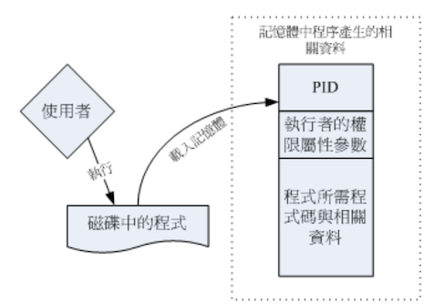
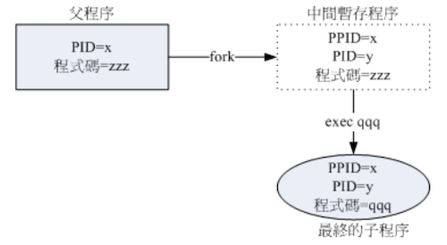

# 什么是进程（process）

在 Linux 系统中：**触发任何一个事件事，系统都会将它定义成一个进程，并且给予这个进程一个 ID，称为 PID，同时依据启发这个进程的用户与相关属性关系，给予这个 PID 一组有效的权限设置**。

## 🍀 进程与程序 （process & program）

执行一个程序或指令，就可以触发一个事件而取得一个 PID

不同的用户运行程序，程序所拥有的权限也是不同的，概念如下图



系统通过这个 PID 来判断该 process 是否具有权限进行工作的。

比如我们登陆的 bash tty，它是一个程序，登陆之后，系统会根据登陆者的 UID/GID（/etc/paswd）来分配一个 PID，比如执行了一个 touch 的执行，那么由这个进程 **衍生出来的其他进程在一般状态下，也会沿用这个进程的相关权限**

程序与进程总结：

- 程序 program：通常为 binary program，实体文件的形态存在
- 进程 process：程序被触发后，执行者的权限与属性、程序的程序代码与所需数据等都会被加载到内存中，操作系统并给予这个内存单元一个标识符（PID），可以说，进程就是一个正在运行的程序

### 子进程与父进程

上面提到 **衍生出来的进程**，我们登陆到 bash，该 bash 是一个程序，并有一个 PID，在这个 bash 上执行指令，触发了相关指令的程序运行，从而得到该程序的 PID，这个 PID 就是一个子进程，原本的 bash 就是一个父进程

下面以一个小练习，来了解什么是子进程/父进程

```bash
# 在目前的 bash 环境下，再触发一次 bash，并以 ps -l 指令管擦进程相关的输出信息
# 直接执行 bash 指令，会进入到子进程的环境中
[root@study ~]# bash
[root@study ~]# ps -l
F S   UID   PID  PPID  C PRI  NI ADDR SZ WCHAN  TTY          TIME CMD
4 S     0  5713  1923  0  80   0 - 32064 do_wai pts/0    00:00:00 su
4 S     0  5862  5713  0  80   0 - 29218 do_wai pts/0    00:00:00 bash
4 S     0 10917  5862  0  80   0 -  3184 do_wai pts/0    00:00:00 bash
0 R     0 11193 10917  0  80   0 - 12407 -      pts/0    00:00:00 ps
# 注意 PID 与 PPID，第 1 行的 PID 与第 2 行的 PPID 是一样的
# 第 2 行的 CMD 是 bash，就是从第一行中执行 bash 产生出来的
```

如果你发现，你杀掉了一个进程，不多久又出现了，这样的情况，如果不是 crontab 的定时任务产生的，那么就是有一个父进程在产生新的子进程

### fork and exec：进程呼叫的流程

进程与父进程的关系最为复杂的在于进程相互间的呼叫。

在 Linux 的进程呼叫通常称为 fork-and-exec 的流程，进程都会借由父进程以复制（fork）的方式产生一个一模一样的子进程，然后被复制出来的子进程再以 exec 的方式来执行时机要进行的程序，最终就成为一个子进程的存在。整个流程类似下图：



### 系统或网络服务：常驻在内存的进程

常驻就是一直在运行的程序，比如 crond 程序，每分钟都会扫描 `/etc/crontab` 以及相关的配置文件，将它启动在背景当中一直持续不断的运行，这就是常驻在内存中的进程

这些进程通常都是负责一些系统所提供的功能以服务用户各项任务，因此这些常驻程序称为 **服务（daemon）**。系统的服务非常多，主要大致分为系统本身所需要的服务，如 crond、atd、rsyslogd 等。还有一些则负责网络联机服务，例如 Apache、named、postfix、vsftpd 等，这些网络服务程序被执行后，会启动一个可以负责网络监听的端口 port，以提供外部客户端的联机要求

::: tip
cron 和 at 是他们主要执行的程序名称，但是后面加了一个 d，成为 crond、atd ，是因为这样可以简单的判定为该程序是一个服务 daemon，所以一般 daemon 类型的程序都会加上 d 的文件名，比如服务器篇中会看到的 httpd、vsftpd 等

:::

## 🍀 Linux 的多人多任务环境

了解了进程的知识点后，你可以简单的认为进程的出现，让我们多用户在 Linux 都能拥有自己的环境了。

- 多人环境

  Linux 最棒的地方就在于它的多人多任务环境。什么是多人多任务？每个账户都有其特殊的权限，除了 root 之外，其他人都必须受一些限制，而每个人进入 Linux 的环境设置都可以自定义，所以每个人登录后取得的 shell PID 不同，是因为不在同一个进程程序中

- 多任务行为

  CPU 多在各个进程之间进行切换工作，因此当多人同时登录系统时，你的感觉就像整部主机好像就是你一个人的一样

- 多重登录环境的七个基本终端窗口

  在 Linux 中，默认提供了 6 个文字界面登录窗口和一个图形界面，可以使用 `alt+F{1-7}`来切换不同的终端机界面，每个终端机界面的登录者可以是不同用户

  这也是多任务环境下所产生的一个情况，Linux 默认会启动 6 个终端机登录环境的程序，所以才可以切换，在后续第 19 章开机管理流程中会仔细介绍的。

- 特殊的进程管理行为

  对于宕机情况，在 Linux 上，几乎不会出现，因为他可以在任何时候，将某个困住的进程杀掉，然后在重新执行该进程而不用重新启动。

  比如在 Linux 下以文字界面登录，在屏幕中显示错误信息后就挂了，不能动了。这个时候你可以切换到另外的 6 个终端机接口，以 `ps -aux` 找出刚刚的错误进程，kiil 掉它，再回到刚刚的终端机界面就好了（笔者疑问？kill 后会自动重启？有点不太理解）

- bash 环境下的工作管理

  当我们登录 bash 后，取到了一个 PID，那么在这个环境下执行的其他指令，几乎是子进程了，在这个单一的 bash 接口中，可以如下进行多个工作，并且是同时进行

  ```bash
  cp file1 file2 &
  ```

  上述指令串中，`&` 表示把 file1 复制为 file2，并放到背景中执行。也就是说，下达完这一串指令后，马上就可以下达其他的指令串了，当着一个指令执行完成后，系统将会在你的终端接口显示完成的消息

- 多人多任务的系统资源分配问题考虑

  当人多的时候，由于是共用计算机资源，所以有可能会导致资源不够用的情况发生，这个时候就需要升级机器了