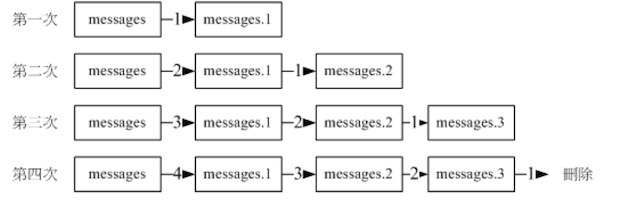

# 登录文件的轮替 logrotate

轮替，就是定时的执行备份操作，可以查看 `/etc/cron.daily/logrotate` ，里面配置了文件轮替行为

## 🍀 logrotate 的配置文件

配置文件如下：

- `/etc/logrotate.conf`：配置文件
- `/etc/logrotate.d/`：该目录下是细化的分类，比如你有你自己的软件需要轮替操作，就可以放到该目录下

logrotate 的主要功能是将旧的日志文件移动成旧文件，并且重新建立一个新的空的文件。它的执行结果如下图示意：



上图是一个过程，后面的图示已经包含了前面的过程。

- 第 1 次执行完 rotate 后：原本的 messages 文件变成了 messages.1，而且会制造一个空的 message 出来
- 第 2 次：messages.1 变成了 messages.2

以此下去，如果我们设置值保留三个文件日志信息，那么当执行第 4 次的时候，则 messages.3 会被移除，也就是新的备份文件会将旧的给覆盖掉

那么多久执行一次 logrotate 呢？保留几个备份文件呢？这些都在 logrotate.conf 中配置的

```bash
[root@study ~]# vim /etc/logrotate.conf 
# 下面是预设的默认值，如果某些文件又设置了其他的参数，那么就以它自己的设置为准

# see "man logrotate" for details
# rotate log files weekly
weekly				# 每周进行一次

# keep 4 weeks worth of backlogs
rotate 4			# 保留几个日志文件，这里预设是 4 个

# create new (empty) log files after rotating old ones
create				# 是否建立一个新的文件来继续存储新的数据

# use date as a suffix of the rotated file
dateext				# 是否为轮替的文件加上日期作为文件名

# uncomment this if you want your log files compressed
#compress			# 轮替的文件是否需要压缩

# RPM packages drop log rotation information into this directory
include /etc/logrotate.d		# 该目录中的所有文件都读进来执行 rotate 的工作

# no packages own wtmp and btmp -- we'll rotate them here
/var/log/wtmp {		# 仅针对  /var/log/wtmp 所设置的参数
    monthly									# 每个月一次
    create 0664 root utmp		# 创建新文件的权限所属账户/群组
    minsize 1M							# 文件容量超过 1M 后才进行 rotate
    rotate 1								# 仅保留一个，即只有 wtmp.1 
}
# wtmp 可记录登陆者与系统重新启动时的实际与来源主机以及登录期间的实际
/var/log/btmp {
    missingok
    monthly
    create 0600 root utmp
    rotate 1
}

# system-specific logs may be also be configured here
```

从配置文件中看到 `/etc/logrotate.d/` 目录是该配置文件的规范支持。用途就是方便添加自定义的配置文件，而不用把所有配置都写到主要的配置文件中。比如你开发了一个软件，有轮替日志文件的需求，就可以吧配置文件放到该目录下，就可以了

下面以 `rsyslog.service` 服务的文件，来设置它的 rotate

```bash
# 该文件是存在的，我们来修改与学习
[root@study ~]# vim /etc/logrotate.d/syslog 
/var/log/cron
/var/log/maillog
/var/log/messages
/var/log/secure
/var/log/spooler
{
    missingok
    sharedscripts
    postrotate
        /bin/kill -HUP `cat /var/run/syslogd.pid 2> /dev/null` 2> /dev/null || true
    endscript
}

```

下面来看看设置的语法

- 文件名：可以用空格符号分割多个文件

- 参数：`{}` 中的配置

- 执行脚本：

  可以调用外部指令来进行额外的命令，需要与 `sharedscripts...endscript` 的设置，可用环境含义：

  - prerotate：在启动 logrotate 之前进行的指令，例如修改日志文件的属性等操作

  - postrotate：在做完 logrotate 之后启动的指令，例如重新启动（kill -HUP） 某个服务

​        上面两个钩子在对于已加上特殊属性的文件处理上面，很重要方便

那么上述文件的配置含义为：

- 该配置只对上述列出来的 5 个文件有效
- 每周一次、保留 4 个、且轮替下来的文件不进行压缩；这些都是默认值，并没有在该文件中配置
- 轮替完成后（postrotate）取得 syslog 的 PID 后，以 kill-HUP 方式重新启动 syslogd

但是如果有特殊属性的话，比如使用了 `chattr +a`，那么该文件无法删除，也就是无法被更名，而 logrotate 的工作原理就是将当前的文件更名。这个时候就可以使用上面提供的两个钩子方法来解决这个问题

```bash
[root@study ~]# vim /etc/logrotate.d/syslog 
/var/log/cron
/var/log/maillog
/var/log/messages
/var/log/secure
/var/log/spooler
{
	  sharedscripts
    prerotate
    	/usr/bin/chattr -a /var/log/messages
    endscript
    missingok
    sharedscripts
    postrotate
        /bin/kill -HUP `cat /var/run/syslogd.pid 2> /dev/null` 2> /dev/null || true
				/usr/bin/chattr +a /var/log/messages   
   endscript
}
```

提示下：`kill -HUP` 指定的信号量含义是将 rsyslog.conf 资料重新读取一次，可以理解为 reload 操作

## 🍀 实际测试 logrotate 动作

上述测试完成之后，测试下

```bash
logrotate [-vf] logfile

选项与参数：
	-v：启动显示模式，会显示 logrotate 运行的过程
	-f：无论是否符合配置文件的数据，强制每个日志文件都进行 rotate 的操作
```

下面执行一次看看整个流程

```bash
[root@study ~]# logrotate -v /etc/logrotate.conf 
reading config file /etc/logrotate.conf		# 读取主要的配置文件
including /etc/logrotate.d								# 读取模块化的外部配置文件
reading config file bootlog
reading config file chrony
reading config file cups
....
Allocating hash table for state file, size 15360 B

Handling 15 logs							# 共有 15 个日志文件
...
rotating pattern: /var/log/cron
/var/log/maillog
/var/log/messages
/var/log/secure
/var/log/spooler
 weekly (4 rotations)
empty log files are rotated, old logs are removed
considering log /var/log/cron
  log does not need rotating (log has been rotated at 2020-3-15 21:37, that is not week ago yet)
considering log /var/log/maillog
  log does not need rotating (log has been rotated at 2020-3-15 21:37, that is not week ago yet)
considering log /var/log/messages		# 处理 messages 文件
	# 由于时间未到，不需要操作
  log does not need rotating (log has been rotated at 2020-3-15 21:37, that is not week ago yet)
considering log /var/log/secure
  log does not need rotating (log has been rotated at 2020-3-15 21:37, that is not week ago yet)
considering log /var/log/spooler
  log does not need rotating (log has been rotated at 2020-3-15 21:37, that is not week ago yet)
not running postrotate script, since no logs were rotated
```

```bash
# 范例 2：强制 logrotate 操作
[root@study ~]# logrotate -v /etc/logrotate.conf 
rotating pattern: /var/log/cron
/var/log/maillog
/var/log/messages
/var/log/secure
/var/log/spooler
 forced from command line (4 rotations)
empty log files are rotated, old logs are removed
considering log /var/log/cron
  log needs rotating
considering log /var/log/maillog
  log needs rotating
considering log /var/log/messages
  log needs rotating
considering log /var/log/secure
  log needs rotating
considering log /var/log/spooler
  log needs rotating
rotating log /var/log/cron, log->rotateCount is 4
dateext suffix '-20200316'
glob pattern '-[0-9][0-9][0-9][0-9][0-9][0-9][0-9][0-9]'
rotating log /var/log/maillog, log->rotateCount is 4
dateext suffix '-20200316'
glob pattern '-[0-9][0-9][0-9][0-9][0-9][0-9][0-9][0-9]'
rotating log /var/log/messages, log->rotateCount is 4
dateext suffix '-20200316'
glob pattern '-[0-9][0-9][0-9][0-9][0-9][0-9][0-9][0-9]'
rotating log /var/log/secure, log->rotateCount is 4
glob pattern '-[0-9][0-9][0-9][0-9][0-9][0-9][0-9][0-9]'
fscreate context set to system_u:object_r:cron_log_t:s0
renaming /var/log/cron to /var/log/cron-20200316
creating new /var/log/cron mode = 0600 uid = 0 gid = 0
fscreate context set to system_u:object_r:var_log_t:s0
renaming /var/log/maillog to /var/log/maillog-20200316
creating new /var/log/maillog mode = 0600 uid = 0 gid = 0
fscreate context set to system_u:object_r:var_log_t:s0
# 重命名了文件，然后又创建了一个文件
renaming /var/log/messages to /var/log/messages-20200316
creating new /var/log/messages mode = 0600 uid = 0 gid = 0
fscreate context set to system_u:object_r:var_log_t:s0
renaming /var/log/secure to /var/log/secure-20200316
creating new /var/log/secure mode = 0600 uid = 0 gid = 0
fscreate context set to system_u:object_r:var_log_t:s0
renaming /var/log/spooler to /var/log/spooler-20200316
creating new /var/log/spooler mode = 0600 uid = 0 gid = 0
running postrotate script
removing old log /var/log/cron-20200225
removing old log /var/log/maillog-20200225
removing old log /var/log/messages-20200225
removing old log /var/log/secure-20200225
removing old log /var/log/spooler-20200225

[root@study ~]# ll /var/log/messages*; lsattr /var/log/messages
-rw-------. 1 root root    345 Mar 16 00:01 /var/log/messages
-rw-------. 1 root root 756608 Mar  1 18:30 /var/log/messages-20200301
-rw-------. 1 root root 270175 Mar  8 12:23 /var/log/messages-20200308
-rw-------. 1 root root 187277 Mar 15 21:30 /var/log/messages-20200315
-rw-------. 1 root root  12425 Mar 16 00:00 /var/log/messages-20200316
-----a---------- /var/log/messages
# 上面我们配置的处理特殊属性的脚本生效了
```

由于 logrotate 已经加入到 crontab 里面了，只需要留意下 `/var/log/messages` 是否有类似如下的信息

```bash
[root@study ~]# grep 'www.rsyslog.com' /var/log/messages
Mar 16 00:00:42 study rsyslogd: [origin software="rsyslogd" swVersion="8.24.0-38.el7" x-pid="7107" x-info="http://www.rsyslog.com"] rsyslogd was HUPed

```

这个是 rsyslogd 重新启动的时间，（因为 `/etc/logrotate.d/syslog` 中配置了重新启动的）

## 🍀 自定义日志文件的轮替功能

在前面章节总， 建立了一个 `/var/log/admin.log` 文件，需要配置如下需求

- 添加 `+a` 属性
- 一个月轮替一次
- 当文件大于 10MB 时，则主动轮替，不需要考虑一个月的时间
- 保存 5 个备份文件
- 备份文件需要压缩


```bash
# 1. 添加 a 属性，并测试是否有效
[root@study ~]# chattr +a /var/log/admin.log
[root@study ~]# lsattr /var/log/admin.log
-----a---------- /var/log/admin.log
[root@study ~]# rm /var/log/admin.log 
rm: remove regular file '/var/log/admin.log'? y
rm: cannot remove '/var/log/admin.log': Operation not permitted
# 连 root 都无法删除

# 2. 建立 logrotate 配置文件
[root@study ~]# vim /etc/logrotate.d/admin
/var/log/admin.log {
  monthly		# 每个月一次
  size=10M	# 文件容量大于 10M 则开始处置
  rotate 5	# 保留 5 个
  compress	# 压缩
  sharedscripts
  prerotate
        /usr/bin/chattr -a /var/log/admin.log
  endscript
  sharedscripts
  postrotate
  			# 就是这里，每个都要重新启动啊？难该服务启动得有点频繁啊
        /bin/kill -HUP `cat /var/run/syslogd.pid 2> /dev/null` 2> /dev/null || true
        /usr/bin/chattr +a /var/log/admin.log
  endscript
}

# 3. 测试下 logrotate 相关功能信息显示
[root@study ~]# logrotate -v /etc/logrotate.conf 
[root@study ~]# logrotate -v /etc/logrotate.conf             
reading config file /etc/logrotate.conf
including /etc/logrotate.d
reading config file admin		# 看到已经加载我们的配置文件了
...
rotating pattern: /var/log/admin.log  10485760 bytes (5 rotations)
empty log files are rotated, old logs are removed
considering log /var/log/admin.log
  log does not need rotating (log size is below the 'size' threshold)
not running prerotate script, since no logs will be rotated
# 可以看到，检测到 size 不够，不用处理

# 4. 强制执行 logrotate ，并查看相关信息
[root@study ~]# logrotate -vf /etc/logrotate.conf
rotating pattern: /var/log/admin.log  forced from command line (5 rotations)
empty log files are rotated, old logs are removed
considering log /var/log/admin.log
  log needs rotating
rotating log /var/log/admin.log, log->rotateCount is 5
dateext suffix '-20200316'
glob pattern '-[0-9][0-9][0-9][0-9][0-9][0-9][0-9][0-9]'
glob finding old rotated logs failed
running prerotate script
fscreate context set to system_u:object_r:var_log_t:s0
renaming /var/log/admin.log to /var/log/admin.log-20200316
creating new /var/log/admin.log mode = 0600 uid = 0 gid = 0
running postrotate script
compressing log with: /bin/gzip
set default create context to system_u:object_r:var_log_t:s0

[root@study ~]# lsattr /var/log/admin.log*       
-----a---------- /var/log/admin.log
---------------- /var/log/admin.log-20200316.gz
# 可以看到的确被压缩过，当前的 a 属性也正常
```
