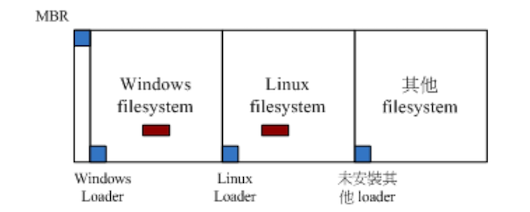
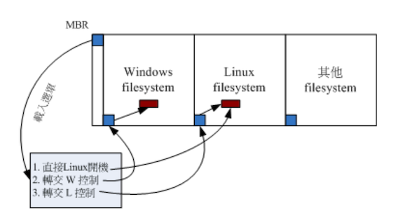
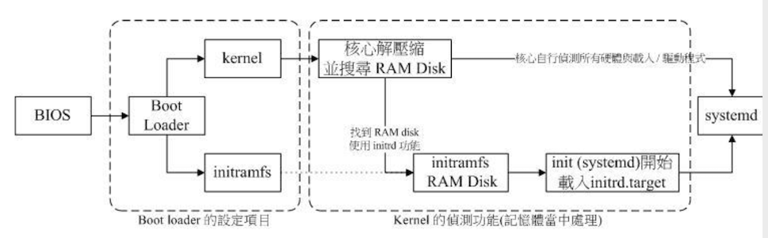

# Linux 的开机流程分析

为什么要了解开机流程？下面又几个常见的场景：

- 如果想多重引导，怎么安全系统？
- 如果你的 root 密码忘记了，如何救援？
- 如果你的默认登录模式为图形界面，如果在开机时直接指定进入纯文本模式？
- 如果因为 `/etc/fstab` 设置错误，导致无法顺利挂载根目录，如何修复 `/etc/fstab` 文件？

笔者当时其实就因为 fstab 文件配置错误，导致开机进入不了系统的问题，当时通过第 3 章中的知识点，还好救援回来了。可见是真的很重要

## 🍀 开机流程一览

开机管理程序（Boot Loader），由于各大 Linux distribution 的主流为 grub2，下面就以它为主讲解

简单来说，系统开机的经过可以总结如下的流程：

1. 加载 BISO 的硬件信息与进行自我测试，并根据设置获得第一个可开机的设备

2. 读取并执行第一个开机设备内 MBR 的 boot Loader（grub2、spfdisk 等程序）

3. 根据 boot loader 的设置加载 Kernel，Kernel 会开始检测硬件与加载驱动程序

4. 在硬件驱动成功后，Kernel 会调用 systemd 程序，并以 default.target 的流程开机：

   - systemd 执行 sysinit.target 初始系统以及 bashic.target 准备操作系统

   - systemd 启动 multi-user.target 下的本机与服务器服务

   - systemd 执行 multi-user.target 下的`/etc/rc.d/rc.local` 文件
   - systemd 执行 multi-user.target 下的 `getty.target` 及登录服务
   - systemd 执行 graphical 需要的服务

大概流程如上，会发现 systemd 程序占比非常重，下面来谈谈各个程序的主要内容是什么

## 🍀 BIOS、boot loader 与 kernel 载入

在第 2 章中简单的讲解过开机流程与 MBR 的功能，以及大容量磁盘需要使用 GPT 分区格式等。这里只把后续会用到的部分专有名词综合解释：

- BIOS：无论传统 BIOS 还是 UEFI BIOS 统称 BIOS
- MBR：分区表有传统 MBR 和新式 GPT，GPT 也保留一块兼容 MBR 的区块，因此后续的说明在安装 boot loader 的部分，都简称 MBR，总之， MBR 就代表该磁盘最前面可安装 boot loader 的哪个区块

### BIOS 开机自我测试与 MBR/GPT

BIOS：在第 0 章的计算机概论中谈过，在个人计算机架构下，要启动整部系统，需要让系统去加载 BIOS （Basic Output System），并通过 BIOS 程序与加载 CMOS 的信息，获取 CMOS 内的设置取得主机的各项硬件配置，例如 CPU 与接口设备的沟通频率、开机设备的搜索顺序、硬盘的大小、系统时间、各周边总线是否启动 Plug and Play （PnP 即插即用设备）等信息

开机自我测试：BIOS 取得上述信息后，会进行开机自我测试（Power-on Self Test，简称 POST）。然后执行硬件检测初始化，并设置 PnP 装置，之后再定义出可开机的设备顺序，接下来会开始进行开机设备的数据读取

MBR：系统软件大多放置在硬盘中，所以 BIOS 会指定开机的设备让我们可以读取磁盘中的操作系统核心文件，但是由于不同的操作系统的文件系统格式不同，因此需要一个开机管理程序来处理核心文件加载 （load）的问题，因此整个 **开机管理程序被称为 Boot Loader **，Boot Loader 程序安装在开机设备的第一个扇区（sector）内，整个扇区也称为 **MBR（Master Boot Record）** 主要启动记录区

每个操作系统的 loader 都可能不同，BIOS 通过硬件的 INT 13 中断功能来读取 MBR 的，也就是说，只要 BIOS 能够检测到你的硬盘（不论该磁盘是 SATA 还是 SAS 接口），它就有办法通过 INT 13 这个信道来读取该磁盘的第一个扇区内的 MBR 软件

注意：如果系统中有两块硬盘，那么查找的是第一启动设备中的 MBR

### Boot Loader 功能

Loader 最主要的功能是认识操作系统的文件格式并根据加载核心到主存储器去执行。由于不同操作系统的文件格式不一致，因此每种操作系统都有自己的 boot loader。

那么多重操作系统：就是在不一部追上安装多中不同的操作系统

1. 必须要使用自己的 loader 才能够加载属于自己的操作系统核心
2. 但是系统的 MBR 只有一个，那么怎么能让同一台主机上安装 windows 与 Linux 呢？

这个问题在第 7 章的磁盘文件系统中有介绍到过。每个文件系统（filesystem 或 partition）都会保留一块启动扇区（boot sector）提供操作系统安装 boot loader，通常操作系统默认会安装一份 loader 到它根目录所在的文件系统的 boot sector 上。

如果在一台主机上安装 Windows 与 Linux 后，boot sector、boot loader 与 MBR 的相关系如下图所示



如上图所示，每个操作系统默认会安装一套 boot loader 到他自己的文件系统中（左下角的蓝色区域）：

- Linux 系统：安装时，你可以选择 boot loader 安装到 MBR 上，也可以选择不安装。如果选择安装到 MBR 的话，理论上你再 MBR 与 boot sector 都会有一份 boot loader 程序。
- Windows：安装时，它默认主动的将 MBR  与 boot sector 都装上一份 boot loader

所以会发现安装多重操作系统时，你的 MBR 常常会被不同的操作系统的 boot loader 所覆盖。

那么怎么解决多重操作系统的问题呢？在第 2 章中提到过，boot loader 的功能

- 提供选单：用户可以选择不同的开机项目，这也是多重引导的重要功能
- 载入核心文件：直接执行可开机的程序区段来开始操作系统
- 转交其他 loader：将开机管理功能转交给其他 loader 负责

由于具有选单功能，可以选择不同的核心来开机。由于具有控制权限转交功能，因此可以加载其他 boot sector 内的 loader。但是 Windows 的 loader 预设不具有控制转交的功能，因此你不能使用 Windows 的 loader 来加载 Linux 的 loader。这也是为什么会强调 **先装 windows，再装 Linux** 的缘故。

上述三个功能图下图所示：



上图，MBR 使用 Linux 的 grub2 开机管理程序，并且设置了 3 个选单：

- 选单 1：MBR（grub2） -> kernel file -> booting
- 选单 2：MBR（grub2） -> boot sector（Windows loader） -> Windows kernel -> booting
- 选单 3：MBR（grub2） -> boot sector（grub2）-> kernel file -> booting

### 加载核心检查硬件与 initramfs 功能

通过 boot loader 的管理而开始读取核心文件后，加下来，Linux 会将核心解压到主存储器中，并利用核心的功能，开始测试与驱动各个周边设备，包括存储设备、CPU、网卡、声卡等。

**此时 Linux 核心会以自己的功能重新检查一次硬件，而不一定会使用 BIOS 检测到的硬件信息，也就是说，核心此时才开始接管 BIOS 后的工作 **。一般来说，核心文件会放到 `/boot` 中，并取名为 `/boot/vmlinuz`

```bash
[root@study ~]# ls --format=single-column -F /boot
config-3.10.0-1062.el7.x86_64																# 此版本核心被编译时选择的功能与模块配置文件
efi/																												# 书上没有这个
grub/																												# 旧版 grub1，不用管
grub2/																											# 开机管理程序 grub2 的目录
initramfs-0-rescue-f228ab37c368416c84c6b27971ba45a9.img			# 虚拟文件系统，用来救援的
initramfs-3.10.0-1062.el7.x86_64.img												# 正常开机会用到的虚拟文件系统
initramfs-3.10.0-1062.el7.x86_64kdump.img										# 核心出问题时会用到的虚拟文件系统；笔者这里没有看到这个文件
System.map-3.10.0-1062.el7.x86_64														# 核心功能放到内存地址的对应表
symvers-3.10.0-1062.el7.x86_64.gz														# 书上没有这个
vmlinuz-0-rescue-f228ab37c368416c84c6b27971ba45a9*					# 救援用的核心文件
vmlinuz-3.10.0-1062.el7.x86_64*															# 核心文件，最重要的
testing.img																									# 书上没有这个
```

上面可知道 CentOS 7.x 的 Linux 核心为 3.10.0-1062.el7.x86_64 版本。为了硬件开发商与其他核心功能开发者的便利，因此 Linux 核心是可以通过动态加载核心模块的（可想象成驱动程序），这些核心模块放在 `/lib/modules/` 目录内。

**由于模块放置到磁盘根目录内（记得 /lib  不可以与 /  分别放在不同的 partition）！，因此在开机的过程中核心必须要挂载根目录，这样才能读取核心模块提供价值驱动程序的功能**。而且为了担心影响到磁盘内的文件系统，因此开机过程中根目录是只读方式来挂载的

一般来说，非必要的功能且可以编译成模块的核心功能，目前的 Linux distribution 都会将它编译成模块。因此 USB、SATA、SCSI 等磁盘设备的驱动程序通常都是以模块的方式存在的。

考虑一种情况：你的 Linux 是安装在 SATA 磁盘上面的，可以通过 BIOS 的 INT 13 获取 boot loader 与 kernel 文件来开机，然后 kernel 会开始接管系统并且检查硬件及长沙挂载根目录来获取额外的驱动程序

问题是：**核心根本不认识 SATA 磁盘**，所以需要加载 SATA 磁盘的驱动程序，否则根本无法挂载根目录。但是 SATA 的驱动程序在 `/lib/modules` 内，你根本无法挂载根目录，就没法读取到 SATA 的驱动程序。

在这种情况下，LInux 是无法顺利开机的，但是可以使用虚拟文件系统来处理这个问题

**虚拟文件系统（Initial RAM Disk 或 Initial RAM Filesystem）** 一般使用 `/boot/initrd` 或 `/boot/initramfs`，该文件特点是，它也可以通过 boot loader 来加载到内存中，然后该文件会被解压缩并且在内存中 **仿真成一个根目录**，且此仿真在内存中的文件系统能够提供一个可执行的程序，通过该程序来 **加载开机过程中所最需要的核心模块**，等载入完成后，会帮助核心重新调用 systemd 来开始后续的正常开机流程

BIOS 与 boot loader 、核心加载流程示意图如下：



如图所示：boot loader 可以加载 kernel 与 initramfs，在内存中让 initramfs 解压缩成为根目录，kernel 借此加载适当的驱动程序，最终释放虚拟文件系统，并挂载实际的根目录文件系统，就可以开始后续的正常开机流程了

下面来了解下 CentOS 7.x 的 initramfs 文件内容

```bash
# 1. 直接看 initramfs 里的内容有哪些
[root@study ~]# lsinitrd /boot/initramfs-3.10.0-1062.el7.x86_64.img 
Image: /boot/initramfs-3.10.0-1062.el7.x86_64.img: 31M
========================================================================
这一部分数据笔者并没有看到有
Early CPIO image
kernel  kernel/x86
========================================================================

========================================================================
Version: dracut-033-564.el7

Arguments: -f

# 开始一堆模块的加载行为
dracut modules:
bash
nss-softokn
...
========================================================================
drwxr-xr-x  12 root     root            0 Oct  4 18:31 .
crw-r--r--   1 root     root       5,   1 Oct  4 18:31 dev/console
crw-r--r--   1 root     root       1,  11 Oct  4 18:31 dev/kmsg
crw-r--r--   1 root     root       1,   3 Oct  4 18:31 dev/null
lrwxrwxrwx   1 root     root            7 Oct  4 18:31 bin -> usr/bin
...
-rwxr-xr-x   1 root     root      1624552 Oct  4 18:31 usr/lib/systemd/systemd
...
-rw-r--r--   1 root     root         1377 Sep  7  2017 usr/share/terminfo/v/vt220
drwxr-xr-x   2 root     root            0 Oct  4 18:31 var
lrwxrwxrwx   1 root     root           11 Oct  4 18:31 var/lock -> ../run/lock
lrwxrwxrwx   1 root     root            6 Oct  4 18:31 var/run -> ../run
========================================================================
# 最后则会列出这个 initramfs 里所有的文件，也就是说，该文件大概存储两部分内容
# 1. 最前面核心文件 # 笔者这个里面没有这些数据
# 2. 被核心取用的全部附加的文件数据
```

下面解压下该 img 的文件，来看看里面的文件内容

提示：笔者机器上与书上一部分对不上，所以暂时不确定是否能正常解压

```bash
[root@study ~]# mkdir /tmp/initramfs
[root@study ~]# cd /tmp/initramfs
[root@study initramfs]# ll /boot/
total 135200
...
-rw-------. 1 root root 31799826 Oct  4 18:32 initramfs-3.10.0-1062.el7.x86_64.img
...
# 1. 跳过部分文件，这一步不跳过可以省略，直接复制原来的文件就可以
# 我这里没有跳过文件，可以看到 31799826 和上面的文件大小是一样的
# 书上是在下面的指令后面写了 skip 1; 跳过了一个 11264 的块，但是作者怎么知道这个大小是他需要跳过的文件大小呢？
[root@study initramfs]# dd if=/boot/initramfs-3.10.0-1062.el7.x86_64.img of=initramfs.gz bs=11264       
2823+1 records in
2823+1 records out
31799826 bytes (32 MB) copied, 0.0366742 s, 867 MB/s
[root@study initramfs]# ll initramfs.gz; file initramfs.gz 
-rw-r--r--. 1 root root 31799826 Mar 24 21:54 initramfs.gz
initramfs.gz: gzip compressed data, from Unix, last modified: Fri Oct  4 18:31:46 2019, max compression
# dd 语法还可以直接写一个压缩文件？还有这种神奇的用法？
# 上面和下面都用到了 file，因此笔者猜想，上面使用 dd 纯粹是为了跳过某些文件罢了
# 实际上 img 是一个 gizp 的压缩文件，可以从下面的结果看出来
[root@study initramfs]# file /boot/initramfs-3.10.0-1062.el7.x86_64.img 
/boot/initramfs-3.10.0-1062.el7.x86_64.img: gzip compressed data, from Unix, last modified: Fri Oct  4 18:31:46 2019, max compression
# 的确显示是 gzip 文件

# 2. 从文件来看，是一个 gz 文件，解压该压缩文件，查看文件内容
[root@study initramfs]# gzip -d initramfs.gz 
[root@study initramfs]# file initramfs 
initramfs: ASCII cpio archive (SVR4 with no CRC)

# 3. 解压之后，又产生了一个 cpio 的文件
# 使用 cpio 来解压，并且不要绝对路径是最保险的
[root@study initramfs]# cpio -i -H newc --no-absolute-filenames < initramfs 
128695 blocks
[root@study initramfs]# ll
total 64356
lrwxrwxrwx.  1 root root        7 Mar 24 22:05 bin -> usr/bin
drwxr-xr-x.  2 root root       45 Mar 24 22:05 dev
drwxr-xr-x. 12 root root     4096 Mar 24 22:05 etc
lrwxrwxrwx.  1 root root       23 Mar 24 22:05 init -> usr/lib/systemd/systemd
-rw-r--r--.  1 root root 65891840 Mar 24 21:54 initramfs
lrwxrwxrwx.  1 root root        7 Mar 24 22:05 lib -> usr/lib
lrwxrwxrwx.  1 root root        9 Mar 24 22:05 lib64 -> usr/lib64
drwxr-xr-x.  2 root root        6 Mar 24 22:05 proc
drwxr-xr-x.  2 root root        6 Mar 24 22:05 root
drwxr-xr-x.  2 root root        6 Mar 24 22:05 run
lrwxrwxrwx.  1 root root        8 Mar 24 22:05 sbin -> usr/sbin
-rwxr-xr-x.  1 root root     3117 Mar 24 22:05 shutdown
drwxr-xr-x.  2 root root        6 Mar 24 22:05 sys
drwxr-xr-x.  2 root root        6 Mar 24 22:05 sysroot
drwxr-xr-x.  2 root root        6 Mar 24 22:05 tmp
drwxr-xr-x.  7 root root       66 Mar 24 22:05 usr
drwxr-xr-x.  2 root root       29 Mar 24 22:05 var
# 可以看到上面几乎就像是一个小型的文件系统根目录，这样就能让 kernel 去挂载了

# 4. 再来看下，小型文件系统中，systemd 是使用哪一个 target 来执行开机呢？
[root@study initramfs]# ll usr/lib/systemd/system/default.target 
lrwxrwxrwx. 1 root root 13 Mar 24 22:05 usr/lib/systemd/system/default.target -> initrd.target

# 5. 最终，看看系统内默认的 initrd.target 相依的所有服务数据
[root@study initramfs]# systemctl list-dependencies initrd.target 
initrd.target
* |-dracut-cmdline.service
....
* |-basic.target
* | |-microcode.service
* | |-rhel-dmesg.service
* | |-selinux-policy-migrate-local-changes@targeted.service
* | |-paths.target
* | |-slices.target
* | | |--.slice
* | | `-system.slice
* | |-sockets.target
* | | |-avahi-daemon.socket
...
* | |-sysinit.target
* | | |-dev-hugepages.mount
...
* | | |-local-fs.target
* | | | |--.mount
* | | | |-boot.mount
* | | | |-home.mount
* | | | |-rhel-readonly.service
* | | | `-systemd-remount-fs.service
...
* | | `-swap.target
* | |   `-dev-mapper-centos\x2dswap.swap
* | `-timers.target
* |   |-systemd-tmpfiles-clean.timer
* |   `-unbound-anchor.timer
* |-initrd-fs.target
* `-initrd-root-fs.target

# 通过 systemd 的方式，一个一个的将所有的检查与服务价值系统中
```

通过上面解开 initramfs 的结果，其实它就是一个小型的根目录，而且也是通过 systemd 来进行管理，同时观察 default.target 的链接到了 initrd.target ，就是通过它来开机，而 initrd.target 也是需要读入一堆如 basic.target、sysinit.target 等硬件检测、核心功能启用的流程，然后让系统顺利运行。最终又卸载了 initramfs 的小型文件系统，实际挂载系统的根目录

同时可以看到 initramfs 里面很精简，仅是带入开机过程中会用到的核心模块。在 initramfs 里去找 modules 关键词，就可以发现主要的核心模块大概就是 SCSI、virtio、RAID 等与磁盘相关性较高的模块。现在由于大部分磁盘都使用 SATA ，并没有 IDE 的格式，没有 initramfs 的话，你的 Linux 几乎就不能顺利开机了，除非将 STAT 的模块直接编译到核心中去

在核心加载完成后，主机就开始正确运行了，接下来就要开始执行系统的第一个程序 systemd

## 🍀 第一个程序 systemd 及使用 defaul.target 进入开机程序分析

在核心加载完成、进行完硬件检测与驱动程序加载后，此时你的主机硬件已经准备就绪了（ready），此时核心会调用第一个程序 systemd。

systemd 最主要的功能就是准备软件执行的环境，包括系统的主机名、网络设置、语系处理、文件系统格式及其他服务的启动等。而所有的动作都活通过 systemd 的默认启动服务集合，也就是 `/etc/ststend/system/default.target` 来规划。

#### 常见的操作环境 target 与兼容于 runlevel 的等级

可以作为预设的操作环境（default.target）的主要项目有：multi-user.target 以及 graphical.target 这两个。还包括一些比较特殊的操作环境，包括在第 17 章中的 rescue.target、emergency.target.target、shutdown.target 等，还有本章讲到的 initramfs 中的 initrd.target 

以前 systemV 使用的是一个称为 runlevel（执行等级）的概念来启动系统的，systemd 为了兼容于旧的 systemd 操作行为，下列方式可以找到与之对应的关系

```bash
[root@study initramfs]# ll -d /usr/lib/systemd/system/runlevel*.target | cut -c 28-
Oct  4 18:22 /usr/lib/systemd/system/runlevel0.target -> poweroff.target
Oct  4 18:22 /usr/lib/systemd/system/runlevel1.target -> rescue.target
Oct  4 18:22 /usr/lib/systemd/system/runlevel2.target -> multi-user.target
Oct  4 18:22 /usr/lib/systemd/system/runlevel3.target -> multi-user.target
Oct  4 18:22 /usr/lib/systemd/system/runlevel4.target -> multi-user.target
Oct  4 18:22 /usr/lib/systemd/system/runlevel5.target -> graphical.target
Oct  4 18:22 /usr/lib/systemd/system/runlevel6.target -> reboot.target

```

### systemd 的处理流程

当我们取得了 `/etc/systemd/system/default.target` 这个默认的操作界面设置后，操作系统会链接到 `/usr/lib.systemd/system/` 目录下取得 multi-usr.target 或 graphical.target 中的一个，假设使用的是 graphical.target ，接下来，systemd 会找以下两个地方的配置

- `/etc/systemd/system/graphical.target.wants/`：使用者设置加载的 unit
- `/usr/lib/systemd/system/graphical.target.wants/`：系统默认加载的 unit

然后再由`/usr/lib/systemd/system/graphical.target` 配置文件内容发现如下资料

```bash
[root@study initramfs]# cat /usr/lib/systemd/system/graphical.target 
#  This file is part of systemd.
#
#  systemd is free software; you can redistribute it and/or modify it
#  under the terms of the GNU Lesser General Public License as published by
#  the Free Software Foundation; either version 2.1 of the License, or
#  (at your option) any later version.

[Unit]
Description=Graphical Interface
Documentation=man:systemd.special(7)
Requires=multi-user.target				# 需要先运行该环境在运行自己
Wants=display-manager.service			# 运行完自己之后，还需要运行该服务
Conflicts=rescue.service rescue.target
After=multi-user.target rescue.service rescue.target display-manager.service
AllowIsolate=yes

```

那么通过同样的方式，找到 multi-user.target

```bash
[root@study initramfs]# cat /usr/lib/systemd/system/multi-user.target
#  This file is part of systemd.
#
#  systemd is free software; you can redistribute it and/or modify it
#  under the terms of the GNU Lesser General Public License as published by
#  the Free Software Foundation; either version 2.1 of the License, or
#  (at your option) any later version.

[Unit]
Description=Multi-User System
Documentation=man:systemd.special(7)
Requires=basic.target				# 必须要先启动该环境
Conflicts=rescue.service rescue.target
After=basic.target rescue.service rescue.target
AllowIsolate=yes

# 看看系统默认要加载的 unit 有哪些
[root@study initramfs]# ls /usr/lib/systemd/system/multi-user.target.wants/
dbus.service  plymouth-quit-wait.service  systemd-ask-password-wall.path  systemd-update-utmp-runlevel.service
getty.target  plymouth-quit.service       systemd-logind.service          systemd-user-sessions.service

# 使用者自定义要加载的 unit 有哪些
[root@study initramfs]# ls /etc/systemd/system/multi-user.target.wants/    
ModemManager.service    avahi-daemon.service                   ksmtuned.service        rngd.service
NetworkManager.service  crond.service                          libstoragemgmt.service  rpcbind.service
abrt-ccpp.service       cups.path                              libvirtd.service        rsyslog.service
abrt-oops.service       cups.service                           mcelog.service          smartd.service
abrt-vmcore.service     firewalld.service                      mdmonitor.service       sshd.service
abrt-xorg.service       initial-setup-reconfiguration.service  nfs-client.target       sysstat.service
abrtd.service           irqbalance.service                     postfix.service         tuned.service
atd.service             kdump.service                          remote-fs.target        vdo.service
auditd.service          ksm.service                            rhel-configure.service  vmtoolsd.service

```

笔者在这里已经懵逼了，有点难了

通过以上分析知道：multi-user.target 要在 basic.target 运行完毕后才能够加载上述的许多 unit。然后再去 bashic.target 中找数据等，最终这些数据可以通过 `systemctl list-dependencies graphical.target` 指令列出来所有相关性的服务

这个就是 sytemd 调用所需要的服务流程

简约分析下 `systemctl list-dependencies graphical.target` 所输出的相依属性服务，基本上 CentOS 7.x 的 systemd 开机流程大约是这样：

1. `local-fs.target + swap.target`：主要在挂载本机 `/etc/fstab` 里所规范的文件系统与相关的内存交换空间
2. sysinit.target：主要在检测硬件、加载所需要的核心模块等
3. bashic.target：加载主要的外围用硬件驱动程序与防火墙相关服务
4. multi-user.target：下面的其他一般系统或网络服务的加载
5. 图形界面相关服务，如 gdm.service 等其他服务的加载

除了第一步是通过 `/etc/fastab` 来进行挂载的行为之外，其他的 target 做了什么呢？下面来简单说说

## 🍀 systemd 执行 sysinit.target 初始化系统、bashic.target 准备系统

如果使用 `systemctl list-dependencies sysinit.target` 会看到很多相依的服务，想要知道这些服务是干什么的，需要一个一个区看脚本设置内容，基本上，可以将这些服务归类为几个大项：

- 特殊文件系统装置的挂载：包括 `dev-hugepages.mount dev-mqueue.mount` 等挂载服务，主要在挂载与巨量内存分页与消息队列的功能。挂载成功后，会在 `/dev` 下建立  `/dev/hugepages` 、`/dev.mqueue` 等目录
- 特殊文件系统的启用：包括磁盘阵列、网络驱动器（iscsi）、LVM 文件系、文件系统对照服务（multipath），等，也会在这里被检测到
- 开机过程的信息传递与动画执行：使用 plymouthd 服务搭配 plymouth 指令来传递动画与信息
- 日志文件的使用：systemd-journald 服务的启用
- 加载额外额核心模块：通过 `/etc/modules-load.d/*.conf` 文件的设置，让核心额外加载管理员所需要的核心模块
- 加载额外的核心参数设置：包括 `/etc/sysctl.conf` 以及 `/etc/sysctl.d/*.conf` 内部设置
- 启动系统的随机数生成器：随机数生成器可以帮助系统进行一些密码加密的功能
- 设置终端机（console）字形
- 启动动态设备管理器：udevd，用在动态对应实际设备存取与装置文件名对应的一个服务，相当重要

无论使用哪种操作环境来使用系统，该 sysinit.target 几乎都是必要的工作，从上面看，基本的核心功能、文件系统、文件系统设备的驱动等，都在此刻处理完成的

之后就是 basic.target 项目。该阶段主要启动的服务大概有：

- 加载 alsa 音效驱动程序
- 加载 firewalld 防火墙：CentOS 7.x 使用 firewalld 代替 iptables 的防火墙设置，不过底层还是私用的 iptables 架构
- 加载 CPU 的微指令功能
- 启动与设置 SELinux 的安全本文：如果 disable 的状态改成 enable，也是在该阶段处理
- 将目前的开机过程所产生的开机信息写到 `/var/log/dmesg` 中
- 由 `/etc/sysconfig/modules/*.modules` 以及 `/etc/rc.modules` 加载管理员指定的模块
- 加载 systemd 支持的 timer 功能

该阶段之后，系统已经开源顺利的运行，就差一堆需要的登录服务、网络服务、本机认证服务等 service 类别，下个阶段就进入到服务启动的阶段了

## 🍀 systemd 启动 multi-user.target 下的服务

这些服务的启动大多是挂载 multi-user.target 操作环境下，可以到 `/etc/systemd/system/multi-user.target.wants/` 中看看默认要启动的服务。

一般来说服务的启动脚本设置都是放在如下的目录内：

- `/usr/lib/systemd/system`：系统默认的服务启动脚本设置
- `/etc/systemd/system`：管理员自己开发与设置的脚本设置

而用户针对主机的本地服务于服务器网络服务的各项 unit 若要 enable ，将他 放到 `/etc/systemd/system/multi-user.target.wants/` 目录下做个链接，就可以在开机的时候去启用它。

```bash
# 将 vsftpd.service 先 disable 再 enable 看看输出的信息
[root@study ~]# systemctl disable vsftpd.service
rm '/etc/systemd/system/multi-user.target.wants/vsftpd.service'
[root@study ~]# systemctl enable vsftpd.service
ln -s '/usr/lib/systemd/system/vsftpd.service' '/etc/systemd/system/multi-user.target.wants/vsftpd.service'
```

### 相容 systemV 的 rc-local.service

过去，要让系统开机后执行某些程序，可以将指令或脚本的绝对路径写入到 `/etc/rc.d/rc.local` 文件中

systemd 环境下，写一个 systemd 的启动脚本配置文件到 `/etc/systemd/system` 下，然后使用 systemctl enable 的方式来启动它

rc-local.service 服务就兼容了老的方式。该服务不需要启动，它会判断 `/etc/rc.d/rc.local` 是否具有可执行的权限来判断要不要启动这个服务。可以如下检查

```bash
# 1. 查看 rc.local 的权限，再检查 multi-user.target 有没有该服务
[root@study ~]# ll /etc/rc.d/rc.local 
-rw-r--r--. 1 root root 473 Aug  8  2019 /etc/rc.d/rc.local

[root@study ~]# systemctl status rc-local.service 
* rc-local.service - /etc/rc.d/rc.local Compatibility
   Loaded: loaded (/usr/lib/systemd/system/rc-local.service; static; vendor preset: disabled)
   Active: inactive (dead)

[root@study ~]# systemctl list-dependencies multi-user.target | grep rc-local

# 可以看到，有这个服务，但是 rc.local 没有可执行权限，因此该服务不会被执行

# 2. 加入可执行后，再看下 rc-local 是否可被启用 
[root@study ~]# chmod a+x /etc/rc.d/rc.local ;  ll /etc/rc.d/rc.local 
-rwxr-xr-x. 1 root root 473 Aug  8  2019 /etc/rc.d/rc.local
[root@study ~]# systemctl list-dependencies multi-user.target | grep rc-local
* |-rc-local.service

# 可以看到，该服务确实被记录到启动的环境下了
```

### 提供 tty 界面与登录的服务

在 multi-user.target 下有个 getty.target 的操作界面项目。能不能提供适当的登录服务也是该 target 下的内容，包括 systemd-logind.service、systemd-usr-sessions.service 等服务

这里可能会出现一个现象，在启动系统时，看到屏幕出现 tty1 可以登录，但是当输入正确的用户名和密码却无法登录，等待十几秒才可以，这是因为以上服务同时启动的，所以有可能 tty 先启动好，logind 还未启动好造成的

## 🍀 systemd 启动 graphical.target 下的服务

如果 default.target 是 multi-user.target 的话，这个步骤就不会执行。

systemd 开始加载用户管理服务于图形界面管理员（window display manager，DM），启动图形界面让用户可以以图形界面登录系统，可以查看有哪些服务

```bash
[root@study ~]# systemctl list-dependencies graphical.target 
graphical.target
* |-accounts-daemon.service
* |-gdm.service
* |-initial-setup-reconfiguration.service
* |-network.service
* |-rtkit-daemon.service
* |-systemd-readahead-collect.service
* |-systemd-readahead-replay.service
* |-systemd-update-utmp-runlevel.service
* |-udisks2.service
* `-multi-user.target
*   |-abrt-ccpp.service
....
```

也有很多服务，其中 gdm.service 去查看他的内容，会发现执行的是 `/usr/sbin/gdm` 这个是让用户可以利用图形界面登录最重要的服务，未来再来详细讲解 gdm

## 🍀 开机过程会用到的主要配置文件

systemd 有自己的配置文件处理方式，不过为了兼容 systemV，还有部分服务脚本设置会读取 `/etc/sysconfig/` 下的环境配置文件。下面来看看几个比较重要的配置文件

### 关于模块 `/etc/modprobe.d/*.conf 与 /etc/modules-load.d/*.conf`

在 sysinit.target 系统初始化中谈到加载用户自定义模块的地方，有两个地方可以处理模块加载的问题：

-  `/etc/modules-load.d/*.conf`：单纯要核心加载模块的位置
- `/etc/modprobe.d/*.conf`：可以加上模块参数的位置

Systemd 基本上帮我们开机会用到的驱动程序全部加载了，一般不需要更改这部分，如果有特殊需求要处理的话，就需要再这里进行了。

举例：在第 17 章中谈到 vsftpd 服务，端口号粳稻到 555 上去了，我们可能需要修改防火墙设置，其中一个针对 FTP 很重要的防火墙模块为 nf_conntrack_ftp ，因此，可以将这个模块写入到系统开机流程中。例如

```bash
[root@study ~]# vim /etc/modules-load.d/mrcode.conf
nf_conntrack_ftp

```

一个模块（驱动程序）写一行，上述的模块基本上是针对默认 FTP 端口的，即 21 ，如果需要调整到port 555 ，需要额外带参数，模块外加参数的设置方式需要写到另外一个地方

```bash
[root@study ~]# vim /etc/modprobe.d/mrcode.conf
options nf_conntrack_ftp ports=555
[root@study ~]# lsmod | grep nf_conntrack_ftp
# 因为还没有加载该模块，所以没有任何信息

# 重启模块服务后，就发现被加载了
[root@study ~]# systemctl restart systemd-modules-load.service  
[root@study ~]# lsmod | grep nf_conntrack_ftp
nf_conntrack_ftp       18478  0 
nf_conntrack          139224  8 nf_nat,nf_nat_ipv4,nf_nat_ipv6,xt_conntrack,nf_nat_masquerade_ipv4,nf_conntrack_ftp,nf_conntrack_ipv4,nf_conntrack_ipv6

```

通过如上方式，可以在开机时将你需要的驱动程序或则是调整这些模块的外加参数

###`/etc/sysconfig/*`

下面讲解几个比较常见且重要的环境配置文件

- authconfig

  主要规范使用者的身份认证机制，包括是否使用本机的 `/etc/passwd`、`/etc/shadow` 等，以及 `/etc/shadow` 密码记录使用何种加密算法，还有是否使用外部密码服务器提供的账户验证（NIS、LDAP）等。系统默认使用 SHA512 加密算法，并且不使用外部的身份验证机制；

  另外不建议手动修改该文件，应该使用 `authconfig-tui` 来修改

- cpupower

  如果有启动 cpupower.service 服务时，就会读取该文件。主要是 Linux 核心如何操作 CPU 的原则。一般来说，启动 cpupower.service 后，系统会让 CPU 以最大效能的方式来运行，否则预设就是用多少算多少的模式来处理

- firewalld、iptables-config、ebtables-config

  与防火墙服务的启动外带参数有关

- network-scripts

	至于 network-scripts 文件，则主要用来设置网卡

  

