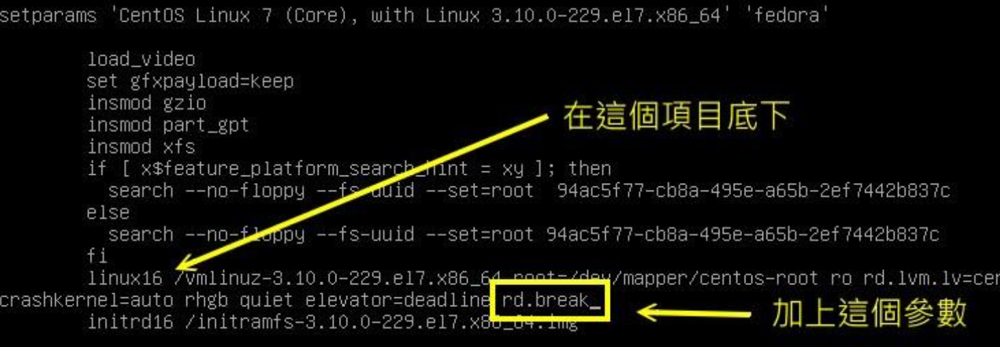

# 开机过程的问题解决

很多时候，可能要我做了某些设置，或不正常关机，而导致系统的 filesystem 错乱，因此 Linux 可能无法顺利开机，可以先尝试进入 rescue 模式去处理，下面讲解几个常见的问题

## 🍀 忘记 root 密码

原理是：只要能挂载到原来的根目录，就可以重新设置下 root 密码

在新版的 systemd 的管理机制中，默认的 rescue 模式无法直接取得 root 权限，还是需要使用 root 密码才能进入 rescure 环境，可以通过 `rd.break` 的核心参数来处理

`rd.break` 是在 Ram Disk 里的操作系统状态，因此不能直接取得原本的 Linux 系统操作环境，所以还是需要 chroot 的支持，至于 SELinux 的问题，可能还要加上某些特殊的流程才能顺利的搞定 root 密码的救援

开机进入选单编辑模式，如下图



按 ctrl + x 重启后，开机画面会出现如下类似的画面，这应该是在 RAM Disk 的环境，并不是原本的环境，因此根目录下的数据与你原本的系统无关，而且你的系统应该会被挂载到 `/sysroot` 目录下，需要这样操作

```bash
Generating "/run/initramfs/rdsosreport.txt"

Enter emergency mode. Exit the shell to continue.
Type "journalctl" to view system logs.
You might want to save "/run/initramfs/rdsosreport.txt" to a USB stick or /boot
after mounting them and attach it to a bug report.

# 无需输入密码就取得了 root 权限
switch_root:/# 
# 检查挂载点
switch_root:/# mount
...
/dev/mapper/centos-root on /sysroot type xfs (ro,relatime,attr,inode64,noquo
# 这里的权限是 ro? 不能写入，只可以读，重新挂载成可读写的
switch_root:/# mount -o remount,rw /sysroot
# 切回原本的系统环境
switch_root:/# chroot /sysroot

sh-4.2# echo "你的新密码" | passwd --stdin root
sh-4.2# touch /.autorelabel		# 很重要，变回 SELinux 的安全本文
sh-4.2# exit

switch_root:/# reboot

```

下面进行疑问解释：

- `chroot 目录`：

  表示将你的根目录「暂时」切换到 指定的目录。上面的 `sysroot` 目录我们知道是原本的系统根目录，所以就可以处理了

- 为何需要 `.autorelabel`

  在 `rd.break` 的 RAM Disk 环境下，系统是没有 SELinux 的，而刚刚更改了 `/etc/shadow` （更改密码导致），所以这个文件的 SELinux 安全本文的特性将会被取消，如果没有让系统再开机时自动恢复 SELinux 的安全本文，将产生无法登陆的问题（在SELinux 为 Enforcing 的模式下）。使用 `/.autorelabel`  表示让系统再开机时自动使用预设的 SELinux type 重新写入 SELinux 安全本文到每个文件上去

由于 `/.autorelabel` 开机恢复需要不少时间，还可以使用如下方式

- 在 rd.break 模式下，修改完 root 密码后， 将 `/etc/selinux/config`  内的 SELinux 类型改为 permissive
- 重新启动后，使用 root 身份下达 `restorecon -Rv /etc` 仅修改 /etc 下的文件
- 重新修改 `/etc/selinux/config` 内的 SELinux 类型为 enforcing，然后执行 `setenfore` 即可

## 🍀 开机直接以 root 执行 bash 的方法

还可以直接开机取得系统根目录后，让系统直接给我们一个 bash。

配置方法同样是在 linux 哪一行添加参数，不用  rd.break，而是使用 `init=/bin/bash`，同样不需要 root 密码就可以获取到 root 权限

该 bash 无法完整的操作系统，这个原理是将 PID=1 的第一个程序改为了 bash，所以最多还是用在救援方面。同样需要 remount 根目录才可以

```bash
# 直接就在根目录，所以只需要改成写模式就可以了，后续流程和上面的一样
switch_root:/# mount -o remount,rw /
```

## 🍀 因文件系统错误而无法开机

如果因为设置错误导致无法开机时，就更简单了，通常设置错误导致无法开机的文件是 `/etc/fstab` 文件，修改完成后，又没有通过  `mount -a`  来测试就重启系统了，那么就无法开机成功了，这种情况的问题大多数为下图所示


提示输入 root 密码进入救援，之后重新挂载写模式 `mount -o remount,rw /`，就可以编辑错误的设置了

如果是因为不正常关机后，导致文件系统不一致（Inconsistend）的情况，也可能出现相同的问题，如果是扇区错乱的情况，请看上图第 2 行，fsck 告知是 `/dev/md0` 错误，此时你应该利用 fsck.ext3 去检测 `/dev/md0` 才是，等到系统发现错误，并且出现 `clear[Y/N]` 时，输入 Y 尝试恢复

如果是 XFS 文件系统的话，可能需要使用  xfs_repair 指令来处理，`fsck/xfs_repair` 的处理过程可能会很长，如果你的 partition 上的 filesystem 有过多的数据顺坏时即使 `fsck/xfs_repair` 完成后，可能因为损坏了系统槽，导致某些关键系统文件数据的损坏，那么依旧是无法进入 Linux 的。此时就只能将系统中重要的数据复制出来，然后重新安装，并且检验下是否是实体硬盘有损坏的现象