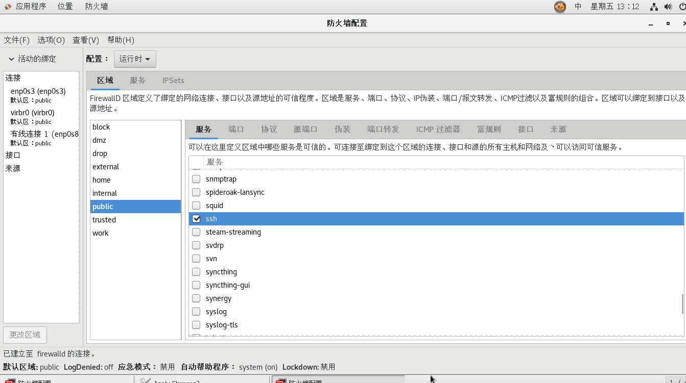
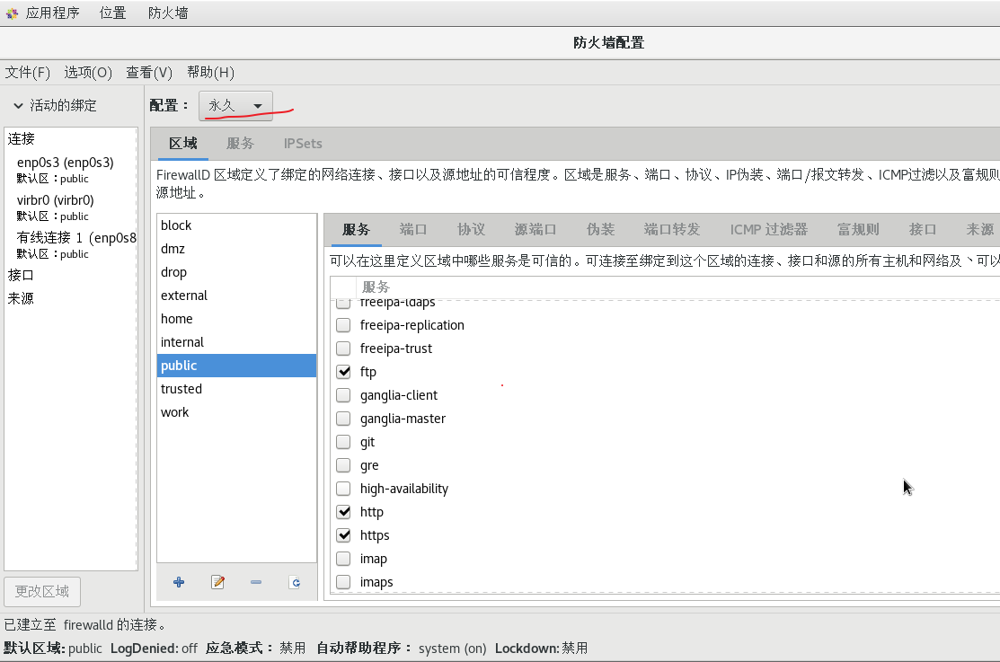

# 系统基本设置

CentOS 7 系统其实有许多东西需要来设置，包括之前谈到过的语系、日期、时间、网络等。以前有一个 setup 的软件将许多的设置做成图形界面，连防火墙都可以搞定，不过在 7.x 推出了 bash-complete 的功能，配合很多软件的指令下达设置，就还比较方便的

## 🍀 网络设置（手动设置与 DHCP 自动获取）

网络其实是很复杂的，要设置网络服务器，需要先了解  [网络基础](http://linux.vbird.org/linux_server/0110network_basic.php) ，因为没有人愿意自己的服务器老是被攻击或则是网络问题层出不穷

本章仅介绍一部单机 LInux 客户端，并非服务器，所以你需要的各项网络参数，只需要找到网络管理员或则是找到你的 ISP（Internet Service Provider），询问到网络参数的获取方式或实际的网络参数即可；通常网络参数的获取方式有如下几种：

- 手动设置固定 IP

  常用于学术网络的服务器、公司内特定工位，此种方式必须取得如下几个网络参数：

  - IP
  - 子网掩码（netmask）
  - 网关（gateway）
  - DNS：在百度搜下公用的 DNS 就知道了

- 网络参数可自动取得（dhcp 协议自动获取）

  常见于 IP 分享器后端的主机，或则是利用在线网？（cable modem），或则是学校宿舍的网络环境等。此种网络参数获取方式就被称为 dhcp，只需要设置上网方式为 dhcp 即可

- ASDL 宽带拨号

  无论你的 IP 是固定的还是每次拨号都不相同（被称为浮动式 IP），只要通过光钎或宽带调制解调器拨号上网的，就是使用这种方式。拨号上网虽然还是使用网卡链接到调制调节器上，不过，系统最终会产生一个替代调制调节器的网络接口（ppp0，一个实体网络接口）

  这种方式，找你的移动运营商就可以了

获得网络参数后，还需要知道通过什么硬件连上 Internet？其实就是网卡。目前的驻留网卡使用以太网络协议所开发出来的以太网卡（Ethernet），因此在 Linux 上这种网卡接口为 ethN（N 为数值）。比如我的测试机上有一张以太网卡，因此这主机的网络接口是 eth0（第一张卡为 0 开始）

不过新的 CentOS 7 开始对网卡的编号有另一套规则，网卡的接口代号与网卡的来源有关，基本上的网卡名称会是这样分类：

- eno1：代表由主板 BISO 内置网卡
- ens1：代表由主板 BIOS 内置的 PCI-E 接口的网卡
- enp2s0：代表 PCI-E 接口的独立网卡，可能有多个插孔，因此会有s0、s1.... 等编号
- eth0：如果上述名称都不适用，则回到原本的预设网卡编号

可以通过 `ifconfig -a` 列出你主机上的所有网卡，另外 CentOS 7 不建议直接手动修改配置文件，而是通过 nmcli 指令来设置网络参数

### 手动设置 IP 网络参数

如果你已经获取到网络参数，基本上的网络参数需要这些数据

```
method: manual # 手动设置
IP: 172.16.1.1
netmask: 255.255.0.0
gateway: 172.16.200.254
DNS: 172.162.200.254
hostname: study.centos.mrcode  # 暂时不用理会
```

cmcli 是通过一个名为「联机代号」的名称来设置是否要上网，每个「联机代号」会有一个「网卡号」，这两个通常设置为相同值

```bash
nmcli connection show [网卡代号]
```

```bash
# 查询系统上的联机代号
[root@study ~]# nmcli connection show
NAME    UUID                                  TYPE      DEVICE
enp0s3  402f740a-d5a9-4a18-8837-21df7c6771fa  ethernet  enp0s3
virbr0  e2eb3b9d-bbc2-4b8d-b73a-94183164cc47  bridge    virbr0

# NAME 联机代号、通常与后面的网卡 DEVICE 一样
# UUID：特殊设备识别号
# TYPE：网卡类型，通常是以太网卡
# DEVICE：网卡名称

# 从上面知道我们其实有两个网卡代号。可以查询这个联机代号的设置数据
[root@study ~]# nmcli connection show enp0s3
connection.id:                          enp0s3
connection.uuid:                        402f740a-d5a9-4a18-8837-21df7c6771fa
connection.stable-id:                   --
connection.type:                        802-3-ethernet
connection.interface-name:              enp0s3
connection.autoconnect:                 yes
...
ipv4.method:                            manual
ipv4.dns:                               --
ipv4.dns-search:                        --
ipv4.dns-options:                       ""
ipv4.dns-priority:                      0
ipv4.addresses:                         192.168.4.223/24
ipv4.gateway:                           --
...
IP4.ADDRESS[1]:                         192.168.4.223/24
IP4.GATEWAY:                            --
IP4.ROUTE[1]:                           dst = 192.168.4.0/24, nh = 0.0.0.0, mt = 100
IP6.ADDRESS[1]:                         fe80::3513:3436:21d:f327/64
IP6.GATEWAY:                            --
```

上面信息大写的 IP4、IP6 是目前的实际使用的网络参数，最上面的 connection 部分则是联机的状态，比较重要的参数含义如下：

- `connection.autoconnect [yes|no]`：是否开机时启动这个联机，通常预设为 yes
- `ipv4.method [auto|manual]`：自动还是手动设置网络参数
- `ipv4.dns`：DNS IP 地址
- `ipv4.addresses [IP/Netmask]`： IP 与 netmask 的集合
- `ipv4.gateway`： gateway 的 IP 地址

根据上面的设置项目，将我们的网络参数设置好

```bash
[root@study ~]# nmcli connection modify enp0s3 \
connection.autoconnect yes \
ipv4.method manual \
ipv4.addresses 192.168.110.10/24 \
ipv4.gateway 192.168.110.1
# ipv4.dns 8.8.8.8

# 上面只是修改了配置文件，还需实际生效才可以
[root@study ~]# nmcli connection up enp0s3
[root@study ~]# nmcli connection show enp0s3
IP4.ADDRESS[1]:                         192.168.110.10/24
IP4.GATEWAY:                            192.168.110.1
IP4.ROUTE[2]:                           dst = 192.168.111.0/24, nh = 0.0.0.0, mt = 100
```

笔者是虚拟机，使用 [Host Only 方式与主机共享外网](https://zq99299.github.io/note-book/_posts/virtualbox/#%E7%BD%91%E7%BB%9C%E7%AF%87-host-only%EF%BC%88win10%EF%BC%89) ，上面获取到的网络参数也是从这个网络管理器里面设置的。这样就可以让你的虚拟机上网了

### 自动获取 IP 参数

```bash
[root@study ~]# nmcli connection modify enp0s3 \
connection.autoconnect yes \
ipv4.method auto

[root@study ~]# nmcli connection up enp0s3
[root@study ~]# nmcli connection show enp0s3
```

自动的就是使用了 dhcp 服务获取的参数配置

### 修改主机名

```bash
hostnamectl [set-hostname 你的主机名]
```

```bash
# 1. 显示当前的主机名
[root@study ~]# hostnamectl
   Static hostname: study.centos.mrcode				# 主机名
         Icon name: computer-vm
           Chassis: vm
        Machine ID: e4a1acbeffac4762b2c9ed13daf9a493
           Boot ID: da0fdf95ea7f43e69ba5fd4d33c1a1b3
    Virtualization: kvm
  Operating System: CentOS Linux 7 (Core)			# 操作系统名称
       CPE OS Name: cpe:/o:centos:centos:7
            Kernel: Linux 3.10.0-1062.el7.x86_64	# 核心版本
      Architecture: x86-64							# 硬件版本

# 2. 尝试修改主机名为 www.centos.mrcode ，之后再修改回来
[root@study ~]# hostnamectl set-hostname www.centos.mrcode
[root@study ~]# cat /etc/hostname
www.centos.mrcode
[root@study ~]# hostnamectl set-hostname study.centos.mrcode
```

## 🍀 日期与时间设置

第 4 章中的 date 指令，可以进行日期、时间的设置。不过怎么修改时区呢？下次开机还会是正确的时间吗？如果有网络的话，如何进行网络校时

### 时区的显示与设置

因为地球是圆的，每个时刻每个地区的时间可能都不一样。为了统治时间，有个 GMT 格林威治时间（时区）

```bash
timedatectl [commamd]

选项与参数：
	list-timezones：列出系统上所有支持的时区名称
	set-timezone：设置时区
	set-time：设置时间
	set-ntp：设置网络校时系统
```

```bash
# 1. 显示目前的时区与时间等信息
[root@study ~]# timedatectl
      Local time: Wed 2020-04-01 17:32:12 CST		# 本地时间
  Universal time: Wed 2020-04-01 09:32:12 UTC		# URC 时间，可称为格林威治时间
        RTC time: Wed 2020-04-01 09:32:12
       Time zone: Asia/Shanghai (CST, +0800)		# 时区
     NTP enabled: no
NTP synchronized: no
 RTC in local TZ: no
      DST active: n/a

# 2. 显示出是否有 New_York 时区，若有，则将目前的时区更新
[root@study ~]# timedatectl list-timezones | grep -i new
America/New_York
America/North_Dakota/New_Salem

[root@study ~]# timedatectl set-timezone America/New_York
[root@study ~]# timedatectl
      Local time: Wed 2020-04-01 05:35:41 EDT
  Universal time: Wed 2020-04-01 09:35:41 UTC
        RTC time: Wed 2020-04-01 09:35:41
       Time zone: America/New_York (EDT, -0400)
     NTP enabled: no
NTP synchronized: no
 RTC in local TZ: no
      DST active: yes
 Last DST change: DST began at
                  Sun 2020-03-08 01:59:59 EST
                  Sun 2020-03-08 03:00:00 EDT
 Next DST change: DST ends (the clock jumps one hour backwards) at
                  Sun 2020-11-01 01:59:59 EDT
                  Sun 2020-11-01 01:00:00 EST

[root@study ~]# timedatectl set-timezone Asia/Shanghai
```

### 时间调整

调整时间的格式可以是 `yyyy-mm-dd HH:MM` 格式

```bash
# 将时间调整到正确的时间上
[root@study ~]# timedatectl set-time "2020-04-01 17:38"
```

以前使用 date 去修改日期后，还需要使用 hwclock 去修改 BIOS 记录的时间，现在通过该指令就简单多了

### 用 ntpdate 手动网络校时

使用系统默认的自动校时功能，会启动 NTP 协议相关的软件，会多开好几个 port，所以有些人也喜欢吧校正指令写入 crontab 中

```bash
[root@study ~]# ntpdate tock.stdtime.gov.tw
 1 Apr 17:42:48 ntpdate[2754]: step time server 211.22.103.157 offset 2.937308 sec

# 将时间刷入 BIOS
[root@study ~]# hwclock -w
```

上述 `tock.stdtime.gov.tw` 是某一个 NTP 服务器提供的服务，也可以百度下目前常用的 NTP 服务器地址

### 语系设置

在第 4 章中讲到过 LANG 与 locale 指令能够查询目前的语系数据与变量，也知道 `/etc/locale.conf` 其实就是语系的配置文件。

另外，系统的语系与你目前软件的语系数据可能是不一样的。还可以使用 localectl 来查询系统语系

```bash
[root@study ~]# localectl
   System Locale: LANG=zh_CN.UTF-8			# 语系系统
       VC Keymap: cn
      X11 Layout: cn

[root@study ~]# locale
LANG=zh_CN.UTF-8				# 下面的规则则是当前这个软件的语系数据
LC_CTYPE="zh_CN.UTF-8"
LC_NUMERIC="zh_CN.UTF-8"
LC_TIME="zh_CN.UTF-8"
LC_COLLATE="zh_CN.UTF-8"
LC_MONETARY="zh_CN.UTF-8"
LC_MESSAGES="zh_CN.UTF-8"
LC_PAPER="zh_CN.UTF-8"
LC_NAME="zh_CN.UTF-8"
LC_ADDRESS="zh_CN.UTF-8"
LC_TELEPHONE="zh_CN.UTF-8"
LC_MEASUREMENT="zh_CN.UTF-8"
LC_IDENTIFICATION="zh_CN.UTF-8"
LC_ALL=

```

可以看到，一个是系统的语系，一个是当前这个 bash 的语系，可以通过如下方式修改系统语系

```bash
[root@study ~]# localectl set-locale LANG=en_US.utf8
# 之前讲过的这个是切换到文本模式
[root@study ~]# systemctl isolate multi-user.target
[root@study ~]# systemctl isolate graphical.target
# 这里需要注意的是：虽然有时候看到的语言是 zh_CN.UTF-8，但是其实后面是没有斜杠的
# 比如这里要换成中文的，那么就要设置成 zh_CN.utf8  才可以，不然看着设置成功了，但是图形界面还是英文的
```

重启后，从感官上在终端模式你可能感受不到什么变化，但是你进入图形化界面，就会发现整个环境都变成英文的了

## 🍀 防火墙简易设置

有网络没有防火墙是有点危险

防火墙其实是一种网络数据的过滤方式，它可以根据服务器启动的服务来设置是否放行，也能够针对你信任的用户来放行。这部分应该要对网络有点概念之后才来讨论比较好，所以详细的数据会写在服务器篇的内容。

目前 CentOS 7 的预设防火墙机制为 firewalld，它的管理主要是通过  firewall-cmd 指令，但是目前我们没有学习更多的防火墙与网络规则，想要了解 firewall-cmd 有点难，所以本小节仅适用图形界面来介绍防火墙的相关数据




- 配置：「运行时」与「永久」的差异

  基本上防火墙的规则大概有两种情况，暂时用来执行的规则与永久记录的规则。一般来说，刚刚启动防火墙时，这两种规则会一模一样。如果在运行时中你加上了几条规则测试后，没有写入永久记录里面的话，那么下次重新启动防火墙时，该规则就会消失

- 区域：根据不同的环境所设计的网络区域

  玩过网络后，你可能会听说过所谓的本机网络、NAT 与 DMZ 等网域，同时可能还有可信任的（trusted）网域，或则是应该被抵挡（drop/block）的网域等等。这些网域各有特点，早期的 iptables 防火墙服务，所有的规则都需要你自己手动来编写，然后规则的细分需要自己去规划，所以很可能会导致一堆无法理解的规则

  新的 firewalld 服务就预先设计这些可能会被用到的网络环境，里面的规则除了 public（公开网域）外，其他的区域则暂时为没有启动的状态

  在本章只需要考虑 public 这个区域即可，其他的等你学习了服务器篇再讨论

- 相关设置项目

  防火墙规则通常需要设置的地方有：

  - 服务：一般来说，如果是作为 internet 的服务器，提供的是比较一般的服务，只需要处理该项即可。默认你的服务器已经提供了 ssh 与 dhcpv6-client 的服务端口
  - 端口：如果你提供的服务所启用的端口并不是正规的端口，比如为了玩 systemd 与 SELinux，我们曾经将 ssh 的端口调整到 222，那么如果你想过要让人家连进来，除了「服务」外，还需要对「端口调整」。另外如果某些比较特别的服务时 CentOS 预设没有提供的，所以在 「服务」中也是不存在的，这时可以直接通过端口来搞定
  - 富规则：如果你有整个网域需要放行或者是拒绝的时候，那么前两个项目就无法适用了。
  - 接口：该区域针对哪一个网卡来做限制。

  至于伪装、端口转发、ICMP 过滤器、来源等这里不介绍，这属于网络的概念知识，基础篇不讲解。


下面进行练习示例：

  - 要作为 ssh、www、ftp、https 等正规端口的服务
  - 同时与前几章搭配，需要放行 port 222 与 port 555
  - 局域网络 192.168.1.0/24 这一段想要直接放行这段网域对我们服务器的联机

  以上需求需要怎么配置？因为需要永久生效，所以需要在永久里面去修改才行，同时因为永久设置比较重要，在进入时需要先进行授权（弹框让你输入密码）



勾选上 ftp、http、https、ssh，勾选即生效了

下面进行端口的配置


添加上 222 与 555 端口。

下面开始处理局域网络的放行，由于书上说是在富规则里面配置的，但是这个 UI 配置有点问题？所以使用命令来配置的

```bash
[root@study ~]# firewall-cmd --permanent --add-rich-rule='rule family="ipv4" source address="192.168.1.0/24" accept'
success
[root@study ~]# firewall-cmd --reload
success
```
使用命令之后，在界面上出现了配置，如下


