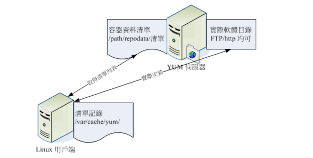

上一章节讲过以源码方式，在实践过程中也发现了，有一定难度的，在安装、升级等方面都需要自己手动来管理，比较麻烦

## 🍀 Linux 界的两大主流 RPM 与 DPKG

自由软件的蓬勃发展，各大 distribution 出现了，但是有一个很头疼的问题就是软件的管理，当软件有漏洞时，如何修补？使用 tarball 方式来管理？又常常不晓得我们安装过哪些程序，因此开始思考 Linux 的软件管理方式

Linux 开发商在固定的硬件平台与操作系统平台上面将需要安装或升级的软件编译好，然后将整个软件的所有相关文件打包为一个特殊格式的文件，在这个软件文件内还包含了预先检测系统与相依软件的脚本，并提供记载该软件提供的所有文件信息等。最终将该文件释出。**客户端取得这个文件后，只要通过特定的指令来安装，那么该软件文件就会依照内部的脚本检测相依的前驱软件是否存在，若安装的环境符合需求，那就开始安装**，安装完成后，还会将该软件的信息写入软件管理机制中，以达成未来可以进行升级、移除等动作

目前在 Linux 界软件安装方式最长久的有两种：

- dpkg

  最早由 Debian Linux 社群开发出来的，通过 dpkg 的机制，Debian 提供的软件就能够简单的安装起来。只要是衍生与 Debian 的其他 Linux distribution 大多使用 dpkg 这个机制来管理软件，包括 B2D、Ubuntu 等

- RPM

  最早由 Red Hat 公司开发出来的，后来实在很好用，因此很多 distribution 就使用该机制作为软件安装的管理方式。

不论 dpkg、rpm 这些机制都会涉及到软件相依的问题，每个软件文件都有提供相依属性的检查，如果将相依属性的数据做成列表，等到实际软件安装时，若有发生相依属性的软件状况时，管理机制自动去获取想依赖的软件同时安装

| distribution 代表 | 软件管理机制 |   使用指令    |  在线升级机制  |
| :---------------: | :----------: | :-----------: | :------------: |
|  Red Hat/Fedora   |     RPM      | rpm、rpmbuild |   YUM（yum）   |
|   Debian/Ubuntu   |     DPKG     |     dpkg      | APT（apt-get） |

## 🍀 什么是 RPM 与 SRPM

RPM 全名 RedHat Package Manager，是以一种数据库记录的方式将你所需要的软件安装到你的 Linux 系统的一套管理机制

最大的特点：将你要安装的软件先编译过，并且达成 RPM 机制的包装文件，通过包装文件里面的默认的数据库记录，记录这个软件要安装的时候必须具备的相依属性软件，当安装在你的 Linux 主机时，RPM 会先依照软件里的数据查询 Linux 主机的相依属性是否满足，若满足则安装，若不满足，则不安装。那么安装的时候就将该软件的信息整个写入 RPM 的数据库，以便未来的查询、验证与卸载，优点：

1. 不需要再重新编译：由于已经变异完成并且打包完毕，所以软件传输与安装上很方便
2. 由于软件的信息都已经记录在 Linux 主机的数据库上，很方便查询、升级与卸载

优点即缺点，由于软件已经事先编译好的，该软件几乎只能安装在原本默认的硬件与操作系统版本中。

所以，通常不同的 distribution 所释出的 RPM 文件，并不能用在其他的 distribution 上。因此可以发现这些软件管理机制的问题是：

1. 软件文件安装的环境必须与打包时的环境需求一致或相当
2. 需要满足软件的相依属性需求
3. 卸载时需要特别小心，最底层的软件不可以先移除，否则可能造成整个系统的问题

那怎么办？如果就要安装其他 distribution 提供的好用的 RPM 软件文件时，就可以使用 SRPM 。

SRPM：Source RPM，就是这个 RPM 文件里含有原码。特别注意，这个 SRPM 所提供的软件内容并没有经过编译，它提供的是源码

通常 SRPM 的扩展名是 `***.src.rpm` 格式来命名。它提供了参数配置文件（configure 与 makefile），所以安装 SRPM 的软件时，需要：

1. 先将该软件以 RPM 管理的方式编译，此时 SRPM 会被编译为 RPM 文件
2. 然后将编译完成的 RPM 文件安装到 LInux 系统中

他的好处就是，我们可以通过修改 SPRM 内的参数配置文件，然后重新编译产生能适合我们 Linux 环境的 RPM 文件。

| 文件格式 | 文件名格式 | 直接安装与否 | 内涵程序类型 | 可否修改参数并编译 |
| :------: | :--------: | :----------: | :----------: | :----------------: |
|   RPM    |   xx.rpm   |      可      |    已编译    |        不可        |
|   SRPM   | xx.src.rpm |     不可     |  未编译源码  |        可以        |

## 🍀 什么是 i386、i586、i686、noarch、x86_64

从上面我们可以知道，RPM 与 SRPM 的格式为

```bash
xx.rpm					# RPM 格式，已经经过编译且包装完成的 rpm 文件
xxx.src.rpm			# SRPM 格式，包含未编译的源码信息
```

可以通过文件名知道这个软件的版本、适用的平台、编译输出的次数，比如 `rp-pppoe-3.11-5.e17.x86_64.rpm`

```bash
rp-pppoe	-	  3.11		-	    5			.e17.x86_64			.rpm
软件名称			软版本信息   释出的次数		适合的硬件平台		扩展名
```

每项含义：

- 软件名称：每一个软件的名称

- 版本信息

  每一次更新版本就需要有一个版本的信息，通常又分为主版本与次版本。

  以上面为例：主板吧为 3，在主板吧的架构下更动部分源码内容，而释出一个新的版本，就是次版本

- 释出版本次数

  通常就是编译的次数，那么为何需要重复编译呢？由于同一版的软件中，可能由于某些 bug 或安全上的顾虑，所以必须进行小幅度的 patch 或重设一些编译参数。设置完成后，重新编译打包成 RPM 文件，因此就有不同的打包数出现

- 操作硬件平台

  由于 RPM 可以适用在不同的操作平台上，但是不同的平台设置的参数还是有所差异的，并且，可以针对比较高阶的 CPU 来进行优化参数的设置。所以就有了 i386、i586、i686、noarch、x86_64 等文件名的出现

  - i386：

    几乎适用于所有的 x86 平台，不论是旧的 pentum 或则是新的 Intel Core 2 与 K8 系列的 CPU 等等，都可以正常的工作，i 指 Intel 兼容的 CPU，386 则是 CPU 等级

  - i586

    针对 586 等级的计算机进行优化编译。CPU 包括 pentum 第一代 MMX CPU、AMD 的 k5、k6 系列 CPU（socket7 插脚）等等的 CPU 都算是这个等级

  - i686

    在 pentun II 以后的 intel 系列 CPU，及 K7 以后等级的 CPU 都属于 686 等级。由于目前市面上几乎仅剩 P-II 以后等级的硬件平台，因此很多 distribution 都直接释出这种等级的 RPM 文件
    
   - x86_64

     针对 64 位 CPU 进行优化编译设置，包括 Intel 的 Core2 以上等级 CPU，以及 AMD 的 Athlon64 以后等级的 CPU，都属于这一类型的硬件平台

  - noarch

    没有任何硬件等级上的限制。一般来说，这种类型的 RPM 文件，里面应该没有 binary program 存在，常出现的就是属于 shell script 方面的软件

由于时代发展，目前大概也只剩下 i686 以及 x86_64 还有不分版本的 noarch 。受惠于目前 x86 系统的支持方面，新的 CPU 都能执行旧 CPU 所支持的软件，也就是说硬件方面都可以向下兼容，因此 **最低等级的 i386 软件可以安装在所有的 x86 硬件平台上**，不论是 32 位还是 64 位。

根据上面的说明，其实我们只要选择 i686 版本来安装在你的 x86 硬件上就肯定没有问题。但是如果强调性能的话，还是选择搭配你硬件的 RPM 文件吧。毕竟该软件针对你的 CPU 硬件平台进行过参数优化的编译

## 🍀 RPM 的优点

由于 RPM 是通过预先编译并打包成 RPM 文件格式后，再加以安装的一种方式，并且还能够进行数据库的记录 。所以优点如下：

- RPM 内含已经编译过的程序与配置文件等数据，可以让用户免除重新编译的困扰
- RPM 在被安装之前，会先检查系统的硬盘容量、操作系统版本等，可避免文件被错误安装
- RPM 文件本身提供软件版本信息、相依属性软件名称、软件用途说明、软件所含文件等信息，便于了解软件
- RPM 管理的方式使用数据库记录 RPM 文件的相关参数，便于升级、移除、查询与验证

由于有软件的相依属性，当你安装 RPM 形态提供的软件时，RPM 会校验数据库中是否已经存在相关的软件了，如果不存在，那么这个 RPM 文件预设就不能安装，这个就是 RPM 类型的文件最为人所诟病的 **软件的属性相依** 问题

## 🍀 RPM 属性相依的克服方式：YUM 在线升级

为了重复利用现有软件功能，因此很多软件都会以函数库的方式释出部分功能，以方便其他软件的调用，为了节省用户的数据量，目前的 distribution 在释出软件时，都会将软件的内容分为一般使用者与开发使用者两类。所以才会常常看见有类似 `pam-x.x.rpm 和 pam-devel-x.x.rpm` 之类的文件名，而预设情况下，大部分的 software-devel-x.x.rpm 都不会安装，因为终端用户大部分不会去开发软件

因为由上述的现象，因此 RPM 软件文件就会有所谓的属性相依问题的产生（其实所有的软件管理几乎都有着方面的情况存在）。

由于 RPM 软件文件内部会记录相依属性数据，YUM 在安装软件时，先找到这个相依属性列表，然后与系统内已安装软件进行比较，没有安装到的相依软件同时安装起来，这就解决了属性相依问题

CentOS：

1. 先将释出软件放置到 YUM 服务器内
2. 再分析这些软件的相依属性问题，将软件内的记录信息写下来（header）

然后将这些信息分析后记录成软件相关性的列表，这些列表数据与软件所在的本机或网络位置可以称呼为容器或软件仓库或软件库（repository）。当客户端有软件安装的需求时，客户端主机会主动的向网络上面的 yum 服务器的软件库网址下载清单列表，然后通过列表的数据与本机 RPM 数据库已存在的软件数据比较，就能够一次性安装所有需要的具有相依属性的软件了。整个流程可以简单的如下图所示：



当客户端有升级、安装的需求时，yum 会向软件库要求清单的更新，等到清单更新到本机的`/var/cache/yum` 里面后，等一下更新时就会用这个本机清单与本机的 RPM 数据库进行比较，这就知道该下载上面软件。

接下来 yum 会跑到软件库服务器（yum server）下载所需要的软件（因为由记录软件所在的网址），然后通过 RPM 的机制开始安装软件

